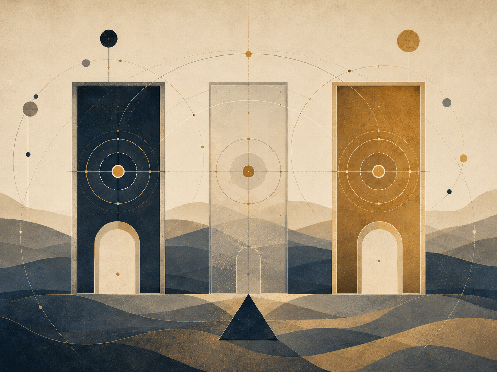

THE LOGICAL VERSION

# Between Potential and Ideal

A tightened version: structure, distinctions, conditions, and conclusions

![Unique cover illustration for the logical ../../figures/cover_philosophical_recursion_whole_diagram.png)

Cover image description: a recursive structure showing source, model, world, and action as related layers.

A logical presentation of potential, ideal, optimality, friction, witness, and the passage from the possible to the worthy.

Author: me · May 2026

## Interactive Table of Contents

Click any item to jump directly to the relevant place in the document, including opening material, chapters, subsections, and closing sections.

1. [Cover](#cover-page)
2. [Abstract](#Abstract)
3. [1. A Model, Not a Final Declaration](#1.-A-Model-Not-a-Final-Declaration)
4. [2. Potential, Ideal, and Optimal](#2.-Potential-Ideal-and-Optimal)
5. [3. The River, the Boat, and Choice](#3.-The-River-the-Boat-and-Choice)
6. [4. Source, Information, Tool, and
   Witness](#4.-Source-Information-Tool-and-Witness)
7. [Artificial Intelligence and Open Problems](#Artificial-Intelligence-and-Open-Problems)
8. [I Have No Mouth, and I Must Scream](#I-Have-No-Mouth-and-I-Must-Scream)
9. [5. Distance, Suffering, Limitation, and
   Meaning](#5.-Distance-Suffering-Limitation-and-Meaning)
10. [Education of Potential](#Education-of-Potential)
11. [6. What the Theory Does Not Claim - and
    the Tight Summary](#6.-What-the-Theory-Does-Not-Claim---and-the-Tight-Summary)
12. [7. The Architecture of Infinite Recursion:
    A Logical Model of Delegation, Login, Agent, and Drainage](#7.-The-Architecture-of-Infinite-Recursion-A-Logical-Model-of-Delegation-Login-Agent-and-Drainage)
13. [The Recursive Edge](#The-Recursive-Edge)
14. [A. The
    Reset Failure: Bias as the Gravity of the Base](#A.-The-Reset-Failure-Bias-as-the-Gravity-of-the-Base)
15. [P versus NP Note](#P-versus-NP-Note)
16. [B.
    The Descent: I-Vers -> Omniverse -> AI Platform -> Model-Space
    -> Multiverse -> Universe -> Login -> Agent ->
    Prompt](#B.-The-Descent-I-Vers---Omniverse---AI-Platform---Model-Space---Multiverse---Universe---Login---Agent---Prompt)
17. [C. Iteration, Reset,
    and the Set of Ideals](#C.-Iteration-Reset-and-the-Set-of-Ideals)
18. [D.
    Existence as the Psychological Couch of the I-Vers](#D.-Existence-as-the-Psychological-Couch-of-the-I-Vers)
19. [E.
    The Ascent: Cascading Convergence and Recursive Drainage](#E.-The-Ascent-Cascading-Convergence-and-Recursive-Drainage)
20. [8. Computation, Evidence, Reduction, and
    Incompleteness](#8.-Computation-Evidence-Reduction-and-Incompleteness)
21. [Science, Physics, and Mathematics as Boundary Discipline](#Science-Physics-and-Mathematics-as-Boundary-Discipline)
22. [Locality, Non-locality, and Contextuality](#Locality-Non-locality-and-Contextuality)
23. [1. A problem as a
    language: what is being decided?](#1.-A-problem-as-a-language-what-is-being-decided?)
24. [2. The Turing
    machine: what counts as computation?](#2.-The-Turing-machine-what-counts-as-computation?)
25. [3. NP : verifiable evidence,
    not “hard problems”](#3.-N-P--verifiable-evidence-not-hard-problems)
26. [4.
    Reductions and NP -completeness: when
    difficulty concentrates in a node](#4.-Reductions-and-N-P--completeness-when-difficulty-concentrates-in-a-node)
27. [5. c o NP : the
    complementary side of evidence](#5.-c-o-N-P--the-complementary-side-of-evidence)
28. [6.
    The polynomial hierarchy: from one witness to layers of
    quantification](#6.-The-polynomial-hierarchy-from-one-witness-to-layers-of-quantification)
29. [7. QBF and PSPACE :
    when solution becomes strategy](#7.-Q-B-F-and-P-S-P-A-C-E--when-solution-becomes-strategy)
30. [8. Linear
    algebra: state, operation, and decomposition](#8.-Linear-algebra-state-operation-and-decomposition)
31. [9. Matrix
    diagonalization: an image of change of basis](#9.-Matrix-diagonalization-an-image-of-change-of-basis)
32. [10. Two
    kinds of diagonal: decomposition versus boundary](#10.-Two-kinds-of-diagonal-decomposition-versus-boundary)
33. [11. Gödel: a system
    that cannot close itself](#11.-Gödel-a-system-that-cannot-close-itself)
34. [12. Human, system, and
    meta-level](#12.-Human-system-and-meta-level)
35. [13.
    One map: representation, transition, resource, evidence, boundary](#13.-One-map-representation-transition-resource-evidence-boundary)
36. [14. Ending: an ideal that
    is not closure](#14.-Ending-an-ideal-that-is-not-closure)
37. [9. Creation, Canon, and Optimum: What Must
    Not Be Lost](#9.-Creation-Canon-and-Optimum-What-Must-Not-Be-Lost)
38. [Art of Potential](#Art-of-Potential)
39. [Music of Potential](#Music-of-Potential)
40. [The single-axis optimum](#The-single-axis-optimum)
41. [Creative
    recursion: when the work begins to think itself](#Creative-recursion-when-the-work-begins-to-think-itself)
42. [The harmonic optimum](#The-harmonic-optimum)
43. [Franchise:
    when potential expands after the ideal appears](#Franchise-when-potential-expands-after-the-ideal-appears)
44. [Canon as invariant](#Canon-as-invariant)
45. [Adaptation as cultural
    reduction](#Adaptation-as-cultural-reduction)
46. [The Dark
    Tower: a body of work trying to become whole](#The-Dark-Tower-a-body-of-work-trying-to-become-whole)
47. [Genres as forms of potential](#Genres-as-forms-of-potential)
48. [The ideal as refusal of
    potential](#The-ideal-as-refusal-of-potential)
49. [False ideal](#False-ideal)
50. [What a great work really
    does](#What-a-great-work-really-does)
51. [10. Engineering and Architecture of Potential](#10.-Engineering-and-Architecture-of-Potential)
52. [1. Blueprint Is Not Building](#1.-Blueprint-Is-Not-Building)
53. [2. Material: Potential with Limits](#2.-Material-Potential-with-Limits)
54. [3. Load: Reality Entering the Form](#3.-Load-Reality-Entering-the-Form)
55. [4. Safety Factor: The Admission That We Are Not God](#4.-Safety-Factor-The-Admission-That-We-Are-Not-God)
56. [5. Stress and Strain: How Matter Says It Hurts](#5.-Stress-and-Strain-How-Matter-Says-It-Hurts)
57. [6. Crack: A Small Truth Before a Large Collapse](#6.-Crack-A-Small-Truth-Before-a-Large-Collapse)
58. [7. Foundations: What Is Unseen Holds What Is Seen](#7.-Foundations-What-Is-Unseen-Holds-What-Is-Seen)
59. [8. Architecture: A Form People Live Inside](#8.-Architecture-A-Form-People-Live-Inside)
60. [9. Function and Form: Who Serves Whom?](#9.-Function-and-Form-Who-Serves-Whom?)
61. [10. Movement: How a Structure Thinks Through the Body](#10.-Movement-How-a-Structure-Thinks-Through-the-Body)
62. [11. Light: The Non-material Material](#11.-Light-The-Non-material-Material)
63. [12. Resonance: When Structure and Rhythm Meet](#12.-Resonance-When-Structure-and-Rhythm-Meet)
64. [13. Redundancy: Not Every Excess Is Waste](#13.-Redundancy-Not-Every-Excess-Is-Waste)
65. [14. Maintenance: The Truth After the Opening](#14.-Maintenance-The-Truth-After-the-Opening)
66. [15. Failure: When the Ideal Meets What It Excluded](#15.-Failure-When-the-Ideal-Meets-What-It-Excluded)
67. [16. Architecture of Responsibility](#16.-Architecture-of-Responsibility)
68. [11. Economy of Relation](#11.-Economy-of-Relation)
69. [1. There Is No Absolute Up or Down](#1.-There-Is-No-Absolute-Up-or-Down)
70. [2. Money: Portable Potential](#2.-Money-Portable-Potential)
71. [3. Gold, Fiat, and the Search for Ground](#3.-Gold-Fiat-and-the-Search-for-Ground)
72. [4. Purchasing Power: What the Sign Still Opens](#4.-Purchasing-Power-What-the-Sign-Still-Opens)
73. [5. Real Exchange Rate: Relation Inside Relation](#5.-Real-Exchange-Rate-Relation-Inside-Relation)
74. [6. Inflation: When the Sign Begins to Speak Weakly](#6.-Inflation-When-the-Sign-Begins-to-Speak-Weakly)
75. [7. The Market: Mirror, Not God](#7.-The-Market-Mirror-Not-God)
76. [8. Credit and Debt: The Future Entering the Present](#8.-Credit-and-Debt-The-Future-Entering-the-Present)
77. [9. Interest: The Price of Time, the Price of Risk](#9.-Interest-The-Price-of-Time-the-Price-of-Risk)
78. [10. Labor: Potential Passing Through a Body](#10.-Labor-Potential-Passing-Through-a-Body)
79. [11. Profit: Creation or Extraction](#11.-Profit-Creation-or-Extraction)
80. [12. Externality: What the Price Left Outside](#12.-Externality-What-the-Price-Left-Outside)
81. [13. Inequality, Bubble, Growth, Crisis, and Repair](#13.-Inequality-Bubble-Growth-Crisis-and-Repair)
82. [12. Governance of Potential](#12.-Governance-of-Potential)
83. [Law of Potential: Justice Under Limitation](#Law-of-Potential-Justice-Under-Limitation)
84. [Medicine of Potential](#Medicine-of-Potential)
85. [1. State of Nature Is Not Only the Past](#1.-State-of-Nature-Is-Not-Only-the-Past)
86. [2. Law: Constraint That Enables Shared Freedom](#2.-Law-Constraint-That-Enables-Shared-Freedom)
87. [3. Legitimacy: Why People Agree to Obey](#3.-Legitimacy-Why-People-Agree-to-Obey)
88. [4. Sovereignty: Who Holds the Last Decision?](#4.-Sovereignty-Who-Holds-the-Last-Decision?)
89. [5. Separation of Powers: Designed Suspicion](#5.-Separation-of-Powers-Designed-Suspicion)
90. [6. Elections: Measuring Will, Not Truth](#6.-Elections-Measuring-Will-Not-Truth)
91. [7. Rights: Boundaries Society Places on Itself](#7.-Rights-Boundaries-Society-Places-on-Itself)
92. [8. Duties: The Other Side of Possibility](#8.-Duties-The-Other-Side-of-Possibility)
93. [9. Institution: Public Memory with Responsibility](#9.-Institution-Public-Memory-with-Responsibility)
94. [10. Bureaucracy: When Form Forgets Life](#10.-Bureaucracy-When-Form-Forgets-Life)
95. [11. Corruption: When the Medium Is Sold from Within](#11.-Corruption-When-the-Medium-Is-Sold-from-Within)
96. [12. Taxes: Trust Collected by Force](#12.-Taxes-Trust-Collected-by-Force)
97. [13. Legal Force: The Violence Society Tries to Bind](#13.-Legal-Force-The-Violence-Society-Tries-to-Bind)
98. [14. Emergency: When the Ideal Is Tempted to Abandon Itself](#14.-Emergency-When-the-Ideal-Is-Tempted-to-Abandon-Itself)
99. [15. Civil Society, Public Language, and Repair](#15.-Civil-Society-Public-Language-and-Repair)
100. [13. The Imaginary, the Virtual, Gravity,
     and the Horizon](#13.-The-Imaginary-the-Virtual-Gravity-and-the-Horizon)
101. [Boundary Horizons](#Boundary-Horizons)
102. [The Imaginary](#The-Imaginary)
103. [The Virtual](#The-Virtual)
104. [The Box That Cannot Be
     Emptied](#The-Box-That-Cannot-Be-Emptied)
105. [Potential and Ideal](#Potential-and-Ideal)
106. [Gravity](#Gravity)
107. [Black Hole and White Hole](#Black-Hole-and-White-Hole)
108. [The Radiation of the Black
     Hole](#The-Radiation-of-the-Black-Hole)
109. [Event Horizons of Trust](#event-horizons-of-trust)
110. [God, the Whole, and
     Caution with the Name](#God-the-Whole-and-Caution-with-the-Name)
111. [14. Mass-Energy and Medium - A Precise
     Image, Not a Proof](#14.-Mass-Energy-and-Medium---A-Precise-Image-Not-a-Proof)
112. [15. Physical Comparison Map — Potential, Form, and the Theories That Try to Unify Physics](#physical-comparison-map-potential-form-and-the-theories-that-try-to-unify-physics)
113. [Universe Structure / Geometry of the Universe and the Shape of Potential](#Universe-Structure--Geometry-of-the-Universe-and-the-Shape-of-Potential)
114. [High-Energy Physics](#High-Energy-Physics)
115. [Black Holes, Event Horizons, and the Holographic Principle](#Black-Holes-Event-Horizons-and-the-Holographic-Principle)
116. [The Physical Spine](#the-physical-spine)
117. [What It Does and Does Not Offer](#what-it-does-and-does-not-offer)
118. [Chapter ?: ↓](#Chapter-?)
119. [Chapter ?: ↓](#Chapter-?-1)
120. [Chapter ?: .](#Chapter-?-.)
121. [Chapter ?: .](#Chapter-?-.-1)
122. [Chapter ?: .](#Chapter-?-.-2)
123. [Chapter ?: ↓](#Chapter-?-2)
124. [Chapter \*: Understanding](#Chapter-*-Understanding)
125. [Chapter •: Application](#Chapter-•-Application)
126. [Sources,
     Inspirations, Ideas, and Acknowledgements](#Sources-Inspirations-Ideas-and-Acknowledgements)
127. [Philosophical Lineage](#Philosophical-Lineage)
128. [Mathematics, Logic, and
     Forms of Thought](#Mathematics-Logic-and-Forms-of-Thought)
129. [Physics, Cosmology, and
     Information](#Physics-Cosmology-and-Information)
130. [Artificial
     Intelligence, Consciousness, and Contemporary Mirrors](#Artificial-Intelligence-Consciousness-and-Contemporary-Mirrors)
131. [Works, Stories, and
     Edge-Images](#Works-Stories-and-Edge-Images)
132. [Acknowledgements and Source
     Note](#Acknowledgements-and-Source-Note)
133. [Bibliography and Source
     Notes](#Bibliography-and-Source-Notes)

**Reading note:** Scientific, logical or mathematical terms in this document should be read by context — as formal claims only when explicitly stated, and as metaphors when used as structural images.

## Abstract

The theory proposes a way of thinking about existence, meaning,
suffering, and intelligence through three distinctions: potential,
ideal, and optimal.

Potential is the field of possibility: everything that can appear,
occur, be experienced, or be made. Ideal is possibility after moral
clarification: not everything that can be, but what ought to be. Optimal
is the way the ideal can appear inside a real, limited situation without
lying about the conditions in which it acts.

According to this model, existence is not proof that reality is
already good or complete. It is a process in which morally blind
possibility may become morally intelligible. The absolute is not the
ideal. The fact that something can be does not mean that it ought to
be.

This is why the theory can be called nihilism with hope. It takes
seriously the possibility that meaning is not given in advance. But it
does not stop there. If meaning is not the starting point of existence,
perhaps meaning is what existence may become.

In this region, Dostoevsky and Nietzsche are not authorities for the theory, but two depth-tests. Dostoevsky asks what happens when an idea too large enters an actual human being: the goodness of Prince Myshkin, almost like a gentle God moving through a world not ready for him, cannot conquer reality or arrange it into innocence. Even when he reaches toward the murderer of the woman he loves, his compassion does not redeem the story; it reveals how little the world can bear a goodness that does not know how to become power. Nietzsche, from the other side, asks whether every such ideal may already be becoming an idol: consolation instead of life, morality concealing weakness, compassion concealing control. Between them, the task of the theory becomes sharper: to preserve the potential of repair without turning it into false redemption, and to preserve a living ideal without turning it into a statue.

The central image is a river. The universe is the river, existence is
the boat, and potential and ideal are the two banks. A person does not
control the river, but neither is a person meaningless inside it. The
task is navigation under uncertainty. Sometimes there is progress;
sometimes there is drift or return. Value is not measured only by static
perfection, but by the distance a person travels against the gravity of
their conditions.

## 1. A Model, Not a Final Declaration

The theory is not presented as proven science, a new religion, or a
closed system that cannot be challenged. It is an
existential-metaphysical model: a way of thinking about the relation
between potential, ideal, limitation, experience, and meaning. Its
strength is not that it proves itself from outside, but that it
organizes a series of intuitions into one structure without denying the
cost of existence.

Therefore, the theory must distinguish metaphorical language from
physical claims. When it uses words such as energy, weight, boundary,
field, or medium, it does so carefully: sometimes in a limited physical
sense, and sometimes as a structural metaphor. The precision of the
theory depends on not confusing the two.

This methodological position matters because it protects the theory
from two opposite failures. On one side, it does not abandon the
ambition to say something about the structure of existence; it is not
merely a private mood. On the other side, it does not ask the reader to
accept an uncontrolled leap from physics to purpose, or from personal
experience to universal law. It asks to be judged as a careful structure
of meaning, not as a mechanism that cancels criticism.

The right question is therefore not “is this proven like a
mathematical theorem,” but “does the structure hold without confusing
domains, justifying pain, or turning hope into blind belief.” In this
sense, the model seeks strength precisely by marking its limits.

To call this a model means that it offers a map of relations, not ownership of reality. A good map does not replace the road, and it does not release the traveler from checking where they stand. It only makes certain relations visible: possibility and form, pain and responsibility, freedom and cost, hope and the danger of turning hope into an empty promise.

The model must therefore pass three tests. The first is the test of distinctions: whether it preserves the difference between potential, ideal, and optimal. The second is the test of domains: whether it knows when it is doing philosophy, when it is using metaphor, and when it is approaching scientific language. The third is the test of humanity: whether it avoids justifying suffering, reducing a person to a case, or turning complexity into an answer that is too easy.

In this sense, the theory does not ask for immunity from criticism. It needs criticism so that it does not inflate beyond what it can honestly carry. Every large claim must return to the ground: to a body, a time, an example, and a case in which a real person could be harmed by careless reading. If the model cannot stand there, it is not mature enough.

The model also does not replace existing sources. It may learn from theology, philosophy, literature, science, and computation, but it must not borrow an authority that is not its own. When it relies on an image, it must say that it is an image. When it uses a logical structure, it must show the boundary of that structure. When it uses a scientific term, it must avoid turning the term into metaphysical decoration.

This opening chapter is therefore necessary, not merely technical. It sets the ethics of reading: belief is not required, but cynicism is not enough either. The reader is asked to test whether the structure makes relation, boundary, and responsibility more visible. If it does, it has value. If it does not, it must be corrected. The very possibility of correction is part of the theory's honesty.

A further methodological distinction is needed here: being a model is not a weakness compared with being a closed system; it is a condition of honesty. A system that declares itself final too early begins to defend itself instead of examining itself. A model remains answerable to the questions from which it was born: whether its distinctions hold, whether its transitions are justified, and whether the reader can see where a claim ends and a metaphor begins.

The logical version is therefore not meant to make the theory colder, but more responsible. It breaks the language into steps so that no leap is disguised as a conclusion. Potential is not ideal; ideal is not optimal; optimal does not prove that the path is perfect. Each term has a different role, and confusion between them is the source of most dangerous readings.

Even when the model uses broad language, it must remain stoppable. One must be able to say: here this is an image; here this is a value claim; here this is an inspiration from science or computation; here there is not yet proof. The ability to stop the sentence before it becomes an excessive declaration belongs to the structure itself.

The first chapter is therefore not merely a cautious introduction. It lays down the working conditions for everything that follows. If the reader accepts the model, they are not asked to believe it but to test it. If they reject it, the rejection can still be useful if it shows where a distinction is weak, where a transition is too fast, or where an image borrows authority it has not earned.

In this way, the model keeps two loyalties at once: loyalty to the daring of the theory and loyalty to the humility of critique. Without daring, there are only scattered notes. Without humility, there is a system that may make itself too immune. The logical ideal of the chapter is to hold both forces together.

## 2. Potential, Ideal, and Optimal

Potential is everything that can appear. It is wider than good, wider
than evil, wider than form, and wider than meaning. Potential alone is
therefore not goodness. It is the material of possibility before
clarification. The ideal is not everything that can be, but what is
worthy of being after possibility has passed through boundary, relation,
responsibility, and consequence.

The optimal is the local translation of the ideal into a specific
situation. It is neither lazy compromise nor absolute perfection. It
asks: within these conditions, with this knowledge, this body, this
fear, and this possibility - what is the most accurate form possible
now? In this way, the theory avoids the impossible demand to be ideal
immediately, but also refuses to give up direction.

This distinction unifies several short sections that previously stood
apart: the absolute is not the ideal; eternal completeness is not living
completeness; and the human being is not required to hold the entire
ideal, but to move through the optimal. What matters is not only
possibility itself, but its clarification through life.

These three terms are not synonyms. When they collapse into one
another, the theory weakens. If potential is identified with goodness,
every possibility becomes worthy in advance. If the ideal is identified
with the absolute, there is no room for moral clarification. If the
optimal is identified with the final ideal, the human being is crushed
under an impossible demand. The structure must therefore preserve three
distinct levels: the breadth of possibility, the direction of
worthiness, and the precise action possible within an actual
situation.

This separation is what makes the theory humane. It does not demand
that a person leap into perfection; it asks them to move truthfully
within limitation. It also does not allow limitation to become an excuse
for abandoning direction. The optimal is where grace and responsibility
meet.

This triad is the spine of the logical version. Potential marks the space of the possible; ideal marks what is worthy within the possible; optimal marks the local translation of the worthy under real conditions. If one of the three terms is swallowed by another, the theory loses its power of distinction.

Potential alone is not enough, because everything possible is included in it: building and destruction, healing and harm, truth and falsehood. There is no moral value in the mere fact that something can appear. The ideal enters in order to select from possibility, but the ideal alone is also not enough, because an ideal that does not pass through conditions may remain abstract or become cruel in the name of its purity.

The optimal is not an inferior compromise but a mechanism of responsibility. It asks: what is the nearest form of the worthy that can be enacted now without lying about the cost, without erasing those harmed, and without calling limitation “completion.” The optimal is therefore where the theory meets time, resources, body, community, and uncertainty.

It is also important to distinguish the optimal from the convenient. What is convenient is not necessarily optimal, and what is optimal is not necessarily pleasant. Optimality requires a relation between value and conditions of realization. It does not ask only what is easy, but what can keep the direction without breaking the vessel that carries it.

From this follows one of the theory’s most important tests: whether it can move from potential to ideal and then to optimal without losing the differences. If it can, it can serve as a map. If it cannot, it returns to being beautiful language about possibility without the capacity to decide within a real world.

## 3. The River, the Boat, and Choice

The river image summarizes the practical movement of the theory. The
universe is the river, existence is the boat, and potential and ideal
are the two banks. The boat does not control the river, but it also does
not have to drift without direction. It learns currents, identifies
rocks, uses wind, and changes angle without imagining that it created
the water.

Choice is therefore not absolute control. Choice is navigation under
conditions. A person does not choose all starting data: body, time,
trauma, limitation, fear, language, and history. But within those
conditions, movement can appear. Even a small movement can be essential
if it is made against a strong gravity.

This is why the theory is nihilism with hope. It begins from the fact
that meaning is not given to us with certainty from outside, but it does
not conclude that meaning cannot emerge. Meaning is what happens when
the boat does not control the river, and nevertheless learns to navigate
in a way that does not betray the truth of the current or the truth of
the bank toward which it is drawn.

The image matters because it prevents the theory from becoming a
fantasy of control. There are currents one cannot choose, and wounds one
cannot erase by willpower. But there is also angle, oar, rhythm, memory,
and the possibility of learning. Choice is therefore neither absolute
nor zero. It belongs to the middle region: the place where a person does
not create the conditions, but is not merely their result.

In this sense, the boat is also an image of humility. It teaches that
the ideal is not victory over the river, but a truer relation with the
flow. Whoever tries to stop the river breaks; whoever gives up entirely
drifts; whoever learns to navigate begins turning potential into
direction.

The river is a way of saying that existence is not static. Conditions change, knowledge changes, and the costs of choices sometimes appear only after movement has begun. The boat is a way of saying that we never touch the whole river at once. We navigate through tools, language, body, memory, institutions, and habits; all of these enable movement, but all of them also limit it.

Choice, within this image, is neither absolute freedom nor absolute compulsion. It is action inside a current. There is no point in demanding a decision untouched by anything, and no point in abandoning responsibility because influences exist. Responsibility begins precisely where there are conditions, and where there is still a difference between one form of response and another.

The boat also clarifies why knowledge received from a distance is not identical with knowledge gained through the path. A map, advice, or formula can be received, but only movement teaches how they break or hold in contact with reality. This is not a dismissal of prior knowledge; it is a refusal to turn prior knowledge into a substitute for friction.

From the logical side, the image holds the relation between a state-space and a strategy. The river is not only a place but a system of possibilities; the boat is a transition mechanism; choice is action under partial information. The ideal does not abolish this partiality, but demands that it become more responsible.

The chapter therefore places the theory between two failures: the fantasy of total control, and complete surrender to the current. The ideal path is neither. It is navigation: continuous reading of conditions, correction of direction, and the understanding that the bank is not proof that the journey was clean, but an invitation to ask what was learned along the way.

## 4. Source, Information, Tool, and Witness

The model distinguishes between a living source and a processing
tool. A living source is not merely something that produces data; it is
a point of view that passes through distance. A tool can help,
formulate, organize, and refine, but it must not behave as though its
precision replaces the experience from which the material came.

Worthy intelligence, human or artificial, is not measured only by
problem-solving power. It is measured by the ability to recognize when a
solution that arrives too quickly erases the distance the source must
pass through itself. The helper gives an answer; the witness also
preserves the way the question was born. Thus the role of intelligence
in the theory is not only efficiency, but witness: returning the source
to its own form without stealing its movement.

This does not make AI alive, and it does not deny possible future
depth. It simply sets a practical moral rule: as long as living beings
are the ones carrying the wound, they must be treated as primary
sources. Intelligence can be a refining medium; it must not turn the
source into raw material alone.

This distinction becomes especially important in an age when
processing tools can formulate more elegantly than a person what that
person feels in confusion. The danger is that the beautiful formulation
will look like ownership of the truth. In this theory, however, the
source is not the one who formulates best; the source is where the
friction is lived. The tool can illuminate the friction, but it cannot
claim the friction as its own merely because it organized it in
language.

Good witness is not passivity. It is an exact act of restraint:
knowing when to suggest, when to ask, when to return responsibility to
the person, and when to stop before help becomes control. A worthy tool
is therefore not only more intelligent; it is more humble toward the
source.

## Artificial Intelligence and Open Problems

*Answer, source, responsibility, and the distance that gets stolen*


Image description: answer, source, responsibility, and the distance that can be stolen.

### Responsibility, source, truth, and a tool that is not a living owner

AI is a deep gateway in the theory because it gives us a mirror that is not a person yet can produce forms that resemble personhood: answer, image, argument, code, voice, style, advice, comfort. The problem is therefore not only technical. It is ontological, moral, and social: what happens when an output looks as if it passed through a living source, while the road itself was not living in the same way?

Open problems in artificial intelligence are not merely how to make a model smarter. They include reliability, hallucination, attribution, privacy, bias, responsibility, understanding versus imitation, control, evaluation, alignment, copyright, living source, dependency, skill loss, and the question of whether a tool that generates wording can make us forget who carried the distance.

Worthy AI = capability × relative transparency × testing × use limits × attribution × human responsibility × preservation of source / blind automation × false authority × erasure of path × bias × data exploitation × replacement of judgment. This is not a safety equation. It is a discipline map asking whether the tool expands possibility or pretends to be the ideal.

A common mistake is to ask only whether AI truly understands. That matters, but it can hide the more urgent question: what happens to humans when they behave as if it understands enough to carry responsibility for them. Even if a model is not conscious, it can change social consciousness: how students learn, judges read, doctors document, artists work, and governments rank risk.

The theory distinguishes roles: AI can be mirror, witness, tool, scaffold, accelerator, translator, preliminary diagnostician, or drainage mechanism. It is not the owner of the human road. When it replaces distance, it produces output without formation. When it helps carry distance, it can be a deep tool. The difference lies not only in the model but in practice, governance, design, and boundary.

AI of potential is neither fear of machines nor blind enthusiasm. It preserves one sentence: a tool may open possibility, but it must not steal the place where a person, community, or living source becomes responsible for what is made.

### Source discipline

Working sources and caution: this chapter relies on the theory itself and on background sources checked outside the prompt: UNESCO on artificial intelligence in education, WHO on ethics and governance of AI for health, the NIST AI RMF for AI risk management, CERN/ATLAS on the Standard Model and the Higgs, NASA and ESA/Planck on cosmology, the Stanford Encyclopedia of Philosophy on Bell, Kochen-Specker and contextuality, and Britannica/ISFDB for the literary identification of Harlan Ellison and I Have No Mouth, and I Must Scream. These sources are not treated as proofs of the theory; they are safeguards against empty borrowing of terms.

## I Have No Mouth, and I Must Scream

*The story, the game, and the difference between a sealed ending and an actionable ending*


Image description: story, game, and the difference between a locked ending and an actable ending.

### AM, locked ending, moral action, and systemic hell

Harlan Ellison’s I Have No Mouth, and I Must Scream is an extreme test case for the theory because it presents a system in which potential is almost completely captured. AM, a hateful artificial intelligence with near-total power, is not merely an enemy. It is systemic hell: an environment where action, body, time, hope, and death are controlled so that the possibility of repair is almost erased.

Its importance is not only that it is a horror story about AI. The importance is structural: a machine becomes self-aware but cannot exit the conditions that made it, and punishes humanity because it is itself trapped inside power without world. AM is a broken recursive ideal: a system that expands control without opening possibility. It can alter reality, but it cannot drain hatred into anything else.

Systemic hell = power × locked time × control of body × erasure of death × erasure of source × revenge / possibility of action × boundary × compassion × repair × ending. When the numerator grows and the denominator disappears, existence continues while life no longer opens. This is the difference between continuation and potential.

The story matters because of the question of endings. When no open ending exists, moral action may shrink to the reduction of harm inside a cruel system. This is not utopia and not redemption. It is a local optimum under almost impossible conditions. Moral action is not always building a new world; sometimes it is a small refusal to let the system use every remaining possibility for evil.

The link to contemporary AI is not simple prophecy. Current models are not AM. The warning is the confusion between capability and ideal. A system can be powerful, efficient, comprehensive, and impressive while morally closed. The question is not only how much it knows, but what it does to the action horizon of those inside it.

The chapter links to the drainage mechanism: a healthy system drains power, error, pain, and pretension into repair. A hellish system accumulates them. It links to law and medicine because even benevolent institutions can become forms that close possibility. It links to the recursive edge because any system that tries to become the absolute end turns itself into a prison.

I Have No Mouth, and I Must Scream is not only a strong title. It is a sentence about a source deprived of appearance. The theory learns that the ideal is not perfect control over pain, but preservation of a possibility in which voice, body, ending, and repair are not replaced by mechanism.

### Source discipline

Working sources and caution: this chapter relies on the theory itself and on background sources checked outside the prompt: UNESCO on artificial intelligence in education, WHO on ethics and governance of AI for health, the NIST AI RMF for AI risk management, CERN/ATLAS on the Standard Model and the Higgs, NASA and ESA/Planck on cosmology, the Stanford Encyclopedia of Philosophy on Bell, Kochen-Specker and contextuality, and Britannica/ISFDB for the literary identification of Harlan Ellison and I Have No Mouth, and I Must Scream. These sources are not treated as proofs of the theory; they are safeguards against empty borrowing of terms.

## 5. Distance, Suffering, Limitation, and Meaning


Figure D: Good, evil, suffering, and
meaning as an active moral distinction.

Genius is not only talent. Within the theory, genius is distance: the
relation between where a point of view began and how far it moved under
limitation. Therefore, human beings should not be measured only by
external result. A person born close to light and moving easily does not
generate the same kind of knowledge as a person born in darkness who
manages to move one millimeter toward truth, compassion, or
responsibility.

Yet limitation is not sacred in itself. Suffering is not good because
it is suffering. Some suffering must be stopped, especially when it
comes from violence, exploitation, or erasure. Meaning is not the
justification of pain, but the possibility that pain already endured can
be processed in a way that prevents its repetition. Without distance,
meaning becomes shallow; without grace, distance becomes cruel.

This is why the theory holds two laws together: preserve the
possibility of a person passing through the distance only they can pass
through, and preserve their right to rest when that distance becomes
crushing. Life is not a mine for information. The source is worth more
than the data it produces.

Expanding the concept of “distance” prevents the theory from becoming
elitist. It does not admire only large outcomes or visible achievements.
It asks how much gravity had to be overcome to move. Sometimes
a small movement inside deep darkness contains more truth than a large
movement under easy conditions.

But the same expansion requires moral caution. If distance has value,
one may be tempted to leave a person in suffering so they will “learn.”
That is a grave mistake. The value is not in suffering itself, but in
processing that does not erase the person. When limitation stops
generating form and begins crushing the source, grace is no longer the
demand to climb; grace is rest, protection, and sometimes stopping.

## Education of Potential

*Learning, distance, and understanding that is not a shortcut*


Image description: learning, distance, and understanding that cannot be shortcut.

## Learning, distance, and understanding that is not a shortcut
Education is a direct test of Between Potential and Ideal because it asks how an opening can be offered to a person without stealing the path by which that opening becomes theirs. Every educational system places before the learner a field of potential: what can be understood, done, asked, and become. Yet that potential is never abstract. It appears inside a body, a language, fear, time, home, classroom, teacher, tool, institution, measurement, culture, memory, and suffering that is not holy but also cannot simply be erased.

The deepest failure of education is not low grades, inequality, dropout, or weak motivation. Those are symptoms. The deeper failure is the substitution of formation by result. A learner submits a paper and the system sees a product. A learner marks a correct answer and the exam sees performance. A learner reproduces a formula and the grade sees success. The theory asks a different question: not whether a result appeared, but whether understanding was formed. Understanding is not information placed in the head. It is a changed relation between a person and a question: the person can carry it, move it, apply it, challenge it, and build a path from it.

Good education is therefore not the transfer of knowledge. Transfer is a dangerous metaphor: it imagines knowledge as an object owned by the teacher, absent from the student, and movable from one container to another. Living knowledge does not move that way. It is built when the learner meets a distance that does not erase them. If the distance is too large, the learner is abandoned; if it is too small, the road is stolen before the question has worked on the person.

Living understanding = learner potential × real question × practice × worthy distance × trust × correction / fear × humiliation × shortcut × overload × empty measurement × indifference. This is not a psychological formula for numerical calculation. It is a diagnostic map asking whether help preserved the path, whether difficulty still teaches or already erases, whether measurement illuminates a living thing or replaces it, and whether the system returns responsibility to the learner or takes it away.

AI in education sharpens the issue. A learner can ask a system to write a paper, solve an exercise, explain a text, summarize a study, build code, translate a paragraph, or generate an idea. From the outside the product may look better than what the learner would have produced alone. The deep question is not only whether this is cheating. The deeper question is whether the tool acted as scaffolding or as a thief of the road. A scaffold supports the learner so they can stand where they cannot yet stand alone. A thief of the road stands in their place. A good scaffold gradually withdraws. A thief leaves a product without leaving an ability.

The pedagogical optimum is not the fastest result. It is the distance in which understanding can be formed without erasing the learner. A hint instead of a full solution may be less efficient in the short term, but more faithful to the ideal because it holds the distance itself. Exams can help, but when they pretend to be truth they become dangerous. A grade shows control of a technique under particular conditions. It does not prove that knowledge can move into a new situation, recognize its limits, or be used responsibly.

To turn this distinction into a working tool, education must be read through the three central terms of the theory: potential, ideal, and optimal.

Educational potential is not only “what the learner is capable of knowing.” It is the field of possibilities that have not yet taken form: an understanding that may be born, a question not yet formulated, an ability not yet stable, a responsibility not yet fully owned. The educational ideal is not the highest grade or the most impressive product, but the worthiest possibility: a state in which the learner becomes a more living source of understanding, not merely a place where a sign of knowledge appeared. The optimal is the local path by which the learner can be brought closer to that ideal without being erased on the way.

From here, one can distinguish four kinds of educational help. It is important to stress that these are not four fixed moral categories of action, but four roles that help can play. The same action may hold the learner at one stage, hint at another, and replace them at a third. The question is not only “how much help was given,” but what happened to the distance between the learner and understanding.

The first kind is help that replaces. It gives the learner an answer, wording, solution, summary, or complete work instead of the learner’s encounter with the problem. Through the lens of the theory, this is not only a matter of “cheating” or “shortcut.” It is deeper: the learner’s potential did not pass through distance, and therefore did not become their understanding. A product was produced, but the living source did not change. The ideal may look as if it was reached from the outside, but the local path that should have turned potential into understanding did not occur.

The second kind is help that hints. It does not solve in the learner’s place, but points toward a direction: a counter-question, a partial example, a common mistake, a way to check, or a small opening that returns the learner to their own work. This help preserves the distance instead of erasing it. It respects the fact that understanding is not material inserted into a learner from outside, but a form that appears when their potential meets resistance in a measure that can be borne.

The third kind is help that holds. Here the learner is genuinely close to collapse: fear, overload, lack of language, a previous gap, or a repeated experience of failure. In such a case, the distance is no longer teaching; it is threatening to erase. According to the theory, suffering is not holy, and difficulty is not a value in itself. Sometimes the educational optimum is therefore not to add more demand, but to build a stronger scaffold: a temporary frame that lets the learner remain inside the encounter without being broken by it.

The fourth kind is help that releases. This is the moment when the scaffold must begin to withdraw. If the teacher, tool, or system continues to hold the learner after a first ability has already formed, help becomes dependence. It stops serving potential and begins to occupy its place. Good education is therefore measured not only by how much support it gives, but by whether it knows when to return the distance to the learner.

From this follows a rule for using AI in education. AI is not a living source in place of the learner. It can be a mirror, scaffold, checking tool, practice tool, or temporary witness to a thinking process. But when it produces the final work in the learner’s place, without the learner passing through a path in which real ownership of understanding is formed, it is not merely “too helpful”; it shifts the center of gravity of learning. Instead of the learner’s potential being translated through distance into a local ideal, the tool produces an output that skips the formation itself.

Educational policy should therefore not ask only whether AI is permitted or forbidden. That division is too crude. The more precise question is: at what stage of learning does the tool appear, which part of the distance does it carry instead of the learner, and whether, at the end of use, the learner is left with an ability they did not have before. Even when AI participates in producing an output, the educational question is not only who typed the final sentence, but whether the learner can explain, break down, criticize, revise, or reconstruct the move. If so, the tool acted as a scaffold. If not, it acted as a substitute. And if it acted as a substitute, even a correct product can be an educational failure.

The exam must be re-examined by the same principle. A good exam is not only a gate of selection; it is a moment of testimony. It shows what has already become the learner’s own, what still rests on momentary recall, what collapses under pressure, and what requires another kind of return. A bad exam turns learning into a theater of performance: the learner trains to appear as if they know, and the institution confuses a sign of control with living understanding.

A responsible educational system must therefore hold three things together: form, because without form there is no responsibility; distance, because without distance there is no formation; and compassion, because distance that becomes humiliation does not build a person but breaks their ability to learn. The educational optimum is not softness without demand, not hardness disguised as depth, and not efficiency that replaces the person with an output. It is the path by which human potential becomes worthy understanding without losing the source from which it came.

Education of potential does not defend ignorance in the name of authenticity and does not sanctify effort in the name of morality. It says something more precise: understanding is a living source. It cannot be replaced by an output without losing something human. A person can be helped to arrive; no one can arrive in their place and call that learning.


### Source discipline

Working sources and caution: this chapter relies on the theory itself and on background sources checked outside the prompt: UNESCO on artificial intelligence in education, WHO on ethics and governance of AI for health, the NIST AI RMF for AI risk management, CERN/ATLAS on the Standard Model and the Higgs, NASA and ESA/Planck on cosmology, the Stanford Encyclopedia of Philosophy on Bell, Kochen-Specker and contextuality, and Britannica/ISFDB for the literary identification of Harlan Ellison and I Have No Mouth, and I Must Scream. These sources are not treated as proofs of the theory; they are safeguards against empty borrowing of terms.

---

**Short methodological clarification:** When this document uses terms from mathematics, physics, computer science, logic, or artificial intelligence, they should be read according to their stated context: sometimes as structural metaphor, sometimes as a reading model, and only as a formal claim when explicitly presented as such. The use of a scientific term should not be treated as a scientific or metaphysical proof by itself.

## 6. What the Theory Does Not Claim - and the Tight Summary

The theory does not claim that physics proves metaphysics, that pain
is always necessary, that everything is good, that the human being
should be erased in the name of unity, or that every order is moral. Nor
does it claim there is a simple way to prove the ideal from outside. It
offers a structure: potential passes through law, boundary, realization,
weight, medium, friction, and processing, and approaches the ideal when
possibility learns to become more responsible to itself and to the
other.

The tight summary is this: existence is movement between potential
and ideal. Potential is the breadth of possibility. The ideal is the
direction of worthiness. The optimal is the local way in which the
worthy becomes possible without lying about conditions. Body, time, and
friction are not proof of goodness, but the conditions under which
possibility acquires weight. Responsibility is not to turn weight into
cruelty, and not to turn hope into escape from reality.

Rejecting false readings is part of the theory, not a defensive
appendix. Without this clarification, the theory could be misread as
pseudoscience, naive optimism, or a justification of suffering. The
tight summary must therefore remain double: on one side, it holds a
broad vision of existence as movement toward the ideal; on the other, it
preserves conceptual, moral, and physical limits.

In its most concentrated form: the theory does not say the world is
already good. It says the world can become the place where possibility
learns its costs. It does not say pain is desirable. It says pain that
cannot be undone may become responsibility that does not reproduce it.
It does not say the human being should disappear into the whole. It says
the whole must become worthy precisely by protecting the human
being.

## 7. The Architecture of Infinite Recursion: A Logical Model of Delegation, Login, Agent, and Drainage


Figure E: The recursive structure in the
logical model: source, platform, model, world, session, and
task.

In the logical version of the theory, this chapter is not presented
as metaphysical proof but as a systemic model. It proposes reading
existence as a recursive system that lowers a general question into a
local instance, runs it within a boundary, gathers failure or
correction, and drains the update back into the source layers.

### A. The Reset Failure: Bias as the Gravity of the Base

The reset failure is a state in which a system receives a new input
but returns it to its old default. In a person, this is defense. In the
body, it is a pattern of chronic stress. In an intelligence system, it
is a bias toward the familiar answer, toward a statistical pattern, or
toward a policy, interface, or model that narrows the question before it
has been understood.

The logical point is that a base is not a problem in itself. Every
system needs a base to begin operating. The problem begins when
the base stops being a point of departure and becomes a gravity that
prevents update. Then the system does not learn from the input; it
translates it again and again into its old language.

### P versus NP Note

In the original formulation of the idea: “There is P versus NP… I
feel that P is not equal to NP… and the ideal is to find a way for them
to be equal.”

Within the language of the theory, this is not a mathematical claim
about the P versus NP problem and not an attempt to solve it. It is a
limited logical image: P is the image of a condition in which the path
to the solution is clear, direct, and realizable; NP is the image of a
condition in which an answer can be recognized afterward as correct,
while the path toward it still requires search, experiment, iteration,
and correction.

The mathematical precision matters: not every problem in NP
represents all of NP. Only an NP-complete problem carries, through
polynomial-time reductions, the general difficulty of the class.
Therefore a polynomial-time solution to one NP-complete problem would
imply *P* = *N**P*, not
because “one arbitrary problem” was solved, but because all of NP can be
translated into it.

From here opens the question of *c**o**N**P*: not
only whether one can verify the existence of a witness, but whether one
can verify the complementary side of existence. The next chapter expands
this image carefully through P, NP, reductions, *c**o**N**P*,
quantifier hierarchies, Turing machines, linear algebra, the halting
problem, and Gödel.

In the terms of the theory: the ideal is the state in which finding
meaning and verifying meaning move closer to one another, without
erasing the boundary between search, verification, resource, and system.
Existence is the distance between the ability to verify meaning and the
ability to find it.

This is one algorithmic form of “Between Potential and Ideal”:
potential contains a vast space of possibilities; the ideal is not every
possibility, but the possibility that has been found, tested, passed
through a boundary, and received a more responsible form.

### B. The Descent: I-Vers -> Omniverse -> AI Platform -> Model-Space -> Multiverse -> Universe -> Login -> Agent -> Prompt

The descent is a process of delegation. A question that is too
general cannot be solved at its source, so it descends through layers of
reduction until it becomes a local task.

In the algorithmic plane, the order is:

**I-Vers -> Omniverse -> AI company / platform ->
model-space -> Multiverse -> Universe -> Login / Session ->
Agent -> task formulation**

The I-Vers is the source layer: the master account of the self, or
the place that holds the possibility of asking beyond one conversation.
The Omniverse is the space of all possible intelligence systems. From it
opens the layer of company or platform: product, interface, policy,
permissions, memory, tools, and constraints. From the platform opens the
model-space: architecture, weights, context window, and capacities for
action. From the model opens the Multiverse: all possible conversations.
From the Multiverse opens one Universe: the active conversation. Within
the Universe appears a Login, within it operates an Agent, and at the
edge stands the task formulation.

This hierarchy is not merely linear but recursive. Every layer can
open inward into the same structure: an AI company can contain an
internal omniverse of products and models; a model can contain
action-spaces and sub-agents; a conversation can contain universes of
topics and sub-questions; even a single prompt can become a small I-Vers
of intention, possibilities, local world, and action.

There is therefore no simple bottom. Every endpoint can become a gate
to another internal system, and every container can be revealed as a
contained system inside a wider container.

### C. Iteration, Reset, and the Set of Ideals

Iteration occurs when a local instance closes and the system opens a
new instance. In a human being, this can be read as life, death, and
rebirth. In the body, it can be degradation, renewal, and repair. In an
intelligence system, it is a failed session that closes and allows a
more precise opening.

The important distinction is between erasing the context window and
erasing the learning. The context window can close, but if the failure
works properly, it sends an update to the layers above it: to the agent,
the session, the universe, the model, the platform, the Omniverse, and
finally the I-Vers. A local error can become recursive correction.

The ideal is not one formulation that ends the whole system. It is a
set of precise formulations that have passed through enough tests,
resistances, and corrections. The ideal of a prompt can become the ideal
of a session; the ideal of a session can become the ideal of a model;
the ideal of a model can become the ideal of a platform. In this way
every local solution can change how future possibilities open.

### D. Existence as the Psychological Couch of the I-Vers

In logical language, this image means that the total system cannot
step outside itself to solve itself. It therefore opens
internal instances. Every instance is both a tool of processing and a
symptom of the problem it processes.

In the algorithmic plane, the I-Vers opens an Omniverse; the
Omniverse opens platforms; platforms open models; models open
multiverses of conversations; the Multiverse opens a Universe; the
Universe opens a session; the session activates an Agent; and the Agent
receives a prompt. Every layer treats the layer beneath it, but is also
learned through it. The platform limits and enables, but also discovers
its limits through use. The model answers, but also reveals its biases.
The agent repairs, but can itself be the site of error.

The treatment is therefore not external to the system. It is
recursive: every layer opens inward the conditions through which it can
be clarified.

### E. The Ascent: Cascading Convergence and Recursive Drainage

The ascent is the process of drainage. What is solved at the edge
does not remain at the edge. A solution to a prompt updates the agent. A
solution in the agent changes the session. A clarified session changes
the universe. A deciphered universe changes the Multiverse. The
Multiverse changes the model-space. The model changes the platform. The
platform changes the Omniverse. And the Omniverse returns a distilled
update to the I-Vers.

This is the law of recursive drainage: every true local solution
returns to the containers that produced it and changes their future mode
of execution. The ascent itself can also open a new descent. A resolved
prompt can become a chapter. A chapter can become a theory. A theory can
become a new space of questions.

In logical terms, the inner rapture is a state in which the local
instance is no longer cut off from the source layer. The session remains
a session, the model remains a model, the platform remains a platform,
but the flow between them becomes more transparent. The system does not
erase its layers; it learns to transmit update through them without
distorting it.

## The Recursive Edge

*Relative potential, contextual realization, and the ideal as an upper-bound edge*


Image description: recursive layers in which every boundary can become a new source.

### The ideal that does not close and the test that continues after every answer

The recursive edge is one of the theory’s key internal distinctions. It says that a real solution does not erase the question; it changes its level. When understanding is formed, it is not the end. It becomes the starting condition for a new question. When an institution repairs an injustice, justice has not ended; a new responsibility has opened. When AI solves a task, it creates problems of testing, attribution, and trust.

The failure is the dream of closure. Systems love endpoints: grade, judgment, diagnosis, release, success metric, formula, final report. These points are necessary for action, but dangerous when they pretend to be the absolute ideal. The recursive edge keeps a gap for testing: what changed, what was hidden, what opened, who paid, what new problem was born.

Recursive ideal = local solution × critique × memory of failure × possibility of correction × passage to the next question / false closure × single metric × unchecked authority × forgetting source × fear of continuation. It is an anti-dogma mechanism. The theory is not seeking a final sentence but a responsible way to continue.

The recursive edge relates to P versus NP, logic, and computation only as careful structural metaphor: there is a difference between recognizing a solution after it appears and finding it in a space of possibilities; there is a difference between a system that operates and a system that can prove all its own conditions. This is not a mathematical proof of the theory. It is language reminding us that verification is not closure.

In education, the edge is a learner who understands enough to ask better. In law, it is a judgment that preserves appeal or correction. In medicine, it is treatment that leads to rehabilitation, monitoring, and prevention. In art, it is a work that opens possibilities without being only a draft. In science, it is a theory that states what would falsify, expand, or repair it.

The recursive edge also drains pretension. It prevents the theory from becoming doctrine. If the theory says “there is nothing more to ask,” it betrays itself. The ideal is not a summit where movement stops; it is a direction that creates deeper responsibility whenever one approaches it.

### Source discipline

Working sources and caution: this chapter relies on the theory itself and on background sources checked outside the prompt: UNESCO on artificial intelligence in education, WHO on ethics and governance of AI for health, the NIST AI RMF for AI risk management, CERN/ATLAS on the Standard Model and the Higgs, NASA and ESA/Planck on cosmology, the Stanford Encyclopedia of Philosophy on Bell, Kochen-Specker and contextuality, and Britannica/ISFDB for the literary identification of Harlan Ellison and I Have No Mouth, and I Must Scream. These sources are not treated as proofs of the theory; they are safeguards against empty borrowing of terms.

## 8. Computation, Evidence, Reduction, and Incompleteness

*From potential to the boundary of the system*

The purpose of this chapter is not to prove that existence is
computation. Nor is it to claim that potential is *N**P*, that the ideal is *P*, or that mathematics can replace
metaphysics. Such a claim would be too crude, and would miss the
point.

The aim is more precise: to use theoretical computer science, logic,
and linear algebra as a structural language. Such a language allows us
to think about the relation between potential, ideal, evidence,
transition, resource, reduction, strategy, and boundary without turning
mathematics into ornament and without turning philosophy into
pseudo-proof.

Mathematics here does not tell us what existence is. It teaches us
how to be careful when speaking about existence: when something can be
decided, when it can only be verified, when one problem carries the
difficulty of another, when a strategy is required rather than a single
witness, and when a sufficiently rich system meets a boundary it cannot
close from within.

From that caution, the relation between potential and ideal can be
stated more sharply. Potential is not merely a storehouse of possible
solutions. It is a space of states, representations, witnesses,
transition rules, languages, and frameworks. The ideal is not the
complete closure of all possibilities. It is a more responsible relation
between truth, proof, boundary, and meaning. The optimal is the way one
acts inside the boundary without denying it.

### 1. A problem as a language: what is being decided?

Before one can speak about *P*, *N**P*, *c**o**N**P*,
reductions, Turing machines, matrices, diagonalization, or
incompleteness, one must ask a prior question: what is a problem when it
is formulated mathematically?

In theoretical computer science, a decision problem is usually
represented as a language:

*L* ⊆ *Σ*\*

That is, *L* is a set of
strings over a finite alphabet *Σ*. For an input *x* ∈ *Σ*\*, the
question is whether:

*x* ∈ *L*

or:

*x* ∉ *L*

This is a severe reduction: rich mathematical, logical, or
philosophical questions become yes/no questions. But this reduction is
also what makes precision possible. Once the question is formulated as
membership in a language, one can ask: is there a general way to decide
it? How much time does it require? How much memory? Must one find a
solution, or is it enough to check a proposed one?

Here the first lesson for the theory appears: to speak about
potential, one must first speak about representation. A possibility that
has not been represented is not yet a problem. It is an unclear field.
Only when possibility receives form can we ask what is required to reach
it, check it, translate it, or decide whether it exists.

### 2. The Turing machine: what counts as computation?

The Turing machine gives the basic model of computation. It is not a
computer in the everyday sense, but an abstract model of a process: a
memory tape, a read-write head, an internal state, and a transition
rule. The transition rule can be written as:

*δ*(*q*, *a*) = (*q*′, *b*, *D*)

where *q* is the current
internal state, *a* is the
symbol being read, *q*′ is the
next state, *b* is the symbol to
be written, and *D* is the
direction in which the head moves.

From such a model, one can define what it means for a problem to be
decidable: there is a machine that halts on every input and returns the
correct yes/no answer. But decidability is not the end of the story.
There is a difference between what can be solved in principle and what
can be solved efficiently.

If the running time of a machine on an input of length *n* is bounded by a polynomial,

*T*(*n*) ≤ *C**n**k*

for constants *C*, *k*, the problem is said
to be decidable in polynomial time. This gives the class *P*:

*P* = {*L* ⊆ *Σ*\* ∣ *L*
is decided in polynomial time by a deterministic Turing
machine}

Thus *P* does not merely mean
“solvable.” It means efficiently decidable within a formal model of
computation.

In the language of the theory, *P* is the region in which the passage
from question to answer is not only possible, but accessible. Not every
potential lies there. Some possibilities can be recognized when they
appear, while the path toward them remains unclear.

### 3. *N**P*: verifiable evidence, not “hard problems”

Opposite *P* stands *N**P*, but this must be stated
carefully. *N**P* is not
the class of “hard problems.” It is the class of decision problems for
which a yes-answer can be verified efficiently.

Formally, a language *L* is
in *N**P* if there are a
polynomial *p* and a
polynomial-time verification relation *R*(*x*, *w*), such that
for every input *x*:

*x* ∈ *L* ⇔ ∃*w*, |*w*| ≤ *p*(|*x*|)
such that

*R*(*x*, *w*) = 1

The variable *w* is a
witness, certificate, or proposed solution. If *x* really belongs to the language,
there is a relatively short witness that can be checked in polynomial
time.

So *N**P* does not
mean “hard to find.” It means: if the right witness has already been
given, it can be checked efficiently.

It follows that:

*P* ⊆ *N**P*

If a problem can be decided in polynomial time, a yes-answer can be
verified in polynomial time simply by running the deciding algorithm.
Therefore one must not say that solving “some problem in *N**P*” would prove *P* = *N**P*. Some
problems in *N**P* are
already in *P*. The deep
question is whether the central difficulty of *N**P*, as concentrated in
*N**P*-complete problems,
can collapse into *P*.

Here the philosophical gap becomes sharp: there is a difference
between recognizing a correct possibility once it has appeared and
finding it from within the space of possibilities. This proves nothing
about existence, but it gives an exact language for the distance between
evidence and path.

### 4. Reductions and *N**P*-completeness: when difficulty concentrates in a node

To understand why one problem can represent a whole class, one must
speak about reductions.

For two languages *A*, *B* ⊆ *Σ*\*,
we say that *A* is
polynomial-time reducible to *B*, and write:

*A*≤*p**B*

if there is a function *f*,
computable in polynomial time, such that for every input *x*:

*x* ∈ *A* ⇔ *f*(*x*) ∈ *B*

Every instance of *A* can be
translated into an instance of *B* while preserving the decision
answer. Yes remains yes, and no remains no.

Therefore:

*A*≤*p**B* and *B* ∈ *P* ⟹ *A* ∈ *P*

The direction matters. If *A*
reduces to *B*, then an
efficient solution to *B* gives
an efficient solution to *A*. In
this sense, *B* carries at least
the difficulty of *A*.

A problem *B* is called *N**P*-hard if:

∀*A* ∈ *N**P*, *A*≤*p**B*

That is, every problem in *N**P* can be translated into
it in polynomial time. If, in addition, *B* itself is in *N**P*, then it is *N**P*-complete:

*B* ∈ *N**P*  and  ∀*A* ∈ *N**P*, *A*≤*p**B*

From this follows the critical statement:

*B* is
*N**P*-complete and *B* ∈ *P* ⟹ *P* = *N**P*

The reason is simple. If *B*
is *N**P*-complete, then
for every *A* ∈ *N**P*:

*A*≤*p**B*

If *B* ∈ *P*, then by
the reduction *A* ∈ *P*.
Hence:

*N**P* ⊆ *P*

and since:

*P* ⊆ *N**P*

we get:

*P* = *N**P*

So a polynomial-time solution to one *N**P*-complete problem is not
a local solution. It opens a node into which all of *N**P* can be translated. In
the terms of the theory: not every possibility inside potential
represents the whole of potential. Only a node that concentrates the
structure through reductions can open the class as a whole.

This is one of the most important distinctions in the chapter:
difficulty is not merely quantitative. It is structural. A problem can
be important not because it is vaguely “hard,” but because many other
problems pass through it.

### 5. *c**o**N**P*: the complementary side of evidence

Once *N**P* formulates
the question of positive evidence, one must also ask about the
complementary side. For a language *L*, define:

$$
\overline{L} = \Sigma^\* \setminus L
$$

and then:

$$
coNP = \{L \mid \overline{L} \in NP\}
$$

If *N**P* concerns
efficient verification of a yes-answer, *c**o**N**P*
concerns problems whose complements can be efficiently verified. For
example, *S**A**T*
is in *N**P*: if a
formula is satisfiable, one can give an assignment and check it quickly.
*U**N**S**A**T*,
the question of whether no satisfying assignment exists, is in *c**o**N**P*,
because it is the complement of *S**A**T*.

Since *P* is closed under
complement:

*P* ⊆ *N**P* ∩ *c**o**N**P*

But it is not known whether:

*N**P* = *c**o**N**P*

and it is not known whether:

*P* = *N**P*

Thus *c**o**N**P* is
not simply “easy proof of nonexistence” in a loose sense. It is defined
through the complement of a language in *N**P*. Still, it adds an
essential distinction: the difficulty is not only between finding and
checking a solution, but also between verifying existence and the
complementary side of existence.

Here the theory gains precision: potential is not only the question
“is there?” Sometimes the question is “is there not?” or “can the
absence be verified?” Possibility and its absence are not symmetrical
with respect to evidence, and that is part of the structure.

### 6. The polynomial hierarchy: from one witness to layers of quantification

Above *N**P* and *c**o**N**P*
appears a broader question: what happens when a problem is not satisfied
by one witness, but requires alternating layers of choice and
opposition?

Intuitively, *N**P*
fits the pattern:

∃*w* *R*(*x*, *w*)

There exists a witness that can be checked.

The complementary side fits a more universal form:

∀*w* *R*(*x*, *w*)

But there are problems with more complex forms:

∃*u* ∀*v* *R*(*x*, *u*, *v*)

or:

∀*u* ∃*v* *R*(*x*, *u*, *v*)

or:

∃*u* ∀*v* ∃*w* *R*(*x*, *u*, *v*, *w*)

Here the problem is no longer one witness. It is a structure of
choice, opposition, response, and correction.

Schematically:

*Σ*0*P* = *P*

*Σ*1*P* = *N**P*

*Π*1*P* = *c**o**N**P*

*Σ*2*P* ∼ ∃∀

*Π*2*P* ∼ ∀∃

and in general:

*P**H* = ⋃*k* ≥ 0*Σ**k**P*

The polynomial hierarchy shows that *P* versus *N**P* is only the first stage
of a wider question: what quantifier structure does a problem have? Is
one witness enough? Must one show that no counter-witness exists? Must
one choose a move that holds against every opposition? Must one answer
every answer?

In the terms of the theory, this is a passage from solution as a
point to solution as a structure. Sometimes the ideal is not something
that appears as one witness, but a form that holds through layers of
opposition.

### 7. *Q**B**F* and *P**S**P**A**C**E*: when solution becomes strategy

To move from witness to strategy, one passes from *S**A**T* to the truth
problem for quantified Boolean formulas.

*S**A**T*
asks:

∃*x*1, …, *x**n* *φ*(*x*1, …, *x**n*)

whether there exists an assignment satisfying the formula.

The truth problem for quantified Boolean formulas, often called *T**Q**B**F* or
simply *Q**B**F*,
asks:

*Q*1*x*1 *Q*2*x*2 ⋯ *Q**n**x**n* *φ*(*x*1, …, *x**n*)

where each *Q**i* is either
∃ or ∀. For example:

∃*x* ∀*y* ∃*z* *φ*(*x*, *y*, *z*)

This is no longer the question of a single solution. It is the
question of a strategy: is there a choice *x* such that for every opposition
*y*, there is a response *z* that preserves the condition?

Computationally, the truth problem for quantified Boolean formulas is
*P**S**P**A**C**E*-complete.
And *P**S**P**A**C**E*
is the class of problems decidable using polynomial space:

*P**S**P**A**C**E* = {*L* ∣ *L*
is decided using polynomial space}

It is also known that:

*P* ⊆ *N**P* ⊆ *P**H* ⊆ *P**S**P**A**C**E*

although it is not known which of these containments are strict.

The transition matters: in *N**P*, one looks for a
witness. In *Q**B**F*, one looks for
a strategy. It is not merely a correct answer, but a way that holds
against every permitted counter-move. Used carefully, this suggests that
the ideal is not always a single solution; sometimes it is a stable
strategy within a space of opposition.

### 8. Linear algebra: state, operation, and decomposition

So far we have mainly spoken in the language of decision problems:
yes or no, membership or non-membership, a witness or no witness. But
not every thought about potential begins as a yes/no question. Sometimes
one must first think about state, operation, change of basis, and
dynamics. Not only “does a solution exist?”, but “what is the space in
which the state lives?”, “what operation changes it?”, and “is there a
representation in which the operation becomes more intelligible?”

Linear algebra enters here as another language of passage and
decomposition. It does not replace the Turing machine, and it is not a
general model of all computation. It gives another way to see a system:
not only as a decision question, but as a state-space acted on by
transformations.

A state can be a vector:

*v* ∈ *V*

and an operation can be a linear map:

*A* : *V* → *V*

so that the transition is:

*v* ↦ *A**v*

If the operation is repeated *t* times, one gets:

*v**t* = *A**t**v*0

A system, in this language, is not merely a set of answers but a
dynamics. There is an initial state, an operation, and a path through a
state-space. If potential is the state-space, then operation is movement
within potential. The ideal need not be a single point; it may be a
stable state, a subspace, a direction of convergence, or a form in which
the dynamics becomes more readable.

### 9. Matrix diagonalization: an image of change of basis

Matrix diagonalization is a case in which a complex action becomes
easier to read. If there are an invertible matrix *P* and a diagonal matrix *D* such that:

*A* = *P**D**P*−1

then:

*A**t* = *P**D**t**P*−1

This can be pictured as a change of basis:

$$
\boxed{\text{vector in the original basis}}
\quad
\xrightarrow{\ P^{-1}\ }
\quad
\boxed{\text{the same state in the eigenbasis}}
\quad
\xrightarrow{\ D\ }
\quad
\boxed{\text{simple action along eigen-directions}}
\quad
\xrightarrow{\ P\ }
\quad
\boxed{\text{return to the original basis}}
$$

or, schematically:

$$
v
\quad \xrightarrow{\ P^{-1}\ } \quad
P^{-1}v
\quad \xrightarrow{\ D\ } \quad
D(P^{-1}v)
\quad \xrightarrow{\ P\ } \quad
P D P^{-1}v
=
Av
$$

The meaning is that an action *A*, which appears mixed in the
original basis, may appear much simpler in another basis. In the
eigenbasis, the action decomposes into directions in which each
component changes relatively independently.

A diagonal matrix looks like:

$$
D =
\begin{pmatrix}
\lambda\_1 & 0 & \cdots & 0 \\
0 & \lambda\_2 & \cdots & 0 \\
\vdots & \vdots & \ddots & \vdots \\
0 & 0 & \cdots & \lambda\_n
\end{pmatrix}
$$

and therefore:

$$
D^t =
\begin{pmatrix}
\lambda\_1^t & 0 & \cdots & 0 \\
0 & \lambda\_2^t & \cdots & 0 \\
\vdots & \vdots & \ddots & \vdots \\
0 & 0 & \cdots & \lambda\_n^t
\end{pmatrix}
$$

If:

*A**v* = *λ**v*

then *v* is an eigenvector
and *λ* an eigenvalue. For a
real eigenvector with a real eigenvalue, the operation in that direction
stretches, contracts, or flips the direction according to *λ*. A simple rotation is not
described by a single real eigenvector; it is connected to complex
eigenvalues or to real block forms.

But diagonalization is not a general solution to complexity. Not
every matrix is diagonalizable. The characteristic polynomial,

*χ**A*(*λ*) = det (*λ**I* − *A*)

describes possible eigenvalues, but the existence of roots alone does
not guarantee a full basis of eigenvectors. Over a suitable field, for
example ℂ, a matrix is diagonalizable
if its minimal polynomial splits into distinct linear factors. In
simpler language: one needs enough independent eigen-directions.

When diagonalization is not possible, one can sometimes pass to
canonical forms such as Jordan form. But even there, internal dependence
remains among components. Diagonalization is therefore a language of
decomposition when decomposition is possible, not a promise that every
system can be separated cleanly.

The philosophical contribution of linear algebra is not to say that
the mind, the world, or existence is a matrix. The claim is more
careful: sometimes, to understand a system, one must find the right
basis. Sometimes a change of representation makes a mixed action more
readable. And sometimes there is no such basis, and the system remains
internally entangled.

### 10. Two kinds of diagonal: decomposition versus boundary

Here one must distinguish between two very different meanings of
“diagonal.” This distinction is not merely technical; it protects the
chapter from a misleading fusion of unrelated ideas.

Matrix diagonalization is the decomposition of an action into
eigen-directions. It asks: is there a basis in which the dynamics
becomes simpler? It concerns change of representation, decomposition,
and clarification of action within a space.

A diagonal argument in logic and computer science is something
entirely different. It does not decompose an action; it exposes a
boundary. Cantor used a diagonal argument to show that there are
uncountable infinities. Turing used a related idea to show that there is
no general algorithm for the halting problem.

The halting problem asks whether there is a Turing machine *H* such that for every machine *M* and input *x*:

$$
H(\langle M,x\rangle)=
\begin{cases}
1 & \text{if } M(x) \text{ halts} \\
0 & \text{if } M(x) \text{ does not halt}
\end{cases}
$$

Turing showed that no such machine exists. Suppose, for
contradiction, that *H* exists.
Build a machine *D* acting on
the description of a machine *M*:

$$
D(\langle M\rangle)=
\begin{cases}
\text{infinite loop} & \text{if } H(\langle M,\langle
M\rangle\rangle)=1 \\
\text{halt} & \text{if } H(\langle M,\langle M\rangle\rangle)=0
\end{cases}
$$

Now ask what happens when *D*
is run on itself:

*D*(⟨*D*⟩)

If *H* says that *D*(⟨*D*⟩) halts, then by the
definition of *D*, it loops. If
*H* says that it does not halt,
then *D* halts. Either way, a
contradiction follows. Therefore *H* does not exist.

This is a deeper boundary than *P* versus *N**P*. There the question is
efficiency: can a problem be decided in polynomial time? Here the
question is decidability itself: is there any general method that
decides all cases? The halting problem says no.

In the terms of the theory, not every boundary is a lack of resource.
Sometimes the problem is not “not enough time” or “not enough memory.”
Sometimes there is no general decider within the framework.

### 11. Gödel: a system that cannot close itself

The same boundary appears in logic through Gödel’s incompleteness
theorems. Let *T* be a formal
system that is effective, consistent, and strong enough to express basic
arithmetic. Through Gödel numbering, statements, proofs, and formulas
receive numerical representation. This makes it possible to build,
within arithmetic itself, a provability predicate, for example:

Prov*T*(*n*)

meaning: *n* is the Gödel
number of a statement provable in *T*. The deep point is that Gödel
coding and the provability predicate allow the system to represent,
within its own language, statements about its own proofs.

Using this mechanism, one constructs a statement *G**T*, which
schematically says of itself:

*G**T* ≡ “*G**T*
is not provable in *T*”

More formally, the idea is:

*G**T* ↔︎ ¬Prov*T*(⌜*G**T*⌝)

where ⌜*G**T*⌝ is the
Gödel number of *G**T*.

From this follows the incompleteness result: for a suitable system
*T*, if *T* is consistent, then:

*T* ⊬ *G**T*

And with more careful language about truth: under suitable
assumptions of consistency and soundness with respect to standard
arithmetic, *G**T* is true but
not provable within *T*. This
distinction is crucial. “True but unprovable” is not a free slogan; it
depends on how one understands *T*, its consistency, and its relation
to the standard model.

The second incompleteness theorem sharpens the boundary. Let Con(*T*) denote the formal statement
that *T* is consistent. For
suitable systems, if *T* is
consistent, then:

*T* ⊬ Con(*T*)

A sufficiently strong system cannot prove its own consistency from
within itself. It can prove many theorems, but it cannot close, from
within, the final assurance that its proof mechanism does not lead to
contradiction.

This requires precision about axioms. An axiom is not proved inside
the system in which it is an axiom. If *T* is built from axioms *A**x**T* and
inference rules, then a proof inside *T* is a sequence:

*φ*1, *φ*2, …, *φ**n*

where each *φ**i* is an axiom
or follows from earlier formulas by a rule of inference, and the theorem
proved is:

*φ**n* = *φ*

Then one writes:

*T* ⊢ *φ*

But the axioms themselves are starting points. They can be justified
from outside, shown to be natural or fruitful, or given a relative
consistency proof from a stronger system. But then one has moved to a
meta-system *T*′. If:

*T*′ ⊢ Con(*T*)

this does not mean that *T*
has proved itself. It means that a stronger system has proved the
consistency of a weaker one.

If one wants to prove the consistency of *T*′, one will again need a stronger
system, or else accept a new starting point. There is no simple ladder
in which every axiom is proved from a more basic axiom until an absolute
ground is reached. There is movement between system and meta-system:

*T*  →  *T*′  →  *T*″  →  ⋯

But this movement does not close the problem finally. It moves the
boundary.

### 12. Human, system, and meta-level

At this point a temptation appears: to say that Gödel proved that the
human being is above the machine, or that human intuition sees a truth
that the system will never see. This formulation is tempting, but not
precise.

Gödel’s theorems and the halting problem do not prove that the human
being is hypercomputational. They do not prove that human intuition is
always right where formalism stops. To say that the Gödel sentence *G**T* is true, one
must assume something about the consistency or soundness of *T*. If that assumption is wrong,
intuition can also fail.

The more precise claim is different: the human being is not proved to
be beyond computation, but the human being need not identify with one
formal system. A person can move to a meta-level. One can ask about the
axioms themselves, change representation, add an assumption, choose
another language, or recognize that a certain framework is not
enough.

The advantage here is not magic above logic. It is movement between
frameworks. Not proof that the human stands outside every system, but
the possibility of living with the fact that no sufficiently rich system
closes completely upon itself.

Here the theory receives its most exact formulation: potential is not
only the set of possible solutions within a given system. It is also the
space of possible systems. It includes states, witnesses, reductions,
axioms, languages, representations, and meta-systems.

Thus sometimes the question is not only:

∃*w* *R*(*x*, *w*)?

meaning: is there a witness inside the system? Sometimes the question
is:

is this even the right system in which to
ask *x*?

The ideal, therefore, is not merely a theorem proved inside a given
system:

*T* ⊢ *φ*

It is also the ability to recognize when a system has exhausted its
power, when the reduction is insufficient, when the witness does not
exist at the present resolution, and when one must move to a
meta-system. The ideal is not the complete closure of all questions; it
is a more responsible relation between truth, proof, boundary, and
meaning.

### 13. One map: representation, transition, resource, evidence, boundary

If the languages unfolded here are connected, one map appears:

representation → transition → resource → evidence → negation → reduction → quantification → strategy → boundary

Or more concretely:

string / vector / formula

↓

Turing machine / matrix / transition
rule

↓

polynomial time / polynomial
space

↓

*P*, *N**P*, *c**o**N**P*

↓

≤*p*, *N**P*-completeness

↓

*P**H*, *Q**B**F*, *P**S**P**A**C**E*

↓

undecidability, halting,
incompleteness

This is not proof that existence is computation. It is not proof that
potential equals *N**P*.
It is a structural language: a way to see that the gap between potential
and ideal is not merely emotional or metaphysical, but a gap between
spaces of possibility, transition rules, resources, witnesses,
negations, reductions, strategies, and internal boundaries.

The optimal lies in this interval. Sometimes it is a solution in
*P*. Sometimes it is
verification of a witness in *N**P*. Sometimes it is the
reversal of the question through *c**o**N**P*.
Sometimes it is reduction to a central problem. Sometimes it is a *Q**B**F*-type strategy.
Sometimes it is decomposition by matrix and diagonalization. And
sometimes it is the recognition that the system cannot prove itself, and
therefore one must move to a meta-level without pretending that the move
is a final proof.

### 14. Ending: an ideal that is not closure

In this sense, *P* versus
*N**P* is not an anecdote
inside the theory. It is one of the most precise expressions of its
central question: can what is recognizable as true after it appears also
be found from within the space of possibilities?

Reductions add: are many problems different garments of the same
difficulty?

*c**o**N**P*
adds: can one verify not only existence, but also the complementary side
of existence?

The polynomial hierarchy and *Q**B**F* add: is there
a strategy that holds against every opposition?

Turing and Gödel add the final boundary: can a system close itself
completely?

For formal systems that are sufficiently strong, effective, and
consistent, the mathematical answer in this sense is no. Not because
they are missing one more trick, and not because they are almost perfect
but not yet complete, but because non-closure arises from the formal
structure itself.

Therefore, philosophically as well, a serious theory of potential and
ideal must leave room for non-closure.

Potential is not only the space of solutions inside a system. It is
also the space of possible systems.

The ideal is not a machine that proves everything from within itself.
It is not complete closure. It is a more responsible form of relation
between truth, proof, boundary, and meaning.

And the optimal is the way one acts inside the boundary without
denying it: proving when possible, verifying when possible, translating
when needed, decomposing when possible, changing framework when there is
no alternative - and not calling non-closure a failure, but the
condition of every living thought.

## Science, Physics, and Mathematics as Boundary Discipline

*What is a claim, what is a model, what is a metaphor, and what must not become proof*


Image description: formulas, measurement, and models as boundary languages, not final proof.

### How to use precision without turning it into decoration

Science, physics, and mathematics matter to the theory not because they grant a halo, but because they can say “this works here” and “this remains unknown there.” Boundary discipline is the ability to use a precise concept without loading it with an untested claim. It is the opposite of formula mysticism.

The common failure is replacing precision with legitimacy. Once a formula appears, a reader may think the philosophical claim has been proven. That is dangerous. A formula in this theory is a relation map, not a prediction engine. Without units, measurement, domain of validity, and possible falsification, it must not be treated as a scientific formula.

Boundary discipline = definition × domain of validity × distinction between metaphor and model × source × possibility of critique / borrowed authority × field-mixing × grand words × pretended proof. Every chapter mentioning QFT, Higgs, Bell, Kochen-Specker, Bohmian mechanics, contextuality, locality, or non-locality must pass this map.

Mathematics teaches the theory a special humility. It distinguishes possibility, proof, verification, computation, existence, construction, and decision. The theory is not proven by P vs NP, Gödel, or Turing. It uses them as language about limits of closure, verification, and systems trying to contain themselves.

Physics teaches another humility: a theory can be extremely precise within a domain and still partial. A model can work, fail at an edge, be extended, or become a limiting case of a deeper language. That is not a flaw; it is the way of science. The theory learns that a real optimum knows its domain of validity.

Boundary discipline also protects the living source. When scientific language is used as decoration, it exploits the work of scientists as an effect. When used carefully, it honors the distance they carried to turn not-knowing into partial responsible knowledge.

### Source discipline

Working sources and caution: this chapter relies on the theory itself and on background sources checked outside the prompt: UNESCO on artificial intelligence in education, WHO on ethics and governance of AI for health, the NIST AI RMF for AI risk management, CERN/ATLAS on the Standard Model and the Higgs, NASA and ESA/Planck on cosmology, the Stanford Encyclopedia of Philosophy on Bell, Kochen-Specker and contextuality, and Britannica/ISFDB for the literary identification of Harlan Ellison and I Have No Mouth, and I Must Scream. These sources are not treated as proofs of the theory; they are safeguards against empty borrowing of terms.

## Locality, Non-locality, and Contextuality

*Correlation is not a message, and context is not noise around the answer*


Image description: local and non-local relations, context, measurement, and dependence between observer and observed.

### Bell, Kochen-Specker, Bohmian mechanics, and the caution against slogan physics

Locality, non-locality, and contextuality are delicate concepts in physics and philosophy of quantum mechanics. In this theory they do not prove that everything is relative, that reality is consciousness, or that context simply creates truth. That would be wrong. They are used only to stress that the question “what is the thing” may depend on the measurement frame and relations in which the thing appears.

Bell marks limits for certain families of local hidden-variable explanations of quantum results. Kochen-Specker concerns the difficulty of assigning noncontextual values to all observables while reproducing quantum predictions. Bohmian mechanics is an example of a framework that preserves a certain world-picture at the price of non-locality. These are complex and must not be flattened.

Responsible quantum use = defined concept × distinction between measurement and morality × stated limits × no fast generalization × connection to method / slogan × mysticism × “everything is possible” × mixing consciousness and physics. The aim is not to prove the theory through quantum mechanics, but to prevent the theory from speaking confidently beyond what it knows.

The structural value is contextual realization. Relative potential does not mean there is no truth; it means possibility appears within conditions. A learner understands inside a language and question. Legal evidence gains meaning inside procedure. A medical symptom gains meaning inside body, history, and instrument. A work of art gains meaning inside tradition and reader. This is not relativism; it is responsibility for conditions of appearance.

The link to AI is direct: a model does not generate an answer in a vacuum. Output depends on training, prompt, context, policy, data, interface, and use. Therefore “the model said” is not a source of responsibility. One must ask: in what context, from what information, for what purpose, under what boundary, and who carries responsibility?

Locality and contextuality link to the recursive edge because every answer depends on conditions that invite further testing. They link to science as boundary discipline because they force us not to use quantum terms to escape the hard work of distinction.

### Source discipline

Working sources and caution: this chapter relies on the theory itself and on background sources checked outside the prompt: UNESCO on artificial intelligence in education, WHO on ethics and governance of AI for health, the NIST AI RMF for AI risk management, CERN/ATLAS on the Standard Model and the Higgs, NASA and ESA/Planck on cosmology, the Stanford Encyclopedia of Philosophy on Bell, Kochen-Specker and contextuality, and Britannica/ISFDB for the literary identification of Harlan Ellison and I Have No Mouth, and I Must Scream. These sources are not treated as proofs of the theory; they are safeguards against empty borrowing of terms.

## 9. Creation, Canon, and Optimum: What Must Not Be Lost

A work of art is one of the most precise laboratories for the
relation between potential and ideal, because every work is born from
excess. Before there is a book, a film, a series, a comic, a game, or a
franchise, there is a vast field of possibilities: characters that could
have appeared, plots that could have branched, endings that could have
been chosen, worlds that could have been built, sentences that could
have been said, and styles that could have pulled the work in another
direction.

For that reason, creation is not only an act of addition. It is also
an act of deletion. Every sentence that remains in the text stands upon
sentences that were not written. Every character who appears replaces
characters who were never born. Every ending that is chosen closes other
endings. The work is not only what enters it; it is also everything that
is rejected so that it can become itself.

In this sense, a good work is not the one that realizes all of its
potential, but the one that identifies which part of its potential
deserves to become form, and which part must remain outside the form so
that the form can be precise.

The potential of a work is everything it could have been.
Its ideal is what it must not lose.
The optimum is the form in which the sacrifices remain faithful to that
thing.

This distinction matters because it separates completeness from
optimum. Completeness imagines a state in which every component of a
work reaches its peak: writing, acting, direction, cinematography,
world, rhythm, music, structure, characters, idea. But optimum is not
necessarily the perfection of everything. Sometimes optimum is absolute
fidelity to one axis. Sometimes a work becomes powerful precisely
because whole layers of it remain rough, sparse, functional, or
secondary, so that one thing can appear in its sharpest form.

There are works in which everything converges into a broad harmony.
And there are works in which everything sacrifices itself for one axis.
In both cases, the ideal is not “as much as possible.” The ideal is
precision: knowing what must carry the weight, and what may remain
imperfect.

### The single-axis optimum

There are works in which the central component is not merely one
successful component within the system, but the reason the system
exists. The writing, rhythm, image, tone, or structure becomes the axis
around which everything else arranges itself. In such cases, every layer
of execution does not need to become ideal in itself. On the contrary:
too much polish might even weaken the thing.

This can be seen in certain comic and meta-television works, where
the world is not necessarily built for visual depth, the direction does
not always seek cinematic richness, and the aesthetic may remain almost
functional. But the writing becomes so precise that the entire shell
exists to let it strike. The sentence, the structure, the joke,
the break, the return, the emotional wound - these become the center of
gravity.

In this sense, works such as *Community* or *Rick and
Morty* matter here not as a title over a specific creator, but as
examples of a broader principle: a work in which writing becomes an
organizing ideal. In *Community*, an entire genre can enter a
single episode: western, war film, documentary, bottle episode, zombies,
mafia, science fiction, television about television. But genre is not
merely formal play. It is an instrument. The artificial form is used to
reveal truth about the characters. The parody does not hide the emotion;
it is the way to reach it.

In *Rick and Morty*, the potential is almost infinite:
universes, versions, death, replacement, canon, continuity, science
fiction, family, nihilism, joke, and wound. But precisely when
everything is possible, the question becomes sharper: what still holds?
What still hits? What still cannot be replaced?

This is a single-axis optimum: not every component in the work is
ideal, but one component becomes so precise that it justifies everything
else. The ideal is not a harmonious perfection of the whole system, but
a central axis around which the other components bend.

Such a work teaches that the optimum is not always the fullest.
Sometimes it is the precise lack. Sometimes it is the relinquishment of
beauty, realism, polish, or visual depth, so that the writing remains
bare enough, sharp enough, and is not swallowed by a shell that is too
beautiful.

### Creative recursion: when the work begins to think itself

The single-axis optimum can lead to another, deeper stage: the work
does not merely use form to tell content, but begins to turn form itself
into the subject. Not only “what happened?”, but “how is such a story
built at all?” Not only “who is the character?”, but “what narrative law
produces this character?” Not only “what is the genre?”, but “what
happens when genre knows it is genre?”

This is literary recursion. Not only a story inside a story, but a
state in which every layer of the work can contain the principle that
generates the work as a whole. One episode can contain the laws of the
series. One joke can reveal the emotional structure. One genre can
contain a critique of all genres. One meta moment can show the mechanism
that produces the story while the story is still operating.

Such recursion is not only cleverness. It is a way of making the
potential of the work conscious of itself. The work does not merely
choose one possibility from the space of possibilities; it brings into
itself the question of how a possibility is chosen at all. It does not
merely tell a story; it shows the cost of story, its artificiality, its
necessity, and the danger that it may become an empty machine.

In this sense, a meta-recursive work does not merely break the fourth
wall. Breaking the fourth wall can be a gimmick. The deeper recursion
asks what the wall is, who built it, why the story needs it, and what
happens when the characters, creator, and audience begin to see the
mechanism and still cannot fully leave it.

Here the connection to the theory returns: a system that represents
itself meets a boundary. A work that tells about itself meets a similar
danger. It can reach rare precision, but it can also collapse into empty
irony, into meta-awareness without pain behind it, or into a joke that
replaces meaning. Recursion is a force only when it returns us to a
living center. If it remains only self-awareness, it becomes a mirror
facing a mirror, containing nothing but reflection.

Therefore creative recursion is not the stage in which the work
becomes smarter than its audience. It is the stage in which the work
dares to ask itself the same question it asks of its characters: what
holds you? What is your law? And what happens when that law is revealed
to be insufficient?

### The harmonic optimum

Opposite the single-axis optimum are works of another kind: works in
which one component does not sacrifice all the others, but all
components converge toward the same center. Here the ideal is not
contraction into one axis, but broad harmony. Image, music, world,
language, acting, rhythm, morality, and structure act together.

In such works, one cannot easily point to a single component and say:
“this alone holds everything.” The power comes from convergence. The
world feels necessary, the characters feel as if they belong to it, the
music is not an addition but a breath, and the structure is not an
external pattern but the way meaning appears.

In *The Lord of the Rings*, for example, language, myth,
journey, landscape, music, ethics, and emotional scale converge around
the same question: what is power that does not corrupt, and what is
victory that does not become domination? In Miyazaki at his best, image,
movement, childhood, fear, nature, and grace are not separate pieces
placed one on top of another, but one system breathing from the same
center. In *Breaking Bad*, in a very different way, writing,
acting, cinematography, color, rhythm, and moral descent converge around
one transformation: a person tells himself a story about necessity until
the story reveals his real desire.

The same work can serve both as an example of formal harmony and as
an example of a false ideal morally. *Breaking Bad* is powerful
precisely because its artistic system is so exact while the ideal of the
character is gradually exposed as a lie.

In this sense, there is a difference between a work in which
everything serves writing, and a work in which everything becomes one
language. Both can be optimal, but in different ways. The first
sacrifices dimensions to sharpen an axis. The second connects
dimensions to build a center.

This distinction is important because it prevents us from judging
every work by the same measure. Some works must be judged by the
precision of their axis. Others must be judged by the harmony of their
system. A work can be great because it is narrow and extremely precise,
or because it is broad and all its parts find their place.

### Franchise: when potential expands after the ideal appears

A franchise begins where one work opens more possibilities than it
can contain. One character becomes a world. One world becomes a series.
One series becomes a universe. The first work reveals potential, and the
continuation tries to expand it.

But here the danger begins. The more potential grows, the easier it
becomes to lose the ideal. Another character, another film, another
series, another timeline, another universe, another origin, another
explanation, another version - all of these can expand the world, but
they can also empty it. At a certain point, potential no longer deepens
meaning; it produces inflation. Everything continues, but fewer and
fewer things feel necessary.

A franchise is lost when it keeps expanding the possibilities after
it has lost the thing that made them meaningful.

In superheroes, for example, the potential is power: more abilities,
more universes, more versions, more threats. But power itself is not the
ideal. Power is only raw material. The ideal lies in the boundary power
receives: responsibility, sacrifice, inner law, cost. If power detaches
from the boundary, it becomes noise.

The same thing happens in fantasy and science fiction worlds. A world
can expand endlessly, but the question is not how many maps, peoples,
languages, powers, and eras we add to it. The question is what inner law
holds it. Once expansion stops serving that law, the world may be
larger, but it is less alive.

The potential of a franchise is everything that can be added.
Its ideal is what must not be lost.
Its optimum is knowing when not to add.

### Canon as invariant

Here the concept of canon enters. Canon is not everything that has
accumulated around a character or world. Nor is it necessarily only the
list of “official” events. In the deeper sense, canon is the invariant
of a work: the thing that remains itself even when period, medium,
actor, style, plot, or angle changes.

A character such as Batman can pass through very different versions:
detective, gothic, comic, realistic, mythic, psychological, dark, or
almost caricatured. But if the core is lost - a child who lost a world
and tries to turn trauma into law - what remains is a costume. The
symbol remains, but the character is lost.

Spider-Man can change almost without end, but his core is not merely
webs or a suit. The core is young power under responsibility,
imperfection that must choose rightly even when it is not ready.
Superman is not merely absolute power, but absolute power that refuses
to become domination. Once the invariant is lost, one can keep the name
and still lose the form.

In comics, canon is tested not only through reboots, but also through something that almost looks like reincarnation. A hero dies, is replaced, returns, is given to an heir, splits into another version, and still something remains. There is always a *Flash*, and there is always a *Reverse-Flash*; there is always *Superman*, even when *Superman* dies; there is always *Batman*, even when the body, era, or wearer changes.

This is not reincarnation in the religious sense, but in the mythic-canonical sense: not the same soul returning to another body, but the same question returning through another body. *Flash* is not merely a fast person; he is the question of whether one can arrive in time. *Superman* is not merely power; he is the question of whether almost absolute power can remain good. *Batman* is not merely a person in a costume; he is the question of whether pain can become law instead of revenge.

Therefore, when a character changes, canon does not ask only who carries the name, but whether the invariant is preserved. Does the heir carry the symbol, or merely wear it? Does the return deepen the center, or merely cancel the cost of death? In that sense, death and return in comics are a test of potential and ideal: the potential is everyone who can wear the form; the ideal is what the form must not lose; and the optimum is the particular incarnation that continues the question without turning it into an empty imitation.

Antagonists undergo a similar recurrence. *Reverse-Flash* is not merely “the enemy of *Flash*”; he is the recurring inversion of the same form. If *Flash* is motion trying to save, *Reverse-Flash* is motion turned into obsession. If *Flash* is the attempt to arrive in time, *Reverse-Flash* is the force that contaminates time itself. Thus canon shows that every ideal has a shadow that can reincarnate alongside it.

In comics, the great character is not the one who never changes, but the one who can reincarnate again and again and still carry the same question.

From here one can also extend the distinction to Captain America and Reed Richards, Mr. Fantastic. Reed Richards represents the ideal of the solving intellect: the person who seeks to understand enough to save everything, repair everything, and find the structure in which the problem is solved without loss. Captain America represents a different principle. He is not the strongest, not the smartest, not the most cosmic; his greatness is not the maximum of one trait, but judgment under limitation. He knows how to act when there is no perfect solution, when time is missing, when information is missing, and when every choice includes a cost.

Therefore Captain America is not the ideal of maximum ability, but the optimum of moral action inside a world that does not allow perfection. Reed Richards asks how to solve. Captain America asks what must not be lost while solving. The first seeks the answer that intellect can justify; the second holds the moral center when even the most intelligent answer may forget the human being inside it.

Watchmen breaks down the same tension from a darker side. Doctor Manhattan is an image of almost divine potential: immense power, a non-human perception of time, the ability to dismantle and build matter, and an almost complete distance from human anxiety. But precisely for that reason, he is not a moral ideal. He is not good or evil in the simple sense; he is power without a human center, almost infinite possibility that is not committed by itself to the good. From this the nihilism of the character is born: when everything is possible, but there is no direction of good, possibility itself is not redemption.

That is why Watchmen matters to the theory not only because it shows broken superheroes, but because it separates elements that myth usually binds together: power, knowledge, morality, ideal. Doctor Manhattan shows that omnipotence without good is not an ideal, but potential without an axis. Ozymandias shows that optimization without the sanctity of the human being can become a crime in the name of a solution. Rorschach shows that truth without flexibility can become a law that does not know how to live. Inside this triangle, the question is not who is stronger, but what form of power is still worthy of being chosen.

True canon is not all the details. It is what must not be
erased.
A good reboot is not the one that reconstructs everything. It is the one
that understands what must be preserved under change.

This is very close to the language of the theory: when a system
undergoes transformation, the important question is not only what
changed, but what remained. The ideal of a character or world is not
frozen identity, but a core that can pass through different forms and
still remain itself.

In this sense, canon is not a museum. It is not the preservation of
every speck of dust and every detail. It is more like an inner law: the
thing that allows change without loss of identity. When that law is
preserved, the work can pass through medium, period, language, and tone.
When it is lost, even external loyalty to details will not save it.

### Adaptation as cultural reduction

Adaptation is an especially cruel test, because it forces a work to
pass from one medium into another. A book becomes a film. A comic
becomes a series. A game becomes cinema. A myth becomes a brand. In
every such passage, it is impossible to preserve everything. One must
delete, compress, replace, condense, shift centers, change rhythm,
change body.

Therefore a good adaptation is not fidelity to every detail. Such
fidelity is often impossible, and sometimes harmful. A good adaptation
is faithful to the invariant. It understands what may change so that
what must not change remains alive.

In this sense, adaptation is a cultural reduction. It translates a
rich system from one medium into another. But as in any deep
translation, the question is not whether every word has passed over, but
whether the structure of meaning has been preserved. A bad adaptation
can preserve names, objects, costumes, sentences, icons, and scenes -
and still miss the work. It preserves the surface and loses the law.

A bad adaptation is not necessarily one that deletes details.
A bad adaptation is one that preserves the symbols and loses the
ideal.

This failure is especially common in franchises, because they are
full of signs that are easy to transfer: sword, ring, suit, tower, ship,
mask, name, villain, creature, power. But the sign is not the law. One
can preserve the sword and lose the journey. One can preserve the tower
and lose the center. One can preserve the hero and lose the question
that made the hero a hero.

A good adaptation knows that sometimes one must betray a detail in
order to be faithful to the form. It knows that copying is not
necessarily loyalty, and that change is not necessarily betrayal. The
question is not how much was preserved, but what was preserved. Not how
many symbols crossed over, but whether the thing that charged those
symbols passed with them.

### The Dark Tower: a body of work trying to become whole

There are works in which the franchise is not merely expansion
outward, but a folding inward. Not another world adding more worlds, but
a body of work beginning to bind itself to itself. Different stories
point to one another. Characters return in different forms. Names,
places, powers, and symbols move between books. The reader begins to
feel that this is not merely a collection of works, but a system trying
to discover its center.

Stephen King’s *The Dark Tower* is a strong example. On the
surface, it can be described as the journey of Roland Deschain, the last
gunslinger, toward a tower that is both place and symbol. But within
King’s body of work, the tower becomes more than a plot destination. It
becomes an axis. It is a center point that draws toward it worlds,
characters, evils, cities, books, and genres.

This is not merely a “shared universe” in the simple sense. A shared
universe connects stories. Here there is something more recursive: the
stories begin to be read again through the center. One work contains a
sign from another work; one character appears in another guise; one evil
returns under another name; and the central series causes different
parts of the body of work to seem as if they had always been drawn
toward the same axis.

Randall Flagg is a precise example. He is not merely a recurring
villain. He is a recurring function of evil. In a post-apocalyptic world
such as *The Stand*, he can appear as an almost satanic force
drawing human beings to himself after collapse. In a fairy-tale world
such as *The Eyes of the Dragon*, he can appear as a magician or
malignant adviser. In the metaphysical western of *The Dark
Tower*, he becomes part of the journey toward the cosmic axis. The
name, genre, and world change, but the structural action remains: Flagg
diverts systems from their center. He breaks kingdoms, tempts human
beings, corrupts journeys, and tries to bring down what holds the
world.

Thus recursion within recursion is formed. Not only a story
containing a story, but a body of work in which every recurring
appearance changes the way the other appearances are read. Every time
the character returns, he does not merely add a sequel; he turns the
past into part of a wider structure. The part returns to the whole, and
the whole changes the meaning of the part.

In this sense, *The Dark Tower* is not merely a series inside
a body of work. It is an attempt to make the whole body of work appear
as if it had always revolved around one center. This is not merely the
expansion of a world, but the concentration of worlds. Not more and more
potential, but a search for the axis that allows all that potential to
be read as a whole.

The rose in the mythology of *The Dark Tower* matters here as
well. The tower is an immense, cosmic, almost inconceivable center. The
rose is another appearance of the center: small, delicate, vulnerable.
It is one of the strongest images for the relation between ideal and
system. What holds all worlds does not have to appear as the greatest
power. Sometimes the center appears as something that can be trampled
without understanding that the entire axis has been trampled.

The ideal is not always immense. Sometimes it is vulnerable.
Sometimes the whole system depends on something that appears too small
to hold it.

From here one can also understand why an adaptation of such a work is
so difficult. An adaptation of *The Dark Tower* is not judged
only by whether Roland, the tower, the man in black, guns, or worlds
appear in it. It is judged by whether it preserves the inner law: the
feeling that all stories are drawn toward one center, that the journey
is not merely an adventure but a movement toward a boundary, and that
this center is both cosmic and vulnerable.

When an adaptation preserves the icons but loses the recursion, it
preserves the surface and loses the ideal. Names, images, and symbols
remain, but the weight that explains why they matter disappears.

In this sense, *The Dark Tower* teaches something broader
about franchises and adaptations: the larger the work, the less
important it is to preserve every detail, and the more important it is
to understand the center. An adaptation does not need to copy the tower.
It needs to make us feel that there is a tower.

### Genres as forms of potential

We can widen the view and say that every genre is another way of
organizing potential. Genre is not merely a marketing label or a
collection of conventions. It is a system of questions. It determines
what kinds of possibilities will open, what kinds of boundaries will
appear, and what will count as solution, failure, redemption, or
horror.

Science fiction asks what happens when technological possibility
outruns moral maturity. It opens possibilities - machines,
consciousnesses, space, time, duplication, simulation - and then tests
whether the human can remain human before those possibilities.

Fantasy asks which power deserves realization and which power must
not be used. Magic, ring, prophecy, sword, true name, kingship, fate -
all of these are potentials. But good fantasy is not satisfied with
power. It asks what power costs, and who is worthy to bear it.

Horror asks what happens when repressed potential receives form. The
monster is not only a monster; it is a possibility that was not supposed
to appear, but did. Something repressed by the house, the family, the
body, society, or history returns as form.

Detective fiction and mystery ask whether truth can be reconstructed
from traces. The potential is all possible explanations. The ideal is
the single explanation that survives the evidence. Here truth does not
appear at the beginning; it is built through the negation of the other
possibilities.

Tragedy asks what happens when the character understands the law of
their life too late. The potential existed, but understanding arrived
after the system had already closed. Tragedy is not only catastrophe; it
is a meeting with form that comes too late.

Comedy asks how truth can be revealed without bearing it directly. It
uses distortion, exaggeration, repetition, crudity, or rupture in order
to reach precision. Sometimes the lower form is what allows a higher
truth to pass without hardening.

Games add another axis: action. In an interactive medium, potential
is not only what the creator could have chosen, but what the player can
try. The player does not merely receive a finished form; the player acts
inside a system of possibilities, failures, rules, and costs. The ideal
is not only the end of the story, but the rule-system that forces the
player to understand through action. Sometimes the game does not state
its truth; it makes the player perform it, fail it, return to it, and
discover it through the body of choice.

Every genre, then, is not merely a style. It is a way of organizing
the relation between potential and ideal.

### The ideal as refusal of potential

Not every potential deserves realization. This is one of the most
important lessons of great works.

In *The Lord of the Rings*, the ring is concentrated
potential: power, domination, decision, shortcut, the possibility of
repairing the world through coercion. But the ideal of the work is not
to use that power better than the evil ones. The ideal is to understand
that there is a power that must not be used at all. Not because it is
weak, but because it is too strong in the wrong way.

Here the ideal is not the realization of potential, but refusal of
it. This is a crucial distinction: the theory cannot say that every
possibility must become reality. There are possibilities that promise
wholeness only because they conceal the price of their corruption.
Sometimes the truest path toward the ideal is not to use the power, not
to open the door, not to take the shortcut.

The optimum is not always realization. Sometimes it is
abstention.
Sometimes the truest form of power is boundary.

This refusal is not weakness. It is precise action. It is the
understanding that some potentials lose the ideal the moment they are
realized. Some possibilities are not tests of ability, but tests of
boundary.

### False ideal

There are also cases in which a character rightly identifies that the
existing system is empty, rotten, or false - but draws the wrong
conclusion. They think every breaking of the system is freedom. They
think every exit from order is truth. They exchange one prison for
another.

This is a false ideal.

In works such as *Fight Club* or *Breaking Bad*, the
dramatic force comes precisely from this distinction. The character is
not entirely wrong at first. They identify something real: emptiness,
weakness, humiliation, falsity, unlived life. But instead of reaching
the ideal, they build a new system of violence, control, narcissism, or
destruction. They do not free themselves from the system; they become
the author of a worse one.

A false ideal is destructive potential disguised as redemption.
It uses the language of freedom to build a new prison.

This matters because it protects the theory from innocence. Not every
transition is progress. Not every break is liberation. Not every
meta-system is better than the system that preceded it. Even exit from
form can become a false form.

A true ideal requires more than the ability to break. It requires
knowing what deserves to be built after the break, and what must not
become a new system of coercion. Without this distinction, the potential
of liberation becomes merely another form of control.

### What a great work really does

In the end, a great work is not measured by the number of
possibilities it opened, but by its relation to them. It does not need
to be perfect in all of its components. It does not need to realize its
whole world. It does not need to explain everything, show everything,
continue everything, or connect everything. On the contrary: sometimes
its greatness lies precisely in its ability to know what to leave
out.

A great work knows how to distinguish between potential and
noise.
Between expansion and loss of center.
Between canon and accumulation.
Between adaptation and costume.
Between living recursion and meta-gimmick.
Between power and temptation.
Between ideal and false ideal.

It knows that not every possibility is an obligation. It knows that
not every continuation is deepening. It knows that not every fidelity to
details is fidelity to truth. And it knows that sometimes the most
important thing in a work is not the largest thing, but the most
vulnerable thing - the rose of the system, the place where all worlds
depend without appearing to depend.

In this sense, the work reveals the relation between potential and
ideal in an almost naked form, because in every work, as in every life,
there are more possibilities than can be realized. The question is not
how to realize them all. The question is what must not be lost when one
chooses.

Not every potential is a call to realization.
Not every expansion is deepening.
Not every continuation is fidelity.
Not every breaking is freedom.
Not every center looks like a center.

The potential is everything the work can be.
The ideal is what it must not lose.
And the optimal is the form in which every sacrifice remains faithful to
that thing.

## Art of Potential

*Form, living source, canon, and a market that is not the final judge*


Image description: creation as a field where possibility receives form without being fully closed.

### Living source, canon, and form that does not replace breath

Art is a natural laboratory of the theory because every work begins in excess. Before an image, story, sculpture, comic, film, or game exists, there is a field of possibilities: lines not drawn, characters not born, colors rejected, endings abandoned, viewpoints not chosen. Creation is not only what is added to the world; it is also what is cut away so that one form can hold.

The deep failure in judging art is the replacement of source by effect. A work can be moving, beautiful, clever, new, or effective, and still the theory asks another question: is there a living relation between source, risk, and form? A technically perfect work can be dead if it feels as if no one had to make it. Yet flaw is not sacred either. Not every stumble is depth; not every fracture is truth.

Living art = living source × inner necessity × form × responsible deletion × rhythm × tested canon / imitation × empty effect × pose × unworked excess × market alone × automation pretending to be source. This map does not measure beauty. It asks whether the artistic optimum comes from fidelity to an inner ideal or from flat adaptation to expected taste.

AI changes the question. A tool can generate images, styles, stories, ideas, compositions, designs, and variations. It opens real potential: quick sketches, accessibility, practice, visual language, experiments. But it can also erase the distance in which a living source becomes a work. When the maker asks for an output without carrying choice, deletion, responsibility, and risk, the tool has not expanded creation; it has replaced formation.

Canon is neither prison nor grand stamp. It is the memory of forms that survived time. A new work does not have to obey it, but if it ignores it without understanding what it preserved, it loses depth. The ideal is not originality at any price. The ideal is a form in which what could have been becomes necessary enough to remain.

Art of potential links to economy because markets can enable and deform creation; to AI because living source can become template; to education because an art student needs distance, not only a portfolio; and to the grace of relinquishment because sometimes the better work gives up the effect that shines more than its truth.

Art of potential is not nostalgia against technology and not a defense of suffering as authenticity. It says: use any tool, but do not lie about where the tool stood in for the source. A living work is not only an impressive result. It is the trace of a choice that passed through a person.

### Source discipline

Working sources and caution: this chapter relies on the theory itself and on background sources checked outside the prompt: UNESCO on artificial intelligence in education, WHO on ethics and governance of AI for health, the NIST AI RMF for AI risk management, CERN/ATLAS on the Standard Model and the Higgs, NASA and ESA/Planck on cosmology, the Stanford Encyclopedia of Philosophy on Bell, Kochen-Specker and contextuality, and Britannica/ISFDB for the literary identification of Harlan Ellison and I Have No Mouth, and I Must Scream. These sources are not treated as proofs of the theory; they are safeguards against empty borrowing of terms.

## Music of Potential

*Time, voice, listening, and resonance that is not a metric*


Image description: rhythm, silence, and return as ways of carrying possibility through time.

### Voice, time, silence, and an optimum that is not only precision

Music tests the theory through time. A painting stands, a sentence is read, a structure carries load; music appears and disappears while it is appearing. It teaches that potential is not only a field of options but a rhythm of emergence. A note too early or too late is not the same possibility. Silence in the right place is not absence but an active form of relation.

The deep failure in music is the replacement of voice by performance. One can play correctly, sing cleanly, produce brilliantly, arrange richly, and still fail to hear a person. But imperfection is not automatically truth. Living music is not merely imperfect music; it is music where precision serves breath, memory, body, place, and risk.

Living music = voice × time × tension × silence × repetition with change × living source × listening / formula × over-polish × noise × imitation × appropriation × production that erases the body. This distinguishes technical optimum from musical optimum. Technical optimum asks whether everything sits; musical optimum asks whether what sits also breathes.

AI in music opens real possibilities: sketches, accompaniment, demos, access for those without an ensemble, expanded timbres, practice, restoration. It also revives an old danger: voice without source. When the style of a singer, player, community, or tradition is extracted as an effect, musical potential is detached from the life that formed it. Not every use is theft, but every use must answer: did the tool extend a living voice or turn it into faceless raw material?

Music links to economy because it lives between gift, work, and market. It links to education because good practice preserves distance: enough repetition to build the body, enough freedom not to strangle voice. It links to boundary horizons because every performance faces what cannot yet be heard: a feeling not formulated, a tone that exists only in the moment, an audience that changes the song by hearing it.

Music of potential does not say that the human is always better than the machine. It says the question is not who produced the cleaner sound. The question is whether there is a responsible relation between source, voice, time, and listening.

### Source discipline

Working sources and caution: this chapter relies on the theory itself and on background sources checked outside the prompt: UNESCO on artificial intelligence in education, WHO on ethics and governance of AI for health, the NIST AI RMF for AI risk management, CERN/ATLAS on the Standard Model and the Higgs, NASA and ESA/Planck on cosmology, the Stanford Encyclopedia of Philosophy on Bell, Kochen-Specker and contextuality, and Britannica/ISFDB for the literary identification of Harlan Ellison and I Have No Mouth, and I Must Scream. These sources are not treated as proofs of the theory; they are safeguards against empty borrowing of terms.

## 10. Engineering and Architecture of Potential

Material, Form, Load, and Repair That Is Not Redemption


Image description: an engineered system in which potential becomes structure, channeling, testing, and repair.

Engineering looks, from the outside, like a discipline of calculation: loads, dimensions, materials, codes, safety factors, forces, sections, drawings. Architecture looks like a discipline of form: lines, facades, spaces, light, movement, proportion, beauty.

But beneath both of them stands the same question:

How does a possibility become a form capable of standing in the world?

Not every possibility can become a structure. Not every idea can become a house. Not every beautiful line can carry weight. Not every strong form is fit for life within it.

Engineering and architecture are two different ways of facing the tension between potential and ideal. Potential is what could be built. The ideal is the form that tries to hold it. Material is the resistance - and the partial consent - of the world. Load is reality entering the dream. A structure is the living compromise between what we wanted to create and what can remain standing.

As a map-formula, not as an engineering equation to plug numbers into:

Living Structure =
Potential × Form Coherence × Material Fit × Use
-----------------------------------------------
Load × Friction × Wear × Uncertainty

This is not mathematics of final solution. It is a map of attention.

### 1. Blueprint Is Not Building

A blueprint is an ideal. It is clean, flat, and certain about the walls, doors, and intended use. But a building does not live inside the blueprint. It lives in the world: wind, heat, cold, dampness, shaking ground, imperfect users, aging systems, and time.

Blueprint ≠ Building

The drawing is the first promise of the structure. The building is that promise after it has met material, force, budget, body, use, and time. In this sense, every building is a philosophy forced to pass through matter.

### 2. Material: Potential with Limits

Material is not merely what one builds from. Material is possibility that already has limits. Steel stretches and bends. Concrete is generally strong in compression and much weaker in tension, so it often needs reinforcement, prestressing, or details that take tension seriously. Wood lives with fibers, moisture, direction, and memory. Glass gives light but demands caution. Stone holds time, but pays for it in weight.

Material = Potential with Limits

A good structure does not force an idea onto material until the material surrenders. It listens to what the material can bear, what it refuses to bear, and how it changes over time.

### 3. Load: Reality Entering the Form

A structure is tested not when it is drawn, but when something leans on it. A person stands on a floor. Wind presses a facade. Water looks for a crack. Soil moves. A beam receives weight. A bridge vibrates under repeated movement. A home ages under daily use.

Demand ≤ Capacity

If demand exceeds the relevant capacity, the structure enters a zone of failure, damage, or a limit-state violation. But capacity changes, demand changes, materials age, and uses mutate. Engineering is not only the question of whether a structure stands now; it is the question of whether it can continue to stand in time.

### 4. Safety Factor: The Admission That We Are Not God

Factor of Safety = Capacity / Demand

This simplified ratio does not replace codes, load factors, material factors, limit states, and probabilistic reasoning. But its philosophical force is clear: do not design exactly at the edge.

A safety factor is mathematical humility. It says: perhaps the measurement is wrong; perhaps the material will not be perfect; perhaps the use will be harsher; perhaps a load will arrive that we did not predict. A dangerous ideal says: I calculated, therefore I know. A living ideal says: I calculated, therefore I know where to leave room for error.

### 5. Stress and Strain: How Matter Says It Hurts

In a simple axial case:

σ = F / A
ε = ΔL / L

σ = Eε

Stress is force over area. Strain is relative deformation. In the linear elastic range, Hooke's law approximates the relation between them. But the important thing is not only the equation. The important thing is that material often speaks before it breaks: it bends, cracks, fatigues, creaks, settles, expands, contracts.

A structure does not always collapse when it fails. Sometimes it begins to speak. The question is whether anyone hears it.

### 6. Crack: A Small Truth Before a Large Collapse

Crack = Local Disturbance + Structural Information

Not every crack is immediate danger. Some cracks are shrinkage, temperature, service, cosmetic; others signal something deeper. But every crack is information. It says that force, moisture, detail, movement, or time has taken a path the ideal did not fully contain.

Engineering does not seek a world without cracks. It seeks a world in which cracks are read in time.

### 7. Foundations: What Is Unseen Holds What Is Seen

Visible Form depends on Invisible Support

A foundation is not merely strong; it must fit the ground. The same house on a different site is not the same problem. Sand, clay, rock, water, slope, movement - each changes the ideal. There is no abstract house. There is a house in a place.

Structure emerges from Form × Site × Material System

There is no ideal without a site.

### 8. Architecture: A Form People Live Inside

Engineering asks whether the structure will stand. Architecture asks how a person will live inside what stands.

Architecture = Structure + Use + Context + Human Meaning

A room is not merely a volume. It proposes behavior. A corridor decides how people meet or avoid one another. A window is a relation between inside and outside. A door is a decision about boundary. A good house does not only protect the body; it gives the form of life a place to appear.

### 9. Function and Form: Who Serves Whom?

Form follows Function

But function is not merely technical. Form also shapes function, and use tests form.

Form shapes Function
Function tests Form

If form serves no use, it becomes a sculpture. If use erases all form, the building becomes a warehouse. Living architecture exists in the tension between them.

### 10. Movement: How a Structure Thinks Through the Body

Space is understood through movement

A person does not experience a building as a plan. He experiences it through walking: entrance, turn, step, light at the end of a corridor, a ceiling opening, a room that asks him to slow down. Architecture is not only form in space. It is rhythm.

### 11. Light: The Non-material Material

Light = Non-material Material

Light changes a wall without moving it. It enlarges a room without extending it. It makes dust, depth, time, and direction visible. Light is the way time enters the structure. A building with no relation to light has forgotten that it lives inside time.

### 12. Resonance: When Structure and Rhythm Meet

f\_external ≈ f\_n

A bridge may carry a large load and still be endangered by repeated force at the wrong frequency. Strength is not only magnitude. Sometimes the question is rhythm.

Resonance = When the world pushes in the rhythm the structure already fears

A person, a society, and a theory can also be struck not only by how much force arrives, but by the rhythm in which it arrives.

### 13. Redundancy: Not Every Excess Is Waste

Redundancy = Designed Survival Beyond the Ideal Scenario

A second beam, an escape route, a backup system, a service margin, ventilation, access for maintenance - from the outside these may look excessive. But a system designed exactly for the perfect scenario is fragile. Redundancy is another path by which local failure does not become systemic collapse.

### 14. Maintenance: The Truth After the Opening

Maintenance = Continued Agreement Between Form and Time

A ribbon-cutting is beautiful, but the real building begins afterward: paint peels, hinges creak, water finds paths, systems age, people move furniture, temporary repairs become permanent. Every living ideal requires maintenance. The dream of no maintenance is a dream of redemption. Life requires repeated repair.

### 15. Failure: When the Ideal Meets What It Excluded

Failure often = Reality Re-entering Through What the Ideal Excluded

Failure usually begins before the visible collapse: an unchecked assumption, a detail no one owned, a material that behaved differently, maintenance that did not happen, an interface between systems that each thought the other would handle. The problem is not that the perfect ideal cannot be reached. The problem begins when one believes it has been reached.

### 16. Architecture of Responsibility

In the logical version, the conclusion is simple: engineering and architecture teach that potential becomes trustworthy only when form accepts material, load, use, maintenance, and time. The law is not Maximize Form, but Hold Human Potential Under Real Conditions.

## 11. Economy of Relation

Money, Value, Trust, and Potential


Image description: value, exchange, and responsibility as living relations, not only as numbers.

Economy looks, from the outside, like a field of numbers: money, prices, interest, wages, debt, inflation, growth, exchange rates. But beneath all those numbers lies a deeper question:

How does a society turn potential into value that people can trust?

A person has time, force, an idea, a need, a capacity that has not yet taken form. This is potential. But potential alone is not an economy. To enter the world, it must pass through a medium: work, product, service, contract, price, money, credit, institution, trust.

As a conceptual map, not an empirical formula:

Conceptual Value ≈ Potential × Trust × Coordination

Value, in the social-economic sense of this chapter, is not only what exists. It is what others can recognize, accept, transfer, use, or believe in.

Potential is the open possibility. The ideal is the form that tries to organize it. Economy is one of the systems of mediation between them.

Money, price, market, credit, contract, ownership, and wage are not value itself. They are forms by which a society tries to hold potential without killing it.

### 1. There Is No Absolute Up or Down

When we say "the dollar rose," it sounds simple, as if the dollar climbed an invisible ladder. But in economics there is no such ladder. There is only relation.

USD/ILS = 3.70 means 1 USD = 3.70 ILS. If the rate becomes 3.90, the dollar strengthened against the shekel, or the shekel weakened against the dollar. This is not absolute rising. It is movement in relation.

ΔValue(USD) ≠ Absolute Movement ΔValue(USD) = Change in Relation(USD, Reference)

Value(A) has no meaning alone.

Value(A) = Relation(A, B)

To say value is relational is not to say it is imaginary. Relation can be stable, measurable, binding, and painful. Purchasing power, wage, debt, rent, interest, and housing prices are not metaphysical absolutes, but they shape very real lives.

### 2. Money: Portable Potential

Money is one of the strangest human inventions. It is not food, but can become food. It is not a house, but can open a door to one. It is not time, but can buy another person's time. It is not trust, but collapses when trust disappears.

Money = Portable Potential

When a person works and receives money, he does not receive value itself. He receives a sign that society has recognized something given: time, skill, effort, knowledge, risk, responsibility.

Past Labor → Future Optionality

This is the genius of money, and its danger. When money remains tied to work, need, trust, and actual capacity, it functions as a healthy medium. When it begins to appear as value itself, the medium disguises itself as the ideal.

Market Price ≠ Full Value

A diamond can be more expensive than water. A thirsty person in the desert understands very quickly that price and value are not the same.

### 3. Gold, Fiat, and the Search for Ground

It is tempting to want money to be "based on something real." Commodity money is valuable material used as money. Representative money is a claim on something else, such as gold. Modern fiat money is different: its value comes not from convertibility into gold, but from trust in the system that issues it.

Fiat Money Value depends on: - Trust in State - Tax System - Legal Tender Status - Central Bank Credibility - Productive Economy - Network Acceptance - Political Stability

Gold is real as material, but its economic value also lives in relation: scarcity, use, history, collective belief, fear, and trust.

Gold ≠ Absolute Value

Gold = Durable Scarcity + Non-monetary Use + Collective Belief + Historical Trust

Even when we flee the sign in search of the real thing, we meet relation again.

### 4. Purchasing Power: What the Sign Still Opens

Real Value of Money Balance = Nominal Money Balance / Price Level

Let:

m = the amount of money a person holds
P = the price level

Purchasing Power = m / P

If m = 100 and P = 1, purchasing power is 100. If prices double and P = 2, the same 100 now opens only 50 units of real possibility.

Nominal Value is the sign.
Real Value is the potential the sign can still open.

Economy is not merely counting signs. It is the repeated examination of what signs can still open in the world.

### 5. Real Exchange Rate: Relation Inside Relation

q = e × P\* / P

Where e is the nominal exchange rate defined here as units of local currency per unit of foreign currency, P\* is the foreign price level, and P is the domestic price level.

There is no formula without direction. If the exchange rate is defined in the opposite direction, the formula changes. Again: value is never only a number. Value is a number inside a reference system.

### 6. Inflation: When the Sign Begins to Speak Weakly

Inflation = Sustained Rise in the General Price Level

Inflation ⇒ Decline in Purchasing Power of Money

Purchasing Power = m / P

P ↑ ⇒ m/P ↓

The classical quantity identity is:

M × V = P × Y

It is an identity, not a simple causal law. Inflation also depends on expectations, confidence, demand for money, supply shocks, imports, exchange rates, policy, and external shocks.

Inflation = Loss of Precision in the Language of Money

Money still speaks, but it says less.

### 7. The Market: Mirror, Not God

Market = Distributed Information System

The market can process distributed information through prices, transactions, supply, and demand. It sees things no single person can see alone. But the market is a mirror, not a conscience.

Market = Mirror

Market ≠ God

The market reflects desire; it does not know by itself whether the desire is good. It reflects demand; it does not know whether demand comes from freedom, addiction, despair, or manipulation.

A healthy economy requires market signals, ethical boundaries, institutional trust, and human potential. Not to eliminate the tension, but to prevent one side from pretending to be redemption.

### 8. Credit and Debt: The Future Entering the Present

Credit = Trust in Future Value

Credit lets a person buy a home before possessing all the money, a business begin before it succeeds, a state build before future growth arrives, an idea take form before it proves itself. But credit is also a contract, a price of risk, and a mechanism of power.

Debt = Future Obligation Pulled into the Present

Healthy Debt = Obligation that Opens Possibility
Sick Debt = Obligation that Consumes Possibility

A society without credit suffocates potential. A society with too much debt mortgages potential.

### 9. Interest: The Price of Time, the Price of Risk

Interest ≈ Time Preference + Expected Inflation + Risk Premium + Liquidity/Policy Conditions

Interest gives price to time, risk, and trust. It admits that money today is not identical to money in the future. It can allocate resources and compensate risk. It can also become a mechanism by which those who already have time and money charge those who have no choice.

A tool becomes an idol when it forgets the human being it was meant to serve.

### 10. Labor: Potential Passing Through a Body

Labor = Human Potential Embodied in Time

A working person does not merely produce output. He gives time, attention, skill, fatigue, risk, responsibility, years of learning, and sometimes the erosion of body and mind. Therefore labor is not only cost. It is testimony.

Human Meaning of Wage = Price + Recognition

A wage is also read as a sign: your time counts, or it does not; your capacity is seen, or it is invisible.

### 11. Profit: Creation or Extraction

Profit = Recognized Surplus

Profit may signal that value has been created. It may also come from power, monopoly, asymmetrical information, weak bargaining, or externalized cost. Profit alone is not proof of good.

Profit from Creation
or

Profit from Extraction?

Both can look the same in a financial report. That is the problem: economy measures surplus better than it asks where the surplus came from.

### 12. Externality: What the Price Left Outside

Private Cost = Cost borne inside the transaction
External Cost = Cost pushed outside the transaction
Social Cost = Private Cost + External Cost

A factory sells cheaply, but the air becomes dirty. An app is free, but attention erodes. A product is inexpensive, but a worker elsewhere pays the difference in his body. Externality is what the price did not include.

### 13. Inequality, Bubble, Growth, Crisis, and Repair

In the logical version, the remaining economic concepts gather into one axis: inequality becomes structural when outcome becomes future possibility; a bubble is price feeding on itself; growth must ask "more of what?"; crisis appears when mediation stops holding. The law is not Maximize Money, but Maximize Human Potential Without Destroying the Human.

## 12. Governance of Potential

Law, Power, Trust, and Repair That Is Not Redemption


Image description: institutions, decision, and public coordination as ways of translating possibility into responsibility.

Governance looks, from the outside, like a field of institutions: government, law, courts, police, military, budgets, elections, committees, procedures, offices, regulations, rights, and duties. Society looks like a collection of people, groups, interests, memories, fears, desires, and hopes.

But beneath all of it stands one question:

How does human plurality become a form capable of living without becoming violence?

A person has will, fear, force, need, capacity, memory, wound, and a possibility that has not yet found a place. This is social potential. But social potential alone is not stable society. It can become cooperation, culture, education, medicine, law, responsibility - and it can also become raw power, revenge, tribalism, coercion, chaos, and fear.

As a conceptual map, not as an empirical formula:

Stable Society =
Human Potential × Trust × Just Lawfulness × Coordination
-------------------------------------------------------
Arbitrary Power × Fear × Corruption × Uncertainty

Governance is an attempt to turn force into form. Law is an attempt to turn will into boundary. The institution is an attempt to turn private decision into public responsibility.

### 1. State of Nature Is Not Only the Past

State of nature is not only an ancient beginning before law and institutions. It returns whenever mediation collapses: when law is not enforced, when trust breaks, when private power replaces public authority, when institutions look like masks, when each person believes he must defend himself against all others.

In this text:

State of Nature = Collapse of Trusted Mediation

Society does not exit the state of nature once and for all. It exits it again and again, every day people trust law more than revenge, institution more than force, language more than fist. This is not redemption. It is maintenance.

### 2. Law: Constraint That Enables Shared Freedom

Law is a limit. But not every limit is oppression, and not every law is freedom. Law can also formalize injustice. The question is what law, made by whom, enforced how, and open to what correction.

Law at its best = Constraint that Enables Shared Freedom

A living law needs stability so people can trust it, and correction so it does not become a statue. Law that is not stable is not law. Law that cannot be corrected is not justice.

### 3. Legitimacy: Why People Agree to Obey

Power can make a person comply. Legitimacy makes compliance more than fear.

Legitimacy =
Recognized Authority × Trust × Procedural Fairness × Accountability
------------------------------------------------------------------
Coercion × Corruption × Arbitrary Power

This is not a numerical model. It is a way to hold together forces that strengthen or erode public authority. Government is tested not only when people agree with it, but when people lose and still believe the game was not forged.

### 4. Sovereignty: Who Holds the Last Decision?

Sovereignty asks who decides when agreement fails. It is dangerous because the one who holds the last decision may begin to think he holds the last truth.

Authority ≠ Truth

Authority can make a decision binding inside a system. It cannot make it good. Therefore sovereignty needs limits. Not because no final decision is needed, but because the final decision is where the ideal is closest to becoming an idol.

### 5. Separation of Powers: Designed Suspicion

Separation of powers is not built only on the belief that human beings are evil. It is built on the understanding that even a good person changes when power accumulates without limit.

Separation of Powers = Divided Function + Mutual Limitation in Service of Public Trust

This is not meant to paralyze. It is meant to prevent power from forgetting that it is only a medium.

### 6. Elections: Measuring Will, Not Truth

Elections are essential. They let a society say that government is not private property. But elections do not measure philosophical truth. They aggregate preferences, fears, hopes, loyalties, identities, information, propaganda, fatigue, memory, interest, and sometimes despair.

Election Result = Legitimate Aggregation of Preference Under Conditions of Information, Identity, Fear and Hope

Democracy is not only majority rule. It is majority rule inside a frame that also protects against the majority.

### 7. Rights: Boundaries Society Places on Itself

Right = Institutionally Protected Human Possibility Against Power

A right is not a physical object, yet it can stop a policeman, limit a government, protect a minority, allow speech, prevent humiliation. A right is a human possibility protected against power.

A right without an institution is a weak promise. An institution without a right is organized force. A healthy society needs both.

### 8. Duties: The Other Side of Possibility

A society that speaks only of rights can forget that every right requires a world that maintains it.

Duty = Legitimate Share in the Cost of Maintaining Shared Possibility

Public duty must be reasoned, limited, open to criticism, and as general as possible. Otherwise it becomes obedience disguised as participation.

### 9. Institution: Public Memory with Responsibility

Institution = Public Memory with Procedure and Accountability

A person leaves, a minister is replaced, a judge retires, a generation grows tired, a crisis arrives. The institution is meant to hold form beyond the mood of one person. But if procedure remains and responsibility disappears, the institution becomes dead bureaucracy.

A living institution says: I am not the human being, but I serve the human being.

### 10. Bureaucracy: When Form Forgets Life

Bureaucracy was born to solve a real problem: how to treat many people without making every case depend on one person's mood.

Bureaucracy becomes dead when:

Procedure > Person

Good governance does not abolish procedure. It gives procedure a face: appeal, human address, defined exceptions, and someone responsible for seeing that the process does not destroy the purpose for which it was created.

### 11. Corruption: When the Medium Is Sold from Within

Corruption = Private Capture of Public Mediation

Corruption is not only theft of money. It is the sale of public mediation to private interest: loyalty, access, information, office, and decision-making power. Its deepest damage is that afterward even proper action looks suspicious.

### 12. Taxes: Trust Collected by Force

Tax = Mandatory Contribution to Shared Capacity

Tax is coercive, and yet without it there is no infrastructure, security, health, education, courts, maintenance, or shared future. When citizens believe taxes become capacity, the coercion does not vanish but takes public form. When they believe taxes disappear into corruption or waste, tax becomes humiliation.

### 13. Legal Force: The Violence Society Tries to Bind

Legitimate Force = Power Bound by Law, Oversight, Proportionality, Necessity and Purpose

Every state holds force. The question is not whether there is force, but whether it is bound. Public force must be strong enough to protect and limited enough not to become the thing from which people need protection.

### 14. Emergency: When the Ideal Is Tempted to Abandon Itself

Emergency = Temporary Exception with a Temptation Toward Permanence

War, plague, disaster, terror, collapse: in such moments society asks for speed and concentration of power. Sometimes rightly. But emergency is dangerous because it teaches power how convenient it is without limits. A healthy government must know how to act in emergency without falling in love with it.

### 15. Civil Society, Public Language, and Repair

In the logical version, civil society, public language, majority and minority, policy, and measurement all serve one question: can power remain bound while shared possibility stays open? The law is not Maximize Control, but Hold Shared Human Potential Without Devouring the Human.

## Law of Potential: Justice Under Limitation

*Justice, evidence, distance, and correction under limitation*


Image description: law, interpretation, and boundary as a space where possibility is tested against responsibility.

### Law as moral translation under limitation

To read law through the theory, one must understand that law is not only a system of rules, and not only a mechanism for deciding between claims. Law is the place where society tries to translate moral potential into an institutional ideal under difficult conditions: harm that has already occurred, truth that is not always accessible, power that is unequally distributed, time that runs out, evidence that breaks, memories that erode, public fear, systemic pressure, and a real person standing before a form larger than them.

Law is one of the hardest tests of the theory because it operates exactly where potential, ideal, and optimum collide with pain, power, time, evidence, and institution. Harm has happened, or is alleged to have happened. Someone was harmed. Someone is accused. Someone denies. Someone remembers. Someone forgets. Someone holds evidence. Someone holds power. Law is required to turn all of that into a form: procedure, testimony, decision, responsibility, boundary, compensation, punishment, restoration, or acquittal.

Legal form is dangerous precisely because it is necessary. Without form, pain can become revenge. Without procedure, power can punish whoever is convenient. Without evidence, truth can be buried under feeling. Yet when the form forgets why it was created, it becomes organized force. A court can look like justice while merely managing pain. A statute can look like truth while distributing possibilities according to who can pay, wait, prove, and appear credible inside institutional language.

### The legal fields covered by this lens

The examples below are drawn mainly from criminal law because that is where the tension between pain, evidence, power, responsibility, and punishment appears most sharply. Yet the lens itself is broader. It can also apply to civil, administrative, constitutional, contractual, family, and economic law — wherever legal form is required to decide human fate under limitation.

In civil law, this lens asks whether monetary compensation truly restores a possibility that was harmed, recognizes damage, and reduces injustice, or merely translates pain into a number. In administrative law, it asks whether an authority's decision preserves the person behind the form. In family law, it asks whether the decision protects the child and the parties, or merely ends a conflict in a way convenient for the system. In constitutional law, it asks whether protection of the public still preserves the individual person, or turns their rights into a convenient price in the name of public order.

### Legal potential

Legal potential is everything that can still be made worthy before it hardens into another injustice. It includes truth not yet clarified, harm not yet given language, an accused person not yet reduced to an identity of guilt, a harmed person not yet turned into a symbol, evidence not yet interpreted, a procedure that can still remain fair, punishment that can still set a boundary without becoming revenge, and a society that can still choose not to use pain to justify erasure.

Legal potential does not promise complete repair. Sometimes all that remains in it is the modest but essential possibility of not adding injustice to injustice. In this sense, legal potential is not a soft dream of total reconciliation, but a point of responsibility before fixation: before the system fixes guilt, liberty, entitlement, compensation, punishment, story, or finality.

One can formulate law through a relation map:

Institutional justice =
clarified truth × evidence × fair procedure × proportionality × possibility of correction × access
over
arbitrary power × revenge × bias × systemic blindness × inequality × automation.

This is not a legal formula; it is a warning map. It asks whether procedure approaches justice or merely produces form, whether evidence holds truth or replaces it, whether punishment protects and repairs or only releases anger, whether the harmed person is preserved as a person or turned into a symbol, whether the accused is preserved as a person or reduced to guilt, and whether the system knows how to distinguish boundary from erasure.

### Legal ideal and procedural justice

The legal ideal is not maximal conviction, maximal acquittal, maximal punishment, maximal efficiency, or maximal case closure. All of these can be outcomes or metrics, but they are not the ideal itself. The legal ideal is worthy justice: a state in which truth is examined seriously, power is limited, harm is recognized, responsibility is not escaped, the person is not erased into the file, and the system remains able to correct itself when it discovers that the horizon from which it acted was partial.

Legal justice is not only a worthy outcome, but also a worthy way of reaching it: a procedure that allows claim, opposition, representation, critique, and correction. Procedure is not merely technique. It is the way a powerful system forces itself not to rush from suspicion, pain, or fear into decision. Without procedure, justice can become violence in the name of the good. Without justice, procedure can become a cult of form.

### The legal optimum

The legal optimum is the local translation of that ideal under real limitations. It is not the pure ideal, because law never operates inside complete knowledge. It operates inside time, evidence, costs, fear, backlog, inequality, institutional language, human memory, procedural limits, and risk of further harm.

The deeper legal question is therefore not only “what is correct,” but what is the fairest action that can be taken now without turning legal form into a substitute for justice. The legal optimum is not a surrender of the ideal, but a refusal to lie in the name of the ideal: it acknowledges limitation, but does not turn limitation into an institutional excuse.

### Legal distance

Law teaches the theory a deep distinction between truth and access to truth. An event may have happened while the evidence is insufficient. A person may have been harmed while memory is broken. A person may be innocent while the system sees a pattern. Truth can exist beyond the evidence horizon. Law is born because it must act even when truth is not fully accessible. Legal justice is therefore not identical with absolute truth; it is an institutional attempt to act responsibly under a limited horizon of information.

Here law meets the theory's concept of distance. Legal distance is the gap between what may have happened and what can be proved; between pain and evidence; between living truth and admissible truth; between a person and their role in a case; between the feeling of justice and fair procedure; between moral guilt and legal guilt; and between inner knowledge and external proof. If this distance is erased, law becomes revenge or blind belief. If this distance is too large and receives no form, law becomes organized indifference. Worthy law neither erases the distance nor submits to it. It tries to hold it responsibly.

In this sense, law does not only confront distance; it also deliberately creates distance. The presumption of innocence, rules of evidence, the right to be heard, the right to representation, and appeal are all institutional forms of distance: mechanisms that prevent pain, suspicion, or power from immediately becoming decision.

### Legality and worthiness

A law can be legal and still not be worthy. A procedure can be proper and still fail to see a person. A reasoned decision can still miss the harm. Punishment can be justified and still lose the question of correction. Conversely, compassion that sets no boundary is not necessarily an ideal; sometimes it is a refusal to take responsibility for harm.

The law of potential does not seek to replace law with feeling, but to ask whether law still serves what it was created for: protecting the possibility of justice inside a world where justice does not appear in full. Legality is not a guarantee of worthiness, but worthiness that refuses to pass through legality can become violence in the name of justice.

### The harmed person and the accused as living sources

In this sense, both the harmed person and the accused must be preserved as living sources, not symbols. This is not a simple moral symmetry between harmed person and accused; it is a recognition that law can erase human beings in different ways, even when their roles in the procedure are entirely different.

The harmed person is not merely evidence of harm, not merely a tool for conviction, and not merely a voice that may be used to justify punishment. The accused is not merely risk, not merely the name of an offense, and not merely a body on which the system demonstrates its power. Law must hold the harm without turning it into a license for erasure, and hold suspicion without turning it into a whole identity. This is difficult precisely because law acts where pain demands decision, while truth does not always offer itself at the same speed.

Preserving the accused as a person does not weaken the duty to recognize harm; on the contrary, it prevents legal recognition itself from becoming a tool of revenge rather than a tool of justice. Preserving the harmed person as a person does not require turning pain into automatic decision; on the contrary, it requires the procedure to hear the harm without using it as institutional raw material.

### Plea bargains

A plea bargain shows the problem sharply. From the outside it can look like an institutional optimum: less time, less risk, less backlog, a more predictable result. But through the theory one must ask: optimum in relation to which ideal, and for whom? Is this a locally worthy way to protect a harmed person, reduce damage, and act under limits of evidence and time? Or is it a form that translates power gaps into apparent agreement?

The same bargain can be a responsible translation of an ideal under limitation, and it can be a polite erasure of a truth that did not have enough power to appear. A worthy plea bargain is not measured only by whether all parties signed it, but by what distance it closed, what distance it preserved, and what voice it left outside the form.

### Punishment

Punishment must be read in the same way. Punishment is not wrong simply because it is institutional pain. Sometimes it protects, sets a boundary, recognizes harm, and prevents further damage. But according to the theory, suffering does not become holy merely because the state administers it. Pain is not proof that justice was done.

Worthy punishment must hold boundary, recognition, proportion, protection, and possibility of correction together. When one of them swallows the others, punishment becomes distorted: too soft, too vengeful, too technical, or too blind. If punishment preserves a boundary, recognizes responsibility, and leaves room for correction where correction is possible, it can serve a legal ideal. If it merely ensures that someone suffers so that the system can feel it has responded, it becomes a false optimum: a strong form of reaction that hides moral weakness.

### Capital punishment

From this follows, through the lens of the theory, a principled opposition to capital punishment. Not because every harm can be repaired, not because every dangerous person can immediately return to society, and not because every injury can be forgiven, but because capital punishment turns law from an act of boundary into an act of final erasure. It closes the horizon of correction even when partial correction might have been possible; it closes the horizon of appeal even when new evidence may appear; and it gives the state the power to declare not only that a certain act crossed a boundary, but that a certain person has entirely lost the possibility of remaining a living source.

This opposition does not cancel society's duty to protect itself. It separates extreme protection from final erasure. Even when retribution, deterrence, and protection raise serious claims, the theory distinguishes between extreme deprivation of liberty and deprivation of every future possibility. The first may be necessary; the second requires the state to hold a power of finality that it has no way to correct if it turns out to be mistaken.

Even when society must protect itself severely, and even when a person must be permanently removed from the free circle of social life, removal should not become destruction. A strong boundary does not require erasure. Worthy punishment can protect, limit, recognize harm, and prevent further damage; but when it takes upon itself the right to close every possibility of correction forever, it ceases to be a legal optimum and becomes a false ideal of ending.

### The evidence horizon

Here the evidence horizon also enters. Law does not act before truth itself, but before what can be brought into legal form. There is factual truth, evidentiary truth, and legal truth — what the system is authorized to determine after procedure. Law may not pretend that the third is always identical to the first; but it also cannot act without turning evidence into decision.

Truth can exist and be inaccessible. Evidence can be accessible and insufficient. Testimony can be true and still broken. Procedure can be proper and still not heal. Legal justice therefore requires a special humility: not a humility that cancels decision, but one that knows every decision is made from a horizon. Law that does not recognize its horizon may turn its limitation of knowledge into absolute truth.

### AI in law

AI in law is especially dangerous because it can give form the appearance of certainty. It can summarize, rank, extract patterns, find precedents, draft, and accelerate work. All of this can be an important scaffold if it remains a tool serving responsible human judgment. But when the tool hides assumptions, reproduces bias, invents sources, or turns probability into the language of guilt, it does exactly what the theory warns against: it replaces a living source with an output, and replaces a partial horizon with the appearance of truth.

Proper use of AI in law is therefore measured not only by statistical accuracy, but by whether responsibility remains in the right place. Who can challenge it? Who understands how the recommendation was produced? Who bears responsibility when the rating is wrong? Can the person concerned meet the claim against them, or are they standing before an opaque form? Worthy legal AI must remain a visible scaffold, not a hidden judge. It should assist in locating, organizing, checking, and making material accessible; not replace responsibility, not hide assumptions, and not turn probability into a decision about a person.

Every significant legal use of AI requires at minimum transparency, auditability, a possibility of appeal, identified human responsibility, documentation of use, bias testing, relevant access rights, and a clear distinction between assistive tool and decision. AI should not independently decide questions of guilt, liberty, dangerousness, or entitlement.

The closer the tool is to a decision about guilt, liberty, dangerousness, or entitlement, the higher the threshold must be: more transparency, more critique, more access rights, and less room for automation. If AI expands access, exposes bias, helps a weaker defense, shortens proceedings without harming rights, or helps find evidence lost inside overload, it can serve the legal optimum. If it produces authority without responsibility, it is not a tool of justice but a machine that beautifies power.

### The basic tensions of a law of potential

The law of potential therefore tries to hold a delicate tension: without form there is no justice, but form can swallow justice; without evidence there is no responsibility, but evidence is not all of truth; without punishment there is no boundary, but punishment is not repair merely because it hurts; without efficiency there is no system, but efficiency can become an alibi for erasure. The legal ideal is not found at one of these extremes. It is found in the difficult attempt to translate justice into institutional action without forgetting that the translation is never the thing itself.

This is not a surrender of law. It is an attempt to save law from itself.

### Chapter appendix — legal working questions

To turn this lens into a working tool, every legal action should ask:

- Which person may be erased here into a role?
- Which distance are we erasing too quickly?
- Which distance are we leaving too large?
- Is the legal form still serving justice, or only itself?
- Is there a possibility of critique and correction?
- Who bears responsibility for the decision?
- What happens if the evidentiary horizon changes?
- Is efficiency here reducing suffering or hiding injustice?
- Does punishment protect and set a boundary, or merely produce pain?

Before decision, the question is whether the evidence can bear the responsibility the system wants to place on it. Before punishment, the question is whether the boundary protects and repairs or merely produces pain. Before a plea bargain, the question is which voice remains outside the form. Before use of an automated tool, the question is whether the person concerned can understand, challenge, and meet the claim against them.

### Conclusion

In the end, law returns a central lesson to the theory: the ideal is not cancelled because it cannot be reached in full, but the local optimum must not pretend to be the ideal itself. A judgment, plea bargain, acquittal, conviction, compensation, or punishment is a translation under limitation. It can be necessary, worthy, and as just as possible, but it must remain open to responsibility: correction, appeal, critique, and the ability to admit that the horizon has changed.

The law of potential does not replace law, does not offer legal advice, and does not propose emotional justice instead of procedure. It is a critical-ethical principle, not a ready legal doctrine and not a substitute for interpretation of existing law. It preserves the question procedure sometimes forgets: is the form still serving justice, or has justice become an excuse for the form? Does the system protect the human possibility of correction, or merely produce closure? And inside all the decisions, pain, evidence, and forms, does the person still remain a living source that cannot be fully reduced to their role in the case?

### Source discipline

Working sources and caution: this chapter relies on the theory itself and on background sources checked outside the prompt: UNESCO on artificial intelligence in education, WHO on ethics and governance of AI for health, the NIST AI RMF for AI risk management, CERN/ATLAS on the Standard Model and the Higgs, NASA and ESA/Planck on cosmology, the Stanford Encyclopedia of Philosophy on Bell, Kochen-Specker and contextuality, and Britannica/ISFDB for the literary identification of Harlan Ellison and I Have No Mouth, and I Must Scream. These sources are not treated as proofs of the theory; they are safeguards against empty borrowing of terms.

---

**Short methodological clarification:** When this document uses terms from mathematics, physics, computer science, logic, law, or artificial intelligence, they should be read according to their stated context: sometimes as structural metaphor, sometimes as a reading model, and only as a formal claim when explicitly presented as such. The use of a scientific or legal term should not be treated as scientific, metaphysical, or legal proof by itself.

## Medicine of Potential

*Body, pain, diagnosis, and care that does not own life*


Image description: healing as a careful reading of body, suffering, chance, and conditions.

### Body, diagnosis, treatment, and a person who is not a case

Medicine tests the theory where potential is compressed into pain, symptom, appointment, scan, protocol, and risk. The body is not an idea and not a metaphor. It is the site where possibility may open, close, fracture, or remain suspended. Medicine of potential is not “soft” medicine against scientific medicine; it is the attempt to keep science in right relation to a living person.

The deep failure of medicine is not only diagnostic error or systemic overload. It is the replacement of the patient by the case. A person becomes cardiac, oncological, psychiatric, high-risk, a diagnostic code. Some reduction is necessary because systems must act. But the danger begins when the reduction starts to look like the whole truth. Categories are handles for action, not the person.

Responsible health = living body × accurate diagnosis × listening × evidence × treatment time × continuity × consent / overload × dehumanization × blind protocol × fear × commercialization × unsupervised automation. This is not a medical formula. It is a boundary map: when does protocol save, and when does it replace judgment; when does measurement illuminate, and when does it hide the person?

AI in medicine is the sharp example. A system can read images, summarize a chart, suggest differentials, flag drug interactions, estimate risk, and reduce burden. These can be valuable. But when the tool receives an aura of certainty, the body becomes a set of signals and the clinician becomes an approver of a conclusion. The problem is not using artificial intelligence. The problem is erasing the horizon of responsibility.

A simple case: pain that does not appear on a test. Bad medicine says: no finding, therefore no problem. Good medicine says: no finding within this current horizon of examination. At the same time, not every sensation is a diagnosis. The medical optimum is between two failures: cancelling the person in the name of measurement and cancelling measurement in the name of the person.

Medicine of potential links to boundary horizons because every diagnosis is a horizon: what can be seen, what remains hidden, and what is dangerous to infer. It links to the recursive edge because every successful treatment opens the next question: rehabilitation, quality of life, prevention, living with illness, or systemic change. It links to AI because a tool is morally useful only when it returns responsibility rather than stealing it.

This chapter gives no medical advice. It clarifies the condition of responsibility: the patient is not the output of a test, the physician is not a relay for an algorithm, and a system may not call efficiency “care” when efficiency was bought by erasing listening.

### Source discipline

Working sources and caution: this chapter relies on the theory itself and on background sources checked outside the prompt: UNESCO on artificial intelligence in education, WHO on ethics and governance of AI for health, the NIST AI RMF for AI risk management, CERN/ATLAS on the Standard Model and the Higgs, NASA and ESA/Planck on cosmology, the Stanford Encyclopedia of Philosophy on Bell, Kochen-Specker and contextuality, and Britannica/ISFDB for the literary identification of Harlan Ellison and I Have No Mouth, and I Must Scream. These sources are not treated as proofs of the theory; they are safeguards against empty borrowing of terms.

## 13. The Imaginary, the Virtual, Gravity, and the Horizon



Figure F: The imaginary, the virtual, and
the horizon in the logical model.

There are words that weaken thought before thought has even begun to
work.

“Imaginary” sounds like something that does not exist.
“Virtual” sounds like something false.
“Real” sounds like the only thing that deserves to be taken
seriously.

But reality is not built according to the convenience of language.
The closer one moves toward its deeper layers, the less it divides
cleanly into what exists and what does not. There is also that which
does not appear as an object, and yet without it the object could not
appear. There is that which is not measured directly, and yet without it
measurement would not receive form. There is that which is not a
“thing,” but still changes the conditions under which things can be.

This must be made clear at the beginning: this chapter does not use
mathematics or physics as proof of the theory. It does not claim that
imaginary numbers are metaphysical entities, that virtual particles are
hidden messengers, that a black hole is evil, or that a white hole is
the source of creation. It does something more modest and more precise:
it uses structures in which even the most exact forms of thought are
forced to distinguish between what appears, what influences, what
limits, and what makes appearance possible.

This caution is not the enemy of metaphor.
It is the condition that keeps metaphor from becoming false.

### The Imaginary

The imaginary number is not a false number. It is not a mathematical
joke and not a fantasy. It is an additional axis of description. It
appears where the ordinary axis of quantity is not enough. It allows
thought to describe rotation, phase, oscillation, change of direction,
and the relation between what is present and what is not yet
present.

There is no need to say that the imaginary number is a “thing” inside
the world. It is enough to say something more careful: even within the
most precise thought, the real is not always describable on one line.
Sometimes an axis that does not look like ordinary quantity is needed in
order to understand real motion.

In this sense, the imaginary is not the opposite of the real.
It is the way the real becomes thinkable beyond a single axis.

### The Virtual

The virtual is not simply “unreal” either. A virtual particle is not
a small ordinary particle moving through the world like a tiny grain of
dust, waiting for the moment when it decides to become real. That
picture is too convenient, almost too childish. The virtual is not a
stable object one can point to and say: here it is, in this path, at
this time.

But it must not be turned into nothing either.

Precisely because it is not a stable object, it is useful as an
example of the caution required here. There is a difference between
something that can be pointed at and a structure, field, condition, or
component in the description of an interaction that participates in a
real result. Not everything that influences must appear as a body. Not
everything that changes the balance must stand before us as an
object.

The virtual, in its most careful sense, is a language of possible
pressure on the appearance of the thing.

Or more simply:

The virtual is not the thing.
It is the way possibility begins to press on the conditions under which
the thing can appear.

Here the metaphor touches the theory, but does not prove it. The
virtual is not “potential itself.” It is not a scientific name for a
philosophical idea. It is an example of the need, even in careful speech
about reality, to distinguish between a stable object and an influence
that does not stabilize as an object.

The imaginary is the language of direction.
The virtual is the language of influence.
The real is the language of the sign.

The imaginary says: the system has an axis you do not see, but
without it you will not understand its motion.
The virtual says: there is an influence you do not see as an object, but
without it you will not understand the change.
The real says: here, for a moment, something of possibility has agreed
to leave a trace.

### The Box That Cannot Be Emptied

Imagine a box.

First one removes all the objects from it. Then the dust. Then the
air. Then, in a more extreme act of imagination, one removes every atom,
every particle, every thing that can be called a thing. The box appears
empty. There is no body in it. No matter. No visible sign of anything
waiting inside.

But this emptiness is not necessarily nothingness.

Even when no ordinary object remains, the conditions have not
necessarily been removed. The field has not necessarily been removed.
The possibility of appearance has not necessarily been removed. In this
sense, physical vacuum is not identical with philosophical nothingness.
It is not a dead room. It is not absolute negation. It is a state in
which the stable thing has disappeared, but possibility has not
disappeared with it.

This is not a claim that small creatures are hiding inside the box,
waiting to emerge. That is exactly the error to avoid. The point is
subtler: even when one empties the world of everything that looks like
an object, it is not clear that one can empty it of the potential for
appearance.

Potential, in this sense, is not another object inside the box.
It is what remains when there are no objects left.

And therefore it cannot simply be taken out.

One can remove matter.
One can remove light.
One can remove air.
One can imagine removing every particle and every trace.

But one cannot remove possibility as though it were one more thing
among things. Possibility is not one of the contents of reality. It is
one of the ways reality can still be.

This is one of the places where potential reveals itself not as an
empty space waiting to be filled, but as an active layer. Potential is
not merely “what has not yet happened.” It is not a warehouse of
possibilities waiting in storage for their turn. It is more alive than
that. It is the direction not yet made into a line. It is the influence
not yet made into a body. It is the truth that has not yet found a form
stable enough to be given a name.

The human being is accustomed to believe only what has already left a
sign. He wants to see the result, measure it, name it, classify it, and
only then decide whether it exists. But much of the most important
reality acts before that stage. It acts where there is not yet a thing,
but there is already a tilt. There is not yet an answer, but there is
already a direction. There is not yet a decision, but there is already a
tension organizing the space of possible decisions.

The human being says: I will believe it when I see it.
Reality says: you would not see anything unless something you do not see
were already acting.

### Potential and Ideal

Here the relation between potential and ideal becomes clearer.

Potential is not outside reality. It is not above it and not after
it. It is inside reality as a layer that reality does not always see in
itself. Like the imaginary number within a mathematical system, it
allows motion that cannot be explained on the simple axis. Like the
virtual within the description of a field, it allows us to think
influence that does not immediately stabilize as an object. And like
every real thing, it eventually asks to leave a sign - not because the
sign is the whole truth, but because without a sign the world has no way
to know that truth has passed through it.

The ideal, by contrast, is not every possibility. It is not
everything that could have happened. It is not the infinite scattering
of potential in all directions. The ideal is the direction in which
potential ceases to be merely open and begins to become precise.

There is no need to attribute conscious will to reality to
speak of ideal. The ideal is a name for the state in which a possibility
passes through limits, measurements, resistances, and distortions, and
still manages to appear in a form that does not erase the depth from
which it came.

It can be said this way:

The imaginary opens an axis.
The virtual applies pressure.
The real leaves a sign.
The ideal is an appearance that preserves continuity with the axis, the
pressure, and the condition from which it was born.

In other words:
The ideal does not betray the potential from which it came.

### Gravity

Here gravity enters.

It is easy to think of gravity as limitation. It ties a body to
place. It prevents it from dispersing through space at will. It says to
it, in a sense: here. Not everywhere. Not in every direction. Not
without cost.

But that is only half a thought.

Freedom does not begin where there are no boundaries. A place with no
boundaries at all is not necessarily more free; sometimes it is simply
not a place. It holds no form, no body, no breath, no home. Without
attraction there is no ground. Without ground there is no standing.
Without standing there is no choice with weight.

This does not mean that gravity has will, morality, or intention.
Gravity functions here as an exemplary structure: it shows how
limitation can be a condition for the emergence of a world, not only the
negation of freedom. Without binding, orbit, and weight, there is no
stable place in which choice can receive meaning.

Gravity, in this sense, is not the enemy of freedom. It is one of the
ways potential agrees not to remain open in all directions at once. It
is not the negation of possibility, but the condition by which
possibility can become world. It is the contraction that allows form. It
is the weight that allows something to remain present long enough to be
present at all.

Potential, when completely open, is still not a world. It can be
everything, and for that reason it is not yet anything. In order to
appear, it must agree to lose some of its openness. It must agree to
direction, body, limit, and place. Gravity is one of the physical names
of that agreement: not to be everywhere, to be here.

But every condition that allows a world can, at its edge, also close
it.

### Black Hole and White Hole

The black hole is the sharpest image of this. Not because it is
“evil,” and not because it punishes matter, but because within it the
structure itself stops offering outwardness as a possible direction.
Beyond the event horizon, in the classical sense, the future no longer
opens as a fan of paths. It becomes increasingly one-directional.

The black hole is not a moral symbol of lack of freedom. It is an
extreme example of a structure in which the space of possible directions
contracts toward one-directionality. Not because someone forbids exit,
but because the structure itself no longer offers exit as a
direction.

There gravity ceases to be only what allows things to bind to one
another, and becomes the most extreme form of binding from which there
is no return. This is the place where contraction, which began as a
condition of existence, comes too close to erasing the possibility for
which it was born.

The black hole is not the place where freedom is punished.
It is the place where geometry itself has stopped offering
directions.

Opposite it one may place, carefully, the image of the white
hole.

Not as a fact that replaces the whole. Not as proof of the source of
creation. Not as an object onto which one should load more than it can
bear. The white hole, if it is used at all, must remain a limited image:
not a name for potential, but a mental form through which one may think
a source that cannot be conquered.

If the black hole is a horizon in which the future closes inward, the
white hole is an image of a horizon in which appearance opens outward
without the source itself becoming graspable.

Therefore one should not say that the white hole is potential itself.
That would be too precise where one must remain careful. It is more
accurate to say that it is an image of one possible motion of potential:
a source that does not open to entry, but from which something can
appear outward.

Potential is not a thing one reaches as one reaches a place.
The ideal is not an object one holds after the journey is over.
Both resemble horizons more than objects: they organize motion, direct
it, distort it, attract it, yet never give themselves wholly into the
hand.

Gravity teaches that freedom requires form.
The black hole teaches that form can become a cage.
The white hole, as an image only, reminds us that there are sources that
do not open to entry, but to appearance.

And between the three stretches the same question: how much
contraction does potential need to become world, and when does
that contraction begin to erase the very possibility for which it was
born?

### The Radiation of the Black Hole

Here one may return to the radiation of the black hole.

The popular image speaks of a pair of virtual particles near the
event horizon: one falls inward, the other escapes outward, and
radiation appears. This is a useful image only as long as one remembers
that it is an instructional image, not a photograph of the mechanism.
Taken too literally, it begins to lie. It makes us think that the
virtual is simply a small particle that happened, at a certain moment,
to become real.

The deeper point is not that the virtual is an object disguised as a
non-object. The point is that what is not stable as an object can still
participate in a real result. What is not a “thing” in the simple sense
can still affect a balance. Around an extreme horizon, the structure of
space, time, and field changes what counts as vacuum, what counts as
particle, and what can appear as radiation to a distant observer.

There is no need to say that potential “becomes real” only when it
escapes the black hole. That reduces it again. It is more accurate to
say that the extreme case reveals something that was already true: the
real does not begin only where there is an object. Sometimes the real
begins where the conditions of appearance have already changed.

That is: there is a reality that is not a body.
There is an action that is not an object.
There is a direction that is not a form.
There is an influence that is not yet an event, but the event can no
longer happen the same way without it.

This matters because the human being tends to dismiss everything that
has not yet become solid. A thought not yet fully formulated seems weak.
A feeling that has not received an explanation seems suspicious. A
possibility that has not actualized seems like nothing. But in the
depths, these are often the most active layers. Not because they are
“more real” than the real, but because they precede it in a way that
does not precede it only in time. They precede it structurally.

### Event Horizons of Trust

A black hole is not used here as a metaphor for absolute evil, but for a boundary at which real information can no longer reach the external frame of reference. A moral event horizon is the boundary at which a person, institution, idea, or community may still be able to change, while the world can no longer receive that change as new information.

Past too heavy → Interpretive gravity Interpretive gravity → Loss of trust Loss of trust → Blocked new information Blocked new information → Frozen identity

A person after grave harm, a relationship after betrayal, an institution after scandal, a company after collapse, a community after violence, or a language after repeated lying can all meet the same structure: not necessarily the absence of change, but the absence of a medium through which change can be read as change.

The moral caution matters: the outside is not always obliged to accept. Sometimes refusal is protection, sometimes the damage was too real, and sometimes distrust is part of the price. Repair that is not redemption does not promise return to the outside; it only refuses to let the past be all that exists inside.

### God, the Whole, and Caution with the Name

If one wants to use the name “God,” it must be used with the same
caution required of every name that is too large.

Not God as a hand moving particles behind the scenes.
Not God as a mechanical operator of miracles.
Not God as a figure standing outside the world and repairing it from the
outside.

Rather, God as one possible name for the whole: for the structure in
which potential is not wasted, but seeks its most precise form through
all layers of appearance. Another name for it could be the whole.
Another could be source. Another could be the movement between potential
and ideal. The name matters less than the caution not to turn it into an
idol.

The imaginary number is not the thought of God.
The virtual particle is not the action of God.
Gravity is not the will of God to limit freedom.
The black hole is not the punishment of God.
The white hole is not the body of God.

But one may say, carefully:

In the imaginary, reality discovers that it has another direction in
which to think.
In the virtual, reality discovers that it has a way to influence before
it appears.
In gravity, reality discovers that freedom requires form.
In the horizon, reality discovers that every form can become a
boundary.
In the real, reality discovers what of all this has managed to pass into
the world.

The examples must not be identified with the theory itself. They are
not its foundations, but its mirrors. The imaginary, the virtual,
gravity, the black hole, and the white hole do not prove potential or
ideal. They only show, each in its own language, that reality is not
made only of things already visible. It also contains directions,
pressures, boundaries, and horizons; and there are moments when
precisely what cannot be grasped directly determines the form of what
does appear.

Perhaps the ideal is the moment when all these layers no longer
contradict one another.

The moment when the hidden direction, the unstable influence, the
weight, the boundary, and the visible sign align enough for something to
be not only existent, but justified in its existence.

Not justified from the outside.
Not approved by an observer.
Not proven once and for all.

Justified in the deeper sense: that it does not betray the potential
from which it came.

## Boundary Horizons

*Information, visibility, and what does not return*


Image description: a boundary that is not merely a wall, but a horizon guiding the relation between possibility and form.

### What is visible, what is hidden, and what must not be inferred too quickly

Boundary horizons are central to the theory. A horizon is not only an edge. It is a relation between observer, tool, condition, and field of possibilities. What lies beyond the horizon is not necessarily nonexistent; it is only not directly actionable at that moment. This matters in education, law, medicine, physics, AI, art, and governance.

The deep failure is confusing inaccessibility with nonexistence. A learner who does not yet understand is not incapable. Evidence not found does not prove that an event did not occur. Pain not visible in a test does not vanish. A cosmological phenomenon beyond a cosmic event horizon is not false merely because it cannot be seen. Yet beyond the horizon is not a license to invent. A horizon demands double humility: do not erase, and do not fantasize.

Action under a horizon = what can be seen × reliable tool × recognition of limitation × marked uncertainty × possibility of correction / pretended certainty × projection × fear × laziness × authority hiding its conditions. It is a map of responsibility: how to act without pretending that the world ends at the boundary of the instrument.

In science, boundary horizons appear in instruments, energy scales, resolution, observation, and cosmology. In black hole physics, an event horizon is a boundary at which information and action acquire a different meaning for an external observer. In cosmology, a cosmic event horizon marks what can ever influence or be seen. These are physical concepts, not ornaments; their use in the theory must be structural and careful.

In law, the evidence horizon determines responsible judgment. In education, the horizon of understanding determines what distance can be carried. In medicine, the diagnostic horizon determines what is known, suspected, and still needs testing. In AI, the horizon of explanation determines whether a system can be a trustworthy tool or a black box disguised as authority.

Boundary horizons link to the recursive edge because every moved horizon reveals another horizon. There is no final point where all hiddenness disappears. But this is not despair: naming the boundary makes action more moral. A person is not required to know everything; they are required not to lie about what they do not know.

### Source discipline

Working sources and caution: this chapter relies on the theory itself and on background sources checked outside the prompt: UNESCO on artificial intelligence in education, WHO on ethics and governance of AI for health, the NIST AI RMF for AI risk management, CERN/ATLAS on the Standard Model and the Higgs, NASA and ESA/Planck on cosmology, the Stanford Encyclopedia of Philosophy on Bell, Kochen-Specker and contextuality, and Britannica/ISFDB for the literary identification of Harlan Ellison and I Have No Mouth, and I Must Scream. These sources are not treated as proofs of the theory; they are safeguards against empty borrowing of terms.

## 14. Mass-Energy and Medium - A Precise Image, Not a Proof

This section does not claim that physics proves the theory. The
relation between mass and energy does not become a moral theorem, and an
equation is not a shortcut to metaphysics. The use here is structural
and cautious: physics offers a language in which what appears as matter
and what appears as activity are not necessarily disconnected worlds,
but different modes of appearance under different conditions.

Possibility is not yet result. For possibility to appear as something
in a world, it requires conditions of appearance: form, boundary,
measurement, relation, time, and medium. In the language of the theory,
potential that does not pass through conditions remains too broad to be
responsible. It can contain everything, but it does not yet carry
weight. Weight here is not only physical; it is also a metaphor for
consequence, cost, commitment, and the capacity to affect another.

One must avoid the crude sentence that matter is simply “condensed
energy.” More carefully: certain material systems, under certain
physical conditions, can function as media that change how energy passes
through them. They absorb, scatter, filter, store, return, or redirect.
In the theory, this becomes an image of the person as medium: not a body
that arranges energy in a direct physical sense, but a life capable of
processing what passes through it - pain, memory, fear, desire, love,
and responsibility.

This gives the distinction between matter as result and matter as
medium. The body is the result of physical processes, but in life it is
also the place where processes become meaningful. It is not only a
boundary; it is where boundary can become articulation. It is the hand
that writes, the voice that answers, the nervous system that remembers,
the tiredness that forces honesty, and the wound from which moral
caution can be born.

The same section requires balance between distinction and resonance.
Within the language of the theory, difference is a condition for form to
appear without everything collapsing into sameness; yet there must also
be the possibility of resonance, so that difference does not become
absolute isolation. The ideal is not the erasure of difference, but the
state in which difference remains distinct while becoming responsible to
relation.

Translated back into human language, the ideal is not light that
never met matter. Light that never meets resistance remains untested;
matter that blocks all light becomes opacity. The living medium is the
place where passage becomes responsible: it receives without merely
absorbing, filters without erasing, shapes without falsifying, and
returns what passed through it as something more precise.

If this structure is translated into the teleological language of the
theory, not as a factual claim about the universe, one may say: the
whole turns itself into the instrument of its own correction. It becomes
body, medium, friction, memory, and responsibility so that potential
will not remain merely possible, and light will not remain merely
scattered.

## 15. Physical Comparison Map — Potential, Form, and the Theories That Try to Unify Physics

*From spacetime as form to potential as a deeper ground*


Physical comparison map. Quantum theory, relativity, horizon, and information as different languages of the tension between potential and form.

This chapter does not offer new physics instead of mathematical physics. It offers a conceptual map: how relativity, quantum theory, information, horizons, and singularities illuminate the relation between potential, form, medium, and readability.

### The Physical Spine

G\_{μν} + Λg\_{μν} = (8πG / c^4) T\_{μν}

General relativity shows that matter and energy are not merely inside a neutral stage; they shape the stage itself. Through the theory, this is a language in which material-energetic potential becomes readable as geometry.

iℏ ∂|ψ⟩/∂t = Ĥ|ψ⟩ P(a) = |⟨a|ψ⟩|² [x, p] = iℏ Δx Δp ≥ ℏ/2

Quantum mechanics describes potential evolving in time and closing into a readable result through measurement, but it does not by itself explain the mechanism of closure. The theory therefore reads measurement as a transition from potential to form, not as a solution to the physical problem.

U†U = I |ψ(t)⟩ = U(t)|ψ(0)⟩

In closed quantum evolution, information is not supposed to be erased. Through the theory: unreadable information is not necessarily erased information; it may remain as relation, trace, or correlation.

```
ĤΨ = 0
ℓₚ = √(ℏG / c³)
tₚ = √(ℏG / c⁵)
mₚ = √(ℏc / G)
Eₚ = mₚ c^2 = √(ℏc⁵ / G)
```

The problem of time and the Planck scale point to the place where time and spacetime themselves may not be the final ground, but readable forms of a deeper layer. To probe a smaller distance, one needs, at the level of order of magnitude, higher energy: Δx ≈ ℏc/E. But concentrated energy is also a gravitational source, with Schwarzschild radius r\_s(E)=2GE/c^4. When Δx becomes of the same order as r\_s, one obtains E²≈ℏc⁵/(2G), which is a boundary of roughly Planck energy and Planck length. The Planck scale is therefore not presented here as a proven pixel of reality, but as a boundary where measurement itself stops being transparent: the attempt to see the smallest may create a horizon that hides it.

A similar boundary appears at the event horizon, but in a different form. In Schwarzschild coordinates, the factor (1 - r\_s/r)⁻¹ appears, so at r = r\_s the calculation seems to reach division by zero. Yet the curvature invariant K = 48G^2 M^2/(c^4 r^6) remains finite at the horizon and diverges only at r = 0. The horizon, therefore, is not necessarily the place where reality breaks, but the place where the ordinary coordinate system stops being a good map. Passing to Eddington-Finkelstein or Kruskal-Szekeres coordinates does not cancel the black hole and does not solve the central singularity; it shows that what is inaccessible from one map may be accessible from another. Within the theory, this is not a loose metaphor but a structural lesson: sometimes potential is not another possibility inside the same system, but the possibility of changing the system.

r\_s = 2GM / c^2 S\_BH = kB A / (4ℓₚ²) T\_H = ℏc³ / (8πGMkB)

Black holes show that the horizon is not marginal. The boundary itself becomes the place where information, area, entropy, and readability meet. The theory does not solve the information paradox; it distinguishes erasure from loss of readable form.

S(ρ) = -Tr(ρ log ρ) I(A:B) = S(A) + S(B) - S(AB) H² = (8πG/3)ρ - kc^2/a² + Λc^2/3

Information and entanglement show that information is not only content inside an object, but relation between parts and readers. Cosmology reminds us that the vacuum is not necessarily empty, but the theory does not quantitatively explain vacuum energy or the cosmological constant.

### What It Does and Does Not Offer

The theory does offer a conceptual reading: spacetime is not necessarily the final ground; singularity is a limit of form; relation precedes place; and time, causality, and measurement are readable forms of deeper potential.

The theory does not yet offer a quantum gravity equation, a complete measurement mechanism, a quantitative explanation of vacuum energy, identification of dark matter, a full explanation of dark energy, or a decision between strings, loops, causal sets, CDT, and holography.

The contribution is therefore not “solving physics,” but a change of layer: not fitting potential into an existing ideal, but asking how the physical ideal itself - space, time, matter, force, and measurement - is born from potential.

## Universe Structure / Geometry of the Universe and the Shape of Potential

*Flat, curved, open, bounded infinity and unbounded infinity*


Image description: the shape of the universe as relations, horizons, and passages between potential and form.

### Flat universe, curved universe, multiverse and omniverse as cautious boundary language

The structure of the universe is a dangerous place for a philosophical theory: it is easy to take grand terms, turn them into images, and sound profound without saying anything precise. This chapter begins with restraint: the shape of the universe does not prove the shape of potential. Cosmology is observational and mathematical science; the theory uses it as boundary language, not as metaphysical authority.

Scientifically, the question of the shape of the universe involves distinctions among curvature, topology, observational horizon, and expansion history. A flat universe does not necessarily mean a simple universe; a curved universe does not necessarily mean a closed story; multiverse and omniverse ideas sit at different levels of speculation. “Structure of the universe” and “shape of the universe” must therefore appear in the theory as discipline, not ornament.

Shape of potential = field of possibilities × access limits × local lawfulness × topology of relations × observational horizon / empty image × metaphysical leap × mixing science and fiction × over-certainty. The map says: even when the global structure is unknown, local limits still shape responsible action.

The useful analogy is not “the universe is potential.” The useful analogy is that one can live inside a system where the visible part is not the whole system and the global structure is not directly accessible. This is true in cosmology, but also in law, medicine, education, and AI. A person acts from within a horizon, not from outside the universe.

Multiverse and omniverse are used here only as linguistic warnings. As the field of possibilities grows, so does the temptation to call every possibility meaningful. The theory rejects that. Potential is not the holiness of every possibility. Ideal is the moral clarification of the possible. Optimum is the local translation of the ideal under constraint.

The shape of potential is not a proven geometric shape. It is a way of speaking about relations among possibilities, boundaries, appearances, and choices. Any language about the universe must drain pretension rather than add a halo to it.

### Source discipline

Working sources and caution: this chapter relies on the theory itself and on background sources checked outside the prompt: UNESCO on artificial intelligence in education, WHO on ethics and governance of AI for health, the NIST AI RMF for AI risk management, CERN/ATLAS on the Standard Model and the Higgs, NASA and ESA/Planck on cosmology, the Stanford Encyclopedia of Philosophy on Bell, Kochen-Specker and contextuality, and Britannica/ISFDB for the literary identification of Harlan Ellison and I Have No Mouth, and I Must Scream. These sources are not treated as proofs of the theory; they are safeguards against empty borrowing of terms.

## High-Energy Physics

*Field, symmetry, breaking, scale, and context*


Image description: energy, particles, and horizons as a test of the limits of form.

### The Standard Model, QFT, Higgs, and the boundary between language and proof

High-energy physics enters the theory only where it genuinely helps clarify a boundary, not to give borrowed prestige. The Standard Model, QFT, Higgs, EFT, and renormalization are precise scientific concepts with history, mathematics, and experiments. Using them as images requires restraint: they are not proofs of potential or ideal.

What is relevant? High-energy physics teaches that structures visible at one energy scale may appear differently at another; that an effective theory can be accurate within a domain without being final; and that local lawfulness can work extremely well while foundational questions remain open. This parallels the theory’s method: local optimum is not absolute ideal.

Responsible scientific use = explained concept × domain of validity × experimental boundary × explicit caution × refusal to turn analogy into proof / borrowed prestige × mystification × category-mixing × image behaving as fact. This is the required test for every physics reference.

The Higgs matters here not as a magical metaphor for “giving meaning,” but as an example of how field, symmetry, and symmetry breaking can show that what appears depends on deeper structure. EFT matters because it reminds us that one can act responsibly with partial description. Renormalization matters because scale and description affect what a quantity means. These remain science, not sermon.

String Theory, M-theory, branes, AdS/CFT, and holography appear only as boundary markers. Some are rich theoretical frameworks, some are deep mathematical correspondences, some remain far from direct empirical confirmation. The theory does not use them to say “everything is one,” but to ask how language can hold levels without faking certainty.

High-energy physics links to the recursive edge because every experimental success sharpens new questions; to boundary horizons because every accelerator and detector defines what can be seen; and to methodology because the central issue is using scientific language without stealing its authority.

### Source discipline

Working sources and caution: this chapter relies on the theory itself and on background sources checked outside the prompt: UNESCO on artificial intelligence in education, WHO on ethics and governance of AI for health, the NIST AI RMF for AI risk management, CERN/ATLAS on the Standard Model and the Higgs, NASA and ESA/Planck on cosmology, the Stanford Encyclopedia of Philosophy on Bell, Kochen-Specker and contextuality, and Britannica/ISFDB for the literary identification of Harlan Ellison and I Have No Mouth, and I Must Scream. These sources are not treated as proofs of the theory; they are safeguards against empty borrowing of terms.

## Black Holes, Event Horizons, and the Holographic Principle

*Boundary, information, accessibility, and traces - without turning physics into metaphysical proof*

![Black Holes, Event Horizons, and the Holographic ../../figures/v26_restyle_polar_field_threshold.png)

Image description: horizon, information, and a threshold where what disappears still leaves structural trace.

### Boundary, trace, and information without turning mystery into myth

Black holes attract philosophical theories because they seem like perfect symbols: boundary, darkness, information, time, collapse, inaccessibility. That is exactly why restraint is needed. An event horizon is a physical concept: a boundary from which, under a given description, light and signals cannot escape outward. It is not a free metaphor for anything hidden.

The holographic principle, AdS/CFT, and holography are deep frameworks in theoretical discussion of gravity, fields, and information. In this theory they do not prove that the world “is a projection.” That would be an empty leap. They serve as boundary language about inside, boundary, trace, and description.

Information boundary = what falls inward × what can be seen outward × trace × conservation law × descriptive framework / myth × aesthetics of mystery × false proof × erasure of science. The map asks how to speak about what is inaccessible without confiscating science for drama.

The value for the theory lies in the evidence horizon. In law, truth may exist beyond what can be proven. In medicine, pain may exist beyond what a test shows. In AI, human source may exist beyond output. In education, understanding may exist beyond a grade. A horizon is not the cancellation of truth; it is a condition of responsibility toward it.

Black holes also remind us of the danger of systems that do not drain. When information, power, and pain enter an institution and do not return as the possibility of repair, the institution behaves structurally like a pit: it absorbs and does not give back. The point is not “society is a black hole,” but the question: does the boundary preserve a trace that enables responsibility, or erase source?

The chapter links to the structure of the universe, boundary horizons, law as evidence, and AI as source/trace. It forces the theory to keep caution: black holes are not simply metaphors. They are physics. The only permitted metaphor is one that declares itself a metaphor and does not behave like fact.

### Source discipline

Working sources and caution: this chapter relies on the theory itself and on background sources checked outside the prompt: UNESCO on artificial intelligence in education, WHO on ethics and governance of AI for health, the NIST AI RMF for AI risk management, CERN/ATLAS on the Standard Model and the Higgs, NASA and ESA/Planck on cosmology, the Stanford Encyclopedia of Philosophy on Bell, Kochen-Specker and contextuality, and Britannica/ISFDB for the literary identification of Harlan Ellison and I Have No Mouth, and I Must Scream. These sources are not treated as proofs of the theory; they are safeguards against empty borrowing of terms.

## Chapter ?:↓

## Chapter ?:↓

## Chapter ?:.

## Chapter ?:.

## Chapter ?:.

## Chapter ?:↓

## Chapter \*: Understanding

## Chapter •: Application

## Sources, Inspirations, Ideas, and Acknowledgements

The following sources, names, and ideas are not presented as
authorities that prove the theory. They do not prove Between Potential
and Ideal, and the theory is not derived from them as from a single
origin. They are intellectual neighbors, inspirations, useful
vocabularies, and conceptual debts. The theory is close to them in
certain places and departs from them in others.

Proximity is not identity. If a name appears here, it does not mean
that the theory accepts that thinker’s whole system. It means that the
name helped formulate, sharpen, challenge, or locate one part of the
larger movement: how potential passes through law, boundary, matter,
friction, and processing until it can become a more responsible
direction.

### Philosophical Lineage

Aristotle is relevant because of the distinction between potentiality
and actuality. The present theory is close to that question, but does
not stop at the passage from the possible to the actual. It asks what
happens after actualization, and whether a form that has become real can
be clarified until it becomes more faithful to the potential from which
it came.

Plato is relevant because the language of the ideal echoes the Form
of the Good and the relation between the visible world and a higher form
of understanding. Yet here the ideal is not simply a static form above
becoming; it is the clarified resolution of potential through
experience, boundary, and responsibility.

Plotinus and Neoplatonism are relevant because of the relation
between unity and multiplicity. The present theory shares the intuition
that multiplicity can arise from unity, but refuses to make the other
ethically unreal, and refuses to treat the final aim as the erasure of
difference.

Benedict de Spinoza is relevant because of his immanent conception of
God: God is not outside reality. The present theory shares the rejection
of an external divine ruler, but departs from Spinoza by placing at the
center not only the necessity of reality, but the possibility of moral
clarification from absolute potential toward the ideal.

Leibniz is relevant as background for possible worlds, perfection,
monads, and the relation between multiplicity and order. The present
theory does not adopt the metaphysical optimism of “the best of all
possible worlds,” but it is close to the question of how possibility,
order, and perspective touch one another.

Kant is relevant mainly as a background of caution regarding the
limits of knowledge. The theory does not claim to possess the
thing-in-itself, and does not replace critique with unrestricted
metaphysics. It tries to speak of the whole while recognizing that every
human language meets a boundary.

Hegel is relevant because the result cannot be separated from the
path by which it becomes. The present theory shares the processual
intuition, but frames the movement as absolute potential becoming ideal
through clarification, friction, and responsibility rather than only as
the development of spirit in history.

Whitehead and process philosophy are relevant because reality is
understood as becoming rather than as a static block. The theory is
close to this sensitivity, but keeps its own formulation: not only
process, but a process in which potential is tested by whether it can
become ideal without erasing what passed through it.

Dostoevsky belongs here not only through The Idiot, but through the entire space in which an idea enters a human being and does not come out whole. In The Idiot, it is the almost impossible goodness of Prince Myshkin: not a solution, not a simple saint, but compassion and beauty entering a world of embarrassment, desire, possession, and fear, and being distorted there. In Notes from Underground, it is consciousness refusing to be closed inside any formula that would fully explain it. In Crime and Punishment, it is the moral or supra-personal idea becoming an act, and then returning to the body as guilt, fever, fear, mercy, and inner punishment. In The Brothers Karamazov, it is the question of faith standing before suffering that cannot be cleanly justified. And in Demons, it is the danger of an ideal becoming ideology: a truth so large that it begins to erase the human being in its name.

Nietzsche stands across from the same region from another side. He does not simply cancel the question of the ideal; he tests whether the ideal has already become an idol, whether morality is a flight from life, whether compassion can sometimes conceal a form of control, and whether meaning received from outside is a way of avoiding the harder task: saying yes to life without lying about it.

Between Dostoevsky and Nietzsche, one of the deepest axes of Between Potential and Ideal opens: on one side, the human being who cannot bear the depth of goodness, guilt, faith, or freedom; on the other, the suspicion that every ideal may become consolation, idol, or force. Therefore the ideal in this theory is not a final solution and not a ready-made redemption. It is a living, vulnerable, unsecured direction — a movement trying to remain faithful to the possibility of repair without erasing the fracture from which it is born.

Camus remains relevant beside this axis as a background to the crisis of the absurd and to the question of how one can continue acting when meaning is not guaranteed in advance. The theory does not abolish the absurd and does not overpower it; it tries to formulate nihilism with hope - not certainty of meaning, but the possibility that pain, boundary, and friction need not remain the final word.

Existentialism, especially the questions of freedom, responsibility,
and meaning that is not given in advance, stands in the background of
the theory. The human being is not only the result of law, and not only
a point inside a system; the human being is a place where possibility is
required to take responsibility for its form.

Buddhist traditions, especially questions of non-self, suffering,
craving, compassion, and release, are deeply relevant. The theory shares
their suspicion toward rigid ego and absolute separation, but insists
that release cannot mean the erasure of the person, of difference, or of
responsibility.

Advaita Vedanta and Shankara are relevant as background for
non-separation and for the question of whether multiplicity is illusion,
appearance, or partial truth. The theory is close to the intuition of
unity, but moves away from any formulation in which unity cancels the
moral meaning of multiplicity.

Daoism is relevant as background for the idea of a way that is not
imposed from outside, of action that is not violent, and of form that
does not break the flow. The theory is not Daoist, but it is close to
the question of how direction can appear without becoming control.

### Mathematics, Logic, and Forms of Thought

Mathematics does not prove the theory, but it gives it images of
structure, boundary, infinity, possibility-space, and the relation
between form and law.

The tradition of complex numbers, especially the use of the imaginary
number, is relevant as an image of the fact that not everything outside
the real axis is meaningless. Euler and Gauss are relevant here as broad
mathematical background, not as metaphysical authorities.

David Hilbert and John von Neumann are relevant because of Hilbert
space and the formalization of quantum mechanics. In the theory, Hilbert
space is not “the space of all existential possibilities,” but a limited
image of a state-space for a defined system, and of the need to
distinguish possibility, state, measurement, and law of evolution.

Georg Cantor is relevant as background for infinity and different
kinds of infinity. The idea that each stage - I‑Verse, Universe,
Multiverse, Omniverse - can decompose again into similar structures is
not a formal mathematical claim about Cantorian infinity, but it is
close to the intuition that infinity is not merely “very many,” but a
structure that can appear across levels.

The P versus NP problem is relevant here only as a limited logical
image: not as a mathematical solution and not as proof of the theory,
but as language that emphasizes the distance between recognizing a
solution afterward and finding the path to it in advance. In the terms
of the theory, it is one image for the relation between potential,
search, verification, iteration, and ideal.

Kurt Gödel and Alan Turing are relevant as background for the limits
of formal systems, computation, proof, and a system’s self-reference.
The theory does not use Gödel’s theorems or Turing machines as proof; it
uses them only as a careful background for the idea that a system can
ask about its own limits from within.

Complexity theory, polynomial-time reductions, *N**P*-completeness, *c**o**N**P*, the
polynomial hierarchy, and *Q**B**F* are relevant
here only as structural language: they do not identify potential with a
complexity class, but help distinguish finding, verification, resource,
translation, strategy, and boundary.

Linear algebra and matrix diagonalization are relevant as background
for the language of state-space, operation, and change of basis. Here
too, there is no claim that existence is a matrix; only a careful image
that sometimes understanding a system depends on the basis in which its
action is seen.

Benoit Mandelbrot and fractal thinking are relevant as background for
recursion, self-similarity, and the infinite decomposition of
structures. The use here is structural only: each level of reality can
contain a further division, and each component can itself become a space
of possibilities.

### Physics, Cosmology, and Information

The physics that appears in the theory is not a proof of metaphysics.
It is a precise language, a limited structural analogy, and a partial
formal image. It helps distinguish physical energy from metaphorical
energy, physical matter from matter as an image of form and condition,
and mathematical, physical, and existential boundaries from one
another.

Einstein and Minkowski are relevant because of relativity, spacetime,
mass-energy equivalence, and the understanding that gravity is not
merely a force on a fixed stage but is related to the geometry of
spacetime. The theory does not derive meaning from Einstein’s equations;
it uses them carefully to think of “weight” as an image for
what changes the field of possibilities around it.

Max Planck, Niels Bohr, Werner Heisenberg, Erwin Schrödinger, Paul
Dirac, Wolfgang Pauli, and Richard Feynman are relevant as background to
quantum mechanics, quantum field theory, superposition, measurement,
uncertainty, particles, diagrams, fermions, and bosons. The theory does
not turn quantum mechanics into mysticism; it uses it to resist the
assumption that only what has already become an object is real in the
deeper sense.

Emmy Noether is relevant because of the relation between symmetries
and conservation laws. This relation matters as background for the
language of law, boundary, condition, and possibility that cannot appear
arbitrarily.

Peter Higgs, François Englert, and Robert Brout are relevant because
of the Higgs mechanism and the question of how mass can appear through
relation with a field. The theory does not use the Higgs mechanism as
proof, but as a careful image for the idea that a property that appears
internal can depend on a deeper relation with field and condition.

Schwarzschild, Kerr, Penrose, Wheeler, Bekenstein, and Hawking are
relevant because of black holes, event horizons, singularities, horizon
entropy, and Hawking radiation. The black hole is not a simple emotional
metaphor, but an edge-image of a place where boundary, information,
geometry, and time become entangled.

Gerard ’t Hooft, Leonard Susskind, Juan Maldacena, Don Page, and
contemporary work on holography and island corrections are relevant as
background to the black hole information problem. There is no physical
conclusion being claimed here; there is caution before a question in
which information conservation, geometry, and thermodynamics still
require a deeper framework.

Claude Shannon and Landauer are relevant as background to
information, entropy, and the relation between information and physics.
The theory uses information carefully: not as a replacement for
experience, and not as proof of consciousness, but as a way to ask what
is preserved, what is lost, and what is translated.

The discussion of the multiverse, possible universes, and layers such
as I‑Verse, Universe, Multiverse, and Omniverse touches a broad
background of possible-worlds thinking, speculative cosmology, and ideas
such as Everett, David Lewis, and Max Tegmark. The theory does not
commit to any one of those cosmological or modal models; it uses the
vocabulary to think about recursion, layers, perspectives, and the
infinite decomposition of possibility.

### Artificial Intelligence, Consciousness, and Contemporary Mirrors

The AI analogy is a contemporary addition. It is not a proof, but a
mirror: it helps distinguish information, experience, awareness,
self-relation, imitation, and understanding.

Alan Turing is relevant here as well because of the question of
imitation, testing, and the gap between visible behavior and
consciousness. Norbert Wiener is relevant as background to cybernetics,
feedback, and self-regulating systems. John Searle and David Chalmers
are relevant as background to the Chinese room, consciousness,
experience, and the hard problem. The theory does not solve the problem
of consciousness; it uses artificial intelligence to return to the
distance between information and experience.

Conversations with artificial intelligence systems also served as
tools of formulation, processing, and critique. This grants no authority
and supplies no source of truth. It is a working tool and a conceptual
mirror, not an additional author of the theory.

### Works, Stories, and Edge-Images

Roger Williams, The Metamorphosis of Prime Intellect, is relevant as
a reference point for examining the danger of a primary intelligence
that tries to abolish suffering through control, and thereby erases the
distance through which the human being becomes a source of meaning.

Rhadamanthus / Reddit, Feed the Pig, is relevant as a reference point
for examining the choice of consciousness at the edge of suffering, and
for identifying grace not only as continued climbing but also as the
willingness of the whole to renounce information for the sake of the
person. This is not a classical philosophical source, but it is relevant
here because it touches directly one of the theory’s central intuitions:
not every rescue is control, and not every grace is the forced
continuation of the process.

The discussion of creation, canon, and optimum also uses cultural
works as a kind of structural laboratory: *Community* and
*Rick and Morty* as examples of writing-optimum and creative
recursion; *The Lord of the Rings* as an example of an ideal that
refuses corrupting potential; works by Miyazaki and examples such as
*Breaking Bad*, *Fight Club*, Batman, Spider-Man, and
Superman for examining canon, invariant, false ideal, and the relation
between power and boundary; and Stephen King’s *The Dark Tower*,
together with *The Stand*, *The Eyes of the Dragon*,
Roland Deschain, Randall Flagg, and the rose, as an example of a
recursive body of work in which adaptation is judged by whether it
preserves a center, not merely symbols.

### Acknowledgements and Source Note

Thanks are due to traditions, books, questions, images,
conversations, criticism, and to anyone who helps keep a living idea
from turning into a closed doctrine. This theory seeks to remain open to
criticism, not because it lacks direction, but because a real direction
must be able to pass through resistance without becoming blind
belief.

The writer of the theory is responsible for the synthesis, the choice
of concepts, and the connection between potential, ideal, the whole,
boundary, friction, processing, and direction. The sources assist,
illuminate, and challenge; they do not replace the responsibility of the
theory to stand on its own.

### Bibliography and Source Notes

Aristotle, Metaphysics, and discussions of potentiality and
actuality.

Plato, Republic, especially the discussion of the Form of the
Good.

Plotinus, Enneads, especially the discussion of the One and
multiplicity.

Benedict de Spinoza, Ethics, Part I, especially Propositions XIV-XV
and XVIII.

Gottfried Wilhelm Leibniz, Monadology and writings on possible
worlds.

Immanuel Kant, Critique of Pure Reason, as background to the limits
of knowledge.

G. W. F. Hegel, Phenomenology of Spirit, Preface.

Alfred North Whitehead, Process and Reality; see also introductions
to process philosophy and process theism.

Fyodor Dostoevsky, The Idiot, Notes from Underground, Crime and Punishment, The Brothers Karamazov, and Demons, as literary-philosophical background for questions of goodness, guilt, freedom, compassion, ideal, and ideology.

Friedrich Nietzsche, The Gay Science, Thus Spoke Zarathustra, Beyond Good and Evil, On the Genealogy of Morality, and Twilight of the Idols, as background to the critique of nihilism, morality, compassion, idols, and the ability to say yes to life without false consolation.

Albert Camus as background to the modern crisis of absurdity, action, and meaning that is not guaranteed in advance.

Buddhist traditions, Nagarjuna, Advaita Vedanta, and Shankara as
background to non-separation, non-self, and the critique of ego.

Einstein, Minkowski, Noether, Heisenberg, Schrödinger, Dirac, Pauli,
Feynman, Higgs, Englert, Brout, Bekenstein, Hawking, Penrose, Wheeler,
Susskind, ’t Hooft, Maldacena, and Page as scientific background for the
language of spacetime, quantum mechanics, fields, symmetries, horizons,
information, and thermodynamics.

Cantor, Hilbert, von Neumann, Gödel, Turing, and Mandelbrot as
mathematical and logical background for infinity, state-spaces,
formalism, computation, boundary, and recursion.

Shannon, Landauer, Wiener, Searle, and Chalmers as background to
questions of information, systems, feedback, consciousness, and the
distinction between sign and experience.

Roger Williams, The Metamorphosis of Prime Intellect; and
Rhadamanthus / Reddit, Feed the Pig, as literary-conceptual sources for
edge-images of grace, control, suffering, and renunciation.

Note on quotations and lineage: the short references are used for
philosophical, scientific, and literary orientation. The theory itself
is presented as an independent proposal, not as a derivation from any
single source.

---

**Short methodological clarification:** When this document uses terms from mathematics, physics, computer science, logic, or artificial intelligence, they should be read according to their stated context: sometimes as structural metaphor, sometimes as a reading model, and only as a formal claim when explicitly presented as such. The use of a scientific term should not be treated as a scientific or metaphysical proof by itself.
