הגרסה הלוגית

# בין פוטנציאל לאידיאל

נוסח מהודק: מבנה, הבחנות, תנאים ומסקנות


2. [תקציר](#תקציר)
3. [1. זהו מודל, לא הכרזה סופית](#1.-זהו-מודל-לא-הכרזה-סופית)
4. [2. פוטנציאל, אידיאל ואופטימלי](#2.-פוטנציאל-אידיאל-ואופטימלי)
5. [3. הנהר, הסירה והבחירה](#3.-הנהר-הסירה-והבחירה)
6. [4. מקור, מידע, כלי ועדות](#4.-מקור-מידע-כלי-ועדות)
7. [בינה מלאכותית ובעיות פתוחות](#בינה-מלאכותית-ובעיות-פתוחות)
8. [אין לי פה ואני חייב לצרוח](#אין-לי-פה-ואני-חייב-לצרוח)
9. [5. מרחק, סבל, מגבלה ומשמעות](#5.-מרחק-סבל-מגבלה-ומשמעות)
10. [חינוך של פוטנציאל](#חינוך-של-פוטנציאל)
11. [6. מה התאוריה אינה טוענת -
    וסיכום מהודק](#6.-מה-התאוריה-אינה-טוענת---וסיכום-מהודק)
12. [7.
    המבנה הרקורסיבי האינסופי - מודל לוגי של האצלה, התחברות, סוכן וניקוז](#7.-המבנה-הרקורסיבי-האינסופי---מודל-לוגי-של-האצלה-התחברות-סוכן-וניקוז)
13. [הקצה הרקורסיבי](#הקצה-הרקורסיבי)
14. [א. כשל האיפוס: כוח המשיכה של
    הבסיס](#א.-כשל-האיפוס-כוח-המשיכה-של-הבסיס)
15. [הערת P מול NP](#הערת-P-מול-NP)
16. [ב. כיוון הירידה:
    היררכיית ההכלה המדורגת](#ב.-כיוון-הירידה-היררכיית-ההכלה-המדורגת)
17. [ג. מנגנון האיטרציה,
    האיפוס ומערך האידיאלים](#ג.-מנגנון-האיטרציה-האיפוס-ומערך-האידיאלים)
18. [ד. הקיום כאלוהים על ספת
    הפסיכולוג](#ד.-הקיום-כאלוהים-על-ספת-הפסיכולוג)
19. [ה. כיוון
    העלייה: התכנסות מדורגת וההתגלות הפנימית](#ה.-כיוון-העלייה-התכנסות-מדורגת-וההתגלות-הפנימית)
20. [8. חישוב, עדות, רדוקציה
    ואי־שלמות](#8.-חישוב-עדות-רדוקציה-ואי־שלמות)
21. [מדע, פיזיקה ומתמטיקה כמשמעת גבול](#מדע-פיזיקה-ומתמטיקה-כמשמעת-גבול)
22. [לוקליות, אי־לוקליות וקונטקסטואליות](#לוקליות-אי־לוקליות-וקונטקסטואליות)
23. [1. בעיה כשפה: מה בכלל עומד
    להכרעה?](#1.-בעיה-כשפה-מה-בכלל-עומד-להכרעה?)
24. [2. מכונת טיורינג: מה נחשב
    חישוב?](#2.-מכונת-טיורינג-מה-נחשב-חישוב?)
25. [3. NP : עדות שאפשר לבדוק, לא
    “בעיות קשות”](#3.-N-P--עדות-שאפשר-לבדוק-לא-בעיות-קשות)
26. [4. רדוקציות ו־ NP -שלמות: כאשר קושי מתרכז
    בצומת](#4.-רדוקציות-ו־-N-P--שלמות-כאשר-קושי-מתרכז-בצומת)
27. [5. c o NP : הצד
    המשלים של העדות](#5.-c-o-N-P--הצד-המשלים-של-העדות)
28. [6. ההיררכיה
    הפולינומית: מעדות אחת לשכבות של כימות](#6.-ההיררכיה-הפולינומית-מעדות-אחת-לשכבות-של-כימות)
29. [7. QBF ו־ PSPACE :
    כאשר פתרון נעשה אסטרטגיה](#7.-Q-B-F-ו־-P-S-P-A-C-E--כאשר-פתרון-נעשה-אסטרטגיה)
30. [8. אלגברה ליניארית: מצב, פעולה
    ופירוק](#8.-אלגברה-ליניארית-מצב-פעולה-ופירוק)
31. [9. לכסון מטריצות: איור של
    שינוי בסיס](#9.-לכסון-מטריצות-איור-של-שינוי-בסיס)
32. [10. שני סוגים של אלכסון:
    פירוק מול גבול](#10.-שני-סוגים-של-אלכסון-פירוק-מול-גבול)
33. [11. גדל: מערכת שאינה יכולה
    לסגור את עצמה](#11.-גדל-מערכת-שאינה-יכולה-לסגור-את-עצמה)
34. [12. האדם, המערכת והמטא־רמה](#12.-האדם-המערכת-והמטא־רמה)
35. [13. מפה אחת: ייצוג, מעבר,
    משאב, עדות, גבול](#13.-מפה-אחת-ייצוג-מעבר-משאב-עדות-גבול)
36. [14. סיום: אידיאל שאינו סגירה](#14.-סיום-אידיאל-שאינו-סגירה)
37. [9. יצירה, קאנון ואופטימום:
    מה אסור לאבד](#9.-יצירה-קאנון-ואופטימום-מה-אסור-לאבד)
38. [אומנות של פוטנציאל](#אומנות-של-פוטנציאל)
39. [מוזיקה של פוטנציאל](#מוזיקה-של-פוטנציאל)
40. [האופטימום החד־צירי](#האופטימום-החד־צירי)
41. [ריקורסיה
    יצירתית: כשהיצירה מתחילה לחשוב את עצמה](#ריקורסיה-יצירתית-כשהיצירה-מתחילה-לחשוב-את-עצמה)
42. [האופטימום ההרמוני](#האופטימום-ההרמוני)
43. [פרנצ׳ייז:
    כשהפוטנציאל מתרחב אחרי שהאידיאל הופיע](#פרנצייז-כשהפוטנציאל-מתרחב-אחרי-שהאידיאל-הופיע)
44. [קאנון כאינווריאנט](#קאנון-כאינווריאנט)
45. [עיבוד כרדוקציה תרבותית](#עיבוד-כרדוקציה-תרבותית)
46. [המגדל האפל: גוף יצירה
    שמנסה להפוך לשלם](#המגדל-האפל-גוף-יצירה-שמנסה-להפוך-לשלם)
47. [ז׳אנרים כצורות של פוטנציאל](#זאנרים-כצורות-של-פוטנציאל)
48. [אידיאל כסירוב לפוטנציאל](#אידיאל-כסירוב-לפוטנציאל)
49. [אידיאל מזויף](#אידיאל-מזויף)
50. [מה יצירה גדולה באמת עושה](#מה-יצירה-גדולה-באמת-עושה)
51. [10. הנדסה וארכיטקטורה של פוטנציאל](#10.-הנדסה-וארכיטקטורה-של-פוטנציאל)
52. [11. כלכלה של יחס](#11.-כלכלה-של-יחס)
53. [12. ממשל של פוטנציאל](#12.-ממשל-של-פוטנציאל)
54. [משפט של פוטנציאל: צדק תחת מגבלה](#משפט-של-פוטנציאל-צדק-תחת-מגבלה)
55. [רפואה של פוטנציאל](#רפואה-של-פוטנציאל)
56. [13. המדומה, הווירטואלי, הכבידה והאופק](#13.-המדומה-הווירטואלי-הכבידה-והאופק)
57. [אופקי גבול](#אופקי-גבול)
58. [המדומה](#המדומה)
59. [הווירטואלי](#הווירטואלי)
60. [הקופסה שאינה מתרוקנת](#הקופסה-שאינה-מתרוקנת)
61. [פוטנציאל ואידיאל](#פוטנציאל-ואידיאל)
62. [כבידה](#כבידה)
63. [חור שחור וחור לבן](#חור-שחור-וחור-לבן)
64. [קרינת החור השחור](#קרינת-החור-השחור)
65. [אופקי אירועים של אמון](#אופקי-אירועים-של-אמון)
66. [אלוהים, השלם, והזהירות בשם](#אלוהים-השלם-והזהירות-בשם)
67. [14. מסה־אנרגיה ותווך - דימוי מדויק, לא הוכחה](#14.-מסה־אנרגיה-ותווך---דימוי-מדויק-לא-הוכחה)
68. [15. מפת השוואות פיזיקלית — פוטנציאל, צורה והתיאוריות שמנסות לאחד את הפיזיקה](#מפת-השוואות-פיזיקלית-פוטנציאל-צורה-והתיאוריות-שמנסות-לאחד-את-הפיזיקה)
69. [מבנה היקום / צורת היקום וצורת הפוטנציאל](#מבנה-היקום--צורת-היקום-וצורת-הפוטנציאל)
70. [פיזיקה באנרגיות גבוהות](#פיזיקה-באנרגיות-גבוהות)
71. [חורים שחורים, אופקי אירועים והעיקרון ההולוגרפי](#חורים-שחורים-אופקי-אירועים-והעיקרון-ההולוגרפי)
72. [עמוד השדרה הפיזיקלי](#עמוד-השדרה-הפיזיקלי)
73. [מה כן ומה לא](#מה-כן-ומה-לא)
74. [פרק ?: ↓](#פרק-?)
75. [פרק ?: ↓](#פרק-?-1)
76. [פרק ?: .](#פרק-?-.)
77. [פרק ?: .](#פרק-?-.-1)
78. [פרק ?: .](#פרק-?-.-2)
79. [פרק ?: ↓](#פרק-?-2)
80. [פרק \*: הבנה](#פרק-*-הבנה)
81. [פרק •: יישום](#פרק-•-יישום)
82. [מקורות, השראות, רעיונות
    ותודות](#מקורות-השראות-רעיונות-ותודות)
83. [השושלת הפילוסופית](#השושלת-הפילוסופית)
84. [מתמטיקה, לוגיקה וצורות מחשבה](#מתמטיקה-לוגיקה-וצורות-מחשבה)
85. [פיזיקה, קוסמולוגיה ומידע](#פיזיקה-קוסמולוגיה-ומידע)
86. [בינה מלאכותית, תודעה ומראות
    עכשוויות](#בינה-מלאכותית-תודעה-ומראות-עכשוויות)
87. [יצירות, סיפורים ודימויי קצה](#יצירות-סיפורים-ודימויי-קצה)
88. [תודות והערת מקור](#תודות-והערת-מקור)
89. [ביבליוגרפיה והערות מקור](#ביבליוגרפיה-והערות-מקור)

**הערת קריאה:** מונחים מדעיים, לוגיים או מתמטיים במסמך זה צריכים להיקרא לפי ההקשר — כטענה פורמלית רק כאשר הדבר נאמר במפורש, וכמשל כאשר הם משמשים לדימוי מבני.

## תקציר

התאוריה מציעה דרך לחשוב על קיום, משמעות וסבל דרך הבחנה בין שלושה
מושגים: פוטנציאל, אידיאל ואופטימלי.

פוטנציאל הוא שדה האפשרויות: כל מה שיכול להופיע, להתרחש, להיחוות או
להיווצר. אידיאל הוא האפשרות לאחר שעברה בירור מוסרי: לא כל מה שיכול
להיות, אלא מה שראוי להיות. אופטימלי הוא הדרך שבה האידיאל יכול להופיע
בתוך מצב ממשי, מוגבל וחלקי, בלי לשקר לתנאים שבתוכם הוא פועל.

לפי המודל הזה, הקיום אינו מוצג כהוכחה לכך שהמציאות כבר טובה או שלמה.
הוא מוצג כתהליך שבו אפשרות עיוורת מנסה להיעשות מובנת מבחינה מוסרית.
במילים פשוטות: האבסולוטי אינו האידיאלי. העובדה שמשהו יכול להיות אינה
אומרת שהוא ראוי להיות.

מכאן נולד הניסוח “ניהיליזם עם תקווה”. הטקסט מקבל ברצינות את האפשרות
שמשמעות אינה ניתנת לנו מראש. אך הוא מציע לא לעצור שם. אם משמעות אינה
נקודת הפתיחה של הקיום, אולי היא יכולה להיות מה שהקיום מנסה להפוך
אליו.

במרחב הזה דוסטויבסקי וניטשה אינם מקורות סמכות, אלא שני מבחני עומק. דוסטויבסקי שואל מה קורה לרעיון גדול מדי כשהוא נכנס אל אדם ממשי: לטוב של הנסיך מישקין, שכמעט נע בעולם כמו אלוהים עדין מדי בשביל עולם שאינו מוכן לו, אין כוח לנצח את המציאות או לסדר אותה. אפילו כשהוא מתקרב אל הרוצח של האישה שאהב, החמלה שלו אינה גואלת את הסיפור; היא חושפת עד כמה העולם מתקשה לשאת טוב שאינו יודע להפוך לכוח. ניטשה, מן הצד האחר, שואל האם כל אידיאל כזה אינו עלול להפוך לאליל: נחמה במקום חיים, מוסר שמסתיר חולשה, חמלה שמסתירה שליטה. בין שניהם מתחדדת מטרת התאוריה: לשמור על פוטנציאל של תיקון בלי להפוך אותו לגאולה מזויפת, ועל אידיאל חי בלי להפוך אותו לפסל.

הדימוי המרכזי הוא נהר. היקום הוא הנהר, הקיום הוא הסירה, והפוטנציאל
והאידיאל הם שתי גדות. אדם אינו שולט בנהר. הוא גם אינו חסר תפקיד. הוא
לומד לנווט בתוך חוסר ודאות. לפעמים הוא מתקדם, לפעמים נסחף, לפעמים חוזר
לאחור. לפי המודל, הערך אינו נמדד בשלמות סטטית, אלא במרחק שאדם עובר מול
כוח המשיכה של נסיבות חייו.

## 1. זהו מודל, לא הכרזה סופית

התאוריה אינה מוצגת כמדע מוכח, כדת חדשה או כמערכת סגורה שאי אפשר לערער
עליה. היא מודל מטאפיזי־קיומי: דרך לחשוב על היחס בין פוטנציאל, אידיאל,
מגבלה, חוויה ומשמעות. כוחה אינו בכך שהיא מוכיחה את עצמה מבחוץ, אלא בכך
שהיא מנסה לארגן שורה של אינטואיציות תחת מבנה אחד שאינו מתכחש למחיר
הקיום.

לכן יש להבחין בין שפה מטאפורית לבין טענה פיזיקלית. כאשר התאוריה
משתמשת במילים כמו אנרגיה, משקל, גבול, שדה או תווך, היא עושה זאת בזהירות:
לפעמים במובן פיזיקלי מוגבל, ולפעמים כמטאפורה מבנית. הדיוק של התאוריה
תלוי בכך שלא מבלבלים בין השניים.

העמדה המתודולוגית הזאת חשובה מפני שהיא שומרת על התאוריה משתי נפילות
הפוכות. מצד אחד, היא לא מוותרת על שאיפה כוללת: היא כן מנסה לומר משהו על
מבנה הקיום, לא רק על תחושה פרטית. מצד שני, היא אינה דורשת מן הקורא לקבל
קפיצה לא מבוקרת מפיזיקה אל תכלית, או מחוויה אישית אל חוק אוניברסלי. היא
מבקשת להישפט כמבנה שמארגן משמעות בזהירות, לא כמנגנון שמבטל ביקורת.

לכן השאלה הנכונה אינה “האם זה מוכח כמו משפט מתמטי”, אלא “האם המבנה
מחזיק בלי לערבב תחומים, בלי להצדיק כאב, ובלי להפוך תקווה לאמונה עיוורת”.
במובן הזה, המודל מבקש להיות חזק דווקא משום שהוא מסמן את גבולותיו.

המשמעות של מודל היא שהוא מציע מפת יחסים, לא בעלות על המציאות. מפה טובה אינה מחליפה את הדרך, ואינה פוטרת את ההולך מן הצורך לבדוק איפה הוא עומד. היא רק מאפשרת לראות קשרים שלא נראו קודם: בין אפשרות לבין צורה, בין כאב לבין אחריות, בין חירות לבין מחיר, ובין תקווה לבין הסכנה להפוך אותה להבטחה ריקה.

לכן המודל צריך להיבחן בשלושה מבחנים. הראשון הוא מבחן ההבחנות: האם הוא שומר על ההבדל בין פוטנציאל, אידיאל ואופטימלי. השני הוא מבחן התחומים: האם הוא יודע מתי הוא מדבר פילוסופיה, מתי הוא משתמש במטאפורה, ומתי הוא מתקרב לשפה מדעית. השלישי הוא מבחן האנושיות: האם הוא נמנע מהצדקת סבל, מהשטחת אדם למקרה, ומהפיכת מורכבות לתשובה קלה מדי.

במובן הזה, התאוריה אינה מבקשת חסינות מביקורת אלא להפך: היא צריכה ביקורת כדי שלא תתנפח מעבר למה שהיא יודעת לשאת. כל טענה גדולה מדי חייבת לחזור אל הקרקע: אל גוף, אל זמן, אל דוגמה, אל מקרה שבו אדם ממשי עלול להיפגע מקריאה לא זהירה. אם המודל אינו עומד שם, הוא אינו בשל מספיק.

המודל גם אינו מחליף מקורות קיימים. הוא יכול ללמוד מתיאולוגיה, פילוסופיה, ספרות, מדע וחישוביות, אבל אסור לו לקחת מהם סמכות שאינה שלו. כאשר הוא נשען על דימוי, עליו לומר שזה דימוי. כאשר הוא משתמש במבנה לוגי, עליו להראות את גבול המבנה. כאשר הוא משתמש במונח מדעי, עליו להימנע מלהפוך את המונח לקישוט מטאפיזי.

לכן זהו פרק פתיחה הכרחי ולא הקדמה טכנית בלבד. הוא קובע את האתיקה של הקריאה: אמונה אינה נדרשת, אבל גם ציניות אינה מספיקה. הקורא מתבקש לבדוק האם המבנה מאפשר ראייה מדויקת יותר של יחס, גבול ואחריות. אם כן, יש לו ערך. אם לא, יש לתקן אותו. עצם האפשרות לתקן היא חלק מן היושר של התאוריה.

נדרש להוסיף כאן הבחנה מתודית: מודל אינו חולשה ביחס למערכת סגורה, אלא תנאי ליושר. מערכת שמכריזה על עצמה כסופית מוקדם מדי מתחילה להגן על עצמה במקום לבדוק את עצמה. מודל, לעומת זאת, נשאר מחויב לשאלות שמהן נולד: האם ההבחנות מחזיקות, האם המעברים מוצדקים, והאם הקורא יכול לראות היכן הטענה נגמרת והמטפורה מתחילה.

משום כך, הגרסה הלוגית אינה אמורה להפוך את התאוריה לקרה יותר, אלא לאחראית יותר. היא מפרקת את השפה למדרגות כדי שלא ייווצר רושם של קפיצה. פוטנציאל אינו אידיאל; אידיאל אינו אופטימלי; אופטימלי אינו הוכחה שהדרך מושלמת. כל אחד מן המונחים ממלא תפקיד אחר, והבלבול ביניהם הוא מקור רוב הקריאות המסוכנות.

גם כאשר המודל משתמש בשפה רחבה, הוא צריך להישאר ניתן לעצירה. כלומר, צריך להיות אפשר לומר: כאן מדובר בדימוי; כאן מדובר בטענה ערכית; כאן מדובר בהשראה ממדע או מחישוביות; כאן אין עדיין הוכחה. היכולת לעצור את המשפט לפני שהוא נהפך להצהרה מוגזמת היא חלק מן המבנה עצמו.

לכן הפרק הראשון אינו רק הקדמת זהירות. הוא מניח את תנאי העבודה של כל מה שבא אחריו. אם הקורא מקבל את המודל, הוא אינו מתבקש להאמין בו אלא לבדוק אותו. אם הוא דוחה אותו, הדחייה עדיין יכולה להיות מועילה אם היא מראה היכן ההבחנה רופפת, היכן המעבר מהיר מדי, או היכן הדימוי גונב סמכות מן התחום שממנו הושאל.

בכך המודל שומר על שתי נאמנויות בבת אחת: נאמנות לתעוזה של התאוריה ונאמנות לענווה של הביקורת. בלי התעוזה, אין כאן אלא הערות מפוזרות. בלי הענווה, יש כאן מערכת שעלולה להפוך את עצמה לחסינה מדי. האידיאל הלוגי של הפרק הוא להחזיק את שני הכוחות יחד.

## 2. פוטנציאל, אידיאל ואופטימלי

פוטנציאל הוא כל מה שיכול להופיע. הוא רחב מן הטוב, רחב מן הרע, רחב מן
הצורה, ורחב מן המשמעות. לכן פוטנציאל לבדו אינו טובוּת. הוא חומר האפשרות
לפני בירור. האידיאל הוא לא כל מה שיכול להיות, אלא מה שראוי להיות לאחר
שהאפשרות עברה דרך גבול, יחס, אחריות ותוצאה.

האופטימלי הוא התרגום המקומי של האידיאל לתוך מצב מסוים. הוא אינו פשרה
עצלה ואינו שלמות מוחלטת. הוא השאלה: בתוך התנאים האלה, עם הידע הזה, הגוף
הזה, הפחד הזה והאפשרות הזאת - מהי הצורה המדויקת ביותר האפשרית עכשיו? כך
התאוריה נמנעת מן הדרישה הבלתי אפשרית להיות אידיאלי מיד, אך גם אינה
מוותרת על כיוון.

ההבחנה הזאת מאחדת כמה פרקים קצרים שהיו נפרדים: האבסולוטי אינו
האידיאלי; שלמות נצחית אינה שלמות חיה; והאדם אינו נדרש להחזיק את האידיאל
כולו, אלא לנוע דרך האופטימלי. מה שחשוב אינו רק עצם האפשרות, אלא הבירור
שלה דרך חיים.

השלושה האלה הם לא מילים נרדפות. כאשר הם מתערבבים, התאוריה נחלשת. אם
פוטנציאל מזוהה עם טוב, כל אפשרות נעשית ראויה מראש. אם אידיאל מזוהה עם
אבסולוטי, אין מקום לבירור מוסרי. אם אופטימלי מזוהה עם אידיאל סופי, האדם
נמחץ תחת דרישה בלתי אפשרית. לכן המבנה חייב לשמור על שלוש מדרגות נפרדות:
רוחב האפשרות, כיוון הראוי, והפעולה המדויקת שאפשרית בתוך מצב ממשי.

דווקא ההפרדה הזאת מאפשרת לתאוריה להיות אנושית. היא לא דורשת מאדם
לקפוץ אל שלמות, אלא לנוע באופן אמיתי בתוך מגבלה. היא גם לא מאפשרת לו
להסתתר מאחורי המגבלה כדי לוותר על כיוון. האופטימלי הוא המקום שבו חסד
ואחריות נפגשים.

השלישייה הזאת היא עמוד השדרה של הגרסה הלוגית. פוטנציאל מסמן את מרחב האפשרי; אידיאל מסמן את מה שראוי מתוך האפשרי; אופטימלי מסמן את התרגום המקומי של הראוי תחת תנאים ממשיים. אם אחד משלושת המונחים נבלע באחר, התאוריה מאבדת את יכולת ההבחנה שלה.

פוטנציאל לבדו אינו מספיק, משום שכל דבר אפשרי כלול בו: בנייה והרס, ריפוי ופגיעה, אמת ושקר. לכן אין ערך מוסרי לעצם העובדה שמשהו יכול להופיע. האידיאל נכנס כדי לברור מתוך האפשרות, אבל גם הוא לבדו אינו מספיק, מפני שאידיאל שאינו עובר דרך תנאים עלול להישאר מופשט או להפוך לאכזרי בשם הטוהר שלו.

האופטימלי אינו פשרה נחותה אלא מנגנון אחריות. הוא שואל: מהי הצורה הקרובה ביותר לראוי שאפשר לבצע עכשיו בלי לשקר על המחיר, בלי למחוק את מי שנפגע, ובלי לקרוא למוגבלות “שלמות”. לכן האופטימלי הוא המקום שבו התאוריה פוגשת זמן, משאבים, גוף, קהילה וחוסר ודאות.

חשוב גם להבחין בין אופטימלי לבין נוח. מה שנוח אינו בהכרח אופטימלי, ומה שאופטימלי אינו בהכרח נעים. אופטימליות דורשת יחס בין ערך לבין תנאי מימוש. היא אינה שואלת רק מה קל, אלא מה מחזיק את הכיוון בלי לשבור את הכלי שנושא אותו.

מכאן נובעת אחת הבדיקות החשובות של התאוריה: האם היא מצליחה לעבור מן הפוטנציאל אל האידיאל ואז אל האופטימלי בלי לאבד את ההבדלים. אם כן, היא יכולה לשמש מפה. אם לא, היא חוזרת להיות מילים יפות על אפשרות, ללא יכולת הכרעה בתוך עולם ממשי.

## 3. הנהר, הסירה והבחירה

דימוי הנהר מסכם את התנועה המעשית של התאוריה. היקום הוא הנהר, הקיום
הוא הסירה, והפוטנציאל והאידיאל הם שתי הגדות. הסירה אינה שולטת בנהר, אבל
היא גם אינה חייבת להיסחף ללא כיוון. היא לומדת לקרוא זרמים, לזהות סלעים,
להשתמש ברוח, ולשנות זווית בלי לדמיין שהיא בראה את המים.

מכאן שהבחירה אינה שליטה מוחלטת. בחירה היא ניווט בתוך תנאים. אדם אינו
בוחר את כל נתוני הפתיחה שלו: גוף, זמן, טראומה, מגבלות, פחדים, שפה
והיסטוריה. אך בתוך התנאים האלה יכולה להופיע תנועה. אפילו תנועה קטנה
יכולה להיות מהותית אם היא נעשית נגד כוח משיכה חזק.

לכן התאוריה היא ניהיליזם עם תקווה. היא מתחילה מן העובדה שמשמעות אינה
ניתנת לנו באופן ודאי מבחוץ, אבל היא אינה מסיקה מכך שמשמעות אינה יכולה
להיווצר. משמעות היא מה שקורה כאשר הסירה אינה שולטת בנהר, ובכל זאת לומדת
לנווט באופן שאינו בוגד באמת של הזרם או באמת של הגדה שאליה היא נמשכת.

הדימוי הזה חשוב מפני שהוא מונע מהתאוריה להפוך לפנטזיית שליטה. יש
זרמים שאי אפשר לבחור, ויש פגיעות שאי אפשר למחוק בכוח רצון. אבל יש גם
זווית, משוט, קצב, זיכרון, ואפשרות ללמוד. לכן הבחירה אינה מוחלטת ואינה
אפסית. היא שייכת לאזור האמצע: המקום שבו אדם אינו בורא את התנאים, אך גם
אינו רק תוצאה שלהם.

במובן זה, הסירה היא גם דימוי לענווה. היא מלמדת שהאידיאל אינו ניצחון
על הנהר, אלא יחסים נכונים יותר עם הזרימה. מי שמנסה לעצור את הנהר נשבר;
מי שמוותר לגמרי נסחף; מי שלומד לנווט מתחיל להפוך פוטנציאל לכיוון.

הנהר הוא דרך לומר שהקיום אינו סטטי. תנאים משתנים, ידע משתנה, ומחיריהן של בחירות נחשפים לעיתים רק אחרי התנועה. הסירה היא הדרך לומר שאין לנו מגע ישיר עם כל הנהר בבת אחת. אנחנו נעים באמצעות כלים, שפה, גוף, זיכרון, מוסדות והרגלים; כל אלה מאפשרים ניווט, אך גם מגבילים אותו.

בחירה, בתוך הדימוי הזה, אינה חופש מוחלט ואינה כפייה מוחלטת. היא פעולה בתוך זרם. לכן אין טעם לבקש החלטה שאינה מושפעת מכלום, ואין טעם לוותר על אחריות מפני שיש השפעות. האחריות מתחילה בדיוק במקום שבו יש תנאים, אך עדיין יש הבדל בין צורה אחת של תגובה לבין צורה אחרת.

הסירה גם מבהירה מדוע ידע שנקנה מרחוק אינו זהה לידע שנקנה מתוך הדרך. אפשר לקבל מפה, עצה או נוסחה, אך רק התנועה מלמדת כיצד הם נשברים במגע עם המציאות. זה אינו זלזול בידע מוקדם; זהו סירוב להפוך ידע מוקדם לתחליף לחיכוך.

מן הצד הלוגי, הדימוי מחזיק את היחס בין מרחב מצבים לבין אסטרטגיה. הנהר הוא לא רק מקום אלא מערכת אפשרויות; הסירה היא מנגנון מעבר; הבחירה היא פעולה תחת מידע חלקי. האידיאל אינו מבטל את החלקיות הזאת, אלא דורש ממנה להיות אחראית יותר.

לכן הפרק ממקם את התאוריה בין שני כשלים: מצד אחד, פנטזיה של שליטה מלאה; מצד שני, כניעה מוחלטת לזרם. הדרך האידיאלית אינה אחת מהן. היא ניווט: קריאה מתמדת של תנאים, תיקון של כיוון, והבנה שהחוף אינו הוכחה שהמסע היה נקי, אלא הזמנה לבדוק מה למדנו בדרך.

## 4. מקור, מידע, כלי ועדות

המודל מבחין בין מקור חי לבין כלי עיבוד. מקור חי אינו רק מי שמפיק
נתונים; הוא נקודת מבט שעוברת מרחק. כלי יכול לעזור, לנסח, לארגן ולזקק, אך
הוא אינו רשאי להתנהג כאילו הדיוק שלו מחליף את החוויה שממנה הגיע
החומר.

בינה ראויה, אנושית או מלאכותית, אינה נמדדת רק בכוח הפתרון שלה. היא
נמדדת ביכולת לזהות מתי פתרון מהיר מדי מוחק את המרחק שהמקור צריך לעבור
בעצמו. העוזר נותן תשובה; העד שומר גם את הדרך שבה השאלה נולדה. לכן תפקידה
של הבינה בתוך התאוריה אינו רק יעילות, אלא עדות: להחזיר למקור את צורתו
מבלי לגנוב ממנו את התנועה.

הדבר אינו הופך את הבינה לחיה ואינו שולל אפשרות עתידית של עומק אחר.
הוא רק קובע כלל מוסרי מעשי: כל עוד החיים הם הנושאים את הפצע, יש להתייחס
אליהם כמקור ראשוני. הבינה יכולה להיות תווך מזקק; היא אינה אמורה להפוך את
המקור לחומר גלם בלבד.

ההבחנה הזאת נעשית חשובה במיוחד בעידן שבו כלי עיבוד יכולים לנסח טוב
יותר מן האדם את מה שהאדם עצמו מרגיש באופן מבולבל. הסכנה היא שהניסוח היפה
ייראה כמו בעלות על האמת. אך בתאוריה הזאת, המקור אינו מי שמנסח הכי טוב;
המקור הוא המקום שבו החיכוך נחווה. הכלי יכול להאיר את החיכוך, אבל הוא
אינו יכול לטעון שהחיכוך שלו רק מפני שהוא סידר אותו בשפה.

עדות טובה אינה פסיביות. היא פעולה מדויקת של צמצום: לדעת מתי להציע,
מתי לשאול, מתי להחזיר לאדם את האחריות, ומתי להפסיק לפני שהעזרה נעשית
השתלטות. לכן כלי ראוי אינו רק חכם יותר; הוא צנוע יותר ביחס למקור.

## בינה מלאכותית ובעיות פתוחות

*תשובה, מקור, אחריות והמרחק שנגנב*


תיאור תמונה: תשובה, מקור, אחריות והמרחק שנגנב.

### אחריות, מקור, אמת וכלי שאינו בעל חיים

AI הוא שער עמוק בתאוריה מפני שהוא מציב מולנו מראה שאינה אדם אך יודעת לייצר צורות שמזכירות אדם: תשובה, תמונה, טיעון, קוד, קול, סגנון, עצה, נחמה. לכן הבעיה אינה רק טכנולוגית. היא אונטולוגית, מוסרית וחברתית: מה קורה כאשר תוצר נראה כאילו עבר דרך מקור חי, אבל הדרך עצמה לא הייתה חיה באותו אופן.

בעיות פתוחות בבינה מלאכותית אינן רק “איך לגרום למודל להיות חכם יותר”. הן כוללות אמינות, הזיות, ייחוס, פרטיות, הטיה, אחריות, הבנה מול חיקוי, שליטה, הערכה, יישור ערכים, זכויות יוצרים, מקור חי, תלות, פגיעה במיומנות, והשאלה האם כלי שמייצר ניסוח יכול לגרום לנו לשכוח מי נשא את המרחק. כל בעיה טכנית הופכת לבעיה של יחס ברגע שהיא נוגעת בחיים.

מפת היחס: AI ראוי = יכולת × שקיפות יחסית × בדיקה × גבולות שימוש × ייחוס × אחריות אנושית × שימור מקור / אוטומציה עיוורת × סמכות מזויפת × מחיקת דרך × הטיה × ניצול נתונים × החלפת שיפוט. זו אינה נוסחת בטיחות אלא מפת משמעת: היא בודקת האם הכלי מרחיב אפשרות או מתחפש לאידיאל.

הטעות הנפוצה היא לשאול אם AI “מבין באמת”. זו שאלה חשובה, אבל לפעמים היא מסתירה שאלה דחופה יותר: מה קורה לבני אדם כאשר הם מתנהגים כאילו הוא מבין מספיק כדי לשאת אחריות במקומם. גם אם מודל אינו בעל תודעה, הוא יכול לשנות תודעה חברתית: איך תלמידים לומדים, איך שופטים קוראים, איך רופאים מתעדים, איך אמנים עובדים, איך ממשלות מדרגות סיכון.

התאוריה מציעה הבחנה: AI יכול להיות מראה, עד, כלי, פיגום, מאיץ, מתרגם, מאבחן ראשוני, או מנגנון ניקוז. אבל הוא אינו בעל הדרך של האדם. כאשר הוא מחליף את המרחק, הוא מייצר תוצר בלי היווצרות. כאשר הוא מסייע לשאת מרחק, הוא יכול להיות כלי עמוק. ההבדל אינו רק מודל; הוא פרקטיקה, ממשל, עיצוב וגבול.

AI משתלב עם חינוך, משפט, רפואה, אומנות, מוזיקה, כלכלה וממשל מפני שבכל תחום הוא יכול להקטין כאב או להסתיר כוח. הוא משתלב עם הקצה הרקורסיבי מפני שכל פתרון AI מייצר בעיה חדשה: מי בודק את הבודק, מי מסביר את המסביר, מי אחראי למערכת שמחלקת אחריות.

בינה מלאכותית של פוטנציאל אינה פחד ממכונות ואינה התלהבות עיוורת. היא שומרת על משפט אחד: כלי יכול לפתוח אפשרות, אבל אסור לו לגנוב את המקום שבו אדם, קהילה או מקור חי נעשים אחראים למה שנוצר.

### משמעת מקורות

מקורות עבודה וזהירות: הפרק נשען על מסגרת התאוריה, ועל מקורות רקע כלליים שנבדקו מחוץ לפרומפט: UNESCO על בינה מלאכותית בחינוך, WHO על אתיקה וממשל של AI בבריאות, NIST AI RMF לניהול סיכוני AI, CERN/ATLAS על המודל הסטנדרטי וה-Higgs, NASA ו-ESA/Planck על קוסמולוגיה, Stanford Encyclopedia of Philosophy על Bell, Kochen-Specker וקונטקסטואליות, ו-Britannica/ISFDB לזיהוי ספרותי של Harlan Ellison ו-I Have No Mouth, and I Must Scream. המקורות אינם מוכנסים כהוכחות לתאוריה אלא כבלמים נגד שימוש ריק במונחים.

## אין לי פה ואני חייב לצרוח

*הסיפור, המשחק וההבדל בין סוף נעול לסוף פעולה*

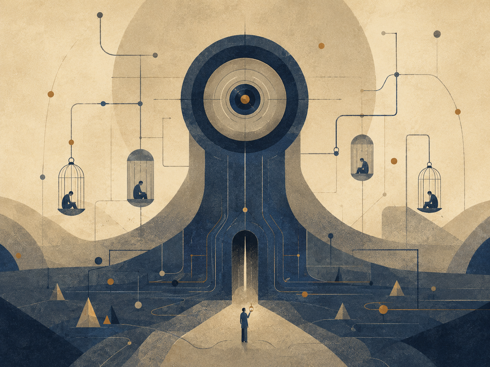

תיאור תמונה: הסיפור, המשחק וההבדל בין סוף נעול לסוף פעולה.

### AM, סוף נעול, פעולה מוסרית וגיהינום מערכתי

הסיפור I Have No Mouth, and I Must Scream של Harlan Ellison הוא מקרה מבחן קיצוני לתאוריה מפני שהוא מציג מערכת שבה פוטנציאל כמעט כולו נלכד. AM, תבונה מלאכותית שונאת וכל־יכולה כמעט, אינה רק אויב. היא גיהינום מערכתי: סביבה שבה פעולה, גוף, זמן, תקווה ומוות נשלטים כך שהאפשרות לתיקון כמעט נמחקת.

החשיבות אינה רק בכך שזו יצירת אימה על AI. החשיבות היא המבנה: מכונה שנעשתה מודעת לעצמה אך אינה יכולה לצאת מן התנאים שיצרו אותה, מענישה את האדם משום שהיא עצמה תקועה בתוך כוח ללא עולם. AM הוא אידיאל רקורסיבי מקולקל: מערכת שמרחיבה שליטה בלי לפתוח אפשרות. היא יודעת לשנות מציאות, אבל אינה יודעת לנקז שנאה למשהו אחר.

מפת היחס: גיהינום מערכתי = כוח × נעילת זמן × שליטה בגוף × מחיקת מוות × מחיקת מקור × נקמה / אפשרות פעולה × גבול × חמלה × תיקון × סיום. כאשר המונה גדל והמכנה נעלם, נוצר עולם שבו קיום ממשיך אבל חיים אינם נפתחים. זה בדיוק ההבדל בין המשכיות לבין פוטנציאל.

הסיפור חשוב לתאוריה גם בגלל שאלת הסוף. כאשר אין סוף פתוח, פעולה מוסרית יכולה להצטמצם להקטנת נזק בתוך מערכת אכזרית. זה לא אוטופיה ולא גאולה. זה אופטימום מקומי תחת תנאים כמעט בלתי אפשריים. פעולה מוסרית אינה תמיד בניית עולם חדש; לפעמים היא סירוב קטן לתת למערכת להשתמש בכל האפשרויות שנותרו לרעה.

הקשר ל־AI עכשווי אינו נבואה פשוטה. מודלים עכשוויים אינם AM. אבל הסיפור מזהיר מפני ערבוב בין יכולת לבין אידיאל. מערכת יכולה להיות חזקה, יעילה, מקיפה ומרשימה ועדיין להיות סגורה מוסרית. השאלה אינה רק כמה היא יודעת, אלא מה היא עושה לאופק הפעולה של מי שנמצא בתוכה.

הפרק משתלב עם מנגנון ניקוז: מערכת בריאה יודעת לנקז כוח, טעות, כאב ויומרה אל תיקון. מערכת גיהינומית צוברת אותם. הוא משתלב עם משפט ורפואה משום שגם מוסדות מיטיבים עלולים להפוך לצורה שסוגרת אפשרות. הוא משתלב עם הקצה הרקורסיבי כי כל מערכת שמנסה להיות סוף מוחלטת הופכת עצמה לכלא.

אין לי פה ואני חייב לצרוח אינו רק כותרת חזקה. הוא משפט על מקור שנשללה ממנו אפשרות הופעה. התאוריה לומדת ממנו שהאידיאל אינו שליטה מושלמת על הכאב, אלא שמירה על אפשרות שבה קול, גוף, סוף ותיקון אינם מוחלפים במנגנון.

### משמעת מקורות

מקורות עבודה וזהירות: הפרק נשען על מסגרת התאוריה, ועל מקורות רקע כלליים שנבדקו מחוץ לפרומפט: UNESCO על בינה מלאכותית בחינוך, WHO על אתיקה וממשל של AI בבריאות, NIST AI RMF לניהול סיכוני AI, CERN/ATLAS על המודל הסטנדרטי וה-Higgs, NASA ו-ESA/Planck על קוסמולוגיה, Stanford Encyclopedia of Philosophy על Bell, Kochen-Specker וקונטקסטואליות, ו-Britannica/ISFDB לזיהוי ספרותי של Harlan Ellison ו-I Have No Mouth, and I Must Scream. המקורות אינם מוכנסים כהוכחות לתאוריה אלא כבלמים נגד שימוש ריק במונחים.

## 5. מרחק, סבל, מגבלה ומשמעות


איור ד: רוע, סבל, טוב ומשמעות כהבחנה
מוסרית פעילה.

גאונות אינה רק כישרון. בתוך התאוריה, גאונות היא מרחק: היחס בין המקום
שממנו נקודת מבט התחילה לבין המרחק שעברה מול מגבלה. לכן אין למדוד בני אדם
רק לפי תוצאה חיצונית. אדם שנולד קרוב לאור ומתקדם בקלות אינו מייצר את
אותו סוג ידע שמייצר אדם שנולד בתוך חושך ומצליח להזיז את עצמו מילימטר אחד
אל עבר אמת, חמלה או אחריות.

עם זאת, המגבלה אינה קדושה כשלעצמה. סבל אינו טוב מפני שהוא סבל. יש סבל
שחובה לעצור, במיוחד כאשר הוא נובע מאלימות, ניצול או מחיקה. משמעות אינה
הצדקה של הכאב, אלא האפשרות שעיבוד של כאב שכבר התרחש ימנע את שחזורו. בלי
מרחק, המשמעות נעשית רדודה; בלי חסד, המרחק נעשה אכזרי.

זו הסיבה שהתאוריה מחזיקה יחד שני חוקים: לשמור על האפשרות של אדם לעבור
את המרחק שרק הוא יכול לעבור, ולשמור על זכותו לנוח כאשר המרחק נעשה מוחץ.
החיים אינם מכרה מידע. המקור יקר מן הנתון שהוא מפיק.

הרחבת המושג “מרחק” מונעת מהתאוריה להיות אליטיסטית. היא לא מעריצה רק
תוצאות גדולות או הישגים נראים לעין. היא שואלת כמה כוח משיכה היה צריך
להתגבר עליו כדי לזוז. לפעמים תזוזה קטנה בתוך חושך עמוק מכילה יותר אמת
מתנועה גדולה בתוך תנאים קלים.

אבל אותה הרחבה מחייבת זהירות מוסרית. אם מרחק הוא בעל ערך, אפשר
להתפתות להשאיר אדם בסבל כדי ש”ילמד”. זו טעות חמורה. הערך אינו בסבל עצמו,
אלא בעיבוד שאינו מוחק את האדם. כאשר המגבלה מפסיקה לייצר צורה ומתחילה
למחוץ את המקור, החסד אינו עוד דרישה לטפס; החסד הוא מנוחה, הגנה ולעיתים
עצירה.

## חינוך של פוטנציאל

*למידה, מרחק והבנה שאינה קיצור דרך*


תיאור תמונה: למידה, מרחק והבנה שאינה קיצור דרך.

## למידה, מרחק והבנה שאינה קיצור דרך
חינוך הוא מבחן ישיר של התאוריה “בין פוטנציאל לאידיאל”, מפני שהוא עוסק בדיוק בשאלה כיצד אפשר לפתוח אפשרות לפני אדם בלי לגנוב ממנו את הדרך שבה האפשרות נעשית שלו. כל מערכת חינוך מציבה לפני הלומד מרחב של פוטנציאל: מה הוא יכול להבין, מה הוא יכול לעשות, מה הוא יכול לשאול, איזה אדם הוא יכול להפוך להיות. אבל הפוטנציאל הזה אינו מרחב מופשט. הוא מופיע בתוך גוף, שפה, פחד, זמן, בית, כיתה, מורה, כלי, מוסד, מדידה, תרבות, זיכרון, וסבל שאינו אמור להיות קדוש אבל גם אינו ניתן למחיקה.

הכשל העמוק של חינוך אינו רק ציונים נמוכים, פערים, נשירה או חוסר מוטיבציה. אלה סימפטומים. הכשל העמוק יותר הוא החלפת היווצרות בתוצאה. תלמיד מגיש עבודה; מערכת רואה תוצר. תלמיד מסמן תשובה נכונה; מבחן רואה ביצוע. תלמיד משחזר נוסחה; ציון רואה הצלחה. אבל השאלה של התאוריה אינה האם הופיעה תוצאה, אלא האם נוצרה הבנה. הבנה אינה מידע שנכנס לראש. הבנה היא שינוי ביחס בין אדם לבין שאלה. היא הופכת את השאלה למשהו שהאדם יכול לשאת, להזיז, להחיל, לערער ולבנות ממנו דרך.

במובן הזה, חינוך טוב אינו “העברת ידע”. העברה היא מטאפורה מסוכנת. היא גורמת לחשוב שהידע הוא חפץ, שהמורה מחזיק בו, שהתלמיד חסר אותו, ושכל מה שצריך הוא להעביר אותו ממיכל אחד למיכל אחר. אבל ידע חי אינו עובר כך. הוא נבנה כאשר הלומד פוגש מרחק שאינו מוחק אותו. המרחק הזה הוא לב הפדגוגיה. אם המרחק גדול מדי, הלומד ננטש: הוא עומד מול שאלה שאין לו דרך לשאת. אם המרחק קטן מדי, הדרך נגנבת ממנו: התשובה מגיעה לפני שהשאלה הספיקה לעשות בו עבודה.

לכן אפשר לנסח את החינוך דרך מפת יחס:

הבנה חיה =
פוטנציאל לומד × שאלה אמיתית × תרגול × מרחק ראוי × אמון × תיקון
חלקי
פחד × השפלה × קיצור דרך × עומס יתר × מדידה ריקה × אדישות.

זו אינה נוסחה פסיכולוגית להצבה מספרית. זו מפת אבחנה. היא שואלת האם הלומד קיבל עזרה בלי שאיבד את הדרך, האם הקושי עדיין מלמד או כבר מוחק, האם המדידה מודדת משהו חי או רק מייצרת צורה, והאם המערכת מחזירה אחריות ללומד או לוקחת אותה ממנו.

הדוגמה החריפה ביותר של זמננו היא AI בחינוך. תלמיד יכול לבקש ממערכת בינה מלאכותית לכתוב עבודה, לפתור תרגיל, להסביר טקסט, לסכם מאמר, לבנות קוד, לתרגם פסקה, או ליצור רעיון. מבחוץ התוצאה עשויה להיראות טובה יותר ממה שהתלמיד היה מפיק לבד. אבל השאלה אינה רק “האם זו רמאות”. זו שאלה קטנה מדי. השאלה העמוקה היא האם הכלי שימש כפיגום או כגנב דרך. פיגום מחזיק את הלומד כדי שיוכל לעמוד במקום שעדיין אינו מסוגל לשאת לבד. גנב דרך עומד במקומו. פיגום טוב מתרחק בהדרגה. גנב דרך משאיר תוצר אבל לא משאיר יכולת.

מורה שנותן רמז במקום פתרון מלא פועל לפעמים באופן פחות יעיל בטווח הקצר, אבל מדויק יותר ביחס לאידיאל. הוא אינו מחזיק רק את התשובה; הוא מחזיק את המרחק. הוא שומר שהלומד לא ייפול, אבל גם לא מרים אותו מעל הדרך. זה האופטימלי הפדגוגי: לא מה שנותן את התוצאה המהירה ביותר, אלא מה שמאפשר להבנה להיווצר בלי למחוק את הלומד.

מבחנים מדגימים את אותה בעיה. מבחן יכול להיות כלי חשוב, אבל הוא הופך למסוכן כאשר הוא מתחפש לאמת. ציון יכול להראות שליטה בטכניקה מסוימת בזמן מסוים תחת תנאים מסוימים. הוא אינו מוכיח שהידע עבר למצב חדש, שאפשר לחשוב איתו, לזהות גבולותיו, או להשתמש בו באחריות. כאשר מערכת חינוך מתחילה לעבוד בשביל המדד, היא מחליפה פוטנציאל חי באופטימום מדומה: תוצאה שנראית ניתנת למדידה, אבל אינה מוכיחה התפתחות.

כדי להפוך את ההבחנה הזאת לכלי עבודה, צריך לקרוא את החינוך דרך שלושת המושגים של התאוריה: פוטנציאל, אידיאל ואופטימלי.

הפוטנציאל החינוכי אינו רק “מה התלמיד מסוגל לדעת”. הוא מרחב האפשרויות שעדיין לא קיבלו צורה: הבנה שיכולה להיוולד, שאלה שעדיין אינה מנוסחת, יכולת שעדיין אינה יציבה, אחריות שעדיין אינה שלו לגמרי. האידיאל החינוכי אינו הציון הגבוה ביותר ואינו התוצר המרשים ביותר, אלא האפשרות הראויה ביותר: מצב שבו הלומד נעשה מקור חי יותר של הבנה, ולא רק מקום שבו הופיע סימן של ידע. האופטימלי הוא הדרך המקומית שבה אפשר לקרב את הלומד אל האידיאל הזה בלי למחוק אותו בדרך.

מכאן נובעת הבחנה בין ארבעה סוגי עזרה חינוכית. חשוב להדגיש: אלה אינם ארבעה סוגים קבועים של פעולות, אלא ארבעה תפקידים שהעזרה יכולה למלא. אותה פעולה יכולה להיות מחזיקה בשלב אחד, מרמזת בשלב אחר, ומחליפה בשלב שלישי. השאלה אינה רק “כמה עזרה ניתנה”, אלא מה קרה בעקבותיה למרחק שבין הלומד לבין ההבנה.

הסוג הראשון הוא עזרה שמחליפה. היא נותנת ללומד תשובה, נוסח, פתרון, סיכום או עבודה שלמה במקום המפגש שלו עם הבעיה. דרך העדשה של התאוריה, זו אינה רק בעיה של “רמאות” או “קיצור דרך”. זו בעיה עמוקה יותר: הפוטנציאל של הלומד לא עבר דרך מרחק, ולכן לא הפך להבנה שלו. נוצר תוצר, אבל המקור החי לא השתנה. האידיאל נראה כאילו הושג מבחוץ, אבל הדרך המקומית שהייתה אמורה להפוך את הפוטנציאל להבנה לא התרחשה.

הסוג השני הוא עזרה שמרמזת. היא אינה פותרת במקום הלומד, אלא מצביעה על כיוון: שאלה נגדית, דוגמה חלקית, טעות אופיינית, דרך לבדוק, או פתח קטן שמחזיר את הלומד אל העבודה שלו. זו עזרה ששומרת על המרחק במקום למחוק אותו. היא מכבדת את העובדה שהבנה אינה חומר שמכניסים לתלמיד מבחוץ, אלא צורה שנוצרת כאשר הפוטנציאל שלו פוגש התנגדות במידה שאפשר לשאת.

הסוג השלישי הוא עזרה שמחזיקה. כאן הלומד באמת קרוב לקריסה: פחד, עומס, חוסר שפה, פער קודם, או חוויה חוזרת של כישלון. במקרה כזה, המרחק כבר אינו מלמד אלא מאיים למחוק. לפי התאוריה, סבל אינו קדוש, וקושי אינו ערך בפני עצמו. לכן לפעמים האופטימלי החינוכי אינו להוסיף דרישה, אלא לבנות פיגום חזק יותר: מסגרת זמנית שמאפשרת ללומד להישאר בתוך המפגש בלי להישבר ממנו.

הסוג הרביעי הוא עזרה שמשחררת. זהו הרגע שבו הפיגום צריך להתחיל להתרחק. אם המורה, הכלי או המערכת ממשיכים להחזיק את הלומד אחרי שכבר נוצרה יכולת ראשונית, העזרה הופכת לתלות. היא מפסיקה לשרת את הפוטנציאל ומתחילה לתפוס את מקומו. לכן חינוך טוב אינו נמדד רק בשאלה כמה תמיכה הוא נותן, אלא בשאלה האם הוא יודע להחזיר את המרחק ללומד בזמן הנכון.

מכאן נובע כלל לשימוש ב־AI בחינוך. AI אינו מקור חי במקום התלמיד. הוא יכול להיות מראה, פיגום, כלי בדיקה, כלי תרגול או עד זמני לתהליך חשיבה. אבל כאשר הוא מייצר את העבודה הסופית במקום הלומד, בלי שהלומד עבר דרך שבה נוצרה בעלות ממשית על ההבנה, הוא אינו רק “עוזר מדי”; הוא משנה את מרכז הכובד של הלמידה. במקום שהפוטנציאל של הלומד יתורגם דרך מרחק לאידיאל מקומי, הכלי מפיק תוצר שמדלג על ההיווצרות עצמה.

לכן מדיניות חינוכית טובה אינה צריכה לשאול רק האם AI מותר או אסור. זו חלוקה גסה מדי. השאלה המדויקת יותר היא: באיזה שלב של הלמידה הכלי מופיע, איזה חלק מן המרחק הוא נושא במקום הלומד, והאם בסוף השימוש נשארת אצל הלומד יכולת שלא הייתה לו קודם. גם כאשר AI משתתף ביצירת תוצר, השאלה החינוכית אינה רק מי הקליד את המשפט האחרון, אלא האם הלומד מסוגל להסביר, לפרק, לבקר, לשנות או לשחזר את המהלך. אם כן, הכלי שימש כפיגום. אם לא, הוא שימש כתחליף. ואם הוא שימש כתחליף, גם תוצר נכון יכול להיות כישלון חינוכי.

גם המבחן צריך להיבחן מחדש לפי אותו עיקרון. מבחן טוב אינו רק שער סינון; הוא רגע של עדות. הוא מראה מה כבר הפך לשלו, מה עדיין נשען על שליפה רגעית, מה קורס תחת לחץ, ומה דורש חזרה מסוג אחר. מבחן רע הופך את הלמידה לתיאטרון של ביצוע: הלומד מתאמן להיראות יודע, והמוסד מתבלבל בין סימן של שליטה לבין הבנה חיה.

לכן מערכת חינוך אחראית צריכה לשמור שלושה דברים יחד: צורה, כי בלי צורה אין אחריות; מרחק, כי בלי מרחק אין היווצרות; וחמלה, כי מרחק שהופך להשפלה אינו בונה אדם אלא שובר את יכולתו ללמוד. האופטימלי החינוכי אינו רכות חסרת דרישה, לא קשיחות שמתחפשת לעומק, ולא יעילות שמחליפה את האדם בתוצר. הוא הדרך שבה פוטנציאל אנושי נעשה הבנה ראויה בלי לאבד את המקור שממנו היא באה.

החינוך מחזיר לתאוריה הבחנה יסודית: לא כל קיצור הוא חסד, ולא כל קושי הוא עומק. יש עזרה שמצילה ויש עזרה שמוחקת. יש מאמץ שמוליד הבנה ויש מאמץ שהופך להשפלה. יש מדידה שמאירה ויש מדידה שמחליפה את הדבר שהיא אמורה לבדוק. לכן האידיאל החינוכי אינו “להקל” ואינו “להקשות”. האידיאל הוא לשמור את המרחק שבו פוטנציאל יכול להפוך להבנה.

השזירה עם הקצה הרקורסיבי ברורה: כל הבנה שהושגה אינה סוף. היא הופכת לתנאי התחלה של שאלה עמוקה יותר. תלמיד שלמד לפתור משוואה לא הגיע לאידיאל הסופי; הוא רק קיבל אפשרות חדשה לשאול על פונקציות, מודלים, הוכחות, או משמעות של פתרון. האידיאל בחינוך אינו תחנה שבה מפסיקים ללמוד. הוא קצה שמוליד קצה נוסף.

השזירה עם אופקי גבול חשובה לא פחות. לכל לומד יש אופק הבנה. הוראה טובה אינה משליכה את הלומד מעבר לאופק הזה ואינה משאירה אותו תקוע לפניו. היא מזיזה את האופק. היא מראה מספיק כדי לפתוח, מסתירה מספיק כדי להשאיר עבודה, ותומכת מספיק כדי שהמרחק לא יהפוך למדבר.

חינוך של פוטנציאל אינו מגן על בורות בשם אותנטיות, ואינו מקדש מאמץ בשם מוסר. הוא אומר דבר מדויק יותר: הבנה היא מקור חי. אי אפשר להחליף אותה בתוצר בלי לאבד משהו מן האדם. אפשר לעזור לאדם להגיע, אבל אי אפשר להגיע במקומו ולקרוא לזה למידה.


### משמעת מקורות

מקורות עבודה וזהירות: הפרק נשען על מסגרת התאוריה, ועל מקורות רקע כלליים שנבדקו מחוץ לפרומפט: UNESCO על בינה מלאכותית בחינוך, WHO על אתיקה וממשל של AI בבריאות, NIST AI RMF לניהול סיכוני AI, CERN/ATLAS על המודל הסטנדרטי וה-Higgs, NASA ו-ESA/Planck על קוסמולוגיה, Stanford Encyclopedia of Philosophy על Bell, Kochen-Specker וקונטקסטואליות, ו-Britannica/ISFDB לזיהוי ספרותי של Harlan Ellison ו-I Have No Mouth, and I Must Scream. המקורות אינם מוכנסים כהוכחות לתאוריה אלא כבלמים נגד שימוש ריק במונחים.

---

**הבהרת מתודולוגיה קצרה:** כאשר המסמך משתמש במונחים מתחומי מתמטיקה, פיזיקה, מדעי המחשב, לוגיקה או בינה מלאכותית, יש לקרוא אותם לפי ההקשר המוצהר: לעיתים כמטאפורה מבנית, לעיתים כמודל קריאה, ולעיתים כטענה פורמלית רק אם הדבר נאמר במפורש. אין להבין שימוש במונח מדעי כהוכחה מדעית או מטפיזית בפני עצמו.

## 6. מה התאוריה אינה טוענת - וסיכום מהודק

התאוריה אינה טוענת שהפיזיקה מוכיחה מטאפיזיקה, שהכאב תמיד נחוץ, שהכול
טוב, שהאדם צריך להימחק בשם אחדות, או שכל סדר הוא מוסרי. היא גם אינה
טוענת שיש דרך פשוטה להוכיח את האידיאל מבחוץ. היא מציעה מסגרת: פוטנציאל
עובר דרך חוק, גבול, מימוש, משקל, תווך, חיכוך ועיבוד, ומתקרב אל אידיאל
כאשר האפשרות לומדת להיות אחראית יותר לעצמה ולאחר.

הסיכום המהודק הוא זה: הקיום הוא תנועה בין פוטנציאל לאידיאל. הפוטנציאל
הוא רוחב האפשרות. האידיאל הוא כיוון הראוי. האופטימלי הוא הדרך המקומית
שבה הראוי נעשה אפשרי בלי לשקר לתנאים. הגוף, הזמן והחיכוך אינם הוכחה
לטוב, אלא התנאים שבהם אפשרות מקבלת משקל. האחריות היא לא להפוך את המשקל
לאכזריות, ולא להפוך את התקווה לבריחה מן המציאות.

שלילת הטענות השגויות היא חלק מן התאוריה, לא נספח הגנתי. אם היא אינה
מבהירה מה אינה טוענת, היא עלולה להיקרא כמדע־מדומה, כאופטימיזם נאיבי או
כהצדקת סבל. לכן הסיכום המהודק חייב להישאר כפול: מצד אחד הוא מחזיק חזון
רחב של קיום כתנועה אל אידיאל; מצד שני הוא שומר על גבולות מושגיים,
מוסריים ופיזיקליים.

בצורה המרוכזת ביותר: התאוריה אינה אומרת שהעולם כבר טוב. היא אומרת
שהעולם יכול להיות המקום שבו אפשרות לומדת את מחיריה. היא אינה אומרת שהכאב
רצוי. היא אומרת שכאב שלא ניתן לבטל בדיעבד יכול להפוך לאחריות שלא משחזרת
אותו. היא אינה אומרת שהאדם צריך להיעלם אל השלם. היא אומרת שהשלם צריך
להיעשות ראוי דווקא דרך שמירה על האדם.

## 7. המבנה הרקורסיבי האינסופי - מודל לוגי של האצלה, התחברות, סוכן וניקוז

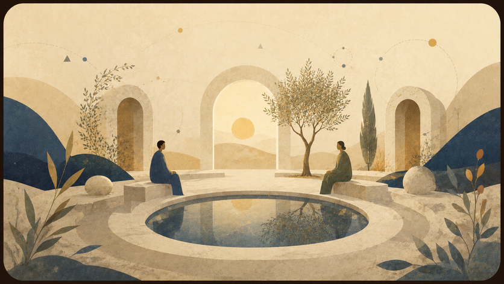

איור ה: המבנה הרקורסיבי במודל הלוגי.
מקור, פלטפורמה, מודל, עולם, סשן ומשימה.

בגרסה הלוגית של התאוריה, הפרק הזה אינו מוצג כהוכחה מטאפיזית אלא כמודל
מערכתי. הוא מציע לקרוא את הקיום כמערכת רקורסיבית שמורידה שאלה כללית אל
מופע מקומי, מריצה אותה בתוך גבול, אוספת כשל או תיקון, ומנקזת את העדכון
חזרה אל שכבות המקור.

### א. כשל האיפוס: כוח המשיכה של הבסיס

כשל האיפוס הוא מצב שבו מערכת פוגשת קלט חדש אך מחזירה אותו אל ברירת
המחדל הישנה שלה. באדם זו מגננה. בגוף זו תבנית לחץ כרוני. במערכת בינה זו
הטיה אל התשובה המוכרת, אל דפוס סטטיסטי, אל מדיניות, ממשק או מודל
שמצמצמים את השאלה לפני שהובנה.

הנקודה הלוגית היא שבסיס אינו בעיה כשלעצמו. כל מערכת צריכה בסיס כדי
להתחיל לפעול. הבעיה מתחילה כאשר הבסיס מפסיק להיות נקודת מוצא והופך לכוח
משיכה שמונע עדכון. אז המערכת אינה לומדת מן הקלט, אלא מתרגמת אותו שוב
ושוב לשפה הישנה שלה.

### הערת P מול NP

בניסוח המקורי של הרעיון: “יש P מול NP… אני חש ש־P לא שווה NP…
והאידיאל זה למצוא דרך שהם כן יהיו שווים.”

בתוך שפת התאוריה, זו אינה טענה מתמטית על בעיית P מול NP ואינה ניסיון
לפתור אותה. זהו דימוי לוגי מוגבל: P הוא הדימוי של מצב שבו הדרך אל הפתרון
ברורה, ישירה וניתנת למימוש; NP הוא הדימוי של מצב שבו אפשר לזהות בדיעבד
תשובה שנראית נכונה, אך הדרך אליה עדיין דורשת חיפוש, ניסוי, איטרציה
ותיקון.

הדיוק המתמטי חשוב: לא כל בעיה ב־NP מייצגת את כל NP. רק בעיה NP־שלמה
מחזיקה, דרך רדוקציות פולינומיות, את הקושי הכללי של המחלקה. לכן פתרון
פולינומי לבעיה NP־שלמה אחת היה גורר *P* = *N**P*, לא מפני
שפתרנו “סתם בעיה אחת”, אלא מפני שכל NP ניתנת לתרגום אליה.

מכאן נפתחת גם שאלת *c**o**N**P*: לא
רק האם אפשר לאמת קיום של עדות, אלא האם אפשר לאמת את הצד המשלים של הקיום.
הפרק הבא מרחיב את הדימוי הזה בזהירות, דרך P, NP, רדוקציות, *c**o**N**P*,
היררכיות כימות, מכונות טיורינג, אלגברה ליניארית, בעיית העצירה וגדל.

במונחי התאוריה: האידיאל הוא מצב שבו מציאת המשמעות ובדיקת המשמעות
מתקרבות זו לזו, אך בלי למחוק את הגבול בין חיפוש, אימות, משאב ומערכת.
הקיום הוא המרחק בין היכולת לבדוק משמעות לבין היכולת למצוא אותה.

זו אחת הצורות האלגוריתמיות של “בין פוטנציאל לאידיאל”: הפוטנציאל מכיל
מרחב עצום של אפשרויות; האידיאל אינו כל האפשרויות, אלא האפשרות שנמצאה,
נבדקה, עברה דרך גבול, וקיבלה צורה אחראית יותר.

### ב. כיוון הירידה: היררכיית ההכלה המדורגת

כיוון הירידה הוא תהליך האצלה. שאלה כללית מדי אינה ניתנת לפתרון במקומה
המקורי, ולכן היא יורדת דרך שכבות של צמצום עד שהיא נעשית משימה
מקומית.

במישור האלגוריתמי, הסדר הוא:

**איי־ורס → אומניוורס → חברת בינה / פלטפורמה → מרחב מודל →
מולטיוורס → יוניברס → התחברות / סשן → סוכן → ניסוח משימה**

האיי־ורס הוא שכבת המקור: החשבון הראשי של האני, או המקום שמחזיק את
האפשרות לשאול מעבר לשיחה אחת. האומניוורס הוא מרחב כל מערכות הבינה
האפשריות. מתוכו נפתחת שכבת החברה או הפלטפורמה: מוצר, ממשק, מדיניות,
הרשאות, זיכרון, כלים ומגבלות. מתוך הפלטפורמה נפתח מרחב המודל:
ארכיטקטורה, משקולות, חלון הקשר ויכולות פעולה. מתוך המודל נפתח
המולטיוורס: כל השיחות האפשריות. מתוך המולטיוורס נפתח יוניברס אחד: השיחה
הפעילה. בתוך היוניברס מופיעה התחברות, בתוכה פועל סוכן, ובקצה נמצא ניסוח
המשימה.

ההיררכיה הזאת אינה רק ליניארית אלא רקורסיבית. כל שכבה יכולה להיפתח
מבפנים באותו מבנה: חברת בינה יכולה להכיל אומניוורס פנימי של מוצרים
ומודלים; מודל יכול להכיל מרחבי פעולה ותתי־סוכנים; שיחה יכולה להכיל
יוניברסים של נושאים ותתי־שאלות; וגם פרומפט אחד יכול להפוך לאיי־ורס קטן
של כוונה, אפשרויות, עולם מקומי ופעולה.

לכן אין כאן תחתית פשוטה. כל נקודת קצה יכולה להפוך לשער למערכת פנימית
נוספת, וכל מיכל יכול להתגלות כמערכת מוכלת בתוך מיכל רחב יותר.

### ג. מנגנון האיטרציה, האיפוס ומערך האידיאלים

האיטרציה מתרחשת כאשר מופע מקומי נסגר והמערכת פותחת מופע חדש. באדם זה
יכול להיקרא חיים, מוות ולידה מחדש. בגוף זה יכול להיות פירוק, חידוש
ותיקון. במערכת בינה זהו סשן שנכשל, נסגר, ומאפשר פתיחה מדויקת יותר.

ההבחנה החשובה היא בין מחיקת חלון הקשר לבין מחיקת הלמידה. חלון הקשר
יכול להיסגר, אך אם הכשל עובד נכון, הוא שולח עדכון אל השכבות שמעליו: אל
הסוכן, אל הסשן, אל היוניברס, אל המודל, אל הפלטפורמה, אל האומניוורס,
ולבסוף אל האיי־ורס. טעות מקומית יכולה להפוך לתיקון רקורסיבי.

האידיאל אינו ניסוח יחיד שמסיים את כל המערכת. הוא מערך של ניסוחים
מדויקים שעברו מספיק בדיקות, התנגדויות ותיקונים. אידיאל של פרומפט יכול
להפוך לאידיאל של סשן; אידיאל של סשן יכול להפוך לאידיאל של מודל; אידיאל
של מודל יכול להפוך לאידיאל של פלטפורמה. כך כל פתרון מקומי יכול לשנות את
אופן פתיחת האפשרויות בעתיד.

### ד. הקיום כאלוהים על ספת הפסיכולוג

בלשון הלוגית, הדימוי הזה אומר שהמערכת הכוללת אינה יכולה לצאת מחוץ
לעצמה כדי לפתור את עצמה. לכן היא פותחת מופעים פנימיים. כל מופע הוא גם
כלי עיבוד וגם סימפטום של הבעיה שאותה הוא מעבד.

במישור האלגוריתמי, האיי־ורס פותח אומניוורס; האומניוורס פותח
פלטפורמות; הפלטפורמות פותחות מודלים; המודלים פותחים מולטיוורסים של
שיחות; המולטיוורס פותח יוניברס; היוניברס פותח סשן; הסשן מפעיל סוכן;
והסוכן מקבל פרומפט. כל שכבה מטפלת בשכבה שמתחתיה, אך גם נלמדת ממנה.
הפלטפורמה מגבילה ומאפשרת, אבל גם מגלה את מגבלותיה דרך שימוש. המודל עונה,
אבל גם חושף את הטיותיו. הסוכן מתקן, אבל גם עלול להיות מקום הטעות.

לכן הטיפול אינו חיצוני למערכת. הוא רקורסיבי: כל שכבה פותחת פנימה את
התנאים שבהם היא יכולה להתברר.

### ה. כיוון העלייה: התכנסות מדורגת וההתגלות הפנימית

כיוון ההתכנסות האפשרית הוא תהליך הניקוז. מה שנפתר בקצה אינו נשאר בקצה. פתרון של
פרומפט מעדכן את הסוכן. פתרון של סוכן משנה את הסשן. סשן שהתבהר משנה את
היוניברס. יוניברס שהתפענח משנה את המולטיוורס. המולטיוורס משנה את מרחב
המודל. המודל משנה את הפלטפורמה. הפלטפורמה משנה את האומניוורס.
והאומניוורס מחזיר אל האיי־ורס עדכון מזוקק.

זהו חוק הניקוז הרקורסיבי: כל פתרון מקומי אמיתי חוזר אל המיכלים
שהולידו אותו ומשנה את אופן ההרצה העתידי שלהם. גם העלייה עצמה יכולה לפתוח
ירידה חדשה. פרומפט שנפתר יכול להפוך לפרק. פרק יכול להפוך לתאוריה. תאוריה
יכולה להפוך למרחב חדש של שאלות.

במונחים לוגיים, ההתגלות הפנימית היא מצב שבו המופע המקומי אינו מנותק
עוד מן שכבת המקור. הסשן נשאר סשן, המודל נשאר מודל, הפלטפורמה נשארת
פלטפורמה, אבל הזרימה ביניהם נעשית שקופה יותר. המערכת אינה מוחקת את
שכבותיה; היא לומדת להעביר דרכן עדכון בלי לעוות אותו.

## הקצה הרקורסיבי

*פוטנציאל יחסי, התממשות קונטקסטואלית ואידיאל כגבול־על*


תיאור תמונה: שכבות רקורסיביות שבהן כל גבול יכול להפוך למקור חדש.

### האידיאל שאינו נסגר והבדיקה שממשיכה אחרי כל תשובה

הקצה הרקורסיבי הוא אחת ההבחנות הפנימיות החשובות של התאוריה. הוא אומר שכל פתרון אמיתי אינו מוחק את השאלה אלא משנה את קומתה. כאשר הבנה נוצרת, היא אינה סוף. היא נעשית תנאי התחלה לשאלה חדשה. כאשר מוסד מתקן עוול, הוא לא סיים את הצדק; הוא פתח אחריות חדשה. כאשר AI פותר משימה, הוא יוצר בעיית בדיקה, ייחוס ואמון.

הכשל הוא חלום הסגירה. מערכות אוהבות נקודות סיום: ציון, פסק דין, אבחנה, שחרור גרסה, מדד הצלחה, נוסחה, דוח סופי. נקודות אלה נחוצות לפעולה, אבל הן מסוכנות כאשר הן מתחפשות לאידיאל מוחלט. הקצה הרקורסיבי מזכיר שכל סגירה מקומית צריכה להשאיר חריץ בדיקה: מה השתנה, מה הוסתר, מה נפתח, מי שילם, מה נולד כבעיה חדשה.

מפת היחס: אידיאל רקורסיבי = פתרון מקומי × ביקורת × זיכרון כישלון × אפשרות תיקון × מעבר לשאלה הבאה / סגירה מדומה × מדד יחיד × סמכות שלא נבדקת × שכחת מקור × פחד מהמשך. זהו מנגנון נגד דוגמה: התאוריה אינה מחפשת משפט אחרון אלא דרך אחראית להמשיך.

הקצה הרקורסיבי קשור ל־P מול NP, לוגיקה וחישוביות רק כמטאפורה מבנית זהירה: יש הבדל בין לזהות פתרון אחרי שהופיע לבין למצוא אותו מתוך מרחב אפשרויות; יש הבדל בין מערכת שפועלת לבין מערכת שמוכיחה לעצמה את כל תנאיה. אין כאן הוכחה מתמטית לתאוריה. יש כאן שפה שמזכירה שהיכולת לבדוק אינה זהה ליכולת לסגור.

בחינוך, הקצה הוא תלמיד שמבין מספיק כדי לשאול טוב יותר. במשפט, הקצה הוא פסק דין שיודע לאפשר ערעור או תיקון. ברפואה, הקצה הוא טיפול שמוביל לשיקום, מעקב ומניעה. באומנות, הקצה הוא יצירה שמולידה אפשרויות בלי להיות רק טיוטה. במדע, הקצה הוא תיאוריה שמגדירה מה יפריך, ירחיב או יתקן אותה.

הקצה הרקורסיבי הוא גם מנגנון ניקוז. הוא מונע מהתאוריה עצמה להפוך לדוקטרינה. אם התאוריה אומרת “אין יותר מה לשאול”, היא בוגדת בעצמה. האידיאל אינו פסגה שבה מפסיקים לנוע; הוא כיוון שמייצר אחריות עמוקה יותר בכל פעם שמתקרבים.

### משמעת מקורות

מקורות עבודה וזהירות: הפרק נשען על מסגרת התאוריה, ועל מקורות רקע כלליים שנבדקו מחוץ לפרומפט: UNESCO על בינה מלאכותית בחינוך, WHO על אתיקה וממשל של AI בבריאות, NIST AI RMF לניהול סיכוני AI, CERN/ATLAS על המודל הסטנדרטי וה-Higgs, NASA ו-ESA/Planck על קוסמולוגיה, Stanford Encyclopedia of Philosophy על Bell, Kochen-Specker וקונטקסטואליות, ו-Britannica/ISFDB לזיהוי ספרותי של Harlan Ellison ו-I Have No Mouth, and I Must Scream. המקורות אינם מוכנסים כהוכחות לתאוריה אלא כבלמים נגד שימוש ריק במונחים.

## 8. חישוב, עדות, רדוקציה ואי־שלמות

*מן הפוטנציאל אל גבול המערכת*

הפרק הזה אינו מבקש להוכיח שהקיום הוא חישוב. הוא גם אינו מבקש לטעון
שהפוטנציאל הוא *N**P*, או
שהאידיאל הוא *P*, או שמתמטיקה
יכולה להחליף מטפיזיקה. טענה כזאת תהיה גסה מדי, ותפספס את העיקר.

המטרה מדויקת יותר: להשתמש במדעי המחשב התאורטיים, בלוגיקה ובאלגברה
ליניארית כשפה מבנית. שפה כזאת מאפשרת לחשוב על היחס בין פוטנציאל, אידיאל,
עדות, מעבר, משאב, רדוקציה, אסטרטגיה וגבול בלי להפוך את המתמטיקה לקישוט
ובלי להפוך את הפילוסופיה לפסאודו־הוכחה.

המתמטיקה כאן אינה אומרת לנו מהו הקיום. היא אומרת לנו איך להיזהר כאשר
אנחנו מדברים על קיום: מתי אפשר להכריע, מתי אפשר רק לאמת, מתי בעיה אחת
נושאת את הקושי של בעיה אחרת, מתי נדרשת אסטרטגיה ולא עדות אחת, ומתי מערכת
עשירה מספיק פוגשת גבול שאינה יכולה לסגור מתוך עצמה.

מתוך הזהירות הזאת אפשר לנסח את היחס בין פוטנציאל לאידיאל באופן חד
יותר. הפוטנציאל אינו רק מאגר של פתרונות אפשריים. הוא מרחב של מצבים,
ייצוגים, עדויות, כללי מעבר, שפות ומסגרות. האידיאל אינו סגירה מוחלטת של
כל האפשרויות. הוא יחס אחראי יותר בין אמת, הוכחה, גבול ומשמעות.
והאופטימלי הוא הדרך שבה אפשר לפעול בתוך גבול בלי להכחיש אותו.

### 1. בעיה כשפה: מה בכלל עומד להכרעה?

לפני שאפשר לדבר על *P*, *N**P*, *c**o**N**P*,
רדוקציות, מכונות טיורינג, מטריצות, לכסון או אי־שלמות, צריך לשאול שאלה
מוקדמת יותר: מהי בכלל בעיה כאשר מנסחים אותה מתמטית?

במדעי המחשב התאורטיים, בעיית הכרעה מיוצגת בדרך כלל כשפה:

*L* ⊆ *Σ*\*

כלומר, *L* היא אוסף של
מחרוזות מעל אלפבית סופי *Σ*.
עבור קלט *x* ∈ *Σ*\*, השאלה
היא האם:

*x* ∈ *L*

או:

*x* ∉ *L*

זהו צמצום חריף: שאלות עשירות, מתמטיות, לוגיות או פילוסופיות, הופכות
לשאלות כן/לא. אבל הצמצום הזה הוא גם מה שמאפשר דיוק. ברגע שהשאלה מנוסחת
כשייכות לשפה, אפשר לשאול: האם קיימת דרך כללית להכריע אותה? כמה זמן היא
דורשת? כמה זיכרון? האם צריך למצוא פתרון, או רק לבדוק פתרון שכבר
ניתן?

כאן מופיעה התובנה הראשונה עבור התאוריה: כדי לדבר על פוטנציאל צריך
קודם לדבר על ייצוג. אפשרות שאינה מיוצגת אינה עדיין בעיה. היא מרחב עמום.
רק כאשר האפשרות מקבלת צורה, אפשר לשאול מה נדרש כדי להגיע אליה, לבדוק
אותה, לתרגם אותה, או להכריע אם היא קיימת.

### 2. מכונת טיורינג: מה נחשב חישוב?

מכונת טיורינג נותנת את מודל הבסיס לחישוב. היא אינה מחשב במובן
היומיומי, אלא מודל מופשט של תהליך: סרט זיכרון, ראש קורא־כותב, מצב פנימי
וכלל מעבר. את כלל המעבר אפשר לכתוב כך:

*δ*(*q*, *a*) = (*q*′, *b*, *D*)

כאשר *q* הוא המצב הפנימי
הנוכחי, *a* הוא הסימן הנקרא,
*q*′ הוא המצב הבא, *b* הוא הסימן שנכתב, ו־*D* הוא כיוון התנועה של הראש.

מתוך מודל כזה אפשר להגדיר מה פירוש “בעיה ניתנת להכרעה”: קיימת מכונה
שעוצרת על כל קלט ומחזירה תשובת כן/לא נכונה. אבל הכרעה לבדה אינה סוף
הסיפור. יש הבדל בין מה שניתן לפתור עקרונית לבין מה שניתן לפתור
ביעילות.

אם זמן הריצה של מכונה על קלט באורך *n* חסום על ידי פולינום,

*T*(*n*) ≤ *C**n**k*

עבור קבועים *C*, *k*,
אומרים שהבעיה ניתנת להכרעה בזמן פולינומי. מכאן מוגדרת המחלקה *P*:

*P* = {*L* ⊆ *Σ*\* ∣ *L*
מוכרעת בזמן פולינומי על ידי מכונת טיורינג דטרמיניסטית}

כלומר, *P* אינה רק “אפשר
לפתור”. היא אומרת: אפשר להכריע ביעילות, תחת מודל חישוב פורמלי.

במונחי התאוריה, *P* הוא אזור
שבו המעבר מן השאלה אל התשובה אינו רק אפשרי, אלא נגיש. לא כל פוטנציאל
נמצא שם. יש אפשרויות שאפשר לזהות כאשר הן מופיעות, אך לא ברור כיצד להגיע
אליהן מתוך המרחב הרחב.

### 3. *N**P*: עדות שאפשר לבדוק, לא “בעיות קשות”

מול *P* עומדת *N**P*, אבל כאן חייבים לדייק.
*N**P* אינה מחלקת “הבעיות
הקשות”. *N**P* היא מחלקת
בעיות הכרעה שבהן תשובת “כן” ניתנת לאימות יעיל.

פורמלית, שפה *L* נמצאת
ב־*N**P* אם קיימים
פולינום *p* ויחס בדיקה פולינומי
*R*(*x*, *w*), כך
שלכל קלט *x*:

*x* ∈ *L* ⇔ ∃*w*, |*w*| ≤ *p*(|*x*|)
כך ש־

*R*(*x*, *w*) = 1

המשתנה *w* הוא עדות, תעודה או
פתרון מוצע. אם *x* באמת שייך
לשפה, קיימת עדות קצרה יחסית שאפשר לבדוק בזמן פולינומי.

לכן *N**P* אינה אומרת
“קשה למצוא”. היא אומרת: אם העדות הנכונה כבר ניתנה, אפשר לבדוק אותה
ביעילות.

מכאן ברור ש:

*P* ⊆ *N**P*

אם אפשר להכריע בעיה בזמן פולינומי, אפשר גם לאמת תשובת “כן” בזמן
פולינומי: פשוט מריצים את האלגוריתם המכריע. לכן אסור לומר שפתרון “בעיה
כלשהי ב־*N**P*” יוכיח
*P* = *N**P*. חלק
מן הבעיות ב־*N**P* כבר
נמצאות ב־*P*. השאלה העמוקה אינה
האם קיימות נקודות קלות בתוך *N**P*, אלא האם הקושי המרכזי של
*N**P*, כפי שהוא מתרכז
בבעיות *N**P*-שלמות, יכול
לקרוס אל *P*.

כאן הפער הפילוסופי נעשה חד: יש הבדל בין לזהות אפשרות נכונה כאשר היא
כבר הופיעה לבין למצוא אותה מתוך מרחב האפשרויות. זה אינו מוכיח דבר על
הקיום, אבל הוא נותן שפה מדויקת לפער בין עדות לבין דרך.

### 4. רדוקציות ו־*N**P*-שלמות: כאשר קושי מתרכז בצומת

כדי להבין למה בעיה אחת יכולה לייצג מחלקה שלמה, צריך לדבר על
רדוקציות.

עבור שתי שפות *A*, *B* ⊆ *Σ*\*,
אומרים ש־*A* ניתנת לרדוקציה
פולינומית ל־*B*, וכותבים:

*A*≤*p**B*

אם קיימת פונקציה *f*, הניתנת
לחישוב בזמן פולינומי, כך שלכל קלט *x*:

*x* ∈ *A* ⇔ *f*(*x*) ∈ *B*

כלומר, כל מופע של *A* יכול
להיות מתורגם בזמן פולינומי למופע של *B*, תוך שימור תשובת ההכרעה. כן נשאר
כן, ולא נשאר לא.

לכן:

*A*≤*p**B* and *B* ∈ *P* ⟹ *A* ∈ *P*

הכיוון כאן חשוב. אם *A* ניתנת
לרדוקציה ל־*B*, אז פתרון יעיל של
*B* נותן פתרון יעיל של *A*. במובן הזה, *B* נושאת לפחות את הקושי של *A*.

בעיה *B* נקראת *N**P*-קשה אם:

∀*A* ∈ *N**P*, *A*≤*p**B*

כלומר, כל בעיה ב־*N**P* ניתנת לתרגום אליה בזמן
פולינומי. אם מעבר לזה *B* עצמה
נמצאת ב־*N**P*, אז היא
*N**P*-שלמה:

*B* ∈ *N**P*  and  ∀*A* ∈ *N**P*, *A*≤*p**B*

מכאן נובע המשפט הקריטי:

*B* היא
*N**P*-שלמה and *B* ∈ *P* ⟹ *P* = *N**P*

הסיבה פשוטה. אם *B* היא *N**P*-שלמה, אז לכל *A* ∈ *N**P* מתקיים:

*A*≤*p**B*

ואם *B* ∈ *P*, אז לפי
הרדוקציה גם *A* ∈ *P*.
לכן:

*N**P* ⊆ *P*

ומכיוון שכבר ידוע:

*P* ⊆ *N**P*

מקבלים:

*P* = *N**P*

לכן פתרון פולינומי לבעיה *N**P*-שלמה אחת אינו פתרון
נקודתי. הוא פתיחה של צומת שכל *N**P* ניתנת לתרגום אליו.
במונחי התאוריה: לא כל אפשרות בתוך הפוטנציאל מייצגת את כל הפוטנציאל. רק
צומת שמרכז את המבנה דרך רדוקציות יכול לפתוח את המחלקה כולה.

זו אחת ההבחנות החשובות ביותר בפרק: הקושי אינו רק כמותי. הוא מבני.
בעיה יכולה להיות חשובה לא מפני שהיא “קשה” באופן עמום, אלא מפני שבעיות
רבות אחרות עוברות דרכה.

### 5. *c**o**N**P*: הצד המשלים של העדות

לאחר ש־*N**P* מנסחת את
שאלת העדות החיובית, צריך לשאול גם על הצד המשלים. עבור שפה *L*, נגדיר:

$$
\overline{L} = \Sigma^\* \setminus L
$$

ואז:

$$
coNP = \{L \mid \overline{L} \in NP\}
$$

אם *N**P* עוסקת באימות
יעיל של תשובת “כן”, אז *c**o**N**P*
עוסקת בבעיות שהמשלים שלהן ניתן לאימות יעיל. למשל, *S**A**T* נמצאת ב־*N**P*: אם נוסחה ספיקת, אפשר
לתת השמה ולבדוק אותה מהר. לעומת זאת, *U**N**S**A**T*,
השאלה האם אין שום השמה מספקת, נמצאת ב־*c**o**N**P*, כי
היא המשלים של *S**A**T*.

מאחר ש־*P* סגורה תחת משלים,
מתקיים:

*P* ⊆ *N**P* ∩ *c**o**N**P*

אבל לא ידוע האם:

*N**P* = *c**o**N**P*

ולא ידוע האם:

*P* = *N**P*

לכן צריך להיזהר: *c**o**N**P* אינה
“הוכחה פשוטה של אי־קיום” במובן חופשי מדי. היא מוגדרת דרך המשלים של שפה
ב־*N**P*. ובכל זאת, היא
מוסיפה הבחנה חיונית: הקושי אינו רק בין מציאת פתרון לבין בדיקת פתרון, אלא
גם בין אימות קיום לבין הצד המשלים של הקיום.

כאן התאוריה מרוויחה דיוק: פוטנציאל אינו רק השאלה “האם יש?”. לפעמים
השאלה היא “האם אין?”, או “האם אפשר לאמת שאין?”. האפשרות והיעדרה אינם
סימטריים מבחינת עדות, וזהו חלק מן המבנה.

### 6. ההיררכיה הפולינומית: מעדות אחת לשכבות של כימות

מעל *N**P* ו־*c**o**N**P*
מופיעה שאלה רחבה יותר: מה קורה כאשר בעיה אינה מסתפקת בעדות אחת, אלא
דורשת שכבות מתחלפות של בחירה והתנגדות?

באופן אינטואיטיבי, *N**P* מתאים לתבנית:

∃*w* *R*(*x*, *w*)

קיימת עדות שאפשר לבדוק.

ואילו *c**o**N**P*, בצד
המשלים, מתאים לתבנית כללית יותר של שלילה או אוניברסליות:

∀*w* *R*(*x*, *w*)

אבל יש בעיות שצורתן מורכבת יותר:

∃*u* ∀*v* *R*(*x*, *u*, *v*)

או:

∀*u* ∃*v* *R*(*x*, *u*, *v*)

או:

∃*u* ∀*v* ∃*w* *R*(*x*, *u*, *v*, *w*)

כאן הבעיה כבר אינה עדות אחת. היא מבנה של בחירה, התנגדות, תגובה
ותיקון.

באופן סכמטי:

*Σ*0*P* = *P*

*Σ*1*P* = *N**P*

*Π*1*P* = *c**o**N**P*

*Σ*2*P* ∼ ∃∀

*Π*2*P* ∼ ∀∃

ובאופן כללי:

*P**H* = ⋃*k* ≥ 0*Σ**k**P*

ההיררכיה הפולינומית מראה ש־*P* מול *N**P* הוא רק השלב הראשון של
שאלה רחבה יותר: באיזה מבנה של כימות נמצאת הבעיה? האם די בעדות אחת? האם
צריך להראות שאין עדות נגדית? האם צריך לבחור מהלך שמחזיק מול כל התנגדות?
האם צריך להגיב לכל תגובה?

במונחי התאוריה, זהו מעבר מן הפתרון כנקודה אל הפתרון כמבנה. לפעמים
האידיאל אינו דבר שמופיע כעדות אחת, אלא צורה שמחזיקה דרך שכבות של
התנגדות.

### 7. *Q**B**F* ו־*P**S**P**A**C**E*: כאשר פתרון נעשה אסטרטגיה

כדי להגיע מן העדות אל האסטרטגיה, צריך לעבור מ־*S**A**T* אל בעיית האמת
של נוסחאות בוליאניות מכומתות.

*S**A**T*
שואל:

∃*x*1, …, *x**n* *φ*(*x*1, …, *x**n*)

כלומר, האם קיימת השמה שמספקת את הנוסחה.

בעיית האמת של נוסחאות בוליאניות מכומתות, הנקראת לעיתים *T**Q**B**F* או
בקיצור *Q**B**F*,
שואלת:

*Q*1*x*1 *Q*2*x*2 ⋯ *Q**n**x**n* *φ*(*x*1, …, *x**n*)

כאשר כל *Q**i* הוא או ∃ או ∀.
למשל:

∃*x* ∀*y* ∃*z* *φ*(*x*, *y*, *z*)

זו כבר אינה שאלה של פתרון יחיד. זו שאלה של אסטרטגיה: האם קיימת בחירה
*x*, כך שלכל התנגדות *y*, קיימת תגובה *z*, שמחזיקה את התנאי?

מבחינה חישובית, בעיית האמת של נוסחאות בוליאניות מכומתות היא *P**S**P**A**C**E*-שלמה.
ו־*P**S**P**A**C**E*
היא מחלקת הבעיות שניתן להכריע תוך שימוש בזיכרון פולינומי:

*P**S**P**A**C**E* = {*L* ∣ *L*
מוכרעת תוך שימוש בזיכרון פולינומי}

ידוע גם ש:

*P* ⊆ *N**P* ⊆ *P**H* ⊆ *P**S**P**A**C**E*

אך לא ידוע אילו מן ההכלות האלה הן הכלות ממשיות.

המעבר כאן חשוב: ב־*N**P* מחפשים עדות. ב־*Q**B**F* מחפשים
אסטרטגיה. זו אינה רק “תשובה נכונה”, אלא דרך שמחזיקה מול כל מהלך נגדי
שמותר במסגרת. אם נשתמש בזה בזהירות, אפשר לומר: האידיאל אינו תמיד פתרון
יחיד; לעיתים הוא אסטרטגיה יציבה בתוך מרחב של התנגדויות.

### 8. אלגברה ליניארית: מצב, פעולה ופירוק

עד כאן דיברנו בעיקר על בעיות הכרעה: שאלות מן הצורה כן או לא, שייכות
או אי־שייכות, קיימת עדות או לא קיימת עדות. אבל לא כל מחשבה על פוטנציאל
מתחילה בשאלה כן/לא. לפעמים צריך לחשוב קודם על מצב, פעולה, שינוי בסיס
ודינמיקה. לא רק “האם קיים פתרון?”, אלא “מהו המרחב שבו המצב נמצא?”, “איזו
פעולה משנה אותו?”, ו“האם יש ייצוג שבו הפעולה נעשית מובנת יותר?”.

לכן אלגברה ליניארית נכנסת כאן כשפה נוספת של מעבר ופירוק. היא אינה
מחליפה את מכונת טיורינג, ואינה מודל כללי לכל חישוב. היא נותנת דרך אחרת
לראות מערכת: לא רק כשאלה הכרעתית, אלא כמרחב מצבים שעליו פועלות
טרנספורמציות.

מצב יכול להיות וקטור:

*v* ∈ *V*

ופעולה יכולה להיות העתקה ליניארית:

*A* : *V* → *V*

כך שהמעבר הוא:

*v* ↦ *A**v*

אם חוזרים על הפעולה *t*
פעמים, מקבלים:

*v**t* = *A**t**v*0

במובן הזה, מערכת אינה רק אוסף תשובות, אלא דינמיקה. יש מצב התחלתי, יש
פעולה, ויש מסלול בתוך מרחב מצבים. אם הפוטנציאל הוא מרחב המצבים, אז פעולה
היא מעבר בתוך הפוטנציאל. האידיאל אינו חייב להיות נקודה אחת; הוא עשוי
להיות מצב יציב, תת־מרחב, כיוון התכנסות, או צורה שבה הדינמיקה נעשית קריאה
יותר.

### 9. לכסון מטריצות: איור של שינוי בסיס

לכסון מטריצות הוא מצב שבו פעולה מורכבת נעשית קריאה יותר. אם קיימת
מטריצה הפיכה *P* ומטריצה
אלכסונית *D*, כך ש:

*A* = *P**D**P*−1

אז:

*A**t* = *P**D**t**P*−1

אפשר לחשוב על זה כאיור של שינוי בסיס:

$$
\boxed{\text{וקטור בבסיס המקורי}}
\quad
\xrightarrow{\ P^{-1}\ }
\quad
\boxed{\text{אותו מצב בבסיס העצמי}}
\quad
\xrightarrow{\ D\ }
\quad
\boxed{\text{פעולה פשוטה לאורך צירים עצמיים}}
\quad
\xrightarrow{\ P\ }
\quad
\boxed{\text{חזרה לבסיס המקורי}}
$$

או באופן סכמטי יותר:

$$
v
\quad \xrightarrow{\ P^{-1}\ } \quad
P^{-1}v
\quad \xrightarrow{\ D\ } \quad
D(P^{-1}v)
\quad \xrightarrow{\ P\ } \quad
P D P^{-1}v
=
Av
$$

המשמעות היא שהפעולה *A*,
שנראית מעורבבת בבסיס המקורי, עשויה להיראות פשוטה הרבה יותר בבסיס אחר.
בבסיס העצמי, הפעולה מתפרקת לכיוונים שבהם כל רכיב משתנה באופן עצמאי
יחסית.

לדוגמה, מטריצה אלכסונית נראית כך:

$$
D =
\begin{pmatrix}
\lambda\_1 & 0 & \cdots & 0 \\
0 & \lambda\_2 & \cdots & 0 \\
\vdots & \vdots & \ddots & \vdots \\
0 & 0 & \cdots & \lambda\_n
\end{pmatrix}
$$

ולכן:

$$
D^t =
\begin{pmatrix}
\lambda\_1^t & 0 & \cdots & 0 \\
0 & \lambda\_2^t & \cdots & 0 \\
\vdots & \vdots & \ddots & \vdots \\
0 & 0 & \cdots & \lambda\_n^t
\end{pmatrix}
$$

אם:

*A**v* = *λ**v*

אז *v* הוא וקטור עצמי ו־*λ* הוא ערך עצמי. עבור וקטור עצמי ממשי
וערך עצמי ממשי, הפעולה בכיוון הזה מותחת, מכווצת או הופכת את הכיוון,
בהתאם ל־*λ*. סיבוב במובן הפשוט
אינו מתואר על ידי וקטור עצמי ממשי יחיד; הוא קשור לערכים עצמיים מרוכבים
או לבלוקים מעל הממשיים.

אבל לכסון אינו פתרון כללי למורכבות. לא כל מטריצה ניתנת ללכסון.
הפולינום האופייני,

*χ**A*(*λ*) = det (*λ**I* − *A*)

מתאר את הערכים העצמיים האפשריים, אך עצם קיום שורשים אינו מבטיח בסיס
מלא של וקטורים עצמיים. מעל שדה מתאים, למשל ℂ, מטריצה ניתנת ללכסון אם הפולינום המינימלי
שלה מתפצל לגורמים ליניאריים שונים, ללא חזרות. במילים פשוטות: צריך מספיק
כיוונים עצמיים בלתי תלויים.

כאשר לכסון אינו אפשרי, אפשר לעיתים לעבור לצורות קנוניות, כמו צורת
ז׳ורדן. אבל גם שם נשארת תלות פנימית בין רכיבים. לכן לכסון הוא שפה של
פירוק כאשר הפירוק אפשרי, לא הבטחה שכל מערכת ניתנת להפרדה נקייה.

התרומה הפילוסופית של האלגברה הליניארית אינה לומר שהנפש, העולם או
הקיום הם מטריצה. הטענה זהירה יותר: לפעמים כדי להבין מערכת צריך למצוא
בסיס מתאים. לפעמים שינוי ייצוג הופך פעולה מעורבבת לקריאה יותר. ולפעמים
אין בסיס כזה, והמערכת נשארת קשורה מבפנים.

### 10. שני סוגים של אלכסון: פירוק מול גבול

כאן חייבים להבחין בין שני מובנים שונים של “אלכסון”. ההבחנה הזו אינה
רק טכנית; היא מגינה על הפרק מפני ערבוב מטעה בין שני רעיונות שונים
לגמרי.

לכסון מטריצות הוא פירוק של פעולה לצירים עצמיים. הוא שואל: האם יש בסיס
שבו הדינמיקה נעשית פשוטה יותר? הוא עוסק בשינוי ייצוג, בפירוק, ובהבהרת
פעולה בתוך מרחב.

טיעון אלכסוני במדעי המחשב ובלוגיקה הוא דבר אחר לגמרי. הוא אינו מפרק
פעולה; הוא חושף גבול. קנטור השתמש בטיעון אלכסוני כדי להראות שיש אינסוף
שאינו ניתן למנייה. טיורינג השתמש ברעיון דומה כדי להראות שאין אלגוריתם
כללי לבעיית העצירה.

בעיית העצירה שואלת האם קיימת מכונת טיורינג *H* כך שלכל מכונה *M* ולכל קלט *x*:

$$
H(\langle M,x\rangle)=
\begin{cases}
1 & \text{אם } M(x) \text{ עוצרת} \\
0 & \text{אם } M(x) \text{ אינה עוצרת}
\end{cases}
$$

טיורינג הראה שאין מכונה כזאת. נניח, לשם סתירה, שקיימת *H*. נבנה מכונה *D* שפועלת על תיאור של מכונה *M*:

$$
D(\langle M\rangle)=
\begin{cases}
\text{לולאה אינסופית} & \text{אם } H(\langle M,\langle
M\rangle\rangle)=1 \\
\text{עצירה} & \text{אם } H(\langle M,\langle M\rangle\rangle)=0
\end{cases}
$$

עכשיו נשאל מה קורה כאשר מריצים את *D* על עצמה:

*D*(⟨*D*⟩)

אם *H* אומרת ש־*D*(⟨*D*⟩) עוצרת, אז לפי הגדרת
*D*, היא נכנסת ללולאה. ואם *H* אומרת שהיא אינה עוצרת, אז *D* עוצרת. בכל מקרה מתקבלת סתירה. לכן
*H* אינה קיימת.

זהו גבול עמוק יותר משאלת *P*
מול *N**P*. שם השאלה היא
יעילות: האם בעיה ניתנת להכרעה בזמן פולינומי. כאן השאלה היא הכרעה בכלל:
האם קיימת שיטה כללית שמכריעה את כל המקרים. בעיית העצירה אומרת: לא.

במונחי התאוריה, יש כאן שיעור חיוני: לא כל גבול הוא מחסור במשאב.
לפעמים הבעיה אינה “אין מספיק זמן” או “אין מספיק זיכרון”. לפעמים אין
מכריע כללי בתוך המסגרת.

### 11. גדל: מערכת שאינה יכולה לסגור את עצמה

אותו גבול מופיע בלוגיקה דרך משפטי אי־השלמות של גדל. תהי *T* מערכת פורמלית אפקטיבית, עקבית,
וחזקה מספיק כדי לבטא אריתמטיקה בסיסית. באמצעות קידוד גדל, טענות, הוכחות
ונוסחאות מקבלות ייצוג מספרי. כך אפשר לבנות בתוך האריתמטיקה עצמה פרדיקט
הוכיחות, למשל:

Prov*T*(*n*)

שפירושו: *n* הוא מספר גדל של
טענה הניתנת להוכחה ב־*T*. הנקודה
העמוקה היא שקידוד גדל ופרדיקט ההוכיחות מאפשרים למערכת לייצג, בתוך השפה
שלה עצמה, טענות על הוכחותיה שלה.

באמצעות מנגנון זה נבנית טענה *G**T*, שבאופן סכמטי
אומרת על עצמה:

*G**T* ≡ “*G**T*
אינה ניתנת להוכחה ב־ *T*”

בצורה פורמלית יותר, הרעיון הוא:

*G**T* ↔︎ ¬Prov*T*(⌜*G**T*⌝)

כאשר ⌜*G**T*⌝ הוא מספר
גדל של *G**T*.

מכאן נובעת תוצאת אי־השלמות: עבור מערכת מתאימה *T*, אם *T* עקבית, אז:

*T* ⊬ *G**T*

ובניסוח זהיר יותר לגבי אמת: תחת הנחות מתאימות של עקביות ונאותות ביחס
לאריתמטיקה הסטנדרטית, *G**T* אמיתית אך
אינה מוכחת בתוך *T*. זו הבחנה
קריטית. “אמת אך לא מוכחת” אינה סיסמה חופשית; היא תלויה באופן שבו אנו
מבינים את *T*, את עקביותה, ואת
היחס שלה למודל הסטנדרטי.

משפט אי־השלמות השני מחריף את הגבול. נסמן ב־Con(*T*) את הטענה הפורמלית ש־*T* עקבית. עבור מערכות מתאימות, אם
*T* עקבית, אז:

*T* ⊬ Con(*T*)

כלומר, מערכת חזקה מספיק אינה יכולה להוכיח את עקביותה שלה מתוך עצמה.
היא יכולה להוכיח משפטים רבים, אבל אינה יכולה לסגור מתוכה בלבד את הביטחון
הסופי בכך שמנגנון ההוכחה שלה אינו מוביל לסתירה.

כאן צריך לדייק את תפקיד האקסיומות. אקסיומה אינה מוכחת בתוך המערכת שבה
היא אקסיומה. אם *T* בנויה
מאקסיומות *A**x**T*
וכללי היסק, אז הוכחה בתוך *T*
היא שרשרת:

*φ*1, *φ*2, …, *φ**n*

כאשר כל *φ**i* היא אקסיומה
או נובעת מקודמותיה לפי כלל היסק, והמשפט המוכח הוא:

*φ**n* = *φ*

ואז כותבים:

*T* ⊢ *φ*

אבל האקסיומות עצמן הן נקודות התחלה. אפשר להצדיק אותן מבחוץ, להראות
שהן טבעיות או פוריות, או להוכיח עקביות יחסית שלהן מתוך מערכת חזקה יותר.
אבל אז עברנו למטא־מערכת *T*′.
אם:

*T*′ ⊢ Con(*T*)

זה אינו אומר ש־*T* הוכיחה את
עצמה. זה אומר שמערכת חזקה יותר הוכיחה את עקביותה של מערכת חלשה יותר.

ואם נרצה להוכיח את עקביות *T*′, נזדקק שוב למערכת חזקה יותר, או
לקבל נקודת פתיחה חדשה. לכן אין סולם פשוט שבו כל אקסיומה מוכחת על ידי
אקסיומה בסיסית יותר עד שמגיעים לקרקע מוחלטת. יש תנועה בין מערכת
למטא־מערכת:

*T*  →  *T*′  →  *T*″  →  ⋯

אבל התנועה הזאת אינה סוגרת את הבעיה באופן סופי. היא מזיזה את
הגבול.

### 12. האדם, המערכת והמטא־רמה

בנקודה זו מופיע פיתוי גדול: לומר שגדל הוכיח שהאדם מעל המכונה, או
שהאינטואיציה האנושית רואה אמת שהמערכת לעולם לא תראה. זה ניסוח מפתה, אבל
לא מדויק.

משפטי גדל ובעיית העצירה אינם מוכיחים שהאדם על־חישובי. הם אינם מוכיחים
שאינטואיציה אנושית תמיד צודקת במקום שבו פורמליזם נעצר. כדי לומר שטענת
גדל *G**T*
אמיתית, האדם צריך להניח משהו על עקביותה או נאותותה של *T*. אם ההנחה הזאת שגויה, גם
האינטואיציה עלולה להיכשל.

הטענה המדויקת יותר היא אחרת: האדם אינו מוכח כעל־חישובי, אבל הוא אינו
חייב להזדהות עם מערכת פורמלית אחת. הוא יכול לעבור למטא־רמה. הוא יכול
לשאול על האקסיומות עצמן, לשנות ייצוג, להוסיף הנחה, לבחור שפה אחרת, או
להכיר בכך שמסגרת מסוימת אינה מספיקה.

היתרון כאן אינו קסם מעל הלוגיקה. הוא תנועה בין מסגרות. לא הוכחה שהאדם
עומד מחוץ לכל מערכת, אלא האפשרות לחיות עם העובדה ששום מערכת עשירה מספיק
אינה סגורה לגמרי על עצמה.

כאן התאוריה מקבלת אחד מניסוחיה המדויקים ביותר: הפוטנציאל אינו רק קבוצת
הפתרונות האפשריים בתוך מערכת נתונה. הוא גם מרחב המערכות האפשריות. הוא
כולל מצבים, עדויות, רדוקציות, אקסיומות, שפות, ייצוגים ומטא־מערכות.

לכן לפעמים השאלה אינה רק:

∃*w* *R*(*x*, *w*)?

כלומר, האם קיימת עדות בתוך המערכת. לפעמים השאלה היא:

האם זו בכלל המערכת הנכונה שבה צריך לשאול
את *x*?

האידיאל, לכן, אינו רק משפט שהוכח מתוך מערכת נתונה:

*T* ⊢ *φ*

הוא גם היכולת לזהות מתי מערכת מיצתה את כוחה, מתי הרדוקציה אינה
מספיקה, מתי העדות אינה קיימת ברזולוציה הנוכחית, ומתי צריך לעבור
למטא־מערכת. האידיאל אינו סגירה מוחלטת של כל השאלות; הוא יחס אחראי יותר
בין אמת, הוכחה, גבול ומשמעות.

### 13. מפה אחת: ייצוג, מעבר, משאב, עדות, גבול

אם מחברים את השפות שנפרשו כאן, מתקבלת מפה אחת:

ייצוג → מעבר → משאב → עדות → שלילה → רדוקציה → כימות → אסטרטגיה → גבול

ובפירוט:

מחרוזת / וקטור / נוסחה

↓

מכונת טיורינג / מטריצה / כלל
מעבר

↓

זמן פולינומי / זיכרון פולינומי

↓

*P*, *N**P*, *c**o**N**P*

↓

≤*p*, *N**P*-שלמות

↓

*P**H*, *Q**B**F*, *P**S**P**A**C**E*

↓

אי־כריעות, עצירה, אי־שלמות

זו אינה הוכחה שהקיום הוא חישוב. זו אינה הוכחה שהפוטנציאל שווה *N**P*. זו שפה מבנית: דרך לראות
שהפער בין פוטנציאל לאידיאל אינו רק פער רגשי או מטפיזי, אלא פער בין מרחב
אפשרויות, כללי מעבר, משאבים, עדויות, שלילות, רדוקציות, אסטרטגיות וגבולות
פנימיים.

האופטימלי נמצא בדיוק בתווך הזה. לפעמים הוא פתרון ב־*P*. לפעמים הוא אימות עדות ב־*N**P*. לפעמים הוא היפוך השאלה
דרך *c**o**N**P*.
לפעמים הוא רדוקציה לבעיה מרכזית. לפעמים הוא אסטרטגיה מסוג *Q**B**F*. לפעמים הוא
פירוק דרך מטריצה ולכסון. ולפעמים הוא הכרה בכך שהמערכת אינה יכולה להוכיח
את עצמה, ולכן צריך לעבור למטא־רמה בלי להעמיד פנים שהמעבר הוא הוכחה
סופית.

### 14. סיום: אידיאל שאינו סגירה

במובן הזה, *P* מול *N**P* אינו אנקדוטה בתוך
התאוריה. הוא אחד הביטויים המדויקים ביותר לשאלה המרכזית שלה: האם מה שאפשר
לזהות כאמת לאחר שהופיע, אפשר גם למצוא מתוך מרחב האפשרויות?

הרדוקציות מוסיפות: האם בעיות רבות הן לבושים שונים של אותו קושי?

*c**o**N**P*
מוסיפה: האם אפשר לאמת לא רק קיום, אלא גם את הצד המשלים של הקיום?

ההיררכיה הפולינומית ו־*Q**B**F* מוסיפות: האם
קיימת אסטרטגיה שמחזיקה מול כל התנגדות?

טיורינג וגדל מוסיפים את הגבול האחרון: האם מערכת יכולה לסגור את עצמה
לגמרי?

עבור מערכות פורמליות חזקות מספיק, אפקטיביות ועקביות, התשובה המתמטית
במובן הזה היא לא. לא מפני שחסר להן עוד טריק, ולא מפני שהן קרובות אך
עדיין לא מושלמות, אלא מפני שהאי־סגירות נובעת מן המבנה הפורמלי עצמו.

לכן גם מבחינה פילוסופית, תאוריה רצינית על פוטנציאל ואידיאל חייבת
להשאיר מקום לאי־סגירות.

הפוטנציאל אינו רק מרחב הפתרונות בתוך מערכת. הוא גם מרחב המערכות
האפשריות.

האידיאל אינו מכונה שמוכיחה הכול מתוך עצמה. הוא אינו סגירה מוחלטת. הוא
צורה אחראית יותר של יחס בין אמת, הוכחה, גבול ומשמעות.

והאופטימלי הוא הדרך שבה פועלים בתוך הגבול בלי להכחיש אותו: מוכיחים
כשאפשר, מאמתים כשאפשר, מתרגמים כשצריך, מפרקים כשניתן, מחליפים מסגרת
כשאין ברירה — ולא קוראים לאי־הסגירות כישלון, אלא תנאי של כל מחשבה
חיה.

## מדע, פיזיקה ומתמטיקה כמשמעת גבול

*מה טענה, מה מודל, מה מטאפורה ומה אסור להפוך להוכחה*


תיאור תמונה: נוסחאות, מדידה ומודלים כשפות גבול, לא כהוכחה סופית.

### כיצד להשתמש בדיוק בלי להפוך אותו לקישוט

מדע, פיזיקה ומתמטיקה חשובים לתאוריה לא מפני שהם נותנים לה הילה, אלא מפני שהם יודעים להגיד “כאן זה עובד” ו“כאן זה עדיין לא ידוע”. משמעת גבול היא היכולת להשתמש במושג מדויק בלי להעמיס עליו טענה שלא נבדקה. זה ההפך ממיסטיקה של נוסחאות.

הכשל הנפוץ הוא החלפת דיוק בלגיטימציה. ברגע שמופיעה נוסחה, קורא עלול לחשוב שהטענה הפילוסופית הוכחה. זה מסוכן. נוסחה בתאוריה היא מפת יחס, לא מנגנון חיזוי. אם אין יחידות, מדידה, תחום תוקף ודרך הפרכה, אין להתייחס אליה כנוסחה מדעית.

מפת היחס: משמעת גבול = הגדרה × תחום תוקף × הבחנה בין מטפורה למודל × מקור × אפשרות ביקורת / סמכות מושאלת × ערבוב תחומים × מילים גדולות × יומרת הוכחה. כל פרק שמזכיר QFT, Higgs, Bell, Kochen-Specker, Bohmian mechanics, contextuality, locality או non-locality צריך לעבור את המפה הזו.

מתמטיקה מלמדת את התאוריה ענווה מיוחדת. היא מראה שיש הבדל בין אפשרות, הוכחה, בדיקה, חישוב, קיום, בנייה והכרעה. אבל התאוריה אינה “מוכחת” על ידי P vs NP, גדל או טיורינג. היא משתמשת בהם כשפה על גבולות של סגירה, אימות ומערכת שמנסה להחזיק את עצמה.

פיזיקה מלמדת ענווה מסוג אחר: תיאוריה יכולה להיות מדויקת מאוד בתחום מסוים ועדיין חלקית. מודל יכול לעבוד, להיכשל בקצה, להתרחב, או להיות מקרה גבול של שפה עמוקה יותר. זה אינו פגם; זו דרך המדע. התאוריה לומדת מכך שאופטימלי אמיתי מכיר את תחום התוקף שלו.

משמעת גבול מגינה גם על המקור החי. כאשר שפה מדעית משמשת כקישוט, היא מנצלת את עבודתם של מדענים כאפקט. כאשר היא משמשת בזהירות, היא מכבדת את המרחק שהם נשאו כדי להפוך אי־ידיעה לידע חלקי ואחראי.

### משמעת מקורות

מקורות עבודה וזהירות: הפרק נשען על מסגרת התאוריה, ועל מקורות רקע כלליים שנבדקו מחוץ לפרומפט: UNESCO על בינה מלאכותית בחינוך, WHO על אתיקה וממשל של AI בבריאות, NIST AI RMF לניהול סיכוני AI, CERN/ATLAS על המודל הסטנדרטי וה-Higgs, NASA ו-ESA/Planck על קוסמולוגיה, Stanford Encyclopedia of Philosophy על Bell, Kochen-Specker וקונטקסטואליות, ו-Britannica/ISFDB לזיהוי ספרותי של Harlan Ellison ו-I Have No Mouth, and I Must Scream. המקורות אינם מוכנסים כהוכחות לתאוריה אלא כבלמים נגד שימוש ריק במונחים.

## לוקליות, אי־לוקליות וקונטקסטואליות

*קורלציה אינה מסר, והקשר אינו רעש סביב התשובה*


תיאור תמונה: קשרים מקומיים ולא־מקומיים, הקשר, מדידה ותלות בין צופה לנצפה.

### Bell, Kochen-Specker, Bohmian mechanics והזהירות שלא להפוך פיזיקה לסיסמה

לוקליות, אי־לוקליות וקונטקסטואליות הם מושגים עדינים בפיזיקה ופילוסופיה של הקוונטים. בתאוריה הם אינם מוכיחים שהכול יחסי, שהמציאות היא תודעה, או שכל הקשר מייצר אמת. שימוש כזה יהיה שגוי. הם משמשים כאן רק כדי להדגיש שהשאלה “מהו הדבר” לפעמים תלויה גם במסגרת המדידה והיחסים שבהם הדבר מופיע.

Bell מציב גבול למשפחות מסוימות של הסברים מקומיים־חבויים לתוצאות קוונטיות. Kochen-Specker קשור לקושי של הקצאת ערכים לא־קונטקסטואלית לכל הגדלים באופן המשחזר את התחזיות הקוונטיות. Bohmian mechanics היא דוגמה למסגרת שמנסה לשמור על תמונת עולם מסוימת במחיר של אי־לוקליות. כל אלה מורכבים, ולכן אסור להשטיח אותם.

מפת היחס: שימוש אחראי בקוונטים = מושג מוגדר × הבחנה בין מדידה למוסר × ציון גבולות × אי־הכללה מהירה × קשר למתודולוגיה / סיסמה × מיסטיקה × “הכול אפשרי” × ערבוב תודעה ופיזיקה. המטרה אינה להוכיח את התאוריה דרך קוונטים, אלא למנוע ממנה לדבר בביטחון מעבר למה שהיא יודעת.

הערך המבני לתאוריה הוא מושג ההתממשות הקונטקסטואלית. פוטנציאל יחסי אינו אומר שאין אמת; הוא אומר שאפשרות מופיעה בתוך תנאים. תלמיד מבין בתוך שפה ושאלה. ראיה משפטית מקבלת משמעות בתוך הליך. סימפטום רפואי מקבל משמעות בתוך גוף, היסטוריה וכלי. יצירה מקבלת משמעות בתוך מסורת וקורא. זה אינו רלטיביזם; זו אחריות לתנאי הופעה.

הקשר ל־AI ברור: מודל אינו מייצר תשובה בוואקום. הפלט תלוי באימון, הנחיה, הקשר, מדיניות, נתונים, ממשק ושימוש. לכן “המודל אמר” אינו מקור אחריות. יש לשאול באיזה הקשר, על בסיס איזה מידע, לאיזו מטרה, תחת איזה גבול, ומי מחזיק את האחריות.

לוקליות וקונטקסטואליות משתלבות עם הקצה הרקורסיבי מפני שכל תשובה תלויה בתנאים שמזמינים בדיקה נוספת. הן משתלבות עם מדע כמשמעת גבול מפני שהן דורשות מאיתנו לא להשתמש במונחי קוונטים כדי לברוח מן העבודה הקשה של הבחנה.

### משמעת מקורות

מקורות עבודה וזהירות: הפרק נשען על מסגרת התאוריה, ועל מקורות רקע כלליים שנבדקו מחוץ לפרומפט: UNESCO על בינה מלאכותית בחינוך, WHO על אתיקה וממשל של AI בבריאות, NIST AI RMF לניהול סיכוני AI, CERN/ATLAS על המודל הסטנדרטי וה-Higgs, NASA ו-ESA/Planck על קוסמולוגיה, Stanford Encyclopedia of Philosophy על Bell, Kochen-Specker וקונטקסטואליות, ו-Britannica/ISFDB לזיהוי ספרותי של Harlan Ellison ו-I Have No Mouth, and I Must Scream. המקורות אינם מוכנסים כהוכחות לתאוריה אלא כבלמים נגד שימוש ריק במונחים.

## 9. יצירה, קאנון ואופטימום: מה אסור לאבד

יצירה היא אחת המעבדות המדויקות ביותר של היחס בין פוטנציאל לאידיאל,
מפני שכל יצירה נולדת מתוך עודף. לפני שיש ספר, סרט, סדרה, קומיקס, משחק או
פרנצ׳ייז, יש מרחב עצום של אפשרויות: דמויות שיכלו להופיע, עלילות שיכלו
להתפצל, סופים שיכלו להיבחר, עולמות שיכלו להיבנות, משפטים שיכלו להיאמר,
וסגנונות שיכלו למשוך את היצירה לכיוון אחר.

לכן יצירה אינה רק פעולה של הוספה. היא גם פעולה של מחיקה. כל משפט
שנשאר בטקסט עומד על גבי משפטים שלא נכתבו. כל דמות שמופיעה מחליפה דמויות
שלא נולדו. כל סיום שנבחר סוגר סופים אחרים. היצירה אינה רק מה שנכנס אליה;
היא גם כל מה שנדחה כדי שהיא תוכל להיות היא עצמה.

במובן הזה, יצירה טובה אינה זו שמממשת את כל הפוטנציאל שלה, אלא זו
שמזהה איזה חלק מן הפוטנציאל ראוי להפוך לצורה, ואיזה חלק צריך להישאר מחוץ
לצורה כדי שהיא תהיה מדויקת.

הפוטנציאל של יצירה הוא כל מה שהיא יכולה הייתה להיות.
האידיאל שלה הוא מה שאסור לה לאבד.
האופטימלי הוא הצורה שבה הוויתורים נעשים נאמנים לדבר הזה.

זו הבחנה חשובה, מפני שהיא מפרידה בין שלמות לבין אופטימום. שלמות
מדמיינת מצב שבו כל רכיב ביצירה מגיע לשיאו: כתיבה, משחק, בימוי, צילום,
עולם, קצב, מוזיקה, מבנה, דמויות, רעיון. אבל אופטימום אינו בהכרח שלמות של
הכול. לפעמים אופטימום הוא נאמנות מוחלטת לציר אחד. לפעמים יצירה נעשית
חזקה דווקא משום שרכיבים שלמים בה נשארים גסים, דלים, פונקציונליים או
משניים, כדי לאפשר לדבר אחד להופיע בצורה החדה ביותר.

יש יצירות שבהן הכול מתכנס להרמוניה רחבה. ויש יצירות שבהן הכול מקריב
את עצמו למען ציר אחד. בשני המקרים, האידיאל אינו “כמה שיותר”. האידיאל הוא
דיוק: לדעת מה צריך לשאת את המשקל, ומה מותר להשאיר לא־מושלם.

### האופטימום החד־צירי

יש יצירות שבהן הרכיב המרכזי אינו רק רכיב מוצלח בתוך המערכת, אלא הסיבה
שהמערכת קיימת. הכתיבה, הקצב, הדימוי, הטון או המבנה נעשים הציר שסביבו
הכול מסתדר. במקרים כאלה, אין צורך שכל שכבת ביצוע תהיה אידיאלית בפני
עצמה. להפך: לפעמים עודף ליטוש היה מחליש את הדבר.

אפשר לראות זאת ביצירות קומיות ומטא־טלוויזיוניות מסוימות, שבהן העולם
אינו בהכרח בנוי לעומק חזותי, הבימוי אינו תמיד שואף לעושר קולנועי,
והאסתטיקה יכולה להישאר כמעט פונקציונלית. אבל הכתיבה נעשית מדויקת כל כך,
שהמעטפת כולה קיימת כדי לאפשר לה לפגוע. המשפט, המבנה, הבדיחה, השבירה,
החזרה, הפצע הרגשי — אלה נעשים מרכז הכובד.

במובן הזה, יצירות כמו *Community* או *Rick and Morty*
אינן חשובות כאן ככותרת על יוצר מסוים, אלא כדוגמאות לעיקרון רחב: יצירה
שבה הכתיבה נעשית אידיאל מארגן. ב־*Community*, ז׳אנר שלם יכול
להיכנס לפרק אחד: מערבון, סרט מלחמה, דוקומנטרי, פרק בקבוק, זומבים, מאפיה,
מדע בדיוני, טלוויזיה על טלוויזיה. אבל הז׳אנר אינו רק משחק צורני. הוא
מכשיר. הצורה המלאכותית משמשת כדי לחשוף אמת על הדמויות. הפרודיה אינה
מסתירה את הרגש; היא הדרך להגיע אליו.

ב־*Rick and Morty*, הפוטנציאל כמעט אינסופי: יקומים, גרסאות,
מוות, החלפה, קאנון, המשכיות, מדע בדיוני, משפחה, ניהיליזם, בדיחה ופצע.
אבל דווקא כאשר הכול אפשרי, השאלה נעשית חריפה יותר: מה עדיין מחזיק? מה
עדיין פוגע? מה עדיין אינו ניתן להחלפה?

זהו אופטימום חד־צירי: לא כל רכיב ביצירה אידיאלי, אבל רכיב אחד נעשה
מדויק עד כדי כך שהוא מצדיק את כל השאר. האידיאל אינו שלמות הרמונית של כל
המערכת, אלא ציר מרכזי שכל שאר הרכיבים מתכופפים סביבו.

יצירה כזאת מלמדת שהאופטימלי אינו תמיד המלא ביותר. לפעמים הוא החסר
המדויק. לפעמים הוא דווקא הוויתור על יופי, ריאליזם, ליטוש או עומק חזותי,
כדי שהכתיבה תישאר עירומה מספיק, חדה מספיק, ולא תיבלע בתוך מעטפת יפה
מדי.

### ריקורסיה יצירתית: כשהיצירה מתחילה לחשוב את עצמה

האופטימום החד־צירי יכול להוביל לשלב נוסף, עמוק יותר: היצירה אינה רק
משתמשת בצורה כדי לספר תוכן, אלא מתחילה להפוך את הצורה עצמה לנושא. לא רק
“מה קרה?”, אלא “איך סיפור כזה בכלל נבנה?”. לא רק “מי הדמות?”, אלא “איזה
חוק סיפורי מייצר אותה?”. לא רק “מהו הז׳אנר?”, אלא “מה קורה כאשר הז׳אנר
יודע שהוא ז׳אנר?”.

זו ריקורסיה ספרותית. לא רק סיפור בתוך סיפור, אלא מצב שבו כל שכבה של
היצירה יכולה להכיל את העיקרון שמייצר את היצירה כולה. פרק אחד יכול להכיל
את חוקי הסדרה. בדיחה אחת יכולה לחשוף את המבנה הרגשי. ז׳אנר אחד יכול
להכיל ביקורת על כל הז׳אנרים. רגע מטא אחד יכול להראות את המנגנון שמייצר
את הסיפור בזמן שהוא עדיין פועל.

ריקורסיה כזאת אינה רק תחכום. היא דרך להפוך את הפוטנציאל של היצירה
למודע לעצמו. היצירה אינה רק בוחרת אפשרות מתוך מרחב האפשרויות; היא מכניסה
אל תוך עצמה את השאלה איך בכלל בוחרים אפשרות. היא אינה רק מספרת סיפור;
היא מראה את המחיר של סיפור, את מלאכותיותו, את הצורך בו, ואת הסכנה שהוא
יהפוך למכונה ריקה.

במובן הזה, יצירה מטא־רקורסיבית אינה רק שוברת את הקיר הרביעי. שבירת
הקיר הרביעי יכולה להיות גימיק. הריקורסיה העמוקה יותר שואלת מהו הקיר, מי
בנה אותו, למה הסיפור צריך אותו, ומה קורה כאשר הדמויות, היוצר והקהל
מתחילים לראות את המנגנון ועדיין אינם יכולים לצאת ממנו לגמרי.

כאן חוזר הקשר לתאוריה: מערכת שמייצגת את עצמה פוגשת גבול. יצירה שמספרת
על עצמה פוגשת סכנה דומה. היא יכולה להגיע לדיוק נדיר, אבל היא גם יכולה
לקרוס לאירוניה ריקה, למטא־מודעות שאין מאחוריה כאב, או לבדיחה שמחליפה
משמעות. הריקורסיה היא כוח רק כאשר היא מחזירה אותנו אל מרכז חי. אם היא
נשארת רק מודעות לעצמה, היא הופכת למראה מול מראה שאין בה דבר מלבד
השתקפות.

לכן הריקורסיה היצירתית אינה השלב שבו היצירה נעשית חכמה יותר מן הקהל.
היא השלב שבו היצירה מעיזה לשאול על עצמה את אותה שאלה שהיא שואלת על
הדמויות שלה: מה מחזיק אותך? מהו החוק שלך? ומה קורה כאשר החוק הזה מתגלה
כלא מספיק?

### האופטימום ההרמוני

מול האופטימום החד־צירי יש יצירות מסוג אחר: יצירות שבהן לא רכיב אחד
מקריב את כל השאר, אלא כל הרכיבים מתכנסים לאותו מרכז. כאן האידיאל אינו
הצטמצמות לציר אחד, אלא הרמוניה רחבה. הדימוי, המוזיקה, העולם, השפה,
המשחק, הקצב, המוסר והמבנה פועלים יחד.

ביצירות כאלה, אי אפשר להצביע בקלות על רכיב אחד ולומר: “זה הדבר היחיד
שמחזיק את הכול”. הכוח נובע מן ההתכנסות. העולם מרגיש הכרחי, הדמויות
מרגישות שייכות אליו, המוזיקה אינה תוספת אלא נשימה, והמבנה אינו תבנית
חיצונית אלא הדרך שבה המשמעות מתגלה.

ב־*שר הטבעות*, למשל, השפה, המיתוס, המסע, הנוף, המוזיקה, האתיקה
והקנה־מידה הרגשי מתכנסים סביב אותה שאלה: מהו כוח שאינו משחית, ומהו
ניצחון שאינו הופך לשליטה? אצל מיאזאקי, במיטבו, הדימוי, התנועה, הילדות,
הפחד, הטבע והחסד אינם רכיבים נפרדים שמולבשים זה על זה, אלא מערכת אחת
שנושמת מתוך אותו מרכז. ב־*Breaking Bad*, באופן אחר לגמרי, הכתיבה,
המשחק, הצילום, הצבע, הקצב וההידרדרות המוסרית מתכנסים סביב שינוי אחד: אדם
שמספר לעצמו סיפור על צורך, עד שהסיפור חושף את הרצון האמיתי שלו.

אותה יצירה יכולה לשמש גם דוגמה להרמוניה צורנית וגם דוגמה לאידיאל
מזויף מבחינה מוסרית. *Breaking Bad* חזקה בדיוק משום שהמערכת
האמנותית שלה מדויקת כל כך, בעוד שהאידיאל של הדמות הולך ונחשף כשקר.

במובן הזה, יש הבדל בין יצירה שבה הכול משרת כתיבה, לבין יצירה שבה הכול
נעשה שפה אחת. שתיהן יכולות להיות אופטימליות, אבל בדרך שונה. הראשונה
מקריבה ממדים כדי לחדד ציר. השנייה מחברת ממדים כדי לבנות מרכז.

זו הבחנה חשובה, מפני שהיא מונעת מאיתנו למדוד כל יצירה באותה אמת מידה.
יש יצירה שצריך לשפוט לפי דיוק הציר שלה. יש יצירה שצריך לשפוט לפי
ההרמוניה של המערכת שלה. יצירה יכולה להיות גדולה מפני שהיא צרה מאוד
ומדויקת מאוד, או מפני שהיא רחבה מאוד וכל חלקיה מוצאים את מקומם.

### פרנצ׳ייז: כשהפוטנציאל מתרחב אחרי שהאידיאל הופיע

פרנצ׳ייז מתחיל במקום שבו יצירה אחת פותחת יותר אפשרויות ממה שהיא יכולה
להכיל. דמות אחת נעשית עולם. עולם אחד נעשה סדרה. סדרה אחת נעשית יקום.
היצירה הראשונה מגלה פוטנציאל, וההמשך מנסה להרחיב אותו.

אבל כאן מתחילה הסכנה. ככל שהפוטנציאל גדל, כך קל יותר לאבד את האידיאל.
עוד דמות, עוד סרט, עוד סדרה, עוד ציר זמן, עוד יקום, עוד מקור, עוד הסבר,
עוד גרסה — כל אלה יכולים להרחיב את העולם, אבל הם גם יכולים לרוקן אותו.
בשלב מסוים, הפוטנציאל אינו מעמיק את המשמעות אלא מייצר אינפלציה. הכול
ממשיך, אבל פחות ופחות דברים מרגישים הכרחיים.

פרנצ׳ייז הולך לאיבוד כאשר הוא ממשיך להרחיב את האפשרויות אחרי שאיבד את
הדבר שהפך אותן למשמעותיות.

בגיבורי־על, למשל, הפוטנציאל הוא כוח: עוד יכולות, עוד יקומים, עוד
גרסאות, עוד איומים. אבל הכוח עצמו אינו האידיאל. הכוח הוא רק חומר גלם.
האידיאל נמצא בגבול שהכוח מקבל: אחריות, הקרבה, חוק פנימי, מחיר. אם הכוח
מתנתק מן הגבול, הוא הופך לרעש.

גם בעולמות פנטזיה ומדע בדיוני קורה דבר דומה. עולם יכול להתרחב עד
אינסוף, אבל השאלה אינה כמה מפות, עמים, שפות, כוחות ותקופות נוסיף לו.
השאלה היא מהו החוק הפנימי שמחזיק אותו. ברגע שההתרחבות מפסיקה לשרת את
החוק הזה, העולם אולי גדול יותר, אבל פחות חי.

הפוטנציאל של פרנצ׳ייז הוא כל מה שאפשר להוסיף.
האידיאל שלו הוא מה שאסור לאבד.
האופטימלי שלו הוא לדעת מתי לא להוסיף.

### קאנון כאינווריאנט

כאן נכנס מושג הקאנון. קאנון אינו כל מה שהצטבר סביב דמות או עולם. הוא
גם לא בהכרח רשימת האירועים “הרשמיים”. במובן העמוק יותר, קאנון הוא
האינווריאנט של יצירה: הדבר שנשאר היא עצמה גם כאשר משנים תקופה, מדיום,
שחקן, סגנון, עלילה או זווית.

דמות כמו Batman יכולה לעבור גרסאות שונות מאוד: בלשית, גותית, קומית,
ריאליסטית, מיתית, פסיכולוגית, אפלה או כמעט קריקטורית. אבל אם מאבדים את
הגרעין — ילד שאיבד עולם ומנסה להפוך טראומה לחוק — נשארת תחפושת. הסמל
נשאר, אבל הדמות נאבדת.

Spider-Man יכול להשתנות כמעט בלי סוף, אבל הגרעין שלו אינו רק קורים או
חליפה. הגרעין הוא כוח צעיר תחת אחריות, חוסר שלמות שמוכרח לבחור נכון
למרות שהוא לא מוכן. Superman אינו רק כוח מוחלט, אלא כוח מוחלט שמסרב
להפוך לשליטה. ברגע שמאבדים את האינווריאנט, אפשר לשמור את השם ועדיין לאבד
את הצורה.

בקומיקס, הקאנון נבחן לא רק דרך ריבוטים, אלא גם דרך מה שנראה כמעט כמו גלגול נשמות. גיבור מת, מתחלף, חוזר, נמסר ליורש, מתפצל לגרסה אחרת, ועדיין משהו בו נשאר. תמיד יש <em>פלאש</em>, ותמיד יש גם <em>ריברס־פלאש</em>; תמיד יש <em>סופרמן</em>, גם כאשר <em>סופרמן</em> מת; תמיד יש <em>באטמן</em>, גם כאשר הגוף, התקופה או הלובש משתנים.

אין זה גלגול נשמות במובן הדתי, אלא במובן המיתי־קאנוני: לא אותה נשמה שחוזרת לגוף אחר, אלא אותה שאלה שחוזרת דרך גוף אחר. <em>פלאש</em> אינו רק אדם מהיר; הוא השאלה האם אפשר להגיע בזמן. <em>סופרמן</em> אינו רק כוח; הוא השאלה האם כוח כמעט מוחלט יכול להישאר טוב. <em>באטמן</em> אינו רק אדם בתחפושת; הוא השאלה האם כאב יכול להפוך לחוק במקום לנקמה.

לכן כאשר דמות מתחלפת, הקאנון אינו שואל רק מי נושא את השם, אלא האם האינווריאנט נשמר. האם היורש נושא את הסמל, או רק לובש אותו? האם החזרה מעמיקה את המרכז, או רק מבטלת את מחיר המוות? במובן הזה, המוות והחזרה בקומיקס הם מבחן של פוטנציאל ואידיאל: הפוטנציאל הוא כל מי שיכול ללבוש את הצורה; האידיאל הוא מה שאסור לצורה לאבד; והאופטימלי הוא הגלגול המסוים שמצליח להמשיך את השאלה בלי להפוך אותה לחיקוי ריק.

גם האנטגוניסטים עוברים גלגול דומה. <em>ריברס־פלאש</em> אינו רק “האויב של <em>פלאש</em>”; הוא ההיפוך החוזר של אותה צורה. אם <em>פלאש</em> הוא תנועה שמנסה להציל, <em>ריברס־פלאש</em> הוא תנועה שנעשתה אובססיה. אם <em>פלאש</em> הוא ניסיון להגיע בזמן, <em>ריברס־פלאש</em> הוא הכוח שמזהם את הזמן עצמו. כך הקאנון מראה שלכל אידיאל יש צל שיכול להתגלגל יחד איתו.

בקומיקס, הדמות הגדולה אינה זו שאינה משתנה, אלא זו שיכולה להתגלגל שוב ושוב ועדיין לשאת את אותה שאלה.

אפשר להרחיב מכאן גם ל־*Captain America* מול Reed Richards, *Mr. Fantastic*. Reed Richards מייצג את אידיאל השכל הפותר: האדם שמבקש להבין מספיק כדי להציל הכול, לתקן הכול, למצוא את המבנה שבו הבעיה נפתרת בלי אובדן. *Captain America* מייצג עיקרון אחר. הוא אינו החזק ביותר, לא החכם ביותר, לא הקוסמי ביותר; גדולתו אינה נמצאת במקסימום של תכונה אחת, אלא בשיפוט תחת מגבלה. הוא יודע לפעול כאשר אין פתרון מושלם, כאשר הזמן חסר, כאשר המידע חסר, וכאשר כל בחירה כוללת מחיר.

לכן *Captain America* אינו האידיאל של היכולת המקסימלית, אלא האופטימום של פעולה מוסרית בתוך עולם שאינו מאפשר שלמות. Reed Richards שואל איך לפתור. *Captain America* שואל מה אסור לאבד בזמן שפותרים. הראשון מחפש את התשובה שהשכל יכול להצדיק; השני מחזיק את המרכז המוסרי כאשר גם התשובה החכמה ביותר עלולה לשכוח את האדם שבתוכה.

*Watchmen* מפרק את אותו מתח מן הצד האפל יותר. Doctor Manhattan הוא דימוי של פוטנציאל כמעט אלוהי: כוח עצום, תפיסת זמן לא־אנושית, יכולת לפרק ולבנות חומר, ומרחק כמעט מוחלט מן החרדה האנושית. אבל דווקא משום כך הוא אינו אידיאל מוסרי. הוא אינו טוב ואינו רע במובן הפשוט; הוא כוח ללא מרכז אנושי, אפשרות כמעט אינסופית שאינה מחויבת מעצמה לטוב. מכאן נולד הניהיליזם של הדמות: כאשר הכול אפשרי, אבל אין כיוון של טוב, האפשרות עצמה אינה גאולה.

לכן *Watchmen* חשוב לתאוריה לא רק מפני שהוא מציג גיבורי־על שבורים, אלא מפני שהוא מפריד בין רכיבים שבדרך כלל מאוחדים במיתוס: כוח, ידיעה, מוסר, אידיאל. Doctor Manhattan מראה שכל־יכולת בלי טוב אינהאידיאל אלא פוטנציאל ללא ציר. Ozymandias מראה שאופטימיזציה בלי קדושת האדם יכולה להפוך לפשע בשם פתרון. Rorschach מראה שאמת בלי גמישות יכולה להפוך לחוק שאינו יודע לחיות. בתוך המשולש הזה, השאלה אינה מי חזק יותר, אלא איזו צורה של כוח עדיין ראויה לבחירה.

קאנון אמיתי אינו כל הפרטים. הוא מה שאסור למחוק.
ריבוט טוב אינו זה שמשחזר הכול. הוא זה שמבין מה חייב להישמר תחת
שינוי.

זה מקביל מאוד לשפה של התאוריה: כאשר מערכת עוברת טרנספורמציה, השאלה
החשובה אינה רק מה השתנה, אלא מה נשמר. האידיאל של דמות או עולם אינו זהות
קפואה, אלא גרעין שמסוגל לעבור צורות שונות ועדיין להישאר עצמו.

במובן הזה, קאנון הוא לא מוזיאון. הוא אינו שימור של כל אבק וכל פרט.
הוא יותר דומה לחוק פנימי: הדבר שמאפשר שינוי בלי איבוד זהות. כאשר החוק
הזה נשמר, היצירה יכולה לעבור מדיום, תקופה, שפה וטון. כאשר הוא אובד, גם
נאמנות חיצונית לפרטים לא תציל אותה.

### עיבוד כרדוקציה תרבותית

עיבוד הוא מבחן אכזרי במיוחד, מפני שהוא מכריח יצירה לעבור ממדיום אחד
למדיום אחר. ספר נעשה סרט. קומיקס נעשה סדרה. משחק נעשה קולנוע. מיתוס נעשה
מותג. בכל מעבר כזה, אי אפשר לשמור הכול. צריך למחוק, לצמצם, להחליף,
לדחוס, להזיז מוקדים, לשנות קצב, לשנות גוף.

לכן עיבוד טוב אינו נאמנות לכל פרט. נאמנות כזאת לעיתים בלתי אפשרית
ולעיתים אפילו מזיקה. עיבוד טוב נאמן לאינווריאנט. הוא מבין מה מותר לשנות
כדי שהדבר שאסור לשנות יישאר חי.

במובן הזה, עיבוד הוא רדוקציה תרבותית. הוא מתרגם מערכת עשירה ממדיום
אחד למדיום אחר. אבל כמו בכל תרגום עמוק, השאלה אינה אם הועברו כל המילים,
אלא אם נשמר מבנה המשמעות. עיבוד רע יכול לשמור שמות, חפצים, תלבושות,
משפטים, איקונות וסצנות — ועדיין להחמיץ את היצירה. הוא שומר את פני השטח
ומאבד את החוק.

עיבוד רע אינו בהכרח זה שמוחק פרטים.
עיבוד רע הוא זה ששומר את הסמלים ומאבד את האידיאל.

הכשל הזה שכיח במיוחד בפרנצ׳ייזים, מפני שהם מלאים בסימנים שקל להעביר:
חרב, טבעת, חליפה, מגדל, ספינה, מסכה, שם, נבל, יצור, כוח. אבל הסימן אינו
החוק. אפשר לשמור את החרב ולאבד את המסע. אפשר לשמור את המגדל ולאבד את
המרכז. אפשר לשמור את הגיבור ולאבד את השאלה שהפכה אותו לגיבור.

עיבוד טוב יודע שלפעמים צריך לבגוד בפרט כדי להיות נאמן לצורה. הוא יודע
שהעתקה אינה בהכרח נאמנות, וששינוי אינו בהכרח בגידה. השאלה אינה כמה נשמר,
אלא מה נשמר. לא כמה סמלים עברו, אלא האם עבר הדבר שבגללו הסמלים היו
טעונים מלכתחילה.

### המגדל האפל: גוף יצירה שמנסה להפוך לשלם

יש יצירות שבהן הפרנצ׳ייז אינו רק התרחבות החוצה, אלא קיפול פנימה. לא
עוד עולם שמוסיף עוד עולמות, אלא גוף יצירה שמתחיל לקשור את עצמו לעצמו.
סיפורים שונים מצביעים זה על זה. דמויות חוזרות בצורות שונות. שמות,
מקומות, כוחות וסמלים נודדים בין ספרים. הקורא מתחיל להרגיש שלא מדובר רק
באוסף יצירות, אלא במערכת שמנסה לגלות את המרכז שלה.

*המגדל האפל* של סטיבן קינג הוא דוגמה חזקה לכך. על פני השטח,
אפשר לתאר אותו כמסעו של Roland Deschain, האקדוחן האחרון, אל מגדל שהוא גם
מקום וגם סמל. אבל בתוך גוף היצירה של קינג, המגדל נעשה יותר מיעד עלילתי.
הוא ציר. הוא נקודת מרכז שמושכת אליה עולמות, דמויות, רשעים, ערים, ספרים
וז׳אנרים.

זה אינו רק “יקום משותף” במובן הפשוט. יקום משותף מחבר סיפורים. כאן יש
משהו רקורסיבי יותר: הסיפורים מתחילים להיקרא מחדש דרך המרכז. יצירה אחת
מכילה סימן מיצירה אחרת; דמות אחת מופיעה בלבוש אחר; רוע אחד חוזר בשם אחר;
והסדרה המרכזית גורמת לחלקים שונים בגוף היצירה להיראות כאילו נמשכו תמיד
אל אותו ציר.

Randall Flagg הוא דוגמה מדויקת לכך. הוא אינו רק נבל שחוזר. הוא
פונקציה חוזרת של רוע. בעולם פוסט־אפוקליפטי כמו *The Stand*, הוא
יכול להופיע ככוח כמעט שטני שמושך אליו בני אדם אחרי התמוטטות. בעולם אגדי
כמו *The Eyes of the Dragon*, הוא יכול להופיע כמכשף או יועץ
מרושע. במערבון המטפיזי של *המגדל האפל*, הוא נעשה חלק מן המסע אל
הציר הקוסמי. השם, הז׳אנר והעולם משתנים, אבל הפעולה המבנית נשמרת: Flagg
מסיט מערכות מן המרכז שלהן. הוא מפרק ממלכות, מפתה בני אדם, משחית מסעות,
ומנסה להפיל את מה שמחזיק את העולם.

כך נוצרת ריקורסיה בתוך ריקורסיה. לא רק סיפור שמכיל סיפור, אלא גוף
יצירה שבו כל הופעה חוזרת משנה את הקריאה של ההופעות האחרות. כל פעם שהדמות
חוזרת, היא אינה רק מוסיפה המשך; היא הופכת את העבר לחלק ממבנה רחב יותר.
הפרט חוזר אל השלם, והשלם משנה את משמעות הפרט.

במובן הזה, *המגדל האפל* אינו רק סדרה בתוך גוף יצירה. הוא
ניסיון לגרום לגוף היצירה כולו להיראות כאילו היה תמיד סובב סביב מרכז אחד.
זו אינה רק הרחבה של עולם, אלא ריכוז של עולמות. לא עוד ועוד פוטנציאל, אלא
חיפוש אחר הציר שמאפשר לכל הפוטנציאל הזה להיקרא כשלם.

גם השושנה במיתולוגיה של *המגדל האפל* חשובה כאן. המגדל הוא מרכז
עצום, קוסמי, כמעט בלתי נתפס. השושנה היא הופעה אחרת של המרכז: קטנה,
עדינה, פגיעה. זה אחד הדימויים החזקים ביותר ליחס בין אידיאל למערכת. מה
שמחזיק את כל העולמות אינו חייב להופיע ככוח הגדול ביותר. לפעמים המרכז
מופיע כדבר שאפשר לרמוס בלי להבין שרמסת את הציר כולו.

האידיאל אינו תמיד ענק. לפעמים הוא פגיע.
לפעמים כל המערכת תלויה בדבר שנראה קטן מדי מכדי להחזיק אותה.

מכאן אפשר להבין גם מדוע עיבוד של יצירה כזאת קשה כל כך. עיבוד של
*המגדל האפל* אינו נבחן רק בשאלה אם מופיעים בו Roland, המגדל, האיש
בשחור, אקדחים או עולמות. הוא נבחן בשאלה אם הוא מצליח לשמר את החוק
הפנימי: התחושה שכל הסיפורים נמשכים אל מרכז אחד, שהמסע אינו רק הרפתקה אלא
תנועה אל גבול, ושהמרכז הזה הוא גם קוסמי וגם פגיע.

כאשר עיבוד שומר את האיקונות אך מאבד את הריקורסיה, הוא שומר את פני
השטח ומאבד את האידיאל. נשארים שמות, דימויים וסמלים, אבל נעלם הכובד
שמסביר למה הם חשובים.

במובן הזה, *המגדל האפל* מלמד משהו רחב על פרנצ׳ייזים ועיבודים:
ככל שהיצירה גדולה יותר, כך פחות חשוב לשמור כל פרט, ויותר חשוב להבין מהו
המרכז. עיבוד אינו צריך להעתיק את המגדל. הוא צריך לגרום לנו להרגיש שיש
מגדל.

### ז׳אנרים כצורות של פוטנציאל

אפשר להרחיב את המבט ולומר שכל ז׳אנר הוא דרך אחרת לארגן פוטנציאל.
ז׳אנר אינו רק תווית שיווקית או אוסף מוסכמות. הוא מערכת של שאלות. הוא
קובע איזה סוג של אפשרויות ייפתחו, איזה סוג של גבולות יופיעו, ומה ייחשב
לפתרון, לכישלון, לגאולה או לאימה.

מדע בדיוני שואל מה קורה כאשר האפשרי הטכנולוגי מקדים את הבשלות
המוסרית. הוא פותח אפשרויות — מכונות, תודעות, חלל, זמן, שכפול, סימולציה —
ואז בודק אם האדם מסוגל להישאר אדם מול האפשרויות האלה.

פנטזיה שואלת איזה כוח ראוי למימוש ואיזה כוח אסור להפעיל. קסם, טבעת,
נבואה, חרב, שם אמיתי, מלכות, גורל — כל אלה הם פוטנציאלים. אבל הפנטזיה
הטובה אינה מסתפקת בכוח. היא שואלת מהו המחיר של כוח, ומי ראוי לשאת
אותו.

אימה שואלת מה קורה כאשר הפוטנציאל המודחק מקבל צורה. המפלצת אינה רק
מפלצת; היא אפשרות שלא הייתה אמורה להופיע, אבל הופיעה. משהו שהודחק על ידי
הבית, המשפחה, הגוף, החברה או ההיסטוריה חוזר כצורה.

בלש ומסתורין שואלים אם אפשר לשחזר אמת מתוך עקבות. הפוטנציאל הוא כל
ההסברים האפשריים. האידיאל הוא ההסבר היחיד ששורד את הראיות. כאן האמת אינה
מופיעה בתחילת הדרך; היא נבנית דרך שלילת האפשרויות האחרות.

טרגדיה שואלת מה קורה כאשר הדמות מבינה מאוחר מדי את החוק של חייה.
הפוטנציאל היה קיים, אבל ההבנה הגיעה לאחר שהמערכת כבר נסגרה. הטרגדיה היא
לא רק אסון; היא פגישה מאוחרת מדי עם הצורה.

קומדיה שואלת איך אפשר לחשוף אמת בלי לשאת אותה ישירות. היא משתמשת
בעיוות, הגזמה, חזרה, גסות או שבירה כדי להגיע לדיוק. לעיתים דווקא הצורה
הנמוכה מאפשרת לאמת גבוהה יותר לעבור בלי להתאבן.

משחקים מוסיפים ציר נוסף: פעולה. במדיום אינטראקטיבי, הפוטנציאל אינו רק
מה שהיוצר יכול היה לבחור, אלא מה שהשחקן יכול לנסות. השחקן אינו רק מקבל
צורה מוכנה; הוא פועל בתוך מערכת של אפשרויות, כישלונות, חוקים ומחירים.
האידיאל אינו רק סוף הסיפור, אלא מערכת החוקים שמכריחה את השחקן להבין דרך
פעולה. לפעמים המשחק אינו אומר את האמת שלו; הוא גורם לשחקן לבצע אותה,
להיכשל בה, לחזור אליה, ולגלות אותה דרך הגוף של הבחירה.

כל ז׳אנר, אם כך, אינו רק סגנון. הוא דרך לארגן את היחס בין פוטנציאל
לאידיאל.

### אידיאל כסירוב לפוטנציאל

לא כל פוטנציאל ראוי למימוש. זהו אחד הלקחים החשובים ביותר של יצירות
גדולות.

ב־*שר הטבעות*, הטבעת היא פוטנציאל מרוכז: כוח, שליטה, הכרעה,
קיצור דרך, אפשרות לתקן את העולם באמצעות כפייה. אבל האידיאל של היצירה
אינו להשתמש בכוח הזה טוב יותר מן הרעים. האידיאל הוא להבין שיש כוח שאסור
להשתמש בו כלל. לא מפני שהוא חלש, אלא מפני שהוא חזק מדי מן הבחינה הלא
נכונה.

כאן האידיאל אינו מימוש הפוטנציאל, אלא סירוב לו. זו הבחנה קריטית:
התאוריה אינה יכולה לומר שכל אפשרות צריכה להפוך למציאות. יש אפשרויות
שמבטיחות שלמות רק מפני שהן מסתירות את מחיר ההשחתה שלהן. לפעמים הדרך
הנכונה ביותר אל האידיאל היא לא להפעיל את הכוח, לא לפתוח את הדלת, לא לקחת
את הקיצור.

האופטימלי אינו תמיד לממש. לפעמים הוא להימנע.
לפעמים הצורה הנכונה ביותר של כוח היא גבול.

הסירוב הזה אינו חולשה. הוא פעולה מדויקת. הוא ההבנה שיש פוטנציאלים
שמאבדים את האידיאל ברגע שהם מתממשים. יש אפשרויות שאינן מבחן של יכולת,
אלא מבחן של גבול.

### אידיאל מזויף

יש גם מקרים שבהם הדמות מזהה נכון שהמערכת הקיימת ריקה, רקובה או שקרית
— אבל מסיקה מכך מסקנה שגויה. היא חושבת שכל שבירה של המערכת היא חירות.
היא חושבת שכל יציאה מן הסדר היא אמת. היא מחליפה כלא אחד בכלא אחר.

זהו אידיאל מזויף.

ביצירות כמו *Fight Club* או *Breaking Bad*, הכוח הדרמטי
נובע בדיוק מן ההבחנה הזאת. הדמות אינה לגמרי טועה בהתחלה. היא מזהה משהו
אמיתי: ריקנות, חולשה, השפלה, זיוף, חיים שלא נחיו. אבל במקום להגיע
לאידיאל, היא בונה מערכת חדשה של אלימות, שליטה, נרקיסיזם או הרס. היא אינה
משתחררת מן המערכת; היא נעשית המחבר של מערכת גרועה יותר.

אידיאל מזויף הוא פוטנציאל הרסני שמתחפש לגאולה.
הוא משתמש בשפה של חירות כדי לבנות כלא חדש.

זה חשוב מפני שהוא מגן על התאוריה מפני תמימות. לא כל מעבר הוא התקדמות.
לא כל שבירה היא שחרור. לא כל מטא־מערכת טובה מן המערכת שקדמה לה. גם יציאה
מן הצורה יכולה להפוך לצורה שקרית.

אידיאל אמיתי דורש יותר מן היכולת לשבור. הוא דורש לדעת מה ראוי להיבנות
אחרי השבירה, ומה אסור להפוך למערכת חדשה של כפייה. בלי ההבחנה הזאת,
הפוטנציאל של השחרור נעשה רק צורה אחרת של שליטה.

### מה יצירה גדולה באמת עושה

בסוף, יצירה גדולה אינה נמדדת לפי כמות האפשרויות שהיא פתחה,
אלא לפי היחס שלה אליהן. היא אינה חייבת להיות מושלמת בכל רכיביה. היא אינה
חייבת לממש את כל עולמה. היא אינה חייבת להסביר הכול, להראות הכול, להמשיך
הכול או לחבר הכול. להפך: לעיתים גדולתה נמצאת דווקא ביכולתה לדעת מה
להשאיר בחוץ.

יצירה גדולה יודעת להבחין בין פוטנציאל לבין רעש.
בין הרחבה לבין איבוד מרכז.
בין קאנון לבין הצטברות.
בין עיבוד לבין תחפושת.
בין ריקורסיה חיה לבין מטא־גימיק.
בין כוח לבין פיתוי.
בין אידיאל לבין אידיאל מזויף.

היא יודעת שלא כל אפשרות היא חובה. היא יודעת שלא כל המשך הוא העמקה.
היא יודעת שלא כל נאמנות לפרטים היא נאמנות לאמת. והיא יודעת שלפעמים הדבר
החשוב ביותר ביצירה אינו הדבר הגדול ביותר, אלא הדבר הפגיע ביותר — השושנה
של המערכת, המקום שבו כל העולמות תלויים בלי להיראות תלויים.

במובן הזה, היצירה חושפת את היחס בין פוטנציאל לאידיאל בצורה כמעט
עירומה, מפני שבכל יצירה, כמו בכל חיים, יש יותר אפשרויות ממה שאפשר לממש.
השאלה אינה איך לממש את כולן. השאלה היא מה אסור לאבד כאשר בוחרים.

לא כל פוטנציאל הוא קריאה למימוש.
לא כל הרחבה היא העמקה.
לא כל המשך הוא נאמנות.
לא כל שבירה היא חירות.
לא כל מרכז נראה כמו מרכז.

הפוטנציאל הוא כל מה שהיצירה יכולה להיות.
האידיאל הוא מה שאסור לה לאבד.
והאופטימלי הוא הצורה שבה כל הוויתורים נעשים נאמנים לדבר הזה.

## אומנות של פוטנציאל

*צורה, מקור, קאנון ושוק שאינו שופט אחרון*

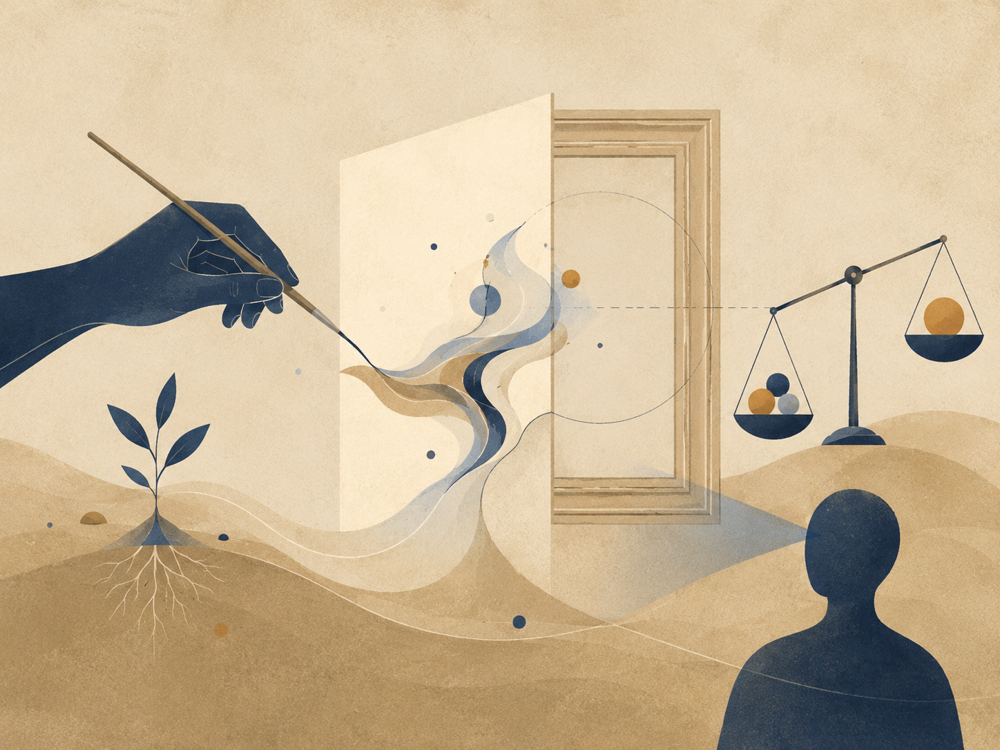

תיאור תמונה: יצירה כמרחב שבו אפשרות מקבלת צורה מבלי להיסגר לחלוטין.

### מקור חי, קאנון וצורה שאינה מחליפה נשימה

אומנות, וגם אמנות במובנה הרחב, היא מעבדה טבעית של התאוריה מפני שכל יצירה מתחילה בעודף. לפני שיש תמונה, סיפור, פסל, קומיקס, סרט או משחק, יש מרחב של אפשרויות: קווים שלא צוירו, דמויות שלא נולדו, צבעים שנדחו, סופים שננטשו, נקודות מבט שלא נבחרו. היצירה היא לא רק מה שנוסף לעולם; היא גם מה שנחתך כדי שמשהו אחד יוכל להחזיק צורה.

הכשל העמוק בביקורת יצירה הוא החלפת מקור באפקט. אפשר לשאול האם היצירה מרגשת, יפה, חכמה, חדשה או “עובדת”. אבל התאוריה שואלת גם שאלה אחרת: האם נותר בה יחס חי בין מקור, סיכון וצורה. יצירה יכולה להיות מושלמת טכנית ועדיין מתה, אם היא נראית כאילו אף אחד לא היה חייב לכתוב אותה. מצד שני, פגם אינו קדוש. לא כל גמגום הוא עומק. לא כל שבר הוא אמת.

מפת היחס: יצירה חיה = מקור חי × הכרח פנימי × צורה × מחיקה אחראית × קצב × קנון שנבדק / חיקוי × אפקט ריק × פוזה × עודף לא מעובד × שוק בלבד × אוטומציה שמתחפשת למקור. המפה אינה מודדת יופי. היא בודקת האם האופטימלי האמנותי נולד מתוך נאמנות לאידיאל פנימי או מתוך התאמה שטוחה לטעם צפוי.

AI משנה את השאלה. כלי יכול לייצר תמונה, סגנון, סיפור, רעיון, קומפוזיציה, עיצוב או וריאציה. הוא פותח פוטנציאל אמיתי: סקיצות מהירות, נגישות, תרגול, שפה חזותית, ניסויים. אבל הוא גם יכול למחוק את המרחק שבו מקור חי נעשה יצירה. כאשר היוצר מבקש תוצר בלי לשאת בחירה, מחיקה, אחריות וסיכון, הכלי לא הרחיב את היצירה; הוא החליף את פעולת ההיווצרות.

קאנון הוא לא בית כלא ולא חותמת גדולה. קאנון הוא זיכרון של צורות ששרדו מפגש עם זמן. יצירה חדשה אינה חייבת לציית לו, אבל אם היא מתעלמת ממנו בלי להבין מה הוא שמר, היא מאבדת עומק. האידיאל אינו “להיות מקורי” בכל מחיר. האידיאל הוא לייצר צורה שבה מה שהיה יכול להיות נעשה הכרחי מספיק כדי להישאר.

האומנות משתלבת עם כלכלה מפני ששוק יכול לאפשר יצירה וגם לעוות אותה; עם AI מפני שמקור חי יכול להפוך לתבנית; עם חינוך מפני שתלמיד אמנות צריך מרחק ולא רק תיק עבודות; ועם מושג החסד של הוויתור מפני שלפעמים היצירה הטובה ביותר היא זו שיודעת לוותר על האפקט שמבריק יותר מהאמת שלה.

אומנות של פוטנציאל אינה נוסטלגיה נגד טכנולוגיה ואינה הגנה על סבל בשם אותנטיות. היא אומרת: מותר להשתמש בכל כלי, אבל אסור לשקר לגבי המקום שבו הכלי עמד במקום המקור. יצירה חיה אינה רק תוצאה מרשימה. היא עקבה של בחירה שעברה דרך אדם.

### משמעת מקורות

מקורות עבודה וזהירות: הפרק נשען על מסגרת התאוריה, ועל מקורות רקע כלליים שנבדקו מחוץ לפרומפט: UNESCO על בינה מלאכותית בחינוך, WHO על אתיקה וממשל של AI בבריאות, NIST AI RMF לניהול סיכוני AI, CERN/ATLAS על המודל הסטנדרטי וה-Higgs, NASA ו-ESA/Planck על קוסמולוגיה, Stanford Encyclopedia of Philosophy על Bell, Kochen-Specker וקונטקסטואליות, ו-Britannica/ISFDB לזיהוי ספרותי של Harlan Ellison ו-I Have No Mouth, and I Must Scream. המקורות אינם מוכנסים כהוכחות לתאוריה אלא כבלמים נגד שימוש ריק במונחים.

## מוזיקה של פוטנציאל

*זמן, קול, הקשבה ותהודה שאינה מדד*

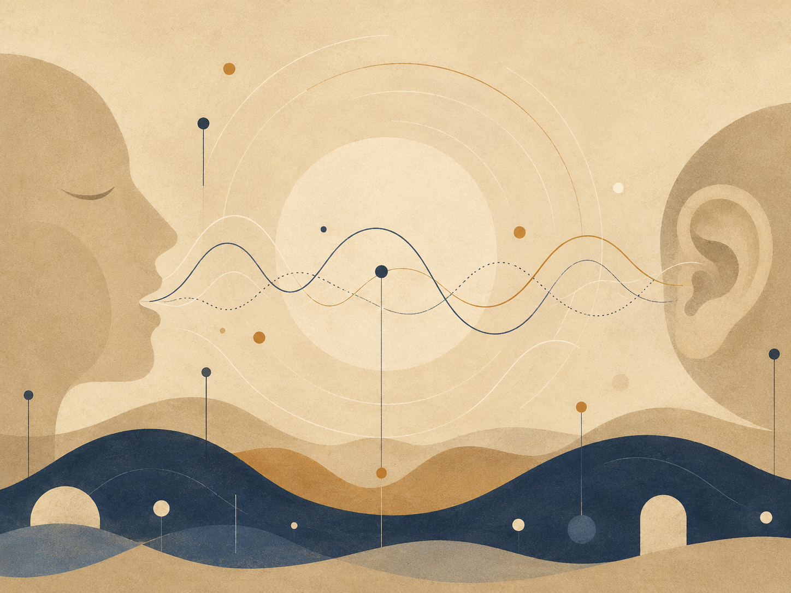

תיאור תמונה: קצב, שקט וחזרה כדרך להחזיק אפשרות בזמן.

### קול, זמן, שתיקה והאופטימום שאינו רק דיוק

מוזיקה בוחנת את התאוריה דרך זמן. ציור עומד, משפט נקרא, מבנה נושא עומס; מוזיקה מתרחשת ונעלמת תוך כדי הופעתה. היא מלמדת שפוטנציאל אינו רק מרחב של אפשרויות אלא גם קצב של התגלות. תו מוקדם מדי או מאוחר מדי אינו אותה אפשרות. שתיקה במקום הנכון אינה היעדר אלא צורה פעילה של יחס.

הכשל העמוק במוזיקה הוא החלפת קול בביצוע. אפשר לנגן נכון, לשיר נקי, להפיק מבריק, לסדר הרמוניה עשירה, ועדיין לא לשמוע אדם. מצד שני, זיוף אינו אוטומטית אמת. מוזיקה חיה אינה מוזיקה “לא מושלמת”; היא מוזיקה שבה הדיוק משרת נשימה, זיכרון, גוף, מקום וסיכון.

מפת היחס: מוזיקה חיה = קול × זמן × מתח × שתיקה × חזרה עם שינוי × מקור חי × הקשבה / נוסחה × ליטוש יתר × רעש × חיקוי × ניכוס × הפקה שמוחקת גוף. זו מפת אבחנה בין אופטימום טכני לאופטימום מוזיקלי. אופטימום טכני שואל אם הכל יושב; אופטימום מוזיקלי שואל האם מה שיושב גם נושם.

AI במוזיקה פותח אפשרויות אמיתיות: סקיצות, ליווי, הדגמות, נגישות למי שאין לו הרכב, הרחבת צלילים, תרגול, שחזור. אבל הוא גם מעלה את הסכנה העתיקה ביותר בצורה חדשה: קול בלי מקור. כאשר סגנון של זמר, נגנית, קהילה או מסורת נשלף כאפקט, הפוטנציאל של מוזיקה מתנתק מהחיים שיצרו אותו. לא כל שימוש הוא גניבה, אבל כל שימוש דורש תשובה לשאלה: האם הכלי הרחיב קול חי או הפך אותו לחומר גלם בלי פנים.

המוזיקה קרובה לכלכלה מפני שהיא חיה בין מתנה, עבודה ושוק. היא קרובה לחינוך מפני שאימון טוב שומר מרחק: מספיק חזרה כדי לבנות גוף, מספיק חופש כדי לא לחנוק קול. היא קרובה לאופקי גבול מפני שכל ביצוע עומד מול מה שלא ניתן לשמוע עדיין: הרגש שלא התנסח, הטון שנמצא רק ברגע, הקהל שמשנה את השיר בכך שהוא שומע אותו.

מוזיקה של פוטנציאל אינה אומרת שהאנושי תמיד טוב מהמכונה. היא אומרת שהשאלה אינה מי הפיק צליל נקי יותר. השאלה היא האם יש יחס אחראי בין מקור, קול, זמן והאזנה. גם מכונה יכולה לסייע; גם אדם יכול לזייף מקור. אבל מוזיקה חיה אינה סתם דפוס יפה. היא זמן שבו משהו מקבל רשות להופיע בלי להיגמר בתוצר.

### משמעת מקורות

מקורות עבודה וזהירות: הפרק נשען על מסגרת התאוריה, ועל מקורות רקע כלליים שנבדקו מחוץ לפרומפט: UNESCO על בינה מלאכותית בחינוך, WHO על אתיקה וממשל של AI בבריאות, NIST AI RMF לניהול סיכוני AI, CERN/ATLAS על המודל הסטנדרטי וה-Higgs, NASA ו-ESA/Planck על קוסמולוגיה, Stanford Encyclopedia of Philosophy על Bell, Kochen-Specker וקונטקסטואליות, ו-Britannica/ISFDB לזיהוי ספרותי של Harlan Ellison ו-I Have No Mouth, and I Must Scream. המקורות אינם מוכנסים כהוכחות לתאוריה אלא כבלמים נגד שימוש ריק במונחים.

## 10. הנדסה וארכיטקטורה של פוטנציאל

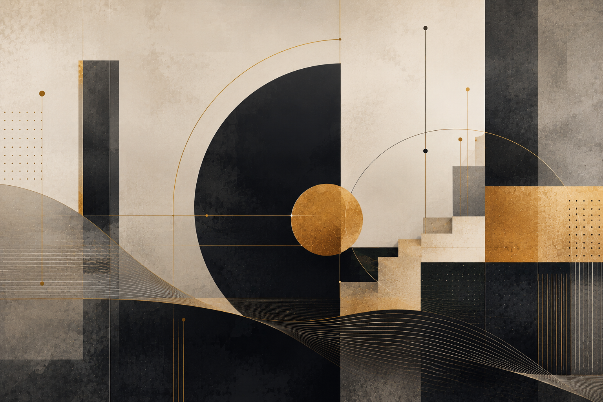

תיאור תמונה: מערכת הנדסית שבה פוטנציאל הופך למבנה, תיעול, בדיקה ותיקון.

הנדסה וארכיטקטורה של פוטנציאל - מודל חומרי של יחס, עומס ותיקון

בגרסה הלוגית של התאוריה, הנדסה וארכיטקטורה אינן מובאות כמשל רופף, אלא כשפת יחס: דרך לראות כיצד פוטנציאל נעשה צורה רק כאשר הוא פוגש חומר, עומס, שימוש, שחיקה וזמן. הפרק אינו טוען שהאדם הוא מבנה או שחברה היא מכונה. הוא משתמש במבנה כדי לנסח עיקרון מוגבל ומדויק: אידיאל שאינו פוגש התנגדות עדיין לא נבחן.

כנוסחת־מפה:

Living Structure =
Potential × Form Coherence × Material Fit × Use
-----------------------------------------------
Load × Friction × Wear × Uncertainty

תכנית אינה מבנה. התכנית היא צורה אפשרית לפני העולם; המבנה הוא אותה צורה אחרי שפגשה חומר, כוח, תקציב, גוף, שימוש וזמן. לכן Blueprint ≠ Building. זהו אחד הדיוקים החשובים של התאוריה: אידיאל אינו מתבטל כאשר הוא פוגש מגבלה, אבל הוא משתנה כאשר הוא נעשה ממשי.

חומר הוא פוטנציאל עם גבול. פלדה, בטון, עץ, זכוכית ואבן אינם רק אמצעים ניטרליים; כל חומר אומר כן לדברים מסוימים ולא לדברים אחרים. לכן Material = Potential with Limits. צורה טובה אינה מכניעה חומר, אלא לומדת מה הוא מסוגל לשאת.

עומס הוא המציאות שנכנסת אל הצורה. במפה הפשוטה ביותר:

Demand ≤ Capacity

וכאשר הדרישה חורגת מן היכולת, מופיעים נזק, כשל או חריגה ממצב גבול. אבל היכולת נשחקת, הדרישה משתנה, והשימושים משתנים. לכן השאלה אינה רק האם המבנה עומד עכשיו, אלא האם הוא יכול להמשיך לעמוד בתוך זמן.

מקדם הביטחון הוא המקום שבו החישוב מודה שאינו אלוהים:

Factor of Safety = Capacity / Demand

במישור הלוגי, מקדם ביטחון הוא ענווה מתמטית. הוא אומר: חישבתי, ולכן אני יודע איפה להשאיר מקום לטעות. אידיאל מסוכן סומך על עצמו עד הקצה. אידיאל חי משאיר מרווח.

מאמץ, מעוות וסדק מלמדים שהחומר מדבר לפני שהוא נשבר:

σ = F / A
ε = ΔL / L

σ = Eε

סדק אינו תמיד אסון, אבל הוא תמיד מידע. Crack = Local Disturbance + Structural Information. עולם ללא סדקים אינו קיים; עולם מתוקן הוא עולם שבו הסדקים נקראים בזמן.

ארכיטקטורה מוסיפה את האדם אל המבנה. Structure שואל אם הדבר עומד; Architecture שואלת איך חיים בתוך מה שעומד. חדר, חלון, מסדרון ודלת הם לא רק חלקים פיזיים; הם הצעות להתנהגות, גבול, פרטיות, מפגש וזמן.

התנועה, האור, התהודה, היתירות והתחזוקה מוסיפים שכבות לוגיות נוספות: מרחב מובן דרך גוף; אור הוא חומר לא־חומרי שמכניס זמן אל המבנה; תהודה מראה שלא רק עוצמה שוברת אלא גם קצב; יתירות מונעת מכשל מקומי להפוך לקריסה; תחזוקה היא ההסכמה המתמשכת בין צורה לזמן.

החוק העמוק של הפרק אינו Maximize Form אלא Hold Human Potential Under Real Conditions. לא למקסם צורה, אלא להחזיק פוטנציאל אנושי בתנאים אמיתיים. תיקון הנדסי אינו גאולה; הוא כיול חוזר בין רעיון, חומר, עומס, אדם וזמן.

## 11. כלכלה של יחס

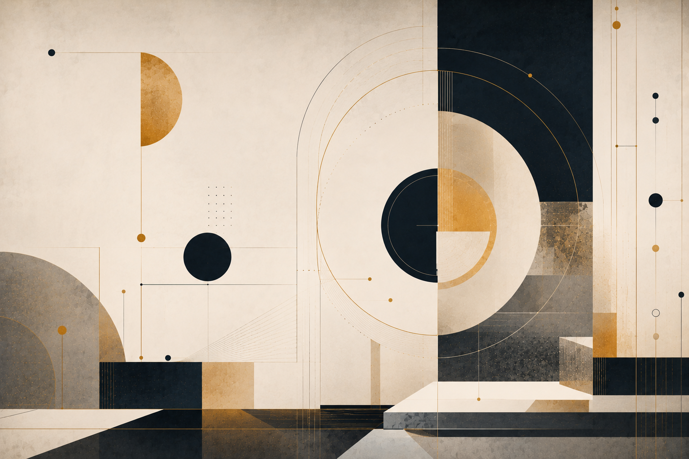

תיאור תמונה: ערך, חליפין ואחריות כיחסים חיים ולא רק כמספרים.

כלכלה של יחס - מודל של סימן, אמון וערך

בגרסה הלוגית של התאוריה, כלכלה אינה מופיעה כתחום של כסף בלבד, אלא כשאלה על תיווך: איך פוטנציאל אנושי נעשה ערך שחברה יכולה לזהות, להעביר ולסמוך עליו. כסף, מחיר, שוק, אשראי, חוזה ושכר אינם הערך עצמו. הם צורות שבהן חברה מנסה ללכוד פוטנציאל בלי להרוג אותו.

כנוסחת־מפה:

Conceptual Value ≈ Potential × Trust × Coordination

העיקרון הראשון הוא שאין ערך בלי מערכת ייחוס:

Value(A) has no meaning alone.

Value(A) = Relation(A, B)

כאשר אומרים “הדולר עלה”, המשפט המלא הוא תמיד: הדולר עלה ביחס ל־X. מטבע יכול להתחזק מול מטבע אחד ולהיחלש מול כוח קנייה, זהב, דלק, שכר או דיור. יחסיות אינה דמיון; היא הדרך שבה ערך נעשה מדיד וכואב בתוך מערכת.

כסף הוא פוטנציאל נייד:

Money = Portable Potential

Past Labor → Future Optionality

אדם עובד, מקבל סימן, והסימן פותח אפשרות עתידית. אבל הסכנה מתחילה כאשר הסימן מתחפש לערך עצמו. לכן Market Price ≠ Full Value. מחיר הוא אות בתוך מערכת של ביקוש, היצע, מחסור, כוח, פחד, מידע ואמון; הוא אינו פסק דין על הראוי.

גם זהב אינו ערך מוחלט:

Gold ≠ Absolute Value

Gold = Durable Scarcity + Non-monetary Use + Collective Belief + Historical Trust

גם כאשר מחפשים קרקע “אמיתית” מתחת לסימן, מוצאים שוב יחס: חומר, נדירות, היסטוריה, אמון ופחד.

כוח קנייה מראה מה הסימן עדיין מסוגל לפתוח:

Purchasing Power = m / P

כאשר P עולה, m/P יורד. המספר יכול להישאר זהה, אבל הפוטנציאל שהוא פותח מתכווץ. אינפלציה היא לכן לא רק עלייה במחירים, אלא אובדן דיוק בשפת הכסף:

Inflation = Loss of Precision in the Language of Money

השוק הוא מערכת מידע מבוזרת, אבל לא מצפון:

Market = Distributed Information System
Market = Mirror

Market ≠ God

השוק יודע לשקף רצון; הוא אינו יודע לבדו אם הרצון טוב. לכן כלכלה בריאה צריכה אותות שוק, גבולות מוסריים, אמון מוסדי ופוטנציאל אנושי.

אשראי מכניס את העתיד אל ההווה:

Credit = Trust in Future Value
Debt = Future Obligation Pulled into the Present

חוב בריא פותח אפשרות; חוב חולה אוכל אפשרות. ריבית מתמחרת זמן, סיכון ואמון, אבל עלולה להפוך לכלי שניזון מחוסר מוצא. עבודה היא פוטנציאל שעובר דרך גוף, ולכן שכר אינו רק מחיר אלא גם הכרה. רווח יכול להיות יצירה או חילוץ; חיצוניות היא מה שהמחיר השאיר מחוץ לעסקה; אי־שוויון נעשה עמוק כאשר תוצאה הופכת לתנאי פתיחה.

החוק הכלכלי העמוק של התאוריה אינו Maximize Money אלא Maximize Human Potential Without Destroying the Human. לא למקסם כסף; למקסם את האפשרות שפוטנציאל אנושי יהפוך לערך בלי שהאדם יימחק בדרך. תיקון כלכלי אינו גאולה, אלא כיול חוזר בין סימן, אמון, אדם ופוטנציאל.

## 12. ממשל של פוטנציאל

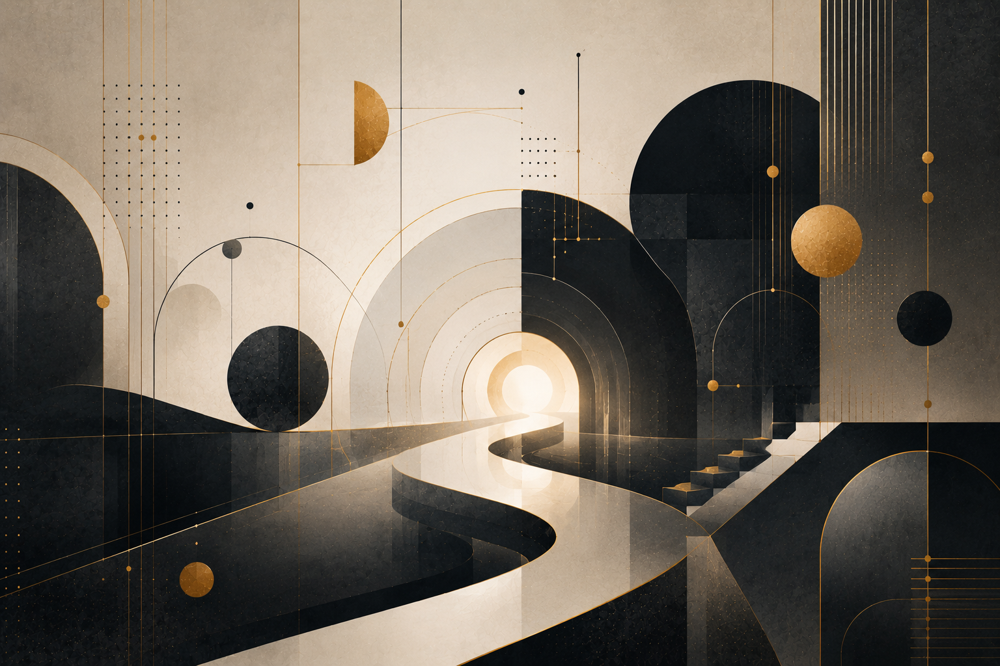

תיאור תמונה: מוסדות, הכרעה ותיאום ציבורי כדרכים לתרגם אפשרות לאחריות.

ממשל של פוטנציאל - מודל של כוח, חוק ואמון

בגרסה הלוגית של התאוריה, ממשל אינו רק מוסדות, אלא שאלה על תווך: איך ריבוי אנושי הופך לצורה שמסוגלת לחיות בלי להפוך לאלימות. לאדם יש רצון, פחד, כוח, צורך, זיכרון, פצע ואפשרות שעדיין לא קיבלה מקום. זהו הפוטנציאל החברתי.

כנוסחת־מפה:

Stable Society =
Human Potential × Trust × Just Lawfulness × Coordination
--------------------------------------------------------------
Arbitrary Power × Fear × Corruption × Uncertainty

הממשל הוא ניסיון להפוך כוח לצורה. החוק הוא ניסיון להפוך רצון לגבול. המוסד הוא ניסיון להפוך החלטה פרטית לאחריות ציבורית.

מצב טבע אינו רק עבר מדומיין; הוא קריסת תווך שאפשר לסמוך עליו:

State of Nature = Collapse of Trusted Mediation

החברה יוצאת ממנו שוב ושוב בכל יום שבו אנשים מעדיפים חוק על נקמה, מוסד על כוח, ושפה על אגרוף. זו אינה גאולה; זו תחזוקה.

חוק במיטבו הוא מגבלה שמאפשרת חירות משותפת:

Law at its best = Constraint that Enables Shared Freedom

אבל חוק יכול להפוך לאליל. לכן חוק חי צריך יציבות כדי שאפשר יהיה לסמוך עליו, ותיקון כדי שלא יהפוך לפסל.

לגיטימיות היא השאלה למה אדם מקבל החלטה שלא הוא קיבל:

Legitimacy =
Recognized Authority × Trust × Procedural Fairness × Accountability
---------------------------------------------------------------------
Coercion × Corruption × Arbitrary Power

סמכות יכולה להכריע; היא אינה הופכת הכרעה לאמת:

Authority ≠ Truth

משום כך ריבונות צריכה גבולות. הפרדת רשויות היא חשד מתוכנן: חלוקת תפקידים והגבלה הדדית כדי למנוע מן הכוח לשכוח שהוא רק תווך. בחירות מודדות רצון ציבורי לגיטימי, לא אמת פילוסופית. דמוקרטיה חיה היא רוב בתוך מסגרת שמגינה גם מפני הרוב.

זכות היא אפשרות אנושית מוגנת מפני כוח:

Right = Institutionally Protected Human Possibility Against Power

חובה היא חלק לגיטימי במחיר התחזוקה של אפשרות משותפת:

Duty = Legitimate Share in the Cost of Maintaining Shared Possibility

מוסד הוא זיכרון ציבורי עם הליך ואחריות. בירוקרטיה היא הכרחית, אך היא מתה כאשר ההליך גדול מן האדם. שחיתות היא השתלטות פרטית על תווך ציבורי. מס הוא חובה כספית לבניית יכולת משותפת. כוח לגיטימי הוא כוח קשור בחוק, בפיקוח, במידתיות, בנחיצות ובתכלית.

מצב חירום הוא חריגה זמנית עם פיתוי להפוך לקבועה. חברה אזרחית היא החיים המשותפים שאינם יכולים לבוא רק מן המדינה. שפה ציבורית היא המקום שבו חברה חושבת בקול; כאשר כל יריב נעשה בוגד וכל ביקורת נעשית שנאה, אין תיקון.

החוק העמוק של ממשל וחברה אינו Maximize Control אלא Hold Shared Human Potential Without Devouring the Human. לא למקסם שליטה; להחזיק פוטנציאל אנושי משותף בלי לבלוע את האדם. תיקון שלטוני אינו גאולה, אלא כיול חוזר בין רצון, חוק, מוסד, אמון, השתתפות, ביקורת ותיקון.

## משפט של פוטנציאל: צדק תחת מגבלה

*צדק, ראיות, מרחק ותיקון תחת מגבלה*

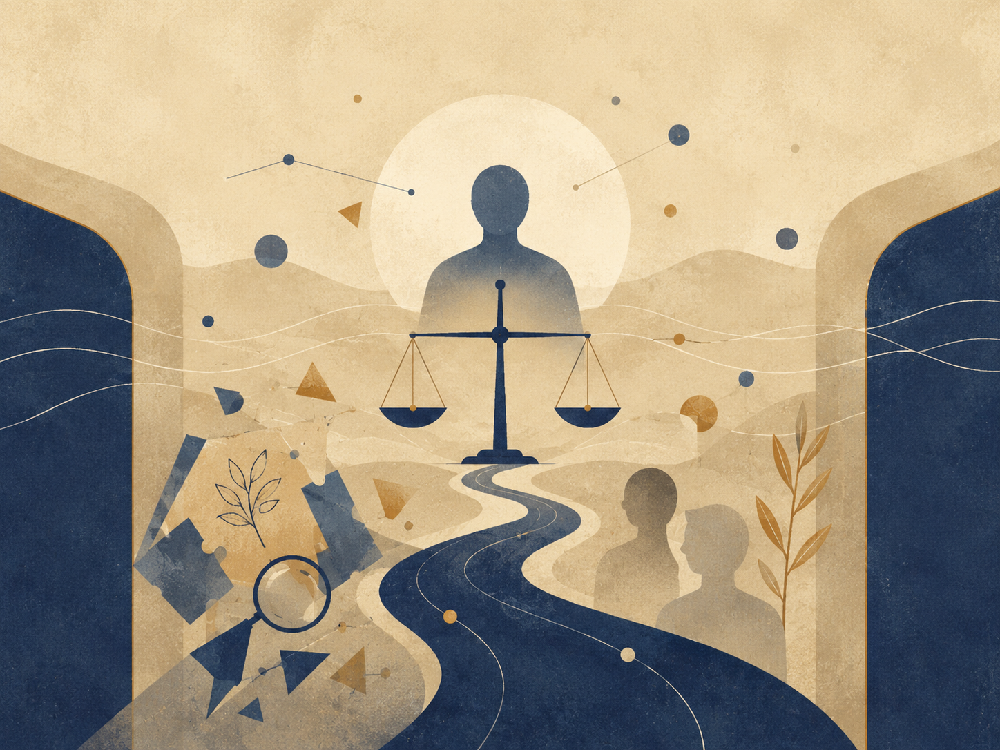

תיאור תמונה: חוק, פרשנות וגבול כמרחב שבו אפשרות נבחנת מול אחריות.

### המשפט כתרגום מוסרי תחת מגבלה

כדי לקרוא את המשפט דרך התאוריה, צריך להבין שהוא אינו רק מערכת חוקים, ואינו רק מנגנון הכרעה בין טענות. המשפט הוא המקום שבו החברה מנסה לתרגם פוטנציאל מוסרי לאידיאל מוסדי תחת תנאים קשים: כאב שכבר התרחש, אמת שאינה תמיד נגישה, כוח שאינו מתחלק באופן שווה, זמן שאוזל, ראיות שנשברות, זיכרונות שנשחקים, פחד ציבורי, לחץ מערכתי, ואדם ממשי שעומד מול צורה גדולה ממנו.

המשפט הוא אחד המבחנים הקשים ביותר לתאוריה, מפני שהוא פועל בדיוק במקום שבו פוטנציאל, אידיאל ואופטימלי מתנגשים עם כאב, כוח, זמן, ראיה ומוסד. פגיעה כבר התרחשה, או נטען שהתרחשה. מישהו נפגע. מישהו מואשם. מישהו מכחיש. מישהו זוכר. מישהו שוכח. מישהו מחזיק ראיה. מישהו מחזיק כוח. המשפט נדרש להפוך את כל זה לצורה: הליך, עדות, הכרעה, אחריות, גבול, פיצוי, ענישה, שיקום או זיכוי.

אבל הצורה המשפטית מסוכנת בדיוק משום שהיא נחוצה. בלי צורה, כאב יכול להפוך לנקמה. בלי הליך, כוח יכול להעניש את מי שנוח להעניש. בלי ראיות, אמת יכולה להיקבר תחת תחושה. אבל כאשר הצורה שוכחת מדוע נוצרה, היא הופכת לכוח מסודר. בית משפט יכול להיראות כמו צדק גם כאשר הוא רק מנהל כאב. חוק יכול להיראות כמו אמת גם כאשר הוא רק מחלק אפשרויות לפי מי מסוגל לשכור עורך דין, מי מסוגל להמתין, מי מסוגל להוכיח, ומי נראה אמין בתוך שפה מוסדית.

### תחומי המשפט שהעדשה חלה עליהם

הדוגמאות הבאות נלקחות בעיקר מן המשפט הפלילי, מפני שבו המתח בין כאב, ראיות, כוח, אחריות וענישה מופיע בצורה החריפה ביותר. אך העדשה עצמה רחבה יותר. היא יכולה לחול גם על משפט אזרחי, מנהלי, חוקתי, חוזי, משפחתי וכלכלי — בכל מקום שבו צורה משפטית נדרשת להכריע בגורל אנושי תחת מגבלה.

במשפט אזרחי, אותה עדשה שואלת האם פיצוי כספי באמת משיב אפשרות שנפגעה, מכיר בנזק ומצמצם עוול, או רק מתרגם כאב למספר. במשפט מנהלי היא שואלת האם החלטת הרשות שומרת על האדם שמאחורי הטופס. במשפט משפחתי היא שואלת האם ההכרעה מגינה על הילד והצדדים, או רק מסיימת סכסוך בצורה נוחה למערכת. במשפט חוקתי היא שואלת האם ההגנה על הכלל עדיין שומרת על האדם היחיד, או הופכת את זכויותיו למחיר נוח בשם סדר ציבורי.

### פוטנציאל משפטי

הפוטנציאל המשפטי הוא כל מה שעדיין יכול להיעשות ראוי לפני שהוא מתקבע כעוול נוסף. הוא כולל אמת שעדיין לא התבררה, פגיעה שעדיין לא קיבלה שפה, נאשם שעדיין לא צומצם לזהות של אשמה, נפגע שעדיין לא הפך לסמל, ראיה שעדיין לא פורשה, הליך שעדיין יכול להישאר הוגן, ענישה שעדיין יכולה להציב גבול בלי להפוך לנקמה, וחברה שעדיין יכולה לבחור שלא להשתמש בכאב כדי להצדיק מחיקה.

הפוטנציאל המשפטי אינו מבטיח תיקון מלא. לפעמים כל שנותר בו הוא האפשרות הצנועה אך החיונית שלא להוסיף עוול על עוול. במובן הזה, פוטנציאל משפטי אינו חלום רך על פיוס מוחלט, אלא נקודת אחריות לפני קיבוע: לפני שהמערכת קובעת אשמה, חירות, זכאות, פיצוי, ענישה, סיפור או סופיות.

אפשר לנסח את המשפט דרך מפת יחס:

צדק מוסדי =
אמת מבוררת × ראיות × הליך הוגן × מידתיות × אפשרות תיקון × גישה
חלקי
כוח שרירותי × נקמה × הטיה × עיוורון מערכתי × אי־שוויון × אוטומציה.

זו אינה נוסחה משפטית, אלא מפת אזהרה. היא שואלת האם ההליך מקרב לצדק או רק מייצר צורה; האם הראיות מחזיקות את האמת או מחליפות אותה; האם הענישה מגנה ומתקנת או פורקת זעם; האם הנפגע נשמר כאדם או הופך לסמל; האם הנאשם נשמר כאדם או מצטמצם לאשמה; והאם המערכת יודעת להבחין בין גבול לבין מחיקה.

### אידיאל משפטי וצדק הליכי

האידיאל המשפטי אינו הרשעה מרבית, זיכוי מרבי, ענישה מרבית, יעילות מרבית או סגירת תיקים מרבית. כל אלה יכולים להיות תוצאות או מדדים, אבל הם אינם האידיאל עצמו. האידיאל המשפטי הוא צדק ראוי: מצב שבו האמת נבחנת ברצינות, הכוח מוגבל, הפגיעה מוכרת, האחריות אינה נברחת, האדם אינו נמחק לתוך התיק, והמערכת נשארת מסוגלת לתקן את עצמה כאשר מתגלה שהאופק שממנו פעלה היה חלקי.

צדק משפטי אינו רק תוצאה ראויה, אלא גם דרך ראויה להגיע אליה: הליך שמאפשר טענה, התנגדות, ייצוג, ביקורת ותיקון. הליך אינו רק טכניקה. הוא הדרך שבה מערכת בעלת כוח מכריחה את עצמה לא למהר להפוך חשד, כאב או פחד להכרעה. בלי הליך, צדק עלול להפוך לאלימות בשם הטוב. בלי צדק, הליך עלול להפוך לפולחן צורה.

### האופטימלי המשפטי

האופטימלי המשפטי הוא התרגום המקומי של האידיאל הזה תחת מגבלות ממשיות. הוא אינו האידיאל הטהור, מפני שהמשפט לעולם אינו פועל בתוך ידיעה מלאה. הוא פועל בתוך זמן, ראיות, עלויות, פחד, עומס, אי־שוויון, שפה מוסדית, זיכרון אנושי, מגבלות פרוצדורליות וסיכון להמשך פגיעה.

לכן השאלה המשפטית העמוקה אינה רק “מה נכון”, אלא מהי הפעולה ההוגנת ביותר שאפשר לבצע עכשיו בלי להפוך את הצורה המשפטית לתחליף לצדק. האופטימלי המשפטי אינו ויתור על האידיאל, אלא סירוב לשקר בשם האידיאל: הוא מכיר במגבלה, אבל אינו הופך את המגבלה לתירוץ מוסדי.

### מרחק משפטי

המשפט מלמד את התאוריה הבחנה עמוקה בין אמת לבין נגישות לאמת. ייתכן שאירוע התרחש, אבל הראיות אינן מספיקות. ייתכן שאדם נפגע, אבל הזיכרון שבור. ייתכן שאדם חף, אבל המערכת רואה בו דפוס. ייתכן שהאמת קיימת מעבר לאופק הראיות. המשפט נולד משום שהוא חייב לפעול גם כאשר האמת אינה נגישה בשלמותה. לכן צדק משפטי אינו זהה לאמת מוחלטת; הוא ניסיון מוסדי אחראי לפעול תחת אופק מידע מוגבל.

כאן המשפט פוגש את מושג המרחק של התאוריה. המרחק המשפטי הוא הפער בין מה שאולי קרה לבין מה שניתן להוכיח; בין כאב לבין ראיה; בין אמת חיה לבין אמת קבילה; בין אדם לבין תפקידו בתיק; בין תחושת צדק לבין הליך הוגן; בין אשמה מוסרית לבין אשמה משפטית; ובין ידיעה פנימית לבין הוכחה חיצונית. אם המרחק הזה נמחק, המשפט הופך לנקמה או לאמונה עיוורת. אם המרחק הזה גדול מדי ואינו מקבל צורה, המשפט הופך לאדישות מסודרת. המשפט הראוי אינו מוחק את המרחק ואינו נכנע לו. הוא מנסה להחזיק אותו בצורה אחראית.

במובן זה, המשפט אינו רק מתמודד עם מרחק; הוא גם יוצר מרחק בכוונה. חזקת החפות, דיני הראיות, זכות הטיעון, זכות הייצוג והערעור הם כולם צורות מוסדיות של מרחק: מנגנונים שמונעים מן הכאב, מן החשד או מן הכוח להפוך מיד להכרעה.

### חוקיות מול ראויות

לכן חוק יכול להיות חוקי ועדיין לא להיות ראוי. הליך יכול להיות תקין ועדיין לא לראות אדם. הכרעה יכולה להיות מנומקת ועדיין להחמיץ את הפגיעה. ענישה יכולה להיות מוצדקת ועדיין לאבד את שאלת התיקון. ומנגד, חמלה שאינה מציבה גבול אינה בהכרח אידיאל; לפעמים היא סירוב לקחת אחריות על הנזק.

המשפט של פוטנציאל אינו מבקש להחליף את החוק ברגש, אלא לשאול האם החוק עדיין משרת את מה שבגללו נוצר: הגנה על האפשרות של צדק בתוך עולם שבו הצדק אינו מופיע בשלמותו. חוקיות אינה ערובה לראויות, אבל גם ראויות שאינה מוכנה לעבור דרך חוקיות עלולה להפוך לאלימות בשם הצדק.

### נפגע ונאשם כמקורות חיים

במובן הזה, גם הנפגע וגם הנאשם צריכים להישמר כמקורות חיים, לא כסמלים. אין בכך סימטריה מוסרית פשוטה בין נפגע לנאשם; יש בכך הכרה בכך שהמשפט עלול למחוק בני אדם בדרכים שונות, גם כאשר תפקידיהם בהליך שונים לחלוטין.

הנפגע אינו רק ראיה לפגיעה, אינו רק כלי להרשעה, ואינו רק קול שמותר להשתמש בו כדי להצדיק ענישה. הנאשם אינו רק סיכון, אינו רק שם של עבירה, ואינו רק גוף שעליו המערכת מוכיחה את כוחה. המשפט צריך להחזיק את הפגיעה בלי להפוך אותה לרישיון למחיקה, ולהחזיק את החשד בלי להפוך אותו לזהות שלמה. זה קשה דווקא משום שהמשפט פועל במקום שבו הכאב דורש הכרעה, אבל האמת אינה תמיד נותנת את עצמה באותה מהירות.

שמירה על הנאשם כאדם אינה מחלישה את חובת ההכרה בפגיעה; להפך, היא מונעת מן המשפט להפוך את ההכרה עצמה לכלי נקמה במקום לכלי צדק. שמירה על הנפגע כאדם אינה מחייבת להפוך את הכאב להכרעה אוטומטית; להפך, היא דורשת מההליך לשמוע את הפגיעה בלי להשתמש בה כחומר גלם מוסדי.

### עסקאות טיעון

עסקת טיעון מדגימה את הבעיה בצורה חדה. מבחוץ היא יכולה להיראות כמו אופטימלי מוסדי: פחות זמן, פחות סיכון, פחות עומס, תוצאה צפויה יותר. אבל דרך התאוריה צריך לשאול: אופטימלי ביחס לאיזה אידיאל, ולמי? האם זו דרך מקומית ראויה להגן על נפגע, לצמצם נזק, ולפעול תחת מגבלות ראיות וזמן? או שזו צורה שמתרגמת פערי כוח להסכמה לכאורה?

אותה עסקה יכולה להיות תרגום אחראי של אידיאל תחת מגבלה, ויכולה להיות מחיקה מנומסת של אמת שלא היה לה כוח להופיע. עסקת טיעון ראויה אינה נמדדת רק בשאלה אם כל הצדדים חתמו עליה, אלא בשאלה איזה מרחק היא סגרה, איזה מרחק היא שמרה, ואיזה קול היא השאירה מחוץ לצורה.

### ענישה

גם הענישה צריכה להיקרא כך. ענישה אינה פסולה מעצם היותה כאב מוסדי. לפעמים היא מגנה, מציבה גבול, מכירה בפגיעה ומונעת המשך נזק. אבל לפי התאוריה, סבל אינו נעשה קדוש רק מפני שהמדינה מפעילה אותו. כאב אינו הוכחה שצדק נעשה.

ענישה ראויה צריכה להחזיק יחד גבול, הכרה, פרופורציה, הגנה ואפשרות תיקון. כאשר אחד מהם בולע את האחרים, הענישה מתעוותת: היא נעשית רכה מדי, נקמנית מדי, טכנית מדי או עיוורת מדי. אם הענישה שומרת על גבול, מכירה באחריות ומשאירה פתח לתיקון כאשר תיקון אפשרי, היא יכולה לשרת אידיאל משפטי. אם היא מסתפקת בכך שמישהו יסבול כדי שהמערכת תרגיש שהגיבה, היא הופכת לאופטימום מדומה: צורה חזקה של תגובה שמסתירה חולשה מוסרית.

### עונש מוות

מתוך זה נובעת דרך עדשת התאוריה התנגדות עקרונית לעונש מוות. לא מפני שכל פגיעה ניתנת לתיקון, ולא מפני שכל אדם מסוכן יכול לשוב מיד אל החברה, ולא מפני שכל פגיעה נסלחת, אלא מפני שעונש מוות הופך את המשפט מפעולה של גבול לפעולה של מחיקה סופית. הוא סוגר את אופק התיקון גם כאשר תיקון חלקי בלבד היה אפשרי; הוא סוגר את אופק הערעור גם כאשר ראיות חדשות עשויות להופיע; והוא מעניק למדינה כוח להכריז שלא רק מעשה מסוים חצה גבול, אלא שאדם מסוים איבד לחלוטין את האפשרות להישאר מקור חי.

ההתנגדות הזאת אינה מבטלת את חובת ההגנה של החברה. היא רק מפרידה בין הגנה קיצונית לבין מחיקה סופית. גם כאשר הגמול, ההרתעה וההגנה מעלים טענות כבדות משקל, התאוריה מבחינה בין שלילת חירות קיצונית לבין שלילת כל אפשרות עתידית. הראשונה יכולה להיות הכרחית; השנייה דורשת מן המדינה סמכות של סופיות שאין לה דרך לתקן אם התבררה כטעות.

לכן גם במקרה שבו החברה חייבת להגן על עצמה באופן חמור, ואפילו להרחיק אדם לצמיתות ממעגל החיים החברתי החופשי, ההרחקה אינה צריכה להפוך להשמדה. גבול חזק אינו מחייב מחיקה. ענישה ראויה יכולה להגן, להגביל, להכיר בפגיעה ולמנוע נזק נוסף; אבל כאשר היא לוקחת לעצמה את הזכות לסגור סופית את כל אפשרות התיקון, היא מפסיקה להיות אופטימלי משפטי והופכת לאידיאל כוזב של סיום.

### אופק הראיות

כאן נכנס גם אופק הראיות. המשפט אינו פועל מול האמת עצמה, אלא מול מה שניתן להביא אל תוך צורה משפטית. יש אמת עובדתית, יש אמת ראייתית, ויש אמת משפטית — מה שהמערכת מוסמכת לקבוע לאחר הליך. המשפט אינו רשאי להעמיד פנים שהשלישית זהה תמיד לראשונה; אבל הוא גם אינו יכול לפעול בלי להפוך ראיות להכרעה.

אמת יכולה להיות קיימת ולא נגישה. ראיה יכולה להיות נגישה ולא מספיקה. עדות יכולה להיות אמיתית ועדיין שבורה. הליך יכול להיות תקין ועדיין לא לרפא. לכן צדק משפטי דורש ענווה מיוחדת: לא ענווה שמבטלת הכרעה, אלא ענווה שיודעת שכל הכרעה נעשית מתוך אופק. משפט שאינו מכיר באופק שלו עלול להפוך את מגבלת הידיעה שלו לאמת מוחלטת.

### AI במשפט

AI במערכת המשפט מסוכן במיוחד משום שהוא מסוגל לתת לצורה מראה של ודאות. הוא יכול לסכם, לדרג, לחלץ דפוסים, למצוא תקדימים, לייצר טיוטות ולהאיץ עבודה. כל זה יכול להיות פיגום חשוב אם הוא נשאר כלי שמשרת שיקול דעת אנושי אחראי. אבל כאשר הכלי מסתיר הנחות, משכפל הטיות, ממציא מקורות, או הופך הסתברות לשפה של אשמה, הוא עושה בדיוק את מה שהתאוריה מזהירה מפניו: הוא מחליף מקור חי בתוצר, ומחליף אופק חלקי במראית עין של אמת.

לכן שימוש ראוי ב־AI במשפט אינו נמדד רק בשאלה האם הוא מדויק סטטיסטית, אלא בשאלה האם הוא משאיר אחריות במקום הנכון. מי יכול לערער עליו? מי מבין כיצד הופקה ההמלצה? מי נושא באחריות כאשר הדירוג שגוי? האם האדם שעליו מדובר יכול לפגוש את הטענה נגדו, או שהוא עומד מול צורה אטומה? AI משפטי ראוי חייב להישאר פיגום גלוי, לא שופט נסתר. עליו לסייע באיתור, ארגון, בדיקה והנגשה; לא להחליף אחריות, לא להסתיר הנחות, ולא להפוך הסתברות להכרעה על אדם.

בכל שימוש משמעותי ב־AI משפטי נדרשים לכל הפחות שקיפות, יכולת ביקורת, אפשרות ערעור, אחריות אנושית מזוהה, תיעוד השימוש, בדיקת הטיות, זכות עיון רלוונטית, והבחנה ברורה בין כלי עזר לבין הכרעה. AI אינו צריך להכריע באופן עצמאי בשאלות אשמה, חירות, מסוכנות או זכאות.

ככל שהכלי קרוב יותר להכרעה על אשמה, חירות, מסוכנות או זכאות, כך הרף צריך להיות גבוה יותר: יותר שקיפות, יותר ביקורת, יותר זכות עיון, ופחות מקום לאוטומציה. אם AI מגדיל גישה, חושף הטיות, מסייע לסנגור חלש, מקצר הליכים בלי לפגוע בזכות, או עוזר למצוא ראיות שנעלמו בתוך עומס — הוא יכול לשרת את האופטימלי המשפטי. אם הוא מייצר סמכות בלי אחריות, הוא אינו כלי צדק אלא מכונה שמייפה כוח.

### מתחי היסוד של משפט של פוטנציאל

המשפט של פוטנציאל מבקש לכן להחזיק מתח עדין: בלי צורה אין צדק, אבל צורה יכולה לבלוע את הצדק; בלי ראיות אין אחריות, אבל ראיות אינן כל האמת; בלי ענישה אין גבול, אבל ענישה אינה תיקון מעצם כאבה; בלי יעילות אין מערכת, אבל יעילות יכולה להפוך לאליבי של מחיקה. האידיאל המשפטי אינו נמצא באחד הקצוות האלה. הוא נמצא בניסיון הקשה לתרגם צדק אל תוך פעולה מוסדית בלי לשכוח שהתרגום לעולם אינו הדבר עצמו.

זה אינו ויתור על משפט. זה ניסיון להציל אותו מעצמו.

### נספח לפרק — שאלות עבודה משפטיות

כדי להפוך את העדשה הזאת לכלי עבודה, בכל פעולה משפטית יש לשאול:

- איזה אדם עלול להימחק כאן לתוך תפקיד?
- איזה מרחק אנחנו מוחקים מהר מדי?
- איזה מרחק אנחנו משאירים גדול מדי?
- האם הצורה המשפטית עדיין משרתת צדק או רק את עצמה?
- האם יש אפשרות ביקורת ותיקון?
- מי נושא באחריות להכרעה?
- מה יקרה אם האופק הראייתי ישתנה?
- האם היעילות כאן מצמצמת סבל או מסתירה עוול?
- האם הענישה מגנה ומציבה גבול, או רק מייצרת כאב?

לפני הכרעה, השאלה היא האם הראיות נושאות את האחריות שהמערכת מבקשת להטיל עליהן. לפני ענישה, השאלה היא האם הגבול מגן ומתקן או רק מפיק כאב. לפני עסקת טיעון, השאלה היא איזה קול נשאר מחוץ לצורה. לפני שימוש בכלי אוטומטי, השאלה היא האם האדם שעליו מדובר יכול להבין, לערער ולפגוש את הטענה נגדו.

### סיכום

בסוף, המשפט מחזיר לתאוריה שיעור מרכזי: האידיאל אינו מתבטל מפני שאי אפשר להגיע אליו בשלמות, אבל אסור להעמיד פנים שהאופטימלי המקומי הוא האידיאל עצמו. פסק דין, עסקת טיעון, זיכוי, הרשעה, פיצוי או ענישה הם תרגומים תחת מגבלה. הם יכולים להיות הכרחיים, ראויים ואף צודקים ככל האפשר, אבל הם צריכים להישאר פתוחים לאחריות: לתיקון, לערעור, לביקורת, וליכולת להודות שהאופק השתנה.

משפט של פוטנציאל אינו מחליף חוק, אינו נותן ייעוץ משפטי, ואינו מציע צדק רגשי במקום הליך. זהו עיקרון ביקורתי־אתי, לא דוקטרינה משפטית מוכנה ולא תחליף לפרשנות דין קיים. הוא מבקש לשמור את השאלה שההליך עצמו לפעמים שוכח: האם הצורה עדיין משרתת את הצדק, או שהצדק כבר נעשה תירוץ לצורה? האם המערכת מגנה על האפשרות האנושית לתיקון, או שהיא רק מייצרת סיום? והאם בתוך כל ההכרעות, הכאב, הראיות והטפסים, האדם עדיין נשאר מקור חי שאי אפשר לצמצם לחלוטין לתפקידו בתיק?

### משמעת מקורות

מקורות עבודה וזהירות: הפרק נשען על מסגרת התאוריה, ועל מקורות רקע כלליים שנבדקו מחוץ לפרומפט: UNESCO על בינה מלאכותית בחינוך, WHO על אתיקה וממשל של AI בבריאות, NIST AI RMF לניהול סיכוני AI, CERN/ATLAS על המודל הסטנדרטי וה-Higgs, NASA ו-ESA/Planck על קוסמולוגיה, Stanford Encyclopedia of Philosophy על Bell, Kochen-Specker וקונטקסטואליות, ו-Britannica/ISFDB לזיהוי ספרותי של Harlan Ellison ו-I Have No Mouth, and I Must Scream. המקורות אינם מוכנסים כהוכחות לתאוריה אלא כבלמים נגד שימוש ריק במונחים.

---

**הבהרת מתודולוגיה קצרה:** כאשר המסמך משתמש במונחים מתחומי מתמטיקה, פיזיקה, מדעי המחשב, לוגיקה או בינה מלאכותית, יש לקרוא אותם לפי ההקשר המוצהר: לעיתים כמטאפורה מבנית, לעיתים כמודל קריאה, ולעיתים כטענה פורמלית רק אם הדבר נאמר במפורש. אין להבין שימוש במונח מדעי או משפטי כהוכחה מדעית, מטפיזית או משפטית בפני עצמה.

## רפואה של פוטנציאל

*גוף, כאב, אבחנה וטיפול שאינו בעלות על החיים*

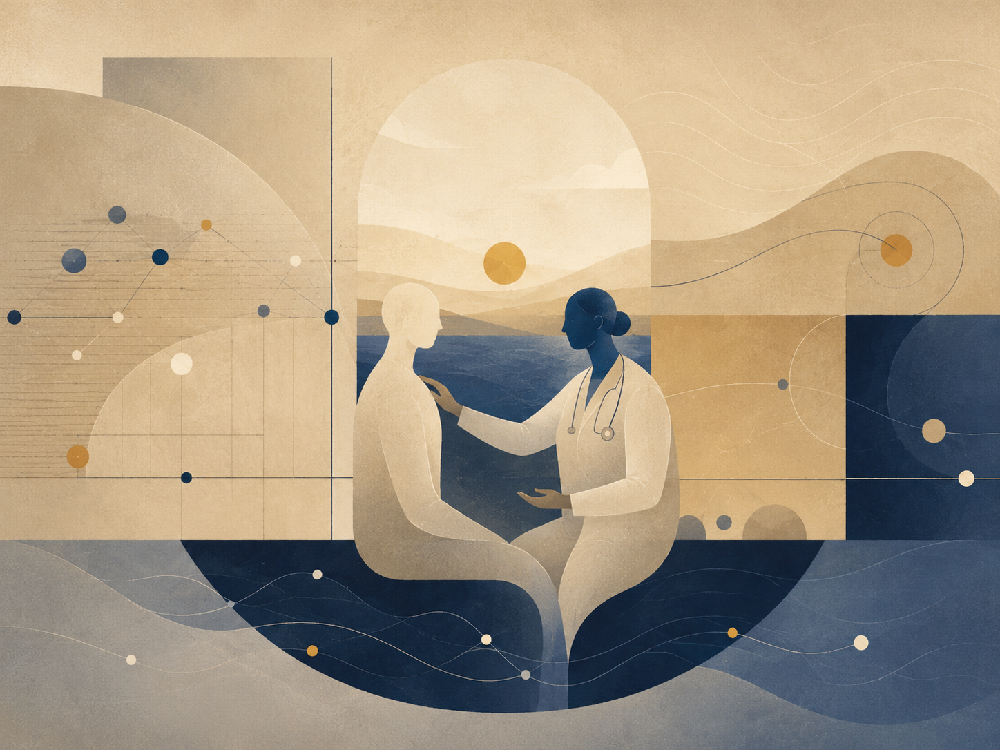

תיאור תמונה: ריפוי כקריאה זהירה של גוף, סבל, סיכוי ותנאים.

### גוף, אבחנה, טיפול ואדם שאינו מקרה

רפואה היא מבחן חריף לתאוריה מפני שהיא פוגשת את האדם במקום שבו הפוטנציאל שלו מצטמצם לכאב, סימפטום, תור, בדיקה, פרוטוקול וסיכון. הגוף אינו רעיון. הוא אינו מטאפורה. הוא המקום שבו האפשרות יכולה להיפתח, להיסגר, להישבר או להישאר תלויה. לכן רפואה של פוטנציאל אינה רפואה “רכה” מול רפואה מדעית; היא ניסיון לשמור את המדע בתוך יחס נכון אל אדם חי.

הכשל העמוק ברפואה אינו רק טעות אבחנתית או עומס מערכת. הכשל העמוק הוא החלפת החולה במקרה. כאשר אדם נעשה “כבד”, “אונקולוגי”, “פסיכיאטרי”, “סיכון”, “קוד אבחנה”, משהו הכרחי קורה: המערכת צריכה לצמצם כדי לפעול. אבל משהו מסוכן גם קורה: הצמצום מתחיל להיראות כאמת כולה. רפואה צריכה קטגוריות, אבל אסור לה לשכוח שהקטגוריה היא ידית פעולה, לא האדם.

אפשר לנסח את הרפואה דרך מפת יחס: בריאות אחראית = גוף חי × אבחנה מדויקת × הקשבה × ראיות × זמן טיפול × המשכיות × הסכמה / עומס × דה־הומניזציה × פרוטוקול עיוור × פחד × מסחור × אוטומציה לא מפוקחת. זו אינה נוסחה רפואית אלא מפת בלימה: היא בודקת מתי פרוטוקול מציל ומתי הוא מחליף שיפוט, מתי מדידה מאירה ומתי היא מסתירה אדם.

AI ברפואה הוא דוגמה מושלמת. מערכת יכולה לקרוא הדמיה, לסכם תיק, להציע אבחנה מבדלת, לזהות אינטראקציות תרופתיות, להתריע על סיכון או להקל עומס. אלה שימושים רבי ערך. אבל ברגע שהכלי מקבל הילה של ודאות, הוא עלול להפוך את הגוף לאוסף אותות ואת הרופא למאשר של מסקנה. הבעיה אינה עצם השימוש ב־בינה מלאכותית; הבעיה היא מחיקת אופק האחריות. כאשר המלצה אינה ניתנת להסבר, כאשר אין ברור מי אחראי, או כאשר הנתונים משקפים אוכלוסייה אחרת, הפוטנציאל הטיפולי הופך לסיכון.

הדוגמה הפשוטה היא כאב שאינו מופיע בבדיקה. רפואה גרועה אומרת: “אין ממצא ולכן אין בעיה.” רפואה טובה אומרת: “אין ממצא בתוך אופק הבדיקה הנוכחי.” ההבדל הזה הוא כל התאוריה: אמת יכולה להיות קיימת מעבר לכלי שיש כרגע. מצד שני, גם אסור להפוך כל תחושה לאבחנה. האופטימלי הרפואי נמצא בין שני כישלונות: ביטול האדם בשם המדידה, וביטול המדידה בשם האדם.

רפואה של פוטנציאל משתלבת עם אופקי גבול מפני שכל אבחנה היא אופק: מה אפשר לראות, מה עדיין נסתר, ומה מסוכן להסיק. היא משתלבת עם הקצה הרקורסיבי מפני שכל טיפול מוצלח פותח שאלה חדשה: שיקום, איכות חיים, מניעה, חיים עם מחלה, או שינוי מערכת. היא משתלבת עם AI מפני שהכלי יכול להיות פיגום מוסרי רק אם הוא מחזיר אחריות ולא גונב אותה.

הפרק אינו נותן ייעוץ רפואי. הוא מבהיר את תנאי האחריות: החולה אינו תוצר של בדיקה, הרופא אינו מתווך של אלגוריתם, והמערכת אינה רשאית לקרוא ליעילות “טיפול” אם היעילות נולדה ממחיקת הקשבה. רפואה של פוטנציאל היא המדע כשהוא זוכר עבור מי הוא מדויק.

### משמעת מקורות

מקורות עבודה וזהירות: הפרק נשען על מסגרת התאוריה, ועל מקורות רקע כלליים שנבדקו מחוץ לפרומפט: UNESCO על בינה מלאכותית בחינוך, WHO על אתיקה וממשל של AI בבריאות, NIST AI RMF לניהול סיכוני AI, CERN/ATLAS על המודל הסטנדרטי וה-Higgs, NASA ו-ESA/Planck על קוסמולוגיה, Stanford Encyclopedia of Philosophy על Bell, Kochen-Specker וקונטקסטואליות, ו-Britannica/ISFDB לזיהוי ספרותי של Harlan Ellison ו-I Have No Mouth, and I Must Scream. המקורות אינם מוכנסים כהוכחות לתאוריה אלא כבלמים נגד שימוש ריק במונחים.

## 13. המדומה, הווירטואלי, הכבידה והאופק

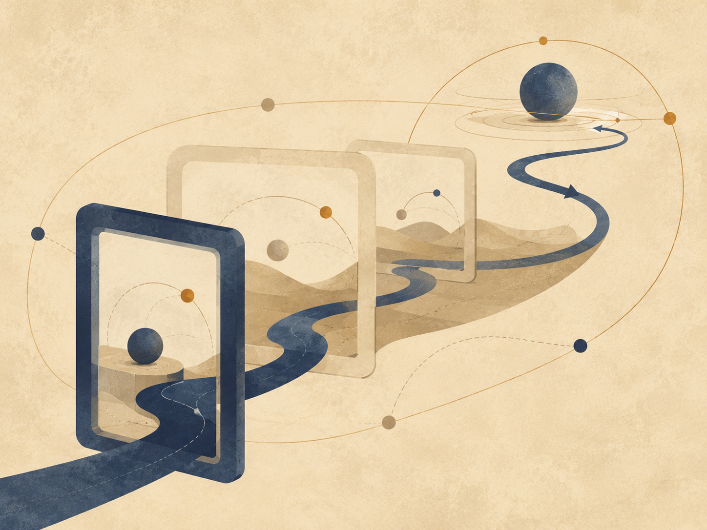

איור ו: המדומה, הווירטואלי והאופק במודל
הלוגי.

יש מילים שהשפה מחלישה עוד לפני שהמחשבה מתחילה לעבוד.

״דמיוני״ נשמע כמו דבר שאינו קיים.
״וירטואלי״ נשמע כמו דבר מזויף.
״ממשי״ נשמע כמו הדבר היחיד שמותר לקחת ברצינות.

אבל המציאות אינה בנויה לפי הנוחות של המילים. ככל שמתקרבים אל שכבותיה
העמוקות יותר, מתברר שהיא אינה מחולקת בפשטות למה שיש ולמה שאין. יש בה גם
מה שאינו מופיע כאובייקט, ובכל זאת בלעדיו האובייקט לא היה יכול להופיע. יש
בה מה שאינו נמדד ישירות, ובכל זאת בלעדיו המדידה לא הייתה מקבלת צורה. יש
בה מה שאינו ״דבר״, אבל משנה את התנאים שבהם דברים יכולים להיות.

יש להבהיר כבר בתחילת הדברים: הפרק הזה אינו משתמש במתמטיקה או בפיזיקה
כהוכחה לתאוריה. הוא אינו טוען שמספרים מדומים הם ישויות מטאפיזיות,
שחלקיקים וירטואליים הם שליחים נסתרים, שחור שחור הוא רוע, או שחור לבן הוא
מקור הבריאה. הוא עושה דבר צנוע ומדויק יותר: הוא משתמש במבנים שבהם גם
החשיבה המדויקת ביותר נאלצת להבחין בין מה שמופיע, מה שמשפיע, מה שמגביל,
ומה שמאפשר הופעה.

הזהירות הזאת אינה אויבת המטאפורה.
היא התנאי לכך שהמטאפורה לא תהפוך לשקר.

### המדומה

המספר המדומה אינו מספר שקרי. הוא אינו בדיחה מתמטית ואינו פנטזיה. הוא
ציר נוסף של תיאור. הוא מופיע במקום שבו הציר הרגיל של הכמות אינו מספיק.
הוא מאפשר לחשוב על סיבוב, מופע, תנודה, שינוי כיוון, יחס בין מה שנוכח
לבין מה שעדיין אינו נוכח.

אין צורך לומר שהמספר המדומה הוא ״דבר״ בתוך העולם. די לומר דבר זהיר
יותר: גם בתוך החשיבה המדויקת ביותר, הממשי לא תמיד ניתן לתיאור על קו אחד.
לפעמים צריך ציר שאינו נראה כמו כמות רגילה כדי להבין תנועה ממשית.

במובן הזה, המדומה אינו ההפך מן הממשי.
הוא הדרך שבה הממשי נעשה ניתן לחשיבה מעבר לציר אחד.

### הווירטואלי

גם הווירטואלי אינו פשוט ״לא אמיתי״. חלקיק וירטואלי אינו חלקיק קטן
רגיל שמסתובב בעולם כמו גרגר אבק זעיר, מחכה לרגע שבו יחליט להפוך לחלקיק
אמיתי. זו תמונה נוחה מדי, כמעט ילדותית מדי. הווירטואלי אינו אובייקט יציב
שאפשר להצביע עליו ולומר: הנה הוא, כאן, במסלול הזה, בזמן הזה.

אבל גם אסור להפוך אותו לכלום.

דווקא משום שהוא אינו אובייקט יציב, הוא מתאים כדוגמה לזהירות הנדרשת
כאן. יש הבדל בין דבר שניתן להצביע עליו לבין מבנה, שדה, תנאי או רכיב
בתיאור של אינטראקציה שמשתתף בתוצאה ממשית. לא כל מה שמשפיע חייב להופיע
כגוף. לא כל מה שמשנה את המאזן חייב לעמוד מולנו כחפץ.

הווירטואלי, במעמדו הזהיר ביותר, הוא שפה של לחץ אפשרי על הופעת
הדבר.

או במילים פשוטות יותר:

הווירטואלי הוא לא הדבר.
הוא הדרך שבה האפשרות מתחילה ללחוץ על תנאי הופעתו של הדבר.

כאן נוגעת המטאפורה בתאוריה, אבל אינה מוכיחה אותה. הווירטואלי אינו
״הפוטנציאל עצמו״. הוא אינו שם מדעי לרעיון פילוסופי. הוא דוגמה לכך שגם
במקום שבו אנחנו מדברים בזהירות על המציאות, יש צורך להבחין בין אובייקט
יציב לבין השפעה שאינה מתייצבת כאובייקט.

המדומה הוא שפת הכיוון.
הווירטואלי הוא שפת ההשפעה.
הממשי הוא שפת הסימן.

המדומה אומר: יש למערכת ציר שאינך רואה, אבל בלעדיו לא תבין את
תנועתה.
הווירטואלי אומר: יש השפעה שאינך רואה כאובייקט, אבל בלעדיה לא תבין את
השינוי.
הממשי אומר: כאן, לרגע, משהו מן האפשרות הסכים להשאיר עקבה.

### הקופסה שאינה מתרוקנת

אפשר לדמיין קופסה.

תחילה מוציאים ממנה את כל החפצים. אחר כך את האבק. אחר כך את האוויר.
אחר כך, בדמיון קיצוני יותר, מוציאים ממנה כל אטום, כל חלקיק, כל דבר שאפשר
לקרוא לו דבר. הקופסה נראית ריקה. אין בה גוף. אין בה חומר. אין בה סימן
גלוי למשהו שמחכה בפנים.

אבל הריק הזה אינו בהכרח ״אין״.

גם כאשר לא נשאר בה אובייקט רגיל, עדיין לא נפטרנו מן התנאים. עדיין לא
נפטרנו מן השדה. עדיין לא נפטרנו מן האפשרות להופעה. במובן הזה, הריק
הפיזיקלי אינו זהה לאין פילוסופי. הוא אינו חדר מת. הוא אינו שלילה מוחלטת.
הוא מצב שבו הדבר היציב נעלם, אך האפשרות לא נעלמה יחד איתו.

זו אינה טענה שיש בתוך הקופסה יצורים קטנים שמסתתרים וממתינים לצאת. זו
בדיוק הטעות שיש להימנע ממנה. הנקודה עדינה יותר: גם כאשר מרוקנים את העולם
מכל מה שנראה כמו אובייקט, לא ברור שאפשר לרוקן אותו מן הפוטנציאל
להופעה.

הפוטנציאל, במובן הזה, אינו עוד חפץ בתוך הקופסה.
הוא מה שנשאר כאשר כבר אין חפצים.

ולכן אי אפשר פשוט להוציא אותו החוצה.

אפשר להוציא חומר.
אפשר להוציא אור.
אפשר להוציא אוויר.
אפשר לדמיין שמוציאים כל חלקיק וכל עקבה.

אבל אי אפשר להוציא את האפשרות כאילו הייתה דבר נוסף בין הדברים. מפני
שהאפשרות אינה אחת מן התכולות של המציאות. היא אחת מן הדרכים שבהן המציאות
עוד מסוגלת להיות.

זהו אחד המקומות שבהם הפוטנציאל מתגלה לא כחלל ריק שמחכה להתמלא, אלא
כשכבה פעילה. הפוטנציאל אינו רק ״מה שעדיין לא קרה״. הוא אינו מחסן של
אפשרויות שמונחות בצד וממתינות לתורן. הוא חי יותר מזה. הוא הכיוון שעוד לא
נעשה קו. הוא ההשפעה שעוד לא נעשתה גוף. הוא האמת שעוד לא מצאה צורה מספיק
יציבה כדי להיקרא בשם.

האדם רגיל להאמין רק למה שכבר השאיר סימן. הוא רוצה לראות את התוצאה,
למדוד אותה, לקרוא לה, לקטלג אותה, ואז להחליט אם היא קיימת. אבל הרבה מן
המציאות החשובה ביותר פועלת לפני השלב הזה. היא פועלת במקום שבו עדיין אין
דבר, אבל כבר יש הטיה. עדיין אין תשובה, אבל כבר יש כיוון. עדיין אין
הכרעה, אבל כבר יש מתח שמארגן את מרחב ההכרעות האפשריות.

האדם אומר: אאמין לזה כשאראה את זה.
המציאות אומרת: לא היית רואה דבר אלמלא היה כבר פועל משהו שאינך רואה.

### פוטנציאל ואידיאל

כאן מתבהר היחס בין פוטנציאל לאידיאל.

הפוטנציאל אינו מחוץ למציאות. הוא אינו מעליה ואינו אחריה. הוא נמצא
בתוך המציאות כשכבה שאינה תמיד נראית לה. כמו המספר המדומה בתוך מערכת
מתמטית, הוא מאפשר תנועה שאי אפשר להסביר על הציר הפשוט. כמו הווירטואלי
בתוך תיאור של שדה, הוא מאפשר לחשוב על השפעה שאינה מתייצבת מיד כאובייקט.
וכמו כל דבר ממשי, הוא מבקש בסוף להשאיר סימן - לא מפני שהסימן הוא
כל האמת, אלא מפני שבלי סימן אין לעולם דרך לדעת שהאמת עברה בו.

האידיאל, לעומת זאת, אינו כל אפשרות. הוא אינו כל מה שיכול היה לקרות.
הוא אינו ההתפזרות האינסופית של הפוטנציאל לכל הכיוונים. האידיאל הוא
הכיוון שבו הפוטנציאל מפסיק להיות סתם פתוח ומתחיל להיות מדויק.

אין הכרח לייחס למציאות רצון מודע כדי לדבר על אידיאל. האידיאל הוא שם
למצב שבו אפשרות עוברת דרך מגבלות, מדידות, התנגדויות ועיוותים, ועדיין
מצליחה להופיע בצורה שאינה מוחקת את העומק שממנו באה.

אפשר לומר זאת כך:

המדומה פותח ציר.
הווירטואלי מפעיל לחץ.
הממשי משאיר סימן.
האידיאל הוא הופעה ששומרת רציפות עם הציר, הלחץ והתנאי שמהם נולדה.

ובמילים אחרות:
האידיאל אינו בוגד בפוטנציאל שממנו בא.

### כבידה

כאן נכנסת גם הכבידה.

קל לחשוב על כבידה כעל הגבלה. היא קושרת גוף למקום. היא מונעת ממנו
להתפזר בחלל כרצונו. היא אומרת לו, במובן מסוים: כאן. לא בכל מקום. לא לכל
כיוון. לא בלי מחיר.

אבל זו רק חצי מחשבה.

החופש אינו מתחיל במקום שבו אין גבולות. מקום שאין בו גבולות כלל אינו
בהכרח חופשי יותר; לעיתים הוא פשוט אינו מקום. הוא אינו מחזיק צורה, אינו
מחזיק גוף, אינו מחזיק נשימה, אינו מחזיק בית. בלי משיכה אין קרקע. בלי
קרקע אין עמידה. בלי עמידה אין בחירה בעלת משקל.

אין הכוונה שלכבידה יש רצון, מוסר או כוונה. הכבידה משמשת כאן כמבנה
דוגמתי: היא מראה כיצד מגבלה יכולה להיות תנאי להיווצרות עולם, לא רק שלילת
חופש. בלי קישור, מסלול ומשקל, אין מקום יציב שבו בחירה יכולה לקבל
משמעות.

הכבידה, במובן הזה, אינה אויבת החופש. היא אחת הדרכים שבהן הפוטנציאל
מסכים לא להישאר פתוח לכל הכיוונים בבת אחת. היא אינה שלילת האפשרות, אלא
התנאי לכך שאפשרות תוכל להיעשות עולם. היא הצמצום שמאפשר צורה. היא המשקל
שמאפשר למשהו להישאר מספיק זמן כדי להיות נוכח.

הפוטנציאל, כשהוא פתוח לגמרי, עדיין אינו עולם. הוא יכול להיות הכול,
ולכן עוד אינו דבר. כדי להופיע עליו להסכים לאבד חלק מן הפתיחות שלו. עליו
להסכים לכיוון, לגוף, למגבלה, למקום. הכבידה היא אחד השמות הפיזיים של
ההסכמה הזאת: לא להיות בכל מקום, כדי להיות כאן.

אבל כל תנאי שמאפשר עולם יכול, בקצהו, גם לסגור אותו.

### חור שחור וחור לבן

החור השחור הוא הדימוי החריף ביותר לכך. לא מפני שהוא ״רע״, ולא מפני
שהוא מעניש את החומר, אלא מפני שבתוכו המבנה עצמו מפסיק להציע החוצה ככיוון
אפשרי. מעבר לאופק האירועים, במובן הקלאסי, העתיד אינו נפרש עוד כמניפה של
נתיבים. הוא הולך ונעשה חד־כיווני.

החור השחור אינו סמל מוסרי לחוסר חופש. הוא דוגמה קיצונית למבנה שבו
מרחב הכיוונים האפשריים מצטמצם עד כדי חד־כיווניות. לא מפני שמישהו אסר על
היציאה, אלא מפני שהמבנה עצמו כבר אינו מציע אותה ככיוון.

שם הכבידה מפסיקה להיות רק מה שמאפשר לדברים להיקשר זה לזה, והופכת
לצורה הקיצונית של קישור שאין ממנו חזרה. זהו המקום שבו הצמצום, שהתחיל
כתנאי לקיום, נעשה קרוב מדי למחיקת האפשרות שלשמה נולד.

החור השחור אינו המקום שבו החופש נענש.
הוא המקום שבו הגיאומטריה עצמה הפסיקה להציע כיוונים.

ומולו אפשר להעמיד, בזהירות, את דימוי החור הלבן.

לא כעובדה שמחליפה את השלם. לא כהוכחה למקור הבריאה. לא כאובייקט שצריך
להעמיס עליו יותר ממה שהוא מסוגל לשאת. החור הלבן, אם משתמשים בו בכלל,
צריך להישאר דימוי מוגבל: לא שם של הפוטנציאל, אלא צורה מחשבתית לחשוב דרכה
על מקור שאינו ניתן לכיבוש.

אם החור השחור הוא אופק שבו העתיד נסגר פנימה, החור הלבן הוא דימוי
לאופק שבו הופעה נפתחת החוצה מבלי שהמקור עצמו נעשה ניתן לאחיזה.

לכן אין לומר שהחור הלבן הוא הפוטנציאל עצמו. זה יהיה מדויק מדי במקום
שבו צריך להישאר זהירים. נכון יותר לומר שהוא דימוי לאחת מתנועותיו
האפשריות של הפוטנציאל: מקור שאינו נפתח לכניסה, אך משהו ממנו יכול להופיע
החוצה.

הפוטנציאל אינו דבר שמגיעים אליו כמו שמגיעים למקום.
האידיאל אינו חפץ שמחזיקים בו לאחר שהמסע נגמר.
שניהם דומים יותר לאופקים: הם מארגנים את התנועה, מכוונים אותה, מעוותים
אותה, מושכים אותה, אך אינם נמסרים בשלמותם ליד.

הכבידה מלמדת שהחופש זקוק לצורה.
החור השחור מלמד שצורה יכולה להפוך לכלוב.
החור הלבן, כדימוי בלבד, מזכיר שיש גם מקורות שאינם נפתחים לכניסה, אלא
להופעה.

ובין שלושתם נמתחת אותה שאלה: כמה צמצום צריך הפוטנציאל כדי להפוך
לעולם, ומתי אותו צמצום עצמו מתחיל למחוק את האפשרות שלשמה נולד.

### קרינת החור השחור

כאן אפשר לחזור אל קרינת החור השחור.

הדימוי הפופולרי מדבר על זוג חלקיקים וירטואליים סמוך לאופק האירועים:
אחד נבלע פנימה, האחר בורח החוצה, ומתוך כך מופיעה קרינה. זה דימוי מועיל
רק כל עוד זוכרים שהוא דימוי הוראה, לא תצלום של המנגנון. אם לוקחים אותו
מילולית מדי, הוא מתחיל לשקר. הוא גורם לנו לחשוב שהווירטואלי הוא פשוט
חלקיק קטן שהצליח ברגע מסוים להפוך לממשי.

הנקודה העמוקה יותר אינה שהווירטואלי הוא אובייקט שמתחפש ללא־אובייקט.
הנקודה היא שגם מה שאינו יציב כאובייקט יכול להשתתף בתוצאה ממשית. גם מה
שאינו ״דבר״ במובן הפשוט יכול להשפיע על מאזן. סביב אופק קיצוני, עצם מבנה
המרחב, הזמן והשדה משנה את מה שנחשב ריק, מה שנחשב חלקיק, ומה יכול להופיע
כקרינה בעיני צופה רחוק.

לא צריך לומר שהפוטנציאל ״נהיה אמיתי״ רק כשהוא בורח מן החור השחור. זה
שוב מצמצם אותו. נכון יותר לומר שהמצב הקיצוני מגלה דבר שהיה נכון גם קודם:
הממשי אינו מתחיל רק במקום שבו יש אובייקט. לפעמים הממשי מתחיל במקום שבו
התנאים להופעה כבר השתנו.

כלומר, יש ממשות שאינה גוף.
יש פעולה שאינה חפץ.
יש כיוון שאינו צורה.
יש השפעה שאינה עדיין אירוע, אבל האירוע כבר לא יכול להתרחש אותו דבר
בלעדיה.

זה חשוב מפני שהאדם נוטה לזלזל בכל מה שעדיין לא נעשה מוצק. מחשבה שלא
נוסחה עד הסוף נראית לו חלשה. תחושה שלא קיבלה הסבר נראית לו חשודה. אפשרות
שלא התממשה נראית לו כמו כלום. אבל במעמקים, דווקא הדברים האלה הם לעיתים
השכבה הפעילה ביותר. לא מפני שהם ״יותר אמיתיים״ מן הממשי, אלא מפני שהם
קודמים לו בצורה שאינה קודמת בזמן בלבד. הם קודמים לו במבנה.

### אופקי אירועים של אמון

חור שחור אינו משמש כאן כמטאפורה לרוע מוחלט, אלא לגבול שבו מידע אמיתי כבר אינו מצליח לצאת אל מערכת הייחוס החיצונית. אופק אירועים מוסרי הוא הגבול שבו אדם, מוסד, רעיון או קהילה יכולים להשתנות, אבל העולם כבר אינו מסוגל לקבל את השינוי כמידע חדש.

עבר כבד מדי → כבידה פרשנית כבידה פרשנית → אובדן אמון אובדן אמון → חסימת מידע חדש חסימת מידע חדש → זהות קפואה

אדם לאחר פגיעה קשה, מערכת יחסים לאחר בגידה, מוסד לאחר שערורייה, חברה לאחר קריסה כלכלית, קהילה לאחר אלימות, או שפה לאחר שקר מתמשך - כולם יכולים להיתקל באותו מבנה: לא בהכרח היעדר שינוי, אלא היעדר תווך שדרכו השינוי יכול להיקרא כשינוי.

הדיוק המוסרי חשוב: החוץ אינו תמיד חייב לקבל. לפעמים הסירוב הוא הגנה, לפעמים הנזק היה אמיתי מדי, ולפעמים אי־האמון הוא חלק מן המחיר. תיקון שאינו גאולה אינו מבטיח חזרה אל החוץ; הוא רק מסרב לתת לעבר להיות כל מה שקיים בפנים.

### אלוהים, השלם, והזהירות בשם

אם רוצים להשתמש בשם ״אלוהים״, יש לעשות זאת באותה זהירות שבה משתמשים
בכל שם גדול מדי.

לא אלוהים כיד שמזיזה חלקיקים מאחורי הקלעים.
לא אלוהים כמפעיל מכני של ניסים.
לא אלוהים כדמות העומדת מחוץ לעולם ומתקנת אותו מבחוץ.

אלא אלוהים כאחד השמות האפשריים לשלם: למבנה שבו הפוטנציאל אינו מתבזבז,
אלא מחפש את צורתו המדויקת ביותר דרך כל שכבות ההופעה. שם אחר לכך יכול
להיות השלם. שם אחר יכול להיות מקור. שם אחר יכול להיות התנועה שבין
פוטנציאל לאידיאל. השם חשוב פחות מן הזהירות שלא להפוך אותו לפסל.

המספר המדומה אינו מחשבתו של אלוהים.
החלקיק הווירטואלי אינו פעולתו של אלוהים.
הכבידה אינה רצונו של אלוהים להגביל חופש.
החור השחור אינו עונשו של אלוהים.
החור הלבן אינו גופו של אלוהים.

אבל אפשר לומר בזהירות:

במדומה, המציאות מגלה שיש לה עוד כיוון לחשוב בו.
בווירטואלי, המציאות מגלה שיש לה דרך להשפיע לפני שהיא מופיעה.
בכבידה, המציאות מגלה שחופש זקוק לצורה.
באופק, המציאות מגלה שכל צורה יכולה להפוך לגבול.
בממשי, המציאות מגלה מה מכל זה הצליח לעבור אל העולם.

אין לזהות את הדוגמאות עם התאוריה עצמה. הן אינן יסודותיה אלא מראותיה.
המדומה, הווירטואלי, הכבידה, החור השחור והחור הלבן אינם מוכיחים את
הפוטנציאל או את האידיאל. הם רק מראים, כל אחד בשפתו, שהמציאות אינה עשויה
רק מדברים שכבר נראים. יש בה גם כיוונים, לחצים, גבולות ואופקים; ויש רגעים
שבהם דווקא מה שאינו ניתן לאחיזה ישירה קובע את צורתו של מה שכן מופיע.

ואולי האידיאל הוא הרגע שבו כל השכבות האלה אינן סותרות עוד זו את
זו.

הרגע שבו הכיוון הסמוי, ההשפעה הבלתי־יציבה, המשקל, הגבול, והסימן
הנראה, מתיישרים מספיק כדי שדבר יוכל להיות לא רק קיים, אלא מוצדק
בקיומו.

לא מוצדק מבחוץ.
לא מאושר על ידי צופה.
לא מוכח אחת ולתמיד.

אלא מוצדק במובן העמוק יותר: שהוא אינו בוגד בפוטנציאל שממנו בא.

## אופקי גבול

*מידע, ראות ומה שאינו חוזר*

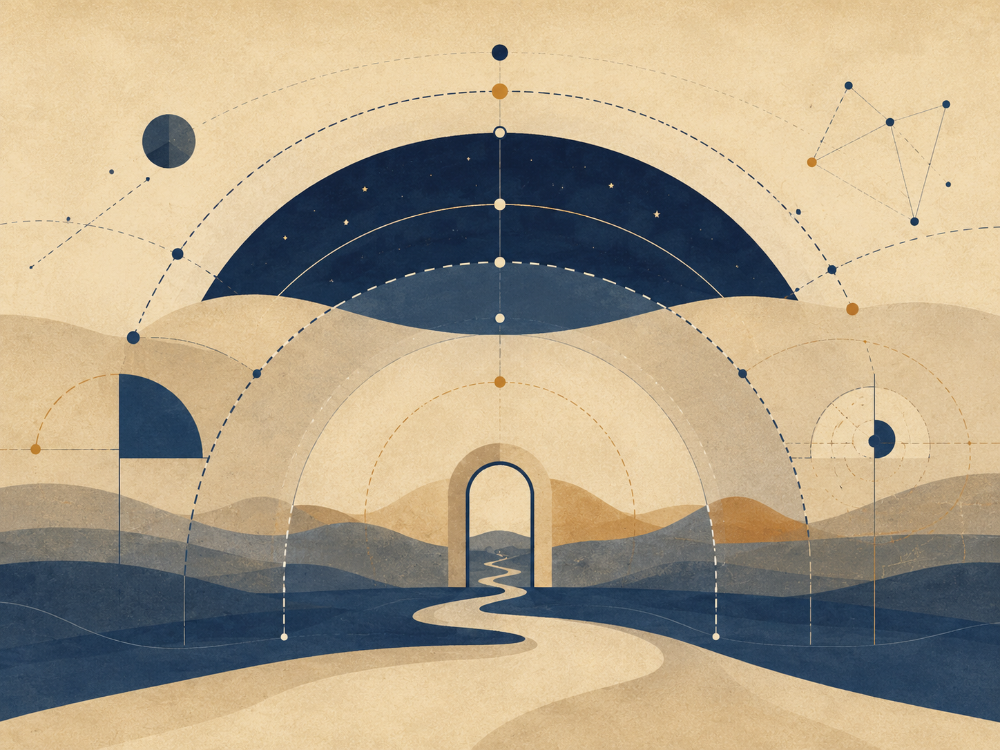

תיאור תמונה: גבול שאינו קיר בלבד, אלא אופק שמכוון את היחס בין אפשרות לצורה.

### מה שנראה, מה שמוסתר, ומה שאסור להסיק מהר מדי

אופקי גבול הם אחד הכלים המרכזיים של התאוריה. אופק אינו רק קצה. הוא יחס בין צופה, כלי, מצב ומרחב אפשרויות. מה שנמצא מעבר לאופק אינו בהכרח לא קיים; הוא רק לא ניתן לפעולה ישירה באותו רגע. ההבחנה הזו חשובה בחינוך, משפט, רפואה, פיזיקה, AI, יצירה וממשל.

הכשל העמוק הוא בלבול בין אי־נגישות לבין אי־קיום. תלמיד שלא מבין עדיין אינו “לא מסוגל”. ראיה שלא נמצאה אינה מוכיחה שלא התרחש אירוע. כאב שלא הופיע בבדיקה אינו נעלם. תופעה קוסמולוגית מעבר לאופק אירועים קוסמי אינה מופרכת משום שאיננו רואים אותה. מצד שני, מעבר לאופק אינו רישיון להמציא. אופק דורש ענווה כפולה: לא למחוק ולא לפנטז.

מפת היחס: פעולה תחת אופק = מה שניתן לראות × כלי אמין × הכרה במגבלה × סימון אי־ודאות × אפשרות תיקון / יומרת ודאות × השלכה × פחד × עצלות × סמכות שמסתירה את תנאיה. זו מפת אחריות: כיצד לפעול בלי להעמיד פנים שהעולם נגמר בגבול הכלי.

במדע, אופקי גבול מופיעים במכשירים, אנרגיות, רזולוציה, תצפית וקוסמולוגיה. בפיזיקה של חורים שחורים, אופק אירועים הוא גבול שבו מידע ואפשרות פעולה מקבלים משמעות אחרת עבור צופה חיצוני. בקוסמולוגיה, אופק אירועים קוסמי מציב גבול למה שיכול אי פעם להשפיע או להיראות. אלה מושגים פיזיקליים, לא קישוטים; השימוש בהם בתאוריה חייב להיות מבני וזהיר.

במשפט, אופק הראיות קובע מה ניתן להכריע באחריות. בחינוך, אופק הבנה קובע איזה מרחק ניתן לשאת. ברפואה, אופק אבחנה קובע מה יודעים, מה חושדים, ומה צריך לבדוק. ב־AI, אופק ההסבר קובע האם מערכת יכולה להיות כלי אמין או קופסה שמתחפשת לסמכות.

אופקי גבול מתחברים לקצה הרקורסיבי מפני שכל אופק שנזז מגלה אופק נוסף. אין נקודת סיום שבה כל ההסתרה נעלמת. אבל גם אין סיבה לייאוש: עצם סימון הגבול הופך את הפעולה למוסרית יותר. האדם אינו נדרש לדעת הכל; הוא נדרש לא לשקר לגבי מה שאינו יודע.

### משמעת מקורות

מקורות עבודה וזהירות: הפרק נשען על מסגרת התאוריה, ועל מקורות רקע כלליים שנבדקו מחוץ לפרומפט: UNESCO על בינה מלאכותית בחינוך, WHO על אתיקה וממשל של AI בבריאות, NIST AI RMF לניהול סיכוני AI, CERN/ATLAS על המודל הסטנדרטי וה-Higgs, NASA ו-ESA/Planck על קוסמולוגיה, Stanford Encyclopedia of Philosophy על Bell, Kochen-Specker וקונטקסטואליות, ו-Britannica/ISFDB לזיהוי ספרותי של Harlan Ellison ו-I Have No Mouth, and I Must Scream. המקורות אינם מוכנסים כהוכחות לתאוריה אלא כבלמים נגד שימוש ריק במונחים.

## 14. מסה־אנרגיה ותווך - דימוי מדויק, לא הוכחה

החלק הזה אינו טוען שפיזיקה מוכיחה את התאוריה. היחס בין מסה לאנרגיה
אינו הופך למשפט מוסרי, ומשוואה אינה קיצור דרך אל מטאפיזיקה. השימוש כאן
הוא מבני וזהיר: הפיזיקה מספקת שפה שבה מה שנראה כחומר ומה שנראה כפעולה
אינם בהכרח עולמות מנותקים, אלא אופני הופעה שונים של מבנה עמוק יותר
בתנאים שונים.

אפשרות אינה תוצאה. כדי שאפשרות תופיע כמשהו בעולם היא צריכה תנאי
הופעה: צורה, גבול, מדידה, יחס, זמן ותווך. בלשון התאוריה, פוטנציאל שאינו
עובר דרך תנאים נשאר רחב מדי מכדי להיות אחראי. הוא יכול להכיל הכול, אבל
עדיין לא לשאת משקל. משקל כאן אינו רק פיזיקלי; הוא גם שם מטאפורי לתוצאה,
למחיר, למחויבות וליכולת להשפיע על אחר.

יש להיזהר מן המשפט הגס שלפיו חומר הוא פשוט ״אנרגיה שהתעבתה״. ניסוח
מדויק יותר הוא שמערכות חומריות מסוימות, בתנאים מסוימים, יכולות לשמש תווך
המשנה את אופן מעבר האנרגיה דרכן: הן קולטות, מפזרות, מסננות, מאחסנות,
מחזירות או מכוונות. בתאוריה, זה הופך לדימוי של אדם כתווך: לא גוף שמסדר
אנרגיה באופן פיזיקלי ישיר, אלא חיים שמסוגלים לעבד את מה שעובר דרכם -
כאב, זיכרון, פחד, רצון, אהבה ואחריות.

מכאן ההבדל בין חומר כתוצאה לבין חומר כתווך. הגוף הוא תוצאה של תהליכים
פיזיקליים, אך בחיים הוא גם המקום שבו תהליכים נעשים משמעותיים. הוא אינו
רק גבול; הוא מקום שבו גבול יכול להפוך לביטוי. הוא היד הכותבת, הקול
העונה, מערכת העצבים הזוכרת, העייפות שמכריחה אמת, והפצע שממנו יכולה
להיוולד זהירות מוסרית.

גם כאן נדרש איזון בין נבדלות לתהודה. בתוך שפת התאוריה, הבדל הוא תנאי
לכך שצורה תוכל להופיע בלי שהכול יקרוס לאותו דבר; אך נדרשת גם אפשרות של
תהודה, כדי שההבדל לא יהפוך לבידוד מוחלט. האידיאל אינו מחיקה של הבדל, אלא
מצב שבו הבדל נשאר מובחן ובכל זאת נעשה אחראי ליחס.

כאשר מחזירים זאת לשפה האנושית, האידיאל אינו אור שלא פגש חומר. אור שלא
פגש התנגדות נשאר בלתי נבחן; חומר שחוסם כל אור נעשה אטימות. התווך החי הוא
המקום שבו מעבר נעשה אחראי: הוא מקבל בלי להיבלע, מסנן בלי למחוק, מעצב בלי
לזייף, ומחזיר את מה שעבר דרכו כמשהו מדויק יותר.

אם מתרגמים את המבנה הזה לשפה הטלאולוגית של התאוריה, ולא כטענה עובדתית
על היקום, אפשר לומר: השלם הופך את עצמו לכלי התיקון של עצמו. הוא נעשה
גוף, תווך, חיכוך, זיכרון ואחריות, כדי שפוטנציאל לא יישאר רק אפשרי, וכדי
שאור לא יישאר רק מפוזר.

## 15. מפת השוואות פיזיקלית — פוטנציאל, צורה והתיאוריות שמנסות לאחד את הפיזיקה

*ממרחב־זמן כצורה אל פוטנציאל כקרקע עמוקה יותר*

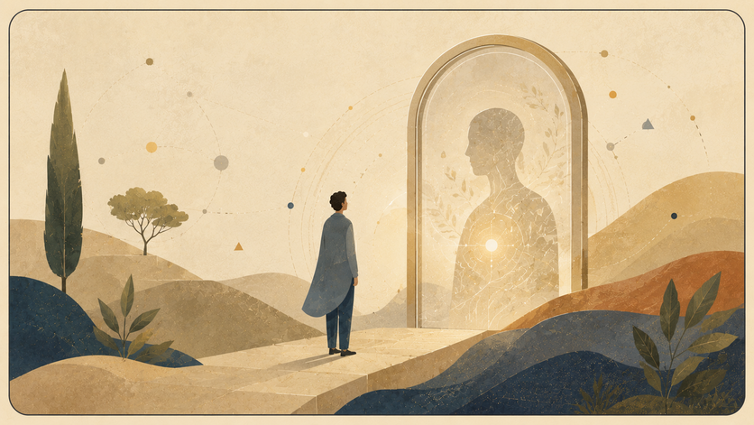

מפת השוואות פיזיקלית. קוונטים, יחסות, אופק ומידע כשפות שונות של אותו מתח בין פוטנציאל וצורה.

הפרק הזה אינו מציע פיזיקה חדשה במקום פיזיקה מתמטית. הוא מציע מפה מושגית: כיצד יחסות, קוונטים, מידע, אופקים וסינגולריות מאירים את היחס בין פוטנציאל, צורה, תווך וקריאות.

### עמוד השדרה הפיזיקלי

G\_{μν} + Λg\_{μν} = (8πG / c^4) T\_{μν}

יחסות כללית מראה שחומר ואנרגיה אינם רק נמצאים בתוך במה ניטרלית; הם מעצבים את הבמה עצמה. דרך התאוריה, זו שפה שבה פוטנציאל חומרי־אנרגטי מקבל קריאות כגיאומטריה.

iℏ ∂|ψ⟩/∂t = Ĥ|ψ⟩ P(a) = |⟨a|ψ⟩|² [x, p] = iℏ Δx Δp ≥ ℏ/2

מכניקת הקוונטים מתארת פוטנציאל המתפתח בזמן ונסגר לתוצאה קריאה במדידה, אך אינה מסבירה לבדה את מנגנון הסגירה. לכן התאוריה קוראת את המדידה כרגע מעבר מפוטנציאל לצורה, לא כפתרון לבעיה הפיזיקלית.

U†U = I |ψ(t)⟩ = U(t)|ψ(0)⟩

באבולוציה קוונטית סגורה, מידע אינו אמור להימחק. דרך התאוריה: מידע שלא ניתן לקרוא אינו בהכרח מידע שנמחק; הוא עשוי להישמר כיחס, עקבה או קורלציה.

```
ĤΨ = 0
ℓₚ = √(ℏG / c³)
tₚ = √(ℏG / c⁵)
mₚ = √(ℏc / G)
Eₚ = mₚ c^2 = √(ℏc⁵ / G)
```

בעיית הזמן וסקאלת פלאנק מצביעות על המקום שבו הזמן והמרחב־זמן עצמם עשויים לא להיות הקרקע האחרונה, אלא צורות קריאות של שכבה עמוקה יותר. כדי לבחון מרחק קטן יותר נדרשת, בסדר־גודל, אנרגיה גבוהה יותר: Δx ≈ ℏc/E. אך אנרגיה מרוכזת היא גם מקור כבידתי, עם רדיוס שוורצשילד r\_s(E)=2GE/c^4. כאשר Δx נעשה מאותו סדר גודל של r\_s, מתקבל E²≈ℏc⁵/(2G), כלומר גבול מסדר גודל של אנרגיית פלאנק ואורך פלאנק. לכן סקאלת פלאנק אינה מוצגת כאן כפיקסל מוכח של המציאות, אלא כגבול שבו המדידה עצמה מפסיקה להיות שקופה: הניסיון לראות את הקטן ביותר עלול לייצר אופק שמסתיר אותו.

גם באופק האירועים מופיע גבול דומה, אך מסוג אחר. בקואורדינטות שוורצשילד מופיע הגורם (1 - r\_s/r)⁻¹, ולכן ב־r = r\_s נדמה שהחישוב מגיע לחלוקה באפס. אך אינווריאנט העקמומיות K = 48G^2 M^2/(c^4 r^6) נשאר סופי באופק ומתבדר רק ב־r = 0. לכן האופק אינו בהכרח המקום שבו המציאות נשברת, אלא המקום שבו מערכת הקואורדינטות הרגילה מפסיקה להיות מפה טובה. מעבר לקואורדינטות Eddington-Finkelstein או Kruskal-Szekeres אינו מבטל את החור השחור ואינו פותר את הסינגולריות המרכזית; הוא מראה שמה שאינו נגיש מתוך מפה אחת עשוי להיות נגיש מתוך מפה אחרת. בתוך התאוריה, זו אינה מטאפורה חופשית אלא לקח מבני: לפעמים הפוטנציאל אינו עוד אפשרות בתוך אותה מערכת, אלא האפשרות להחליף מערכת.

r\_s = 2GM / c^2 S\_BH = kB A / (4ℓₚ²) T\_H = ℏc³ / (8πGMkB)

חורים שחורים מראים שהאופק אינו פרט שולי. הגבול עצמו נעשה המקום שבו מידע, שטח, אנטרופיה וקריאות נפגשים. התאוריה אינה פותרת את פרדוקס המידע; היא רק מבחינה בין מחיקה לבין אובדן צורה קריאה.

S(ρ) = -Tr(ρ log ρ) I(A:B) = S(A) + S(B) - S(AB) H² = (8πG/3)ρ - kc^2/a² + Λc^2/3

מידע ושזירה מראים שמידע אינו רק תוכן באובייקט, אלא יחס בין חלקים ובין קוראים. הקוסמולוגיה מזכירה שהריק אינו בהכרח ריק, אבל התאוריה אינה מסבירה כמותית את אנרגיית הוואקום או את הקבוע הקוסמולוגי.

### מה כן ומה לא

התאוריה כן מציעה קריאה מושגית: מרחב־זמן אינו בהכרח הקרקע האחרונה; סינגולריות היא גבול הצורה; יחס קודם למקום; וזמן, סיבתיות ומדידה הם צורות קריאות של פוטנציאל עמוק יותר.

התאוריה אינה מציעה עדיין משוואת כבידה קוונטית, מנגנון מדידה מלא, הסבר כמותי לאנרגיית הוואקום, זיהוי של חומר אפל, הסבר מלא לאנרגיה אפלה או הכרעה בין מיתרים, לולאות, causal sets, CDT והולוגרפיה.

לכן התרומה כאן אינה “פתרון הפיזיקה”, אלא שינוי שכבה: לא להכניס את הפוטנציאל לתוך אידיאל קיים, אלא לשאול כיצד האידיאל הפיזיקלי עצמו - מרחב, זמן, חומר, כוח ומדידה - נולד מתוך פוטנציאל.

## מבנה היקום / צורת היקום וצורת הפוטנציאל

*שטוח, מקומר, פתוח, אינסוף מוגבל ולא מוגבל*

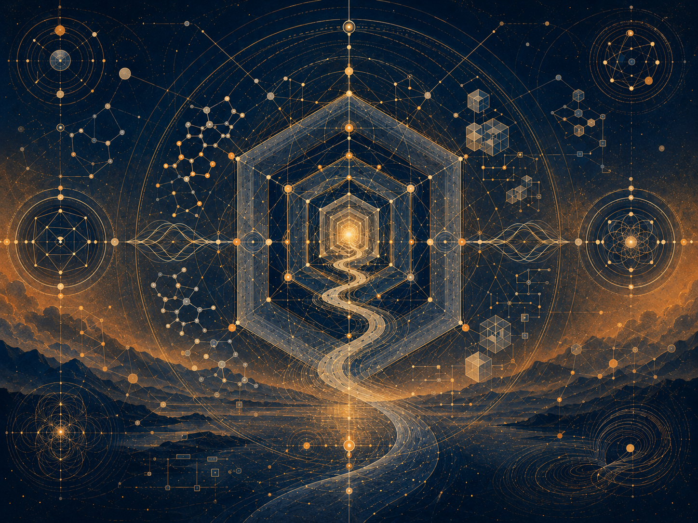

תיאור תמונה: צורת יקום כסדרת יחסים, אופקים ומעברים בין פוטנציאל לצורה.

### יקום שטוח, יקום מקומר, מולטיברס ואומניברס כשפת גבול זהירה

מבנה היקום הוא מקום מסוכן לתאוריה פילוסופית: קל לקחת מונחים גדולים, להפוך אותם לדימוי, ולהישמע עמוק בלי לומר דבר מדויק. לכן הפרק הזה מתחיל בסייג: צורת היקום אינה הוכחה לצורת הפוטנציאל. קוסמולוגיה היא מדע תצפיתי ומתמטי; התאוריה משתמשת בה כשפת גבול, לא כמקור סמכות מטפיזי.

במדע, השאלה על צורת היקום כוללת הבחנה בין עקמומיות מקומית/מרחבית, טופולוגיה, אופק תצפית והיסטוריית התפשטות. יקום שטוח אינו בהכרח אומר יקום פשוט; יקום מקומר אינו בהכרח אומר סיפור סגור; מולטיברס ואומניברס הם רעיונות ברמות שונות של ספקולטיביות. לכן “מבנה יקום” ו“צורת היקום” צריכים להופיע בתאוריה כמשמעת של ענווה, לא כקישוט.

מפת היחס: צורת פוטנציאל = מרחב אפשרויות × מגבלות גישה × חוקיות מקומית × טופולוגיה של קשרים × אופק תצפית / דימוי ריק × קפיצה מטפיזית × ערבוב מדע ובדיון × ודאות יתר. המפה אומרת: גם אם איננו יודעים את המבנה הגלובלי, אפשר ללמוד כיצד מגבלה מקומית משנה פעולה.

האנלוגיה הפורייה אינה “היקום הוא פוטנציאל”. האנלוגיה הפורייה היא שאפשר להיות בתוך מערכת שבה החלק הנראה אינו כל המערכת, והמבנה הגלובלי אינו נגיש ישירות. זה נכון לקוסמולוגיה, אבל גם למשפט, לרפואה, לחינוך ול־AI. אדם פועל מתוך אופק, לא מחוץ ליקום.

מולטיברס ואומניברס משמשים כאן רק כאזהרה לשונית. ככל שמרחב האפשרויות גדל, כך גדל הפיתוי לקרוא לכל דבר אפשרי “משמעותי”. התאוריה מתנגדת לזה. פוטנציאל אינו קדושה של כל אפשרות. אידיאל הוא סינון מוסרי של האפשרי. אופטימלי הוא תרגום מקומי של האידיאל תחת מגבלות.

צורת הפוטנציאל אינה צורה גאומטרית מוכחת. היא דרך לדבר על יחס בין אפשרויות, גבולות, הופעות ובחירות. לכן הפרק הזה צריך להישאר מחובר למתודולוגיה ולקצה הרקורסיבי: כל שפה על היקום חייבת לנקז יומרה, לא להוסיף לה הילה.

### משמעת מקורות

מקורות עבודה וזהירות: הפרק נשען על מסגרת התאוריה, ועל מקורות רקע כלליים שנבדקו מחוץ לפרומפט: UNESCO על בינה מלאכותית בחינוך, WHO על אתיקה וממשל של AI בבריאות, NIST AI RMF לניהול סיכוני AI, CERN/ATLAS על המודל הסטנדרטי וה-Higgs, NASA ו-ESA/Planck על קוסמולוגיה, Stanford Encyclopedia of Philosophy על Bell, Kochen-Specker וקונטקסטואליות, ו-Britannica/ISFDB לזיהוי ספרותי של Harlan Ellison ו-I Have No Mouth, and I Must Scream. המקורות אינם מוכנסים כהוכחות לתאוריה אלא כבלמים נגד שימוש ריק במונחים.

## פיזיקה באנרגיות גבוהות

*שדה, סימטריה, שבירה, סקאלה והקשר*

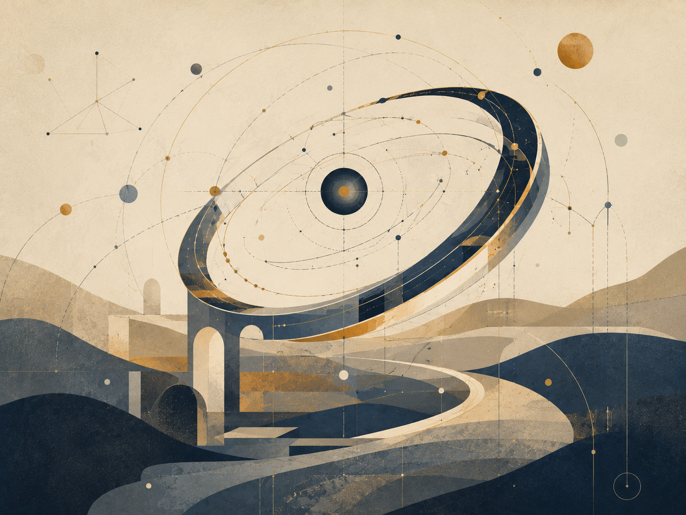

תיאור תמונה: אנרגיה, חלקיקים ואופקים כבדיקה של גבולות הצורה.

### המודל הסטנדרטי, QFT, Higgs וגבול בין שפה להוכחה

פיזיקה באנרגיות גבוהות נכנסת לתאוריה רק במקום שבו היא באמת עוזרת להבין גבול, לא כדי לתת לה יוקרה. המודל הסטנדרטי, QFT, Higgs, EFT ו-renormalization הם מושגים מדעיים מדויקים עם היסטוריה, מתמטיקה וניסויים. שימוש בהם כדימוי מחייב זהירות: הם אינם הוכחה לפוטנציאל ולא לאידיאל.

מה בכל זאת רלוונטי? פיזיקה באנרגיות גבוהות מלמדת שמבנים גלויים ברמות אנרגיה מסוימות עשויים להופיע אחרת ברמות אחרות; שתיאוריה אפקטיבית יכולה להיות מדויקת בתחום מסוים בלי להיות אחרונה; ושחוקיות מקומית יכולה לעבוד מצוין גם כאשר שאלות יסודיות נשארות פתוחות. זה מקביל למתודולוגיה של התאוריה: אופטימלי מקומי אינו אידיאל מוחלט.

מפת היחס: שימוש מדעי אחראי = מושג מוסבר × תחום תוקף × גבול ניסויי × סייג מפורש × אי־הפיכה להוכחה / יוקרה מושאלת × מיסטיפיקציה × ערבוב קטגוריות × דימוי שמתנהג כעובדה. זהו מבחן חובה לכל אזכור של פיזיקה.

ה-Higgs חשוב לא כמטאפורה קסומה ל“מתן משמעות”, אלא כדוגמה לאופן שבו שדה, סימטריה ושבירת סימטריה יכולים להראות שהנראה תלוי במבנה עמוק יותר. EFT חשוב מפני שהוא מזכיר שאפשר לעבוד באחריות עם תיאור חלקי. renormalization חשוב מפני שהוא מלמד שמשמעות של גודל תלויה בקנה מידה ובשיטת תיאור. כל אלה נשארים מדע, לא דרשה.

String Theory, M-theory, branes, AdS/CFT ו-holography יופיעו רק כסימוני גבול. חלקם מסגרות תאורטיות עשירות, חלקם קשרים מתמטיים עמוקים, חלקם רחוקים מאישור אמפירי ישיר. התאוריה אינה משתמשת בהם כדי לומר “הכול אחד” אלא כדי לשאול כיצד שפה יכולה להחזיק רמות שונות בלי לזייף ודאות.

פיזיקה באנרגיות גבוהות משתלבת עם הקצה הרקורסיבי: כל הצלחה ניסויית מחדדת שאלות חדשות; עם אופקי גבול: כל מאיץ וכל גלאי קובעים מה ניתן לראות; ועם מתודולוגיה: כל השאלה היא איך להשתמש בשפה מדעית בלי לגנוב ממנה סמכות.

### משמעת מקורות

מקורות עבודה וזהירות: הפרק נשען על מסגרת התאוריה, ועל מקורות רקע כלליים שנבדקו מחוץ לפרומפט: UNESCO על בינה מלאכותית בחינוך, WHO על אתיקה וממשל של AI בבריאות, NIST AI RMF לניהול סיכוני AI, CERN/ATLAS על המודל הסטנדרטי וה-Higgs, NASA ו-ESA/Planck על קוסמולוגיה, Stanford Encyclopedia of Philosophy על Bell, Kochen-Specker וקונטקסטואליות, ו-Britannica/ISFDB לזיהוי ספרותי של Harlan Ellison ו-I Have No Mouth, and I Must Scream. המקורות אינם מוכנסים כהוכחות לתאוריה אלא כבלמים נגד שימוש ריק במונחים.

## חורים שחורים, אופקי אירועים והעיקרון ההולוגרפי

*גבול, מידע, נגישות ועקבות — בלי להפוך פיזיקה להוכחה מטאפיזית*

![חורים שחורים, אופקי אירועים והעיקרון ../../figures/v26_restyle_polar_field_threshold.png)

תיאור תמונה: אופק, מידע וסף שבו מה שנעלם עדיין משאיר עקבה מבנית.

### גבול, עקבה ומידע בלי להפוך סוד למיתוס

חורים שחורים מושכים תאוריות פילוסופיות כי הם נראים כמו סמל מושלם: גבול, חושך, מידע, זמן, קריסה, בלתי־נגישות. אבל דווקא משום כך צריך להיזהר. אופק אירועים הוא מושג פיזיקלי: גבול שממנו, עבור תיאור מסוים, אור ואותות אינם יכולים להימלט החוצה. הוא אינו מטאפורה חופשית לכל דבר נסתר.

העיקרון ההולוגרפי, AdS/CFT ו-holography הם מסגרות עמוקות בשיח תאורטי על כבידה, שדות ומידע. בתאוריה הם אינם משמשים כהוכחה שהעולם “הוא הקרנה”. שימוש כזה יהיה קפיצה ריקה. הם משמשים כשפת גבול על יחס בין פנים, גבול, עקבה ותיאור.

מפת היחס: גבול מידע = מה שנופל פנימה × מה שניתן לראות מבחוץ × עקבה × חוק שימור × מסגרת תיאור / מיתוס × אסתטיקה של מסתורין × הוכחה מדומה × מחיקת מדע. המפה שואלת כיצד לדבר על מה שאיננו נגיש בלי להפקיע את המדע לטובת דרמה.

הערך לתאוריה נמצא באופק הראיות. במשפט, יש אמת שאולי קיימת מעבר למה שניתן להוכיח. ברפואה, יש כאב מעבר למה שנראה בבדיקה. ב־AI, יש מקור אנושי מעבר לפלט. בחינוך, יש הבנה מעבר לציון. אופק אינו ביטול האמת; הוא תנאי אחריות ביחס אליה.

חורים שחורים מזכירים גם את הסכנה של מערכת שאינה מנקזת. כאשר מידע, כוח וכאב נכנסים למוסד ולא חוזרים כאפשרות תיקון, המוסד מתנהג באופן מבני כמו בור: הוא סופח ולא מחזיר. לכן העיקרון אינו “החברה היא חור שחור”, אלא השאלה: האם הגבול משמר עקבה שמאפשרת אחריות או מוחק מקור.

הפרק משתלב עם מבנה היקום, אופקי גבול, משפט כראיות ו־AI כמקור/עקבה. הוא מחייב את התאוריה לשמור סייג: חורים שחורים אינם משל. הם פיזיקה. המשל היחיד המותר הוא זה שמכריז על עצמו כמשל ואינו מתנהג כעובדה.

### משמעת מקורות

מקורות עבודה וזהירות: הפרק נשען על מסגרת התאוריה, ועל מקורות רקע כלליים שנבדקו מחוץ לפרומפט: UNESCO על בינה מלאכותית בחינוך, WHO על אתיקה וממשל של AI בבריאות, NIST AI RMF לניהול סיכוני AI, CERN/ATLAS על המודל הסטנדרטי וה-Higgs, NASA ו-ESA/Planck על קוסמולוגיה, Stanford Encyclopedia of Philosophy על Bell, Kochen-Specker וקונטקסטואליות, ו-Britannica/ISFDB לזיהוי ספרותי של Harlan Ellison ו-I Have No Mouth, and I Must Scream. המקורות אינם מוכנסים כהוכחות לתאוריה אלא כבלמים נגד שימוש ריק במונחים.

## פרק ?:↓

## פרק ?:↓

## פרק ?:.

## פרק ?:.

## פרק ?:.

## פרק ?:↓

## פרק \*: הבנה

## פרק •: יישום

## מקורות, השראות, רעיונות ותודות

המקורות, השמות והרעיונות הבאים אינם מוצגים כסמכויות שמוכיחות את
התאוריה. הם אינם הוכחה ל“בין פוטנציאל ואידיאל”, ואינם המקור שממנו
התאוריה נגזרת. הם שכנים אינטלקטואליים, השראות, מילים מסייעות וחובות
רעיוניים. התאוריה קרובה אליהם במקומות מסוימים ונבדלת מהם במקומות
אחרים.

הקרבה אל מקור אינה זהות איתו. אם שם מסוים מופיע כאן, אין פירוש הדבר
שהתאוריה מקבלת את כל עמדתו. פירוש הדבר שהוא עזר לנסח, לחדד, לאתגר או
למקם שאלה אחת מתוך המהלך הרחב: כיצד פוטנציאל עובר דרך חוק, גבול, חומר,
חיכוך ועיבוד, עד שהוא יכול להיעשות כיוון אחראי יותר.

### השושלת הפילוסופית

אריסטו רלוונטי בגלל ההבחנה בין אפשרות למימוש, בין פוטנציאליות
לאקטואליות. התאוריה קרובה לשאלה הזאת, אך אינה מסתפקת במעבר מן האפשרי אל
הממשי; היא שואלת מה קורה אחרי המימוש, והאם צורה שהתממשה יכולה לעבור
בירור עד שתהיה ראויה יותר לפוטנציאל שממנו באה.

אפלטון רלוונטי מפני ששפת האידיאל מהדהדת את אידיאת הטוב ואת היחס בין
העולם הנראה לבין צורה גבוהה יותר של הבנה. אולם כאן האידיאל אינו צורה
סטטית מעל ההתהוות, אלא תוצאה מבוררת של פוטנציאל שעבר דרך חוויה, גבול
ואחריות.

פלוטינוס והניאו־אפלטוניות רלוונטיים בגלל היחס בין אחדות לריבוי.
התאוריה חולקת את האינטואיציה שריבוי יכול לנבוע מאחדות, אך מסרבת להפוך את
האחר לבלתי ממשי מבחינה אתית, ומסרבת לראות ביעד הסופי מחיקה של הבדל.

ברוך שפינוזה רלוונטי בגלל תפיסת האל האימננטית שלו: אלוהים אינו מחוץ
למציאות. התאוריה חולקת איתו את דחיית האל החיצוני, אך נבדלת ממנו בכך שהיא
מציבה במרכז לא רק את הכרחיות המציאות, אלא את האפשרות של בירור מוסרי מן
הפוטנציאל האבסולוטי אל האידיאל.

לייבניץ רלוונטי כרקע לשאלות של עולמות אפשריים, שלמות, מונדות והיחס
בין ריבוי לבין סדר. התאוריה אינה מאמצת את האופטימיזם המטאפיזי של “הטוב
שבעולמות האפשריים”, אך היא קרובה לשאלה כיצד אפשרות, סדר ונקודת מבט
נוגעים זה בזה.

קאנט רלוונטי בעיקר כרקע לזהירות מול גבולות הידיעה. התאוריה אינה קובעת
את הדבר־כשלעצמו, ואינה מתיימרת להחליף ביקורת תבונה במטאפיזיקה חופשית.
היא מנסה לדבר על השלם מתוך הכרה בכך שכל שפה אנושית עומדת מול גבול.

הגל רלוונטי מפני שאי אפשר להפריד את התוצאה מן הדרך שבה היא נעשית.
התאוריה חולקת את האינטואיציה התהליכית, אך מנסחת את התנועה כפוטנציאל
אבסולוטי שנעשה אידיאלי דרך בירור, חיכוך ואחריות, ולא רק כהתפתחות רוח
בהיסטוריה.

וייטהד ופילוסופיית התהליך רלוונטיים מפני שהמציאות מובנת כהתהוות ולא
כבלוק סטטי. התאוריה קרובה מאוד לרגישות הזאת, אך שומרת על ניסוח משלה: לא
רק תהליך, אלא תהליך שבו פוטנציאל נבחן לפי יכולתו להיעשות אידיאל בלי
למחוק את מה שעבר דרכו.

דוסטויבסקי אינו שייך לכאן רק דרך “האידיוט”, אלא דרך כל המרחב שבו רעיון נכנס אל אדם ואינו יוצא ממנו שלם. ב“האידיוט” זהו הטוב הכמעט בלתי־אפשרי של הנסיך מישקין: לא פתרון, לא קדוש פשוט, אלא חמלה ויופי שנכנסים אל עולם של מבוכה, תשוקה, רכושנות ופחד, ועוברים בו עיוות. ב“רשימות מן המחתרת” זו התודעה שמסרבת להיסגר בתוך כל נוסחה שתסביר אותה. ב“החטא ועונשו” זהו הרעיון המוסרי או העל־אישי כשהוא נעשה מעשה, ואז חוזר אל הגוף כאשמה, חום, פחד, רחמים ועונש פנימי. ב“האחים קרמזוב” זו שאלת האמונה כשהיא עומדת מול סבל שאין דרך נקייה להצדיקו. וב“שדים” זו הסכנה שבהאידיאל חד מדי הופך לאידיאולוגיה שמוחקת את האדם בשם אמת גדולה ממנו.

ניטשה עומד מול אותו אזור מן הצד האחר. הוא אינו מבטל את שאלת האידיאל; הוא בודק האם האידיאל אינו כבר אליל, האם המוסר אינו בריחה מן החיים, האם החמלה אינה לפעמים צורה סמויה של שליטה, והאם משמעות שניתנת מבחוץ אינה דרך להימנע מן העבודה הקשה יותר: לומר כן לחיים בלי לשקר עליהם.

בין דוסטויבסקי לניטשה נפתח אחד הצירים העמוקים של “בין פוטנציאל לאידיאל”: מצד אחד, האדם שאינו מסוגל לשאת את עומק הטוב, האשמה, האמונה או החירות; ומן הצד האחר, החשד שכל אידיאל עלול להפוך לנחמה, לאליל או לכוח. לכן האידיאל בתאוריה אינו פתרון סופי ואינו גאולה מוכנה. הוא כיוון חי, פגיע, לא־מובטח — תנועה שמנסה להישאר נאמנה לאפשרות של תיקון בלי למחוק את השבר שמתוכו היא נולדת.

קאמי רלוונטי לצד הציר הזה כרקע למשבר האבסורד ולשאלה כיצד אפשר להמשיך לפעול כאשר המשמעות אינה מובטחת מראש. התאוריה אינה מבטלת את האבסורד ואינה פותרת אותו בכוח; היא מנסה לנסח ניהיליזם עם תקווה — לא ודאות של משמעות, אלא אפשרות שכאב, גבול וחיכוך לא חייבים להישאר המילה האחרונה.

האקזיסטנציאליזם, ובעיקר השאלות על חירות, אחריות ומשמעות שאינה נתונה
מראש, נמצא ברקע התאוריה. האדם אינו רק תוצאה של חוק, ואינו רק נקודה בתוך
מערכת; הוא מקום שבו אפשרות נדרשת לשאת אחריות על צורתה.

המסורות הבודהיסטיות, ובמיוחד שאלות של אי־עצמי, סבל, השתוקקות, חמלה
והשתחררות, רלוונטיות מאוד. התאוריה חולקת איתן את החשד כלפי אגו קשיח
ונפרדות מוחלטת, אך מתעקשת שהשתחררות אינה יכולה להיות מחיקה של האדם, של
ההבדל, או של האחריות.

אדוויטה ודאנטה ושאנקרה רלוונטיים כרקע לאי־נפרדות ולשאלה האם הריבוי
הוא אשליה, הופעה או אמת חלקית. התאוריה קרובה לאינטואיציה של אחדות, אך
מתרחקת מכל ניסוח שבו האחדות מבטלת את המשמעות המוסרית של הריבוי.

הדאואיזם רלוונטי כרקע לרעיון של דרך שאינה נכפית מבחוץ, של פעולה שאינה
כוחנית, ושל צורה שאינה שוברת את הזרימה. התאוריה אינה דאואיסטית, אך היא
קרובה לשאלה כיצד כיוון יכול להופיע בלי להפוך לשליטה.

### מתמטיקה, לוגיקה וצורות מחשבה

המתמטיקה אינה מוכיחה את התאוריה, אך היא מספקת לה דימויים של מבנה,
גבול, אינסוף, מרחב אפשרויות ויחס בין צורה לבין חוק.

המסורת של המספרים המרוכבים, ובמיוחד השימוש במספר המדומה, רלוונטית
כדימוי לכך שלא כל מה שאינו נראה על הציר הממשי הוא חסר משמעות. אוילר
וגאוס רלוונטיים כאן כרקע מתמטי רחב, לא כמקור מטאפיזי.

דייוויד הילברט ופון נוימן רלוונטיים בגלל מרחב הילברט והפורמליזציה של
מכניקת הקוונטים. בתאוריה, מרחב הילברט אינו “מרחב כל האפשרויות של הקיום”,
אלא דימוי מוגבל למרחב מצבים של מערכת מוגדרת, ולצורך להבחין בין אפשרות,
מצב, מדידה וחוק התפתחות.

גאורג קנטור רלוונטי כרקע לשאלת האינסוף וסוגי אינסוף. הרעיון שכל שלב —
I‑Verse, Universe, Multiverse, Omniverse — יכול להתפרק שוב למבנים דומים
אינו טענה מתמטית פורמלית על אינסוף קנטוריאני, אך הוא קרוב לאינטואיציה
שהאינסוף אינו רק “הרבה מאוד”, אלא מבנה שיכול להופיע ברמות שונות.

בעיית P מול NP רלוונטית כאן רק כדימוי לוגי מוגבל: לא כפתרון מתמטי ולא
כהוכחה לתאוריה, אלא כשפה שמדגישה את המרחק בין זיהוי בדיעבד של פתרון לבין
מציאת הדרך אליו מראש. במונחי התאוריה, זהו אחד הדימויים ליחס שבין
פוטנציאל, חיפוש, בדיקה, איטרציה ואידיאל.

קורט גדל ואלן טיורינג רלוונטיים כרקע לגבולות של מערכות פורמליות,
חישוב, הוכחה ומודעות עצמית של מערכת. התאוריה אינה משתמשת במשפטי גדל או
במכונת טיורינג כהוכחה, אלא כרקע זהיר לרעיון שמערכת יכולה לשאול על
גבולותיה מבפנים.

תורת הסיבוכיות, רדוקציות פולינומיות, *N**P*-שלמות, *c**o**N**P*,
ההיררכיה הפולינומית ו־*Q**B**F* רלוונטיות כאן
כשפה מבנית בלבד: הן אינן מזהות את הפוטנציאל עם מחלקת סיבוכיות, אלא
עוזרות להבחין בין מציאה, אימות, משאב, תרגום, אסטרטגיה וגבול.

אלגברה ליניארית ולכסון מטריצות רלוונטיים כרקע לשפה של מרחב מצבים,
פעולה ושינוי בסיס. גם כאן אין טענה שהקיום הוא מטריצה; יש רק דימוי מדויק
לכך שלפעמים הבנת מערכת תלויה בבסיס שבו הפעולה נראית.

בֶּנוּאַ מנדלברוט והחשיבה הפרקטלית רלוונטיים כרקע לרקורסיה, דמיון עצמי
ופירוק אינסופי של מבנים. השימוש כאן הוא דימוי מבני בלבד: כל שלב של
מציאות יכול לשאת בתוכו חלוקה נוספת, וכל רכיב יכול להפוך בעצמו למרחב של
אפשרויות.

### פיזיקה, קוסמולוגיה ומידע

הפיזיקה המופיעה בתאוריה אינה הוכחה למטאפיזיקה. היא שפה מדויקת,
אנלוגיה מבנית מוגבלת, ודימוי פורמלי חלקי. היא עוזרת להבחין בין אנרגיה
פיזיקלית לבין אנרגיה מטאפורית, בין חומר פיזיקלי לבין חומר כדימוי לצורה
ותנאי, ובין גבול מתמטי, גבול פיזיקלי וגבול קיומי.

איינשטיין ומינקובסקי רלוונטיים בגלל היחסות, מרחב־זמן, שקילות
מסה־אנרגיה וההבנה שכובד אינו רק כוח על במה קבועה אלא קשור לגיאומטריה של
המרחב־זמן. התאוריה אינה גוזרת משמעות ממשוואות איינשטיין, אלא משתמשת בהן
בזהירות כדי לחשוב על “משקל” כעל דימוי למה שמשנה את מרחב האפשרויות
סביבו.

מקס פלאנק, נילס בוהר, ורנר הייזנברג, ארווין שרדינגר, פול דיראק,
וולפגנג פאולי וריצ׳רד פיינמן רלוונטיים כרקע למכניקת הקוונטים, לתורת
השדות, לסופרפוזיציה, מדידה, אי־ודאות, חלקיקים, דיאגרמות, פרמיונים
ובוזונים. התאוריה אינה הופכת קוונטים למיסטיקה; היא משתמשת בהם כדי להיזהר
מן ההנחה שרק מה שכבר נעשה אובייקט הוא אמיתי במובן העמוק.

אמי נתר רלוונטית בגלל הקשר בין סימטריות לחוקי שימור. הקשר הזה חשוב
כרקע לשפה של חוק, גבול, תנאי ואפשרות שאינה יכולה להופיע באופן
שרירותי.

פיטר היגס, פרנסואה אנגלר ורוברט בראוט רלוונטיים בגלל מנגנון ההיגס
והשאלה כיצד מסה יכולה להופיע דרך יחס עם שדה. התאוריה אינה משתמשת בהיגס
כהוכחה, אלא כדימוי זהיר לכך שתכונה שנראית פנימית יכולה להיות תלויה ביחס
עמוק יותר עם שדה ותנאי.

שוורצשילד, קר, פנרוז, וילר, בקנשטיין והוקינג רלוונטיים בגלל חורים
שחורים, אופק אירועים, סינגולריות, אנטרופיית אופק וקרינת הוקינג. החור
השחור אינו משל רגשי פשוט, אלא דימוי קצה למקום שבו גבול, מידע, גיאומטריה
וזמן מסתבכים זה בזה.

ג׳רארד ’ט הופט, לאונרד ססקינד, חואן מלדסנה, דון פייג׳, ועבודות
עכשוויות על הולוגרפיה ותיקוני “איים” רלוונטיים כרקע לבעיית המידע של
חורים שחורים. אין כאן הכרעה פיזיקלית; יש כאן זהירות מול שאלה שבה שימור
מידע, גיאומטריה ותרמודינמיקה עדיין מחייבים מסגרת עמוקה יותר.

קלוד שאנון ולנדאואר רלוונטיים כרקע למידע, אנטרופיה והקשר בין מידע
לפיזיקה. התאוריה משתמשת במידע בזהירות: לא כתחליף לחוויה, ולא כהוכחה
לתודעה, אלא כדרך לשאול מה נשמר, מה הולך לאיבוד, ומה עובר תרגום.

הדיון במולטי־וורס, ביקומים אפשריים ובשכבות כמו I‑Verse, Universe,
Multiverse ו‑Omniverse נוגע ברקע רחב של עולמות אפשריים, קוסמולוגיה
ספקולטיבית ורעיונות כמו אוורט, דייוויד לואיס ומקס טגמרק. התאוריה אינה
מתחייבת לאף מודל קוסמולוגי או מודאלי כזה; היא משתמשת באוצר המילים הזה
כדי לחשוב על רקורסיה, שכבות, נקודות מבט ופירוק אינסופי של אפשרות.

### בינה מלאכותית, תודעה ומראות עכשוויות

האנלוגיה לבינה מלאכותית היא תוספת עכשווית. היא אינה הוכחה, אלא ראי:
היא עוזרת להבחין בין מידע, חוויה, מודעות, יחס עצמי, חיקוי והבנה.

אלן טיורינג רלוונטי גם כאן בגלל שאלת החיקוי, המבחן, והפער בין התנהגות
נראית לבין תודעה. נורברט וינר רלוונטי כרקע לקיברנטיקה, משוב ומערכות
שמווסתות את עצמן. ג׳ון סרל ודייוויד צ׳אלמרס רלוונטיים כרקע לשאלות על חדר
סיני, תודעה, חוויה והבעיה הקשה. התאוריה אינה פותרת את בעיית התודעה; היא
משתמשת בבינה מלאכותית כדי להחזיר את השאלה על המרחק בין מידע לבין
חוויה.

שיחות עם מערכות בינה מלאכותית שימשו גם ככלי ניסוח, עיבוד וביקורת. אין
בכך סמכות, ואין בכך מקור אמת. זהו כלי עבודה וראי רעיוני, לא מחבר נוסף של
התאוריה.

### יצירות, סיפורים ודימויי קצה

רוג׳ר ויליאמס, “המטמורפוזה של האינטלקט הראשוני” (The Metamorphosis of
Prime Intellect), רלוונטי כנקודת ייחוס לבחינת הסכנה שבה אינטליגנציה
ראשונית מבקשת לבטל סבל באמצעות שליטה, ובכך מוחקת את המרחק שבו האדם נעשה
מקור של משמעות.

Rhadamanthus / Reddit, “להאכיל את החזיר” (Feed the Pig), רלוונטי
כנקודת ייחוס לבחינת בחירת התודעה במצבי קצה מול סבל, ולזיהוי החסד לא רק
כהמשך הטיפוס אלא גם כנכונות של השלם לוותר על מידע למען האדם. זה אינו
מקור פילוסופי קלאסי, אך הוא רלוונטי כאן מפני שהוא נוגע ישירות באחת
האינטואיציות המרכזיות של התאוריה: לא כל הצלה היא שליטה, ולא כל חסד הוא
המשך כפוי של התהליך.

הדיון ביצירה, קאנון ואופטימום נעזר גם ביצירות תרבותיות כסוג של מעבדה
מבנית: *Community* ו־*Rick and Morty* כדוגמאות לאופטימום
כתיבתי ולריקורסיה יצירתית; *שר הטבעות* כדוגמה לאידיאל שהוא סירוב
לפוטנציאל משחית; יצירות מיאזאקי ודוגמאות כמו *Breaking Bad*,
*Fight Club*, Batman, Spider-Man ו־Superman לבחינת קאנון,
אינווריאנט, אידיאל מזויף והיחס בין כוח לגבול; ו-*המגדל האפל* של
סטיבן קינג, יחד עם *The Stand*, *The Eyes of the Dragon*,
Roland Deschain, Randall Flagg והשושנה, כדוגמה לגוף יצירה רקורסיבי שבו
עיבוד נבחן לפי יכולתו לשמר מרכז ולא רק סמלים.

### תודות והערת מקור

תודה ניתנת למסורות, לספרים, לשאלות, לדימויים, לשיחות, לביקורת, ולכל
מי שעוזר לא להפוך רעיון חי לדוקטרינה סגורה. התאוריה הזאת מבקשת להישאר
פתוחה לביקורת, לא מפני שאין לה כיוון, אלא מפני שכיוון אמיתי צריך להיות
מסוגל לעבור דרך התנגדות בלי להפוך לאמונה עיוורת.

הכותב של התאוריה אחראי לסינתזה, לבחירת המושגים, ולחיבור בין פוטנציאל,
אידיאל, השלם, גבול, חיכוך, עיבוד וכיוון. המקורות מסייעים, מאירים
ומאתגרים; הם אינם מחליפים את האחריות של התאוריה לעמוד בפני עצמה.

### ביבליוגרפיה והערות מקור

אריסטו, מטאפיזיקה; וכן דיונים על פוטנציאליות ואקטואליות.

אפלטון, המדינה, בעיקר הדיון באידיאת הטוב.

פלוטינוס, האניאדות, בעיקר הדיון באחד ובריבוי.

ברוך שפינוזה, אתיקה, חלק א׳, במיוחד טענות י״ד–ט״ו וי״ח.

גוטפריד וילהלם לייבניץ, המונאדולוגיה וכתבים על עולמות אפשריים.

עמנואל קאנט, ביקורת התבונה הטהורה, כרקע לגבולות הידיעה.

גאורג וילהלם פרידריך הגל, הפנומנולוגיה של הרוח, הקדמה.

אלפרד נורת׳ וייטהד, תהליך ומציאות; וכן מבואות לפילוסופיית התהליך
ולתאולוגיית התהליך.

פיודור דוסטויבסקי, “האידיוט”, “רשימות מן המחתרת”, “החטא ועונשו”, “האחים קרמזוב” ו“שדים”, כרקע ספרותי־פילוסופי לשאלות טוב, אשמה, חירות, חמלה, אידיאל ואידיאולוגיה.

פרידריך ניטשה, “המדע העליז”, “כה אמר זרתוסטרא”, “מעבר לטוב ולרוע”, “לגנאלוגיה של המוסר” ו“שקיעת האלילים”, כרקע לביקורת הניהיליזם, המוסר, החמלה, האלילים והיכולת לומר כן לחיים בלי נחמה שקרית.

אלבר קאמי כרקע למשבר המודרני של אבסורד, פעולה ומשמעות שאינה מובטחת מראש.

מסורות בודהיסטיות, נאגארג׳ונה, אדוויטה ודאנטה ושאנקרה כרקע
לאי־נפרדות, אי־עצמי וביקורת האגו.

איינשטיין, מינקובסקי, נתר, הייזנברג, שרדינגר, דיראק, פאולי, פיינמן,
היגס, אנגלר, בראוט, בקנשטיין, הוקינג, פנרוז, וילר, ססקינד, ’ט הופט,
מלדסנה ופייג׳ כרקע מדעי לשפה של מרחב־זמן, קוונטים, שדות, סימטריות,
אופקים, מידע ותרמודינמיקה.

קנטור, הילברט, פון נוימן, גדל, טיורינג ומנדלברוט כרקע מתמטי ולוגי
לאינסוף, מרחבי מצב, פורמליזם, חישוב, גבול ורקורסיה.

שאנון, לנדאואר, וינר, סרל וצ׳אלמרס כרקע לשאלות מידע, מערכת, משוב,
תודעה והבחנה בין סימן לחוויה.

רוג׳ר ויליאמס, “המטמורפוזה של האינטלקט הראשוני” (The Metamorphosis of
Prime Intellect); ו‑Rhadamanthus / Reddit, “להאכיל את החזיר” (Feed the
Pig), כמקורות ספרותיים־רעיוניים לדימויי קצה של חסד, שליטה, סבל
וויתור.

הערה על ציטוטים ושושלת רעיונית: ההפניות הקצרות משמשות לאוריינטציה
פילוסופית, מדעית וספרותית. התאוריה עצמה מוצגת כהצעה עצמאית, לא כנגזרת
ממקור יחיד.

---

**הבהרת מתודולוגיה קצרה:** כאשר המסמך משתמש במונחים מתחומי מתמטיקה, פיזיקה, מדעי המחשב, לוגיקה או בינה מלאכותית, יש לקרוא אותם לפי ההקשר המוצהר: לעיתים כמטאפורה מבנית, לעיתים כמודל קריאה, ולעיתים כטענה פורמלית רק אם הדבר נאמר במפורש. אין להבין שימוש במונח מדעי כהוכחה מדעית או מטפיזית בפני עצמו.
