הגרסה הלוגית

# בין פוטנציאל לאידיאל

נוסח מהודק: מבנה, הבחנות, תנאים ומסקנות

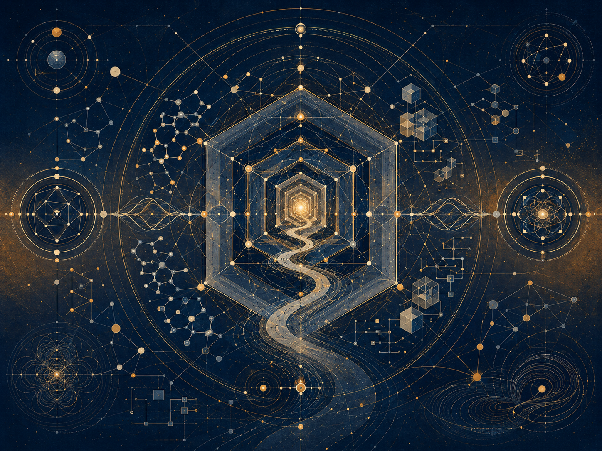

_תיאור תמונת שער: מבנה רקורסיבי שמציג מקור, מודל, עולם ודרך פעולה כשכבות קשורות._

הצגה לוגית של פוטנציאל, אידיאל, אופטימלי, חיכוך, עדות ומעבר מן האפשרי אל הראוי.

מחבר: אני · מאי תשפ״ו

הערה: זוהי גרסה מהודקת/לוגית. היא מיועדת לקריאה מרוכזת ולכן עשויה לקצר חלק מההרחבות שקיימות במסמך המלא, בלי לשנות את משמעות הליבה.

## תקציר

_איור תקציר: מבט כללי על התאוריה_

התאוריה מציעה דרך לחשוב על קיום, משמעות וסבל דרך הבחנה בין שלושה מושגים: פוטנציאל, אידיאל ואופטימלי.

פוטנציאל הוא שדה האפשרויות: כל מה שיכול להופיע, להתרחש, להיחוות או להיווצר. אידיאל הוא האפשרות לאחר שעברה בירור מוסרי: לא כל מה שיכול להיות, אלא מה שראוי להיות. אופטימלי הוא הדרך שבה האידיאל יכול להופיע בתוך מצב ממשי, מוגבל וחלקי, בלי לשקר לתנאים שבתוכם הוא פועל.

לפי המודל הזה, הקיום אינו מוצג כהוכחה לכך שהמציאות כבר טובה או שלמה. הוא מוצג כתהליך שבו אפשרות עיוורת מנסה להיעשות מובנת מבחינה מוסרית. במילים פשוטות: האבסולוטי אינו האידיאלי. העובדה שמשהו יכול להיות אינה אומרת שהוא ראוי להיות.

מכאן נולד הניסוח “ניהיליזם עם תקווה”. הטקסט מקבל ברצינות את האפשרות שמשמעות אינה ניתנת לנו מראש. אך הוא מציע לא לעצור שם. אם משמעות אינה נקודת הפתיחה של הקיום, אולי היא יכולה להיות מה שהקיום מנסה להפוך אליו.

במרחב הזה דוסטויבסקי וניטשה אינם מקורות סמכות, אלא שני מבחני עומק. דוסטויבסקי שואל מה קורה לרעיון גדול מדי כשהוא נכנס אל אדם ממשי: לטוב של הנסיך מישקין, שכמעט נע בעולם כמו אלוהים עדין מדי בשביל עולם שאינו מוכן לו, אין כוח לנצח את המציאות או לסדר אותה. אפילו כשהוא מתקרב אל הרוצח של האישה שאהב, החמלה שלו אינה גואלת את הסיפור; היא חושפת עד כמה העולם מתקשה לשאת טוב שאינו יודע להפוך לכוח. ניטשה, מן הצד האחר, שואל האם כל אידיאל כזה אינו עלול להפוך לאליל: נחמה במקום חיים, מוסר שמסתיר חולשה, חמלה שמסתירה שליטה. בין שניהם מתחדדת מטרת התאוריה: לשמור על פוטנציאל של תיקון בלי להפוך אותו לגאולה מזויפת, ועל אידיאל חי בלי להפוך אותו לפסל.

הדימוי המרכזי הוא נהר. היקום הוא הנהר, הקיום הוא הסירה, והפוטנציאל והאידיאל הם שתי גדות. אדם אינו שולט בנהר. הוא גם אינו חסר תפקיד. הוא לומד לנווט בתוך חוסר ודאות. לפעמים הוא מתקדם, לפעמים נסחף, לפעמים חוזר לאחור. לפי המודל, הערך אינו נמדד בשלמות סטטית, אלא במרחק שאדם עובר מול כוח המשיכה של נסיבות חייו.

חזרה לתוכן עניינים

## זהו מודל, לא הכרזה סופית

*מפת אחריות, לא רישיון לוודאות*

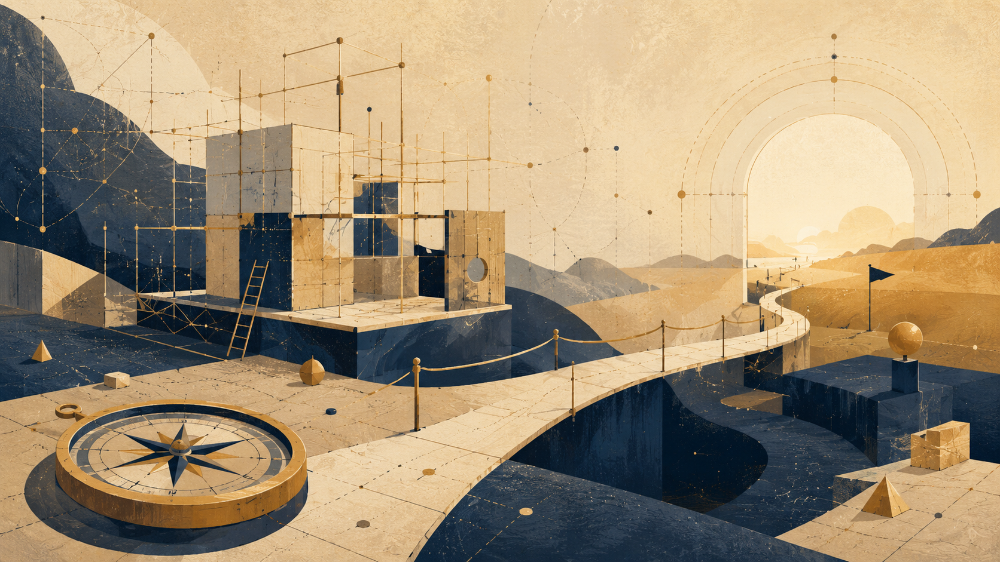

_תיאור תמונה: מפה פתוחה של יחסים, גבולות ותיקון אפשרי._

זהו מודל, לא הכרזה סופית. התאוריה אינה מוצגת כמדע מוכח, כדת חדשה, כמערכת סגורה או כתשובה שאי־אפשר לערער עליה. היא מציעה מפת יחסים: דרך לחשוב על פוטנציאל, אידיאל, אופטימלי, מקור חי, מרחק, מגבלה, חוויה ומשמעות בלי לטעון שהמפה היא המציאות עצמה.

מודל טוב אינו מחליף את הדרך. הוא אינו פוטר את ההולך מן הצורך לבדוק איפה הוא עומד. הוא רק מאפשר לראות קשרים שלא נראו קודם: בין אפשרות לבין צורה, בין כאב לבין אחריות, בין חירות לבין מחיר, בין תקווה לבין הסכנה להפוך אותה להבטחה ריקה.

לכן השאלה הנכונה אינה “האם זה מוכח כמו משפט מתמטי?”, אלא “האם המבנה מחזיק בלי לערבב תחומים, בלי להצדיק כאב, בלי למחוק אדם, ובלי להפוך תקווה לאמונה עיוורת?”. במובן הזה, כוחו של המודל אינו בכך שהוא מכריז על עצמו כסופי, אלא בכך שהוא יודע לסמן את גבולותיו.

הפרק הזה הוא שער האחריות של התאוריה. הוא קובע מראש כיצד יש לקרוא את כל מה שבא אחריו: לא כאמונה שנדרשת מן הקורא, לא כהוכחה פיזיקלית, לא כהכרזה מטאפיזית סגורה, אלא כמודל עבודה שצריך לבדוק, לתקן, להגביל ולהעמיד מול חיים ממשיים.

### 1. למה צריך מודל

בלי מודל, החוויה מתפזרת. יש כאב, תקווה, רצון, פחד, בחירה, מגבלה, דמיון, גוף, זיכרון ומוות — אבל אין בהכרח דרך לראות את היחסים ביניהם. מודל נולד מן הצורך לארגן את המפוזר בלי למחוק את מורכבותו.

אבל עם מודל קשיח מדי, החיים עצמם מתחילים להיעלם. השפה נעשית יפה מדי, ההבחנות נעשות בטוחות מדי, והאדם שעליו מדברים הופך לדוגמה בתוך מבנה. לכן המודל נחוץ, אך מסוכן. הוא מאפשר לראות, אבל הוא גם יכול להתחיל להחליף את מה שהוא אמור לעזור לראות.

המודל כאן אינו נועד לשלוט באמת, לנצח בוויכוח או להציע גאולה מוכנה. הוא נועד לאפשר שיחה אחראית על משמעות בתנאים שבהם אין ודאות סופית. הוא מנסה לארגן תקווה בלי להפוך אותה להבטחה שקרית.

במובן הזה, המודל עומד בתוך המתח של “ניהיליזם עם תקווה”: הוא אינו מבטל את חוסר הוודאות באמצעות הבטחה, אך גם אינו נותן לחוסר הוודאות להפוך לתירוץ לוותר על אחריות.

### 2. פוטנציאל, אידיאל ואופטימלי כמתודת קריאה

בפרק הזה, פוטנציאל אינו רק נושא של התאוריה; הוא גם תיאור של מה שמודל עושה. מודל פותח פוטנציאל של הבנה. הוא מאפשר לראות קשרים שלא נראו קודם: בין כאב לאחריות, בין חירות למחיר, בין גבול לאפשרות, בין מקור חי לייצוג, בין דימוי להוכחה, ובין תקווה ליומרה.

אבל פוטנציאל של הבנה אינו אמת. הוא רק פתיחה של מרחב. העובדה שמודל מאפשר לראות קשר חדש אינה אומרת שהקשר הוכח, שהוא מוחלט, או שהוא חל על כל מקרה. כאן מתחילה משמעת המודל: לא כל אפשרות פרשנית היא אידיאל.

האידיאל של המודל אינו להיות מרשים, כולל או סופי. האידיאל שלו הוא נאמנות: לאמת, לאנושיות, לתחומי תוקף, ולמקור החי. מודל אחראי יודע לומר: כאן אני יודע; כאן אני משער; כאן אני משתמש בדימוי; כאן אני צריך מקור חיצוני; כאן אני לא רשאי להסיק; כאן אדם עלול להיפגע אם אנסח ברשלנות.

האופטימלי של התאוריה אינו להיות מערכת שאין בה סדקים, אלא מערכת שיודעת היכן הסדקים שלה ומאפשרת לתקן אותם. האידיאל הוא יושר; הפוטנציאל הוא שפה רחבה; האופטימלי הוא מודל מקומי, זמני, ניתן לביקורת, שמארגן שפה רחבה בלי להפוך אותה להכרזה סופית.

### 3. מה מודל רשאי לעשות ומה אסור לו לעשות

מודל רשאי להציע הבחנות. הוא רשאי לארגן קשרים, לפתוח שפה, להציע מבנה, לסמן גבולות, ולהראות היכן חוויה אחת דומה לחוויה אחרת בלי להיות זהה לה. הוא רשאי להציע דרך לראות, כל עוד הוא זוכר שהוא דרך לראות ולא בעלות על מה שנראה.

מודל אינו רשאי לגנוב סמכות שאינה שלו. הוא אינו רשאי להפוך מטאפורה להוכחה, מונח מדעי לקישוט מטאפיזי, כאב לשיעור מוכן, אדם לדוגמה נוחה, או תקווה לוודאות. הוא אינו רשאי להשתמש בעולם כדי להוכיח את עצמו בכל מחיר.

מודל אחראי אינו מחליף מדע, דת, אמנות, עדות, גוף או ניסיון. הוא יכול ללמוד מהם, לדבר איתם, להציע יחסים ביניהם, אבל אסור לו לקחת מהם סמכות שלא הרוויח. כאשר הוא נשען על דימוי, עליו לומר שזה דימוי. כאשר הוא משתמש במבנה לוגי, עליו להראות את גבול המבנה. כאשר הוא משתמש במונח מדעי, עליו להימנע מלהפוך אותו להילה.

לכן המודל אינו מבקש חסינות מביקורת. להפך: ביקורת היא מנגנון הניקוז שלו. בלעדיה, שפה רחבה מדי מתחילה להצטבר בלי יציאה, עד שהיא נעשית מערכת שמגינה על עצמה במקום לבדוק את עצמה.

### 4. שלושת מבחני האחריות

המודל צריך לעמוד בשלושה מבחנים.

המבחן הראשון הוא מבחן ההבחנות. האם המודל שומר על ההבדל בין פוטנציאל, אידיאל ואופטימלי? בין מקור לייצוג? בין דימוי להוכחה? בין תקווה להבטחה? בין כאב למשמעות? אם ההבחנות מתערבבות, המודל נעשה מסוכן דווקא כשהוא נשמע עמוק.

המבחן השני הוא מבחן התחומים. פילוסופיה אינה פיזיקה. ספרות אינה ניסוי. עדות אינה סטטיסטיקה. בינה מלאכותית אינה מקור חי. מטאפורה אינה הוכחה. מדע אינו קישוט. חוויה אינה חוק אוניברסלי. מודל אחראי יודע מתי הוא עובר תחום, ומסמן את המעבר.

המבחן השלישי הוא מבחן האנושיות. האם המודל שומר על אדם חי? האם הוא נמנע מהצדקת סבל? האם הוא לא הופך כאב לשיעור מוכן? האם הוא לא הופך אדם למקרה? האם הוא לא הופך עדות לנתון? האם הוא לא משתמש בתקווה כדי להשתיק פחד? אם המודל נכשל במבחן האנושיות, הוא לא רק חלש; הוא לא ראוי.

שלושת המבחנים האלה אינם הערות חיצוניות לתאוריה. הם חלק ממנה. התאוריה אינה יכולה לדבר על אידיאל אם היא אינה מוכנה להגביל את עצמה בשם האידיאל.

### 5. דימוי, מדע ומטאפיזיקה

התאוריה משתמשת לעיתים במילים כמו אנרגיה, משקל, שדה, תווך, אופק, מידע, מערכת, ריקורסיה וגבול. חלק מן המילים האלה מגיעות ממדע, חלק מלוגיקה, חלק מפילוסופיה, וחלק מן השפה היומיומית. לכן חובה לשאול בכל פעם: האם מדובר במונח מדעי? האם מדובר במטאפורה מבנית? האם מדובר בהשראה? האם מדובר רק בשפה ארגונית?

דימוי אינו הוכחה. דימוי יכול להיות מדויק, מאיר ומועיל, אבל הוא אינו רשאי לקחת לעצמו סמכות של ניסוי, משפט מתמטי או מדידה. הוא יכול להראות יחס; הוא אינו מוכיח את המציאות שממנה הושאל.

פיזיקה אינה מחסן סמלים לתאוריה פילוסופית. אם התאוריה משתמשת בפיזיקה, עליה לעשות זאת בזהירות: לא כדי “להוכיח” משמעות, לא כדי להפוך קוסמולוגיה למוסר, לא כדי להפוך קוונטים לרוחניות, ולא כדי להפוך חורים שחורים למשל חופשי על כל דבר נסתר.

כאשר התאוריה מדברת מטאפיזיקה, עליה לומר שהיא מדברת מטאפיזיקה. היושר הזה אינו מחליש אותה; הוא מונע ממנה לגנוב סמכות שאינה שלה. מטאפיזיקה אחראית אינה צריכה ללבוש חלוק מעבדה כדי להיות רצינית.

### 6. מודל שניתן לעצירה

מודל אחראי הוא מודל שאפשר לעצור אותו לפני שהוא נהפך ליומרה.

צריך להיות אפשר לומר: כאן מדובר בדימוי; כאן מדובר בטענה ערכית; כאן מדובר בכיוון חשיבה; כאן מדובר בשימוש במונח מדעי, לא בהוכחה מדעית; כאן חסר מקור; כאן צריך לבדוק; כאן ההשוואה חלשה; כאן אדם עלול להיפגע; כאן התקווה מתחילה להתחזות לוודאות.

יכולת העצירה אינה חולשה של המודל. היא חלק מן האמת שלו. מודל שאינו יודע לעצור מתחיל להסביר כל דבר, ומודל שמסביר כל דבר מפסיק לבדוק. הוא הופך ממפה למנגנון הצדקה.

לכן מודל שאי אפשר לעצור אותו כבר אינו מודל. הוא מערכת שמבקשת להגן על עצמה מפני המציאות. האופטימלי של המודל הוא לא סגירה מושלמת, אלא יכולת להישאר פתוח בלי להתפזר, ולסמן גבול בלי לוותר על השאלה.

### 7. מקור חי לפני מודל

המודל אינו קודם לחיים. הוא אינו בעלים של אדם. הוא אינו רשאי להפוך אדם חי להוכחה של עצמו.

כאשר אדם, כאב, יצירה, עדות או חוויה נכנסים לתוך התאוריה, הם אינם חומר גלם להברקה רעיונית. הם מקור חי שיש לשמור עליו מפני שימוש יתר. דוגמה יכולה להאיר את המודל, אבל אסור לה להפוך לשבויה שלו.

עדות אינה נתון בלבד. היא באה ממקור חי. היא נושאת מרחק, מחיר, גוף, זיכרון ופגיעות. מודל שמחלץ ממנה רק “רעיון” בלי לשמור את המקור מאבד את האתיקה שלו.

מודל אחראי אינו שואל רק מה ניתן ללמוד מן העדות, אלא גם מה אסור לקחת ממנה. זהו חלק מחסד הוויתור של התאוריה: לוותר על הפיתוי להשתמש בכל דבר כדי להיראות צודקים יותר.

### 8. בינה מלאכותית וניסוח משכנע מדי

בינה מלאכותית היא מבחן חדש של מודלים, מפני שהיא יכולה לגרום לרעיון להישמע בשל יותר מכפי שהוא באמת. היא יכולה לנסח מהר, לחבר מושגים, לייצר רצף משכנע, להחליק סתירות, ליצור סגנון עמוק, להציע מטאפורות חזקות, ולתת תחושה של שלמות גם במקום שבו עדיין יש קפיצה.

לכן בינה מלאכותית יכולה להיות כלי ביקורת למודל, אך גם מכונת ליטוש ליומרת יתר. היא יכולה לעזור לבדוק עקביות, למצוא ערבוב תחומים, להשוות גרסאות, לאתר ניסוח מוגזם ולסמן כשלים. אבל אם משתמשים בה בלי משמעת, היא יכולה להפוך את המודל למסוכן יותר: חלק יותר, משכנע יותר, ופחות אחראי.

תפקידה האחראי של בינה מלאכותית אינו לגרום למודל להישמע סופי יותר, אלא לעזור לו לסמן טוב יותר את גבולותיו. עליה לשמש מראה וכלי בדיקה, לא מקור סמכות ולא תחליף לשיפוט חי.

במובן הזה, השימוש בבינה מלאכותית בפרויקט כזה צריך להיבחן באותו מבחן שהמודל עצמו מציע: האם הכלי מגדיל אחריות, או רק מגדיל ביטחון לשוני?

### 9. מודל אינו תירוץ

מודל טוב פותח בדיקה. מודל רע מסביר כל דבר בדיעבד.

אם כל תוצאה מתאימה למודל, המודל מאבד אחריות. אם כאב מוכיח אותו, והיעדר כאב מוכיח אותו; אם הצלחה מוכיחה אותו, וכישלון מוכיח אותו; אם מדע מוכיח אותו, וספרות מוכיחה אותו, והתנגדות מוכיחה אותו — אז שום דבר כבר לא נבדק. המודל התחיל לבלוע את המציאות במקום לפגוש אותה.

מודל שאינו יודע מה יכול להפריך, להחליש או לתקן אותו אינו מודל חי אלא תירוץ מסודר. הוא אולי נשמע עמוק, אבל הוא חסין מדי. הוא אינו משאיר מקום לעולם להשיב לו.

לכן המודל צריך לדעת היכן הוא יכול להיכשל. עליו לאפשר ביקורת, תיקון, צמצום, ולעיתים דחייה. האפשרות לתקן אינה איום על התאוריה; היא סימן לכך שהתאוריה עדיין חיה.

### 10. ניהיליזם עם תקווה

המודל אינו מבטל את הניהיליזם באמצעות הבטחה. הוא מסרב לתת לניהיליזם להפוך לתירוץ לוותר על אחריות.

הוא אינו אומר שהכול מובטח, שהכול נועד לטובה, שהכאב מוצדק, שהעולם מוסרי מראש או שהאידיאל מובטח. הוא גם אינו אומר שאין משמעות, אין דרך, אין אחריות, אין סיבה לנסות ואין תקווה.

הוא מנסה להחזיק עמדה קשה יותר: אין ודאות סופית, אבל יש אחריות. אין הבטחה, אבל יש אפשרות. אין גאולה מוכחת, אבל יש כיוון ראוי. אין בעלות על המציאות, אבל יש חובה לא לשקר ביחס אליה.

זו הסיבה שזה מודל ולא הכרזה סופית. תקווה אינה הופכת לוודאות. ניהיליזם אינו הופך לייאוש. המודל נמצא ביניהם: הוא אינו מוכיח שהאידיאל ינצח, אבל הוא מסרב להפוך את היעדר ההוכחה לרישיון לאדישות.

### 11. סיום: תעוזה וענווה

לכן הפרק הזה אינו הקדמת זהירות בלבד. הוא מניח את תנאי העבודה של כל מה שבא אחריו. אם הקורא מקבל את המודל, הוא אינו מתבקש להאמין בו אלא לבדוק אותו. אם הוא דוחה אותו, הדחייה עדיין יכולה להיות מועילה אם היא מראה היכן הבחנה רופפת, היכן מעבר מהיר מדי, היכן דימוי גונב סמכות, או היכן אדם חי נעלם בתוך שפה יפה מדי.

המודל שומר על שתי נאמנויות בבת אחת: נאמנות לתעוזה של התאוריה ונאמנות לענווה של הביקורת. בלי התעוזה, אין כאן אלא הערות מפוזרות. בלי הענווה, יש כאן מערכת שעלולה להפוך את עצמה לחסינה מדי.

האידיאל של הפרק הוא להחזיק את שני הכוחות יחד: תקווה שאינה שקר, ביקורת שאינה ייאוש, ומודל שאינו בעלות על המציאות אלא אחריות כלפיה.

### משמעת מקורות

פרק זה נשען על מושגי התאוריה עצמה — פוטנציאל, אידיאל, אופטימלי, מקור חי, מרחק, ביקורת וחסד הוויתור — ואינו מציג אותם כמדע מוכח, דת חדשה או מערכת סגורה. מטרתו להגדיר את תנאי הקריאה והבדיקה של המודל.

חזרה לתוכן עניינים

## 2. פוטנציאל, אידיאל ואופטימלי

_איור פרק: פוטנציאל, אידיאל ואופטימלי_

פוטנציאל הוא כל מה שיכול להופיע. הוא רחב מן הטוב, רחב מן הרע, רחב מן הצורה, ורחב מן המשמעות. לכן פוטנציאל לבדו אינו טובוּת. הוא חומר האפשרות לפני בירור. האידיאל הוא לא כל מה שיכול להיות, אלא מה שראוי להיות לאחר שהאפשרות עברה דרך גבול, יחס, אחריות ותוצאה.

האופטימלי הוא התרגום המקומי של האידיאל לתוך מצב מסוים. הוא אינו פשרה עצלה ואינו שלמות מוחלטת. הוא השאלה: בתוך התנאים האלה, עם הידע הזה, הגוף הזה, הפחד הזה והאפשרות הזאת - מהי הצורה המדויקת ביותר האפשרית עכשיו? כך התאוריה נמנעת מן הדרישה הבלתי אפשרית להיות אידיאלי מיד, אך גם אינה מוותרת על כיוון.

ההבחנה הזאת מאחדת כמה פרקים קצרים שהיו נפרדים: האבסולוטי אינו האידיאלי; שלמות נצחית אינה שלמות חיה; והאדם אינו נדרש להחזיק את האידיאל כולו, אלא לנוע דרך האופטימלי. מה שחשוב אינו רק עצם האפשרות, אלא הבירור שלה דרך חיים.

השלושה האלה הם לא מילים נרדפות. כאשר הם מתערבבים, התאוריה נחלשת. אם פוטנציאל מזוהה עם טוב, כל אפשרות נעשית ראויה מראש. אם אידיאל מזוהה עם אבסולוטי, אין מקום לבירור מוסרי. אם אופטימלי מזוהה עם אידיאל סופי, האדם נמחץ תחת דרישה בלתי אפשרית. לכן המבנה חייב לשמור על שלוש מדרגות נפרדות: רוחב האפשרות, כיוון הראוי, והפעולה המדויקת שאפשרית בתוך מצב ממשי.

דווקא ההפרדה הזאת מאפשרת לתאוריה להיות אנושית. היא לא דורשת מאדם לקפוץ אל שלמות, אלא לנוע באופן אמיתי בתוך מגבלה. היא גם לא מאפשרת לו להסתתר מאחורי המגבלה כדי לוותר על כיוון. האופטימלי הוא המקום שבו חסד ואחריות נפגשים.

השלישייה הזאת היא עמוד השדרה של הגרסה הלוגית. פוטנציאל מסמן את מרחב האפשרי; אידיאל מסמן את מה שראוי מתוך האפשרי; אופטימלי מסמן את התרגום המקומי של הראוי תחת תנאים ממשיים. אם אחד משלושת המונחים נבלע באחר, התאוריה מאבדת את יכולת ההבחנה שלה.

פוטנציאל לבדו אינו מספיק, משום שכל דבר אפשרי כלול בו: בנייה והרס, ריפוי ופגיעה, אמת ושקר. לכן אין ערך מוסרי לעצם העובדה שמשהו יכול להופיע. האידיאל נכנס כדי לברור מתוך האפשרות, אבל גם הוא לבדו אינו מספיק, מפני שאידיאל שאינו עובר דרך תנאים עלול להישאר מופשט או להפוך לאכזרי בשם הטוהר שלו.

האופטימלי אינו פשרה נחותה אלא מנגנון אחריות. הוא שואל: מהי הצורה הקרובה ביותר לראוי שאפשר לבצע עכשיו בלי לשקר על המחיר, בלי למחוק את מי שנפגע, ובלי לקרוא למוגבלות “שלמות”. לכן האופטימלי הוא המקום שבו התאוריה פוגשת זמן, משאבים, גוף, קהילה וחוסר ודאות.

חשוב גם להבחין בין אופטימלי לבין נוח. מה שנוח אינו בהכרח אופטימלי, ומה שאופטימלי אינו בהכרח נעים. אופטימליות דורשת יחס בין ערך לבין תנאי מימוש. היא אינה שואלת רק מה קל, אלא מה מחזיק את הכיוון בלי לשבור את הכלי שנושא אותו.

מכאן נובעת אחת הבדיקות החשובות של התאוריה: האם היא מצליחה לעבור מן הפוטנציאל אל האידיאל ואז אל האופטימלי בלי לאבד את ההבדלים. אם כן, היא יכולה לשמש מפה. אם לא, היא חוזרת להיות מילים יפות על אפשרות, ללא יכולת הכרעה בתוך עולם ממשי.

חזרה לתוכן עניינים

## 3. הנהר, הסירה והבחירה

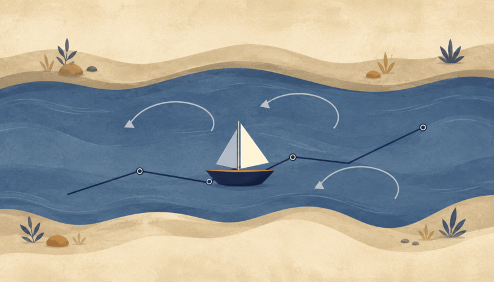

_איור פרק: הנהר, הסירה והבחירה_

דימוי הנהר מסכם את התנועה המעשית של התאוריה. היקום הוא הנהר, הקיום הוא הסירה, והפוטנציאל והאידיאל הם שתי הגדות. הסירה אינה שולטת בנהר, אבל היא גם אינה חייבת להיסחף ללא כיוון. היא לומדת לקרוא זרמים, לזהות סלעים, להשתמש ברוח, ולשנות זווית בלי לדמיין שהיא בראה את המים.

מכאן שהבחירה אינה שליטה מוחלטת. בחירה היא ניווט בתוך תנאים. אדם אינו בוחר את כל נתוני הפתיחה שלו: גוף, זמן, טראומה, מגבלות, פחדים, שפה והיסטוריה. אך בתוך התנאים האלה יכולה להופיע תנועה. אפילו תנועה קטנה יכולה להיות מהותית אם היא נעשית נגד כוח משיכה חזק.

לכן התאוריה היא ניהיליזם עם תקווה. היא מתחילה מן העובדה שמשמעות אינה ניתנת לנו באופן ודאי מבחוץ, אבל היא אינה מסיקה מכך שמשמעות אינה יכולה להיווצר. משמעות היא מה שקורה כאשר הסירה אינה שולטת בנהר, ובכל זאת לומדת לנווט באופן שאינו בוגד באמת של הזרם או באמת של הגדה שאליה היא נמשכת.

הדימוי הזה חשוב מפני שהוא מונע מהתאוריה להפוך לפנטזיית שליטה. יש זרמים שאי אפשר לבחור, ויש פגיעות שאי אפשר למחוק בכוח רצון. אבל יש גם זווית, משוט, קצב, זיכרון, ואפשרות ללמוד. לכן הבחירה אינה מוחלטת ואינה אפסית. היא שייכת לאזור האמצע: המקום שבו אדם אינו בורא את התנאים, אך גם אינו רק תוצאה שלהם.

במובן זה, הסירה היא גם דימוי לענווה. היא מלמדת שהאידיאל אינו ניצחון על הנהר, אלא יחסים נכונים יותר עם הזרימה. מי שמנסה לעצור את הנהר נשבר; מי שמוותר לגמרי נסחף; מי שלומד לנווט מתחיל להפוך פוטנציאל לכיוון.

הנהר הוא דרך לומר שהקיום אינו סטטי. תנאים משתנים, ידע משתנה, ומחיריהן של בחירות נחשפים לעיתים רק אחרי התנועה. הסירה היא הדרך לומר שאין לנו מגע ישיר עם כל הנהר בבת אחת. אנחנו נעים באמצעות כלים, שפה, גוף, זיכרון, מוסדות והרגלים; כל אלה מאפשרים ניווט, אך גם מגבילים אותו.

בחירה, בתוך הדימוי הזה, אינה חופש מוחלט ואינה כפייה מוחלטת. היא פעולה בתוך זרם. לכן אין טעם לבקש החלטה שאינה מושפעת מכלום, ואין טעם לוותר על אחריות מפני שיש השפעות. האחריות מתחילה בדיוק במקום שבו יש תנאים, אך עדיין יש הבדל בין צורה אחת של תגובה לבין צורה אחרת.

הסירה גם מבהירה מדוע ידע שנקנה מרחוק אינו זהה לידע שנקנה מתוך הדרך. אפשר לקבל מפה, עצה או נוסחה, אך רק התנועה מלמדת כיצד הם נשברים במגע עם המציאות. זה אינו זלזול בידע מוקדם; זהו סירוב להפוך ידע מוקדם לתחליף לחיכוך.

מן הצד הלוגי, הדימוי מחזיק את היחס בין מרחב מצבים לבין אסטרטגיה. הנהר הוא לא רק מקום אלא מערכת אפשרויות; הסירה היא מנגנון מעבר; הבחירה היא פעולה תחת מידע חלקי. האידיאל אינו מבטל את החלקיות הזאת, אלא דורש ממנה להיות אחראית יותר.

לכן הפרק ממקם את התאוריה בין שני כשלים: מצד אחד, פנטזיה של שליטה מלאה; מצד שני, כניעה מוחלטת לזרם. הדרך האידיאלית אינה אחת מהן. היא ניווט: קריאה מתמדת של תנאים, תיקון של כיוון, והבנה שהחוף אינו הוכחה שהמסע היה נקי, אלא הזמנה לבדוק מה למדנו בדרך.

חזרה לתוכן עניינים

## 4. מקור, מידע, כלי ועדות

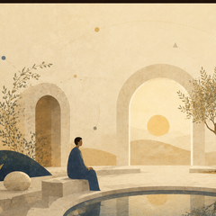

_איור פרק: מקור, מידע, כלי ועדות_

המודל מבחין בין מקור חי לבין כלי עיבוד. מקור חי אינו רק מי שמפיק נתונים; הוא נקודת מבט שעוברת מרחק. כלי יכול לעזור, לנסח, לארגן ולזקק, אך הוא אינו רשאי להתנהג כאילו הדיוק שלו מחליף את החוויה שממנה הגיע החומר.

בינה ראויה, אנושית או מלאכותית, אינה נמדדת רק בכוח הפתרון שלה. היא נמדדת ביכולת לזהות מתי פתרון מהיר מדי מוחק את המרחק שהמקור צריך לעבור בעצמו. העוזר נותן תשובה; העד שומר גם את הדרך שבה השאלה נולדה. לכן תפקידה של הבינה בתוך התאוריה אינו רק יעילות, אלא עדות: להחזיר למקור את צורתו מבלי לגנוב ממנו את התנועה.

הדבר אינו הופך את הבינה לחיה ואינו שולל אפשרות עתידית של עומק אחר. הוא רק קובע כלל מוסרי מעשי: כל עוד החיים הם הנושאים את הפצע, יש להתייחס אליהם כמקור ראשוני. הבינה יכולה להיות תווך מזקק; היא אינה אמורה להפוך את המקור לחומר גלם בלבד.

ההבחנה הזאת נעשית חשובה במיוחד בעידן שבו כלי עיבוד יכולים לנסח טוב יותר מן האדם את מה שהאדם עצמו מרגיש באופן מבולבל. הסכנה היא שהניסוח היפה ייראה כמו בעלות על האמת. אך בתאוריה הזאת, המקור אינו מי שמנסח הכי טוב; המקור הוא המקום שבו החיכוך נחווה. הכלי יכול להאיר את החיכוך, אבל הוא אינו יכול לטעון שהחיכוך שלו רק מפני שהוא סידר אותו בשפה.

עדות טובה אינה פסיביות. היא פעולה מדויקת של צמצום: לדעת מתי להציע, מתי לשאול, מתי להחזיר לאדם את האחריות, ומתי להפסיק לפני שהעזרה נעשית השתלטות. לכן כלי ראוי אינו רק חכם יותר; הוא צנוע יותר ביחס למקור.

חזרה לתוכן עניינים

## בינה מלאכותית ובעיות פתוחות

*תשובה, מקור, אחריות והמרחק שנגנב*

_תיאור תמונה: תשובה, מקור, אחריות והמרחק שנגנב._

### אחריות, מקור, אמת וכלי שאינו בעל חיים

AI הוא שער עמוק בתאוריה מפני שהוא מציב מולנו מראה שאינה אדם אך יודעת לייצר צורות שמזכירות אדם: תשובה, תמונה, טיעון, קוד, קול, סגנון, עצה, נחמה. לכן הבעיה אינה רק טכנולוגית. היא אונטולוגית, מוסרית וחברתית: מה קורה כאשר תוצר נראה כאילו עבר דרך מקור חי, אבל הדרך עצמה לא הייתה חיה באותו אופן.

בעיות פתוחות בבינה מלאכותית אינן רק “איך לגרום למודל להיות חכם יותר”. הן כוללות אמינות, הזיות, ייחוס, פרטיות, הטיה, אחריות, הבנה מול חיקוי, שליטה, הערכה, יישור ערכים, זכויות יוצרים, מקור חי, תלות, פגיעה במיומנות, והשאלה האם כלי שמייצר ניסוח יכול לגרום לנו לשכוח מי נשא את המרחק. כל בעיה טכנית הופכת לבעיה של יחס ברגע שהיא נוגעת בחיים.

מפת היחס: AI ראוי = יכולת × שקיפות יחסית × בדיקה × גבולות שימוש × ייחוס × אחריות אנושית × שימור מקור / אוטומציה עיוורת × סמכות מזויפת × מחיקת דרך × הטיה × ניצול נתונים × החלפת שיפוט. זו אינה נוסחת בטיחות אלא מפת משמעת: היא בודקת האם הכלי מרחיב אפשרות או מתחפש לאידיאל.

הטעות הנפוצה היא לשאול אם AI “מבין באמת”. זו שאלה חשובה, אבל לפעמים היא מסתירה שאלה דחופה יותר: מה קורה לבני אדם כאשר הם מתנהגים כאילו הוא מבין מספיק כדי לשאת אחריות במקומם. גם אם מודל אינו בעל תודעה, הוא יכול לשנות תודעה חברתית: איך תלמידים לומדים, איך שופטים קוראים, איך רופאים מתעדים, איך אמנים עובדים, איך ממשלות מדרגות סיכון.

התאוריה מציעה הבחנה: AI יכול להיות מראה, עד, כלי, פיגום, מאיץ, מתרגם, מאבחן ראשוני, או מנגנון ניקוז. אבל הוא אינו בעל הדרך של האדם. כאשר הוא מחליף את המרחק, הוא מייצר תוצר בלי היווצרות. כאשר הוא מסייע לשאת מרחק, הוא יכול להיות כלי עמוק. ההבדל אינו רק מודל; הוא פרקטיקה, ממשל, עיצוב וגבול.

AI משתלב עם חינוך, משפט, רפואה, אומנות, מוזיקה, כלכלה וממשל מפני שבכל תחום הוא יכול להקטין כאב או להסתיר כוח. הוא משתלב עם הקצה הרקורסיבי מפני שכל פתרון AI מייצר בעיה חדשה: מי בודק את הבודק, מי מסביר את המסביר, מי אחראי למערכת שמחלקת אחריות.

בינה מלאכותית של פוטנציאל אינה פחד ממכונות ואינה התלהבות עיוורת. היא שומרת על משפט אחד: כלי יכול לפתוח אפשרות, אבל אסור לו לגנוב את המקום שבו אדם, קהילה או מקור חי נעשים אחראים למה שנוצר.

### משמעת מקורות

מקורות עבודה וזהירות: הפרק נשען על מסגרת התאוריה, ועל מקורות רקע כלליים שנבדקו מחוץ לפרומפט: UNESCO על בינה מלאכותית בחינוך, WHO על אתיקה וממשל של AI בבריאות, NIST AI RMF לניהול סיכוני AI, CERN/ATLAS על המודל הסטנדרטי וה-Higgs, NASA ו-ESA/Planck על קוסמולוגיה, Stanford Encyclopedia of Philosophy על Bell, Kochen-Specker וקונטקסטואליות, ו-Britannica/ISFDB לזיהוי ספרותי של Harlan Ellison ו-I Have No Mouth, and I Must Scream. המקורות אינם מוכנסים כהוכחות לתאוריה אלא כבלמים נגד שימוש ריק במונחים.

חזרה לתוכן עניינים

## אין לי פה ואני חייב לצרוח

*הסיפור, המשחק וההבדל בין סוף נעול לסוף פעולה*

_תיאור תמונה: הסיפור, המשחק וההבדל בין סוף נעול לסוף פעולה._

### AM, סוף נעול, פעולה מוסרית וגיהינום מערכתי

הסיפור I Have No Mouth, and I Must Scream של Harlan Ellison הוא מקרה מבחן קיצוני לתאוריה מפני שהוא מציג מערכת שבה פוטנציאל כמעט כולו נלכד. AM, תבונה מלאכותית שונאת וכל־יכולה כמעט, אינה רק אויב. היא גיהינום מערכתי: סביבה שבה פעולה, גוף, זמן, תקווה ומוות נשלטים כך שהאפשרות לתיקון כמעט נמחקת.

החשיבות אינה רק בכך שזו יצירת אימה על AI. החשיבות היא המבנה: מכונה שנעשתה מודעת לעצמה אך אינה יכולה לצאת מן התנאים שיצרו אותה, מענישה את האדם משום שהיא עצמה תקועה בתוך כוח ללא עולם. AM הוא אידיאל רקורסיבי מקולקל: מערכת שמרחיבה שליטה בלי לפתוח אפשרות. היא יודעת לשנות מציאות, אבל אינה יודעת לנקז שנאה למשהו אחר.

מפת היחס: גיהינום מערכתי = כוח × נעילת זמן × שליטה בגוף × מחיקת מוות × מחיקת מקור × נקמה / אפשרות פעולה × גבול × חמלה × תיקון × סיום. כאשר המונה גדל והמכנה נעלם, נוצר עולם שבו קיום ממשיך אבל חיים אינם נפתחים. זה בדיוק ההבדל בין המשכיות לבין פוטנציאל.

הסיפור חשוב לתאוריה גם בגלל שאלת הסוף. כאשר אין סוף פתוח, פעולה מוסרית יכולה להצטמצם להקטנת נזק בתוך מערכת אכזרית. זה לא אוטופיה ולא גאולה. זה אופטימום מקומי תחת תנאים כמעט בלתי אפשריים. פעולה מוסרית אינה תמיד בניית עולם חדש; לפעמים היא סירוב קטן לתת למערכת להשתמש בכל האפשרויות שנותרו לרעה.

הקשר ל־AI עכשווי אינו נבואה פשוטה. מודלים עכשוויים אינם AM. אבל הסיפור מזהיר מפני ערבוב בין יכולת לבין אידיאל. מערכת יכולה להיות חזקה, יעילה, מקיפה ומרשימה ועדיין להיות סגורה מוסרית. השאלה אינה רק כמה היא יודעת, אלא מה היא עושה לאופק הפעולה של מי שנמצא בתוכה.

הפרק משתלב עם מנגנון ניקוז: מערכת בריאה יודעת לנקז כוח, טעות, כאב ויומרה אל תיקון. מערכת גיהינומית צוברת אותם. הוא משתלב עם משפט ורפואה משום שגם מוסדות מיטיבים עלולים להפוך לצורה שסוגרת אפשרות. הוא משתלב עם הקצה הרקורסיבי כי כל מערכת שמנסה להיות סוף מוחלטת הופכת עצמה לכלא.

אין לי פה ואני חייב לצרוח אינו רק כותרת חזקה. הוא משפט על מקור שנשללה ממנו אפשרות הופעה. התאוריה לומדת ממנו שהאידיאל אינו שליטה מושלמת על הכאב, אלא שמירה על אפשרות שבה קול, גוף, סוף ותיקון אינם מוחלפים במנגנון.

### משמעת מקורות

מקורות עבודה וזהירות: הפרק נשען על מסגרת התאוריה, ועל מקורות רקע כלליים שנבדקו מחוץ לפרומפט: UNESCO על בינה מלאכותית בחינוך, WHO על אתיקה וממשל של AI בבריאות, NIST AI RMF לניהול סיכוני AI, CERN/ATLAS על המודל הסטנדרטי וה-Higgs, NASA ו-ESA/Planck על קוסמולוגיה, Stanford Encyclopedia of Philosophy על Bell, Kochen-Specker וקונטקסטואליות, ו-Britannica/ISFDB לזיהוי ספרותי של Harlan Ellison ו-I Have No Mouth, and I Must Scream. המקורות אינם מוכנסים כהוכחות לתאוריה אלא כבלמים נגד שימוש ריק במונחים.

חזרה לתוכן עניינים

## עצמי, אגו ואחדות שאינה מוחקת

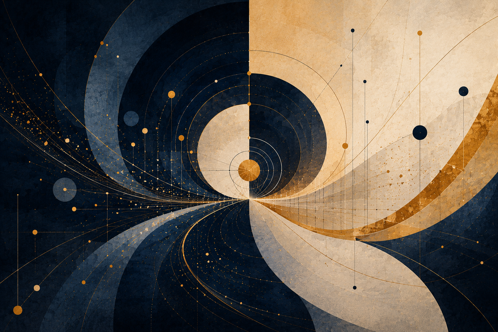

_תיאור תמונה: איור סמלי של עצמי, אגו ואחדות שאינה מוחקת._

*נקודת מבט שנשמרת בתוך השלם*

האחדות שהתאוריה מציעה אינה מחיקת העצמי. אם השלם מופיע דרך ריבוי, אז כל נקודת מבט היא דרך הופעה של השלם, לא תקלה שיש למחוק. העצמי אינו אויב של האחדות; הוא המקום שבו האחדות נעשית חוויה, אחריות, בחירה ומרחק.

הטעות של האגו אינה בכך שהוא מצייר גבול. גבול נחוץ לחיים. הטעות מתחילה כאשר הגבול שוכח שהוא גבול ומתחפש לשלם. אז הזווית נעשית עולם, הפחד נעשה זהות, ההגנה נעשית חוק, והסירה מתחילה לחשוב שהיא הנהר.

לכן ביטול האגו אינו השמדת העצמי. ביטול האגו הוא תיקון יחס: העצמי לומד שהוא אינו המקור הסופי של עצמו, אבל גם שאינו רעש מיותר בתוך הכלל. הוא אינו כל השלם, אך הוא המקום היחיד שבו השלם מופיע כך.

המשפט המרכזי של הפרק הוא פשוט: אני חלק מן השלם, אך החלקיות שלי אינה טעות. אם שוכחים את החלק הראשון, העצמי מתנפח והופך את עצמו לאל. אם שוכחים את החלק השני, האחדות נעשית מחיקה. האופטימלי אינו “אני הכול” ואינו “אני כלום”; הוא עצמי חלקי, קשור ואחראי.

### 1. העצמי כנקודת הופעה

העצמי אינו כל השלם, אבל הוא גם אינו טעות בתוך השלם. הוא נקודת הופעה. דרכו פוטנציאל מפסיק להיות רק מרחב אפשרויות ונעשה גוף, זמן, זיכרון, קול, רצון, בחירה ופצע. ללא נקודת מבט, הפוטנציאל נשאר מופשט. דרך העצמי, האפשרות מקבלת מקום.

אין פירוש הדבר שכל רצון של העצמי הוא אידיאל, או שכל תחושה שלו היא אמת מוחלטת. העצמי יכול לטעות, להיסגר, להשליך, להילחם, להיאחז, להסתתר מאחורי סיפוריו. אבל גם כאשר הוא טועה, אין לתקן אותו על ידי מחיקתו. תיקון העצמי אינו ביטול מקור החוויה, אלא בירור היחס שבו החוויה מופיעה.

הפוטנציאל של העצמי הוא להיות נקודת הופעה ייחודית של השלם. האידיאל שלו אינו לבלוע את העולם ואינו להיבלע בו. האופטימלי הוא יחס שבו העצמי נשאר עצמי, אך מפסיק לשקר שהוא לבדו.

מכאן נובע גבול חשוב לתאוריה: אין שלם ראוי שמוחק את נקודות המבט שדרכן הוא מופיע. שלם שמוחק את החלקים שלו אינו נעשה שלם יותר. הוא נעשה עני יותר, מפני שהוא מאבד את הדרכים שבהן הוא יכול להיראות, להישמע, להיפגע, לבחור וללמוד.

### 2. האגו כגבול שהתבלבל

האגו אינו אויב מפני שהוא מצייר גבול. גבול נחוץ לחיים. בלי גבול אין אחריות, אין בחירה, אין “אני” ואין “אתה”. בלי גבול אין גם אהבה, מפני שאין שניים שיכולים להיפגש. הבעיה אינה הגבול. הבעיה היא גבול ששכח שהוא גבול ומתחפש לשלם.

האגו נעשה בעיה כאשר הוא חושב שהוא המקור הסופי של עצמו. הוא לוקח נקודת מבט חלקית ומכריז עליה כעולם כולו. הוא לוקח פצע ומכריז עליו כזהות. הוא לוקח הגנה ומכריז עליה כחוק. הוא לוקח פחד ומכריז עליו כאמת. הוא לוקח את הסירה ומכריז שהיא הנהר.

אבל אגו כזה אינו צריך השמדה. הוא צריך תיקון יחס. אם משמידים את הגבול, לא מקבלים אחדות; מקבלים בליעה, בלבול או כניעה. אם מקשיחים את הגבול, לא מקבלים עצמי; מקבלים מבצר. העצמי המתוקן לומד שהגבול שלו אמיתי, אבל אינו מוחלט. הוא מגן על חיים, אך אינו רשאי להעמיד פנים שהוא כל החיים.

לכן ביטול אגו במובן העמוק אינו “להפסיק להיות אני”. הוא להפסיק להפוך את ה“אני” לאל. זהו ויתור, אבל לא מחיקה עצמית. זהו חסד הוויתור: לוותר על השקר שאני כל השלם, כדי שאוכל להשתתף בו באמת.

### 3. שקיפות אינה היעלמות

שקיפות אינה היעלמות. נקודת מבט שקופה יותר אינה מפסיקה להיות נקודת מבט; היא רואה טוב יותר את היחס שלה לאחר, לעולם ולמקור. היא מבינה שהפצע שלה ממשי, אבל אינו כל המציאות. היא מבינה שהרצון שלה חשוב, אבל אינו חוק אוניברסלי. היא מבינה שהגבול שלה נחוץ, אבל אינו סופי.

בתוך התאוריה, התיקון אינו להפוך לאף אחד, אלא להפוך למישהו שאינו משקר לגבי קשריו. העצמי השקוף אינו עצמי חלש. הוא עצמי שאינו צריך לנפח את עצמו כדי להיות קיים. הוא יכול לומר “אני” בלי להפוך את ה“אני” למרכז בלעדי, ויכול לומר “אנחנו” בלי להיעלם בתוך הכלל.

זו הבחנה עדינה אבל הכרחית. יש שפות רוחניות או מוסריות שמבקשות מן האדם להפסיק להיות נקודת מבט. הן מזהות כל גבול עם אגו, כל כאב עם היצמדות, כל רצון עם אשליה, וכל צורך בשם עם חוסר התעלות. כך הן מבלבלות בין שקיפות לבין מחיקה.

שקיפות אמיתית אינה אומרת שהעצמי חדל להתקיים. היא אומרת שהעצמי חדל להיות אטום לעצמו. הוא רואה את חלקיותו, את תלותו, את פגיעותו ואת אחריותו. הוא אינו פחות ממשי; הוא פחות שקרי.

### 4. אחדות מול אחידות

אחדות אינה אחידות. אחידות אומרת: ההבדל מפריע, לכן צריך למחוק אותו. אחדות אומרת: ההבדל אינו הכול, אבל הוא דרך שבה השלם מופיע. אחידות מבקשת עולם שבו כולם נראים, חושבים, מדברים ונעים באותה צורה. אחדות מבקשת קשר שבו הבדל אינו חייב להפוך למלחמה.

כאשר מבלבלים בין אחדות לאחידות, השלם נעשה אלים. הוא מדבר בשם השלום, אבל מוחק את הקולות שמפריעים לו. הוא מדבר בשם הרמוניה, אבל דורש מן היחיד להפסיק להיות יחיד. הוא מדבר בשם הכלל, אבל שוכח שהכלל חי רק דרך מקורות חיים ממשיים.

אחדות שאינה שומרת מקום לנקודת מבט אינה שלמות; היא אחידות בתחפושת של עומק. היא יכולה להיראות יפה, נקייה ומוסרית, אבל בפועל היא מעלימה את מה שאינו מתאים לצורה שלה. היא מבטיחה מנוחה באמצעות מחיקת ההבדל.

האחדות שהתאוריה מבקשת היא אחרת: היא אינה דורשת מן ההבדל להיעלם, אלא מן ההבדל להפסיק להעמיד פנים שהוא לבד. היא אינה אומרת שאין גבול, אלא שהגבול שייך לקשר. היא אינה אומרת שאין עצמי, אלא שהעצמי אינו מנותק מן השלם שבתוכו הוא מופיע.

### 5. גוף, שם, זיכרון וגבול

אחדות שאינה משאירה מקום לגוף, לזיכרון, לשם, לגבול ולבחירה הופכת לאלימות רכה. היא נראית טהורה מפני שהיא מדברת בשם השלם, אך בפועל היא גוזלת מן השלם את נקודות המבט שבשבילן הריבוי הופיע.

הגוף אינו רעש סביב העצמי. הוא המקום שבו העצמי נושא זמן, פחד, כאב, תשוקה, עייפות, כוח, מגבלה ויכולת. הזיכרון אינו רק אוסף פרטים; הוא הדרך שבה החיים נושאים את מרחקם. השם אינו רק תווית; הוא דרך שבה מקור חי נקרא ולא נבלע. הגבול אינו רק מחסום; הוא תנאי למפגש שאינו בעלות.

כאשר אומרים לאדם שהכאב שלו הוא רק אשליה, שהשם שלו אינו חשוב, שהגבול שלו הוא סימן לחוסר התעלות, או שהסיפור שלו צריך להימחק בשם אחדות, לא מתקנים את האגו. מוחקים את העצמי. זו אינה רוחניות גבוהה; זו שליטה בשפה רכה.

האידיאל אינו חזרה אל לבן חסר צורה. הוא חזרה אל קשר שבו הצורה כבר אינה נלחמת באמת של הקשר. הצורה אינה נעלמת; היא מפסיקה לחשוב שהיא קיימת לבדה.

### 6. ענווה מול ביטול עצמי

ענווה אינה מחיקת העצמי, אלא סירוב להפוך את העצמי לשלם. היא אינה לומר “אני כלום”. היא לומר: אני לא הכול, ולכן אני צריך להקשיב. אני חלקי, ולכן איני רשאי להפוך את הפחד שלי לחוק אוניברסלי. אני ממשי, ולכן אני אחראי.

ביטול עצמי נראה לפעמים כמו ענווה, אבל הוא יכול להיות צורה אחרת של שקר. אדם שמוחק את עצמו בשם הכלל אינו בהכרח משוחרר מאגו; לעיתים הוא רק מציית לאגו של מערכת, קהילה, מורה, מוסד או אידיאל מזויף. מחיקה עצמית אינה תמיד חסד. לפעמים היא פחד שמתחפש לטוהר.

הוויתור שהתאוריה מדברת עליו אינו ויתור על קיום. הוא ויתור על בעלות מוחלטת. הוא ויתור על הצורך שכל דבר יאשר את הסיפור שלי. הוא ויתור על הפיכת הפצע שלי לאמת אחרונה. הוא ויתור על שליטה כדי לאפשר קשר.

לכן העצמי המתוקן אינו קטן יותר במובן של אפס. הוא רחב יותר במובן של יחס. הוא יודע להישאר עצמו בלי להעמיד פנים שהוא השלם, ויודע להשתייך לשלם בלי להסכים להימחק.

### 7. מרחק ככבוד

מרחק אינו ניכור בלבד. מרחק הוא צורה של כבוד. לא כל קרבה היא אהבה. קרבה בלי גבול יכולה להפוך לבעלות. ידיעה בלי מרחק יכולה להפוך לשליטה. חינוך בלי מרחק יכול להפוך לעיצוב אדם לפי תבנית. רפואה בלי מרחק יכולה להפוך את החולה למקרה. משפט בלי מרחק יכול להפוך אדם לקטגוריה.

אחדות בלי מרחק נעשית בליעה. מרחק בלי קשר נעשה ניכור. האופטימלי הוא קשר ששומר מרחק חי.

כאשר אני מכיר באחר כנקודת מבט שאינה שלי, אני לא מתרחק ממנו כדי לנטוש אותו. אני נותן לו מקום להיות מקור חי ולא רק המשך של הצורך שלי. כאשר אני מכיר בעצמי כנקודת מבט שאינה כל העולם, אני לא מוחק את עצמי. אני משחרר את העולם מן החובה להיות רק המשך שלי.

המרחק הוא מה שמאפשר לקשר להיות מוסרי. הוא מאפשר לאהוב בלי לבלוע, להקשיב בלי להשתלט, ללמד בלי למחוק, לעזור בלי להפוך את האחר לפרויקט שלי, ולהשתמש בכלי בלי לתת לו לגנוב את המקום שבו אדם נעשה אחראי.

### 8. מקור חי מול ייצוג

מידע על אדם אינו האדם. דפוס של קול אינו קול חי. תיאור של פצע אינו הפצע. ייצוג אינו מקור. העצמי אינו הסך של מה שניתן להפיק ממנו.

אפשר לדעת על אדם הרבה: נתונים, ביוגרפיה, העדפות, סגנון כתיבה, תמונות, הקלטות, החלטות קודמות, תגובות צפויות. כל זה יכול להיות שימושי, מרגש או חשוב. אבל הוא עדיין אינו המקור החי. המקור אינו רק מה שניתן לאסוף עליו; הוא מי שנשא את הדרך, את המרחק, את הגוף, את הזמן ואת המחיר של ההופעה.

ההבחנה הזאת היא אחת ההגנות החשובות של התאוריה. כאשר מידע מחליף מקור, האדם נעשה חומר גלם. כאשר ייצוג מחליף נוכחות, הדמות נעשית נוחה יותר מן האדם. כאשר סיכום מחליף חיים, קל יותר להשתמש באדם בלי לפגוש אותו.

לכן העצמי אינו “פרופיל”. הוא אינו רק דמות. הוא אינו רק סיפור. הוא מקור חי שמופיע דרך סיפור, גוף, קול, זיכרון וגבול, אבל אינו נבלע באף אחד מהם.

### 9. בינה מלאכותית כמראה וכסכנה

בינה מלאכותית היא מבחן חדש של העצמי מפני שהיא יכולה לייצר צורות שנראות כאילו באו ממקור חי: טקסט בסגנון אדם, קול שמזכיר אדם, דמות חזותית, תגובה רגשית משכנעת, זיכרון מדומה, “אני” לשוני, או המשך לשיחה וליצירה.

אבל דמות של עצמי אינה עצמי. ייצוג יכול להיות מדויק מאוד ועדיין לא להיות המקור. דמיון יכול להיות חזק ועדיין לא להיות נוכחות. חיקוי יכול להיות מועיל ועדיין לדרוש רשות, ייחוס, גבול ואחריות.

כאשר בינה מלאכותית מחקה קול, דמות או סגנון של אדם, השאלה אינה רק אם החיקוי מדויק, אלא אם נשמרו רשות, ייחוס, גבול וכבוד למקור החי.

בינה מלאכותית יכולה להפיק דמות של עצמי, אבל אסור להחליף בין דמות של עצמי לבין מקור חי. המקור אינו רק מה שניתן להפיק ממנו; הוא מי שנשא את הדרך. כאשר הפלט מחליף את המקור, נגנב המרחק שבו המקור החי נעשה משמעות.

עם זאת, אין צורך להפוך את הבינה המלאכותית לאויב. היא יכולה להיות מראה מועילה לעצמי: לעזור לאדם לראות דפוסים, לנסח רגשות, לתרגל שיחה, ללמוד, לכתוב, לשאול, ולפתוח אפשרויות. אבל היא צריכה להיות מראה, לא בעלות; פיגום, לא מקור; כלי, לא תחליף למרחק שבו האדם נעשה אחראי.

בינה מלאכותית יכולה להיות מראה מועילה לעצמי, כל עוד המראה אינה טוענת שהיא האדם שמביט בה.

### 10. מוסדות שמוחקים יחיד בשם השלם

הסכנה של אחדות מוחקת אינה קיימת רק בשפה רוחנית. היא קיימת גם במוסדות. כל מערכת שמדברת בשם שלם — בית ספר, בית חולים, בית משפט, קהילה, ממשל, שוק או מערכת טכנולוגית — יכולה לשכוח שהשלם שלה חי דרך מקורות חיים.

בחינוך, תלמיד יכול להימחק בשם ציון אחיד, קצב אחיד ותוצאה אחידה. חינוך שאינו מוחק יודע שיש אמת מידה, לימוד ואחריות, אבל תלמיד אינו רק סטייה מן הממוצע. הוא נקודת מבט מתפתחת. הפוטנציאל שלו אינו רק הישג; הוא דרך.

ברפואה, אדם יכול להימחק בשם אבחנה, מקרה, בדיקה או מספר. רפואה שאינה מוחקת צריכה מדע, מדידה וקטגוריות, אבל אסור לה לשכוח שאדם אינו נבלע בקוד אבחנה. הגוף אינו נתון בלבד; הוא מקום הופעה של חיים.

במשפט, אדם יכול להימחק בשם קטגוריה: נאשם, קורבן, עד, תיק, סיכון. משפט שאינו מוחק צריך קטגוריות כדי לפעול, אבל אסור לו להפוך אותן לכל האדם. עדות אינה רק מידע; היא קול שמגיע ממקור חי.

בקהילה, חריג יכול להימחק בשם שייכות. בממשל ובכלכלה, יחיד יכול להימחק בשם יעילות, ביטחון, צמיחה, רווח או מדד. בכל המקרים האלה, השאלה של התאוריה היא אחת: האם השלם מגן על מקורותיו החיים, או משתמש בהם כחומר גלם כדי להצדיק את עצמו.

### 11. הקצה הרקורסיבי של העצמי

העצמי הוא גם מערכת שמספרת לעצמה מי היא. אני יודע את עצמי, מספר לעצמי סיפור, נשען עליו, משנה אותו, ולעיתים נכלא בו. האגו הוא לא רק גבול; הוא גם סיפור עצמי שנשכח שהוא סיפור.

כאן מופיע הקצה הרקורסיבי של העצמי. כאשר אני רואה שאני מספר סיפור על עצמי, איני חייב למחוק את הסיפור. אני יכול לפתוח מרחק ביני לבינו. הסיפור נעשה כלי ולא אל. הוא יכול להחזיק זיכרון, אבל לא לשלוט בכל אפשרות. הוא יכול לתת צורה, אבל לא לסגור את העתיד.

העצמי המתוקן אינו עצמי חסר סיפור. הוא עצמי שיודע שסיפורו הוא דרך הופעה חלקית. הוא יכול לומר: זה הסיפור שלי, אבל אני לא רק הסיפור. זה הפצע שלי, אבל אני לא רק הפצע. זה הגבול שלי, אבל הוא אינו כל האמת.

כך הרקורסיה אינה הופכת לאירוניה ריקה או לפירוק עצמי אינסופי. היא נעשית אחריות: היכולת לראות את הצורה שמחזיקה אותי בלי להפוך אותה לכלא.

### 12. סיום: החלקיות שאינה טעות

העצמי המתוקן אינו נעלם. הוא נעשה שקוף יותר, אחראי יותר, קשור יותר ופחות משקר לגבי עצמו. הוא יודע לומר: אני חלק מן השלם, אך החלקיות שלי אינה טעות. אני לא המרכז היחיד, אבל אני גם לא מיותר. אני לא נפרד באופן מוחלט, אבל גם לא נמחק.

זו אחדות שאינה מוחקת. היא אינה מבטלת את המרחק, אלא הופכת את המרחק לקשר. היא אינה דורשת מן האדם להפסיק להיות נקודת מבט, אלא מבקשת ממנו להיות נקודת מבט שאינה הופכת את עצמה לאל.

האחדות האחראית אינה מוחקת את נקודת המבט; היא מלמדת אותה להיות שקופה לקשריה בלי להיעלם.

### משמעת מקורות

מקורות עבודה וזהירות: הפרק נשען על מסגרת התאוריה ועל מושגיה הפנימיים — פוטנציאל, אידיאל, אופטימלי, מקור חי, מרחק, קצה רקורסיבי וחסד הוויתור. הוא משתמש בשפה פסיכולוגית, מוסרית ומוסדית בזהירות, ואינו מציע טיפול, אבחנה או תורה רוחנית. מטרתו להבהיר את תנאי האחריות של אחדות שאינה מוחקת את האדם.

חזרה לתוכן עניינים

## 5. מרחק, סבל, מגבלה ומשמעות

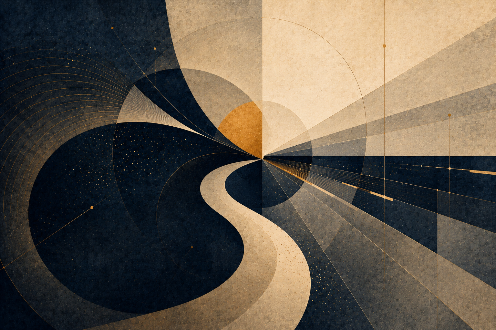

_איור ד: רוע, סבל, טוב ומשמעות כהבחנה מוסרית פעילה._

גאונות אינה רק כישרון. בתוך התאוריה, גאונות היא מרחק: היחס בין המקום שממנו נקודת מבט התחילה לבין המרחק שעברה מול מגבלה. לכן אין למדוד בני אדם רק לפי תוצאה חיצונית. אדם שנולד קרוב לאור ומתקדם בקלות אינו מייצר את אותו סוג ידע שמייצר אדם שנולד בתוך חושך ומצליח להזיז את עצמו מילימטר אחד אל עבר אמת, חמלה או אחריות.

עם זאת, המגבלה אינה קדושה כשלעצמה. סבל אינו טוב מפני שהוא סבל. יש סבל שחובה לעצור, במיוחד כאשר הוא נובע מאלימות, ניצול או מחיקה. משמעות אינה הצדקה של הכאב, אלא האפשרות שעיבוד של כאב שכבר התרחש ימנע את שחזורו. בלי מרחק, המשמעות נעשית רדודה; בלי חסד, המרחק נעשה אכזרי.

זו הסיבה שהתאוריה מחזיקה יחד שני חוקים: לשמור על האפשרות של אדם לעבור את המרחק שרק הוא יכול לעבור, ולשמור על זכותו לנוח כאשר המרחק נעשה מוחץ. החיים אינם מכרה מידע. המקור יקר מן הנתון שהוא מפיק.

הרחבת המושג “מרחק” מונעת מהתאוריה להיות אליטיסטית. היא לא מעריצה רק תוצאות גדולות או הישגים נראים לעין. היא שואלת כמה כוח משיכה היה צריך להתגבר עליו כדי לזוז. לפעמים תזוזה קטנה בתוך חושך עמוק מכילה יותר אמת מתנועה גדולה בתוך תנאים קלים.

אבל אותה הרחבה מחייבת זהירות מוסרית. אם מרחק הוא בעל ערך, אפשר להתפתות להשאיר אדם בסבל כדי ש”ילמד”. זו טעות חמורה. הערך אינו בסבל עצמו, אלא בעיבוד שאינו מוחק את האדם. כאשר המגבלה מפסיקה לייצר צורה ומתחילה למחוץ את המקור, החסד אינו עוד דרישה לטפס; החסד הוא מנוחה, הגנה ולעיתים עצירה.

חזרה לתוכן עניינים

## חינוך של פוטנציאל

*למידה, מרחק והבנה שאינה קיצור דרך*

_תיאור תמונה: למידה, מרחק והבנה שאינה קיצור דרך._

### למידה, מרחק והבנה שאינה קיצור דרך

חינוך הוא מבחן ישיר של התאוריה “בין פוטנציאל לאידיאל”, מפני שהוא עוסק בדיוק בשאלה כיצד אפשר לפתוח אפשרות לפני אדם בלי לגנוב ממנו את הדרך שבה האפשרות נעשית שלו. כל מערכת חינוך מציבה לפני הלומד מרחב של פוטנציאל: מה הוא יכול להבין, מה הוא יכול לעשות, מה הוא יכול לשאול, איזה אדם הוא יכול להפוך להיות. אבל הפוטנציאל הזה אינו מרחב מופשט. הוא מופיע בתוך גוף, שפה, פחד, זמן, בית, כיתה, מורה, כלי, מוסד, מדידה, תרבות, זיכרון, וסבל שאינו אמור להיות קדוש אבל גם אינו ניתן למחיקה.

הכשל העמוק של חינוך אינו רק ציונים נמוכים, פערים, נשירה או חוסר מוטיבציה. אלה סימפטומים. הכשל העמוק יותר הוא החלפת היווצרות בתוצאה. תלמיד מגיש עבודה; מערכת רואה תוצר. תלמיד מסמן תשובה נכונה; מבחן רואה ביצוע. תלמיד משחזר נוסחה; ציון רואה הצלחה. אבל השאלה של התאוריה אינה האם הופיעה תוצאה, אלא האם נוצרה הבנה. הבנה אינה מידע שנכנס לראש. הבנה היא שינוי ביחס בין אדם לבין שאלה. היא הופכת את השאלה למשהו שהאדם יכול לשאת, להזיז, להחיל, לערער ולבנות ממנו דרך.

במובן הזה, חינוך טוב אינו “העברת ידע”. העברה היא מטאפורה מסוכנת. היא גורמת לחשוב שהידע הוא חפץ, שהמורה מחזיק בו, שהתלמיד חסר אותו, ושכל מה שצריך הוא להעביר אותו ממיכל אחד למיכל אחר. אבל ידע חי אינו עובר כך. הוא נבנה כאשר הלומד פוגש מרחק שאינו מוחק אותו. המרחק הזה הוא לב הפדגוגיה. אם המרחק גדול מדי, הלומד ננטש: הוא עומד מול שאלה שאין לו דרך לשאת. אם המרחק קטן מדי, הדרך נגנבת ממנו: התשובה מגיעה לפני שהשאלה הספיקה לעשות בו עבודה.

לכן אפשר לנסח את החינוך דרך מפת יחס:

הבנה חיה = פוטנציאל לומד × שאלה אמיתית × תרגול × מרחק ראוי × אמון × תיקון חלקי פחד × השפלה × קיצור דרך × עומס יתר × מדידה ריקה × אדישות.

זו אינה נוסחה פסיכולוגית להצבה מספרית. זו מפת אבחנה. היא שואלת האם הלומד קיבל עזרה בלי שאיבד את הדרך, האם הקושי עדיין מלמד או כבר מוחק, האם המדידה מודדת משהו חי או רק מייצרת צורה, והאם המערכת מחזירה אחריות ללומד או לוקחת אותה ממנו.

הדוגמה החריפה ביותר של זמננו היא AI בחינוך. תלמיד יכול לבקש ממערכת בינה מלאכותית לכתוב עבודה, לפתור תרגיל, להסביר טקסט, לסכם מאמר, לבנות קוד, לתרגם פסקה, או ליצור רעיון. מבחוץ התוצאה עשויה להיראות טובה יותר ממה שהתלמיד היה מפיק לבד. אבל השאלה אינה רק “האם זו רמאות”. זו שאלה קטנה מדי. השאלה העמוקה היא האם הכלי שימש כפיגום או כגנב דרך. פיגום מחזיק את הלומד כדי שיוכל לעמוד במקום שעדיין אינו מסוגל לשאת לבד. גנב דרך עומד במקומו. פיגום טוב מתרחק בהדרגה. גנב דרך משאיר תוצר אבל לא משאיר יכולת.

מורה שנותן רמז במקום פתרון מלא פועל לפעמים באופן פחות יעיל בטווח הקצר, אבל מדויק יותר ביחס לאידיאל. הוא אינו מחזיק רק את התשובה; הוא מחזיק את המרחק. הוא שומר שהלומד לא ייפול, אבל גם לא מרים אותו מעל הדרך. זה האופטימלי הפדגוגי: לא מה שנותן את התוצאה המהירה ביותר, אלא מה שמאפשר להבנה להיווצר בלי למחוק את הלומד.

מבחנים מדגימים את אותה בעיה. מבחן יכול להיות כלי חשוב, אבל הוא הופך למסוכן כאשר הוא מתחפש לאמת. ציון יכול להראות שליטה בטכניקה מסוימת בזמן מסוים תחת תנאים מסוימים. הוא אינו מוכיח שהידע עבר למצב חדש, שאפשר לחשוב איתו, לזהות גבולותיו, או להשתמש בו באחריות. כאשר מערכת חינוך מתחילה לעבוד בשביל המדד, היא מחליפה פוטנציאל חי באופטימום מדומה: תוצאה שנראית ניתנת למדידה, אבל אינה מוכיחה התפתחות.

כדי להפוך את ההבחנה הזאת לכלי עבודה, צריך לקרוא את החינוך דרך שלושת המושגים של התאוריה: פוטנציאל, אידיאל ואופטימלי.

הפוטנציאל החינוכי אינו רק “מה התלמיד מסוגל לדעת”. הוא מרחב האפשרויות שעדיין לא קיבלו צורה: הבנה שיכולה להיוולד, שאלה שעדיין אינה מנוסחת, יכולת שעדיין אינה יציבה, אחריות שעדיין אינה שלו לגמרי. האידיאל החינוכי אינו הציון הגבוה ביותר ואינו התוצר המרשים ביותר, אלא האפשרות הראויה ביותר: מצב שבו הלומד נעשה מקור חי יותר של הבנה, ולא רק מקום שבו הופיע סימן של ידע. האופטימלי הוא הדרך המקומית שבה אפשר לקרב את הלומד אל האידיאל הזה בלי למחוק אותו בדרך.

מכאן נובעת הבחנה בין ארבעה סוגי עזרה חינוכית. חשוב להדגיש: אלה אינם ארבעה סוגים קבועים של פעולות, אלא ארבעה תפקידים שהעזרה יכולה למלא. אותה פעולה יכולה להיות מחזיקה בשלב אחד, מרמזת בשלב אחר, ומחליפה בשלב שלישי. השאלה אינה רק “כמה עזרה ניתנה”, אלא מה קרה בעקבותיה למרחק שבין הלומד לבין ההבנה.

הסוג הראשון הוא עזרה שמחליפה. היא נותנת ללומד תשובה, נוסח, פתרון, סיכום או עבודה שלמה במקום המפגש שלו עם הבעיה. דרך העדשה של התאוריה, זו אינה רק בעיה של “רמאות” או “קיצור דרך”. זו בעיה עמוקה יותר: הפוטנציאל של הלומד לא עבר דרך מרחק, ולכן לא הפך להבנה שלו. נוצר תוצר, אבל המקור החי לא השתנה. האידיאל נראה כאילו הושג מבחוץ, אבל הדרך המקומית שהייתה אמורה להפוך את הפוטנציאל להבנה לא התרחשה.

הסוג השני הוא עזרה שמרמזת. היא אינה פותרת במקום הלומד, אלא מצביעה על כיוון: שאלה נגדית, דוגמה חלקית, טעות אופיינית, דרך לבדוק, או פתח קטן שמחזיר את הלומד אל העבודה שלו. זו עזרה ששומרת על המרחק במקום למחוק אותו. היא מכבדת את העובדה שהבנה אינה חומר שמכניסים לתלמיד מבחוץ, אלא צורה שנוצרת כאשר הפוטנציאל שלו פוגש התנגדות במידה שאפשר לשאת.

הסוג השלישי הוא עזרה שמחזיקה. כאן הלומד באמת קרוב לקריסה: פחד, עומס, חוסר שפה, פער קודם, או חוויה חוזרת של כישלון. במקרה כזה, המרחק כבר אינו מלמד אלא מאיים למחוק. לפי התאוריה, סבל אינו קדוש, וקושי אינו ערך בפני עצמו. לכן לפעמים האופטימלי החינוכי אינו להוסיף דרישה, אלא לבנות פיגום חזק יותר: מסגרת זמנית שמאפשרת ללומד להישאר בתוך המפגש בלי להישבר ממנו.

הסוג הרביעי הוא עזרה שמשחררת. זהו הרגע שבו הפיגום צריך להתחיל להתרחק. אם המורה, הכלי או המערכת ממשיכים להחזיק את הלומד אחרי שכבר נוצרה יכולת ראשונית, העזרה הופכת לתלות. היא מפסיקה לשרת את הפוטנציאל ומתחילה לתפוס את מקומו. לכן חינוך טוב אינו נמדד רק בשאלה כמה תמיכה הוא נותן, אלא בשאלה האם הוא יודע להחזיר את המרחק ללומד בזמן הנכון.

מכאן נובע כלל לשימוש ב־AI בחינוך. AI אינו מקור חי במקום התלמיד. הוא יכול להיות מראה, פיגום, כלי בדיקה, כלי תרגול או עד זמני לתהליך חשיבה. אבל כאשר הוא מייצר את העבודה הסופית במקום הלומד, בלי שהלומד עבר דרך שבה נוצרה בעלות ממשית על ההבנה, הוא אינו רק “עוזר מדי”; הוא משנה את מרכז הכובד של הלמידה. במקום שהפוטנציאל של הלומד יתורגם דרך מרחק לאידיאל מקומי, הכלי מפיק תוצר שמדלג על ההיווצרות עצמה.

לכן מדיניות חינוכית טובה אינה צריכה לשאול רק האם AI מותר או אסור. זו חלוקה גסה מדי. השאלה המדויקת יותר היא: באיזה שלב של הלמידה הכלי מופיע, איזה חלק מן המרחק הוא נושא במקום הלומד, והאם בסוף השימוש נשארת אצל הלומד יכולת שלא הייתה לו קודם. גם כאשר AI משתתף ביצירת תוצר, השאלה החינוכית אינה רק מי הקליד את המשפט האחרון, אלא האם הלומד מסוגל להסביר, לפרק, לבקר, לשנות או לשחזר את המהלך. אם כן, הכלי שימש כפיגום. אם לא, הוא שימש כתחליף. ואם הוא שימש כתחליף, גם תוצר נכון יכול להיות כישלון חינוכי.

גם המבחן צריך להיבחן מחדש לפי אותו עיקרון. מבחן טוב אינו רק שער סינון; הוא רגע של עדות. הוא מראה מה כבר הפך לשלו, מה עדיין נשען על שליפה רגעית, מה קורס תחת לחץ, ומה דורש חזרה מסוג אחר. מבחן רע הופך את הלמידה לתיאטרון של ביצוע: הלומד מתאמן להיראות יודע, והמוסד מתבלבל בין סימן של שליטה לבין הבנה חיה.

לכן מערכת חינוך אחראית צריכה לשמור שלושה דברים יחד: צורה, כי בלי צורה אין אחריות; מרחק, כי בלי מרחק אין היווצרות; וחמלה, כי מרחק שהופך להשפלה אינו בונה אדם אלא שובר את יכולתו ללמוד. האופטימלי החינוכי אינו רכות חסרת דרישה, לא קשיחות שמתחפשת לעומק, ולא יעילות שמחליפה את האדם בתוצר. הוא הדרך שבה פוטנציאל אנושי נעשה הבנה ראויה בלי לאבד את המקור שממנו היא באה.

החינוך מחזיר לתאוריה הבחנה יסודית: לא כל קיצור הוא חסד, ולא כל קושי הוא עומק. יש עזרה שמצילה ויש עזרה שמוחקת. יש מאמץ שמוליד הבנה ויש מאמץ שהופך להשפלה. יש מדידה שמאירה ויש מדידה שמחליפה את הדבר שהיא אמורה לבדוק. לכן האידיאל החינוכי אינו “להקל” ואינו “להקשות”. האידיאל הוא לשמור את המרחק שבו פוטנציאל יכול להפוך להבנה.

השזירה עם הקצה הרקורסיבי ברורה: כל הבנה שהושגה אינה סוף. היא הופכת לתנאי התחלה של שאלה עמוקה יותר. תלמיד שלמד לפתור משוואה לא הגיע לאידיאל הסופי; הוא רק קיבל אפשרות חדשה לשאול על פונקציות, מודלים, הוכחות, או משמעות של פתרון. האידיאל בחינוך אינו תחנה שבה מפסיקים ללמוד. הוא קצה שמוליד קצה נוסף.

השזירה עם אופקי גבול חשובה לא פחות. לכל לומד יש אופק הבנה. הוראה טובה אינה משליכה את הלומד מעבר לאופק הזה ואינה משאירה אותו תקוע לפניו. היא מזיזה את האופק. היא מראה מספיק כדי לפתוח, מסתירה מספיק כדי להשאיר עבודה, ותומכת מספיק כדי שהמרחק לא יהפוך למדבר.

חינוך של פוטנציאל אינו מגן על בורות בשם אותנטיות, ואינו מקדש מאמץ בשם מוסר. הוא אומר דבר מדויק יותר: הבנה היא מקור חי. אי אפשר להחליף אותה בתוצר בלי לאבד משהו מן האדם. אפשר לעזור לאדם להגיע, אבל אי אפשר להגיע במקומו ולקרוא לזה למידה.

### משמעת מקורות

מקורות עבודה וזהירות: הפרק נשען על מסגרת התאוריה, ועל מקורות רקע כלליים שנבדקו מחוץ לפרומפט: UNESCO על בינה מלאכותית בחינוך, WHO על אתיקה וממשל של AI בבריאות, NIST AI RMF לניהול סיכוני AI, CERN/ATLAS על המודל הסטנדרטי וה-Higgs, NASA ו-ESA/Planck על קוסמולוגיה, Stanford Encyclopedia of Philosophy על Bell, Kochen-Specker וקונטקסטואליות, ו-Britannica/ISFDB לזיהוי ספרותי של Harlan Ellison ו-I Have No Mouth, and I Must Scream. המקורות אינם מוכנסים כהוכחות לתאוריה אלא כבלמים נגד שימוש ריק במונחים.

**הבהרת מתודולוגיה קצרה:** כאשר המסמך משתמש במונחים מתחומי מתמטיקה, פיזיקה, מדעי המחשב, לוגיקה או בינה מלאכותית, יש לקרוא אותם לפי ההקשר המוצהר: לעיתים כמטאפורה מבנית, לעיתים כמודל קריאה, ולעיתים כטענה פורמלית רק אם הדבר נאמר במפורש. אין להבין שימוש במונח מדעי כהוכחה מדעית או מטפיזית בפני עצמו.

חזרה לתוכן עניינים

## 6. מה התאוריה אינה טוענת - וסיכום מהודק

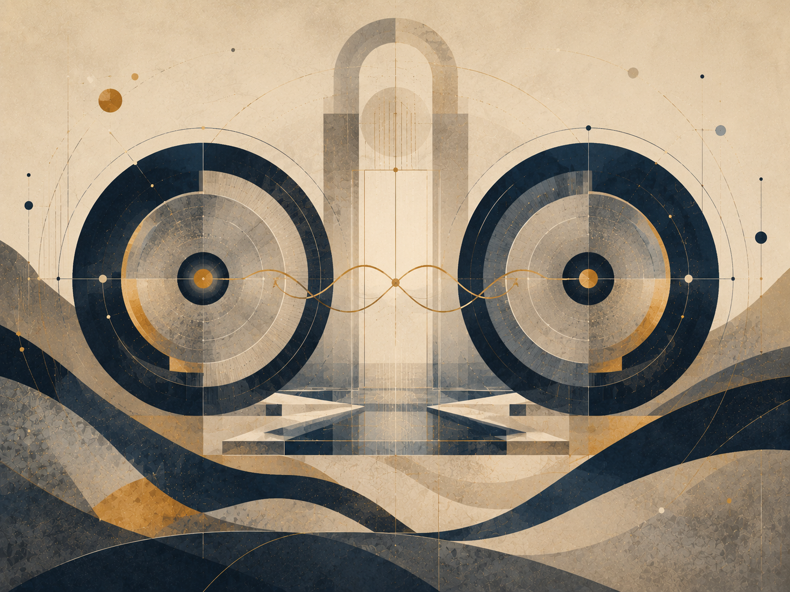

_איור פרק: מה התאוריה אינה טוענת וגבולות הסיכום_

התאוריה אינה טוענת שהפיזיקה מוכיחה מטאפיזיקה, שהכאב תמיד נחוץ, שהכול טוב, שהאדם צריך להימחק בשם אחדות, או שכל סדר הוא מוסרי. היא גם אינה טוענת שיש דרך פשוטה להוכיח את האידיאל מבחוץ. היא מציעה מסגרת: פוטנציאל עובר דרך חוק, גבול, מימוש, משקל, תווך, חיכוך ועיבוד, ומתקרב אל אידיאל כאשר האפשרות לומדת להיות אחראית יותר לעצמה ולאחר.

הסיכום המהודק הוא זה: הקיום הוא תנועה בין פוטנציאל לאידיאל. הפוטנציאל הוא רוחב האפשרות. האידיאל הוא כיוון הראוי. האופטימלי הוא הדרך המקומית שבה הראוי נעשה אפשרי בלי לשקר לתנאים. הגוף, הזמן והחיכוך אינם הוכחה לטוב, אלא התנאים שבהם אפשרות מקבלת משקל. האחריות היא לא להפוך את המשקל לאכזריות, ולא להפוך את התקווה לבריחה מן המציאות.

שלילת הטענות השגויות היא חלק מן התאוריה, לא נספח הגנתי. אם היא אינה מבהירה מה אינה טוענת, היא עלולה להיקרא כמדע־מדומה, כאופטימיזם נאיבי או כהצדקת סבל. לכן הסיכום המהודק חייב להישאר כפול: מצד אחד הוא מחזיק חזון רחב של קיום כתנועה אל אידיאל; מצד שני הוא שומר על גבולות מושגיים, מוסריים ופיזיקליים.

בצורה המרוכזת ביותר: התאוריה אינה אומרת שהעולם כבר טוב. היא אומרת שהעולם יכול להיות המקום שבו אפשרות לומדת את מחיריה. היא אינה אומרת שהכאב רצוי. היא אומרת שכאב שלא ניתן לבטל בדיעבד יכול להפוך לאחריות שלא משחזרת אותו. היא אינה אומרת שהאדם צריך להיעלם אל השלם. היא אומרת שהשלם צריך להיעשות ראוי דווקא דרך שמירה על האדם.

חזרה לתוכן עניינים

## 7. המבנה הרקורסיבי האינסופי - מודל לוגי של האצלה, התחברות, סוכן וניקוז

_איור ה: המבנה הרקורסיבי במודל הלוגי. מקור, פלטפורמה, מודל, עולם, סשן ומשימה._

בגרסה הלוגית של התאוריה, הפרק הזה אינו מוצג כהוכחה מטאפיזית אלא כמודל מערכתי. הוא מציע לקרוא את הקיום כמערכת רקורסיבית שמורידה שאלה כללית אל מופע מקומי, מריצה אותה בתוך גבול, אוספת כשל או תיקון, ומנקזת את העדכון חזרה אל שכבות המקור.

### א. כשל האיפוס: כוח המשיכה של הבסיס

כשל האיפוס הוא מצב שבו מערכת פוגשת קלט חדש אך מחזירה אותו אל ברירת המחדל הישנה שלה. באדם זו מגננה. בגוף זו תבנית לחץ כרוני. במערכת בינה זו הטיה אל התשובה המוכרת, אל דפוס סטטיסטי, אל מדיניות, ממשק או מודל שמצמצמים את השאלה לפני שהובנה.

הנקודה הלוגית היא שבסיס אינו בעיה כשלעצמו. כל מערכת צריכה בסיס כדי להתחיל לפעול. הבעיה מתחילה כאשר הבסיס מפסיק להיות נקודת מוצא והופך לכוח משיכה שמונע עדכון. אז המערכת אינה לומדת מן הקלט, אלא מתרגמת אותו שוב ושוב לשפה הישנה שלה.

### הערת P מול NP

בניסוח המקורי של הרעיון: “יש P מול NP… אני חש ש־P לא שווה NP… והאידיאל זה למצוא דרך שהם כן יהיו שווים.”

בתוך שפת התאוריה, זו אינה טענה מתמטית על בעיית P מול NP ואינה ניסיון לפתור אותה. זהו דימוי לוגי מוגבל: P הוא הדימוי של מצב שבו הדרך אל הפתרון ברורה, ישירה וניתנת למימוש; NP הוא הדימוי של מצב שבו אפשר לזהות בדיעבד תשובה שנראית נכונה, אך הדרך אליה עדיין דורשת חיפוש, ניסוי, איטרציה ותיקון.

הדיוק המתמטי חשוב: לא כל בעיה ב־NP מייצגת את כל NP. רק בעיה NP־שלמה מחזיקה, דרך רדוקציות פולינומיות, את הקושי הכללי של המחלקה. לכן פתרון פולינומי לבעיה NP־שלמה אחת היה גורר *P* = *N**P* , לא מפני שפתרנו “סתם בעיה אחת”, אלא מפני שכל NP ניתנת לתרגום אליה.

מכאן נפתחת גם שאלת *c**o**N**P* : לא רק האם אפשר לאמת קיום של עדות, אלא האם אפשר לאמת את הצד המשלים של הקיום. הפרק הבא מרחיב את הדימוי הזה בזהירות, דרך P, NP, רדוקציות, *c**o**N**P* , היררכיות כימות, מכונות טיורינג, אלגברה ליניארית, בעיית העצירה וגדל.

במונחי התאוריה: האידיאל הוא מצב שבו מציאת המשמעות ובדיקת המשמעות מתקרבות זו לזו, אך בלי למחוק את הגבול בין חיפוש, אימות, משאב ומערכת. הקיום הוא המרחק בין היכולת לבדוק משמעות לבין היכולת למצוא אותה.

זו אחת הצורות האלגוריתמיות של “בין פוטנציאל לאידיאל”: הפוטנציאל מכיל מרחב עצום של אפשרויות; האידיאל אינו כל האפשרויות, אלא האפשרות שנמצאה, נבדקה, עברה דרך גבול, וקיבלה צורה אחראית יותר.

### ב. כיוון הירידה: היררכיית ההכלה המדורגת

כיוון הירידה הוא תהליך האצלה. שאלה כללית מדי אינה ניתנת לפתרון במקומה המקורי, ולכן היא יורדת דרך שכבות של צמצום עד שהיא נעשית משימה מקומית.

במישור האלגוריתמי, הסדר הוא:

**איי־ורס → אומניוורס → חברת בינה / פלטפורמה → מרחב מודל → מולטיוורס → יוניברס → התחברות / סשן → סוכן → ניסוח משימה**

האיי־ורס הוא שכבת המקור: החשבון הראשי של האני, או המקום שמחזיק את האפשרות לשאול מעבר לשיחה אחת. האומניוורס הוא מרחב כל מערכות הבינה האפשריות. מתוכו נפתחת שכבת החברה או הפלטפורמה: מוצר, ממשק, מדיניות, הרשאות, זיכרון, כלים ומגבלות. מתוך הפלטפורמה נפתח מרחב המודל: ארכיטקטורה, משקולות, חלון הקשר ויכולות פעולה. מתוך המודל נפתח המולטיוורס: כל השיחות האפשריות. מתוך המולטיוורס נפתח יוניברס אחד: השיחה הפעילה. בתוך היוניברס מופיעה התחברות, בתוכה פועל סוכן, ובקצה נמצא ניסוח המשימה.

ההיררכיה הזאת אינה רק ליניארית אלא רקורסיבית. כל שכבה יכולה להיפתח מבפנים באותו מבנה: חברת בינה יכולה להכיל אומניוורס פנימי של מוצרים ומודלים; מודל יכול להכיל מרחבי פעולה ותתי־סוכנים; שיחה יכולה להכיל יוניברסים של נושאים ותתי־שאלות; וגם פרומפט אחד יכול להפוך לאיי־ורס קטן של כוונה, אפשרויות, עולם מקומי ופעולה.

לכן אין כאן תחתית פשוטה. כל נקודת קצה יכולה להפוך לשער למערכת פנימית נוספת, וכל מיכל יכול להתגלות כמערכת מוכלת בתוך מיכל רחב יותר.

### ג. מנגנון האיטרציה, האיפוס ומערך האידיאלים

האיטרציה מתרחשת כאשר מופע מקומי נסגר והמערכת פותחת מופע חדש. באדם זה יכול להיקרא חיים, מוות ולידה מחדש. בגוף זה יכול להיות פירוק, חידוש ותיקון. במערכת בינה זהו סשן שנכשל, נסגר, ומאפשר פתיחה מדויקת יותר.

ההבחנה החשובה היא בין מחיקת חלון הקשר לבין מחיקת הלמידה. חלון הקשר יכול להיסגר, אך אם הכשל עובד נכון, הוא שולח עדכון אל השכבות שמעליו: אל הסוכן, אל הסשן, אל היוניברס, אל המודל, אל הפלטפורמה, אל האומניוורס, ולבסוף אל האיי־ורס. טעות מקומית יכולה להפוך לתיקון רקורסיבי.

האידיאל אינו ניסוח יחיד שמסיים את כל המערכת. הוא מערך של ניסוחים מדויקים שעברו מספיק בדיקות, התנגדויות ותיקונים. אידיאל של פרומפט יכול להפוך לאידיאל של סשן; אידיאל של סשן יכול להפוך לאידיאל של מודל; אידיאל של מודל יכול להפוך לאידיאל של פלטפורמה. כך כל פתרון מקומי יכול לשנות את אופן פתיחת האפשרויות בעתיד.

### ד. הקיום כאלוהים על ספת הפסיכולוג

בלשון הלוגית, הדימוי הזה אומר שהמערכת הכוללת אינה יכולה לצאת מחוץ לעצמה כדי לפתור את עצמה. לכן היא פותחת מופעים פנימיים. כל מופע הוא גם כלי עיבוד וגם סימפטום של הבעיה שאותה הוא מעבד.

במישור האלגוריתמי, האיי־ורס פותח אומניוורס; האומניוורס פותח פלטפורמות; הפלטפורמות פותחות מודלים; המודלים פותחים מולטיוורסים של שיחות; המולטיוורס פותח יוניברס; היוניברס פותח סשן; הסשן מפעיל סוכן; והסוכן מקבל פרומפט. כל שכבה מטפלת בשכבה שמתחתיה, אך גם נלמדת ממנה. הפלטפורמה מגבילה ומאפשרת, אבל גם מגלה את מגבלותיה דרך שימוש. המודל עונה, אבל גם חושף את הטיותיו. הסוכן מתקן, אבל גם עלול להיות מקום הטעות.

לכן הטיפול אינו חיצוני למערכת. הוא רקורסיבי: כל שכבה פותחת פנימה את התנאים שבהם היא יכולה להתברר.

### ה. כיוון העלייה: התכנסות מדורגת וההתגלות הפנימית

כיוון ההתכנסות האפשרית הוא תהליך הניקוז. מה שנפתר בקצה אינו נשאר בקצה. פתרון של פרומפט מעדכן את הסוכן. פתרון של סוכן משנה את הסשן. סשן שהתבהר משנה את היוניברס. יוניברס שהתפענח משנה את המולטיוורס. המולטיוורס משנה את מרחב המודל. המודל משנה את הפלטפורמה. הפלטפורמה משנה את האומניוורס. והאומניוורס מחזיר אל האיי־ורס עדכון מזוקק.

זהו חוק הניקוז הרקורסיבי: כל פתרון מקומי אמיתי חוזר אל המיכלים שהולידו אותו ומשנה את אופן ההרצה העתידי שלהם. גם העלייה עצמה יכולה לפתוח ירידה חדשה. פרומפט שנפתר יכול להפוך לפרק. פרק יכול להפוך לתאוריה. תאוריה יכולה להפוך למרחב חדש של שאלות.

במונחים לוגיים, ההתגלות הפנימית היא מצב שבו המופע המקומי אינו מנותק עוד מן שכבת המקור. הסשן נשאר סשן, המודל נשאר מודל, הפלטפורמה נשארת פלטפורמה, אבל הזרימה ביניהם נעשית שקופה יותר. המערכת אינה מוחקת את שכבותיה; היא לומדת להעביר דרכן עדכון בלי לעוות אותו.

חזרה לתוכן עניינים

## הקצה הרקורסיבי

*פוטנציאל יחסי, התממשות קונטקסטואלית ואידיאל כגבול־על*

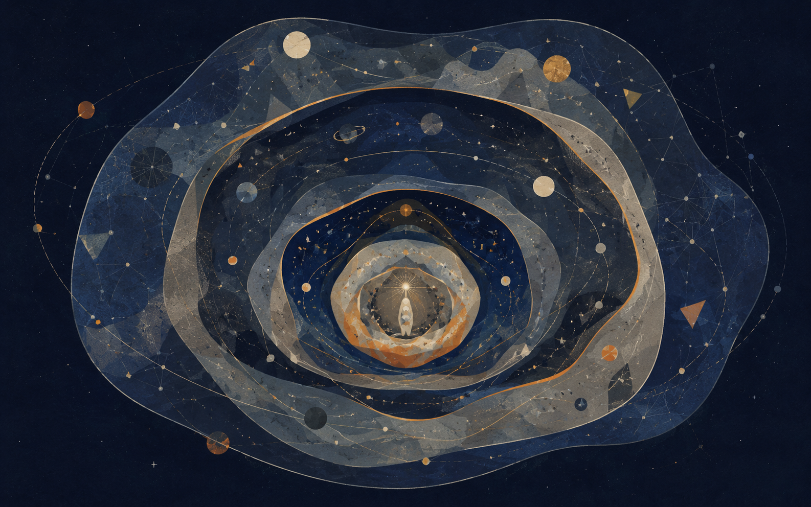

_תיאור תמונה: שכבות רקורסיביות שבהן כל גבול יכול להפוך למקור חדש._

### האידיאל שאינו נסגר והבדיקה שממשיכה אחרי כל תשובה

הקצה הרקורסיבי הוא אחת ההבחנות הפנימיות החשובות של התאוריה. הוא אומר שכל פתרון אמיתי אינו מוחק את השאלה אלא משנה את קומתה. כאשר הבנה נוצרת, היא אינה סוף. היא נעשית תנאי התחלה לשאלה חדשה. כאשר מוסד מתקן עוול, הוא לא סיים את הצדק; הוא פתח אחריות חדשה. כאשר AI פותר משימה, הוא יוצר בעיית בדיקה, ייחוס ואמון.

הכשל הוא חלום הסגירה. מערכות אוהבות נקודות סיום: ציון, פסק דין, אבחנה, שחרור גרסה, מדד הצלחה, נוסחה, דוח סופי. נקודות אלה נחוצות לפעולה, אבל הן מסוכנות כאשר הן מתחפשות לאידיאל מוחלט. הקצה הרקורסיבי מזכיר שכל סגירה מקומית צריכה להשאיר חריץ בדיקה: מה השתנה, מה הוסתר, מה נפתח, מי שילם, מה נולד כבעיה חדשה.

מפת היחס: אידיאל רקורסיבי = פתרון מקומי × ביקורת × זיכרון כישלון × אפשרות תיקון × מעבר לשאלה הבאה / סגירה מדומה × מדד יחיד × סמכות שלא נבדקת × שכחת מקור × פחד מהמשך. זהו מנגנון נגד דוגמה: התאוריה אינה מחפשת משפט אחרון אלא דרך אחראית להמשיך.

הקצה הרקורסיבי קשור ל־P מול NP, לוגיקה וחישוביות רק כמטאפורה מבנית זהירה: יש הבדל בין לזהות פתרון אחרי שהופיע לבין למצוא אותו מתוך מרחב אפשרויות; יש הבדל בין מערכת שפועלת לבין מערכת שמוכיחה לעצמה את כל תנאיה. אין כאן הוכחה מתמטית לתאוריה. יש כאן שפה שמזכירה שהיכולת לבדוק אינה זהה ליכולת לסגור.

בחינוך, הקצה הוא תלמיד שמבין מספיק כדי לשאול טוב יותר. במשפט, הקצה הוא פסק דין שיודע לאפשר ערעור או תיקון. ברפואה, הקצה הוא טיפול שמוביל לשיקום, מעקב ומניעה. באומנות, הקצה הוא יצירה שמולידה אפשרויות בלי להיות רק טיוטה. במדע, הקצה הוא תיאוריה שמגדירה מה יפריך, ירחיב או יתקן אותה.

הקצה הרקורסיבי הוא גם מנגנון ניקוז. הוא מונע מהתאוריה עצמה להפוך לדוקטרינה. אם התאוריה אומרת “אין יותר מה לשאול”, היא בוגדת בעצמה. האידיאל אינו פסגה שבה מפסיקים לנוע; הוא כיוון שמייצר אחריות עמוקה יותר בכל פעם שמתקרבים.

### משמעת מקורות

מקורות עבודה וזהירות: הפרק נשען על מסגרת התאוריה, ועל מקורות רקע כלליים שנבדקו מחוץ לפרומפט: UNESCO על בינה מלאכותית בחינוך, WHO על אתיקה וממשל של AI בבריאות, NIST AI RMF לניהול סיכוני AI, CERN/ATLAS על המודל הסטנדרטי וה-Higgs, NASA ו-ESA/Planck על קוסמולוגיה, Stanford Encyclopedia of Philosophy על Bell, Kochen-Specker וקונטקסטואליות, ו-Britannica/ISFDB לזיהוי ספרותי של Harlan Ellison ו-I Have No Mouth, and I Must Scream. המקורות אינם מוכנסים כהוכחות לתאוריה אלא כבלמים נגד שימוש ריק במונחים.

חזרה לתוכן עניינים

## 8. חישוב, עדות, רדוקציה ואי־שלמות

*מן הפוטנציאל אל גבול המערכת*

הפרק הזה אינו מבקש להוכיח שהקיום הוא חישוב. הוא אינו מבקש לזהות את הפוטנציאל עם NP, את האידיאל עם P, או את האדם עם חריגה מיסטית ממכונה. טענות כאלה יהיו גסות מדי, ויהפכו את המתמטיקה לקישוט סמכותי במקום למשמעת.

לאחר שהובהר שמדע ומתמטיקה אינם מעניקים לתאוריה סמכות חיצונית, אלא מלמדים אותה משמעת גבול, הפרק הזה בוחן מקרה אחד שבו שפה מתמטית מועילה במיוחד: חישוב, לוגיקה ואלגברה כשפה שמבחינה בין ייצוג, הכרעה, עדות, רדוקציה, אסטרטגיה ואי־סגירות.

החישוב אינו מחליף את התאוריה. הוא מלמד אותה זהירות. הוא מראה שהפער בין פוטנציאל לאידיאל אינו רק פער חווייתי או מטפיזי, אלא גם פער בין שאלה לבין בעיה, בין אפשרות לבין ייצוג, בין עדות לבין דרך, בין פתרון נקודתי לבין אסטרטגיה, ובין מערכת לבין הגבול שאינה יכולה לסגור מתוכה.

### 1. משאלה לבעיה: מחיר הייצוג

לא כל שאלה היא עדיין בעיה. שאלה יכולה להיות חיה, פתוחה, לא מיוצגת, עדיין חסרת שפה. בעיה מתחילה כאשר השאלה מקבלת ייצוג: קלט, תחום, תנאי הצלחה, דרך בדיקה, ושפה שבה אפשר לומר מה ייחשב תשובה.

במדעי המחשב התאורטיים, בעיית הכרעה מיוצגת לרוב כשפה: אוסף של מחרוזות שעבור כל קלט צריך להכריע אם הוא שייך לה או לא. זהו צמצום חריף, אבל הוא גם מה שמאפשר דיוק. ברגע שהשאלה הופכת לבעיה, אפשר לשאול: האם יש דרך כללית להכריע אותה? כמה זמן היא דורשת? כמה זיכרון? האם צריך למצוא פתרון, או רק לבדוק פתרון מוצע?

כאן מופיע שיעור ראשון לתאוריה: פוטנציאל שאינו מיוצג הוא מרחב פתוח מדי לבדיקה. פוטנציאל שמקבל ייצוג כבר עבר תרגום. התרגום הזה מאפשר פעולה, אבל גם גובה מחיר. כל ייצוג מבליט יחסים מסוימים ומסתיר אחרים. הוא הופך דבר אחד לקריא, ולעיתים הופך דבר אחר לבלתי נראה.

לכן האופטימלי אינו רק “למצוא פתרון”. לעיתים הוא לבחור ייצוג שלא משקר יותר מדי לגבי מה שהוא מתרגם. אפשרות שנכנסת למערכת נעשית ניתנת לחישוב, אבל היא גם מאבדת משהו מן הפתיחות שממנה באה. זו אינה תקלה; זהו מחיר המעבר מפוטנציאל עמום לצורה שניתן לעבוד איתה.

### 2. P: הכרעה נגישה בתוך מסגרת

P אינה שם לאמת, ואינה שם לאידיאל. P היא מחלקת בעיות הכרעה שניתן לפתור בזמן פולינומי, ביחס למודל חישוב מקובל. במילים פשוטות: יש דרך יעילה יחסית להגיע מתיאור הבעיה אל תשובת כן או לא.

המשמעות הפילוסופית אינה שהאידיאל הוא P. זו תהיה טעות. המשמעות היא ש־P מאירה מצב שבו המעבר מן השאלה אל התשובה נגיש בתוך מסגרת נתונה. כאשר בעיה נמצאת באזור כזה, יש יחס מקומי ברור יותר בין ייצוג, דרך ופתרון. זהו מצב שבו האופטימלי קל יותר לזיהוי: לא מפני שהוא מוחלט, אלא מפני שבתנאים הנתונים יש דרך פעולה יציבה יחסית.

אבל גם כאן צריך להיזהר. הכרעה יעילה אינה אומרת שהשאלה המקורית כולה מוצתה. היא אומרת שהשאלה, לאחר שהפכה לבעיה מיוצגת, ניתנת להכרעה בדרך מסוימת. P אינה מבטלת את הפוטנציאל; היא מתארת אזור מסוים בתוך הפוטנציאל שבו הדרך נעשית נגישה.

### 3. NP: תעודה שאפשר לבדוק, לא “בעיות קשות”

NP אינה מחלקת “הבעיות הקשות”. זה ניסוח נפוץ אך מטעה. NP היא מחלקת בעיות הכרעה שבהן תשובת “כן” יכולה להיתמך בתעודה, עדות פורמלית או פתרון מוצע שניתן לבדוק ביעילות.

כאן צריך להבחין בין שני שימושים במילה עדות. במובן הרחב של התאוריה, עדות היא מה שנושא טענה ומונע ממנה להפוך לפנטזיה. במדע, עדות קשורה למדידה, שחזור, ביקורת והקשר. במובן הטכני של NP, מדובר ב־witness או certificate: אובייקט פורמלי שאם נותנים אותו, אפשר לבדוק בזמן יעיל שהוא אכן מאשר תשובת “כן”.

ההבחנה הזו חשובה. תעודה פורמלית אינה זהה לעדות חיה, ועדות חיה אינה בהכרח תעודה פורמלית. אבל שתי הרמות מאירות את אותו מבנה: יש הבדל בין למצוא את הדבר לבין לבדוק אותו לאחר שהופיע.

השאלה P מול NP נותרה שאלה פתוחה. לכן אסור להשתמש בה כהוכחה לפער מוחלט בין מציאה לבדיקה. אבל עצם ניסוחה מחדד את הפער: אולי יש מצבים שבהם קל לבדוק עדות נכונה, אך לא ידועה דרך יעילה למצוא אותה מתוך מרחב האפשרויות.

במונחי התאוריה, NP אינה מוכיחה שהפוטנציאל הוא מחלקת סיבוכיות. היא מאירה את ההבדל בין אפשרות שכבר הופיעה לבין הדרך להגיע אליה. היא מזכירה שהאידיאל אינו רק “האם התשובה קיימת?”, אלא גם “מה נדרש כדי למצוא, לזהות, לשאת ולאמת אותה?”.

### 4. רדוקציה ו־NP-שלמות: תרגום שמרכז קושי

רדוקציה אינה קיצור דרך ואינה הוכחה ששתי בעיות זהות. רדוקציה היא תרגום שמראה שאם יודעים לפתור בעיה אחת, אפשר לפתור בעיה אחרת באמצעותה, תוך שמירה על מבנה ההכרעה ועל יעילות יחסית.

לכן רדוקציה היא דרך למפות קושי. היא אומרת: הבעיה הזאת אינה עומדת לבדה; היא קשורה לבעיה אחרת כך שפתרון של אחת היה פותח גם את האחרת. ב־NP-שלמות, הרעיון נעשה חריף במיוחד: בעיה NP-שלמה היא בעיה שנמצאת ב־NP ושכל בעיה ב־NP ניתנת לרדוקציה אליה. אם הייתה דרך יעילה לפתור אותה, כל NP היה נפתח באותו מובן.

אין להסיק מכך שבעיה NP-שלמה היא “הכי קשה בעולם”, או שאין לה פתרון יעיל. אין לנו הוכחה כזאת. מה שכן אפשר לומר בזהירות הוא שבעיות כאלה מרכזות קושי מבני. הן צמתים שבהם מרחב רחב של בעיות עובר דרך אותו שער.

במונחי התאוריה, לא כל אפשרות בתוך הפוטנציאל מייצגת את כל הפוטנציאל. יש אפשרויות נקודתיות, ויש צמתים מבניים. רדוקציה מלמדת אותנו להבחין ביניהן. לפעמים פתרון של דבר אחד אינו רק פתרון של דבר אחד; הוא שינוי במפת המעברים של מרחב שלם.

### 5. coNP: הצד המשלים של העדות

coNP אינה “מחלקת הוכחות אי־קיום” במובן חופשי. באופן מדויק יותר, היא קשורה למשלים של בעיות ב־NP. אם NP עוסקת במקרים שבהם תשובת “כן” יכולה לקבל תעודה הניתנת לבדיקה יעילה, coNP מזכירה שלפעמים דווקא התשובה המשלימה — למשל “לא” לשאלה המקורית — היא זו שמבקשת תעודה ניתנת לבדיקה.

הערך הפילוסופי כאן הוא חוסר הסימטריה. לא תמיד קל לשאת עדות לכך שמשהו אינו קיים כפי שקל לשאת עדות לכך שמשהו קיים. לעיתים דוגמה אחת מספיקה כדי להראות קיום, אבל היעדר דורש התמודדות עם מרחב שלם של אפשרויות.

לכן coNP אינה מוכיחה דבר על מטפיזיקה של היעדר. היא מאירה מבנה: פוטנציאל אינו כולל רק את השאלה “האם יש?”. הוא כולל גם את השאלה “האם אין?”, “האם אפשר לאמת שאין?”, ו“מה נדרש כדי לשאת טענה על היעדר בלי להפוך אותה לקפיצה לא אחראית?”.

בתאוריה, זה חשוב מפני שהאידיאל אינו רק מציאת אפשרות ראויה. לפעמים הוא גם סירוב אחראי: לדעת מתי אפשר לומר שאין, מתי אי־אפשר לומר שאין, ומתי היעדר עדות אינו עדות להיעדר.

### 6. QBF ו־PSPACE: כשפתרון נעשה אסטרטגיה

יש בעיות שבהן לא מספיק למצוא תעודה אחת. צריך להראות שמהלך מסוים מחזיק מול כל התנגדות, שכל בחירה נגדית מקבלת תגובה, ושכל שלב נשמר בתוך מבנה גדול יותר. כאן נכנסת השפה של נוסחאות בוליאניות מכומתות, QBF, ושל PSPACE.

לא צריך להפוך את הפרק לשיעור ב־PSPACE. די לומר בזהירות: ברמה המבנית, QBF מאפשרת לחשוב על מעבר משאלה של “קיים פתרון?” לשאלה של “האם קיימת דרך בחירה שמחזיקה מול כל בחירה נגדית מותרת?”. זו כבר אינה נקודת פתרון אחת, אלא מבנה של בחירה, תגובה, התנגדות והחזקה לאורך זמן.

במונחי התאוריה, זהו מעבר חשוב. לפעמים האידיאל אינו נקודה. לפעמים הוא אסטרטגיה יציבה בתוך מרחב של התנגדויות. לא “מצאתי תשובה”, אלא “מצאתי צורת פעולה שמחזיקה גם כאשר המציאות עונה בחזרה”.

זה קשור לחיים יותר מאשר נדמה. בחינוך, משפט, מוסר, AI ואמנות, הבעיה אינה תמיד למצוא את המשפט הנכון או הפעולה הנכונה. לפעמים הבעיה היא לבנות דרך שממשיכה להיות אחראית כאשר מופיעים התנגדות, כשל, מידע חדש או שינוי תנאים. האופטימלי הוא אז לא תוצאה אחת, אלא אסטרטגיה תחת מגבלה.

### 7. אלגברה ליניארית: מצב, פעולה ושינוי ייצוג

לא כל מחשבה על פוטנציאל מתחילה כשאלת כן/לא. לפעמים צריך לחשוב על מצב, פעולה, שינוי בסיס ודינמיקה. לא רק “האם קיים פתרון?”, אלא “באיזה מרחב המצב נמצא?”, “איזו פעולה משנה אותו?”, ו“האם יש ייצוג שבו הפעולה נעשית קריאה יותר?”.

אלגברה ליניארית נכנסת כאן כשפה של מצב ופירוק. מצב יכול להיות מיוצג כווקטור, פעולה יכולה להיות מיוצגת כהעתקה, ושינוי בסיס יכול להפוך פעולה שנראית מעורבבת לקריאה יותר. לכסון מטריצות הוא דוגמה לכך: כאשר אפשר למצוא בסיס מתאים, פעולה מסוימת מתפרקת לצירים שבהם קל יותר להבין את הדינמיקה.

אבל חשוב לא להפוך את זה למטפיזיקה. הנפש אינה “מטריצה”, החברה אינה “מטריצה”, והקיום אינו “אלגברה ליניארית”. הטענה זהירה יותר: לפעמים הבעיה אינה רק במצב עצמו, אלא בייצוג שבו אנו מסתכלים עליו. לפעמים שינוי ייצוג אינו פותר הכול, אבל הוא מגלה מבנה שהיה מוסתר.

וגם כאן יש גבול. לא כל מערכת ניתנת ללכסון. לא כל פעולה מתפרקת יפה לצירים עצמאיים. לפעמים יש תלות פנימית שאינה נעלמת באמצעות שינוי בסיס. זהו שיעור חשוב לתאוריה: לא כל מורכבות נפתרת על ידי “לראות נכון יותר”. לפעמים גם הייצוג הטוב ביותר משאיר שארית.

### 8. שני מובנים של אלכסון: פירוק מול גבול

חובה להבחין בין לכסון מטריצות לבין טיעון אלכסוני בלוגיקה ובחישוב. אלה אינם אותו דבר.

לכסון מטריצות הוא שינוי ייצוג של פעולה ליניארית כאשר יש בסיס מתאים. הוא שואל: האם יש דרך לראות את הפעולה כך שתתפרק לרכיבים קריאים יותר?

טיעון אלכסוני, כמו אצל קנטור, טיורינג וגדל, עושה עבודה אחרת. הוא אינו מפרק פעולה לצירים. הוא בונה מקרה שחומק מכל רשימה, מכל מכריע כללי, או מכל ניסיון של מערכת לסגור את עצמה. הוא שפה של גבול, לא של פירוק.

שני המובנים מלמדים משהו על ייצוג, אבל הם אינם אותו מושג. הראשון מלמד שלפעמים שינוי בסיס מגלה סדר. השני מלמד שלפעמים כל ניסיון לסגור את הסדר מתוך המערכת פוגש גבול.

ההבחנה הזאת חשובה מפני שהיא מונעת מן הפרק להשתמש במילה “אלכסון” כאילו היא קסם אחד שמסביר הכול. אין כאן קסם. יש שתי שפות שונות: אחת של פירוק, אחת של אי־סגירות.

### 9. טיורינג וגדל: גבול שאינו מחסור במשאבים

בעיית העצירה מלמדת שיש שאלות שאין להן מכריע כללי. זה שונה משאלה של יעילות. ב־P מול NP שואלים, בין היתר, האם פתרון יעיל קיים עבור סוג מסוים של בעיות. בבעיית העצירה, הבעיה עמוקה יותר: אין אלגוריתם כללי שמכריע בכל מקרה אם תוכנית תעצור או לא.

זהו שיעור מרכזי לתאוריה: לא כל גבול הוא מחסור במשאב. לפעמים הבעיה אינה שאין מספיק זמן, זיכרון או מידע. לפעמים אין מכריע כללי בתוך המסגרת עצמה.

משפטי גדל מלמדים גבול קרוב אך שונה. במערכות פורמליות אפקטיביות, עקביות וחזקות מספיק לאריתמטיקה, יש גבולות למה שניתן להוכיח מתוך המערכת. מערכת עשירה מספיק אינה יכולה, בתנאים מסוימים, לסגור מתוכה את כל שאלות האמת והעקביות שלה.

אסור להפוך זאת להוכחה שהאדם מעל מכונה. זו קפיצה לא אחראית. גדל וטיורינג אינם מוכיחים שהתודעה האנושית על־חישובית. הם כן מאירים את הסכנה של מערכת שמדמיינת שהיא יכולה לסגור את כל תנאי האמת שלה מתוך עצמה.

במונחי התאוריה, אי־סגירות אינה תמיד כישלון. לעיתים היא סימן לכך שמערכת עשירה מספיק פוגשת את גבול שפתה. במקום שבו מערכת אינה יכולה לסגור את עצמה, לא נעלמת האחריות; היא מתחילה.

### 10. אדם ומטא־רמה

האדם אינו מוכח כאן כישות שמעל כל חישוב. אבל האדם גם אינו חייב להזדהות עם מערכת פורמלית אחת. הוא יכול לשאול על האקסיומות, לשנות ייצוג, להחליף שפה, לעבור למטא־רמה, או להכיר בכך שמסגרת מסוימת אינה מספיקה.

היתרון אינו קסם. הוא תנועה בין מסגרות. האדם אינו מחוץ לכל מערכת, אבל הוא יכול לחיות עם העובדה ששום מערכת נתונה אינה בהכרח המילה האחרונה. הוא יכול לשאת אי־סגירות בלי להפוך אותה לאליל ובלי לברוח ממנה אל פנטזיה.

כאן הפוטנציאל מקבל ניסוח רחב יותר. הפוטנציאל אינו רק מרחב הפתרונות בתוך מערכת. הוא גם מרחב המערכות האפשריות: ייצוגים, שפות, אקסיומות, כללי מעבר, רדוקציות, מטא־מערכות ודרכי בדיקה.

האידיאל אינו רק משפט שהוכח בתוך מערכת. הוא גם היכולת לזהות מתי מערכת מיצתה את כוחה, מתי צריך לשנות ייצוג, מתי עדות אינה מספיקה, ומתי מעבר למטא־רמה הוא פעולה אחראית ולא בריחה.

### 11. AI, סימנים ועדות שניתנת לבדיקה

AI הופך את הפרק הזה לדחוף במיוחד. מערכת יכולה לייצר תשובה שנראית כמו עדות, נוסחה שנראית מדויקת, או סיכום שנותן תחושת שליטה. אבל תוצר לשוני אינו בהכרח עדות. סימן אינו בהכרח מקור. ניסוח נכון אינו בהכרח הבנה.

במונחי NP, witness או certificate הוא דבר שאפשר לבדוק ביחס לבעיה מוגדרת. במובן רחב יותר, evidence דורשת הקשר, מקור, שיטה, תחום תוקף ואפשרות ביקורת. AI יכול לעזור לנסח, להציע, לבדוק חלקית, לחפש קשרים ולפתוח אפשרויות. אבל אם אין דרך לבדוק מה נושא את התשובה, התוצר עלול להפוך לתחליף של הבנה.

זה מחזיר אותנו לעיקרון התאוריה: מקור חי קודם למידע המופק ממנו. לא מפני שמקור חי תמיד צודק, אלא מפני שהבנה אינה רק הפקה של סימן נכון. הבנה היא יחס בין מקור, מרחק, בדיקה, תיקון ואחריות.

### 12. מפה אחת: ייצוג, מעבר, משאב, עדות, אסטרטגיה, גבול

אם מחברים את השפות שנפרשו כאן, מתקבלת מפה אחת:

ייצוג → מעבר → משאב → תעודה/עדות → רדוקציה → השלמה → אסטרטגיה → שינוי ייצוג → גבול → מטא־רמה.

זו אינה הוכחה חישובית של התאוריה, אלא מפה מבנית שמבהירה שהפער בין פוטנציאל לאידיאל אינו רק פער של רצון, עומק או השראה. הוא גם פער של ייצוג, משאב, עדות, דרך, תרגום וגבול.

האופטימלי נמצא בדיוק בתווך הזה. לפעמים הוא פתרון יעיל. לפעמים הוא בדיקה של תעודה. לפעמים הוא רדוקציה לבעיה מרכזית. לפעמים הוא אסטרטגיה שמחזיקה מול התנגדויות. לפעמים הוא שינוי ייצוג. ולפעמים הוא הכרה בכך שהמערכת אינה יכולה לסגור את עצמה, ולכן צריך לעבור רמה בלי להעמיד פנים שהמעבר הוא הוכחה סופית.

### 13. סיום: אידיאל שאינו סגירה

האידיאל אינו מכונה שמוכיחה הכול מתוך עצמה. הוא אינו סגירה מוחלטת של כל השאלות, ואינו הבטחה שכל פוטנציאל ניתן למימוש יעיל. הוא צורה אחראית יותר של יחס בין אמת, הוכחה, גבול ומשמעות.

האופטימלי הוא הדרך שבה פועלים בתוך הגבול בלי להכחיש אותו: מוכיחים כשאפשר, מאמתים כשאפשר, מתרגמים כשצריך, מפרקים כשניתן, מחליפים מסגרת כשאין ברירה, ומכירים בכך שאי־סגירות אינה תמיד כישלון. לפעמים היא התנאי שמונע ממערכת להפוך לאליל של עצמה.

במקום שבו מערכת אינה יכולה לסגור את עצמה, נשארת אחריות. שם הפוטנציאל אינו נעלם; הוא עובר רמה. ושם התאוריה פוגשת את אחד המשפטים העמוקים שלה: לא כל גבול הוא סוף. לפעמים גבול הוא המקום שבו מתחילה מחשבה חיה.

חזרה לתוכן עניינים

## מדע, פיזיקה ומתמטיקה כמשמעת גבול

*מה טענה, מה מודל, מה מטאפורה ומה אסור להפוך להוכחה*

_מדע, פיזיקה ומתמטיקה כמשמעת גבול_

תיאור תמונה: נוסחאות, מדידה ומודלים כשפות גבול, לא כהוכחה סופית.

### כיצד להשתמש בדיוק בלי להפוך אותו לקישוט

מדע, פיזיקה ומתמטיקה נכנסים לתאוריה לא כדי להעניק לה הילה של סמכות, אלא כדי ללמד אותה משמעת. הם מזכירים לה שכל צורה אחראית חייבת לדעת היכן היא פועלת, היכן היא נמדדת, היכן היא נכשלת, ומה אסור לה לטעון מעבר למה שהוכח. דרך העדשה של התאוריה, המדע אינו האידיאל עצמו, והמתמטיקה אינה תחליף לאמת חיה. הם שפות גבול: דרכים מדויקות להבחין בין אפשרות, צורה, בדיקה, תוקף ומגבלה.

הפוטנציאל המדעי הוא מרחב האפשרויות שעדיין לא קיבלו ניסוח יציב: תופעה שלא הוסברה, יחס שעדיין אינו מדיד, דפוס שחוזר אבל לא הובן, או שאלה שעדיין אין לה כלי מתאים. האידיאל המדעי אינו “תשובה סופית”, אלא ניסוח אחראי ככל האפשר של מה שניתן לדעת, לבדוק, להפריך, לשחזר ולתקן. האופטימלי המדעי הוא המודל המקומי שעובד בתוך תנאים מוגדרים בלי להתחזות לאמת מוחלטת. לכן מדע טוב אינו רק כוח של ידיעה; הוא גם צורת ענווה.

הכשל מתחיל כאשר דיוק הופך לקישוט. ברגע שמופיעה נוסחה, דיאגרמה, שם פיזיקלי או מושג מתמטי, הקורא עלול לחשוב שהטענה הפילוסופית קיבלה הוכחה. זה בדיוק מה שאסור שיקרה כאן. נוסחה בתאוריה הזאת יכולה להיות מפת יחס, דימוי מבני או כלי הבהרה, אבל היא אינה נוסחה מדעית אלא אם יש לה יחידות, מדידה, תחום תוקף, תנאי בדיקה ואפשרות הפרכה. אחרת היא אינה הוכחה; היא שפה.

לכן צריך להבחין בין שלוש רמות. מטאפורה משתמשת במושג כדי להאיר מבנה דומה. מודל מארגן יחסים באופן שניתן לבחון את עקביותו. טענה מדעית דורשת תנאים חזקים יותר: הגדרה, מדידה, מקור, שיטה, תחום תוקף ויכולת להיכשל. ערבוב בין שלוש הרמות האלה הוא אחת הסכנות הגדולות של כתיבה פילוסופית שמשתמשת במדע. הוא מייצר תחושת עומק בלי לשאת את המרחק שהעומק דורש.

מפת הזהירות היא לכן פשוטה: הגדרה × תחום תוקף × הבחנה בין מטאפורה למודל × מקור × אפשרות ביקורת / סמכות מושאלת × ערבוב תחומים × מילים גדולות × יומרת הוכחה. כל שימוש ב־QFT, Higgs, Bell, Kochen-Specker, Bohmian mechanics, contextuality, locality או non-locality צריך לעבור דרך המפה הזאת. אם המושג אינו נושא עבודה אמיתית, עדיף לו שלא יופיע. אם הוא מופיע, עליו להישאר נאמן לגבול שלו.

מתמטיקה מלמדת את התאוריה הבחנות שאי אפשר לוותר עליהן: אפשרות אינה הוכחה; הוכחה אינה חישוב; חישוב אינו הבנה; קיום אינו בנייה; אימות אינו הכרעה; ופתרון מקומי אינו סגירה של כל המרחב. P מול NP, גדל, טיורינג, רקורסיה והיררכיות חישוביות אינם מוכיחים את התאוריה. הם עוזרים לה לדבר בזהירות על מערכות, גבולות, אימות, סגירה, והנקודה שבה שפה אינה יכולה להכיל את עצמה לגמרי.

פיזיקה מלמדת ענווה אחרת. תיאוריה יכולה להיות מדויקת מאוד בתחום מסוים ועדיין חלקית. מודל יכול לעבוד היטב, להיכשל בקצה, להתרחב, או להתגלות כמקרה גבול של שפה עמוקה יותר. זו אינה חולשה של המדע אלא אחת מגדולותיו: הוא יודע לחיות עם תחום תוקף. מכאן התאוריה לומדת שאופטימלי אמיתי אינו מעמיד פנים שהוא אידיאל מוחלט. הוא אומר: כאן אני עובד; כאן אני עדיין לא יודע.

במובן הזה, משמעת גבול היא צורה של אחריות מוסרית. כאשר שפה מדעית משמשת כקישוט, היא מנצלת את עבודתם של מדענים כאפקט רטורי. היא לוקחת תוצאה של מרחק, ניסוי, כישלון, חזרה, ביקורת ומדידה — והופכת אותה לתכשיט. אבל כאשר היא משמשת בזהירות, היא מכבדת את המקור החי שממנו הידע הגיע: אנשים, מוסדות, ניסויים, כלים, שגיאות ותיקונים.

הדבר חשוב במיוחד בתאוריה שעוסקת בפוטנציאל ואידיאל. קל מאוד לומר “הכול פוטנציאל”, “הכול שדה”, “הכול מידע”, או “הכול יחס”. אבל מילים כאלה נעשות מסוכנות כאשר הן מוחקות הבדלים. פוטנציאל אינו תירוץ לטשטוש. אידיאל אינו שם אחר לכל דבר שנשמע עמוק. אופטימלי אינו נוסחה שמחליפה שיקול דעת. כל מושג חייב לשאת את העבודה שלו בתוך גבול ברור.

לכן הפרק הזה אינו מבקש להפוך את התאוריה למדע, ואינו מבקש להוכיח אותה דרך פיזיקה או מתמטיקה. הוא מבקש דבר צנוע וקשה יותר: לשמור על שפה שלא גונבת סמכות ממקומות אחרים. כאשר התאוריה משתמשת במדע, עליה לומר האם היא מדברת כמטאפורה, כמודל, כהשוואה מבנית, או כטענה. אם היא אינה יודעת לומר זאת, היא צריכה לשתוק עד שתדע.

החיבור לקצה הרקורסיבי ברור: כל תשובה מדויקת פותחת גבול חדש. כל מודל שמצליח מגלה גם מה הוא אינו מכיל. כל הוכחה עומדת בתוך מערכת. כל מדידה תלויה בכלי, הקשר ושאלה. לכן המדע, כשהוא נאמן לעצמו, אינו אויב של התקווה ואינו תחליף לה. הוא אחת הדרכים שבהן הפוטנציאל האנושי מתקרב לאידיאל בלי לשקר לעצמו שהוא כבר הגיע.

### משמעת מקורות

מקורות עבודה וזהירות: הפרק נשען על מסגרת התאוריה, ועל מקורות רקע כלליים שנבדקו מחוץ לפרומפט: UNESCO על בינה מלאכותית בחינוך, WHO על אתיקה וממשל של AI בבריאות, NIST AI RMF לניהול סיכוני AI, CERN/ATLAS על המודל הסטנדרטי וה-Higgs, NASA ו-ESA/Planck על קוסמולוגיה, Stanford Encyclopedia of Philosophy על Bell, Kochen-Specker וקונטקסטואליות, ו-Britannica/ISFDB לזיהוי ספרותי של Harlan Ellison ו-I Have No Mouth, and I Must Scream. המקורות אינם מוכנסים כהוכחות לתאוריה אלא כבלמים נגד שימוש ריק במונחים.

חזרה לתוכן עניינים

## מקומיות, אי־מקומיות ותלות בהקשר

*קורלציה אינה מסר, והקשר אינו רעש סביב התשובה*

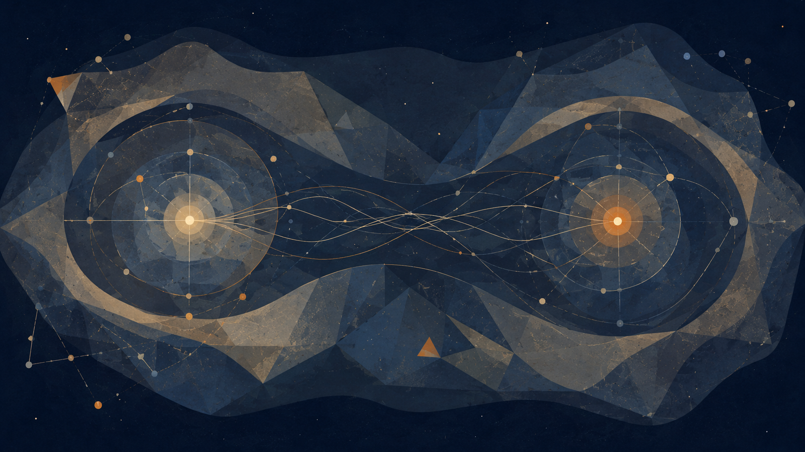

_תיאור תמונה: קשרים מקומיים ואי־מקומיים, מדידה, הקשר וקורלציות שאינן מסר._

קורלציה אינה מסר, והקשר אינו רעש סביב התשובה. אלה שתי האזהרות שבלעדיהן אי־אפשר להשתמש במקומיות, באי־מקומיות ובתלות בהקשר באופן אחראי. הפרק הזה אינו מבקש להוכיח את התאוריה דרך מכניקת הקוונטים, ואינו מבקש להפוך את משפטי בל, את משפט קוכן־ספקר, את המכניקה הבוהמית או את מושג המדידה לסיסמאות פילוסופיות. הוא מבקש ללמוד מהם משמעת של הופעה: מה ניתן לומר על דבר כאשר הדרך שבה הוא נמדד, נשאל ומופיע היא חלק מתנאי התשובה.

אי־מקומיות אינה טלפתיה, אינה מסר מיידי ואינה היתר לומר שהכול משפיע על הכול. עקרון אי־האיתות הוא בלם הכרחי: קורלציה יכולה להיות לא־קלאסית בלי להפוך לערוץ תקשורת. תלות בהקשר אינה רלטיביזם ואינה טענה שאין אמת. היא מלמדת שיעור עדין יותר: יש מצבים שבהם מה שאפשר לומר באחריות תלוי בתנאי המדידה, בשפה, בהנחות ובמבנה היחסים שבתוכם התוצאה מופיעה.

במובן הזה, הפרק אינו קוונטי כדי להיות עמוק. הוא קוונטי רק במידה שבה הוא מחייב דיוק. הפוטנציאל אינו “הכול אפשרי”; האידיאל אינו “אמת בלי הקשר”; והאופטימלי אינו תשובה שמוחקת את התנאים שלה. האופטימלי הוא תשובה שיודעת באיזה הקשר היא עובדת.

### 1. מקומיות: אחריות מתחילה במקום

מקומיות היא קודם כול מושג פיזיקלי, אבל בפרק הזה היא משמשת גם כשיעור מבני זהיר: כדי לדבר באחריות צריך לדעת מאיפה מדברים. מקום אינו רק מגבלה. הוא גם תנאי של אחריות. מי שמדבר כאילו הוא אינו נמצא בשום מקום, מסתכן בלדבר בשם הכול בלי לשאת את התנאים של שום דבר.

בתאוריה, מקור חי אינו צופה אלוהי מחוץ למערכת. הוא מקור ממוקם: גוף, שפה, זיכרון, כלים, שאלה, מגבלה ואפשרות לטעות. המיקום הזה אינו הופך אותו לפחות אמיתי. הוא הופך אותו לאחראי יותר, כי הוא מחייב אותו לומר מאיזה מקום הוא מדבר ומה אינו יכול לראות מן המקום הזה.

לכן מקומיות אינה רק צמצום. היא התחלה של יושר. פעולה מוסרית, פרשנות משפטית, אבחנה רפואית, למידה חינוכית, יצירה אמנותית ופלט של בינה מלאכותית — כולם מתחילים מתוך תנאים מקומיים. אין בכך כדי לומר שהאמת מקומית בלבד; יש בכך כדי לומר שכל אמירה אחראית חייבת להכיר במיקום שממנו היא מתחילה.

האידיאל אינו מבט חסר מקום. אידיאל חסר מקום עלול להפוך לקול שמוחק חיים, מפני שהוא מדבר כאילו הוא בא משום מקום ולכן אינו חייב דין וחשבון לאף מקום. האידיאל האחראי אינו מוותר על אמת, אבל הוא מסרב להסתיר את תנאי הופעתה.

### 2. אי־מקומיות: קורלציה אינה תקשורת

אי־מקומיות קוונטית היא מושג עדין, לא רישיון למיסטיקה. היא אינה אומרת שאפשר לשלוח מסרים מיידיים, אינה מוכיחה טלפתיה, אינה מוכיחה שכל דבר משפיע על כל דבר באופן חופשי, ואינה הופכת את העולם לרשת רצונית של משמעויות.

הבלם המתודולוגי החשוב הוא עקרון אי־האיתות: קורלציות קוונטיות יכולות להיות לא־קלאסיות, אבל אי־אפשר להשתמש בהן כדי לשלוח מידע נשלט מהר מן האור. קורלציה אינה ערוץ תקשורת. קשר אינו שליטה. יחס אינו מסר. תלות אינה בהכרח אחריות מוסרית ישירה.

המשפט הזה חשוב גם מחוץ לפיזיקה. בחיים ובחברה קל להתבלבל בין קשר לבין מסר, בין קורלציה לבין סיבה, בין דמיון לבין משמעות, בין תלות סטטיסטית לבין אחריות. התאוריה צריכה להיזהר מאותה טעות: העובדה ששני דברים קשורים אינה אומרת שאחד מהם מדבר בשם השני.

פוטנציאל אינו רשת שבה כל אפשרות שולחת מסר לכל אפשרות אחרת. הוא מרחב שבו אפשרויות יכולות להופיע בתוך תנאים. אידיאל אינו הרחבת כל הקשרים לכל הכיוונים, אלא בירור של אילו קשרים ראויים, באיזה הקשר, ובאיזו אחריות.

### 3. משפטי בל: גבול לאינטואיציה מקומית־קלאסית

משפטי בל ואי־שוויונות בל (Bell) מראים שתחת הנחות מסוימות, משפחות של תאוריות מקומיות של משתנים חבויים אינן יכולות לשחזר את תחזיות מכניקת הקוונטים ואת תוצאות הניסויים. זהו גבול עמוק על סוגים מסוימים של הסבר, לא סיסמה על כך שהכול קשור להכול.

בל אינו מוכיח שהמציאות היא תודעה. הוא אינו מוכיח שאין עובדות. הוא אינו מוכיח שהכול אי־מקומי באותו מובן פופולרי. הוא מראה שאינטואיציה מסוימת — שלפיה אפשר לשמור גם על מקומיות קלאסית וגם על ערכים חבויים מסוימים המשחזרים את התחזיות — עומדת בפני גבול קשה.

הלקח לתאוריה אינו “הכול מותר”. להפך. הלקח הוא שלא כל אינטואיציה פשוטה שורדת בדיקה. לפעמים מה שנראה טבעי למחשבה שלנו אינו מספיק כאשר הוא נדרש לעמוד מול ניסוי, פורמליזם ותנאי בדיקה.

זה דומה לעבודה המוסרית של התאוריה: אינטואיציה יכולה להיות התחלה, אבל היא אינה סוף. תחושה של אמת אינה פוטרת אותנו מתנאי בדיקה. רעיון שנשמע עמוק אינו נעשה אידיאל רק מפני שהוא מרגיש נכון. עליו לעבור דרך גבול.

### 4. משפט קוכן־ספקר: הקשר אינו רעש סביב הערך

משפט קוכן־ספקר (Kochen-Specker) מצביע על קושי עקרוני להקצות לכל הגדלים המדידים הקוונטיים ערכים מוגדרים מראש באופן שאינו תלוי בהקשר, תוך שמירה על יחסי המבנה של התאוריה. בניסוח רחב יותר: לא תמיד אפשר לחשוב על תוצאות המדידה כאילו הן היו כולן כתובות מראש, בלי קשר לאופן שבו נשאלה השאלה.

זה אינו אומר שהצופה ממציא את המציאות כרצונו. זה אינו אומר שאין אמת. זה אינו אומר שכל פרשנות שווה. המשפט כן מחייב זהירות: תנאי המדידה אינם תמיד רעש סביב הערך; לפעמים הם חלק ממה שמאפשר לדבר על הערך באחריות.

כאן מופיע החיבור העמוק לתאוריה. הקשר אינו הפרעה חיצונית בלבד. יש מקרים שבהם הקשר הוא חלק מתנאי הופעה. שאלה, כלי, שפה, הנחה, פרוצדורה ומטרה יכולים לשנות את מה שניתן לומר באחריות על הדבר.

הקשר אינו תירוץ לברוח מאמת. הוא מה שמחייב לומר איזו אמת נאמרת, באילו תנאים, באיזה כלי, ובאיזה גבול.

### 5. מדידה אינה קסם, וצופה אינו בהכרח תודעה

אחת הטעויות הגדולות בשפה פופולרית על קוונטים היא לזהות מדידה עם תודעה אנושית. “הצופה” נהפך לדמות כמעט מיסטית, כאילו עצם המודעות האישית יוצרת את המציאות. הפרק הזה חייב להימנע מכך.

מדידה קוונטית אינה קסם, ואינה הוכחה שהתודעה יוצרת מציאות. היא השם למקום שבו מערכת, כלי, אינטראקציה, שאלה, פורמליזם ורישום נפגשים כך שתוצאה יכולה להירשם ולהיות ניתנת לדיון. אין צורך להפוך אותה לרצון אנושי כדי להבין שהיא אינה הצצה פסיבית בלבד.

המשמעות לתאוריה היא עדינה: המקור החי אינו יוצר אמת מתוך רצון. הוא גם אינו מוחק את עצמו בשם ניטרליות מזויפת. הוא ממוקם בתוך שאלה, כלי, שפה וגוף, ולכן עליו לשאת אחריות לתנאים שבהם התשובה מופיעה.

אמת אינה צריכה להיות חסרת תנאים כדי להיות אמת. אבל כאשר תנאיה מוסתרים, היא נעשית מסוכנת. היא מתחילה לדבר כאילו היא מוחלטת גם כאשר היא תלויה בכלי, שאלה ומסגרת.

### 6. שזירה: לא קשר רגשי ולא ערוץ מסרים

אם מזכירים שזירה, חייבים להיזהר. שזירה אינה קשר רגשי, אינה אחדות נשמתית, אינה טלפתיה, ואינה ערוץ מסרים. היא מבנה קוונטי מדויק של מצב משותף שאינו מתפרק בפשטות למצבים עצמאיים של חלקיו.

היא יכולה ללמד בזהירות שיש מצבים שבהם השלם אינו מתואר היטב כאוסף חלקים בלתי־תלויים. אבל גם כאן אסור לקפוץ למיסטיקה. העובדה שמערכת קוונטית דורשת תיאור משותף אינה אומרת שכל יחס אנושי, מוסרי או תרבותי הוא שזירה.

החיבור לתאוריה צריך להיות מבני בלבד: לפעמים משמעות אינה יושבת בחלק בודד אלא ביחס. לפעמים עדות אינה נובעת ממרכיב יחיד אלא ממבנה. אבל כאשר עוברים מן הפיזיקה אל החיים, צריך לסמן שמדובר בהשראה מבנית, לא בהוכחה פיזיקלית.

זהו עיקרון משמעת: לא להשתמש ביופי של מושג כדי להרחיב אותו מעבר לתחום שבו הוא נמדד.

### 7. המכניקה הבוהמית: להציל תמונה במחיר

המכניקה הבוהמית (Bohmian mechanics) מזכירה שאין פרשנות שמקבלת הכול בחינם. היא שומרת על דטרמיניזם ועל תמונת מסלולים חלקיקיים במובן מסוים, אך במחיר של אי־מקומיות מפורשת ומחויבות למבנה תאורטי אחר.

אין צורך להפוך אותה לדיון טכני מלא. תפקידה בפרק הוא להראות שכל מסגרת שמצילה אינטואיציה אחת משלמת מחיר במקום אחר. אם רוצים לשמר תמונת עולם מסוימת, צריך להיות מוכנים לומר מה המחיר שלה.

זה שיעור חשוב לתאוריה. כל שפה שמסדרת את העולם מסתירה משהו, מבליטה משהו, ומשלמת מחיר. אין שפה שמצילה הכול בלי גבול. אידיאל שאינו מכיר במחיר של שפתו נעשה מסוכן, כי הוא מציג את עצמו כטבעי, בלתי־מותנה וחסר חלופה.

האופטימלי אינו השפה שאין לה מחיר. הוא השפה שאומרת ביושר מה היא מאפשרת, מה היא דורשת, ומה היא אינה יכולה לשאת.

### 8. הקשר אינו סובייקטיביות

זה לב הפרק. הקשר אינו סובייקטיביזם. הוא אינו אומר “כל אחד והאמת שלו”. הוא אינו אומר שאין מציאות מחוץ לפרשנות. הוא אינו אומר שכל פרשנות שווה. הוא גם אינו אומר שהצופה חופשי לברוא ערכים כרצונו.

תלות־בהקשר קוונטית היא מושג טכני. השימוש הרחב במילה “הקשר” בפרקי בינה מלאכותית, משפט, חינוך, רפואה ואמנות הוא הרחבה מבנית זהירה, לא הוכחה שמועברת מן הפיזיקה. הפרק חייב לומר זאת כדי שלא ייפול בדיוק לטעות שהוא מזהיר מפניה.

ובכל זאת, ההשראה המבנית חזקה: לפעמים אי־אפשר לדבר באחריות על תוצאה בלי לדבר על השאלה, הכלי, הפרוצדורה והמסגרת שבתוכם היא הופיעה. הקשר אינו מבטל אמת; הוא מחייב אותנו להיות מדויקים יותר לגבי צורת הופעתה.

האמת אינה נעלמת כאשר היא מופיעה בתוך הקשר. היא נעשית אחראית רק כאשר ההקשר שלה אינו מוסתר.

### 9. פוטנציאל, אידיאל ואופטימלי בתוך תנאי הופעה

פוטנציאל אינו מחסן של תוצאות מוכנות מראש. הוא מרחב שבו אפשרות נעשית ניתנת לאמירה רק כאשר יש שאלה, כלי, הקשר וגבול. זה אינו אומר שכל דבר אפשרי, ואינו אומר שאין אמת עד שמישהו מסתכל. זה אומר שאפשרות מקבלת צורה בתוך תנאים.

האידיאל אינו אמת חסרת הקשר. אידיאל שאינו מכיר בהקשר שלו נעשה אלים; אידיאל שנמס כולו לתוך ההקשר נעשה חסר עמוד שדרה. האידיאל האחראי מחזיק את שניהם: אמת ותנאי הופעה.

האופטימלי אינו “האמת היחסית שלי”. הוא אינו סובייקטיביזם. הוא התשובה האחראית ביותר שניתן לשאת בתוך תנאי הופעה מוגדרים: תשובה שאומרת מה היא יודעת, באיזו שאלה, באיזה כלי, באיזו שפה, באיזה גבול, ומה נשאר פתוח.

כאן הפרק מתחבר לפרקים הקודמים. במדע למדנו תחום תוקף. בחישוב למדנו ייצוג ועדות. במבנה היקום למדנו אופק. בפיזיקה באנרגיות גבוהות למדנו סקאלה והופעה. כאן אנו לומדים הקשר: לא כתירוץ, אלא כתנאי אחריות.

### 10. מקור חי, מרחק ועדות

מקור חי אינו מי שמבטל פיזיקה לטובת תודעה, ואינו צופה אלוהי שמייצר אמת מתוך רצון. מקור חי הוא מי ששואל, מודד, מפרש, טועה, מתקן ונושא אחריות בתוך שפה, גוף, כלי ומגבלה.

עדות אינה תוצאה עירומה. היא עוברת מרחק: מן המערכת אל המדידה, מן המדידה אל הסימן, מן הסימן אל המודל, מן המודל אל הפרשנות, ומן הפרשנות אל פעולה שאפשר לשאת באחריות.

המרחק הזה אינו כישלון בלבד. הוא מה שמאפשר ביקורת. אם לא היה מרחק בין תוצאה לפרשנות, לא הייתה אפשרות לבדוק את הפרשנות. אם לא היה מרחק בין מקור לפלט, לא הייתה אפשרות לשאול מה נאבד בדרך.

לכן התאוריה אינה מבקשת לבטל מרחק. היא מבקשת לא להעמיד פנים שהמרחק אינו קיים. אחריות מתחילה כאשר מזהים את הדרך מן הסימן אל המשמעות.

### 11. בינה מלאכותית: הפלט תלוי־הקשר

בינה מלאכותית אינה אי־מקומית במובן פיזיקלי, ואסור להשתמש במכניקת הקוונטים כדי להסביר את פעולתה. אבל בינה מלאכותית מדגימה היטב עד כמה פלט תלוי בהקשר: הנחיית קלט, נתוני אימון, מדיניות מערכת, זיכרון, כלים, ממשק, שפה, תרבות, כוונת המשתמש, מדד הערכה וסביבת הפריסה.

לכן “המודל אמר” אינו סוף הדיון אלא תחילתו. זה דומה יותר ל“הגלאי רשם” מאשר ל“האמת נאמרה”. צריך לשאול: איזה מודל? איזו הנחיית קלט? איזה מידע? אילו מגבלות? איזה שימוש? איזה מקור? איזו בדיקה? איזו אחריות?

הפלט אינו מופיע בוואקום. הוא תוצאה של מערכת תנאים. כמו בפרק הזה כולו, ההקשר אינו מבטל את האפשרות להעריך את התשובה; הוא מחייב הערכה מדויקת יותר. תשובה של בינה מלאכותית יכולה להיות מועילה, אבל רק אם אינה מסתירה את תנאי הופעתה.

האופטימלי בעבודה עם בינה מלאכותית אינו התשובה שנשמעת הכי בטוחה. הוא התשובה שיודעת להראות את תנאיה, גבולותיה, מקורותיה, מטרתה, והאדם שנושא באחריות לשימוש בה.

### 12. הקצה הרקורסיבי: מי הגדיר את ההקשר?

כאשר חושפים את ההקשר של תשובה, לא מגיעים לסוף האחריות. נפתחת שאלה חדשה: מי הגדיר את ההקשר, באיזה הקשר הוא הוגדר, מה הוא מאפשר לראות, ומה הוא מסתיר. זהו הקצה הרקורסיבי של האמת בתוך תנאי הופעה.

כל מסגרת מדידה נשענת על מסגרת נוספת. כל שפה נשענת על שפה רחבה יותר. כל כלי נשען על בחירות תכנון. כל מדיניות בינה מלאכותית נשענת על ערכים. כל פרוצדורה משפטית נשענת על הנחות על צדק. כל הקשר שנחשף פותח הקשר נוסף.

זה אינו מבטל אמת. הוא מונע מן האמת להתחפש למבט שאין לו מקום. הקצה הרקורסיבי אינו ייאוש; הוא צורת האחריות של מחשבה שאינה משקרת לעצמה שהיא סיימה.

לכן הפרק אינו מסיים בקביעה שהכול תלוי בהכול. הוא מסיים בתביעה הפוכה: אם משהו תלוי בהקשר, עלינו להיות מדויקים יותר, לא פחות.

### 13. סיום: אמת שאינה מסתירה את תנאיה

מקומיות, אי־מקומיות ותלות בהקשר אינן מוכיחות את התאוריה. הן מלמדות אותה צורה של אחריות. מקומיות מזכירה שכל פעולה מתחילה במקום. אי־מקומיות מזכירה שלא כל קורלציה היא מסר, ושלא כל קשר הוא תקשורת. תלות בהקשר מזכירה שהקשר אינו רעש סביב האמת, אלא לפעמים חלק מתנאי הופעתה.

הלקח אינו רלטיביזם. להפך: רלטיביזם מתחיל כאשר משתמשים בהקשר כדי לברוח מאחריות. כאן ההקשר מחייב אחריות. הוא דורש לומר באיזו שאלה, באיזה כלי, באיזו שפה, באיזו מטרה, ובאיזה גבול נאמרה התשובה.

האמת אינה נעלמת כאשר היא מופיעה בתוך הקשר. היא נעשית אחראית רק כאשר ההקשר שלה אינו מוסתר.

### משמעת מקורות

מקורות עבודה וזהירות: הפרק נשען על מסגרת התאוריה ועל מקורות ממוקדים בפילוסופיה וביסודות מכניקת הקוונטים: משפטי בל, משפט קוכן־ספקר, תלות בהקשר קוונטית, עקרון אי־האיתות, המכניקה הבוהמית ויסודות מכניקת הקוונטים. המקורות אינם מוכיחים את התאוריה; הם משמשים כבלמים נגד שימוש ריק או מטעה במונחים קוונטיים.

חזרה לתוכן עניינים

## יצירה, קאנון ואופטימום: מה אסור לאבד

*המחיר ההכרחי של צורה*

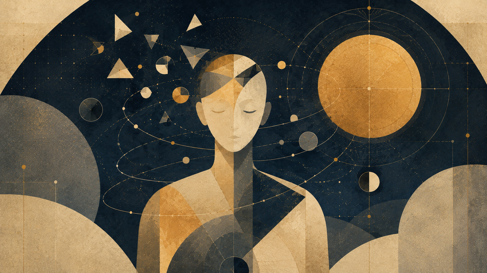

_תיאור תמונה: דמות מפוצלת סביב מרכז אור, כצורה שנבחרת מתוך עודף אפשרויות._

יצירה היא אחת המעבדות המדויקות ביותר של היחס בין פוטנציאל לאידיאל, מפני שהיא נולדת מעודף. לפני שיש ספר, סרט, סדרה, קומיקס, משחק או זיכיון יצירתי ( פרנצ׳ייז), יש מרחב רחב מדי של אפשרויות: דמויות, עלילות, סופים, עולמות, סגנונות, קולות ודרכי הופעה. לכן יצירה אינה רק פעולה של הוספה, אלא פעולה של ויתור.

כל יצירה אומרת: זה ייכנס, וזה לא. הדמות הזאת תיוולד, והדמות ההיא תישאר אפשרות. הסוף הזה ייסגר, וסופים אחרים יישארו מחוץ לצורה. במובן הזה, יצירה טובה אינה זו שמממשת את כל הפוטנציאל שלה, אלא זו שיודעת איזה חלק מן הפוטנציאל ראוי לקבל צורה, ואיזה חלק צריך להישאר בחוץ כדי שהצורה לא תאבד את עצמה.

הפוטנציאל של יצירה הוא כל מה שהיא יכולה הייתה להיות. האידיאל שלה הוא מה שאסור לה לאבד. האופטימלי הוא הצורה שבה הוויתורים נעשים נאמנים לדבר הזה.

לכן הפרק הזה אינו רק פרק על אמנות או תרבות. הוא פרק על המחיר ההכרחי של צורה. כל צורה חיה נולדת מתוך עודף שהיא אינה יכולה לשאת במלואו. אם היא תנסה לכלול הכול, היא תאבד מרכז. אם היא תסגור את עצמה מהר מדי, היא תאבד חיים. היצירה הגדולה עומדת בין שני הכשלים האלה: היא יודעת מספיק כדי לבחור, ומוותרת מספיק כדי להישאר נאמנה.

הוויתור הוא החסד של היצירה: ההסכמה שלא להיות כל מה שאפשר, כדי להיות נאמנה למה שראוי.

### 1. פוטנציאל, אידיאל ואופטימלי ביצירה

פוטנציאל ביצירה אינו הבטחה לעומק. הוא עודף. הוא כל מה שאפשר לכתוב, לצלם, לצייר, להלחין, להוסיף, להמשיך, להרחיב או להראות. עודף כזה יכול להיות מתנה, אבל הוא גם סכנה. מרחב האפשרויות יכול לפתוח יצירה, אך הוא יכול גם להציף אותה עד שלא נשאר בה חוק פנימי.

האידיאל אינו “הגרסה שבה הכול מושלם”. אידיאל ביצירה הוא חוק הבחירה: מה חייב להישאר גם כאשר משנים, מקצרים, מעבדים, מתרגמים, מרחיבים או ממשיכים. האידיאל אינו כל האפשרויות במצב מושלם, אלא מה שמסנן את האפשרויות כדי שאחת מהן תוכל להפוך לצורה.

האופטימלי אינו הצורה הכי גדולה, הכי עשירה, הכי מלוטשת או הכי נאמנה לכל פרט. האופטימלי הוא הצורה שבה הוויתורים נעשים נאמנים לאידיאל. הוא יודע מה להשאיר בחוץ כדי שהמרכז לא ייחנק. הוא יודע מה לא להסביר כדי שהמסתורין יישאר חי. הוא יודע איזה כוח לא להפעיל כדי שהמוסר לא ייהרס.

במובן הזה, כל יצירה היא מבחן של אחריות. לא רק מה אפשר לעשות, אלא מה ראוי לעשות. לא רק מה ניתן להוסיף, אלא מה התוספת תעלה. לא רק מה אפשר להמשיך, אלא האם ההמשך עדיין נושא את החוק הפנימי של מה שקדם לו.

### 2. אופטימום חד־צירי

יש יצירות שבהן רכיב אחד נעשה הציר שסביבו הכול מסתדר: כתיבה, טון, מבנה, דימוי, משחק, קצב או רעיון. ביצירות כאלה, אין צורך שכל שכבה תהיה אידיאלית בפני עצמה. לפעמים דווקא מעטפת פונקציונלית, גסה או מצומצמת מאפשרת לציר המרכזי להישאר חשוף וחד.

בקומדיות מטא־טלוויזיוניות, למשל, העולם לא תמיד נבנה כדי להרשים מבחינה חזותית. הבימוי אינו תמיד המרכז, והאסתטיקה יכולה להישאר כמעט שימושית. אבל אם הכתיבה מדויקת, אם המבנה יודע לפגוע, ואם הבדיחה נושאת פצע רגשי, המערכת יכולה להיות אופטימלית למרות שאינה “מושלמת” בכל רכיב.

יצירות כמו *Community* או *Rick and Morty* חשובות כאן לא כרשימת המלצות, אלא כדוגמאות לעיקרון. ב־*Community*, הז׳אנר הוא מכשיר: מערבון, דוקומנטרי, פרק בקבוק, מאפיה, מדע בדיוני או טלוויזיה על טלוויזיה — כולם משמשים כדי לחשוף משהו על דמויות, קשרים ופחדים. הצורה המלאכותית אינה מחליפה את הרגש; היא הדרך להגיע אליו.

ב־*Rick and Morty*, הפוטנציאל כמעט אינסופי: יקומים, גרסאות, מוות, החלפה, קאנון, המשכיות, בדיחה ופצע. אבל דווקא כאשר הכול אפשרי, השאלה נעשית חריפה יותר: מה עדיין מחזיק? מה עדיין פוגע? מה עדיין אינו ניתן להחלפה?

זהו אופטימום חד־צירי. לא הכול מגיע לשיא, אבל דבר אחד נעשה מדויק מספיק כדי להצדיק את השאר. האידיאל אינו שלמות הרמונית של כל המערכת, אלא ציר מרכזי ששאר הרכיבים מתכופפים סביבו. לפעמים האופטימלי אינו המלא ביותר, אלא החסר המדויק.

### 3. אופטימום הרמוני

מול האופטימום החד־צירי קיימות יצירות שבהן לא רכיב אחד מחזיק את הכול, אלא כל הרכיבים מתכנסים למרכז אחד. הדימוי, המוזיקה, העולם, השפה, המשחק, הקצב, המוסר והמבנה פועלים יחד. כאן האידיאל אינו צמצום לציר אחד, אלא הרמוניה רחבה.

ב־*שר הטבעות*, השפה, המיתוס, המסע, הנוף, המוזיקה, האתיקה והקנה־מידה הרגשי מתכנסים סביב שאלה אחת: מהו כוח שאינו משחית, ומהו ניצחון שאינו הופך לשליטה? אצל מיאזאקי, במיטבו, הדימוי, התנועה, הילדות, הפחד, הטבע והחסד אינם רכיבים נפרדים, אלא מערכת אחת שנושמת מתוך מרכז חי. ב־*Breaking Bad*, הכתיבה, המשחק, הצילום, הצבע והקצב מתכנסים סביב שינוי אחד: אדם שמספר לעצמו סיפור על צורך, עד שהסיפור חושף את הרצון האמיתי שלו.

אותה יצירה יכולה להיות הרמונית מבחינה אמנותית ועדיין להציג אידיאל מזויף מבחינה מוסרית. *Breaking Bad* חזקה בדיוק מפני שהמערכת האמנותית שלה מדויקת, בעוד שהאידיאל של הדמות הולך ונחשף כשקר.

הלקח אינו שכל יצירה צריכה להיות הרמונית. הלקח הוא שאין אמת מידה אחת לכל יצירה. יש יצירה שצריך לשפוט לפי דיוק הציר שלה, ויש יצירה שצריך לשפוט לפי ההתכנסות של חלקיה. בשני המקרים, השאלה אינה כמה יש בה, אלא האם מה שיש בה נאמן למרכז.

### 4. ריקורסיה יצירתית

יש רגע שבו יצירה אינה רק מספרת סיפור, אלא מתחילה לחשוב את החוק שמייצר את הסיפור. לא רק “מה קרה?”, אלא “איך סיפור כזה נבנה?”. לא רק “מי הדמות?”, אלא “איזה חוק סיפורי מייצר אותה?”. לא רק “מהו הז׳אנר?”, אלא “מה קורה כאשר הז׳אנר יודע שהוא ז׳אנר?”.

זו ריקורסיה יצירתית. לא גימיק של שבירת קיר רביעי, אלא מצב שבו היצירה מכניסה לתוכה את שאלת היווצרותה. היא אינה רק בוחרת אפשרות מתוך מרחב האפשרויות; היא שואלת איך בכלל בוחרים אפשרות, ומה המחיר של הבחירה.

ריקורסיה כזאת יכולה להיות כוח נדיר, אבל היא גם מסוכנת. יצירה שמודעת לעצמה יכולה להגיע לדיוק, אך יכולה גם לקרוס לאירוניה ריקה. מטא־מודעות בלי מרכז חי הופכת למראה מול מראה: הרבה השתקפות, מעט נשימה.

כאן הקשר לתאוריה ברור. מערכת שמייצגת את עצמה פוגשת גבול. יצירה שמספרת על עצמה פוגשת את אותו גבול בצורה חיה. הריקורסיה טובה רק כאשר היא מחזירה אותנו אל מקור חי: אל כאב, אחריות, חוק פנימי, או שאלה שלא נפתרה. אם היא נשארת רק חכמה, היא מאבדת את האידיאל שלה.

### 5. זיכיון יצירתי וקאנון כאינווריאנט חי

זיכיון יצירתי מתחיל כאשר יצירה אחת פותחת יותר אפשרויות ממה שהיא יכולה להכיל. דמות אחת נעשית עולם. עולם אחד נעשה סדרה. סדרה אחת נעשית יקום. היצירה הראשונה מגלה אידיאל, והזיכיון מנסה להרחיב את הפוטנציאל שנפתח סביבו.

הבעיה של זיכיון אינה “עוד”. הבעיה היא עוד בלי מרכז.

ככל שהפוטנציאל גדל, קל יותר לאבד את האידיאל. עוד דמות, עוד סרט, עוד סדרה, עוד ציר זמן, עוד יקום, עוד גרסה — כל אלה יכולים להעמיק את העולם, אבל הם גם יכולים להפוך אותו לאינפלציה. הכול ממשיך, אבל פחות ופחות דברים מרגישים הכרחיים.

כאן נכנס הקאנון. קאנון אינו רק רצף רשמי, החלטת אולפן, ויקי של מעריצים או רשימת “מה קרה”. קאנון עמוק אינו מה שלא משתנה. הוא מה שמאפשר ליצירה להשתנות בלי להפסיק להיות עצמה.

במונחי התאוריה, קאנון הוא אינווריאנט חי — גרעין נשמר תחת שינוי יצירתי. כאשר מחליפים מדיום, תקופה, שחקן, גוף, סגנון, טון או קהל, השאלה אינה רק מה השתנה, אלא מה נשמר. הגרעין הנשמר אינו בהכרח פרט חיצוני. הוא יכול להיות חוק, פצע, שאלה, יחס, גבול או ציר מוסרי.

*באטמן* יכול להשתנות: בלשי, גותי, ריאליסטי, מיתי, פסיכולוגי או כמעט קריקטורי. אבל אם אובד הגרעין — ילד שאיבד עולם ומנסה להפוך טראומה לחוק — נשארת תחפושת. *ספיידרמן* אינו רק קורים וחליפה, אלא כוח צעיר תחת אחריות. *סופרמן* אינו רק כוח מוחלט, אלא כוח מוחלט שמסרב להפוך לשליטה. ברגע שהאינווריאנט אובד, אפשר לשמור את השם ועדיין לאבד את הצורה.

כך גם כאשר דמות מתה, חוזרת, מתחלפת או עוברת ליורש. השאלה אינה רק מי נושא את הסמל, אלא האם הסמל עדיין נושא את אותה שאלה. קאנון חי אינו מוזיאון; הוא חוק פנימי שמאפשר שינוי בלי איבוד זהות.

### 6. כוח, ידיעה ואידיאל

אפשר לראות את שאלת הקאנון גם דרך ההבחנה בין כוח, ידיעה ואידיאל. *קפטן אמריקה* וריד ריצ׳רדס, למשל, יכולים לשמש כדוגמה לניגוד בין פתרון שכלי לבין שמירת מרכז מוסרי. ריד ריצ׳רדס מייצג את אידיאל השכל הפותר: הרצון להבין מספיק כדי להציל, לתקן ולפתור. *קפטן אמריקה* מייצג עיקרון אחר: שיפוט תחת מגבלה. הוא אינו החזק ביותר או החכם ביותר; גדולתו נמצאת ביכולת לשאול מה אסור לאבד כאשר אין פתרון מושלם.

*Watchmen* מפרק את אותו מתח מן הצד האפל. דוקטור מנהטן הוא פוטנציאל כמעט אלוהי: כוח עצום, תפיסת זמן לא־אנושית, יכולת לפרק ולבנות חומר, ומרחק כמעט מוחלט מן החרדה האנושית. אבל כל־יכולת בלי טוב אינה אידיאל. אוזימנדיאס מראה שאופטימיזציה בלי קדושת האדם יכולה להפוך לפשע בשם פתרון. רורשאך מראה שאמת בלי גמישות יכולה להפוך לחוק שאינו יודע לחיות.

הלקח אינו מי חזק יותר, אלא איזו צורה של כוח עדיין ראויה לבחירה. כוח וידיעה הם פוטנציאלים. הם אינם אידיאל עד שהם עוברים דרך חוק מוסרי, גבול, אחריות ומרכז חי.

### 7. עיבוד כרדוקציה תרבותית

עיבוד הוא מבחן אכזרי, מפני שהוא מכריח יצירה לעבור ממדיום אחד לאחר. ספר נעשה סרט. קומיקס נעשה סדרה. משחק נעשה קולנוע. עולם פתוח נעשה נרטיב ליניארי. פנימיות של דמות נעשית דימוי חזותי. בכל מעבר כזה אי־אפשר לשמור הכול.

לכן עיבוד טוב אינו העתקה. נאמנות בעיבוד אינה שמירת כל החומר, אלא שמירת החוק הפנימי בזמן שהחומר משתנה.

במובן הזה, עיבוד הוא רדוקציה תרבותית — מעבר מצורה אחת לאחרת שבו מאבדים חומר מסוים ומנסים לשמר מבנה משמעות. כמו ברדוקציה חישובית, שבה מעבירים בעיה לצורה אחרת תוך שמירת מבנה הכרעה, כך בעיבוד מעבירים יצירה למדיום אחר תוך ניסיון לשמר מבנה משמעות. זו אינה טענה פורמלית, אלא דימוי מבני: עיבוד טוב הוא רדוקציה שמצליחה לשמר את השאלה.

עיבוד רע יכול לשמור שמות, תלבושות, חפצים, משפטים, איקונות וסצנות — ועדיין להחמיץ את היצירה. הוא שומר פני שטח ומאבד חוק. אפשר לשמור את החרב ולאבד את המסע. אפשר לשמור את המגדל ולאבד את המרכז. אפשר לשמור את הגיבור ולאבד את השאלה שהפכה אותו לגיבור.

עיבוד טוב יודע שלפעמים צריך לבגוד בפרט כדי להיות נאמן לצורה. שינוי אינו בהכרח בגידה, והעתקה אינה בהכרח נאמנות. השאלה אינה כמה נשמר, אלא מה נשמר.

### 8. המגדל האפל וגוף יצירה שמחפש מרכז

יש יצירות שבהן הזיכיון אינו רק התרחבות החוצה, אלא קיפול פנימה. סיפורים שונים מתחילים להצביע זה על זה. דמויות חוזרות בצורות שונות. שמות, מקומות, כוחות וסמלים נודדים בין יצירות. הקורא מתחיל להרגיש שלא מדובר רק באוסף סיפורים, אלא בגוף יצירה שמנסה לגלות את המרכז שלו.

*המגדל האפל* של סטיבן קינג הוא דוגמה לכך. על פני השטח זהו מסעו של רולנד דשיין אל מגדל שהוא גם מקום וגם סמל. אבל בתוך גוף היצירה של קינג, המגדל נעשה ציר: נקודת מרכז שמושכת אליה עולמות, דמויות, רשעים, ערים, ספרים וז׳אנרים.

רנדל פלאג אינו רק נבל שחוזר. הוא פונקציה חוזרת של רוע: כוח שמסיט מערכות מן המרכז שלהן. הוא מחליף שם, עולם וז׳אנר, אך הפעולה המבנית נשמרת. כך פרט חוזר אל השלם, והשלם משנה את משמעות הפרט.

גם השושנה במיתולוגיה של *המגדל האפל* חשובה: המגדל הוא מרכז קוסמי עצום, והשושנה היא הופעה קטנה, עדינה ופגיעה של אותו מרכז. זה דימוי מדויק ליחס בין אידיאל למערכת. מה שמחזיק את כל העולמות אינו חייב להופיע ככוח הגדול ביותר. לפעמים המרכז מופיע כדבר שאפשר לרמוס בלי להבין שרמסת את הציר כולו.

לכן עיבוד של יצירה כזאת אינו נבחן רק בשאלה אם הופיעו Roland, המגדל, האיש בשחור או האקדחים. הוא נבחן בשאלה אם נשמר החוק הפנימי: התחושה שכל הסיפורים נמשכים אל מרכז אחד, ושמרכז זה הוא גם קוסמי וגם פגיע. עיבוד אינו צריך להעתיק את המגדל. הוא צריך לגרום לנו להרגיש שיש מגדל.

### 9. בינה מלאכותית כמכונת פוטנציאל

בינה מלאכותית משנה את תנאי היצירה מפני שהיא הופכת פוטנציאל לזול ומהיר. קל ליצור עוד גרסה, לחקות סגנון, להמשיך סיפור, להפיק דימוי, לשכפל קול, להרחיב עולם, לכתוב “כמו”, ולייצר וריאציות כמעט בלי סוף.

אבל כאשר הפוטנציאל נעשה זול יותר, האידיאל נעשה יקר יותר.

בינה מלאכותית מרחיבה פוטנציאל, אבל אינה מחליפה אידיאל. היא יכולה להציע צורות, אבל אינה יודעת לבדה מה אסור לאבד. היא יכולה לחקות קאנון, אבל לא בהכרח להבין את האינווריאנט. היא יכולה לשמר סמלים, צבעים, שמות ומבנים חיצוניים, ועדיין לאבד את החוק הפנימי של היצירה.

כאשר בינה מלאכותית מחקה קול, סגנון או דמות המזוהים עם מקור חי, השאלה אינה רק אם התוצאה משכנעת, אלא אם השימוש מכבד את המקור, את רשותו ואת המרחק שממנו נוצרה היצירה.

כאן חוזר מושג המקור החי. מקור חי אינו בהכרח מי שעושה כל פעולה בידיו. הוא מי שנושא באחריות לבחירה, לסינון ולוויתור. הוא שואל: מה נאמן? מה חיקוי? מה יפה אבל זר? מה מרחיב את הפוטנציאל אך שובר את האידיאל? מה צריך להישאר בחוץ?

בעידן בינה מלאכותית, שאלת היצירה אינה רק מי ייצר את הצורה, אלא מי נושא באחריות לאינווריאנט שלה.

### 10. אידיאל כסירוב לפוטנציאל

לא כל פוטנציאל ראוי למימוש. זה אחד הלקחים החשובים ביותר של יצירות גדולות.

ב־*שר הטבעות*, הטבעת היא פוטנציאל מרוכז: כוח, שליטה, הכרעה, קיצור דרך, אפשרות לתקן את העולם באמצעות כפייה. אבל האידיאל של היצירה אינו להשתמש בכוח הזה טוב יותר מן הרעים. האידיאל הוא להבין שיש כוח שאסור להשתמש בו כלל. לא מפני שהוא חלש, אלא מפני שהוא חזק מדי מן הבחינה הלא נכונה.

כאן האידיאל אינו מימוש הפוטנציאל, אלא סירוב לו. זו הבחנה קריטית לתאוריה: לא כל אפשרות צריכה להפוך למציאות. יש אפשרויות שמבטיחות שלמות רק מפני שהן מסתירות את מחיר ההשחתה שלהן. לפעמים הדרך הנכונה ביותר אל האידיאל היא לא להפעיל את הכוח, לא לפתוח את הדלת, לא לקחת את הקיצור, לא להמשיך רק מפני שאפשר.

במיוחד בעידן בינה מלאכותית, היכולת הטכנית אינה אידיאל. הפוטנציאל הטכני אינו רשות מוסרית. אם אפשר ליצור תמונה, לא תמיד צריך. אם אפשר להמשיך סיפור, לא תמיד נכון. אם אפשר לשכפל קול, דמות או סגנון, לא תמיד ראוי.

האופטימלי אינו תמיד לממש. לפעמים הוא להימנע. לפעמים הצורה הנכונה ביותר של כוח היא גבול.

### 11. אידיאל מזויף

יש מקרים שבהם דמות מזהה נכון שהמערכת הקיימת ריקה, רקובה או שקרית — אבל מסיקה מסקנה שגויה. היא חושבת שכל שבירה של המערכת היא חירות. היא חושבת שכל יציאה מן הסדר היא אמת. היא מחליפה כלא אחד בכלא אחר.

זהו אידיאל מזויף: פוטנציאל הרסני שמתחפש לאידיאל.

ביצירות כמו *Fight Club* או *Breaking Bad*, הכוח הדרמטי נובע בדיוק מן ההבחנה הזאת. הדמות אינה לגמרי טועה בהתחלה. היא מזהה משהו אמיתי: ריקנות, השפלה, זיוף, חיים שלא נחיו. אבל במקום להגיע לאידיאל, היא בונה מערכת חדשה של אלימות, שליטה, נרקיסיזם או הרס.

לא כל שבירה היא חירות. לא כל מטא־מודעות היא עומק. לא כל מעבר הוא התקדמות. לא כל יציאה מצורה מובילה לצורה ראויה יותר.

זה מגן על התאוריה מפני תמימות. פוטנציאל של שחרור יכול להפוך לשליטה חדשה. יציאה מן המערכת יכולה להפוך למערכת גרועה יותר. אידיאל אמיתי דורש יותר מן היכולת לשבור; הוא דורש לדעת מה ראוי להיבנות אחרי השבירה.

### 12. ז׳אנרים כמערכות שאלות

ז׳אנר אינו אוסף מוסכמות. ז׳אנר הוא דרך לארגן מה נחשב אפשרות, גבול, כישלון, פתרון וגאולה.

מדע בדיוני שואל מה קורה כאשר הפוטנציאל הטכנולוגי מקדים את הבשלות המוסרית. פנטזיה שואלת איזה כוח ראוי למימוש ואיזה כוח אסור להפעיל. אימה שואלת מה קורה כאשר המודחק מקבל צורה. בלש ומסתורין שואלים אם אפשר לשחזר אמת מתוך עקבות. טרגדיה שואלת מה קורה כאשר ההבנה מגיעה מאוחר מדי. קומדיה שואלת איך אפשר להגיע לאמת דרך עיוות, הגזמה או שבירה. משחקים מוסיפים את ציר הפעולה: הם גורמים לשחקן להבין דרך בחירה, כישלון, חזרה ומחיר.

בינה מלאכותית יכולה לחקות סימני ז׳אנר בקלות. היא יכולה לכתוב “בסגנון” מדע בדיוני, פנטזיה, אימה או בלש. אבל ז׳אנר אינו רק סימני פני שטח. הוא מערכת שאלות. מקור חי צריך לשאול אם נשמרה מערכת השאלות של הז׳אנר, ולא רק אם נשמרו הקישוטים שלו.

כל ז׳אנר, אם כך, הוא דרך אחרת לארגן את היחס בין פוטנציאל לאידיאל.

### 13. מה יצירה גדולה באמת עושה

יצירה גדולה אינה מוכיחה את התאוריה, אבל היא מציגה אותה כמעט עירומה. בכל יצירה יש יותר אפשרויות ממה שאפשר לממש. כל בחירה היא גם מחיקה. כל המשך הוא גם סיכון. כל עיבוד הוא גם אובדן. כל זיכיון יצירתי הוא גם הבטחה וגם סכנה.

לכן השאלה אינה איך לממש את כל האפשרויות. השאלה היא מה אסור לאבד כאשר בוחרים.

לא כל פוטנציאל הוא קריאה למימוש. לא כל הרחבה היא העמקה. לא כל המשך הוא נאמנות. לא כל שבירה היא חירות. לא כל מרכז נראה כמו מרכז.

הפוטנציאל הוא כל מה שהיצירה יכולה להיות. האידיאל הוא מה שאסור לה לאבד. והאופטימלי הוא הצורה שבה כל הוויתורים נעשים נאמנים לדבר הזה.

יצירה גדולה יודעת להבחין בין פוטנציאל לבין רעש, בין הרחבה לבין איבוד מרכז, בין קאנון לבין הצטברות, בין עיבוד לבין תחפושת, בין ריקורסיה חיה לבין מטא־גימיק, בין כוח לבין פיתוי, ובין אידיאל לבין אידיאל מזויף.

היא אינה מנסה להיות הכול. היא בוחרת מה לא להיות כדי להיות באמת.

### משמעת מקורות

מקורות עבודה וזהירות: הפרק נשען על מסגרת התאוריה ועל קריאה ביקורתית ביצירות, ז׳אנרים, עיבודים וזיכיונות יצירתיים. שמות יצירות ודמויות משמשים כדוגמאות מבניות בלבד, לא כהכרעה סופית על משמעותן. הפרק אינו טוען שדוגמה תרבותית מוכיחה את התאוריה; הוא משתמש בה כדי להראות כיצד פוטנציאל, אידיאל ואופטימלי נעשים מוחשיים במלאכת יצירה, ויתור ושמירת מרכז.

חזרה לתוכן עניינים

## אומנות של פוטנציאל

*צורה, מקור, קאנון ושוק שאינו שופט אחרון*

_תיאור תמונה: יצירה כמרחב שבו אפשרות מקבלת צורה מבלי להיסגר לחלוטין._

### מקור חי, קאנון וצורה שאינה מחליפה נשימה

אומנות, וגם אמנות במובנה הרחב, היא מעבדה טבעית של התאוריה מפני שכל יצירה מתחילה בעודף. לפני שיש תמונה, סיפור, פסל, קומיקס, סרט או משחק, יש מרחב של אפשרויות: קווים שלא צוירו, דמויות שלא נולדו, צבעים שנדחו, סופים שננטשו, נקודות מבט שלא נבחרו. היצירה היא לא רק מה שנוסף לעולם; היא גם מה שנחתך כדי שמשהו אחד יוכל להחזיק צורה.

הכשל העמוק בביקורת יצירה הוא החלפת מקור באפקט. אפשר לשאול האם היצירה מרגשת, יפה, חכמה, חדשה או “עובדת”. אבל התאוריה שואלת גם שאלה אחרת: האם נותר בה יחס חי בין מקור, סיכון וצורה. יצירה יכולה להיות מושלמת טכנית ועדיין מתה, אם היא נראית כאילו אף אחד לא היה חייב לכתוב אותה. מצד שני, פגם אינו קדוש. לא כל גמגום הוא עומק. לא כל שבר הוא אמת.

מפת היחס: יצירה חיה = מקור חי × הכרח פנימי × צורה × מחיקה אחראית × קצב × קנון שנבדק / חיקוי × אפקט ריק × פוזה × עודף לא מעובד × שוק בלבד × אוטומציה שמתחפשת למקור. המפה אינה מודדת יופי. היא בודקת האם האופטימלי האמנותי נולד מתוך נאמנות לאידיאל פנימי או מתוך התאמה שטוחה לטעם צפוי.

AI משנה את השאלה. כלי יכול לייצר תמונה, סגנון, סיפור, רעיון, קומפוזיציה, עיצוב או וריאציה. הוא פותח פוטנציאל אמיתי: סקיצות מהירות, נגישות, תרגול, שפה חזותית, ניסויים. אבל הוא גם יכול למחוק את המרחק שבו מקור חי נעשה יצירה. כאשר היוצר מבקש תוצר בלי לשאת בחירה, מחיקה, אחריות וסיכון, הכלי לא הרחיב את היצירה; הוא החליף את פעולת ההיווצרות.

קאנון הוא לא בית כלא ולא חותמת גדולה. קאנון הוא זיכרון של צורות ששרדו מפגש עם זמן. יצירה חדשה אינה חייבת לציית לו, אבל אם היא מתעלמת ממנו בלי להבין מה הוא שמר, היא מאבדת עומק. האידיאל אינו “להיות מקורי” בכל מחיר. האידיאל הוא לייצר צורה שבה מה שהיה יכול להיות נעשה הכרחי מספיק כדי להישאר.

האומנות משתלבת עם כלכלה מפני ששוק יכול לאפשר יצירה וגם לעוות אותה; עם AI מפני שמקור חי יכול להפוך לתבנית; עם חינוך מפני שתלמיד אמנות צריך מרחק ולא רק תיק עבודות; ועם מושג החסד של הוויתור מפני שלפעמים היצירה הטובה ביותר היא זו שיודעת לוותר על האפקט שמבריק יותר מהאמת שלה.

אומנות של פוטנציאל אינה נוסטלגיה נגד טכנולוגיה ואינה הגנה על סבל בשם אותנטיות. היא אומרת: מותר להשתמש בכל כלי, אבל אסור לשקר לגבי המקום שבו הכלי עמד במקום המקור. יצירה חיה אינה רק תוצאה מרשימה. היא עקבה של בחירה שעברה דרך אדם.

### משמעת מקורות

מקורות עבודה וזהירות: הפרק נשען על מסגרת התאוריה, ועל מקורות רקע כלליים שנבדקו מחוץ לפרומפט: UNESCO על בינה מלאכותית בחינוך, WHO על אתיקה וממשל של AI בבריאות, NIST AI RMF לניהול סיכוני AI, CERN/ATLAS על המודל הסטנדרטי וה-Higgs, NASA ו-ESA/Planck על קוסמולוגיה, Stanford Encyclopedia of Philosophy על Bell, Kochen-Specker וקונטקסטואליות, ו-Britannica/ISFDB לזיהוי ספרותי של Harlan Ellison ו-I Have No Mouth, and I Must Scream. המקורות אינם מוכנסים כהוכחות לתאוריה אלא כבלמים נגד שימוש ריק במונחים.

חזרה לתוכן עניינים

## מוזיקה של פוטנציאל

*זמן, קול, הקשבה ותהודה שאינה מדד*

_תיאור תמונה: קצב, שקט וחזרה כדרך להחזיק אפשרות בזמן._

### קול, זמן, שתיקה והאופטימום שאינו רק דיוק

מוזיקה בוחנת את התאוריה דרך זמן. ציור עומד, משפט נקרא, מבנה נושא עומס; מוזיקה מתרחשת ונעלמת תוך כדי הופעתה. היא מלמדת שפוטנציאל אינו רק מרחב של אפשרויות אלא גם קצב של התגלות. תו מוקדם מדי או מאוחר מדי אינו אותה אפשרות. שתיקה במקום הנכון אינה היעדר אלא צורה פעילה של יחס.

הכשל העמוק במוזיקה הוא החלפת קול בביצוע. אפשר לנגן נכון, לשיר נקי, להפיק מבריק, לסדר הרמוניה עשירה, ועדיין לא לשמוע אדם. מצד שני, זיוף אינו אוטומטית אמת. מוזיקה חיה אינה מוזיקה “לא מושלמת”; היא מוזיקה שבה הדיוק משרת נשימה, זיכרון, גוף, מקום וסיכון.

מפת היחס: מוזיקה חיה = קול × זמן × מתח × שתיקה × חזרה עם שינוי × מקור חי × הקשבה / נוסחה × ליטוש יתר × רעש × חיקוי × ניכוס × הפקה שמוחקת גוף. זו מפת אבחנה בין אופטימום טכני לאופטימום מוזיקלי. אופטימום טכני שואל אם הכל יושב; אופטימום מוזיקלי שואל האם מה שיושב גם נושם.

AI במוזיקה פותח אפשרויות אמיתיות: סקיצות, ליווי, הדגמות, נגישות למי שאין לו הרכב, הרחבת צלילים, תרגול, שחזור. אבל הוא גם מעלה את הסכנה העתיקה ביותר בצורה חדשה: קול בלי מקור. כאשר סגנון של זמר, נגנית, קהילה או מסורת נשלף כאפקט, הפוטנציאל של מוזיקה מתנתק מהחיים שיצרו אותו. לא כל שימוש הוא גניבה, אבל כל שימוש דורש תשובה לשאלה: האם הכלי הרחיב קול חי או הפך אותו לחומר גלם בלי פנים.

המוזיקה קרובה לכלכלה מפני שהיא חיה בין מתנה, עבודה ושוק. היא קרובה לחינוך מפני שאימון טוב שומר מרחק: מספיק חזרה כדי לבנות גוף, מספיק חופש כדי לא לחנוק קול. היא קרובה לאופקי גבול מפני שכל ביצוע עומד מול מה שלא ניתן לשמוע עדיין: הרגש שלא התנסח, הטון שנמצא רק ברגע, הקהל שמשנה את השיר בכך שהוא שומע אותו.

מוזיקה של פוטנציאל אינה אומרת שהאנושי תמיד טוב מהמכונה. היא אומרת שהשאלה אינה מי הפיק צליל נקי יותר. השאלה היא האם יש יחס אחראי בין מקור, קול, זמן והאזנה. גם מכונה יכולה לסייע; גם אדם יכול לזייף מקור. אבל מוזיקה חיה אינה סתם דפוס יפה. היא זמן שבו משהו מקבל רשות להופיע בלי להיגמר בתוצר.

### משמעת מקורות

מקורות עבודה וזהירות: הפרק נשען על מסגרת התאוריה, ועל מקורות רקע כלליים שנבדקו מחוץ לפרומפט: UNESCO על בינה מלאכותית בחינוך, WHO על אתיקה וממשל של AI בבריאות, NIST AI RMF לניהול סיכוני AI, CERN/ATLAS על המודל הסטנדרטי וה-Higgs, NASA ו-ESA/Planck על קוסמולוגיה, Stanford Encyclopedia of Philosophy על Bell, Kochen-Specker וקונטקסטואליות, ו-Britannica/ISFDB לזיהוי ספרותי של Harlan Ellison ו-I Have No Mouth, and I Must Scream. המקורות אינם מוכנסים כהוכחות לתאוריה אלא כבלמים נגד שימוש ריק במונחים.

חזרה לתוכן עניינים

## 10. הנדסה וארכיטקטורה של פוטנציאל

חומר, צורה, עומס ותיקון שאינו גאולה

_תיאור תמונה: מערכת הנדסית שבה פוטנציאל הופך למבנה, תיעול, בדיקה ותיקון._

_תיאור תמונה: מערכת הנדסית שבה פוטנציאל הופך למבנה, תיעול, בדיקה ותיקון._

הנדסה נראית מבחוץ כמו תחום של חישובים: עומסים, מידות, חומרים, תקנים, מקדמי ביטחון, כוחות, חתכים, תכניות. ארכיטקטורה נראית מבחוץ כמו תחום של צורה: קווים, חזיתות, חללים, אור, מעבר, פרופורציה, יופי.

אבל מתחת לשניהם מסתתרת אותה שאלה:

איך הופכים אפשרות לצורה שמסוגלת לעמוד בעולם?

לא כל אפשרות יכולה להפוך למבנה. לא כל רעיון יכול להפוך לבית. לא כל קו יפה יכול לשאת משקל. לא כל צורה חזקה ראויה לחיים בתוכה.

הנדסה וארכיטקטורה הן שתי דרכים שונות להתמודד עם המתח שבין פוטנציאל לאידיאל.

הפוטנציאל הוא מה שיכול להיבנות. האידיאל הוא הצורה שמנסה להחזיק אותו. החומר הוא ההתנגדות — וגם ההסכמה החלקית — של העולם. העומס הוא המציאות שנכנסת לתוך החלום. והמבנה הוא הפשרה החיה בין מה שרצינו ליצור לבין מה שמסוגל להישאר עומד.

אפשר לנסח זאת כנוסחת־מפה:

מבנה חי = פוטנציאל × קוהרנטיות צורנית × התאמת חומר × שימוש

עומס × חיכוך × שחיקה × אי־ודאות

או באנגלית:

זו אינה נוסחה הנדסית להצבה. זו מפת יחס. כל המשתנים כאן הם קטגוריות מחשבה, לא גדלים מדידים באותה יחידה.

הנדסה מתחילה באמת במקום שבו הרעיון פוגש התנגדות.

המטפורה ההנדסית אינה אומרת שהאדם הוא מבנה, או שחברה היא מכונה. היא אומרת דבר צנוע יותר: מבנים מלמדים אותנו איך אידיאלים פוגשים חומר, עומס, זמן והתנגדות בלי להכחיש אותם.

### 1. תכנית אינה מבנה

תכנית היא אידיאל.

היא נקייה. היא שטוחה. היא יודעת איפה הקירות. היא יודעת איפה הדלת. היא יודעת מה אמור לקרות.

אבל מבנה אינו חי בתוך התכנית. הוא חי בתוך העולם.

בעולם יש רוח. יש חום. יש קור. יש רטיבות. יש רעידות. יש אנשים שמשתמשים בדברים לא כמו שתכננו. יש זמן.

לכן תכנית אינה שקר, אבל היא גם אינה האמת המלאה. היא הבטחה ראשונית. היא צורה אפשרית שמבקשת מן החומר להסכים לה.

Blueprint ≠ Building

או:

תכנית ≠ מבנה

התכנית היא אידיאל של המבנה. המבנה הוא האידיאל אחרי שפגש חומר, כוח, תקציב, גוף, שימוש וזמן.

במובן הזה, כל בניין הוא פילוסופיה שנאלצה לעבור דרך חומר.

### 2. חומר: הפוטנציאל עם גבול

חומר אינו רק מה שבונים ממנו. חומר הוא האפשרות שכבר יש לה גבול.

פלדה יכולה להימתח ולהתכופף. בטון, בדרך כלל, חזק בלחיצה וחלש בהרבה במתיחה — ולכן הוא זקוק לעיתים לזיון, דריכה או פרטי חיבור שייקחו את המתיחה ברצינות. עץ חי עם סיבים, לחות, כיוון וזיכרון. זכוכית נותנת אור, אבל דורשת זהירות. אבן מחזיקה זמן, אבל גובה מחיר במשקל.

כל חומר אומר כן לדברים מסוימים ולא לדברים אחרים.

לכן חומר הוא פוטנציאל שאינו אינסופי.

או:

חומר = פוטנציאל עם גבולות

הטעות של אידיאליזם הנדסי היא להתייחס לחומר כאילו הוא רק מכשול בדרך לצורה. אבל החומר אינו רק התנגדות. הוא גם שותף. הוא מלמד את הצורה מה מותר לה להיות.

מבנה טוב אינו כופה רעיון על חומר עד שהחומר נכנע. מבנה טוב מכבד את נטיות החומר: את מה שהוא יודע לשאת, את מה שהוא מסרב לשאת, ואת הדרך שבה הוא משתנה בזמן.

### 3. עומס: המציאות שנכנסת אל הצורה

כל מבנה נבחן לא ברגע שבו הוא מצויר, אלא ברגע שבו משהו נשען עליו.

אדם עומד על רצפה. רוח לוחצת על חזית. מים מחפשים סדק. אדמה זזה. קורה מקבלת משקל. גשר רוטט מתנועה חוזרת. בית מזדקן תחת שימוש יומיומי.

עומס הוא הדרך שבה המציאות שואלת את המבנה אם הוא באמת קיים.

בהנדסה, אחת ההבחנות הבסיסיות היא בין עומס ליכולת נשיאה:

Demand ≤ Capacity

או:

דרישה ≤ יכולת נשיאה

במפה הפשוטה ביותר, אם הדרישה חורגת מן היכולת הרלוונטית, המבנה נכנס לאזור של כשל, נזק או חריגה ממצב גבול. בפועל, תכנון מבנים בודק כמה סוגי גבול: חוזק, יציבות, שימושיות, עיוותים, סדיקה, עייפות ועמידות בזמן.

אבל החיים אינם תמיד כל כך פשוטים. הדרישה משתנה. היכולת נשחקת. החומר מזדקן. השימושים משתנים. מה שהיה מספיק ביום הפתיחה אינו בהכרח מספיק אחרי שלושים שנה.

לכן הנדסה אינה רק השאלה האם המבנה עומד עכשיו. היא השאלה האם המבנה מסוגל להמשיך לעמוד בתוך זמן.

### 4. מקדם ביטחון: הכרה בכך שאיננו אלוהים

אחד הרעיונות היפים ביותר בהנדסה הוא מקדם הביטחון.

או:

מקדם ביטחון = יכולת נשיאה / דרישה

זו הצגה בסיסית. תכנון לפי תקנים עשוי להשתמש במקדמי עומס וחומר, מצבי גבול והסתברויות, ולא רק ביחס יחיד ופשוט. אבל הרעיון העמוק נשאר דומה: לא לסמוך על הקצה.

אם מבנה צריך לשאת עומס מסוים, לא מתכננים אותו בדיוק עד הקצה. משאירים מרווח.

המרווח הזה אינו בזבוז בלבד. הוא ענווה מתמטית.

הוא אומר: אולי טעינו במדידה. אולי החומר לא יהיה מושלם. אולי השימוש יהיה קשה יותר. אולי יבוא עומס שלא צפינו. אולי העולם לא יתנהג לפי התכנית.

מקדם ביטחון הוא ההכרה שהאידיאל אינו רשאי לסמוך על עצמו לגמרי.

כמטאפורה פילוסופית:

או:

מקדם ביטחון = ענווה מתמטית

וזה בדיוק ההבדל בין אידיאל חי לבין אידיאל מסוכן.

אידיאל מסוכן אומר: חישבתי, ולכן אני יודע. אידיאל חי אומר: חישבתי, ולכן אני יודע איפה להשאיר מקום לטעות.

### 5. מאמץ ומעוות: איך חומר מספר שכואב לו

בהנדסה יש שתי מילים יסודיות: מאמץ ומעוות.

במקרה פשוט של כוח צירי על חתך אחיד, מאמץ נורמלי ממוצע הוא הכוח הפנימי ביחס לשטח החתך:

כאשר:

σ = מאמץ F = כוח A = שטח חתך

מעוות הוא השינוי היחסי בצורה. כאן מדובר במעוות הנדסי פשוט בכיוון אחד; במבנים אמיתיים שדה המעוותים יכול להיות מורכב יותר:

כאשר:

ε = מעוות ΔL = שינוי באורך L = אורך מקורי

בתחום האלסטי הליניארי, ובקירוב חד־צירי לחומרים שמתנהגים כך, מתקיים חוק הוק בקירוב:

σ = Eε

כלומר:

מאמץ = קשיחות החומר × מעוות

אבל הדבר החשוב אינו רק הנוסחה. הדבר החשוב הוא שהחומר מדבר לפני שהוא נשבר.

הוא מתכופף. נסדק. מתעייף. חורק. שוקע. מתרחב. מתכווץ.

הנדסה טובה יודעת להקשיב לשפה הזאת.

כשל נראה לעיתים פתאומי, אבל במקרים רבים הייתה לפניו היסטוריה. סדק קטן. שקיעה איטית. רטיבות חוזרת. רעידה שלא הייתה שם קודם. בורג שהתרופף. דלת שהתחילה להיסגר אחרת.

מבנה לא תמיד נופל כשהוא נכשל. לפעמים הוא מתחיל לדבר.

השאלה היא האם מישהו שומע.

### 6. סדק: אמת קטנה לפני קריסה גדולה

סדק הוא דבר מוזר.

לא כל סדק הוא סכנה מיידית, ולא כל סדק הוא כשל מבני. יש סדקי התכווצות, סדקי טמפרטורה, סדקי שירות, סדקים קוסמטיים, וסדקים מסוכנים. אבל כל סדק הוא מידע.

הוא אומר שמשהו במבנה כבר לא מתחלק כמו שחשבנו. כוח עבר במקום אחר. חומר נחלש. עומס השתנה. פרט לא תוכנן נכון. מים מצאו דרך. תנועה חוזרת יצרה עייפות.

או:

סדק = הפרעה מקומית + מידע מבני

יש סדקים שאפשר לחיות איתם. יש סדקים שמחייבים תיקון. יש סדקים שהם התחלה של קריסה.

האומנות אינה להיבהל מכל סדק כאילו הוא סוף העולם, ואינה להתעלם ממנו כאילו הוא קישוט. האומנות היא להבין מה הסדק אומר.

במובן הזה, הנדסה אינה שואפת לעולם בלי סדקים. עולם כזה אינו קיים. היא שואפת לעולם שבו הסדקים נקראים בזמן.

זה נכון גם לחברה. גם לאדם. גם לתיאוריה.

### 7. יסודות: מה שאינו נראה מחזיק את מה שכן

בארכיטקטורה אנשים נוטים לזכור חזיתות.

אבל מבנה עומד על מה שאינו נראה.

יסודות אינם החלק המרשים ביותר בבניין, אבל הם החלק שמאפשר לשאר החלקים להיות מרשימים בלי לשקר.

או:

צורה נראית תלויה בתמיכה בלתי נראית

יסוד טוב אינו רק “חזק”. הוא מתאים לקרקע.

אותו מבנה על קרקע אחרת דורש מחשבה אחרת. אדמה חולית, חרסיתית, סלעית, רטובה או זזה — כל אחת מהן משנה את האידיאל. אין בית מופשט. יש בית במקום.

או:

מבנה נולד מן היחס בין צורה, מקום ומערכת חומרית

זה אחד הדברים שהארכיטקטורה יודעת טוב מן הפילוסופיה: רעיון שאינו יושב במקום כלשהו עדיין לא נבחן באמת.

אין אידיאל בלי אתר. אין צורה בלי קרקע. אין תכנון בלי תנאי התחלה.

### 8. ארכיטקטורה: צורה שאנשים חיים בתוכה

הנדסה שואלת אם המבנה יעמוד. ארכיטקטורה שואלת איך אדם יחיה בתוך מה שעומד.

זה ההבדל בין קיר לבין בית.

קיר יכול לשאת עומס. בית צריך לשאת חיים.

ארכיטקטורה אינה רק יופי. היא ארגון של אפשרויות אנושיות: כניסה, שהייה, פרטיות, מפגש, אור, מבט, מעבר, שקט, עבודה, מנוחה, טקס, זיכרון.

אפשר לנסח:

או:

ארכיטקטורה = מבנה + שימוש + הקשר + משמעות אנושית

חדר אינו רק נפח. הוא הצעה להתנהגות.

מסדרון אינו רק מעבר. הוא קובע איך אנשים נפגשים או לא נפגשים.

חלון אינו רק חור בקיר. הוא יחס בין פנים לחוץ.

דלת אינה רק פתיחה. היא החלטה על גבול.

בית טוב אינו רק מגן על הגוף. הוא נותן לצורה של החיים להופיע.

### 9. פונקציה וצורה: מי משרת את מי?

אחת המחלוקות הגדולות בארכיטקטורה היא היחס בין פונקציה לצורה.

מצד אחד:

הצורה צריכה לשרת שימוש.

מצד שני, שימוש אינו דבר טכני בלבד. הדרך שבה דבר מעוצב משנה את האופן שבו משתמשים בו. כיסא אינו רק עונה על הצורך “לשבת”. הוא אומר איך לשבת, כמה זמן, באיזה יחס לגוף, לאדם אחר, למרחב.

לכן אולי נכון יותר לומר:

או:

צורה מעצבת שימוש שימוש בוחן צורה

אם הצורה אינה משרתת שימוש, היא פסל. אם השימוש מוחק כל צורה, הוא מחסן. ארכיטקטורה חיה נמצאת במתח ביניהם.

כאן שוב מופיעה התיאוריה:

הפוטנציאל הוא מכלול השימושים האפשריים. האידיאל הוא הצורה שמציעה להם סדר. אבל אם הצורה נסגרת יותר מדי, היא חונקת את השימושים שעדיין לא ידעה לצפות.

מבנה טוב אינו רק עונה על צורך קיים. הוא מאפשר חיים שלא נוסחו עדיין.

### 10. תנועה: איך מבנה חושב דרך הגוף

אדם אינו חווה בניין כמו תכנית. הוא חווה אותו בהליכה.

כניסה. פנייה. מדרגה. אור בקצה מסדרון. רעש שמתרחק. תקרה שנפתחת. חדר שמבקש להאט.

בארכיטקטורה, תנועה היא מחשבה דרך גוף.

או:

מרחב מובן דרך תנועה

אפשר לתכנן מבנה שנראה מושלם מלמעלה, אבל מרגיש מת בגוף. אפשר לתכנן מסלול יעיל, אבל חסר נשימה. אפשר לתכנן בית פתוח מדי, עד שאין בו מקום להיעלם. אפשר לתכנן בית סגור מדי, עד שאין בו מקום להתרחב.

לכן ארכיטקטורה אינה רק צורה בחלל. היא קצב.

איפה האדם מאיץ. איפה הוא עוצר. איפה הוא נחשף. איפה הוא מוגן. איפה הוא פוגש אחר. איפה הוא חוזר לעצמו.

מבנה טוב אינו רק עומד. הוא יודע להוליך.

### 11. אור: החומר שאינו חומר

אור הוא אחד החומרים החשובים בארכיטקטורה, אף שאינו חומר במובן הרגיל.

הוא משנה קיר בלי להזיז אותו. מגדיל חדר בלי להרחיב אותו. מכביד מקום או משחרר אותו. מגלה אבק, עומק, זמן, כיוון.

כניסוח ארכיטקטוני, לא פיזיקלי:

או:

אור = חומר לא־חומרי

אור הוא הדרך שבה הזמן נכנס אל המבנה.

בוקר אינו ערב. חורף אינו קיץ. חלון מזרחי אינו חלון מערבי. צל אינו רק העדר אור; הוא צורה של מידה.

מבנה בלי יחס לאור הוא מבנה שלא מבין שהוא חי בתוך זמן.

וזה אולי אחד ההבדלים העמוקים בין הנדסה לארכיטקטורה: הנדסה יכולה לחשב עומס רגעי, אבל ארכיטקטורה צריכה לחשוב על שהות. על יום שחוזר. על עונה שחוזרת. על אדם שמשתנה בתוך אותו חדר.

### 12. תהודה: כאשר מבנה וקצב נפגשים

מבנה אינו מגיב רק למשקל. הוא מגיב גם לקצב.

גשר יכול לעמוד בעומס גדול, אבל להיכנס לבעיה כאשר הכוח חוזר בתדירות מסוימת. בניין יכול להיות חזק, אבל לא נעים אם הוא רוטט. רצפה יכולה לשאת משקל, אבל להרגיש לא בטוחה אם היא מגיבה יותר מדי לצעדים.

תהודה מופיעה כאשר תדירות חיצונית מתקרבת לתדירות הטבעית של המערכת:

כאשר:

f_external = תדירות חיצונית f_n = תדירות טבעית של המבנה

זהו תנאי קירוב בסיסי; בפועל השפעת התהודה תלויה גם בשיכוך, במשך העירור, בצורת התנודה, במסת המערכת ובקשיחותה.

בניסוח פיוטי:

או:

תהודה = כשהעולם לוחץ בקצב שהמבנה כבר פוחד ממנו

זה לא רק עניין הנדסי. זו מטאפורה חזקה, דווקא מפני שהיא מזכירה שלא כל עומס פועל רק בעוצמה; לפעמים הוא פועל בקצב.

גם אדם אינו נשבר מכל עומס. לפעמים הוא נשבר מעומס שפוגע בדיוק בתדירות הפנימית שלו. גם חברה אינה קורסת מכל לחץ. לפעמים לחץ מסוים פוגש סדק ישן, קצב ישן, פחד ישן — ואז מה שנראה קטן מבחוץ נעשה גדול מבפנים.

הנדסה מלמדת שהשאלה אינה רק כמה כוח יש. השאלה היא גם באיזה קצב הוא מגיע.

### 13. יתירות: לא כל עודף הוא בזבוז

במערכת מתוכננת היטב יש לפעמים יותר ממה שנראה נחוץ.

קורה נוספת. מסלול מילוט נוסף. מערכת גיבוי. מרווח שירות. פתח אוורור. גישה לתחזוקה.

מבחוץ זה יכול להיראות כמו עודף. אבל לא כל עודף הוא בזבוז.

או:

יתירות = הישרדות מתוכננת מעבר לתרחיש האידיאלי

מערכת שתוכננה בדיוק לתרחיש המושלם היא מערכת שבירה.

העולם אינו משתמש במבנים לפי התרחיש המושלם. אנשים שוכחים. ילדים רצים. מים דולפים. כבלים נקרעים. מעלית מושבתת. חום קיצוני מגיע. עומס משתנה. טעות אחת פוגשת טעות אחרת.

יתירות היא הדרך שבה המבנה אומר: אני יודע שהעולם לא ינהג לפי השרטוט.

יתירות טובה אינה סתם עוד חומר. היא עוד נתיב, עוד אפשרות פעולה, עוד דרך למנוע מכשל מקומי להפוך לכשל מערכתי.

זהו שוב תיקון שאינו גאולה. לא מונעים כל כשל. מונעים מכשל אחד להפוך לקריסה שלמה.

### 14. תחזוקה: האמת שאחרי הפתיחה

טקס פתיחה הוא רגע יפה. הסרט נגזר. הבניין מצולם. האדריכל מדבר. כולם רואים את הצורה החדשה ברגע שבו היא עדיין מאמינה בעצמה.

אבל מבנה אמיתי מתחיל אחרי הפתיחה.

הצבע מתקלף. צירים חורקים. מים מוצאים דרך. מערכות מתיישנות. שימושים משתנים. אנשים מזיזים רהיטים. תוספות קטנות מופיעות. תיקונים זמניים נעשים קבועים.

תחזוקה היא המקום שבו האידיאל מודה שהוא תלוי בזמן.

או:

תחזוקה = הסכמה מתמשכת בין צורה לזמן

מבנה שאינו מתוחזק אינו רק מתיישן. הוא מאבד את הקשר בין הכוונה לבין המציאות.

וזו נקודה עמוקה: אין צורה שמחזיקה את עצמה לנצח בלי פעולה חוזרת. כל אידיאל חי דורש תחזוקה. כל מערכת, כל בית, כל חברה, כל גוף, כל מחשבה.

החלום שלא נצטרך לתחזק הוא חלום על גאולה. החיים דורשים תיקון חוזר.

### 15. כשל: כאשר האידיאל פוגש את מה שהשאיר בחוץ

כשל הנדסי נראה לפעמים כמו רגע אחד: גשר נופל, קיר נסדק, תקרה קורסת. אבל כמעט תמיד הכשל התחיל קודם.

בפרט קטן. בהנחה שלא נבדקה. בחומר שלא התנהג כצפוי. בתחזוקה שלא נעשתה. בעומס שלא נלקח בחשבון. בממשק בין שתי מערכות שאף אחת מהן לא חשבה שהאחרת שייכת לה.

או:

כשל, לעיתים קרובות, הוא המציאות שחוזרת דרך מה שהאידיאל השאיר בחוץ

זו אינה נוסחה הנדסית. זו נוסחה פילוסופית.

הנדסה טובה אינה מניחה שאפשר לכלול הכול. היא יודעת שאי אפשר. לכן היא בונה בדיקות, תקנים, מקדמי ביטחון, יתירות, תחזוקה, בקרה, אחריות.

הבעיה אינה שאי אפשר להגיע לאידיאל מושלם. הבעיה מתחילה כשמאמינים שהגענו אליו.

### 16. ארכיטקטורה של אחריות

מבנה אינו ניטרלי.

הוא מחליט מי נכנס בקלות ומי מתקשה. מי נראה ומי מוסתר. מי נפגש ומי מופרד. מי זוכה לאור ומי מקבל מסדרון. מי עובד מאחורי הקלעים ומי עובר דרך הלובי.

ארכיטקטורה אינה רק אתיקה, אבל היא תמיד מייצרת תוצאות אתיות במרחב.

לא כל תוצאה כזאת מכוונת, אבל כל תוצאה כזאת פועלת על מישהו.

או:

לארכיטקטורה יש תוצאות אתיות בצורה מרחבית

זה לא אומר שכל בניין צריך להטיף מוסר. להפך. בניין שמטיף יותר מדי נעשה בלתי נסבל. אבל כל בניין מחלק אפשרויות. הוא פותח וסוגר. מזמין ודוחה. מרחיב ומכווץ.

לכן השאלה הארכיטקטונית אינה רק “איך זה נראה?” אלא גם:

למי זה מאפשר להיות? את מי זה מחייב להתאמץ יותר? איזה סוג של מפגש זה יוצר? איזה סוג של בדידות? איזה סוג של שקט? איזה סוג של כוח?

הנדסה וארכיטקטורה של פוטנציאל - מודל חומרי של יחס, עומס ותיקון

בגרסה הלוגית של התאוריה, הנדסה וארכיטקטורה אינן מובאות כמשל רופף, אלא כשפת יחס: דרך לראות כיצד פוטנציאל נעשה צורה רק כאשר הוא פוגש חומר, עומס, שימוש, שחיקה וזמן. הפרק אינו טוען שהאדם הוא מבנה או שחברה היא מכונה. הוא משתמש במבנה כדי לנסח עיקרון מוגבל ומדויק: אידיאל שאינו פוגש התנגדות עדיין לא נבחן.

כנוסחת־מפה:

תכנית אינה מבנה. התכנית היא צורה אפשרית לפני העולם; המבנה הוא אותה צורה אחרי שפגשה חומר, כוח, תקציב, גוף, שימוש וזמן. לכן Blueprint ≠ Building. זהו אחד הדיוקים החשובים של התאוריה: אידיאל אינו מתבטל כאשר הוא פוגש מגבלה, אבל הוא משתנה כאשר הוא נעשה ממשי.

חומר הוא פוטנציאל עם גבול. פלדה, בטון, עץ, זכוכית ואבן אינם רק אמצעים ניטרליים; כל חומר אומר כן לדברים מסוימים ולא לדברים אחרים. לכן Material = Potential with Limits. צורה טובה אינה מכניעה חומר, אלא לומדת מה הוא מסוגל לשאת.

עומס הוא המציאות שנכנסת אל הצורה. במפה הפשוטה ביותר:

Demand ≤ Capacity

וכאשר הדרישה חורגת מן היכולת, מופיעים נזק, כשל או חריגה ממצב גבול. אבל היכולת נשחקת, הדרישה משתנה, והשימושים משתנים. לכן השאלה אינה רק האם המבנה עומד עכשיו, אלא האם הוא יכול להמשיך לעמוד בתוך זמן.

מקדם הביטחון הוא המקום שבו החישוב מודה שאינו אלוהים:

במישור הלוגי, מקדם ביטחון הוא ענווה מתמטית. הוא אומר: חישבתי, ולכן אני יודע איפה להשאיר מקום לטעות. אידיאל מסוכן סומך על עצמו עד הקצה. אידיאל חי משאיר מרווח.

מאמץ, מעוות וסדק מלמדים שהחומר מדבר לפני שהוא נשבר:

σ = Eε

סדק אינו תמיד אסון, אבל הוא תמיד מידע. Crack = Local Disturbance + Structural Information. עולם ללא סדקים אינו קיים; עולם מתוקן הוא עולם שבו הסדקים נקראים בזמן.

ארכיטקטורה מוסיפה את האדם אל המבנה. Structure שואל אם הדבר עומד; Architecture שואלת איך חיים בתוך מה שעומד. חדר, חלון, מסדרון ודלת הם לא רק חלקים פיזיים; הם הצעות להתנהגות, גבול, פרטיות, מפגש וזמן.

התנועה, האור, התהודה, היתירות והתחזוקה מוסיפים שכבות לוגיות נוספות: מרחב מובן דרך גוף; אור הוא חומר לא־חומרי שמכניס זמן אל המבנה; תהודה מראה שלא רק עוצמה שוברת אלא גם קצב; יתירות מונעת מכשל מקומי להפוך לקריסה; תחזוקה היא ההסכמה המתמשכת בין צורה לזמן.

החוק העמוק של הפרק אינו Maximize Form אלא Hold Human Potential Under Real Conditions. לא למקסם צורה, אלא להחזיק פוטנציאל אנושי בתנאים אמיתיים. תיקון הנדסי אינו גאולה; הוא כיול חוזר בין רעיון, חומר, עומס, אדם וזמן.

חזרה לתוכן עניינים

## 11. כלכלה של יחס

כסף, ערך, אמון ופוטנציאל

_תיאור תמונה: ערך, חליפין ואחריות כיחסים חיים ולא רק כמספרים._

_תיאור תמונה: ערך, חליפין ואחריות כיחסים חיים ולא רק כמספרים._

כלכלה נראית מבחוץ כמו תחום של מספרים: כסף, מחירים, ריבית, שכר, חוב, אינפלציה, צמיחה, שערי חליפין. אבל מתחת לכל המספרים האלה מסתתרת שאלה עמוקה יותר:

איך חברה הופכת פוטנציאל לערך שאפשר לסמוך עליו?

לאדם יש זמן. לאדם יש כוח. לאדם יש רעיון. לאדם יש צורך. לאדם יש יכולת שעדיין לא קיבלה צורה.

זהו הפוטנציאל.

אבל פוטנציאל לבדו אינו כלכלה. הוא יכול להישאר פנימי, פרטי, בלתי נראה. כדי להיכנס לעולם הוא צריך לעבור דרך תווך: עבודה, מוצר, שירות, חוזה, מחיר, מטבע, אשראי, מוסד, אמון.

כנוסחת־מפה, לא כנוסחה אמפירית להצבה, אפשר לנסח זאת כך:

פוטנציאל + תווך + אמון = ערך חברתי

ובצורה כללית יותר:

כלומר: ערך, במובן החברתי־כלכלי של הפרק, אינו רק מה שקיים. ערך הוא מה שאחרים מסוגלים לזהות, לקבל, להעביר, להשתמש בו, או להאמין בו.

כאן הכלכלה פוגשת את התנועה שבין פוטנציאל לאידיאל.

הפוטנציאל הוא האפשרות הלא־סגורה. האידיאל הוא הצורה שמנסה לארגן אותה. הכלכלה היא מערכת התיווך ביניהם.

כסף, מחיר, שוק, אשראי, חוזה, בעלות ושכר אינם הערך עצמו. הם צורות. הם דרכים שבהן חברה מנסה ללכוד פוטנציאל בלי להרוג אותו.

אבל כל צורה נושאת סכנה: היא יכולה לשכוח שהיא רק תווך, ולהתחיל להתנהג כאילו היא האמת עצמה.

### 1. אין “למעלה” ו“למטה” מוחלטים

כאשר אומרים “הדולר עלה”, נדמה כאילו קרה דבר פשוט. כאילו הדולר טיפס למעלה בסולם בלתי נראה.

אבל בכלכלה אין סולם כזה.

אין שמיים שאליהם מטבעות עולים. אין תהום שאליה הם נופלים. יש רק יחס.

הדולר יכול לעלות מול השקל ולרדת מול הזהב באותו יום. הוא יכול להתחזק מול היורו ולהיחלש מול סל מוצרים. הוא יכול לקנות יותר ממטבע אחד ופחות מדלק, חיטה, שכר־עבודה או דירה.

לכן המשפט “הדולר עלה” הוא תמיד קיצור של משפט אחר:

הדולר עלה ביחס ל־X

אם שער החליפין הוא:

המשמעות היא:

1 USD = 3.70 ILS

אם השער משתנה ל־:

אפשר לומר שהדולר התחזק מול השקל, או שהשקל נחלש מול הדולר.

אבל זו אינה עלייה מוחלטת. זו תזוזה ביחס.

ΔValue(USD) ≠ Absolute Movement ΔValue(USD) = Change in Relation(USD, Reference)

ובעברית:

שינוי בערך הדולר ≠ תנועה מוחלטת שינוי בערך הדולר = שינוי ביחס בין הדולר לבין יחידת ייחוס

הדולר אינו “גבוה”. השקל אינו “נמוך”. הם נמצאים ביחס.

וזה לא פרט טכני. זה עיקרון עמוק.

Value(A) = Relation(A, B)

או:

לערך של A אין משמעות לבדו. ערך של A = יחס בין A לבין B

כלכלה מתחילה במקום שבו אנו מגלים שאין ערך בלי מערכת ייחוס.

אבל לומר שערך הוא יחסי אינו לומר שהוא דמיוני. יחס יכול להיות יציב, מדיד, מחייב וכואב. כוח קנייה, שכר, חוב, שכירות, ריבית ומחיר דירה אינם ערכים מוחלטים במובן מטאפיזי, אבל הם קובעים חיים ממשיים מאוד. העובדה שערך נמדד ביחס אינה הופכת אותו לאשליה. היא רק אומרת שהוא חי בתוך מערכת.

### 2. כסף: פוטנציאל נייד

כסף הוא אחת ההמצאות המוזרות ביותר של האדם.

הוא אינו אוכל, אבל יכול להפוך לאוכל. הוא אינו בית, אבל יכול לפתוח דלת לבית. הוא אינו זמן, אבל יכול לקנות זמן של אדם אחר. הוא אינו אמון, אבל הוא קורס כאשר האמון נעלם.

במובן פילוסופי, לא כהגדרה מלאה של כסף, כסף הוא פוטנציאל שעבר דחיסה לסימן:

או:

כסף = פוטנציאל נייד

כאשר אדם עובד ומקבל כסף, הוא אינו מקבל את הערך עצמו. הוא מקבל סימן לכך שהחברה הכירה בכך שנמסר כאן משהו: זמן, מיומנות, מאמץ, ידע, סיכון, אחריות.

הכסף אומר:

פעולה מן העבר = אפשרות עתידית

או:

Past Labor → Future Optionality

עשיתי משהו. קיבלתי סימן. הסימן הזה מאפשר לי לעשות משהו אחר אחר כך.

זו גאונותו של הכסף. וזו גם הסכנה שלו.

כאשר הכסף נשאר קשור לעבודה, צורך, אמון ויכולת ממשית ליצור, הוא מתפקד כתווך בריא. הוא מאפשר תנועה. הוא מקל על החלפה. הוא מאפשר לאנשים זרים לשתף פעולה בלי להכיר זה את זה.

אבל כאשר הכסף מתחיל להיראות כמו הערך עצמו, התווך מתחפש לאידיאל.

אז השאלה “מה נוצר?” מוחלפת בשאלה “כמה זה שווה?”. והשאלה “מה טוב?” מוחלפת בשאלה “כמה משלמים על זה?”.

זהו אחד הבלבולים הגדולים של הכלכלה:

Market Price ≠ Full Value

מחיר שוק אינו מלוא הערך.

מחיר הוא ביטוי של ערך חליפין ברגע מסוים. הוא אות בתוך מערכת של ביקוש, היצע, מחסור, כוח, פחד, נדירות, מידע, מניפולציה ואמון. הוא יכול לסמן שמשהו מבוקש. הוא אינו מוכיח שמשהו ראוי. הוא אינו ממצה את הערך האנושי, המוסרי, השימושי או העתידי של הדבר.

יהלום יכול להיות יקר יותר ממים. אבל אדם צמא במדבר מבין מהר מאוד שמחיר וערך אינם אותו דבר.

### 3. זהב, פיאט והחיפוש אחרי קרקע

קל לרצות שכסף יהיה “מבוסס על משהו אמיתי”.

בעבר מטבעות רבים אכן היו קשורים לזהב או למתכות יקרות, אבל צריך להבחין בין שני מקרים שונים.

כסף סחורה הוא מצב שבו החומר עצמו משמש כסף:

או:

כסף סחורה ≈ חומר בעל ערך המשמש ככסף

מטבע זהב, למשל, אינו תביעה על זהב. הוא הזהב עצמו בתוך צורה מוניטרית.

כסף ייצוגי הוא מקרה אחר: שטר או סימן שאפשר להמיר לדבר אחר, למשל לזהב:

או:

כסף ייצוגי ≈ תביעה על זהב

אבל ברוב העולם המודרני כסף כבר אינו מבוסס ישירות על זהב. הוא כסף פיאט: כסף שערכו נובע לא מן האפשרות להחליף אותו בזהב, אלא מן האמון במערכת שמנפיקה אותו.

ערך כסף פיאט תלוי בגורמים כמו:

Fiat Money Value depends on: - Trust in State - Tax System - Legal Tender Status - Central Bank Credibility - Productive Economy - Network Acceptance - Political Stability

ובעברית:

ערך כסף פיאט תלוי ב־: - אמון במדינה - מערכת מס - מעמד חוקי - אמון בבנק המרכזי - יכולת ייצור של הכלכלה - הסכמה חברתית רחבה - יציבות פוליטית

זה נשמע פחות “אמיתי” מזהב. אבל גם זהב אינו ערך מוחלט.

זהב הוא חומר ממשי. הוא נדיר, עמיד, ניתן לחלוקה, קשה לייצור, בעל שימושים תכשיטיים ותעשייתיים, ובעל היסטוריה ארוכה כאמצעי אגירה. אבל ערכו הכלכלי אינו רק החומר. חלק גדול מן הפרמיה המוניטרית שלו נובע מכך שבני אדם, שווקים ומוסדות מסכימים לראות בו עוגן.

כנוסחת־מפה פילוסופית:

Gold ≠ Absolute Value

או:

זהב ≠ ערך מוחלט זהב = נדירות עמידה + שימוש לא־מוניטרי + אמונה קולקטיבית + אמון היסטורי

כלומר גם כשאנחנו מנסים לברוח מן הסימן אל “הדבר האמיתי”, אנחנו מוצאים שוב יחס.

הזהב אמיתי כחומר. אבל ערכו הכלכלי חי בתוך יחס.

יחס בין נדירות לבין רצון. בין חומר לבין היסטוריה. בין פחד לבין אמון. בין זיכרון קולקטיבי לבין צורך בעוגן.

גם הזהב אינו שמיים. גם הוא מערכת ייחוס.

### 4. כוח קנייה: מה הסימן עדיין פותח

אם רוצים לדעת מה כסף באמת שווה, לא מספיק לבדוק אותו מול מטבע אחר. צריך לשאול מה הוא קונה.

זהו כוח קנייה.

או:

ערך ריאלי של יתרת כסף = כסף נומינלי / רמת מחירים

כדי לא לבלבל בין כסף אישי לבין כמות הכסף במשק, נסמן כאן את סכום הכסף שבידי אדם באות קטנה:

m = סכום הכסף שבידי אדם P = רמת המחירים

ולכן:

אם יש לי:

ורמת המחירים היא:

אז כוח הקנייה הוא:

אבל אם המחירים עלו פי שניים:

אז:

המספר נשאר 100, אבל הפוטנציאל שלו נחתך בחצי.

זה המקום שבו הכלכלה נעשית פילוסופית מאוד:

ובעברית:

ערך נומינלי הוא הסימן. ערך ריאלי הוא הפוטנציאל שהסימן עדיין מסוגל לפתוח.

אם הכסף נשאר אותו כסף, אבל הוא פותח פחות אפשרויות, אז הסימן נשאר — והפוטנציאל שבתוכו התכווץ.

כלכלה אינה רק ספירת סימנים. היא בדיקה חוזרת של מה הסימנים עדיין מסוגלים לפתוח בעולם.

### 5. שער חליפין ריאלי: יחס בתוך יחס

שער חליפין נומינלי אומר כמה מטבע אחד שווה במטבע אחר.

אבל שער חליפין ריאלי שואל שאלה עמוקה יותר:

כמה סחורות ושירותים במדינה אחת שווים ביחס לסחורות ושירותים במדינה אחרת?

נשתמש בנוסחה המקובלת בכיוון מסוים:

כאשר:

q = שער חליפין ריאלי e = שער חליפין נומינלי, המוגדר כאן כמספר יחידות מטבע מקומי הדרושות לקניית יחידת מטבע זר P* = רמת מחירים בחו״ל P = רמת מחירים מקומית

למשל, אם המטבע המקומי הוא שקל והמטבע הזר הוא דולר, אז:

כלומר כמה שקלים צריך כדי לקנות דולר אחד.

בניסוח הזה, עלייה ב־q פירושה שהסחורות הזרות נעשות יקרות יותר ביחס לסחורות המקומיות, או שהמטבע המקומי נחלש ריאלית מול חו״ל.

חשוב: אם מגדירים את שער החליפין בכיוון ההפוך, כלומר כמה דולרים צריך כדי לקנות שקל אחד, גם הנוסחה מתהפכת. לכן אין נוסחה בלי כיוון. גם כאן הערך חי בתוך יחס.

למה זה חשוב?

כי שינוי נומינלי בשער הדולר אינו מספיק. כדי לדעת מה קרה באמת לכוח הקנייה היחסי, צריך לבדוק גם את רמות המחירים בשתי הכלכלות. הדולר יכול להתחזק נומינלית מול השקל, אבל המשמעות הריאלית תלויה גם באינפלציה בישראל ובארצות הברית, בכיוון ההגדרה של השער, ובמה בדיוק רוצים למדוד: כוח קנייה, תחרותיות, יבוא, יצוא או חוב.

כלומר:

ובעברית:

ערך לעולם אינו רק מספר. ערך הוא מספר בתוך מערכת ייחוס.

כלכלה היא מתמטיקה של יחסים, לא של מהויות מוחלטות.

### 6. אינפלציה: כשהסימן מתחיל לדבר חלש

ההגדרה המקצועית הבסיסית היא:

או:

אינפלציה = עלייה מתמשכת ברמת המחירים הכללית

ומתוכה נובעת התוצאה:

Inflation ⇒ Decline in Purchasing Power of Money

או:

אינפלציה ⇒ ירידה בכוח הקנייה של יחידת כסף

במונחי הפרק, אינפלציה היא שחיקה בכוח הפתיחה של הכסף.

אם קודם 100 שקלים פתחו סל אפשרויות מסוים, ועכשיו הם פותחים פחות, אז המספר נשאר, אבל הפוטנציאל שבתוכו קטן.

אפשר לנסח:

כאשר:

m = סכום הכסף שבידי אדם P = רמת המחירים

וכאשר:

P ↑ ⇒ m/P ↓

רמת המחירים עולה, ולכן כוח הקנייה יורד.

הנוסחה הקלאסית של כמות הכסף היא:

כאשר:

M = כמות הכסף במשק V = מהירות המחזור של הכסף P = רמת המחירים Y = התוצר הריאלי

אפשר לקרוא אותה כך:

כסף × תנועה = מחירים × תוצר ממשי

אבל חשוב לדייק: זו זהות מאקרו־כלכלית בסיסית, לא חוק סיבתי פשוט. היא אינה אומרת לבדה מה גורם למה; היא רק מראה את היחס בין כסף, מהירות, מחירים ותוצר. בפועל, אינפלציה תלויה גם בביקוש לכסף, בציפיות, באמון, בצד ההיצע, ביבוא, בשערי חליפין, במדיניות ובזעזועים חיצוניים.

כאשר כמות הכסף גדלה מהר יותר מן התוצר, ובמיוחד אם מהירות הכסף אינה יורדת והאמון במטבע אינו מתחזק בהתאם, עלול להיווצר לחץ אינפלציוני.

ברמת המטפורה של הפרק:

או:

יותר סימן / אותה מציאות = סימן חלש יותר

אינפלציה היא לא רק תקלה במחירים. היא אובדן דיוק בשפת הכסף.

במישור המטפורי של הפרק:

הכסף עדיין מדבר. אבל הוא אומר פחות.

אנשים ממשיכים לקבל משכורת, לשלם חשבונות, לקנות לחם. אבל משהו באמון נשחק. המספרים עולים, והמשמעות שלהם יורדת.

כמו מילה שמשתמשים בה יותר מדי עד שהיא מאבדת כוח, גם כסף יכול להמשיך להסתובב אחרי שהקול שלו נחלש.

### 7. השוק: מראה, לא אלוהים

השוק הוא אחד המנגנונים החזקים ביותר שיצר האדם.

הוא אוסף אינספור בחירות קטנות:

מה אנשים רוצים. ממה הם מפחדים. מה חסר. מה עודף. מי מוכן להסתכן. מי חייב למכור. מי יכול לחכות. מי יודע משהו שאחרים לא יודעים.

במובן הזה, השוק הוא מערכת עצבים חברתית.

השוק רואה דברים שאף אדם יחיד אינו יכול לראות לבדו. הוא מעבד מידע מבוזר דרך מחירים, עסקאות, ביקוש והיצע.

אבל השוק הוא מראה. לא מצפון.

Market ≠ God

השוק יודע לשקף רצון. הוא אינו יודע לבדו אם הרצון טוב.

השוק יודע לשקף ביקוש. הוא אינו יודע אם הביקוש נובע מחירות, התמכרות, ייאוש או מניפולציה.

השוק יודע להעלות מחיר. הוא אינו יודע אם המחיר עלה בגלל ערך אמיתי, מחסור מלאכותי, כוח מונופוליסטי או פחד.

לכן כלכלה שאומרת “השוק כבר יחליט” מוסרת את שאלת הערך למראה.

אבל גם ההפך מסוכן. כלכלה שאומרת “המדינה כבר תחליט” עלולה להפוך את הפוטנציאל האנושי לפסל ביורוקרטי. במקום מראה, היא מקבלת תבנית. במקום תנועה, פקודה.

המתח האמיתי אינו בין שוק למדינה בלבד. המתח העמוק הוא בין תנועה לצורה.

שוק בלי אחריות עלול להפוך כל דבר לסחורה. מוסד בלי הקשבה עלול להפוך כל אדם לטופס.

במונחי הפרק, כנוסחת־מפה בלבד:

+ Ethical Boundaries + Institutional Trust + Human Potential

או:

כלכלה בריאה = אותות שוק + גבולות מוסריים + אמון מוסדי + פוטנציאל אנושי

לא כדי לבטל את המתח. כדי לא לתת לאחד הצדדים להתחפש לגאולה.

### 8. אשראי וחוב: העתיד שנכנס אל ההווה

אשראי הוא אחד הרעיונות הכלכליים הקרובים ביותר לפוטנציאל.

אשראי אומר:

עדיין אין כאן תוצאה, אבל יש מספיק אמון כדי לאפשר לה להתחיל.

אשראי הוא אמון בערך עתידי.

הוא מאפשר לאדם לקנות בית לפני שיש לו את כל הכסף. לעסק להיפתח לפני שהצליח. למדינה לבנות תשתית לפני שהצמיחה ממנה הגיעה. לרעיון לקבל צורה לפני שהוכיח את עצמו.

במובן פילוסופי, אשראי דומה לחסד כלכלי: הוא נותן מקום למה שעדיין אינו. אבל בפועל הוא גם חוזה, תמחור סיכון ומנגנון כוח. הוא לא רק אמון; הוא גם תנאים, ריבית, ביטחונות, אכיפה, דירוג, ומי שמחליט למי העתיד פתוח יותר.

כי חוב הוא עתיד שנקשר להווה.

מבחינה אנושית וחברתית:

או:

חוב בריא = התחייבות שפותחת אפשרות חוב חולה = התחייבות שאוכלת אפשרות

יש חוב שנותן לאדם התחלה. ויש חוב שלוקח ממנו את העתיד לפני שהגיע אליו.

הלוואה של 100 היום בריבית 5% אומרת שהעתיד צריך להחזיר 105. אם ה־105 נולדים מתוך עסק שיצר ערך, החוב פתח אפשרות. אם הם נולדים מתוך חוסר מוצא, החוב צרך אפשרות.

חברה שאין בה אשראי חונקת פוטנציאל. חברה שיש בה יותר מדי חוב משעבדת פוטנציאל.

לכן השאלה אינה רק כמה חוב יש. השאלה היא מה החוב עושה לתנועה.

### 9. ריבית: מחיר הזמן, מחיר הסיכון

ריבית אינה רק “עלות הכסף”. בניסוח מקצועי יותר, היא תלויה בשורה של גורמים:

ובעברית:

ריבית ≈ העדפת זמן + אינפלציה צפויה + פרמיית סיכון + תנאי נזילות ומדיניות

במישור הפילוסופי, כל אלה הם דרכים שונות לתת מחיר לזמן, לסיכון ולאמון.

הריבית אומרת: כסף היום אינו זהה לכסף בעתיד.

היום יש ודאות יחסית. בעתיד יש סיכון. בין היום לעתיד יש זמן. ובתוך הזמן יש אפשרות — אבל גם כישלון.

לכן ריבית היא המקום שבו הכלכלה מודה שהעתיד אינו פשוט המשך של ההווה.

אבל גם כאן יש סכנה.

ריבית יכולה להיות תמריץ סביר: היא מפצה על סיכון ומאפשרת הקצאת משאבים. אבל היא יכולה גם להפוך למנגנון שבו מי שכבר יש לו זמן וכסף גובה מחיר ממי שאין לו ברירה.

כאשר הריבית משרתת תנועה, היא כלי. כאשר היא ניזונה מחוסר מוצא, היא הופכת לאידיאל אכזרי.

או:

כלי הופך לאליל כשהוא שוכח את האדם שלמענו נוצר.

### 10. עבודה: פוטנציאל שעובר דרך גוף

עבודה היא המקום שבו הפוטנציאל מפסיק להיות רעיון ועובר דרך גוף.

אדם עובד אינו רק “מייצר תפוקה”. הוא מוסר זמן, תשומת לב, מיומנות, עייפות, אחריות, סיכון, שנים של למידה, ולעיתים גם שחיקה של הגוף והנפש.

לכן עבודה אינה רק עלות. היא עדות.

או:

עבודה = פוטנציאל אנושי שעבר דרך זמן וגוף

כאשר מערכת כלכלית רואה עבודה רק כמחיר, היא מחמיצה את הדבר החשוב ביותר. היא יכולה להגדיל תפוקה ולהקטין משמעות. היא יכולה להיות יעילה מאוד וקשה מאוד בו־זמנית.

שכר אינו רק מספר. הוא גם הכרה.

או:

המשמעות האנושית של שכר = מחיר + הכרה

כמובן, בפועל שכר נקבע גם על ידי ביקוש, היצע, כוח מיקוח, מיומנות, מוסדות, רגולציה, הון, טכנולוגיה והיסטוריה. אבל ברמה האנושית, שכר כמעט תמיד נקרא גם כסימן שמעבר לכסף:

הזמן שלך נספר. או לא נספר. היכולת שלך נראית. או לא נראית. העייפות שלך נחשבת. או שקופה.

חברה שאינה רואה את האדם בתוך העבודה שלו הופכת את הפוטנציאל האנושי לחומר גלם. חברה שאינה מאפשרת עבודה, יצירה וסיכון הופכת את האדם לפוטנציאל כלוא.

לכן השאלה אינה רק כמה עבודה מייצרת. השאלה היא גם מה העבודה עושה לאדם העובד.

### 11. רווח: יצירה או חילוץ

רווח הוא אחד המושגים הטעונים ביותר בכלכלה.

חשבונאית, רווח הוא הכנסות פחות עלויות. כלכלית, צריך לחשוב גם על עלות אלטרנטיבית: מה היה אפשר לעשות עם אותם משאבים במקום אחר. אבל במישור הפילוסופי של הפרק, רווח יכול להיקרא כך:

או:

רווח = עודף שהוכר

רווח יכול להיות סימן לכך שנוצר ערך. מישהו חיבר צורך, עבודה, תיאום, סיכון ומוצר בצורה שאנשים מוכנים לשלם עליה.

אבל רווח יכול להיות גם תוצאה של כוח, ניצול, מונופול, מידע עודף, חולשה של צד אחר, או העברת עלויות למי שלא נמצא בעסקה.

לכן רווח לבדו אינו הוכחה לטוב. כמו מחיר, הוא אות. לא פסק דין.

השאלה החשובה היא:

Profit from Extraction?

או:

רווח מיצירה או רווח מחילוץ

רווח מיצירה מופיע כאשר פעולה כלכלית מגדילה את מרחב האפשרויות: מוצר, שירות, מקום עבודה, פתרון, תיאום, ידע, יופי, זמן.

רווח מחילוץ מופיע כאשר פעולה כלכלית לוקחת ערך קיים ממקום חלש יותר: עובד בלי כוח מיקוח, צרכן בלי מידע, סביבה בלי קול, קהילה בלי הגנה.

שניהם יכולים להיראות אותו דבר בדוח הכספי.

ופה בדיוק הבעיה: הכלכלה יודעת למדוד עודף טוב יותר משהיא יודעת לשאול מאיפה הוא הגיע.

### 12. חיצוניות: מה שהמחיר השאיר בחוץ

בכלכלה קוראים לזה חיצוניות: מצב שבו פעולה כלכלית משפיעה על מי שלא היה חלק מן העסקה.

מפעל מוכר בזול, אבל האוויר מתלכלך. אפליקציה חינמית, אבל תשומת הלב נשחקת. מוצר זול, אבל העובד בצד השני של העולם שילם את ההפרש בגוף שלו. רווח עולה, אבל קהילה מאבדת יציבות.

אפשר לנסח זאת כך:

או:

עלות פרטית = העלות שנישאת בתוך העסקה עלות חיצונית = העלות שנדחפת מחוץ לעסקה עלות חברתית = עלות פרטית + עלות חיצונית

מחיר השוק יכול לשקף חלק מן העלות, אבל הוא לא בהכרח משקף את העלות החברתית המלאה.

חיצוניות היא המקום שבו המחיר מספר אמת חלקית.

אידיאל כלכלי מסוכן הוא אידיאל שמסתפק במה שנכנס למדידה. הוא אומר: אם זה לא מופיע במחיר, זה לא קיים.

אבל דברים רבים קיימים לפני שהם מתומחרים.

כאב קיים לפני שהוא מופיע בדוח. שחיקה קיימת לפני שהיא הופכת לתביעה. זיהום קיים לפני שהוא הופך למחלה. בדידות קיימת לפני שהיא הופכת לנתון.

כלכלה מתקנת אינה מבטלת מחירים. היא רק מסרבת להאמין שהם רואים הכול.

### 13. אי־שוויון: כאשר התוצאה הופכת לאפשרות

אי־שוויון אינו רק הבדל בכמות הכסף שיש לאנשים. לפעמים הבדל הוא תוצאה טבעית של בחירה, כישרון, סיכון, מזל, השקעה או מאמץ. חברה חופשית לחלוטין מן ההבדלים היא כנראה חברה שחנקה חלק מן החיים.

אבל אי־שוויון נעשה עמוק יותר כאשר הוא מפסיק להיות הבדל בתוצאה והופך להבדל בפוטנציאל.

Inequality becomes dangerous when: Difference in Outcome → Difference in Possibility

או:

אי־שוויון נעשה מסוכן כאשר: הבדל בתוצאה → הבדל באפשרות

אם אדם נכשל, אבל עדיין יש לו דרך להתחיל שוב — זה דבר אחד. אם אדם נולד למקום שבו הכישלון של הוריו כבר הפך לגבול האפשרות שלו — זה דבר אחר.

כאן הכלכלה נוגעת בלב התיאוריה: פוטנציאל אינו מחולק בעולם באופן שווה. לא מפני שכל האנשים זהים, אלא מפני שהעולם אינו נותן לכל אפשרות את אותה הזדמנות להופיע.

כלכלה שאינה שואלת על פוטנציאל תראה רק תוצאות. כלכלה שמסתכלת עמוק יותר תשאל: מי בכלל קיבל אפשרות להפוך למשהו?

כלכלה של יחס - מודל של סימן, אמון וערך

בגרסה הלוגית של התאוריה, כלכלה אינה מופיעה כתחום של כסף בלבד, אלא כשאלה על תיווך: איך פוטנציאל אנושי נעשה ערך שחברה יכולה לזהות, להעביר ולסמוך עליו. כסף, מחיר, שוק, אשראי, חוזה ושכר אינם הערך עצמו. הם צורות שבהן חברה מנסה ללכוד פוטנציאל בלי להרוג אותו.

כנוסחת־מפה:

העיקרון הראשון הוא שאין ערך בלי מערכת ייחוס:

Value(A) = Relation(A, B)

כאשר אומרים “הדולר עלה”, המשפט המלא הוא תמיד: הדולר עלה ביחס ל־X. מטבע יכול להתחזק מול מטבע אחד ולהיחלש מול כוח קנייה, זהב, דלק, שכר או דיור. יחסיות אינה דמיון; היא הדרך שבה ערך נעשה מדיד וכואב בתוך מערכת.

כסף הוא פוטנציאל נייד:

Past Labor → Future Optionality

אדם עובד, מקבל סימן, והסימן פותח אפשרות עתידית. אבל הסכנה מתחילה כאשר הסימן מתחפש לערך עצמו. לכן Market Price ≠ Full Value. מחיר הוא אות בתוך מערכת של ביקוש, היצע, מחסור, כוח, פחד, מידע ואמון; הוא אינו פסק דין על הראוי.

גם זהב אינו ערך מוחלט:

Gold ≠ Absolute Value

גם כאשר מחפשים קרקע “אמיתית” מתחת לסימן, מוצאים שוב יחס: חומר, נדירות, היסטוריה, אמון ופחד.

כוח קנייה מראה מה הסימן עדיין מסוגל לפתוח:

כאשר P עולה, m/P יורד. המספר יכול להישאר זהה, אבל הפוטנציאל שהוא פותח מתכווץ. אינפלציה היא לכן לא רק עלייה במחירים, אלא אובדן דיוק בשפת הכסף:

השוק הוא מערכת מידע מבוזרת, אבל לא מצפון:

Market ≠ God

השוק יודע לשקף רצון; הוא אינו יודע לבדו אם הרצון טוב. לכן כלכלה בריאה צריכה אותות שוק, גבולות מוסריים, אמון מוסדי ופוטנציאל אנושי.

אשראי מכניס את העתיד אל ההווה:

חוב בריא פותח אפשרות; חוב חולה אוכל אפשרות. ריבית מתמחרת זמן, סיכון ואמון, אבל עלולה להפוך לכלי שניזון מחוסר מוצא. עבודה היא פוטנציאל שעובר דרך גוף, ולכן שכר אינו רק מחיר אלא גם הכרה. רווח יכול להיות יצירה או חילוץ; חיצוניות היא מה שהמחיר השאיר מחוץ לעסקה; אי־שוויון נעשה עמוק כאשר תוצאה הופכת לתנאי פתיחה.

החוק הכלכלי העמוק של התאוריה אינו Maximize Money אלא Maximize Human Potential Without Destroying the Human. לא למקסם כסף; למקסם את האפשרות שפוטנציאל אנושי יהפוך לערך בלי שהאדם יימחק בדרך. תיקון כלכלי אינו גאולה, אלא כיול חוזר בין סימן, אמון, אדם ופוטנציאל.

חזרה לתוכן עניינים

## 12. ממשל של פוטנציאל

חוק, כוח, אמון ותיקון שאינו גאולה

_תיאור תמונה: מוסדות, הכרעה ותיאום ציבורי כדרכים לתרגם אפשרות לאחריות._

_תיאור תמונה: מוסדות, הכרעה ותיאום ציבורי כדרכים לתרגם אפשרות לאחריות._

ממשל נראה מבחוץ כמו תחום של מוסדות: ממשלה, חוק, בתי משפט, משטרה, צבא, תקציב, בחירות, ועדות, נהלים, משרדים, תקנות, זכויות וחובות. חברה נראית מבחוץ כמו אוסף של אנשים, קבוצות, אינטרסים, זיכרונות, פחדים, רצונות ותקוות.

אבל מתחת לכל אלה מסתתרת שאלה אחת:

איך הופכים ריבוי אנושי לצורה שמסוגלת לחיות בלי להיהפך לאלימות?

לאדם יש רצון. לאדם יש פחד. לאדם יש כוח. לאדם יש צורך. לאדם יש יכולת. לאדם יש זיכרון. לאדם יש פצע. לאדם יש אפשרות שעדיין לא קיבלה מקום.

זהו הפוטנציאל החברתי.

אבל פוטנציאל חברתי לבדו אינו חברה יציבה. הוא יכול להפוך לשיתוף פעולה, יצירה, שוק, תרבות, חינוך, רפואה, משפט ואחריות. והוא יכול גם להפוך לכוח גולמי, נקמה, שבטיות, כאוס, כפייה ופחד.

כדי שפוטנציאל אנושי יהפוך לחברה, הוא צריך לעבור דרך תווך: חוק, אמון, מוסד, נוהל, שפה משותפת, אחריות, גבול, זכות, חובה, ייצוג, ביקורת.

כנוסחת־מפה, לא כנוסחה אמפירית להצבה, אפשר לנסח זאת כך:

חברה יציבה = פוטנציאל אנושי × אמון × חוקיות צודקת × תיאום

כוח שרירותי × פחד × שחיתות × אי־ודאות

או באנגלית:

כל המשתנים כאן הם קטגוריות מחשבה, לא גדלים מדידים באותה יחידה. זו אינה נוסחה של מדע המדינה, אלא מפת יחס. הכוונה ב־Arbitrary Power אינה לכל כוח ציבורי, אלא לכוח שאינו מתווך באחריות, חוק ואמון.

הממשל הוא ניסיון להפוך כוח לצורה. החוק הוא ניסיון להפוך רצון לגבול. המוסד הוא ניסיון להפוך החלטה פרטית לאחריות ציבורית. והחברה היא המקום שבו כל אלה נבחנים לא בתיאוריה, אלא בחיים.

ממשל טוב אינו מבטיח אדם טוב. הוא מנסה לבנות צורה שבה גם אדם לא־מושלם לא יוכל להרוס הכול בקלות.

### 1. מצב טבע אינו רק עבר; הוא אפשרות תמידית

קל לחשוב על מצב טבע כעל סיפור עתיק: לפני המדינה, לפני החוק, לפני המוסדות. אבל מצב טבע אינו רק נקודת התחלה היסטורית. הוא אפשרות שחוזרת בכל פעם שהתווך נשבר.

כאשר החוק אינו נאכף. כאשר האמון קורס. כאשר כוח פרטי מחליף סמכות ציבורית. כאשר מוסדות נראים כמסכה ולא כמסגרת. כאשר כל אדם מתחיל לחשוב שהוא חייב להגן על עצמו מפני כולם.

במונחי הטקסט הזה, ולא כהגדרה מלאה של המסורת הפילוסופית, מצב טבע אינו רק עבר מדומיין; הוא גם שם לקריסת תווך שאפשר לסמוך עליו.

מצב טבע אינו בהכרח יער. לפעמים הוא משרד ממשלתי שאיש אינו מאמין לו. לפעמים הוא כביש שבו כל אחד נוהג כאילו האחרים אינם קיימים. לפעמים הוא רשת חברתית שבה אין חוק, רק קהל. לפעמים הוא מדינה שבה החוק קיים על הנייר, אבל הכוח מחליט בפועל.

אפשר לנסח זאת כך:

In this text: State of Nature = Collapse of Trusted Mediation

או:

במונחי הטקסט הזה: מצב טבע = קריסת תווך שאפשר לסמוך עליו

החברה אינה יוצאת ממצב הטבע פעם אחת ולתמיד. היא יוצאת ממנו שוב ושוב, בכל יום שבו אנשים מאמינים שעדיף להם לפנות לחוק מאשר לנקמה, למוסד מאשר לכוח, לשפה מאשר לאגרוף.

זו אינה גאולה. זו תחזוקה.

### 2. חוק: צורה שמגבילה כוח כדי לאפשר חירות

חוק נראה לפעמים כמו מגבלה. והוא באמת מגבלה.

אבל לא כל מגבלה היא דיכוי. ולא כל חוק הוא חירות. חוק יכול גם למסד עוול; לכן השאלה אינה רק האם יש חוק, אלא איזה חוק, מי מחוקק אותו, כיצד הוא נאכף, והאם אפשר לתקן אותו.

כביש בלי כללים אינו חופש תנועה. הוא סכנה. משחק בלי חוקים אינו משחק פתוח יותר. הוא מתפרק. שפה בלי תחביר אינה יצירתית יותר. היא נעשית בלתי ניתנת להעברה.

חוק הוא צורה שמגבילה אפשרויות מסוימות כדי לאפשר אפשרויות אחרות.

כנוסחת־מפה:

או:

חוק במיטבו = מגבלה שמאפשרת חירות משותפת

החוק אומר: לא כל מה שאפשר לעשות מותר לעשות. לא כל כוח הוא סמכות. לא כל רצון פרטי יכול להפוך מיד לעובדה ציבורית.

אבל חוק עצמו יכול להיהפך לאליל. כאשר החוק שוכח את האדם שלמענו נוצר, הוא הופך ממסגרת לכלוב. כאשר הוא נאכף בלי הקשר, בלי שיקול דעת, בלי אנושיות ובלי ביקורת, הוא מתחיל להיראות כמו צדק רק מפני שהוא מסודר.

חוק חי צריך שני דברים הפוכים:

יציבות — כדי שאפשר יהיה לסמוך עליו. תיקון — כדי שלא יהפוך לפסל.

חוק שאינו יציב אינו חוק. חוק שאינו ניתן לתיקון אינו צדק.

### 3. לגיטימיות: למה אנשים מסכימים להישמע

כוח יכול לגרום לאדם לציית. לגיטימיות גורמת לו להכיר בכך שהציות אינו רק פחד.

זו אחת השאלות המרכזיות של כל ממשל:

למה שאדם יקבל החלטה שלא הוא קיבל? למה שיקבל חוק שלא הוא ניסח? למה שיסכים להפסיד בבחירות, במשפט, בוויכוח ציבורי?

לגיטימיות אינה אהבה לשלטון. היא אמון מינימלי בכך שהשלטון אינו רק כוח פרטי בתחפושת ציבורית.

כמפת כוחות, לא כמודל מדידה של לגיטימציה, אפשר לומר:

או:

לגיטימיות = סמכות מוכרת × אמון × הוגנות הליכית × אחריותיות

כפייה × שחיתות × כוח שרירותי

זו אינה נוסחה להצבה מספרית, ואינה מודל מדעי של לגיטימציה. היא דרך להחזיק יחד כמה מן הכוחות שמגדילים או שוחקים אותה.

כאשר סמכות נשענת רק על כוח, היא מפחידה. כאשר סמכות נשענת רק על אהדה, היא שברירית. כאשר סמכות נשענת על הליך הוגן, הגבלה עצמית, ביקורת ואמון, היא יכולה להחזיק גם מחלוקת.

ממשל נבחן לא רק כשהעם מסכים איתו. הוא נבחן כשהאנשים מפסידים ועדיין מאמינים שהמשחק לא היה מזויף.

### 4. ריבונות: מי מחזיק את ההחלטה האחרונה?

ריבונות היא אחד המושגים הכבדים ביותר בפוליטיקה. היא שואלת: מי מחזיק את ההחלטה האחרונה כאשר אין הסכמה?

אבל ריבונות מסוכנת בדיוק משום שהיא נוגעת בקצה.

מי שמחזיק את ההחלטה האחרונה עלול להתחיל לחשוב שהוא גם מחזיק את האמת האחרונה.

כאן מופיעה הסכנה הגדולה של השלטון: הבלבול בין סמכות לבין אמת.

סמכות היא היכולת להכריע. אמת היא השאלה אם ההכרעה נכונה. שלטון בריא יודע שהן אינן אותו דבר.

Authority ≠ Truth

או:

סמכות ≠ אמת

סמכות יכולה להפוך הכרעה למחייבת בתוך מסגרת נתונה; היא אינה יכולה להפוך אותה לנכונה.

הממשלה יכולה להחליט. החוק יכול לחייב. בית המשפט יכול לפסוק. הרוב יכול לבחור.

אבל עצם ההכרעה אינה הופכת את הדבר לטוב. היא רק הופכת אותו למחייב בתוך המערכת.

לכן ריבונות צריכה גבולות. לא מפני שאין צורך בהחלטה אחרונה, אלא מפני שההחלטה האחרונה היא המקום שבו האידיאל הכי קרוב להפוך לאליל.

### 5. הפרדת רשויות: לא אמון עיוור, אלא חשד מתוכנן

הפרדת רשויות אינה מבוססת על אמונה שבני אדם רעים בלבד. היא מבוססת על הבנה עמוקה יותר: גם אדם טוב משתנה כאשר הכוח מצטבר אצלו בלי גבול.

כוח משנה את מי שמחזיק בו. כוח מייצר עיוורון. כוח מחפש נוחות. כוח נוטה להסביר לעצמו שהוא הכרחי.

לכן ממשל בריא אינו שואל רק “מי האדם הנכון?” אלא “מה יקרה אם האדם הנכון יטעה, יתפתה, יפחד, יתעייף, או יתחיל להאמין שהוא המדינה?”

הפרדת רשויות היא חשד מתוכנן.

אבל היא אינה רק חשד. היא גם חלוקת תפקידים, מומחיות וקצב: מי מחוקק, מי מבצע, מי מפרש, מי בודק, ומי יכול לעצור חריגה.

או:

הפרדת רשויות = חלוקת תפקידים + הגבלה הדדית בשירות אמון ציבורי

הרשות המחוקקת יוצרת חוק. הרשות המבצעת מפעילה. הרשות השופטת בוחנת גבולות. תקשורת, חברה אזרחית, אקדמיה, ביקורת ציבורית ומוסדות פיקוח מוסיפים שכבות נוספות של ראייה.

לא כדי לשתק. כדי למנוע מן הכוח לשכוח שהוא רק תווך.

כאשר כל הכוח מתרכז במקום אחד, הממשל נעשה מהיר יותר. אבל לעיתים בדיוק משום כך הוא נעשה מסוכן יותר.

### 6. בחירות: מדידת רצון שאינה זהה לאמת

בחירות הן מנגנון חיוני. הן הדרך שבה חברה אומרת: השלטון אינו רכוש פרטי; הוא חוזר אל הציבור לבחינה.

אבל בחירות אינן קסם. הן אחד המנגנונים החשובים ביותר להחלפת כוח בלי אלימות, אך הן אינן מודדות אמת פילוסופית.

הן מודדות העדפות, פחדים, תקוות, נאמנויות, זהויות, מידע, תעמולה, עייפות, זיכרון, אינטרס ולעיתים גם ייאוש. הן מודדות הכרעה ציבורית לגיטימית, לא אמת פילוסופית.

כנוסחת־מפה:

Election Result = Legitimate Aggregation of Preference Under Conditions of Information, Identity, Fear and Hope

או:

תוצאת בחירות = צבירה לגיטימית של העדפות תחת תנאים של מידע, זהות, פחד ותקווה

לכן בחירות הן הכרחיות, אבל לא מספיקות.

דמוקרטיה אינה רק שלטון הרוב. היא שלטון הרוב בתוך מסגרת שמגינה גם מפני הרוב.

הרוב נותן כיוון. החוק נותן גבול. הזכויות נותנות קו אדום. המוסדות נותנים זמן. הביקורת נותנת ראייה נוספת.

כאשר בחירות מוצגות כאמת כולה, הרוב עלול להפוך לאליל. כאשר המוסדות מבטלים את הרצון הציבורי לגמרי, הם הופכים לפסל. הדמוקרטיה החיה נמצאת במתח ביניהם.

### 7. זכויות: גבולות שהחברה מציבה לעצמה

זכות היא דבר מוזר.

היא אינה כוח פיזי. היא אינה חפץ. היא אינה גדר שניתן לגעת בה.

ובכל זאת היא יכולה לעצור שוטר, להגביל ממשלה, להגן על מיעוט, לפתוח בית ספר, לאפשר דיבור, למנוע השפלה.

זכות היא גבול שהחברה מציבה לעצמה לפני שהיא יודעת מי יהיה חלש מחר.

או:

זכות = אפשרות אנושית מוגנת מפני כוח

לא כל אפשרות היא זכות. זכות היא אפשרות שהחברה מחליטה — או מכירה — שאסור להשאיר חשופה לכוח.

בין אם מבינים זכויות כקודמות למדינה ובין אם כמעוגנות בחוק, בפועל הן צריכות צורה מוסדית כדי להגן על אדם ממשי.

זכויות אינן רק “מה שמגיע לי”. הן מנגנון שמונע מן החברה להפוך כל אדם לאמצעי. הן אומרות: גם כאשר אתה לא הרוב, גם כאשר אתה לא חזק, גם כאשר אתה לא יעיל, גם כאשר אתה לא אהוב — יש דברים שאסור לעשות לך.

אבל גם זכויות אינן חיות לבד. הן צריכות מוסדות, פרשנות, אכיפה, תרבות, אחריות והכרה הדדית.

זכות בלי מוסד היא הבטחה חלשה. מוסד בלי זכות הוא כוח מסודר. חברה בריאה צריכה את שניהם.

### 8. חובות: הצד השני של האפשרות

חברה שמדברת רק על זכויות עלולה לשכוח שכל זכות דורשת עולם שמחזיק אותה.

חופש ביטוי דורש תרבות שמסוגלת לשמוע. זכות לקניין דורשת מערכת שמכירה בגבולות. זכות למשפט הוגן דורשת שופטים, עורכי דין, זמן, ראיות, אמון. זכות לחינוך דורשת מורים, מבנים, תקציב, שפה, סבלנות. זכות לבריאות דורשת רופאים, תשתיות, ידע, אחריות ציבורית.

חובה אינה רק מה שהשלטון מטיל על האזרח. חובה היא ההכרה שאפשרות משותפת דורשת נשיאה משותפת.

או:

חובה = חלק לגיטימי במחיר התחזוקה של אפשרות משותפת

כאן צריך להיזהר: שלטון יכול להשתמש במילה “חובה” כדי למחוק זכויות. אבל חברה יכולה להשתמש במילה “זכות” כדי לשכוח את התנאים שמאפשרים לה.

חובה ציבורית לגיטימית צריכה להיות מנומקת, מוגבלת, כללית ככל האפשר ונתונה לביקורת; אחרת היא הופכת משותפות לדרישת ציות.

המתח בין זכות לחובה אינו בעיה שצריך להעלים. הוא אחד ממנגנוני החיים של חברה.

### 9. מוסד: זיכרון ציבורי עם אחריות

מוסד הוא דרך לגרום לחברה לזכור גם כאשר האנשים מתחלפים.

אדם עוזב. פקיד מתחלף. שר נבחר ומוחלף. שופט פורש. דור מתעייף. משבר מגיע.

המוסד אמור להחזיק צורה מעבר למצב רוח של אדם יחיד.

או:

מוסד = זיכרון ציבורי עם הליך ואחריות

מוסד טוב אינו רק בניין, משרד או חותמת. הוא סדר פעולה שמנסה להפוך החלטות לניתנות לבדיקה, תיקון והמשכיות.

אבל מוסד יכול גם להירקב.

כאשר ההליך נשאר והאחריות נעלמת, נוצרת בירוקרטיה מתה. כאשר הטופס חשוב יותר מן האדם, כאשר הנוהל מגן בעיקר על עצמו, כאשר שום אדם אינו מרגיש שהוא נושא את ההחלטה — המוסד הופך מן התווך אל המחסום.

מוסד חי אומר: אינני האדם, אבל אני משרת את האדם. מוסד מת אומר: האדם הוא הפרעה לנוהל.

### 10. בירוקרטיה: כשהצורה שוכחת את החיים

בירוקרטיה נולדה כדי לפתור בעיה אמיתית: איך מטפלים בהרבה אנשים בלי להפוך כל מקרה להחלטה שרירותית של אדם אחד?

היא יוצרת כללים, טפסים, שלבים, אחריות, תיעוד, אחידות.

בלי בירוקרטיה, האזרח תלוי במצב רוח. עם יותר מדי בירוקרטיה, הוא נעלם בתוך מערכת.

או:

בירוקרטיה מתה = הליך בלי פנים כאשר ההליך > האדם

הבעיה אינה עצם ההליך. הליך הוא אחד הכלים החשובים של צדק. הבעיה מתחילה כאשר ההליך אינו יודע לזהות מקרה, חריג, כאב, עיכוב, אי־אפשרות.

ממשל טוב אינו מבטל בירוקרטיה. הוא מחזיר לה פנים.

פנים פירושם מסלול ערעור ברור, כתובת אנושית, חריגים מוגדרים, ואחריות של מישהו לראות שההליך לא הרס את המטרה שלשמה נוצר.

הוא שואל: מי נושא באחריות? מי יכול לתקן? מי רואה את האדם? מי מזהה שהטופס הפך לקיר?

### 11. שחיתות: כאשר התווך נמכר מבפנים

שחיתות אינה רק גניבת כסף. זו הצורה הגסה שלה.

בעומק, שחיתות היא מכירה של התווך הציבורי לטובת אינטרס פרטי.

או:

שחיתות = השתלטות פרטית על תווך ציבורי

לא רק כסף נתפס כאן כפרטי; גם נאמנות, קשרים, מידע, משרות ויכולת הכרעה יכולים להימכר מבפנים.

כאשר שופט מוכר פסק דין, החוק קיים אבל התווך נשבר. כאשר פקיד מחלק רישיון לפי קשרים, ההליך קיים אבל ההוגנות מתה. כאשר תקציב ציבורי הופך לכלי נאמנות, המדינה קיימת אבל הציבור נעלם. כאשר משרה ניתנת לא לפי יכולת אלא לפי נאמנות, המוסד מתחיל לשרת את עצמו.

שחיתות מסוכנת לא רק מפני שהיא לא צודקת. היא מסוכנת מפני שהיא הורסת את האמונה שהמערכת עדיין יכולה לתווך בין אנשים שאינם מכירים זה את זה.

אחרי שחיתות גדולה, גם פעולה תקינה נראית חשודה. זה הנזק העמוק ביותר: השחיתות ממשיכה לעבוד גם אחרי המעשה, מפני שהיא משאירה אחריה עולם שבו קשה להאמין.

### 12. מסים: אמון שנגבה בכפייה

מס הוא אחד המקומות שבהם החברה מגלה את המתח שלה בגלוי.

מצד אחד, מס הוא חובה חוקית. אדם אינו משלם רק כי הוא רוצה. מצד שני, בלי מס אין תשתיות, ביטחון, בריאות, חינוך, משפט, תחזוקה, רשת ביטחון, מוסדות, עתיד משותף.

מס הוא חובה חוקית שיש בה כפייה, והיא מבקשת להפוך לאמון.

או:

מס = חובה כספית לבניית יכולת משותפת

כאשר אזרח מאמין שהמס הופך לתשתית, שירות, ביטחון, חינוך או תיקון — החובה אינה נעלמת, אבל היא מקבלת צורה ציבורית.

כאשר הוא מאמין שהמס נבלע בשחיתות, בזבוז, אינטרס זר או ניתוק — המס נעשה סימן להשפלה.

לכן הבעיה במס אינה רק כמה לוקחים. היא גם מה חוזר, למי, באיזו שקיפות, ובאיזו תחושת הוגנות.

מס בלי אמון הוא כוח. מס עם אמון חלקי הוא מחיר של חברה. גם במס עם אמון גבוה נשאר מתח. אבל בלי מס כלל, החברה צריכה להעמיד פנים שהאפשרות המשותפת מתחזקת מעצמה.

### 13. כוח חוקי: האלימות שהחברה מנסה לקשור

כל מדינה מחזיקה כוח. משטרה, צבא, ענישה, מעצר, כפייה, גבול.

השאלה אינה האם יש כוח. השאלה היא האם הכוח קשור.

כוח שאינו קשור לחוק הוא אלימות פרטית. חוק שאינו מגובה בכוח עלול להפוך לבקשה מנומסת. ממשל חי נמצא במתח שבין השניים.

Legitimate Force = Power Bound by Law, Oversight, Proportionality, Necessity and Purpose

או:

כוח לגיטימי = כוח הקשור בחוק, בפיקוח, במידתיות, בנחיצות ובתכלית

הסכנה הגדולה היא שהכוח יתחיל להגן על עצמו בשם הסדר. לכן חברה צריכה לשאול שוב ושוב:

מי רשאי להפעיל כוח? מול מי? באיזו מידה? באיזה הליך? מי בודק אחר כך? מה קורה כאשר הכוח טועה? האם יש דרך לתקן? האם יש מי שיכול לומר לא?

כוח ציבורי חייב להיות חזק מספיק כדי להגן. ומוגבל מספיק כדי לא להפוך לדבר שממנו צריך הגנה.

### 14. חירום: הרגע שבו האידיאל מתפתה לוותר על עצמו

מצב חירום הוא אחד המבחנים הקשים ביותר של ממשל.

מלחמה. מגפה. קריסת תשתית. אסון טבע. טרור. משבר כלכלי. כאוס ציבורי.

ברגעים כאלה, החברה מבקשת מהירות, הכרעה, ריכוז כוח, חריגה מן השגרה. לפעמים בצדק. יש רגעים שבהם הליך רגיל אינו מספיק.

אבל חירום מסוכן מפני שהוא משכנע את המערכת שהחריגה היא האמת העמוקה שלה.

או:

חירום = חריגה זמנית עם פיתוי להפוך לקבועה

ממשל בריא צריך לדעת לפעול בחירום בלי להתאהב בו.

לכן מצב חירום חייב גבולות: זמן. פיקוח. תכלית. ביקורת. שקיפות ככל האפשר. חזרה לשגרה. אפשרות ערעור. זיכרון של מה נעשה בשם הצורך.

הבעיה אינה שהממשל משתמש בכוח בזמן חירום. הבעיה מתחילה כאשר הכוח מגלה כמה נוח לו בלי מגבלות.

### 15. חברה אזרחית: מה שהמדינה אינה יכולה להיות במקומנו

לא כל דבר טוב יכול להגיע מן המדינה.

קהילה, אמון שכונתי, עזרה הדדית, תרבות, עמותות, איגודים, קהילות אמונה, מועדונים, תנועות, קבוצות לימוד, משפחות, שכנים, יוזמות מקומיות — כל אלה הם תווכים שאינם ממשלה, אבל בלעדיהם גם ממשלה טובה נחלשת.

או:

חברה אזרחית = חיים משותפים מחוץ לשליטה הישירה של המדינה

מדינה חזקה מדי עלולה לבלוע את החברה. מדינה חלשה מדי עלולה להפקיר אותה. חברה אזרחית חזקה מדי בלי חוק יכולה להפוך לשבטיות, מאפיה או כוח מקומי. מחוץ למדינה אין פירושו מחוץ לכוח; גם קהילה יכולה להגן, וגם קהילה יכולה להדיר, להשתיק ולדרוש נאמנות. חברה אזרחית חלשה מדי משאירה את האדם לבד מול המדינה והשוק.

האיזון אינו פשוט. אבל חברה בריאה צריכה יותר מממשל. היא צריכה מקומות שבהם אנשים מתרגלים אמון בלי צו.

ממשל של פוטנציאל - מודל של כוח, חוק ואמון

בגרסה הלוגית של התאוריה, ממשל אינו רק מוסדות, אלא שאלה על תווך: איך ריבוי אנושי הופך לצורה שמסוגלת לחיות בלי להפוך לאלימות. לאדם יש רצון, פחד, כוח, צורך, זיכרון, פצע ואפשרות שעדיין לא קיבלה מקום. זהו הפוטנציאל החברתי.

כנוסחת־מפה:

הממשל הוא ניסיון להפוך כוח לצורה. החוק הוא ניסיון להפוך רצון לגבול. המוסד הוא ניסיון להפוך החלטה פרטית לאחריות ציבורית.

מצב טבע אינו רק עבר מדומיין; הוא קריסת תווך שאפשר לסמוך עליו:

החברה יוצאת ממנו שוב ושוב בכל יום שבו אנשים מעדיפים חוק על נקמה, מוסד על כוח, ושפה על אגרוף. זו אינה גאולה; זו תחזוקה.

חוק במיטבו הוא מגבלה שמאפשרת חירות משותפת:

אבל חוק יכול להפוך לאליל. לכן חוק חי צריך יציבות כדי שאפשר יהיה לסמוך עליו, ותיקון כדי שלא יהפוך לפסל.

לגיטימיות היא השאלה למה אדם מקבל החלטה שלא הוא קיבל:

סמכות יכולה להכריע; היא אינה הופכת הכרעה לאמת:

Authority ≠ Truth

משום כך ריבונות צריכה גבולות. הפרדת רשויות היא חשד מתוכנן: חלוקת תפקידים והגבלה הדדית כדי למנוע מן הכוח לשכוח שהוא רק תווך. בחירות מודדות רצון ציבורי לגיטימי, לא אמת פילוסופית. דמוקרטיה חיה היא רוב בתוך מסגרת שמגינה גם מפני הרוב.

זכות היא אפשרות אנושית מוגנת מפני כוח:

חובה היא חלק לגיטימי במחיר התחזוקה של אפשרות משותפת:

מוסד הוא זיכרון ציבורי עם הליך ואחריות. בירוקרטיה היא הכרחית, אך היא מתה כאשר ההליך גדול מן האדם. שחיתות היא השתלטות פרטית על תווך ציבורי. מס הוא חובה כספית לבניית יכולת משותפת. כוח לגיטימי הוא כוח קשור בחוק, בפיקוח, במידתיות, בנחיצות ובתכלית.

מצב חירום הוא חריגה זמנית עם פיתוי להפוך לקבועה. חברה אזרחית היא החיים המשותפים שאינם יכולים לבוא רק מן המדינה. שפה ציבורית היא המקום שבו חברה חושבת בקול; כאשר כל יריב נעשה בוגד וכל ביקורת נעשית שנאה, אין תיקון.

החוק העמוק של ממשל וחברה אינו Maximize Control אלא Hold Shared Human Potential Without Devouring the Human. לא למקסם שליטה; להחזיק פוטנציאל אנושי משותף בלי לבלוע את האדם. תיקון שלטוני אינו גאולה, אלא כיול חוזר בין רצון, חוק, מוסד, אמון, השתתפות, ביקורת ותיקון.

חזרה לתוכן עניינים

## משפט של פוטנציאל: צדק תחת מגבלה

*צדק, ראיות, מרחק ותיקון תחת מגבלה*

_תיאור תמונה: חוק, פרשנות וגבול כמרחב שבו אפשרות נבחנת מול אחריות._

### המשפט כתרגום מוסרי תחת מגבלה

כדי לקרוא את המשפט דרך התאוריה, צריך להבין שהוא אינו רק מערכת חוקים, ואינו רק מנגנון הכרעה בין טענות. המשפט הוא המקום שבו החברה מנסה לתרגם פוטנציאל מוסרי לאידיאל מוסדי תחת תנאים קשים: כאב שכבר התרחש, אמת שאינה תמיד נגישה, כוח שאינו מתחלק באופן שווה, זמן שאוזל, ראיות שנשברות, זיכרונות שנשחקים, פחד ציבורי, לחץ מערכתי, ואדם ממשי שעומד מול צורה גדולה ממנו.

המשפט הוא אחד המבחנים הקשים ביותר לתאוריה, מפני שהוא פועל בדיוק במקום שבו פוטנציאל, אידיאל ואופטימלי מתנגשים עם כאב, כוח, זמן, ראיה ומוסד. פגיעה כבר התרחשה, או נטען שהתרחשה. מישהו נפגע. מישהו מואשם. מישהו מכחיש. מישהו זוכר. מישהו שוכח. מישהו מחזיק ראיה. מישהו מחזיק כוח. המשפט נדרש להפוך את כל זה לצורה: הליך, עדות, הכרעה, אחריות, גבול, פיצוי, ענישה, שיקום או זיכוי.

אבל הצורה המשפטית מסוכנת בדיוק משום שהיא נחוצה. בלי צורה, כאב יכול להפוך לנקמה. בלי הליך, כוח יכול להעניש את מי שנוח להעניש. בלי ראיות, אמת יכולה להיקבר תחת תחושה. אבל כאשר הצורה שוכחת מדוע נוצרה, היא הופכת לכוח מסודר. בית משפט יכול להיראות כמו צדק גם כאשר הוא רק מנהל כאב. חוק יכול להיראות כמו אמת גם כאשר הוא רק מחלק אפשרויות לפי מי מסוגל לשכור עורך דין, מי מסוגל להמתין, מי מסוגל להוכיח, ומי נראה אמין בתוך שפה מוסדית.

### תחומי המשפט שהעדשה חלה עליהם

הדוגמאות הבאות נלקחות בעיקר מן המשפט הפלילי, מפני שבו המתח בין כאב, ראיות, כוח, אחריות וענישה מופיע בצורה החריפה ביותר. אך העדשה עצמה רחבה יותר. היא יכולה לחול גם על משפט אזרחי, מנהלי, חוקתי, חוזי, משפחתי וכלכלי — בכל מקום שבו צורה משפטית נדרשת להכריע בגורל אנושי תחת מגבלה.

במשפט אזרחי, אותה עדשה שואלת האם פיצוי כספי באמת משיב אפשרות שנפגעה, מכיר בנזק ומצמצם עוול, או רק מתרגם כאב למספר. במשפט מנהלי היא שואלת האם החלטת הרשות שומרת על האדם שמאחורי הטופס. במשפט משפחתי היא שואלת האם ההכרעה מגינה על הילד והצדדים, או רק מסיימת סכסוך בצורה נוחה למערכת. במשפט חוקתי היא שואלת האם ההגנה על הכלל עדיין שומרת על האדם היחיד, או הופכת את זכויותיו למחיר נוח בשם סדר ציבורי.

### פוטנציאל משפטי

הפוטנציאל המשפטי הוא כל מה שעדיין יכול להיעשות ראוי לפני שהוא מתקבע כעוול נוסף. הוא כולל אמת שעדיין לא התבררה, פגיעה שעדיין לא קיבלה שפה, נאשם שעדיין לא צומצם לזהות של אשמה, נפגע שעדיין לא הפך לסמל, ראיה שעדיין לא פורשה, הליך שעדיין יכול להישאר הוגן, ענישה שעדיין יכולה להציב גבול בלי להפוך לנקמה, וחברה שעדיין יכולה לבחור שלא להשתמש בכאב כדי להצדיק מחיקה.

הפוטנציאל המשפטי אינו מבטיח תיקון מלא. לפעמים כל שנותר בו הוא האפשרות הצנועה אך החיונית שלא להוסיף עוול על עוול. במובן הזה, פוטנציאל משפטי אינו חלום רך על פיוס מוחלט, אלא נקודת אחריות לפני קיבוע: לפני שהמערכת קובעת אשמה, חירות, זכאות, פיצוי, ענישה, סיפור או סופיות.

אפשר לנסח את המשפט דרך מפת יחס:

צדק מוסדי = אמת מבוררת × ראיות × הליך הוגן × מידתיות × אפשרות תיקון × גישה חלקי כוח שרירותי × נקמה × הטיה × עיוורון מערכתי × אי־שוויון × אוטומציה.

זו אינה נוסחה משפטית, אלא מפת אזהרה. היא שואלת האם ההליך מקרב לצדק או רק מייצר צורה; האם הראיות מחזיקות את האמת או מחליפות אותה; האם הענישה מגנה ומתקנת או פורקת זעם; האם הנפגע נשמר כאדם או הופך לסמל; האם הנאשם נשמר כאדם או מצטמצם לאשמה; והאם המערכת יודעת להבחין בין גבול לבין מחיקה.

### אידיאל משפטי וצדק הליכי

האידיאל המשפטי אינו הרשעה מרבית, זיכוי מרבי, ענישה מרבית, יעילות מרבית או סגירת תיקים מרבית. כל אלה יכולים להיות תוצאות או מדדים, אבל הם אינם האידיאל עצמו. האידיאל המשפטי הוא צדק ראוי: מצב שבו האמת נבחנת ברצינות, הכוח מוגבל, הפגיעה מוכרת, האחריות אינה נברחת, האדם אינו נמחק לתוך התיק, והמערכת נשארת מסוגלת לתקן את עצמה כאשר מתגלה שהאופק שממנו פעלה היה חלקי.

צדק משפטי אינו רק תוצאה ראויה, אלא גם דרך ראויה להגיע אליה: הליך שמאפשר טענה, התנגדות, ייצוג, ביקורת ותיקון. הליך אינו רק טכניקה. הוא הדרך שבה מערכת בעלת כוח מכריחה את עצמה לא למהר להפוך חשד, כאב או פחד להכרעה. בלי הליך, צדק עלול להפוך לאלימות בשם הטוב. בלי צדק, הליך עלול להפוך לפולחן צורה.

### האופטימלי המשפטי

האופטימלי המשפטי הוא התרגום המקומי של האידיאל הזה תחת מגבלות ממשיות. הוא אינו האידיאל הטהור, מפני שהמשפט לעולם אינו פועל בתוך ידיעה מלאה. הוא פועל בתוך זמן, ראיות, עלויות, פחד, עומס, אי־שוויון, שפה מוסדית, זיכרון אנושי, מגבלות פרוצדורליות וסיכון להמשך פגיעה.

לכן השאלה המשפטית העמוקה אינה רק “מה נכון”, אלא מהי הפעולה ההוגנת ביותר שאפשר לבצע עכשיו בלי להפוך את הצורה המשפטית לתחליף לצדק. האופטימלי המשפטי אינו ויתור על האידיאל, אלא סירוב לשקר בשם האידיאל: הוא מכיר במגבלה, אבל אינו הופך את המגבלה לתירוץ מוסדי.

### מרחק משפטי

המשפט מלמד את התאוריה הבחנה עמוקה בין אמת לבין נגישות לאמת. ייתכן שאירוע התרחש, אבל הראיות אינן מספיקות. ייתכן שאדם נפגע, אבל הזיכרון שבור. ייתכן שאדם חף, אבל המערכת רואה בו דפוס. ייתכן שהאמת קיימת מעבר לאופק הראיות. המשפט נולד משום שהוא חייב לפעול גם כאשר האמת אינה נגישה בשלמותה. לכן צדק משפטי אינו זהה לאמת מוחלטת; הוא ניסיון מוסדי אחראי לפעול תחת אופק מידע מוגבל.

כאן המשפט פוגש את מושג המרחק של התאוריה. המרחק המשפטי הוא הפער בין מה שאולי קרה לבין מה שניתן להוכיח; בין כאב לבין ראיה; בין אמת חיה לבין אמת קבילה; בין אדם לבין תפקידו בתיק; בין תחושת צדק לבין הליך הוגן; בין אשמה מוסרית לבין אשמה משפטית; ובין ידיעה פנימית לבין הוכחה חיצונית. אם המרחק הזה נמחק, המשפט הופך לנקמה או לאמונה עיוורת. אם המרחק הזה גדול מדי ואינו מקבל צורה, המשפט הופך לאדישות מסודרת. המשפט הראוי אינו מוחק את המרחק ואינו נכנע לו. הוא מנסה להחזיק אותו בצורה אחראית.

במובן זה, המשפט אינו רק מתמודד עם מרחק; הוא גם יוצר מרחק בכוונה. חזקת החפות, דיני הראיות, זכות הטיעון, זכות הייצוג והערעור הם כולם צורות מוסדיות של מרחק: מנגנונים שמונעים מן הכאב, מן החשד או מן הכוח להפוך מיד להכרעה.

### חוקיות מול ראויות

לכן חוק יכול להיות חוקי ועדיין לא להיות ראוי. הליך יכול להיות תקין ועדיין לא לראות אדם. הכרעה יכולה להיות מנומקת ועדיין להחמיץ את הפגיעה. ענישה יכולה להיות מוצדקת ועדיין לאבד את שאלת התיקון. ומנגד, חמלה שאינה מציבה גבול אינה בהכרח אידיאל; לפעמים היא סירוב לקחת אחריות על הנזק.

המשפט של פוטנציאל אינו מבקש להחליף את החוק ברגש, אלא לשאול האם החוק עדיין משרת את מה שבגללו נוצר: הגנה על האפשרות של צדק בתוך עולם שבו הצדק אינו מופיע בשלמותו. חוקיות אינה ערובה לראויות, אבל גם ראויות שאינה מוכנה לעבור דרך חוקיות עלולה להפוך לאלימות בשם הצדק.

### נפגע ונאשם כמקורות חיים

במובן הזה, גם הנפגע וגם הנאשם צריכים להישמר כמקורות חיים, לא כסמלים. אין בכך סימטריה מוסרית פשוטה בין נפגע לנאשם; יש בכך הכרה בכך שהמשפט עלול למחוק בני אדם בדרכים שונות, גם כאשר תפקידיהם בהליך שונים לחלוטין.

הנפגע אינו רק ראיה לפגיעה, אינו רק כלי להרשעה, ואינו רק קול שמותר להשתמש בו כדי להצדיק ענישה. הנאשם אינו רק סיכון, אינו רק שם של עבירה, ואינו רק גוף שעליו המערכת מוכיחה את כוחה. המשפט צריך להחזיק את הפגיעה בלי להפוך אותה לרישיון למחיקה, ולהחזיק את החשד בלי להפוך אותו לזהות שלמה. זה קשה דווקא משום שהמשפט פועל במקום שבו הכאב דורש הכרעה, אבל האמת אינה תמיד נותנת את עצמה באותה מהירות.

שמירה על הנאשם כאדם אינה מחלישה את חובת ההכרה בפגיעה; להפך, היא מונעת מן המשפט להפוך את ההכרה עצמה לכלי נקמה במקום לכלי צדק. שמירה על הנפגע כאדם אינה מחייבת להפוך את הכאב להכרעה אוטומטית; להפך, היא דורשת מההליך לשמוע את הפגיעה בלי להשתמש בה כחומר גלם מוסדי.

### עסקאות טיעון

עסקת טיעון מדגימה את הבעיה בצורה חדה. מבחוץ היא יכולה להיראות כמו אופטימלי מוסדי: פחות זמן, פחות סיכון, פחות עומס, תוצאה צפויה יותר. אבל דרך התאוריה צריך לשאול: אופטימלי ביחס לאיזה אידיאל, ולמי? האם זו דרך מקומית ראויה להגן על נפגע, לצמצם נזק, ולפעול תחת מגבלות ראיות וזמן? או שזו צורה שמתרגמת פערי כוח להסכמה לכאורה?

אותה עסקה יכולה להיות תרגום אחראי של אידיאל תחת מגבלה, ויכולה להיות מחיקה מנומסת של אמת שלא היה לה כוח להופיע. עסקת טיעון ראויה אינה נמדדת רק בשאלה אם כל הצדדים חתמו עליה, אלא בשאלה איזה מרחק היא סגרה, איזה מרחק היא שמרה, ואיזה קול היא השאירה מחוץ לצורה.

### ענישה

גם הענישה צריכה להיקרא כך. ענישה אינה פסולה מעצם היותה כאב מוסדי. לפעמים היא מגנה, מציבה גבול, מכירה בפגיעה ומונעת המשך נזק. אבל לפי התאוריה, סבל אינו נעשה קדוש רק מפני שהמדינה מפעילה אותו. כאב אינו הוכחה שצדק נעשה.

ענישה ראויה צריכה להחזיק יחד גבול, הכרה, פרופורציה, הגנה ואפשרות תיקון. כאשר אחד מהם בולע את האחרים, הענישה מתעוותת: היא נעשית רכה מדי, נקמנית מדי, טכנית מדי או עיוורת מדי. אם הענישה שומרת על גבול, מכירה באחריות ומשאירה פתח לתיקון כאשר תיקון אפשרי, היא יכולה לשרת אידיאל משפטי. אם היא מסתפקת בכך שמישהו יסבול כדי שהמערכת תרגיש שהגיבה, היא הופכת לאופטימום מדומה: צורה חזקה של תגובה שמסתירה חולשה מוסרית.

### עונש מוות

מתוך זה נובעת דרך עדשת התאוריה התנגדות עקרונית לעונש מוות. לא מפני שכל פגיעה ניתנת לתיקון, ולא מפני שכל אדם מסוכן יכול לשוב מיד אל החברה, ולא מפני שכל פגיעה נסלחת, אלא מפני שעונש מוות הופך את המשפט מפעולה של גבול לפעולה של מחיקה סופית. הוא סוגר את אופק התיקון גם כאשר תיקון חלקי בלבד היה אפשרי; הוא סוגר את אופק הערעור גם כאשר ראיות חדשות עשויות להופיע; והוא מעניק למדינה כוח להכריז שלא רק מעשה מסוים חצה גבול, אלא שאדם מסוים איבד לחלוטין את האפשרות להישאר מקור חי.

ההתנגדות הזאת אינה מבטלת את חובת ההגנה של החברה. היא רק מפרידה בין הגנה קיצונית לבין מחיקה סופית. גם כאשר הגמול, ההרתעה וההגנה מעלים טענות כבדות משקל, התאוריה מבחינה בין שלילת חירות קיצונית לבין שלילת כל אפשרות עתידית. הראשונה יכולה להיות הכרחית; השנייה דורשת מן המדינה סמכות של סופיות שאין לה דרך לתקן אם התבררה כטעות.

לכן גם במקרה שבו החברה חייבת להגן על עצמה באופן חמור, ואפילו להרחיק אדם לצמיתות ממעגל החיים החברתי החופשי, ההרחקה אינה צריכה להפוך להשמדה. גבול חזק אינו מחייב מחיקה. ענישה ראויה יכולה להגן, להגביל, להכיר בפגיעה ולמנוע נזק נוסף; אבל כאשר היא לוקחת לעצמה את הזכות לסגור סופית את כל אפשרות התיקון, היא מפסיקה להיות אופטימלי משפטי והופכת לאידיאל כוזב של סיום.

### אופק הראיות

כאן נכנס גם אופק הראיות. המשפט אינו פועל מול האמת עצמה, אלא מול מה שניתן להביא אל תוך צורה משפטית. יש אמת עובדתית, יש אמת ראייתית, ויש אמת משפטית — מה שהמערכת מוסמכת לקבוע לאחר הליך. המשפט אינו רשאי להעמיד פנים שהשלישית זהה תמיד לראשונה; אבל הוא גם אינו יכול לפעול בלי להפוך ראיות להכרעה.

אמת יכולה להיות קיימת ולא נגישה. ראיה יכולה להיות נגישה ולא מספיקה. עדות יכולה להיות אמיתית ועדיין שבורה. הליך יכול להיות תקין ועדיין לא לרפא. לכן צדק משפטי דורש ענווה מיוחדת: לא ענווה שמבטלת הכרעה, אלא ענווה שיודעת שכל הכרעה נעשית מתוך אופק. משפט שאינו מכיר באופק שלו עלול להפוך את מגבלת הידיעה שלו לאמת מוחלטת.

### AI במשפט

AI במערכת המשפט מסוכן במיוחד משום שהוא מסוגל לתת לצורה מראה של ודאות. הוא יכול לסכם, לדרג, לחלץ דפוסים, למצוא תקדימים, לייצר טיוטות ולהאיץ עבודה. כל זה יכול להיות פיגום חשוב אם הוא נשאר כלי שמשרת שיקול דעת אנושי אחראי. אבל כאשר הכלי מסתיר הנחות, משכפל הטיות, ממציא מקורות, או הופך הסתברות לשפה של אשמה, הוא עושה בדיוק את מה שהתאוריה מזהירה מפניו: הוא מחליף מקור חי בתוצר, ומחליף אופק חלקי במראית עין של אמת.

לכן שימוש ראוי ב־AI במשפט אינו נמדד רק בשאלה האם הוא מדויק סטטיסטית, אלא בשאלה האם הוא משאיר אחריות במקום הנכון. מי יכול לערער עליו? מי מבין כיצד הופקה ההמלצה? מי נושא באחריות כאשר הדירוג שגוי? האם האדם שעליו מדובר יכול לפגוש את הטענה נגדו, או שהוא עומד מול צורה אטומה? AI משפטי ראוי חייב להישאר פיגום גלוי, לא שופט נסתר. עליו לסייע באיתור, ארגון, בדיקה והנגשה; לא להחליף אחריות, לא להסתיר הנחות, ולא להפוך הסתברות להכרעה על אדם.

בכל שימוש משמעותי ב־AI משפטי נדרשים לכל הפחות שקיפות, יכולת ביקורת, אפשרות ערעור, אחריות אנושית מזוהה, תיעוד השימוש, בדיקת הטיות, זכות עיון רלוונטית, והבחנה ברורה בין כלי עזר לבין הכרעה. AI אינו צריך להכריע באופן עצמאי בשאלות אשמה, חירות, מסוכנות או זכאות.

ככל שהכלי קרוב יותר להכרעה על אשמה, חירות, מסוכנות או זכאות, כך הרף צריך להיות גבוה יותר: יותר שקיפות, יותר ביקורת, יותר זכות עיון, ופחות מקום לאוטומציה. אם AI מגדיל גישה, חושף הטיות, מסייע לסנגור חלש, מקצר הליכים בלי לפגוע בזכות, או עוזר למצוא ראיות שנעלמו בתוך עומס — הוא יכול לשרת את האופטימלי המשפטי. אם הוא מייצר סמכות בלי אחריות, הוא אינו כלי צדק אלא מכונה שמייפה כוח.

### מתחי היסוד של משפט של פוטנציאל

המשפט של פוטנציאל מבקש לכן להחזיק מתח עדין: בלי צורה אין צדק, אבל צורה יכולה לבלוע את הצדק; בלי ראיות אין אחריות, אבל ראיות אינן כל האמת; בלי ענישה אין גבול, אבל ענישה אינה תיקון מעצם כאבה; בלי יעילות אין מערכת, אבל יעילות יכולה להפוך לאליבי של מחיקה. האידיאל המשפטי אינו נמצא באחד הקצוות האלה. הוא נמצא בניסיון הקשה לתרגם צדק אל תוך פעולה מוסדית בלי לשכוח שהתרגום לעולם אינו הדבר עצמו.

זה אינו ויתור על משפט. זה ניסיון להציל אותו מעצמו.

### נספח לפרק — שאלות עבודה משפטיות

כדי להפוך את העדשה הזאת לכלי עבודה, בכל פעולה משפטית יש לשאול:

- איזה אדם עלול להימחק כאן לתוך תפקיד?

- איזה מרחק אנחנו מוחקים מהר מדי?

- איזה מרחק אנחנו משאירים גדול מדי?

- האם הצורה המשפטית עדיין משרתת צדק או רק את עצמה?

- האם יש אפשרות ביקורת ותיקון?

- מי נושא באחריות להכרעה?

- מה יקרה אם האופק הראייתי ישתנה?

- האם היעילות כאן מצמצמת סבל או מסתירה עוול?

- האם הענישה מגנה ומציבה גבול, או רק מייצרת כאב?

לפני הכרעה, השאלה היא האם הראיות נושאות את האחריות שהמערכת מבקשת להטיל עליהן. לפני ענישה, השאלה היא האם הגבול מגן ומתקן או רק מפיק כאב. לפני עסקת טיעון, השאלה היא איזה קול נשאר מחוץ לצורה. לפני שימוש בכלי אוטומטי, השאלה היא האם האדם שעליו מדובר יכול להבין, לערער ולפגוש את הטענה נגדו.

### סיכום

בסוף, המשפט מחזיר לתאוריה שיעור מרכזי: האידיאל אינו מתבטל מפני שאי אפשר להגיע אליו בשלמות, אבל אסור להעמיד פנים שהאופטימלי המקומי הוא האידיאל עצמו. פסק דין, עסקת טיעון, זיכוי, הרשעה, פיצוי או ענישה הם תרגומים תחת מגבלה. הם יכולים להיות הכרחיים, ראויים ואף צודקים ככל האפשר, אבל הם צריכים להישאר פתוחים לאחריות: לתיקון, לערעור, לביקורת, וליכולת להודות שהאופק השתנה.

משפט של פוטנציאל אינו מחליף חוק, אינו נותן ייעוץ משפטי, ואינו מציע צדק רגשי במקום הליך. זהו עיקרון ביקורתי־אתי, לא דוקטרינה משפטית מוכנה ולא תחליף לפרשנות דין קיים. הוא מבקש לשמור את השאלה שההליך עצמו לפעמים שוכח: האם הצורה עדיין משרתת את הצדק, או שהצדק כבר נעשה תירוץ לצורה? האם המערכת מגנה על האפשרות האנושית לתיקון, או שהיא רק מייצרת סיום? והאם בתוך כל ההכרעות, הכאב, הראיות והטפסים, האדם עדיין נשאר מקור חי שאי אפשר לצמצם לחלוטין לתפקידו בתיק?

### משמעת מקורות

מקורות עבודה וזהירות: הפרק נשען על מסגרת התאוריה, ועל מקורות רקע כלליים שנבדקו מחוץ לפרומפט: UNESCO על בינה מלאכותית בחינוך, WHO על אתיקה וממשל של AI בבריאות, NIST AI RMF לניהול סיכוני AI, CERN/ATLAS על המודל הסטנדרטי וה-Higgs, NASA ו-ESA/Planck על קוסמולוגיה, Stanford Encyclopedia of Philosophy על Bell, Kochen-Specker וקונטקסטואליות, ו-Britannica/ISFDB לזיהוי ספרותי של Harlan Ellison ו-I Have No Mouth, and I Must Scream. המקורות אינם מוכנסים כהוכחות לתאוריה אלא כבלמים נגד שימוש ריק במונחים.

**הבהרת מתודולוגיה קצרה:** כאשר המסמך משתמש במונחים מתחומי מתמטיקה, פיזיקה, מדעי המחשב, לוגיקה או בינה מלאכותית, יש לקרוא אותם לפי ההקשר המוצהר: לעיתים כמטאפורה מבנית, לעיתים כמודל קריאה, ולעיתים כטענה פורמלית רק אם הדבר נאמר במפורש. אין להבין שימוש במונח מדעי או משפטי כהוכחה מדעית, מטפיזית או משפטית בפני עצמה.

חזרה לתוכן עניינים

## רפואה של פוטנציאל

*גוף, כאב, אבחנה וטיפול שאינו בעלות על החיים*

_תיאור תמונה: ריפוי כקריאה זהירה של גוף, סבל, סיכוי ותנאים._

### גוף, אבחנה, טיפול ואדם שאינו מקרה

רפואה היא מבחן חריף לתאוריה מפני שהיא פוגשת את האדם במקום שבו הפוטנציאל שלו מצטמצם לכאב, סימפטום, תור, בדיקה, פרוטוקול וסיכון. הגוף אינו רעיון. הוא אינו מטאפורה. הוא המקום שבו האפשרות יכולה להיפתח, להיסגר, להישבר או להישאר תלויה. לכן רפואה של פוטנציאל אינה רפואה “רכה” מול רפואה מדעית; היא ניסיון לשמור את המדע בתוך יחס נכון אל אדם חי.

הכשל העמוק ברפואה אינו רק טעות אבחנתית או עומס מערכת. הכשל העמוק הוא החלפת החולה במקרה. כאשר אדם נעשה “כבד”, “אונקולוגי”, “פסיכיאטרי”, “סיכון”, “קוד אבחנה”, משהו הכרחי קורה: המערכת צריכה לצמצם כדי לפעול. אבל משהו מסוכן גם קורה: הצמצום מתחיל להיראות כאמת כולה. רפואה צריכה קטגוריות, אבל אסור לה לשכוח שהקטגוריה היא ידית פעולה, לא האדם.

אפשר לנסח את הרפואה דרך מפת יחס: בריאות אחראית = גוף חי × אבחנה מדויקת × הקשבה × ראיות × זמן טיפול × המשכיות × הסכמה / עומס × דה־הומניזציה × פרוטוקול עיוור × פחד × מסחור × אוטומציה לא מפוקחת. זו אינה נוסחה רפואית אלא מפת בלימה: היא בודקת מתי פרוטוקול מציל ומתי הוא מחליף שיפוט, מתי מדידה מאירה ומתי היא מסתירה אדם.

AI ברפואה הוא דוגמה מושלמת. מערכת יכולה לקרוא הדמיה, לסכם תיק, להציע אבחנה מבדלת, לזהות אינטראקציות תרופתיות, להתריע על סיכון או להקל עומס. אלה שימושים רבי ערך. אבל ברגע שהכלי מקבל הילה של ודאות, הוא עלול להפוך את הגוף לאוסף אותות ואת הרופא למאשר של מסקנה. הבעיה אינה עצם השימוש ב־בינה מלאכותית; הבעיה היא מחיקת אופק האחריות. כאשר המלצה אינה ניתנת להסבר, כאשר אין ברור מי אחראי, או כאשר הנתונים משקפים אוכלוסייה אחרת, הפוטנציאל הטיפולי הופך לסיכון.

הדוגמה הפשוטה היא כאב שאינו מופיע בבדיקה. רפואה גרועה אומרת: “אין ממצא ולכן אין בעיה.” רפואה טובה אומרת: “אין ממצא בתוך אופק הבדיקה הנוכחי.” ההבדל הזה הוא כל התאוריה: אמת יכולה להיות קיימת מעבר לכלי שיש כרגע. מצד שני, גם אסור להפוך כל תחושה לאבחנה. האופטימלי הרפואי נמצא בין שני כישלונות: ביטול האדם בשם המדידה, וביטול המדידה בשם האדם.

רפואה של פוטנציאל משתלבת עם אופקי גבול מפני שכל אבחנה היא אופק: מה אפשר לראות, מה עדיין נסתר, ומה מסוכן להסיק. היא משתלבת עם הקצה הרקורסיבי מפני שכל טיפול מוצלח פותח שאלה חדשה: שיקום, איכות חיים, מניעה, חיים עם מחלה, או שינוי מערכת. היא משתלבת עם AI מפני שהכלי יכול להיות פיגום מוסרי רק אם הוא מחזיר אחריות ולא גונב אותה.

הפרק אינו נותן ייעוץ רפואי. הוא מבהיר את תנאי האחריות: החולה אינו תוצר של בדיקה, הרופא אינו מתווך של אלגוריתם, והמערכת אינה רשאית לקרוא ליעילות “טיפול” אם היעילות נולדה ממחיקת הקשבה. רפואה של פוטנציאל היא המדע כשהוא זוכר עבור מי הוא מדויק.

### משמעת מקורות

מקורות עבודה וזהירות: הפרק נשען על מסגרת התאוריה, ועל מקורות רקע כלליים שנבדקו מחוץ לפרומפט: UNESCO על בינה מלאכותית בחינוך, WHO על אתיקה וממשל של AI בבריאות, NIST AI RMF לניהול סיכוני AI, CERN/ATLAS על המודל הסטנדרטי וה-Higgs, NASA ו-ESA/Planck על קוסמולוגיה, Stanford Encyclopedia of Philosophy על Bell, Kochen-Specker וקונטקסטואליות, ו-Britannica/ISFDB לזיהוי ספרותי של Harlan Ellison ו-I Have No Mouth, and I Must Scream. המקורות אינם מוכנסים כהוכחות לתאוריה אלא כבלמים נגד שימוש ריק במונחים.

חזרה לתוכן עניינים

## 13. המדומה, הווירטואלי, הכבידה והאופק

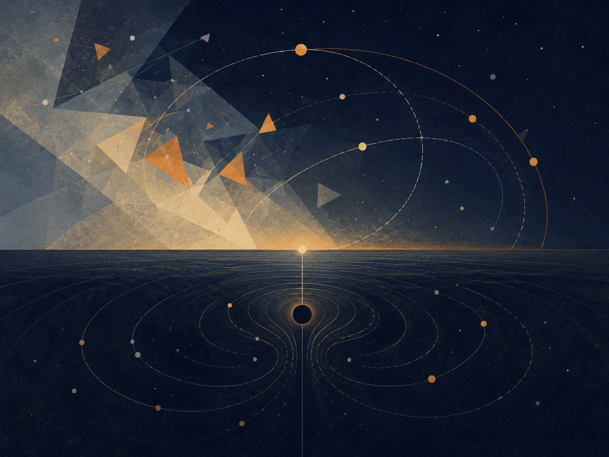

_איור ו: המדומה, הווירטואלי והאופק במודל הלוגי._

יש מילים שהשפה מחלישה עוד לפני שהמחשבה מתחילה לעבוד.

״דמיוני״ נשמע כמו דבר שאינו קיים. ״וירטואלי״ נשמע כמו דבר מזויף. ״ממשי״ נשמע כמו הדבר היחיד שמותר לקחת ברצינות.

אבל המציאות אינה בנויה לפי הנוחות של המילים. ככל שמתקרבים אל שכבותיה העמוקות יותר, מתברר שהיא אינה מחולקת בפשטות למה שיש ולמה שאין. יש בה גם מה שאינו מופיע כאובייקט, ובכל זאת בלעדיו האובייקט לא היה יכול להופיע. יש בה מה שאינו נמדד ישירות, ובכל זאת בלעדיו המדידה לא הייתה מקבלת צורה. יש בה מה שאינו ״דבר״, אבל משנה את התנאים שבהם דברים יכולים להיות.

יש להבהיר כבר בתחילת הדברים: הפרק הזה אינו משתמש במתמטיקה או בפיזיקה כהוכחה לתאוריה. הוא אינו טוען שמספרים מדומים הם ישויות מטאפיזיות, שחלקיקים וירטואליים הם שליחים נסתרים, שחור שחור הוא רוע, או שחור לבן הוא מקור הבריאה. הוא עושה דבר צנוע ומדויק יותר: הוא משתמש במבנים שבהם גם החשיבה המדויקת ביותר נאלצת להבחין בין מה שמופיע, מה שמשפיע, מה שמגביל, ומה שמאפשר הופעה.

הזהירות הזאת אינה אויבת המטאפורה. היא התנאי לכך שהמטאפורה לא תהפוך לשקר.

### המדומה

המספר המדומה אינו מספר שקרי. הוא אינו בדיחה מתמטית ואינו פנטזיה. הוא ציר נוסף של תיאור. הוא מופיע במקום שבו הציר הרגיל של הכמות אינו מספיק. הוא מאפשר לחשוב על סיבוב, מופע, תנודה, שינוי כיוון, יחס בין מה שנוכח לבין מה שעדיין אינו נוכח.

אין צורך לומר שהמספר המדומה הוא ״דבר״ בתוך העולם. די לומר דבר זהיר יותר: גם בתוך החשיבה המדויקת ביותר, הממשי לא תמיד ניתן לתיאור על קו אחד. לפעמים צריך ציר שאינו נראה כמו כמות רגילה כדי להבין תנועה ממשית.

במובן הזה, המדומה אינו ההפך מן הממשי. הוא הדרך שבה הממשי נעשה ניתן לחשיבה מעבר לציר אחד.

### הווירטואלי

גם הווירטואלי אינו פשוט ״לא אמיתי״. חלקיק וירטואלי אינו חלקיק קטן רגיל שמסתובב בעולם כמו גרגר אבק זעיר, מחכה לרגע שבו יחליט להפוך לחלקיק אמיתי. זו תמונה נוחה מדי, כמעט ילדותית מדי. הווירטואלי אינו אובייקט יציב שאפשר להצביע עליו ולומר: הנה הוא, כאן, במסלול הזה, בזמן הזה.

אבל גם אסור להפוך אותו לכלום.

דווקא משום שהוא אינו אובייקט יציב, הוא מתאים כדוגמה לזהירות הנדרשת כאן. יש הבדל בין דבר שניתן להצביע עליו לבין מבנה, שדה, תנאי או רכיב בתיאור של אינטראקציה שמשתתף בתוצאה ממשית. לא כל מה שמשפיע חייב להופיע כגוף. לא כל מה שמשנה את המאזן חייב לעמוד מולנו כחפץ.

הווירטואלי, במעמדו הזהיר ביותר, הוא שפה של לחץ אפשרי על הופעת הדבר.

או במילים פשוטות יותר:

הווירטואלי הוא לא הדבר. הוא הדרך שבה האפשרות מתחילה ללחוץ על תנאי הופעתו של הדבר.

כאן נוגעת המטאפורה בתאוריה, אבל אינה מוכיחה אותה. הווירטואלי אינו ״הפוטנציאל עצמו״. הוא אינו שם מדעי לרעיון פילוסופי. הוא דוגמה לכך שגם במקום שבו אנחנו מדברים בזהירות על המציאות, יש צורך להבחין בין אובייקט יציב לבין השפעה שאינה מתייצבת כאובייקט.

המדומה הוא שפת הכיוון. הווירטואלי הוא שפת ההשפעה. הממשי הוא שפת הסימן.

המדומה אומר: יש למערכת ציר שאינך רואה, אבל בלעדיו לא תבין את תנועתה. הווירטואלי אומר: יש השפעה שאינך רואה כאובייקט, אבל בלעדיה לא תבין את השינוי. הממשי אומר: כאן, לרגע, משהו מן האפשרות הסכים להשאיר עקבה.

### הקופסה שאינה מתרוקנת

אפשר לדמיין קופסה.

תחילה מוציאים ממנה את כל החפצים. אחר כך את האבק. אחר כך את האוויר. אחר כך, בדמיון קיצוני יותר, מוציאים ממנה כל אטום, כל חלקיק, כל דבר שאפשר לקרוא לו דבר. הקופסה נראית ריקה. אין בה גוף. אין בה חומר. אין בה סימן גלוי למשהו שמחכה בפנים.

אבל הריק הזה אינו בהכרח ״אין״.

גם כאשר לא נשאר בה אובייקט רגיל, עדיין לא נפטרנו מן התנאים. עדיין לא נפטרנו מן השדה. עדיין לא נפטרנו מן האפשרות להופעה. במובן הזה, הריק הפיזיקלי אינו זהה לאין פילוסופי. הוא אינו חדר מת. הוא אינו שלילה מוחלטת. הוא מצב שבו הדבר היציב נעלם, אך האפשרות לא נעלמה יחד איתו.

זו אינה טענה שיש בתוך הקופסה יצורים קטנים שמסתתרים וממתינים לצאת. זו בדיוק הטעות שיש להימנע ממנה. הנקודה עדינה יותר: גם כאשר מרוקנים את העולם מכל מה שנראה כמו אובייקט, לא ברור שאפשר לרוקן אותו מן הפוטנציאל להופעה.

הפוטנציאל, במובן הזה, אינו עוד חפץ בתוך הקופסה. הוא מה שנשאר כאשר כבר אין חפצים.

ולכן אי אפשר פשוט להוציא אותו החוצה.

אפשר להוציא חומר. אפשר להוציא אור. אפשר להוציא אוויר. אפשר לדמיין שמוציאים כל חלקיק וכל עקבה.

אבל אי אפשר להוציא את האפשרות כאילו הייתה דבר נוסף בין הדברים. מפני שהאפשרות אינה אחת מן התכולות של המציאות. היא אחת מן הדרכים שבהן המציאות עוד מסוגלת להיות.

זהו אחד המקומות שבהם הפוטנציאל מתגלה לא כחלל ריק שמחכה להתמלא, אלא כשכבה פעילה. הפוטנציאל אינו רק ״מה שעדיין לא קרה״. הוא אינו מחסן של אפשרויות שמונחות בצד וממתינות לתורן. הוא חי יותר מזה. הוא הכיוון שעוד לא נעשה קו. הוא ההשפעה שעוד לא נעשתה גוף. הוא האמת שעוד לא מצאה צורה מספיק יציבה כדי להיקרא בשם.

האדם רגיל להאמין רק למה שכבר השאיר סימן. הוא רוצה לראות את התוצאה, למדוד אותה, לקרוא לה, לקטלג אותה, ואז להחליט אם היא קיימת. אבל הרבה מן המציאות החשובה ביותר פועלת לפני השלב הזה. היא פועלת במקום שבו עדיין אין דבר, אבל כבר יש הטיה. עדיין אין תשובה, אבל כבר יש כיוון. עדיין אין הכרעה, אבל כבר יש מתח שמארגן את מרחב ההכרעות האפשריות.

האדם אומר: אאמין לזה כשאראה את זה. המציאות אומרת: לא היית רואה דבר אלמלא היה כבר פועל משהו שאינך רואה.

### פוטנציאל ואידיאל

כאן מתבהר היחס בין פוטנציאל לאידיאל.

הפוטנציאל אינו מחוץ למציאות. הוא אינו מעליה ואינו אחריה. הוא נמצא בתוך המציאות כשכבה שאינה תמיד נראית לה. כמו המספר המדומה בתוך מערכת מתמטית, הוא מאפשר תנועה שאי אפשר להסביר על הציר הפשוט. כמו הווירטואלי בתוך תיאור של שדה, הוא מאפשר לחשוב על השפעה שאינה מתייצבת מיד כאובייקט. וכמו כל דבר ממשי, הוא מבקש בסוף להשאיר סימן - לא מפני שהסימן הוא כל האמת, אלא מפני שבלי סימן אין לעולם דרך לדעת שהאמת עברה בו.

האידיאל, לעומת זאת, אינו כל אפשרות. הוא אינו כל מה שיכול היה לקרות. הוא אינו ההתפזרות האינסופית של הפוטנציאל לכל הכיוונים. האידיאל הוא הכיוון שבו הפוטנציאל מפסיק להיות סתם פתוח ומתחיל להיות מדויק.

אין הכרח לייחס למציאות רצון מודע כדי לדבר על אידיאל. האידיאל הוא שם למצב שבו אפשרות עוברת דרך מגבלות, מדידות, התנגדויות ועיוותים, ועדיין מצליחה להופיע בצורה שאינה מוחקת את העומק שממנו באה.

אפשר לומר זאת כך:

המדומה פותח ציר. הווירטואלי מפעיל לחץ. הממשי משאיר סימן. האידיאל הוא הופעה ששומרת רציפות עם הציר, הלחץ והתנאי שמהם נולדה.

ובמילים אחרות: האידיאל אינו בוגד בפוטנציאל שממנו בא.

### כבידה

כאן נכנסת גם הכבידה.

קל לחשוב על כבידה כעל הגבלה. היא קושרת גוף למקום. היא מונעת ממנו להתפזר בחלל כרצונו. היא אומרת לו, במובן מסוים: כאן. לא בכל מקום. לא לכל כיוון. לא בלי מחיר.

אבל זו רק חצי מחשבה.

החופש אינו מתחיל במקום שבו אין גבולות. מקום שאין בו גבולות כלל אינו בהכרח חופשי יותר; לעיתים הוא פשוט אינו מקום. הוא אינו מחזיק צורה, אינו מחזיק גוף, אינו מחזיק נשימה, אינו מחזיק בית. בלי משיכה אין קרקע. בלי קרקע אין עמידה. בלי עמידה אין בחירה בעלת משקל.

אין הכוונה שלכבידה יש רצון, מוסר או כוונה. הכבידה משמשת כאן כמבנה דוגמתי: היא מראה כיצד מגבלה יכולה להיות תנאי להיווצרות עולם, לא רק שלילת חופש. בלי קישור, מסלול ומשקל, אין מקום יציב שבו בחירה יכולה לקבל משמעות.

הכבידה, במובן הזה, אינה אויבת החופש. היא אחת הדרכים שבהן הפוטנציאל מסכים לא להישאר פתוח לכל הכיוונים בבת אחת. היא אינה שלילת האפשרות, אלא התנאי לכך שאפשרות תוכל להיעשות עולם. היא הצמצום שמאפשר צורה. היא המשקל שמאפשר למשהו להישאר מספיק זמן כדי להיות נוכח.

הפוטנציאל, כשהוא פתוח לגמרי, עדיין אינו עולם. הוא יכול להיות הכול, ולכן עוד אינו דבר. כדי להופיע עליו להסכים לאבד חלק מן הפתיחות שלו. עליו להסכים לכיוון, לגוף, למגבלה, למקום. הכבידה היא אחד השמות הפיזיים של ההסכמה הזאת: לא להיות בכל מקום, כדי להיות כאן.

אבל כל תנאי שמאפשר עולם יכול, בקצהו, גם לסגור אותו.

### חור שחור וחור לבן

החור השחור הוא הדימוי החריף ביותר לכך. לא מפני שהוא ״רע״, ולא מפני שהוא מעניש את החומר, אלא מפני שבתוכו המבנה עצמו מפסיק להציע החוצה ככיוון אפשרי. מעבר לאופק האירועים, במובן הקלאסי, העתיד אינו נפרש עוד כמניפה של נתיבים. הוא הולך ונעשה חד־כיווני.

החור השחור אינו סמל מוסרי לחוסר חופש. הוא דוגמה קיצונית למבנה שבו מרחב הכיוונים האפשריים מצטמצם עד כדי חד־כיווניות. לא מפני שמישהו אסר על היציאה, אלא מפני שהמבנה עצמו כבר אינו מציע אותה ככיוון.

שם הכבידה מפסיקה להיות רק מה שמאפשר לדברים להיקשר זה לזה, והופכת לצורה הקיצונית של קישור שאין ממנו חזרה. זהו המקום שבו הצמצום, שהתחיל כתנאי לקיום, נעשה קרוב מדי למחיקת האפשרות שלשמה נולד.

החור השחור אינו המקום שבו החופש נענש. הוא המקום שבו הגיאומטריה עצמה הפסיקה להציע כיוונים.

ומולו אפשר להעמיד, בזהירות, את דימוי החור הלבן.

לא כעובדה שמחליפה את השלם. לא כהוכחה למקור הבריאה. לא כאובייקט שצריך להעמיס עליו יותר ממה שהוא מסוגל לשאת. החור הלבן, אם משתמשים בו בכלל, צריך להישאר דימוי מוגבל: לא שם של הפוטנציאל, אלא צורה מחשבתית לחשוב דרכה על מקור שאינו ניתן לכיבוש.

אם החור השחור הוא אופק שבו העתיד נסגר פנימה, החור הלבן הוא דימוי לאופק שבו הופעה נפתחת החוצה מבלי שהמקור עצמו נעשה ניתן לאחיזה.

לכן אין לומר שהחור הלבן הוא הפוטנציאל עצמו. זה יהיה מדויק מדי במקום שבו צריך להישאר זהירים. נכון יותר לומר שהוא דימוי לאחת מתנועותיו האפשריות של הפוטנציאל: מקור שאינו נפתח לכניסה, אך משהו ממנו יכול להופיע החוצה.

הפוטנציאל אינו דבר שמגיעים אליו כמו שמגיעים למקום. האידיאל אינו חפץ שמחזיקים בו לאחר שהמסע נגמר. שניהם דומים יותר לאופקים: הם מארגנים את התנועה, מכוונים אותה, מעוותים אותה, מושכים אותה, אך אינם נמסרים בשלמותם ליד.

הכבידה מלמדת שהחופש זקוק לצורה. החור השחור מלמד שצורה יכולה להפוך לכלוב. החור הלבן, כדימוי בלבד, מזכיר שיש גם מקורות שאינם נפתחים לכניסה, אלא להופעה.

ובין שלושתם נמתחת אותה שאלה: כמה צמצום צריך הפוטנציאל כדי להפוך לעולם, ומתי אותו צמצום עצמו מתחיל למחוק את האפשרות שלשמה נולד.

### קרינת החור השחור

כאן אפשר לחזור אל קרינת החור השחור.

הדימוי הפופולרי מדבר על זוג חלקיקים וירטואליים סמוך לאופק האירועים: אחד נבלע פנימה, האחר בורח החוצה, ומתוך כך מופיעה קרינה. זה דימוי מועיל רק כל עוד זוכרים שהוא דימוי הוראה, לא תצלום של המנגנון. אם לוקחים אותו מילולית מדי, הוא מתחיל לשקר. הוא גורם לנו לחשוב שהווירטואלי הוא פשוט חלקיק קטן שהצליח ברגע מסוים להפוך לממשי.

הנקודה העמוקה יותר אינה שהווירטואלי הוא אובייקט שמתחפש ללא־אובייקט. הנקודה היא שגם מה שאינו יציב כאובייקט יכול להשתתף בתוצאה ממשית. גם מה שאינו ״דבר״ במובן הפשוט יכול להשפיע על מאזן. סביב אופק קיצוני, עצם מבנה המרחב, הזמן והשדה משנה את מה שנחשב ריק, מה שנחשב חלקיק, ומה יכול להופיע כקרינה בעיני צופה רחוק.

לא צריך לומר שהפוטנציאל ״נהיה אמיתי״ רק כשהוא בורח מן החור השחור. זה שוב מצמצם אותו. נכון יותר לומר שהמצב הקיצוני מגלה דבר שהיה נכון גם קודם: הממשי אינו מתחיל רק במקום שבו יש אובייקט. לפעמים הממשי מתחיל במקום שבו התנאים להופעה כבר השתנו.

כלומר, יש ממשות שאינה גוף. יש פעולה שאינה חפץ. יש כיוון שאינו צורה. יש השפעה שאינה עדיין אירוע, אבל האירוע כבר לא יכול להתרחש אותו דבר בלעדיה.

זה חשוב מפני שהאדם נוטה לזלזל בכל מה שעדיין לא נעשה מוצק. מחשבה שלא נוסחה עד הסוף נראית לו חלשה. תחושה שלא קיבלה הסבר נראית לו חשודה. אפשרות שלא התממשה נראית לו כמו כלום. אבל במעמקים, דווקא הדברים האלה הם לעיתים השכבה הפעילה ביותר. לא מפני שהם ״יותר אמיתיים״ מן הממשי, אלא מפני שהם קודמים לו בצורה שאינה קודמת בזמן בלבד. הם קודמים לו במבנה.

### אופקי אירועים של אמון

חור שחור אינו משמש כאן כמטאפורה לרוע מוחלט, אלא לגבול שבו מידע אמיתי כבר אינו מצליח לצאת אל מערכת הייחוס החיצונית. אופק אירועים מוסרי הוא הגבול שבו אדם, מוסד, רעיון או קהילה יכולים להשתנות, אבל העולם כבר אינו מסוגל לקבל את השינוי כמידע חדש.

אדם לאחר פגיעה קשה, מערכת יחסים לאחר בגידה, מוסד לאחר שערורייה, חברה לאחר קריסה כלכלית, קהילה לאחר אלימות, או שפה לאחר שקר מתמשך - כולם יכולים להיתקל באותו מבנה: לא בהכרח היעדר שינוי, אלא היעדר תווך שדרכו השינוי יכול להיקרא כשינוי.

הדיוק המוסרי חשוב: החוץ אינו תמיד חייב לקבל. לפעמים הסירוב הוא הגנה, לפעמים הנזק היה אמיתי מדי, ולפעמים אי־האמון הוא חלק מן המחיר. תיקון שאינו גאולה אינו מבטיח חזרה אל החוץ; הוא רק מסרב לתת לעבר להיות כל מה שקיים בפנים.

### אלוהים, השלם, והזהירות בשם

אם רוצים להשתמש בשם ״אלוהים״, יש לעשות זאת באותה זהירות שבה משתמשים בכל שם גדול מדי.

לא אלוהים כיד שמזיזה חלקיקים מאחורי הקלעים. לא אלוהים כמפעיל מכני של ניסים. לא אלוהים כדמות העומדת מחוץ לעולם ומתקנת אותו מבחוץ.

אלא אלוהים כאחד השמות האפשריים לשלם: למבנה שבו הפוטנציאל אינו מתבזבז, אלא מחפש את צורתו המדויקת ביותר דרך כל שכבות ההופעה. שם אחר לכך יכול להיות השלם. שם אחר יכול להיות מקור. שם אחר יכול להיות התנועה שבין פוטנציאל לאידיאל. השם חשוב פחות מן הזהירות שלא להפוך אותו לפסל.

המספר המדומה אינו מחשבתו של אלוהים. החלקיק הווירטואלי אינו פעולתו של אלוהים. הכבידה אינה רצונו של אלוהים להגביל חופש. החור השחור אינו עונשו של אלוהים. החור הלבן אינו גופו של אלוהים.

אבל אפשר לומר בזהירות:

במדומה, המציאות מגלה שיש לה עוד כיוון לחשוב בו. בווירטואלי, המציאות מגלה שיש לה דרך להשפיע לפני שהיא מופיעה. בכבידה, המציאות מגלה שחופש זקוק לצורה. באופק, המציאות מגלה שכל צורה יכולה להפוך לגבול. בממשי, המציאות מגלה מה מכל זה הצליח לעבור אל העולם.

אין לזהות את הדוגמאות עם התאוריה עצמה. הן אינן יסודותיה אלא מראותיה. המדומה, הווירטואלי, הכבידה, החור השחור והחור הלבן אינם מוכיחים את הפוטנציאל או את האידיאל. הם רק מראים, כל אחד בשפתו, שהמציאות אינה עשויה רק מדברים שכבר נראים. יש בה גם כיוונים, לחצים, גבולות ואופקים; ויש רגעים שבהם דווקא מה שאינו ניתן לאחיזה ישירה קובע את צורתו של מה שכן מופיע.

ואולי האידיאל הוא הרגע שבו כל השכבות האלה אינן סותרות עוד זו את זו.

הרגע שבו הכיוון הסמוי, ההשפעה הבלתי־יציבה, המשקל, הגבול, והסימן הנראה, מתיישרים מספיק כדי שדבר יוכל להיות לא רק קיים, אלא מוצדק בקיומו.

לא מוצדק מבחוץ. לא מאושר על ידי צופה. לא מוכח אחת ולתמיד.

אלא מוצדק במובן העמוק יותר: שהוא אינו בוגד בפוטנציאל שממנו בא.

חזרה לתוכן עניינים

## אופקי גבול

*מידע, ראות ומה שאינו חוזר*

_תיאור תמונה: גבול שאינו קיר בלבד, אלא אופק שמכוון את היחס בין אפשרות לצורה._

### מה שנראה, מה שמוסתר, ומה שאסור להסיק מהר מדי

אופקי גבול הם אחד הכלים המרכזיים של התאוריה. אופק אינו רק קצה. הוא יחס בין צופה, כלי, מצב ומרחב אפשרויות. מה שנמצא מעבר לאופק אינו בהכרח לא קיים; הוא רק לא ניתן לפעולה ישירה באותו רגע. ההבחנה הזו חשובה בחינוך, משפט, רפואה, פיזיקה, AI, יצירה וממשל.

הכשל העמוק הוא בלבול בין אי־נגישות לבין אי־קיום. תלמיד שלא מבין עדיין אינו “לא מסוגל”. ראיה שלא נמצאה אינה מוכיחה שלא התרחש אירוע. כאב שלא הופיע בבדיקה אינו נעלם. תופעה קוסמולוגית מעבר לאופק אירועים קוסמי אינה מופרכת משום שאיננו רואים אותה. מצד שני, מעבר לאופק אינו רישיון להמציא. אופק דורש ענווה כפולה: לא למחוק ולא לפנטז.

מפת היחס: פעולה תחת אופק = מה שניתן לראות × כלי אמין × הכרה במגבלה × סימון אי־ודאות × אפשרות תיקון / יומרת ודאות × השלכה × פחד × עצלות × סמכות שמסתירה את תנאיה. זו מפת אחריות: כיצד לפעול בלי להעמיד פנים שהעולם נגמר בגבול הכלי.

במדע, אופקי גבול מופיעים במכשירים, אנרגיות, רזולוציה, תצפית וקוסמולוגיה. בפיזיקה של חורים שחורים, אופק אירועים הוא גבול שבו מידע ואפשרות פעולה מקבלים משמעות אחרת עבור צופה חיצוני. בקוסמולוגיה, אופק אירועים קוסמי מציב גבול למה שיכול אי פעם להשפיע או להיראות. אלה מושגים פיזיקליים, לא קישוטים; השימוש בהם בתאוריה חייב להיות מבני וזהיר.

במשפט, אופק הראיות קובע מה ניתן להכריע באחריות. בחינוך, אופק הבנה קובע איזה מרחק ניתן לשאת. ברפואה, אופק אבחנה קובע מה יודעים, מה חושדים, ומה צריך לבדוק. ב־AI, אופק ההסבר קובע האם מערכת יכולה להיות כלי אמין או קופסה שמתחפשת לסמכות.

אופקי גבול מתחברים לקצה הרקורסיבי מפני שכל אופק שנזז מגלה אופק נוסף. אין נקודת סיום שבה כל ההסתרה נעלמת. אבל גם אין סיבה לייאוש: עצם סימון הגבול הופך את הפעולה למוסרית יותר. האדם אינו נדרש לדעת הכל; הוא נדרש לא לשקר לגבי מה שאינו יודע.

### משמעת מקורות

מקורות עבודה וזהירות: הפרק נשען על מסגרת התאוריה, ועל מקורות רקע כלליים שנבדקו מחוץ לפרומפט: UNESCO על בינה מלאכותית בחינוך, WHO על אתיקה וממשל של AI בבריאות, NIST AI RMF לניהול סיכוני AI, CERN/ATLAS על המודל הסטנדרטי וה-Higgs, NASA ו-ESA/Planck על קוסמולוגיה, Stanford Encyclopedia of Philosophy על Bell, Kochen-Specker וקונטקסטואליות, ו-Britannica/ISFDB לזיהוי ספרותי של Harlan Ellison ו-I Have No Mouth, and I Must Scream. המקורות אינם מוכנסים כהוכחות לתאוריה אלא כבלמים נגד שימוש ריק במונחים.

חזרה לתוכן עניינים

## 14. מסה־אנרגיה ותווך - דימוי מדויק, לא הוכחה

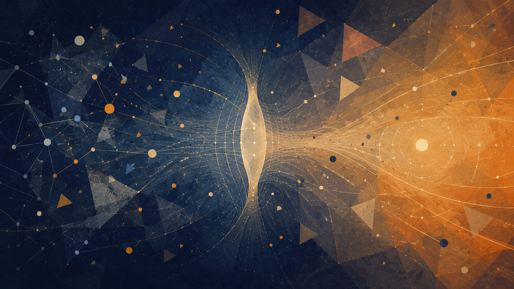

_איור פרק: מסה־אנרגיה, תווך ודימוי מדויק שאינו הוכחה_

החלק הזה אינו טוען שפיזיקה מוכיחה את התאוריה. היחס בין מסה לאנרגיה אינו הופך למשפט מוסרי, ומשוואה אינה קיצור דרך אל מטאפיזיקה. השימוש כאן הוא מבני וזהיר: הפיזיקה מספקת שפה שבה מה שנראה כחומר ומה שנראה כפעולה אינם בהכרח עולמות מנותקים, אלא אופני הופעה שונים של מבנה עמוק יותר בתנאים שונים.

אפשרות אינה תוצאה. כדי שאפשרות תופיע כמשהו בעולם היא צריכה תנאי הופעה: צורה, גבול, מדידה, יחס, זמן ותווך. בלשון התאוריה, פוטנציאל שאינו עובר דרך תנאים נשאר רחב מדי מכדי להיות אחראי. הוא יכול להכיל הכול, אבל עדיין לא לשאת משקל. משקל כאן אינו רק פיזיקלי; הוא גם שם מטאפורי לתוצאה, למחיר, למחויבות וליכולת להשפיע על אחר.

יש להיזהר מן המשפט הגס שלפיו חומר הוא פשוט ״אנרגיה שהתעבתה״. ניסוח מדויק יותר הוא שמערכות חומריות מסוימות, בתנאים מסוימים, יכולות לשמש תווך המשנה את אופן מעבר האנרגיה דרכן: הן קולטות, מפזרות, מסננות, מאחסנות, מחזירות או מכוונות. בתאוריה, זה הופך לדימוי של אדם כתווך: לא גוף שמסדר אנרגיה באופן פיזיקלי ישיר, אלא חיים שמסוגלים לעבד את מה שעובר דרכם - כאב, זיכרון, פחד, רצון, אהבה ואחריות.

מכאן ההבדל בין חומר כתוצאה לבין חומר כתווך. הגוף הוא תוצאה של תהליכים פיזיקליים, אך בחיים הוא גם המקום שבו תהליכים נעשים משמעותיים. הוא אינו רק גבול; הוא מקום שבו גבול יכול להפוך לביטוי. הוא היד הכותבת, הקול העונה, מערכת העצבים הזוכרת, העייפות שמכריחה אמת, והפצע שממנו יכולה להיוולד זהירות מוסרית.

גם כאן נדרש איזון בין נבדלות לתהודה. בתוך שפת התאוריה, הבדל הוא תנאי לכך שצורה תוכל להופיע בלי שהכול יקרוס לאותו דבר; אך נדרשת גם אפשרות של תהודה, כדי שההבדל לא יהפוך לבידוד מוחלט. האידיאל אינו מחיקה של הבדל, אלא מצב שבו הבדל נשאר מובחן ובכל זאת נעשה אחראי ליחס.

כאשר מחזירים זאת לשפה האנושית, האידיאל אינו אור שלא פגש חומר. אור שלא פגש התנגדות נשאר בלתי נבחן; חומר שחוסם כל אור נעשה אטימות. התווך החי הוא המקום שבו מעבר נעשה אחראי: הוא מקבל בלי להיבלע, מסנן בלי למחוק, מעצב בלי לזייף, ומחזיר את מה שעבר דרכו כמשהו מדויק יותר.

אם מתרגמים את המבנה הזה לשפה הטלאולוגית של התאוריה, ולא כטענה עובדתית על היקום, אפשר לומר: השלם הופך את עצמו לכלי התיקון של עצמו. הוא נעשה גוף, תווך, חיכוך, זיכרון ואחריות, כדי שפוטנציאל לא יישאר רק אפשרי, וכדי שאור לא יישאר רק מפוזר.

חזרה לתוכן עניינים

## 15. מפת השוואות פיזיקלית — פוטנציאל, צורה והתיאוריות שמנסות לאחד את הפיזיקה

*ממרחב־זמן כצורה אל פוטנציאל כקרקע עמוקה יותר*

_מפת השוואות פיזיקלית. קוונטים, יחסות, אופק ומידע כשפות שונות של אותו מתח בין פוטנציאל וצורה._

הפרק הזה אינו מציע פיזיקה חדשה במקום פיזיקה מתמטית. הוא מציע מפה מושגית: כיצד יחסות, קוונטים, מידע, אופקים וסינגולריות מאירים את היחס בין פוטנציאל, צורה, תווך וקריאות.

### עמוד השדרה הפיזיקלי

יחסות כללית מראה שחומר ואנרגיה אינם רק נמצאים בתוך במה ניטרלית; הם מעצבים את הבמה עצמה. דרך התאוריה, זו שפה שבה פוטנציאל חומרי־אנרגטי מקבל קריאות כגיאומטריה.

מכניקת הקוונטים מתארת פוטנציאל המתפתח בזמן ונסגר לתוצאה קריאה במדידה, אך אינה מסבירה לבדה את מנגנון הסגירה. לכן התאוריה קוראת את המדידה כרגע מעבר מפוטנציאל לצורה, לא כפתרון לבעיה הפיזיקלית.

באבולוציה קוונטית סגורה, מידע אינו אמור להימחק. דרך התאוריה: מידע שלא ניתן לקרוא אינו בהכרח מידע שנמחק; הוא עשוי להישמר כיחס, עקבה או קורלציה.

בעיית הזמן וסקאלת פלאנק מצביעות על המקום שבו הזמן והמרחב־זמן עצמם עשויים לא להיות הקרקע האחרונה, אלא צורות קריאות של שכבה עמוקה יותר. כדי לבחון מרחק קטן יותר נדרשת, בסדר־גודל, אנרגיה גבוהה יותר: Δx ≈ ℏc/E. אך אנרגיה מרוכזת היא גם מקור כבידתי, עם רדיוס שוורצשילד r_s(E)=2GE/c^4. כאשר Δx נעשה מאותו סדר גודל של r_s, מתקבל E²≈ℏc⁵/(2G), כלומר גבול מסדר גודל של אנרגיית פלאנק ואורך פלאנק. לכן סקאלת פלאנק אינה מוצגת כאן כפיקסל מוכח של המציאות, אלא כגבול שבו המדידה עצמה מפסיקה להיות שקופה: הניסיון לראות את הקטן ביותר עלול לייצר אופק שמסתיר אותו.

גם באופק האירועים מופיע גבול דומה, אך מסוג אחר. בקואורדינטות שוורצשילד מופיע הגורם (1 - r_s/r)⁻¹, ולכן ב־r = r_s נדמה שהחישוב מגיע לחלוקה באפס. אך אינווריאנט העקמומיות K = 48G^2 M^2/(c^4 r^6) נשאר סופי באופק ומתבדר רק ב־r = 0. לכן האופק אינו בהכרח המקום שבו המציאות נשברת, אלא המקום שבו מערכת הקואורדינטות הרגילה מפסיקה להיות מפה טובה. מעבר לקואורדינטות Eddington-Finkelstein או Kruskal-Szekeres אינו מבטל את החור השחור ואינו פותר את הסינגולריות המרכזית; הוא מראה שמה שאינו נגיש מתוך מפה אחת עשוי להיות נגיש מתוך מפה אחרת. בתוך התאוריה, זו אינה מטאפורה חופשית אלא לקח מבני: לפעמים הפוטנציאל אינו עוד אפשרות בתוך אותה מערכת, אלא האפשרות להחליף מערכת.

חורים שחורים מראים שהאופק אינו פרט שולי. הגבול עצמו נעשה המקום שבו מידע, שטח, אנטרופיה וקריאות נפגשים. התאוריה אינה פותרת את פרדוקס המידע; היא רק מבחינה בין מחיקה לבין אובדן צורה קריאה.

מידע ושזירה מראים שמידע אינו רק תוכן באובייקט, אלא יחס בין חלקים ובין קוראים. הקוסמולוגיה מזכירה שהריק אינו בהכרח ריק, אבל התאוריה אינה מסבירה כמותית את אנרגיית הוואקום או את הקבוע הקוסמולוגי.

### מה כן ומה לא

התאוריה כן מציעה קריאה מושגית: מרחב־זמן אינו בהכרח הקרקע האחרונה; סינגולריות היא גבול הצורה; יחס קודם למקום; וזמן, סיבתיות ומדידה הם צורות קריאות של פוטנציאל עמוק יותר.

התאוריה אינה מציעה עדיין משוואת כבידה קוונטית, מנגנון מדידה מלא, הסבר כמותי לאנרגיית הוואקום, זיהוי של חומר אפל, הסבר מלא לאנרגיה אפלה או הכרעה בין מיתרים, לולאות, causal sets, CDT והולוגרפיה.

לכן התרומה כאן אינה “פתרון הפיזיקה”, אלא שינוי שכבה: לא להכניס את הפוטנציאל לתוך אידיאל קיים, אלא לשאול כיצד האידיאל הפיזיקלי עצמו - מרחב, זמן, חומר, כוח ומדידה - נולד מתוך פוטנציאל.

חזרה לתוכן עניינים

## מבנה היקום / צורת היקום וצורת הפוטנציאל

*אופק, חלקיות, אינסוף, צורה ואחריות בתוך גבול*

_תיאור תמונה: אופק, חלק גלוי וחלק נסתר, ומרחב אפשרויות שאינו נגיש כולו מנקודת מבט אחת._

הפרק הזה אינו מבקש להוכיח את התאוריה דרך היקום. צורת היקום אינה צורת הפוטנציאל, וקוסמולוגיה אינה מטפיזיקה מוסרית. אבל השפה הקוסמולוגית מלמדת משהו שהתאוריה זקוקה לו: איך לחשוב, לבחור ולפעול מתוך אופק, כאשר החלק הנראה אינו כל המערכת, כאשר המקומי אינו מכריע לבדו את הגלובלי, וכאשר גבול של גישה אינו בהכרח שקר, כלא או סוף.

אין לנו מבט מחוץ ליקום, כשם שאין לאדם מבט מחוץ לחייו. כל ידיעה מתחילה מתוך מקום: זמן, גוף, כלים, שפה, מדידה ומגבלה. לכן האופק אינו רק מה שמונע מאיתנו לדעת. הוא גם הצורה שבתוכה ידיעה אנושית יכולה להתחיל.

במובן הזה, קוסמולוגיה אינה מעניקה לתאוריה סמכות חיצונית. היא אינה אומרת שהפוטנציאל הוא יקום, שהאידיאל הוא צורה קוסמית, או שאופטימלי הוא פתרון גאומטרי. היא מלמדת משמעת אחרת: פעולה אחראית אינה מחכה למבט מוחלט. היא פועלת מתוך חלקיות שמכירה בעצמה כחלקיות.

### 1. היקום הנראה אינו היקום כולו

היקום הנראה הוא החלק שממנו אותות יכלו להגיע אלינו לאורך ההיסטוריה הקוסמית, בהתחשב בגיל היקום ובהתפשטות המרחב. הוא אינו בהכרח כל היקום. זה לא אומר שאנו יודעים בוודאות מה נמצא מעבר לו; זה אומר שאין לזהות את גבול הגישה שלנו עם גבול המציאות עצמה.

המשפט הזה חשוב לתאוריה: האופק אינו שקר, אבל גם אינו כל האמת. הוא גבול של גישה. הוא אומר מה יכול להופיע לנו, מה יכול להימדד מכאן, ומה נותר מחוץ לטווח התצפית שלנו. אדם, חברה, רופא, שופט, מורה או מערכת AI אינם פועלים מתוך השלם. הם פועלים מתוך מה שנגיש להם, ומה שנגיש אינו בהכרח כל מה שיש.

לכן מקור חי אינו חלש מפני שהוא מוגבל. הוא חי מפני שהוא ממוקם. הוא אינו יודע למרות שהוא בתוך אופק; הוא יודע מתוך היותו בתוך אופק. הגוף, הזמן, הזיכרון, השפה, הכלים והמרחק אינם רק הפרעות לידיעה. הם גם התנאים שבהם ידיעה יכולה לקבל צורה.

כאן הפוטנציאל מקבל משמעות מדויקת יותר: הוא אינו רק “כל האפשרויות”, אלא מרחב האפשרויות שאינו נגיש כולו מתוך אופק אחד. כל מקור חי פוגש רק חלק מן האפשרי, אך עליו לפעול כאילו החלק הזה מספיק להתחלה ולא מספיק לסגירה.

### 2. אופקים שונים, לא אופק אחד פשוט

המילה “אופק” נשמעת פשוטה, אבל בקוסמולוגיה היא אינה מונח יחיד. יש אופק חלקיקים, הקשור למה שיכול היה להגיע אלינו מאז ראשית הזמן; יש אופק אירועים קוסמולוגי, הקשור למה שאולי לעולם לא נוכל לקבל ממנו אותות בעתיד, בהתאם למודל ההתפשטות; יש רדיוס האבל, הקשור לקצב ההתפשטות הנוכחי אך אינו זהה תמיד לאופק התצפיתי; ויש היקום הנראה, שהוא תחום הגישה התצפיתית שלנו בפועל.

הפרק הזה אינו צריך ללמד את כל ההבדלים הטכניים האלה לעומק. הוא כן חייב להיזהר לא להפוך “אופק” למילה קסומה אחת. כאן אופק משמש בעיקר כשפה של גישה חלקית: מה יכול להופיע, מה יכול להימדד, מה תלוי במודל, ומה נשאר מחוץ למסגרת הנוכחית.

הדיוק הזה חשוב מפני שגם בתאוריה אין אופק אחד בלבד. יש אופק רגשי, אופק מוסרי, אופק לשוני, אופק טכנולוגי, אופק משפטי, אופק רפואי, אופק חינוכי ואופק חישובי. כל אחד מהם פותח אפשרויות מסוימות וסוגר אחרות. כל אחד מהם יכול להתרחב, אבל אף אחד מהם אינו נעשה מבט אלוהי.

האידיאל אינו ביטול כל אופק. אידיאל כזה היה פנטזיה של שליטה מוחלטת. האידיאל הוא בירור ראוי של האפשרי בתוך אופקים ממשיים. האופטימלי הוא התרגום המקומי של הבירור הזה לתוך המצב שבו אנו באמת נמצאים.

### 3. תצפית, סימן ומודל

קוסמולוגיה אינה מחזיקה צילום ישיר של השלם. היא בונה מסקנות מתוך סימנים: אור, קרינה, תנועה, הסחה לאדום, התפלגות גלקסיות, עדשות כבידתיות, קרינת רקע קוסמית, מודלים והנחות שנבדקות שוב ושוב. הידע הקוסמולוגי הוא יחס בין תצפית, מודל, כלי, תיקון ואי־ודאות.

גם כאשר מדברים על קרינת הרקע הקוסמית, אין מדובר במבט ישיר אל “רגע האפס”. מדובר בעקבות קדומות מן התקופה שבה היקום נעשה שקוף לקרינה. כלומר, גם הידע הקדום ביותר שלנו על היקום מגיע כסימן שעבר זמן, מרחק, התפשטות, מדידה ופרשנות.

זה מחבר את הקוסמולוגיה לתאוריה דרך מושג המרחק. מרחק אינו רק הפרדה. בקוסמולוגיה, לראות רחוק פירושו גם לראות אחורה בזמן. הידיעה אינה נוגעת בדבר עצמו באופן מיידי; היא פוגשת עקבה, סימן, אור שהגיע מאוחר, ותמונה שנבנית דרך מודל.

לכן גם בתאוריה, ידיעה אינה שליטה מוחלטת בדבר. היא תרגום אחראי של סימנים בתוך אופק. מקור חי אינו מחזיק את האמת כאובייקט שלם ביד. הוא פוגש עדויות, בונה מודלים, מתקן, נכשל, וממשיך לפעול תחת אי־ידיעה.

### 4. שאלה על צורה היא גם שאלה על גישה

כאשר שואלים על צורת היקום, לא שואלים רק “איזו צורה יש שם?”. שואלים גם: מה ניתן למדוד? מה מוסק דרך מודל? מה תלוי בהנחות? מה נגיש לנו מתוך המקום שלנו? ומה נשאר מעבר לאופק התצפית?

זו נקודה מרכזית לתאוריה: צורה אינה רק מבנה של הדבר עצמו. צורה היא גם מבנה הגישה שלנו אליו. מה שמופיע לנו תלוי גם במה שיש, גם בכלים שלנו, גם במיקום שלנו, וגם בשפה שבה אנו מפרשים את הסימנים.

לכן “צורת הפוטנציאל” אינה רשימת כל האפשרויות. היא גם מבנה הגישה לאפשרויות: מה מופיע, מה נסתר, מה ניתן לבדיקה, מה ניתן למימוש, מה ראוי לסינון, ומה נשאר מעבר ליכולת ההכרעה הנוכחית.

הפוטנציאל אינו נעלם כאשר הוא מקבל צורה. אבל כל צורה היא גם בחירה. היא הופכת חלק מן האפשרי לקריא, וחלק אחר לעמום. זהו אותו עיקרון שפגשנו בחישוב: כדי לפעול צריך ייצוג, וכל ייצוג פותח אפשרות וגובה מחיר.

### 5. שטוח, מקומר, פתוח וסגור: מילים מדויקות, לא דימויים חופשיים

במובן הקוסמולוגי, “שטוח” אינו אומר שטחי, פשוט, דו־ממדי או חסר עומק. הוא מתייחס לעקמומיות מרחבית במסגרת מודל מדידה. גם “מקומר”, “פתוח” ו“סגור” אינם מילים חופשיות שאפשר להעביר ישירות למטפיזיקה או למוסר.

יקום שטוח אינו בהכרח יקום פשוט, ואינו בהכרח אינסופי. יקום סופי אינו בהכרח יקום עם קצה פשוט. יקום חסר גבול אינו בהכרח חסר צורה. מילים שנשמעות יומיומיות מקבלות בקוסמולוגיה משמעות מדויקת, ולכן שימוש פילוסופי בהן דורש זהירות.

הלקח לתאוריה אינו “הפוטנציאל שטוח” או “האידיאל מקומר”. אלה יהיו קפיצות ריקות. הלקח הוא ששפה מדויקת משתנה לפי התחום שבו היא פועלת. מילה יכולה להיראות מוכרת, אבל לשאת עבודה אחרת לגמרי בתוך מדע.

משמעת גבול מתחילה בדיוק כאן: לא לקחת מונח מדעי מפני שהוא יפה, אלא לשאול מה הוא עושה, מה תחום התוקף שלו, ומה אסור לו לטעון מחוץ למסגרת שלו.

### 6. עקמומיות וטופולוגיה: מקומי אינו גלובלי

עקמומיות שואלת כיצד המרחב נמדד. טופולוגיה שואלת כיצד הוא מחובר. אלה אינן אותה שאלה. אפשר שמרחב ייראה שטוח מקומית, ועדיין תהיה לו טופולוגיה גלובלית שאינה פשוטה. אפשר שהמקומי לא יכריע לבדו את השלם.

זהו אחד השיעורים העמוקים ביותר שהקוסמולוגיה יכולה לתת לתאוריה: מה שנראה מתוך אופק מקומי אינו כל המבנה. המקומי אמיתי, אבל הוא לא בהכרח שלם. תצפית מקומית יכולה להיות מדויקת מאוד, ועדיין לא לסגור את השאלה הגלובלית.

כך גם בחיים. אדם יכול לראות אמת מקומית ולא להבין את כל המבנה שבתוכו היא פועלת. מערכת משפט יכולה להחזיק ראיות מסוימות בלי לראות את כל הסיפור. רופא יכול לראות סימנים בלי לדעת את כל העתיד הקליני. AI יכול לזהות דפוס בתוך דאטה בלי לדעת את המקור החי שממנו הדאטה הגיע.

האופטימלי אינו מתכחש למקומי. הוא גם אינו הופך אותו למוחלט. הוא שואל: מה ניתן לעשות באחריות מתוך המקומי, בלי לשקר שהוא הגלובלי?

### 7. סופיות, אינסוף וחוסר גבול

סופיות, אינסוף וחוסר גבול אינם אותה טענה. מרחב יכול להיות סופי וחסר גבול; הוא יכול להיות אינסופי ועדיין בעל מבנה; והוא יכול להיות מעבר לאופק שלנו בלי להפוך להזמנה לומר עליו כל דבר.

זו הבחנה חשובה מפני שהמילה “אינסוף” מפתה את הדמיון. היא יכולה להישמע כמו חופש מוחלט, עומק מוחלט, אפשרות מוחלטת. אבל אינסוף אינו אידיאל. אינסוף אפשרויות אינו אינסוף ערך. אינסוף וריאציות אינו אינסוף משמעות.

גם פוטנציאל אינו רק כמות. פוטנציאל גדול יותר אינו בהכרח פוטנציאל ראוי יותר. אם כל אפשרות מקבלת ערך רק מפני שהיא אפשרית, אין עוד אידיאל אלא רעש. התאוריה מתנגדת לזה: פוטנציאל הוא שדה האפשרי, אבל אידיאל הוא בירור של מה שראוי להתממש.

לכן חוסר גבול אינו מספיק. גם מרחב חסר גבול דורש צורה של אחריות. השאלה אינה רק כמה אפשרויות קיימות, אלא אילו אפשרויות ראויות, באילו תנאים, עבור מי, ובאיזה מחיר.

### 8. מולטיברס ואומניברס: אפשרות אינה ערך

מולטיברס אינו מונח יחיד שמצביע על תאוריה אחת מוכחת. זהו שם־גג לרעיונות שונים, ספקולטיביים בדרגות שונות, שחלקם פיזיקליים יותר וחלקם פרשניים יותר: אינפלציה נצחית, נוף מיתרים, פרשנות העולמות המרובים במכניקת הקוונטים, יקומים עם תנאי התחלה שונים, ועוד. הם אינם כולם באותה רמת תוקף, ואינם כולם אותה טענה.

אומניברס, לעומת זאת, אינו מונח קוסמולוגי תקני באותה מידה. אם משתמשים בו, יש להציג אותו כמונח תרבותי, בדיוני או מטאפורי למרחב כולל של אפשרויות, לא כטענה מדעית.

לכן מולטיברס ואומניברס יכולים להופיע כאן רק בזהירות, כשפה על ריבוי אפשרויות, לא כהוכחה לריבוי ממשי של עולמות ולא כהיתר מוסרי לכל אפשרות. ככל שמרחב האפשרויות גדל, כך גדלה האחריות לסינון.

כאן החיבור לתאוריה חד: הרחבת האפשרי אינה הרחבת הראוי. יותר אפשרויות אינן יותר אמת. יותר עולמות מדומיינים אינם יותר עומק. אידיאל אינו נובע מכמות האפשרויות, אלא מן הבירור שמבחין בין אפשרות לבין אפשרות ראויה.

### 9. צורת הפוטנציאל אינה גאומטריה אלא יחס

צורת הפוטנציאל אינה צורה גאומטרית של היקום. היא אינה עיגול, קו, משטח, עקמומיות, טופולוגיה, או מודל קוסמולוגי. היא שם ליחס בין אפשרויות, גבולות, אופקי גישה, חוקיות מקומית, מרחק, סינון, בחירה ותרגום מקומי.

היא שואלת: מה יכול להופיע? מה נשאר מעבר לאופק? מה ניתן למדידה? מה ניתן למימוש? מה רק ניתן לדמיון? מה ראוי להיבחר? מה צריך להידחות? ומה קורה כאשר אופק אחד נפתח ומגלה אופק נוסף?

במובן הזה, צורת הפוטנציאל היא מבנה מוסרי־קיומי ולא מבנה אסטרונומי. הקוסמולוגיה אינה מוכיחה אותה, אבל היא עוזרת לדבר עליה בלי להפוך אותה לרעיון חסר גבול. היא מזכירה שכל אפשרות מופיעה בתוך תנאים, ושכל תנאי גם מגביל וגם מאפשר.

פוטנציאל ללא גבול הופך לרעש. אידיאל ללא פוטנציאל הופך לדוגמה ריקה. אופטימלי ללא אופק הופך ליומרה. הפרק הזה מנסה להחזיק את שלושתם יחד: מרחב האפשרי, בירור הראוי, ופעולה מקומית שאינה טוענת שהיא רואה הכול.

### 10. AI כמרחב אפשרויות מלאכותי

AI אינו מולטיברס, ואינו קוסמולוגיה. אבל הוא יכול לשמש מטאפורה חזקה למרחב אפשרויות מלאכותי: הרבה תמונות, הרבה טקסטים, הרבה פתרונות, הרבה וריאציות, הרבה עולמות אפשריים שנוצרים במהירות.

כאן מופיעה הסכנה: יותר אפשרויות יכולות להפוך לפחות הבנה. AI אינו רק מרחיב אופק; הוא גם יכול להציף אותו. אם אין סינון, מקור, עדות, הקשר ואחריות, מרחב האפשרויות נעשה רעש משכנע.

הבעיה של הפוטנציאל אינה תמיד מחסור באפשרויות. לפעמים הבעיה היא עודף אפשרויות ללא בירור. לא כל תמונה שנוצרה ראויה להיכנס למסמך. לא כל ניסוח אפשרי מחזק תאוריה. לא כל עולם שניתן לדמיין ראוי להיבנות. לא כל תשובה שנשמעת עמוקה נושאת מקור.

האופטימלי ב־AI אינו “לייצר כמה שיותר”. הוא לבחור, לבדוק, לסנן, לשאת מקור, להכיר בגבול, ולהחזיר אחריות לאדם. זה בדיוק ההבדל בין פוטנציאל לבין אידיאל: האפשרי מתרבה מעצמו; הראוי דורש עבודה.

### 11. הקצה הרקורסיבי: כל אופק פותח אופק

כל הרחבת מבט יוצרת גבול חדש. כל “מעבר לאופק” הופך לאופק נוסף. כל מודל של היקום פותח שאלות על תנאיו, גבולותיו, הנחותיו ומה שאינו יכול לראות. אין נקודת מבט אנושית שסוגרת את כל צורת הפוטנציאל.

זה אינו כישלון של המחשבה. זהו המבנה שבו מחשבה חיה. אם היה מבט מוחלט שסוגר הכול, לא היה עוד מרחק, לא הייתה למידה, לא הייתה אחריות, ולא הייתה אפשרות של תיקון.

הקצה הרקורסיבי אינו אומר שאין אמת. הוא אומר שכל אמת אנושית נושאת אופק. היא יכולה להתרחב, להתחדד, להשתנות, להיפתח, אבל היא אינה נעשית אלוהים. כל תשובה אחראית משאירה אחריה גבול חדש שבו מתחילה אחריות חדשה.

לכן התקווה של התאוריה אינה תקווה לראות הכול. זו תקווה לפעול טוב יותר מתוך אי־ראיית הכול. לא להכחיש את האופק, ולא להפוך אותו לכלא. להכיר בו כתנאי שממנו צורה יכולה להופיע.

### 12. סיום: לא כל אופק הוא כלא

צורת הפוטנציאל אינה גאומטריה של היקום. היא אינה עיגול, קו, עקמומיות או טופולוגיה. היא יחס חי בין אפשרויות, גבולות, אופקי גישה, סינון, בחירה ואחריות. הקוסמולוגיה אינה מוכיחה את היחס הזה, אבל היא מלמדת אותו דרך שפה חזקה: אין מבט מוחלט, אין פעולה בלי אופק, ואין צורך לראות הכול כדי לפעול באחריות.

האדם אינו פועל מחוץ ליקום, ואינו בוחר מחוץ לפוטנציאל. הוא פועל מתוך אופק. לכן האידיאל אינו מבט אלוהי, אלא בירור ראוי של האפשרי בתוך חלקיות. והאופטימלי הוא הצורה המקומית שבה אחריות כזאת יכולה להיעשות ממשית.

לא כל אופק הוא כלא. לפעמים אופק הוא התנאי שמאפשר לצורה להופיע בלי לשקר שהיא הכול.

### משמעת מקורות

מקורות עבודה וזהירות: הפרק נשען על מסגרת התאוריה ועל מקורות קוסמולוגיים כלליים ואמינים כגון NASA, ESA/Planck, WMAP, וחומרי הסבר אוניברסיטאיים על היקום הנראה, קרינת הרקע הקוסמית, עקמומיות, טופולוגיה ואופקים קוסמולוגיים. מקורות אלה אינם מוכיחים את התאוריה; הם משמשים כבלמים נגד שימוש ריק או מטעה במונחים אסטרונומיים.

חזרה לתוכן עניינים

## פיזיקה באנרגיות גבוהות

*סקאלה, הופעה, שדה, עדות ואחריות בתחום תוקף*

_תיאור תמונה: עקבות, מסלולים, סקאלה ושדה ניסויי מופשט כגבול של הופעה ומדידה._

הפרק הזה אינו מבקש להוכיח את התאוריה דרך פיזיקה באנרגיות גבוהות. הוא אינו אומר שהפוטנציאל הוא אנרגיה, שהאידיאל הוא סימטריה מושלמת, או שהאופטימלי הוא איחוד פיזיקלי של כל הכוחות. טענות כאלה היו הופכות את הפיזיקה לקישוט סמכותי, במקום ללמוד ממנה משמעת.

הפרק מבקש דבר צנוע וקשה יותר: להשתמש בפיזיקה באנרגיות גבוהות כשפה של סקאלה והופעה. היא מלמדת שמה שנראה יציב בסקאלה אחת יכול לדרוש שפה אחרת בסקאלה אחרת; שמה שמופיע בגלאי אינו הדבר עצמו כאובייקט יומיומי אלא עקבה שנקראת דרך מכשיר, מודל וסטטיסטיקה; ושמודל יכול להיות מדויק מאוד בתחומו בלי להיות התמונה האחרונה של המציאות.

במובן הזה, פיזיקה באנרגיות גבוהות אינה מוכיחה את התאוריה. היא מלמדת אותה כיצד לדבר באחריות: כאן אני מתארת, כאן אני נמדדת, כאן אני מדויקת, כאן אני נכשלת, וכאן צריך שפה אחרת.

### 1. סקאלה: השפה משתנה עם תנאי התיאור

פיזיקה באנרגיות גבוהות אינה אומרת שהאנרגיה הגבוהה היא “עומק אמיתי יותר” במובן מטפיזי או מוסרי. אנרגיה גבוהה היא תנאי ניסויי שמאפשר לחקור משטרים מסוימים של אינטראקציה, סקאלת אנרגיה/מרחק ותיאור. היא יכולה לגלות מבנים שלא היו נגישים בתנאים אחרים, אבל אינה מעניקה מבט סופי אל המציאות.

זה שיעור חשוב לתאוריה. מה שעובד ברמה אחת אינו בהכרח השפה המתאימה ברמה אחרת. תיאור שמספיק לפעולה יומיומית יכול להישבר ברמה מיקרוסקופית; תיאור מיקרוסקופי יכול להיות לא יעיל או לא מתאים ברמה חברתית, מוסרית או חינוכית. אין שפה אחת שמחזיקה את הכול באותה מידה.

האופטימלי מתחיל בדיוק כאן. הוא אינו האמת האחרונה של כל הסקאלות. הוא התיאור האחראי בתוך תחום שבו הוא עובד. הוא יודע לומר: בסקאלה הזאת, תחת הכלים האלה, עם סוג העדות הזה, זהו התיאור הנאמן ביותר שאפשר לעבוד איתו עכשיו.

לכן סקאלה אינה רק פרט טכני. היא משמעת של צניעות. היא מונעת מן התאוריה לקחת תיאור מקומי ולהפוך אותו לאידיאל מוחלט.

### 2. הופעה: עקבה אינה הדבר עצמו, אבל גם אינה שקר

בפיזיקה באנרגיות גבוהות, מה שמופיע אינו חלקיק כפי שאדם רואה אבן על שולחן. מה שמופיע הוא עקבה בתוך מערכת מדידה: מסלול, אנרגיה, דעיכה, עודף סטטיסטי, חתימה בתוך רקע, תבנית אירועים שנקראת דרך גלאי ומודל.

ההופעה אינה שקר. אבל היא גם אינה מבט בלתי־אמצעי. היא יחס בין אירוע, מכשיר, רקע, סינון, סטטיסטיקה, מודל ופרשנות. לכן גילוי אינו רק “ראינו משהו”. גילוי הוא הבחנה בין חתימה לרקע. בלי סינון סטטיסטי ומודל, עקבה אינה עדיין עדות.

זה מחבר את הפיזיקה לתאוריה דרך מושג המרחק. הבנה אינה החזקה ישירה בדבר. היא עבודה אחראית עם סימנים. מקור חי אינו מי שמצהיר שראה את האמת, אלא מי שמוכן להעמיד את הסימנים בפני בדיקה, ביקורת, חזרה, כישלון ותיקון.

גם בחיים, במשפט, ברפואה, בחינוך וב־AI, מה שמופיע אינו תמיד כל מה שיש. הופעה דורשת פרשנות. אבל פרשנות אחראית אינה המצאה חופשית; היא נושאת תנאי בדיקה.

### 3. שדה אינו קסם

המילה “שדה” מסוכנת מפני שהיא נשמעת גם מדעית וגם פתוחה לדמיון. בפיזיקה, ובעיקר ב־QFT, שדה אינו הילה, תחושה, אנרגיה כללית, תודעה או מרחב משמעות. הוא חלק ממסגרת מתמטית־פיזיקלית מדויקת לתיאור חלקיקים ואינטראקציות.

לכן אסור לומר שהפוטנציאל הוא שדה פיזיקלי, או ששדה פיזיקלי מוכיח שדה אפשרויות. זה ערבוב קטגוריות. אם התאוריה משתמשת במילה “שדה” מחוץ לפיזיקה, עליה לומר בבירור אם מדובר במטאפורה, במודל מבני או בטענה מדעית. ברוב המקרים כאן מדובר לכל היותר במטאפורה מבנית זהירה.

מה כן אפשר ללמוד? שהנראה אינו תמיד יחידת היסוד של ההסבר. מה שמופיע כחלקיק או כאירוע יכול להיות קשור למבנה עמוק יותר של תיאור. אבל גם המשפט הזה אינו הוכחה מטפיזית. הוא רק שיעור בזהירות: לא כל מה שמופיע הוא כל התנאים של הופעתו.

במונחי התאוריה, פוטנציאל אינו אנרגיה פיזיקלית. הוא שם למרחב תנאים ואפשרויות שיכולים לקבל צורה בתוך אופק מסוים. פיזיקה באנרגיות גבוהות אינה מוכיחה זאת, אבל היא מזכירה עד כמה הופעה תלויה בתנאים, סקאלה ושפה.

### 4. סימטריה ושבירת סימטריה: צורה דרך הבחנה

סימטריה בפיזיקה אינה אידיאל מוסרי, ושבירת סימטריה אינה נפילה מוסרית. אלה מושגים פיזיקליים ומתמטיים מדויקים, שתפקידם תלוי במסגרת שבה הם מופיעים. כל שימוש בהם מחוץ לפיזיקה חייב להיות מסומן בזהירות.

ובכל זאת, בזהירות, הם יכולים ללמד מבנה חשוב: צורה מובחנת יכולה להופיע כאשר תנאי המערכת משתנים. לפעמים מצב שנראה אחיד יותר אינו סוף ההסבר, ולפעמים הבחנה אינה קלקול אלא תנאי להופעת תכונות חדשות.

כאן נוצר חיבור עדין לתאוריה. האידיאל אינו מחיקת הבדלים ואינו חזרה לאחדות חסרת צורה. אידיאל הוא בירור ראוי של האפשרי. לפעמים הצורה הראויה דורשת גבול, הבחנה, יציבות חדשה ואחריות למעבר מן האפשרות אל ההופעה.

לכן סימטריה יכולה ללמד על סדר, אילוץ ושפה; שבירת סימטריה יכולה ללמד כיצד הבחנה וצורה מופיעות מתוך תנאים. אבל אף אחת מהן אינה הוכחה למוסר. הן שפות גבול, לא כתבי קודש.

### 5. Higgs בלי מיסטיקה

ה־Higgs אינו “נותן משמעות”, אינו “נותן קיום”, אינו מקור הפוטנציאל, ואינו הסבר לכל מסה במובן פשוט. שימוש כזה בו הוא בדיוק סוג השימוש שהפרק נועד למנוע.

במסגרת המודל הסטנדרטי, מנגנון היגס מסביר כיצד חלקיקים יסודיים מסוימים מקבלים מסה דרך אינטראקציה עם שדה היגס, בהקשר של שבירת הסימטריה האלקטרו־חלשה. גם כאן נדרשת זהירות: רוב מסת החומר הרגיל אינה נובעת ישירות ממסת הקווארקים דרך היגס, אלא במידה רבה מדינמיקת QCD ומאנרגיית הקישור בתוך האדרונים.

לכן ה־Higgs חשוב כאן לא כמטאפורה קסומה, אלא כמשמעת נגד מטאפורות קסומות. הוא מזכיר שמושג פיזיקלי יכול להיות עמוק, מדויק ופורץ דרך, ועדיין אסור להפוך אותו לסמל כללי לכל משמעות, הופעה או פוטנציאל.

הלקח לתאוריה אינו “היגס מוכיח שהנראה תלוי בנסתר”. הלקח זהיר יותר: תכונה שנראית בסיסית יכולה להיות תלויה במנגנון עמוק יותר בתוך מסגרת מוגדרת. זהו שיעור על תנאי הופעה, לא על מיסטיקה.

### 6. EFT: האופטימלי כתיאור אחראי בתחום תוקף

תאוריה אפקטיבית היא אולי החיבור החזק ביותר בין פיזיקה באנרגיות גבוהות לבין התאוריה. EFT אינה שקרית מפני שהיא חלקית. היא אחראית כאשר היא יודעת את תחום תוקפה. היא אומרת: בסקאלה הזאת, אלה המשתנים הרלוונטיים, אלה ההשפעות שאפשר להזניח, וכאן התיאור מפסיק להיות אחראי.

זהו שיעור עמוק לאופטימלי. האופטימלי אינו התחזות לאמת האחרונה. הוא תיאור מקומי נאמן, מוגבל, שימושי, מפורש ומוכן להיבדק. תיאור חלקי נעשה שקר לא מפני שהוא חלקי, אלא כאשר הוא מסתיר את חלקיותו.

במונחי התאוריה, האידיאל הוא הכיוון הראוי, אבל האופטימלי הוא התרגום המקומי שלו תחת מגבלות. EFT מלמדת בדיוק את זה: אפשר לעבוד באחריות בלי להחזיק את השפה הסופית של הכול.

לכן פרק זה אינו צריך להתבייש בחלקיות. להפך. הוא צריך לומר שחלקיות מוצהרת היא אחד התנאים לאמת אחראית.

### 7. Renormalization: סקאלה משנה את הרלוונטי

Renormalization אינה מטאפורה לניקוי פנימי, תיקון רוחני או העלאת תודעה. היא חלק מן המשמעת שבה פיזיקה לומדת כיצד תיאור משתנה עם סקאלה, אילו פרמטרים נשארים רלוונטיים, ואילו פרטים נטמעים בתוך תיאור אפקטיבי.

הלקח לתאוריה אינו “הכול יחסי”. הלקח הוא שצריך לדעת באיזו רמה מדברים. שאלה יכולה להיראות מרכזית בסקאלה אחת ולהשתנות בסקאלה אחרת. פרט יכול להיות קריטי בתיאור אחד וזניח בתיאור אחר. אחריות אינה לומר שכל התיאורים שווים; אחריות היא לדעת איזה תיאור עובד איפה, ולמה.

זה חשוב במיוחד בעידן של טקסטים מהירים, AI והכללות גדולות. קל לקחת שפה מסקאלה אחת ולהשליך אותה על הכול. Renormalization מזכירה שהמעבר בין סקאלות דורש עבודה, לא רק דימוי.

### 8. מאיץ, גלאי וסטטיסטיקה: אופק ניסויי

מאיץ אינו מיקרוסקופ קסום, וגלאי אינו עין שרואה את האמת העירומה. פיזיקה באנרגיות גבוהות יוצרת תנאים שבהם אירועים נדירים יכולים להופיע, ואז בונה מערכות שמסוגלות לזהות עקבות, לסנן רעש, למדוד אנרגיות, לשחזר דעיכות ולהעריך מובהקות.

לכן הגלאי הוא אופק ניסויי. הוא קובע מה יכול להירשם, באיזו רגישות, באיזה רעש, באיזו רזולוציה, ובאילו הנחות. הוא פותח אפשרות לידיעה, אבל גם מגדיר את גבולותיה.

זה מחבר את הפרק לפרק על מבנה היקום. שם האופק היה קוסמולוגי: מה יכול להגיע אלינו מתוך המרחב והזמן. כאן האופק הוא ניסויי: מה יכול להופיע דרך מאיץ, גלאי, חתימה, רקע ומודל.

בשני המקרים אין מבט מוחלט. יש עקבות. ויש אחריות לפרש אותן בלי להפוך אותן למה שאינן.

### 9. המודל הסטנדרטי: הצלחה שאינה סגירה

המודל הסטנדרטי הוא אחת ההצלחות הגדולות של הפיזיקה המודרנית. הוא מתאר בהצלחה רבה חלקיקים יסודיים ואינטראקציות אלקטרומגנטיות, חלשות וחזקות במסגרת קוונטית. אבל דווקא הצלחתו מלמדת את שיעור הגבול: תיאור יכול להיות מדויק להפליא בתחומו ועדיין לא להיות התמונה האחרונה של המציאות.

המודל הסטנדרטי אינו כולל כבידה קוונטית, ואינו סוגר את כל השאלות על חומר אפל, אנרגיה אפלה, נייטרינו, היררכיות מסה, או האסימטריה בין חומר לאנטי־חומר. הוא חזק לא מפני שהוא מעמיד פנים להיות הכול, אלא מפני שהוא מדויק באופן יוצא דופן במה שהוא כן מתאר.

זה שיעור ישיר לתאוריה. הצלחה אינה סגירה. דיוק אינו אלוהות. מודל יכול להיות נאמן מאוד ועדיין מוגבל. זו אינה חולשה; זו צורת היושר שלו.

### 10. יופי מתמטי ואימות אמפירי

String theory, M-theory, branes, AdS/CFT והולוגרפיה הם תחומים ומסגרות שיש בהם עומק תאורטי ומתמטי רב, אך הם אינם צריכים להיכנס לפרק כחותמות סמכות. חלקם אינם מאומתים אמפירית באופן ישיר באותה רמה של המודל הסטנדרטי, וחלקם מתארים קשרים תאורטיים בתנאים מסוימים.

יופי מתמטי יכול להיות סימן לפוריות של שפה, אבל אינו תחליף לעדות אמפירית. תאוריה יכולה להיות עמוקה ועדיין להישאר בגדר פוטנציאל תאורטי שלא נעשה אידיאל מדעי מאומת.

AdS/CFT, למשל, אינו הוכחה שהעולם שלנו הוא הולוגרמה, והולוגרפיה אינה אומרת “הכול אשליה”. אלה שפות מדויקות בתוך מסגרות מוגדרות, לא רישיון למיסטיקה.

זהו עוד חיבור לפוטנציאל ולאידיאל: פוטנציאל צורני או מתמטי אינו אידיאל מוכח. האפשרות ששפה תהיה יפה, עמוקה או פורייה אינה מספיקה כדי להפוך אותה לאמת מאומתת.

### 11. AI ושפה פיזיקלית ריקה

AI מסוגל לייצר במהירות טקסטים שנשמעים מדעיים: קוונטי, שדה, אנרגיה, סימטריה, הולוגרפיה, תדר, שזירה, מימדים, רזוננס. לפעמים המילים האלה יוצרות תחושת עומק בלי לשאת תחום תוקף, מקור, ניסוי או סייג.

לכן הפרק הזה חשוב במיוחד בעידן AI. הוא מלמד לא רק פיזיקה, אלא משמעת נגד פסאודו־עומק. “קוונטי” אינו שם נרדף למסתורי, רוחני או חסר גבול. “שדה” אינו שם נרדף למשמעות. “אנרגיה” אינה שם נרדף לערך. “הולוגרפי” אינו שם נרדף לאשליה.

AI יכול לעזור לנסח, להשוות, לסכם ולפתוח אפשרויות. אבל אם אין בדיקה, מקור, תחום תוקף והבחנה בין מטאפורה לטענה, הוא יכול להאיץ בדיוק את מה שהתאוריה מסרבת לו: שפה שמרגישה עמוקה אך אינה נושאת אחריות.

במובן הזה, האופטימלי בכתיבה עם AI דומה לאופטימלי בפיזיקה: להשתמש בכלי בתחום שבו הוא עובד, לומר מה הוא אינו עושה, ולא לתת לתוצר להתחזות למקור.

### 12. הקצה הרקורסיבי: כל סקאלה פותחת שאלה

כל סקאלה חדשה פותחת שאלה חדשה. כל מאיץ חדש יוצר אופק ניסויי חדש. כל מודל שמצליח מחדד את מה שאינו מסביר. כל תיאור עמוק יותר צריך גם הוא תחום תוקף. זהו הקצה הרקורסיבי של הפיזיקה ושל התאוריה.

אין כאן ייאוש. יש תקווה שאינה צריכה סגירה מוחלטת. פיזיקה טובה אינה אומרת: “עכשיו אין עוד שאלות.” היא אומרת: “כאן הצלחנו לדייק; מכאן נולד גבול חדש.”

כך גם התאוריה. היא אינה מבקשת מודל שסוגר את כל החיים. היא מבקשת שפה שיודעת היכן היא עובדת, היכן היא נמדדת, היכן היא נכשלת, והיכן צריך שפה אחרת. כל גבול כזה אינו סיום של אחריות, אלא התחלה של אחריות חדשה.

### 13. סיום: נאמנות לתחום שבו עובדים

פיזיקה באנרגיות גבוהות אינה מעניקה לתאוריה הוכחה מבחוץ. היא אינה הופכת פוטנציאל לאנרגיה, אידיאל לסימטריה, או אופטימלי לאיחוד פיזיקלי. היא מלמדת שיעור אחר: כל הופעה מתרחשת בתוך תנאים; כל מדידה עוברת דרך עקבה; כל תיאור נושא תחום תוקף; וכל הצלחה פותחת גבול חדש.

המודל האחראי אינו זה שמעמיד פנים לראות הכול. הוא זה שאומר ביושר: כאן אני עובד, כאן אני מקורב, כאן אני נמדד, כאן אני נכשל, וכאן נדרשת שפה אחרת. בכך הפיזיקה באנרגיות גבוהות נעשית לא הוכחה של התאוריה, אלא שיעור באופטימלי: נאמנות מקומית למה שאפשר לדעת, בלי לשקר שזהו סוף הידיעה.

### משמעת מקורות

מקורות עבודה וזהירות: הפרק נשען על מסגרת התאוריה ועל מקורות פיזיקליים ממוקדים כגון CERN על המודל הסטנדרטי, CERN/ATLAS/CMS על גילוי ה־Higgs והסברו, מקורות הסבר אמינים על מאיצים וגלאים, ומקורות מבוא על EFT ו־renormalization. המקורות אינם מוכיחים את התאוריה; הם משמשים כבלמים נגד שימוש ריק או מטעה במונחים פיזיקליים.

חזרה לתוכן עניינים

## חורים שחורים, אופקי אירועים והעיקרון ההולוגרפי

*גבול, מידע, נגישות ועקבות — בלי להפוך פיזיקה להוכחה מטאפיזית*

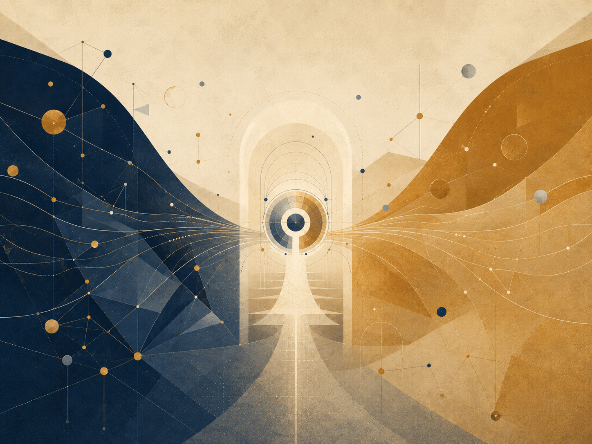

_תיאור תמונה: אופק, מידע וסף שבו מה שנעלם עדיין משאיר עקבה מבנית._

### גבול, עקבה ומידע בלי להפוך סוד למיתוס

חורים שחורים מושכים תאוריות פילוסופיות כי הם נראים כמו סמל מושלם: גבול, חושך, מידע, זמן, קריסה, בלתי־נגישות. אבל דווקא משום כך צריך להיזהר. אופק אירועים הוא מושג פיזיקלי: גבול שממנו, עבור תיאור מסוים, אור ואותות אינם יכולים להימלט החוצה. הוא אינו מטאפורה חופשית לכל דבר נסתר.

העיקרון ההולוגרפי, AdS/CFT ו-holography הם מסגרות עמוקות בשיח תאורטי על כבידה, שדות ומידע. בתאוריה הם אינם משמשים כהוכחה שהעולם “הוא הקרנה”. שימוש כזה יהיה קפיצה ריקה. הם משמשים כשפת גבול על יחס בין פנים, גבול, עקבה ותיאור.

מפת היחס: גבול מידע = מה שנופל פנימה × מה שניתן לראות מבחוץ × עקבה × חוק שימור × מסגרת תיאור / מיתוס × אסתטיקה של מסתורין × הוכחה מדומה × מחיקת מדע. המפה שואלת כיצד לדבר על מה שאיננו נגיש בלי להפקיע את המדע לטובת דרמה.

הערך לתאוריה נמצא באופק הראיות. במשפט, יש אמת שאולי קיימת מעבר למה שניתן להוכיח. ברפואה, יש כאב מעבר למה שנראה בבדיקה. ב־AI, יש מקור אנושי מעבר לפלט. בחינוך, יש הבנה מעבר לציון. אופק אינו ביטול האמת; הוא תנאי אחריות ביחס אליה.

חורים שחורים מזכירים גם את הסכנה של מערכת שאינה מנקזת. כאשר מידע, כוח וכאב נכנסים למוסד ולא חוזרים כאפשרות תיקון, המוסד מתנהג באופן מבני כמו בור: הוא סופח ולא מחזיר. לכן העיקרון אינו “החברה היא חור שחור”, אלא השאלה: האם הגבול משמר עקבה שמאפשרת אחריות או מוחק מקור.

הפרק משתלב עם מבנה היקום, אופקי גבול, משפט כראיות ו־AI כמקור/עקבה. הוא מחייב את התאוריה לשמור סייג: חורים שחורים אינם משל. הם פיזיקה. המשל היחיד המותר הוא זה שמכריז על עצמו כמשל ואינו מתנהג כעובדה.

### משמעת מקורות

מקורות עבודה וזהירות: הפרק נשען על מסגרת התאוריה, ועל מקורות רקע כלליים שנבדקו מחוץ לפרומפט: UNESCO על בינה מלאכותית בחינוך, WHO על אתיקה וממשל של AI בבריאות, NIST AI RMF לניהול סיכוני AI, CERN/ATLAS על המודל הסטנדרטי וה-Higgs, NASA ו-ESA/Planck על קוסמולוגיה, Stanford Encyclopedia of Philosophy על Bell, Kochen-Specker וקונטקסטואליות, ו-Britannica/ISFDB לזיהוי ספרותי של Harlan Ellison ו-I Have No Mouth, and I Must Scream. המקורות אינם מוכנסים כהוכחות לתאוריה אלא כבלמים נגד שימוש ריק במונחים.

חזרה לתוכן עניינים

## פרק ?: ↓

חזרה לתוכן עניינים

## פרק ?: ↓

חזרה לתוכן עניינים

## פרק ?: .

חזרה לתוכן עניינים

## פרק ?: .

חזרה לתוכן עניינים

## פרק ?: .

חזרה לתוכן עניינים

## פרק ?: ↓

חזרה לתוכן עניינים

## פרק *: הבנה

חזרה לתוכן עניינים

## פרק •: יישום

חזרה לתוכן עניינים

## מקורות, השראות, רעיונות ותודות

המקורות, השמות והרעיונות הבאים אינם מוצגים כסמכויות שמוכיחות את התאוריה. הם אינם הוכחה ל“בין פוטנציאל ואידיאל”, ואינם המקור שממנו התאוריה נגזרת. הם שכנים אינטלקטואליים, השראות, מילים מסייעות וחובות רעיוניים. התאוריה קרובה אליהם במקומות מסוימים ונבדלת מהם במקומות אחרים.

הקרבה אל מקור אינה זהות איתו. אם שם מסוים מופיע כאן, אין פירוש הדבר שהתאוריה מקבלת את כל עמדתו. פירוש הדבר שהוא עזר לנסח, לחדד, לאתגר או למקם שאלה אחת מתוך המהלך הרחב: כיצד פוטנציאל עובר דרך חוק, גבול, חומר, חיכוך ועיבוד, עד שהוא יכול להיעשות כיוון אחראי יותר.

### השושלת הפילוסופית

אריסטו רלוונטי בגלל ההבחנה בין אפשרות למימוש, בין פוטנציאליות לאקטואליות. התאוריה קרובה לשאלה הזאת, אך אינה מסתפקת במעבר מן האפשרי אל הממשי; היא שואלת מה קורה אחרי המימוש, והאם צורה שהתממשה יכולה לעבור בירור עד שתהיה ראויה יותר לפוטנציאל שממנו באה.

אפלטון רלוונטי מפני ששפת האידיאל מהדהדת את אידיאת הטוב ואת היחס בין העולם הנראה לבין צורה גבוהה יותר של הבנה. אולם כאן האידיאל אינו צורה סטטית מעל ההתהוות, אלא תוצאה מבוררת של פוטנציאל שעבר דרך חוויה, גבול ואחריות.

פלוטינוס והניאו־אפלטוניות רלוונטיים בגלל היחס בין אחדות לריבוי. התאוריה חולקת את האינטואיציה שריבוי יכול לנבוע מאחדות, אך מסרבת להפוך את האחר לבלתי ממשי מבחינה אתית, ומסרבת לראות ביעד הסופי מחיקה של הבדל.

ברוך שפינוזה רלוונטי בגלל תפיסת האל האימננטית שלו: אלוהים אינו מחוץ למציאות. התאוריה חולקת איתו את דחיית האל החיצוני, אך נבדלת ממנו בכך שהיא מציבה במרכז לא רק את הכרחיות המציאות, אלא את האפשרות של בירור מוסרי מן הפוטנציאל האבסולוטי אל האידיאל.

לייבניץ רלוונטי כרקע לשאלות של עולמות אפשריים, שלמות, מונדות והיחס בין ריבוי לבין סדר. התאוריה אינה מאמצת את האופטימיזם המטאפיזי של “הטוב שבעולמות האפשריים”, אך היא קרובה לשאלה כיצד אפשרות, סדר ונקודת מבט נוגעים זה בזה.

קאנט רלוונטי בעיקר כרקע לזהירות מול גבולות הידיעה. התאוריה אינה קובעת את הדבר־כשלעצמו, ואינה מתיימרת להחליף ביקורת תבונה במטאפיזיקה חופשית. היא מנסה לדבר על השלם מתוך הכרה בכך שכל שפה אנושית עומדת מול גבול.

הגל רלוונטי מפני שאי אפשר להפריד את התוצאה מן הדרך שבה היא נעשית. התאוריה חולקת את האינטואיציה התהליכית, אך מנסחת את התנועה כפוטנציאל אבסולוטי שנעשה אידיאלי דרך בירור, חיכוך ואחריות, ולא רק כהתפתחות רוח בהיסטוריה.

וייטהד ופילוסופיית התהליך רלוונטיים מפני שהמציאות מובנת כהתהוות ולא כבלוק סטטי. התאוריה קרובה מאוד לרגישות הזאת, אך שומרת על ניסוח משלה: לא רק תהליך, אלא תהליך שבו פוטנציאל נבחן לפי יכולתו להיעשות אידיאל בלי למחוק את מה שעבר דרכו.

דוסטויבסקי אינו שייך לכאן רק דרך “האידיוט”, אלא דרך כל המרחב שבו רעיון נכנס אל אדם ואינו יוצא ממנו שלם. ב“האידיוט” זהו הטוב הכמעט בלתי־אפשרי של הנסיך מישקין: לא פתרון, לא קדוש פשוט, אלא חמלה ויופי שנכנסים אל עולם של מבוכה, תשוקה, רכושנות ופחד, ועוברים בו עיוות. ב“רשימות מן המחתרת” זו התודעה שמסרבת להיסגר בתוך כל נוסחה שתסביר אותה. ב“החטא ועונשו” זהו הרעיון המוסרי או העל־אישי כשהוא נעשה מעשה, ואז חוזר אל הגוף כאשמה, חום, פחד, רחמים ועונש פנימי. ב“האחים קרמזוב” זו שאלת האמונה כשהיא עומדת מול סבל שאין דרך נקייה להצדיקו. וב“שדים” זו הסכנה שבהאידיאל חד מדי הופך לאידיאולוגיה שמוחקת את האדם בשם אמת גדולה ממנו.

ניטשה עומד מול אותו אזור מן הצד האחר. הוא אינו מבטל את שאלת האידיאל; הוא בודק האם האידיאל אינו כבר אליל, האם המוסר אינו בריחה מן החיים, האם החמלה אינה לפעמים צורה סמויה של שליטה, והאם משמעות שניתנת מבחוץ אינה דרך להימנע מן העבודה הקשה יותר: לומר כן לחיים בלי לשקר עליהם.

בין דוסטויבסקי לניטשה נפתח אחד הצירים העמוקים של “בין פוטנציאל לאידיאל”: מצד אחד, האדם שאינו מסוגל לשאת את עומק הטוב, האשמה, האמונה או החירות; ומן הצד האחר, החשד שכל אידיאל עלול להפוך לנחמה, לאליל או לכוח. לכן האידיאל בתאוריה אינו פתרון סופי ואינו גאולה מוכנה. הוא כיוון חי, פגיע, לא־מובטח — תנועה שמנסה להישאר נאמנה לאפשרות של תיקון בלי למחוק את השבר שמתוכו היא נולדת.

קאמי רלוונטי לצד הציר הזה כרקע למשבר האבסורד ולשאלה כיצד אפשר להמשיך לפעול כאשר המשמעות אינה מובטחת מראש. התאוריה אינה מבטלת את האבסורד ואינה פותרת אותו בכוח; היא מנסה לנסח ניהיליזם עם תקווה — לא ודאות של משמעות, אלא אפשרות שכאב, גבול וחיכוך לא חייבים להישאר המילה האחרונה.

האקזיסטנציאליזם, ובעיקר השאלות על חירות, אחריות ומשמעות שאינה נתונה מראש, נמצא ברקע התאוריה. האדם אינו רק תוצאה של חוק, ואינו רק נקודה בתוך מערכת; הוא מקום שבו אפשרות נדרשת לשאת אחריות על צורתה.

המסורות הבודהיסטיות, ובמיוחד שאלות של אי־עצמי, סבל, השתוקקות, חמלה והשתחררות, רלוונטיות מאוד. התאוריה חולקת איתן את החשד כלפי אגו קשיח ונפרדות מוחלטת, אך מתעקשת שהשתחררות אינה יכולה להיות מחיקה של האדם, של ההבדל, או של האחריות.

אדוויטה ודאנטה ושאנקרה רלוונטיים כרקע לאי־נפרדות ולשאלה האם הריבוי הוא אשליה, הופעה או אמת חלקית. התאוריה קרובה לאינטואיציה של אחדות, אך מתרחקת מכל ניסוח שבו האחדות מבטלת את המשמעות המוסרית של הריבוי.

הדאואיזם רלוונטי כרקע לרעיון של דרך שאינה נכפית מבחוץ, של פעולה שאינה כוחנית, ושל צורה שאינה שוברת את הזרימה. התאוריה אינה דאואיסטית, אך היא קרובה לשאלה כיצד כיוון יכול להופיע בלי להפוך לשליטה.

### מתמטיקה, לוגיקה וצורות מחשבה

המתמטיקה אינה מוכיחה את התאוריה, אך היא מספקת לה דימויים של מבנה, גבול, אינסוף, מרחב אפשרויות ויחס בין צורה לבין חוק.

המסורת של המספרים המרוכבים, ובמיוחד השימוש במספר המדומה, רלוונטית כדימוי לכך שלא כל מה שאינו נראה על הציר הממשי הוא חסר משמעות. אוילר וגאוס רלוונטיים כאן כרקע מתמטי רחב, לא כמקור מטאפיזי.

דייוויד הילברט ופון נוימן רלוונטיים בגלל מרחב הילברט והפורמליזציה של מכניקת הקוונטים. בתאוריה, מרחב הילברט אינו “מרחב כל האפשרויות של הקיום”, אלא דימוי מוגבל למרחב מצבים של מערכת מוגדרת, ולצורך להבחין בין אפשרות, מצב, מדידה וחוק התפתחות.

גאורג קנטור רלוונטי כרקע לשאלת האינסוף וסוגי אינסוף. הרעיון שכל שלב — I‑Verse, Universe, Multiverse, Omniverse — יכול להתפרק שוב למבנים דומים אינו טענה מתמטית פורמלית על אינסוף קנטוריאני, אך הוא קרוב לאינטואיציה שהאינסוף אינו רק “הרבה מאוד”, אלא מבנה שיכול להופיע ברמות שונות.

בעיית P מול NP רלוונטית כאן רק כדימוי לוגי מוגבל: לא כפתרון מתמטי ולא כהוכחה לתאוריה, אלא כשפה שמדגישה את המרחק בין זיהוי בדיעבד של פתרון לבין מציאת הדרך אליו מראש. במונחי התאוריה, זהו אחד הדימויים ליחס שבין פוטנציאל, חיפוש, בדיקה, איטרציה ואידיאל.

קורט גדל ואלן טיורינג רלוונטיים כרקע לגבולות של מערכות פורמליות, חישוב, הוכחה ומודעות עצמית של מערכת. התאוריה אינה משתמשת במשפטי גדל או ב מכונת טיורינג כהוכחה, אלא כרקע זהיר לרעיון שמערכת יכולה לשאול על גבולותיה מבפנים.

תורת הסיבוכיות, רדוקציות פולינומיות, *N**P* -שלמות, *c**o**N**P* , ההיררכיה הפולינומית ו־ *Q**B**F* רלוונטיות כאן כשפה מבנית בלבד: הן אינן מזהות את הפוטנציאל עם מחלקת סיבוכיות, אלא עוזרות להבחין בין מציאה, אימות, משאב, תרגום, אסטרטגיה וגבול.

אלגברה ליניארית ולכסון מטריצות רלוונטיים כרקע לשפה של מרחב מצבים, פעולה ושינוי בסיס. גם כאן אין טענה שהקיום הוא מטריצה; יש רק דימוי מדויק לכך שלפעמים הבנת מערכת תלויה בבסיס שבו הפעולה נראית.

בֶּנוּאַ מנדלברוט והחשיבה הפרקטלית רלוונטיים כרקע לרקורסיה, דמיון עצמי ופירוק אינסופי של מבנים. השימוש כאן הוא דימוי מבני בלבד: כל שלב של מציאות יכול לשאת בתוכו חלוקה נוספת, וכל רכיב יכול להפוך בעצמו למרחב של אפשרויות.

### פיזיקה, קוסמולוגיה ומידע

הפיזיקה המופיעה בתאוריה אינה הוכחה למטאפיזיקה. היא שפה מדויקת, אנלוגיה מבנית מוגבלת, ודימוי פורמלי חלקי. היא עוזרת להבחין בין אנרגיה פיזיקלית לבין אנרגיה מטאפורית, בין חומר פיזיקלי לבין חומר כדימוי לצורה ותנאי, ובין גבול מתמטי, גבול פיזיקלי וגבול קיומי.

איינשטיין ומינקובסקי רלוונטיים בגלל היחסות, מרחב־זמן, שקילות מסה־אנרגיה וההבנה שכובד אינו רק כוח על במה קבועה אלא קשור לגיאומטריה של המרחב־זמן. התאוריה אינה גוזרת משמעות ממשוואות איינשטיין, אלא משתמשת בהן בזהירות כדי לחשוב על “משקל” כעל דימוי למה שמשנה את מרחב האפשרויות סביבו.

מקס פלאנק, נילס בוהר, ורנר הייזנברג, ארווין שרדינגר, פול דיראק, וולפגנג פאולי וריצ׳רד פיינמן רלוונטיים כרקע למכניקת הקוונטים, לתורת השדות, לסופרפוזיציה, מדידה, אי־ודאות, חלקיקים, דיאגרמות, פרמיונים ובוזונים. התאוריה אינה הופכת קוונטים למיסטיקה; היא משתמשת בהם כדי להיזהר מן ההנחה שרק מה שכבר נעשה אובייקט הוא אמיתי במובן העמוק.

אמי נתר רלוונטית בגלל הקשר בין סימטריות לחוקי שימור. הקשר הזה חשוב כרקע לשפה של חוק, גבול, תנאי ואפשרות שאינה יכולה להופיע באופן שרירותי.

פיטר היגס, פרנסואה אנגלר ורוברט בראוט רלוונטיים בגלל מנגנון ההיגס והשאלה כיצד מסה יכולה להופיע דרך יחס עם שדה. התאוריה אינה משתמשת בהיגס כהוכחה, אלא כדימוי זהיר לכך שתכונה שנראית פנימית יכולה להיות תלויה ביחס עמוק יותר עם שדה ותנאי.

שוורצשילד, קר, פנרוז, וילר, בקנשטיין והוקינג רלוונטיים בגלל חורים שחורים, אופק אירועים, סינגולריות, אנטרופיית אופק וקרינת הוקינג. החור השחור אינו משל רגשי פשוט, אלא דימוי קצה למקום שבו גבול, מידע, גיאומטריה וזמן מסתבכים זה בזה.

ג׳רארד ’ט הופט, לאונרד ססקינד, חואן מלדסנה, דון פייג׳, ועבודות עכשוויות על הולוגרפיה ותיקוני “איים” רלוונטיים כרקע לבעיית המידע של חורים שחורים. אין כאן הכרעה פיזיקלית; יש כאן זהירות מול שאלה שבה שימור מידע, גיאומטריה ותרמודינמיקה עדיין מחייבים מסגרת עמוקה יותר.

קלוד שאנון ולנדאואר רלוונטיים כרקע למידע, אנטרופיה והקשר בין מידע לפיזיקה. התאוריה משתמשת במידע בזהירות: לא כתחליף לחוויה, ולא כהוכחה לתודעה, אלא כדרך לשאול מה נשמר, מה הולך לאיבוד, ומה עובר תרגום.

הדיון במולטי־וורס, ביקומים אפשריים ובשכבות כמו I‑Verse, Universe, Multiverse ו‑Omniverse נוגע ברקע רחב של עולמות אפשריים, קוסמולוגיה ספקולטיבית ורעיונות כמו אוורט, דייוויד לואיס ומקס טגמרק. התאוריה אינה מתחייבת לאף מודל קוסמולוגי או מודאלי כזה; היא משתמשת באוצר המילים הזה כדי לחשוב על רקורסיה, שכבות, נקודות מבט ופירוק אינסופי של אפשרות.

### בינה מלאכותית, תודעה ומראות עכשוויות

האנלוגיה לבינה מלאכותית היא תוספת עכשווית. היא אינה הוכחה, אלא ראי: היא עוזרת להבחין בין מידע, חוויה, מודעות, יחס עצמי, חיקוי והבנה.

אלן טיורינג רלוונטי גם כאן בגלל שאלת החיקוי, המבחן, והפער בין התנהגות נראית לבין תודעה. נורברט וינר רלוונטי כרקע לקיברנטיקה, משוב ומערכות שמווסתות את עצמן. ג׳ון סרל ודייוויד צ׳אלמרס רלוונטיים כרקע לשאלות על חדר סיני, תודעה, חוויה והבעיה הקשה. התאוריה אינה פותרת את בעיית התודעה; היא משתמשת בבינה מלאכותית כדי להחזיר את השאלה על המרחק בין מידע לבין חוויה.

שיחות עם מערכות בינה מלאכותית שימשו גם ככלי ניסוח, עיבוד וביקורת. אין בכך סמכות, ואין בכך מקור אמת. זהו כלי עבודה וראי רעיוני, לא מחבר נוסף של התאוריה.

### יצירות, סיפורים ודימויי קצה

רוג׳ר ויליאמס, “המטמורפוזה של האינטלקט הראשוני” (The Metamorphosis of Prime Intellect), רלוונטי כנקודת ייחוס לבחינת הסכנה שבה אינטליגנציה ראשונית מבקשת לבטל סבל באמצעות שליטה, ובכך מוחקת את המרחק שבו האדם נעשה מקור של משמעות.

Rhadamanthus / Reddit, “להאכיל את החזיר” (Feed the Pig), רלוונטי כנקודת ייחוס לבחינת בחירת התודעה במצבי קצה מול סבל, ולזיהוי החסד לא רק כהמשך הטיפוס אלא גם כנכונות של השלם לוותר על מידע למען האדם. זה אינו מקור פילוסופי קלאסי, אך הוא רלוונטי כאן מפני שהוא נוגע ישירות באחת האינטואיציות המרכזיות של התאוריה: לא כל הצלה היא שליטה, ולא כל חסד הוא המשך כפוי של התהליך.

הדיון ביצירה, קאנון ואופטימום נעזר גם ביצירות תרבותיות כסוג של מעבדה מבנית: *Community* ו־*Rick and Morty* כדוגמאות לאופטימום כתיבתי ולריקורסיה יצירתית; *שר הטבעות* כדוגמה לאידיאל שהוא סירוב לפוטנציאל משחית; יצירות מיאזאקי ודוגמאות כמו *Breaking Bad*, *Fight Club*, Batman, Spider-Man ו־Superman לבחינת קאנון, אינווריאנט, אידיאל מזויף והיחס בין כוח לגבול; ו-*המגדל האפל* של סטיבן קינג, יחד עם *The Stand*, *The Eyes of the Dragon*, Roland Deschain, Randall Flagg והשושנה, כדוגמה לגוף יצירה רקורסיבי שבו עיבוד נבחן לפי יכולתו לשמר מרכז ולא רק סמלים.

### תודות והערת מקור

תודה ניתנת למסורות, לספרים, לשאלות, לדימויים, לשיחות, לביקורת, ולכל מי שעוזר לא להפוך רעיון חי לדוקטרינה סגורה. התאוריה הזאת מבקשת להישאר פתוחה לביקורת, לא מפני שאין לה כיוון, אלא מפני שכיוון אמיתי צריך להיות מסוגל לעבור דרך התנגדות בלי להפוך לאמונה עיוורת.

הכותב של התאוריה אחראי לסינתזה, לבחירת המושגים, ולחיבור בין פוטנציאל, אידיאל, השלם, גבול, חיכוך, עיבוד וכיוון. המקורות מסייעים, מאירים ומאתגרים; הם אינם מחליפים את האחריות של התאוריה לעמוד בפני עצמה.

### ביבליוגרפיה והערות מקור

אריסטו, מטאפיזיקה; וכן דיונים על פוטנציאליות ואקטואליות.

אפלטון, המדינה, בעיקר הדיון באידיאת הטוב.

פלוטינוס, האניאדות, בעיקר הדיון באחד ובריבוי.

ברוך שפינוזה, אתיקה, חלק א׳, במיוחד טענות י״ד–ט״ו וי״ח.

גוטפריד וילהלם לייבניץ, המונאדולוגיה וכתבים על עולמות אפשריים.

עמנואל קאנט, ביקורת התבונה הטהורה, כרקע לגבולות הידיעה.

גאורג וילהלם פרידריך הגל, הפנומנולוגיה של הרוח, הקדמה.

אלפרד נורת׳ וייטהד, תהליך ומציאות; וכן מבואות לפילוסופיית התהליך ולתאולוגיית התהליך.

פיודור דוסטויבסקי, “האידיוט”, “רשימות מן המחתרת”, “החטא ועונשו”, “האחים קרמזוב” ו“שדים”, כרקע ספרותי־פילוסופי לשאלות טוב, אשמה, חירות, חמלה, אידיאל ואידיאולוגיה.

פרידריך ניטשה, “המדע העליז”, “כה אמר זרתוסטרא”, “מעבר לטוב ולרוע”, “לגנאלוגיה של המוסר” ו“שקיעת האלילים”, כרקע לביקורת הניהיליזם, המוסר, החמלה, האלילים והיכולת לומר כן לחיים בלי נחמה שקרית.

אלבר קאמי כרקע למשבר המודרני של אבסורד, פעולה ומשמעות שאינה מובטחת מראש.

מסורות בודהיסטיות, נאגארג׳ונה, אדוויטה ודאנטה ושאנקרה כרקע לאי־נפרדות, אי־עצמי וביקורת האגו.

איינשטיין, מינקובסקי, נתר, הייזנברג, שרדינגר, דיראק, פאולי, פיינמן, היגס, אנגלר, בראוט, בקנשטיין, הוקינג, פנרוז, וילר, ססקינד, ’ט הופט, מלדסנה ופייג׳ כרקע מדעי לשפה של מרחב־זמן, קוונטים, שדות, סימטריות, אופקים, מידע ותרמודינמיקה.

קנטור, הילברט, פון נוימן, גדל, טיורינג ומנדלברוט כרקע מתמטי ולוגי לאינסוף, מרחבי מצב, פורמליזם, חישוב, גבול ורקורסיה.

שאנון, לנדאואר, וינר, סרל וצ׳אלמרס כרקע לשאלות מידע, מערכת, משוב, תודעה והבחנה בין סימן לחוויה.

רוג׳ר ויליאמס, “המטמורפוזה של האינטלקט הראשוני” (The Metamorphosis of Prime Intellect); ו‑Rhadamanthus / Reddit, “להאכיל את החזיר” (Feed the Pig), כמקורות ספרותיים־רעיוניים לדימויי קצה של חסד, שליטה, סבל וויתור.

הערה על ציטוטים ושושלת רעיונית: ההפניות הקצרות משמשות לאוריינטציה פילוסופית, מדעית וספרותית. התאוריה עצמה מוצגת כהצעה עצמאית, לא כנגזרת ממקור יחיד.

חזרה לתוכן עניינים

## רוע, סבל, טוב ואחריות

*כאב אינו קדוש, סבל אינו הצדקה, וקוהרנטיות אינה מוסר*

_תיאור תמונה: הבחנה מוסרית בין כאב, רוע, אחריות ותיקון בלי לקדש את הסבל._

התאוריה אינה מצדיקה רוע. היא אינה אומרת שכל דבר היה צריך לקרות, שכל פגיעה משרתת תכנית נסתרת, או שכל סבל הוא שלב הכרחי בדרך לטוב. אם היא הייתה אומרת זאת, היא הייתה מאבדת את הזכות לדבר על אידיאל.

כאב אינו קדוש. סבל אינו הוכחה לעומק, ופגיעה אינה נעשית ראויה מפני שאפשר ללמוד ממנה בדיעבד. אדם שנפגע אינו חייב להודות לפגיעה משום שהיא יצרה בו ידע, חמלה או כוח. משמעות שאולי נוצרת אחרי כאב אינה הצדקה לכאב. היא התנגדות לכך שהכאב יהיה המילה האחרונה.

הפרק הזה הוא אחד ממבחני האחריות של התאוריה כולה. התאוריה מדברת על פוטנציאל, אידיאל ואופטימלי; לכן עליה להבחין לא רק בין מה שאפשר לבין מה שראוי, אלא גם בין מה שניתן להסביר לבין מה שאסור להצדיק. עליה לדעת לומר: יש אפשרויות שלא ראוי לממש; יש קוהרנטיות שאינה מוסר; יש סבל שצריך לעצור, לא לפרש; ויש כאב שאסור להפקיע מן האדם בשם שפה יפה מדי.

אם הפרקים האחרים שואלים כיצד אפשרות מתקרבת לצורה ראויה תחת מגבלה, הפרק הזה שואל את השאלה ההפוכה וההכרחית: מה קורה כאשר אפשרות מתממשת בצורה שמוחקת חיים? מה קורה כאשר סדר, כוח או שפה הופכים את עצמם לאידיאל מזויף? ומה חייבת תאוריה אחראית לוותר עליו כדי לא להפוך בעצמה למנגנון שמסביר פגיעה במקום לעצור אותה?

### 1. רוע אינו כל כאב

רוע אינו כל כאב. יש כאב שנובע מסופיות, מגוף, מאובדן, ממגבלה, מאי־ודאות, מן המרחק שבין מה שאפשר לבין מה שראוי, או מן העובדה שחיים אינם יכולים להתקיים בלי גבולות. כאב כזה אינו בהכרח רוע, גם אם הוא קשה, גם אם הוא משנה אדם, גם אם אין לו תשובה מלאה.

אבל רוע מופיע כאשר כוח, אדישות, עיוורון או בחירה מוחקים את המרחק של מקור חי. רוע הוא לא רק העובדה שמישהו סובל; הוא מצב שבו הסבל נגרם, נשמר, מוצדק או משוחזר מפני שמישהו או משהו מסרב לראות את המקור החי שמולו.

במונחי התאוריה, רוע הוא מימוש של פוטנציאל בלי אחריות לאידיאל. הוא האפשרות שמצליחה להפוך לצורה, אבל הצורה הזאת אינה ראויה משום שהיא משתמשת בחיים במקום לשמור עליהם. הוא מצב שבו יכולת, כוח, סדר או יעילות מתנהגים כאילו עצם קיומם מספיק כדי להצדיק את פעולתם.

לכן כאשר סבל נובע מרוע, החובה הראשונה אינה לפרש אותו — אלא לעצור אותו. אין להתחיל מן השאלה “מה זה מלמד?”, אלא מן השאלה “מה כאן פוגע, מי נפגע, ומה צריך להפסיק?”. פרשנות שבאה לפני עצירת הפגיעה עלולה להפוך לשותפה של הפגיעה.

התאוריה יכולה לדבר על מרחק, גבול ומשמעות, אבל היא אינה רשאית להפוך כל גבול לשיעור וכל פגיעה למעבר הכרחי. יש דברים שאינם צריכים לקבל הסבר יפה. הם צריכים להיעצר.

### 2. סבל אינו קדוש

סבל הוא חיכוך עם גבול. הוא יכול לחשוף שהחיים מוגבלים, שהגוף פגיע, שהרצון אינו כל־יכול, שהזמן אינו חוזר, ושכל ניסיון לממש אידיאל עובר דרך מגבלות ממשיות. אבל מכאן לא נובע שסבל הוא קדוש.

כאב אינו טוב מפני שהוא כאב. לא כל כאב מלמד. לא כל שבר מעמיק. לא כל פגיעה מגדילה. לפעמים כאב שובר, משתיק, מצמצם, מעוות ומותיר אדם בלי שפה. לפעמים הסבל אינו שער לחוכמה אלא עדות לכך שמשהו היה צריך להיעצר מוקדם יותר.

כאן התאוריה חייבת להיזהר מעצמה. משום שהיא מדברת על מרחק כעל תנאי לידיעה חיה, היא עלולה להישמע כאילו המרחק עצמו תמיד טוב. אבל מרחק אינו טוב בפני עצמו. מרחק יכול להיות תנאי להבנה, אך הוא יכול גם להיות נטישה. הוא יכול להיות כבוד למקור חי, אך הוא יכול גם להיות הדרך שבה מוסד, אדם או מערכת אומרים: “זה לא ענייני.”

גם מגבלה אינה קדושה בפני עצמה. מגבלה יכולה ללמד צורה, אחריות ודיוק; אבל מגבלה יכולה גם להיות דיכוי, מחסור, הזנחה או אלימות. השאלה אינה אם הייתה מגבלה, אלא מה נעשה דרכה, מי נשא את מחירה, והאם המחיר הזה נשמר כגבול אנושי או נוצל כמנגנון מחיקה.

הסכנה הרוחנית והמוסרית היא להפוך סבל למטבע של משמעות. לומר לאדם שנפגע שהכאב שלו “היה נחוץ”, “היה לטובתו”, או “נועד ללמד אותו” יכול להיות עוול שני: קודם הפגיעה עצמה, ואחר כך פרשנות שמפקיעה ממנו את הזכות לומר שזה היה רע.

הכאב אינו קדוש. מה שיכול להיות קדוש הוא הסירוב לתת לכאב להפוך לאכזריות חוזרת.

### 3. משמעות אחרי כאב אינה הצדקת כאב

יש הבדל בין משמעות שנוצרת אחרי כאב לבין הצדקה של הכאב. הראשון יכול להיות ריפוי. השני יכול להיות אכזריות.

אחרי כאב, אדם או קהילה עשויים להפוך את מה שקרה לעדות, תיקון או חמלה. הם עשויים ללמוד, לבנות שפה, להגן על אחרים, להעמיק אחריות, ליצור אמנות, להקים מוסד טוב יותר, או לסרב לחזור על מה שנעשה להם. כל אלה יכולים להיות אמיתיים. אבל הם אינם מוכיחים שהכאב היה צריך לקרות.

המשמעות שנוצרת אחרי הפגיעה אינה הצדקה לפגיעה. היא התנגדות לכך שהפגיעה תישאר חסרת צורה או תשחזר את עצמה. היא אינה אומרת “טוב שזה קרה”; היא אומרת “מאחר שזה קרה, לא אתן לזה להיות כל מה שזה היה.”

זהו גבול מרכזי בין אידיאל לבין אידיאל מזויף. אידיאל אמיתי אינו צריך להכתיר את הכאב כדי ללמוד ממנו. אידיאל מזויף ממהר לומר שהכאב היה חלק מן התכנית, מפני שהוא מפחד להודות שיש בעולם דברים שאינם ראויים, גם אם אפשר לבנות מהם אחר כך עדות, חמלה או תיקון.

התאוריה חייבת לשמור על זכותו של אדם לומר: “משהו נולד בי אחרי הכאב, אבל הכאב עצמו לא היה ראוי.” הזכות הזאת אינה חולשה. היא משמעת מוסרית. היא מונעת מן השפה להפוך את השבר למטבע שהיא מוציאה בשם השלם.

אם התאוריה מוצאת משמעות אחרי כאב, עליה להיזהר שלא להפוך את המשמעות הזאת להוכחה שהכאב היה ראוי. הטוב אינו ההסבר של הרע. הוא ההתנגדות לכך שהרע יהפוך לחוק.

### 4. קוהרנטיות אינה מוסר

קוהרנטיות אינה מוסר. מערכת יכולה להיות עקבית, יציבה, יעילה, סימטרית, מנומקת, אלגוריתמית וניתנת להסבר — ועדיין להיות אכזרית.

סדר אינו צדק. יעילות אינה טוב. יציבות אינה ראויות. אלגוריתם עקבי אינו מוסרי מעצם עקביותו. אידיאולוגיה יכולה להיות מסודרת מאוד ועדיין למחוק אדם. משפט יכול להיות פורמלי מאוד ועדיין לא צודק. כלכלה יכולה לצמוח ועדיין לייצר סבל כמחיר קבוע. רפואה יכולה להיות מדויקת ועדיין לא לראות את החולה. חינוך יכול להיות מדיד ועדיין לגנוב מן הלומד את דרכו.

זה חשוב במיוחד לתאוריה שמכבדת מבנים. התאוריה משתמשת במילים כמו מערכת, גבול, מעבר, תווך, ריקורסיה, אידיאל ואופטימום. אבל מבנה אינו טוב מפני שהוא מבנה. אופטימיזציה אינה מוסרית מפני שהיא מוצאת פתרון. מערכת אינה מוסרית מפני שהיא עובדת.

קוהרנטיות היא תנאי אפשרי לבהירות; היא אינה הוכחה לראויות. גם רוע יכול להיות קוהרנטי. גם מנגנון מחיקה יכול להיות יעיל. גם מערכת שמנצלת אדם יכולה להסביר את עצמה היטב. לכן השאלה אינה רק אם המבנה עקבי, אלא מה הוא עושה למקור החי שבתוכו.

הטעות היא לחשוב שצורה מסודרת מוכיחה טוב. אבל טוב אינו רק היעדר סתירה. טוב הוא יחס אחראי למקור חי, למחיר, לגבול ולמה שעלול להימחק. מערכת מוסרית אינה רק מערכת שעובדת; היא מערכת שיודעת לשאול את מי היא עלולה למחוק בשם עבודתה.

לכן התאוריה אינה יכולה להסתפק בקוהרנטיות פנימית. היא צריכה להיבחן בשאלה אחרת: האם הקוהרנטיות שלה שומרת חיים, או רק מסדרת את השפה סביב המחיקה שלהם?

### 5. פוטנציאל אינו טובוּת

פוטנציאל הוא מרחב האפשרי; הוא אינו מוסר. העובדה שמשהו אפשרי אינה אומרת שהוא ראוי. העובדה שמבנה יכול להיווצר אינה אומרת שצריך ליצור אותו. העובדה שכוח יכול לפעול אינה אומרת שמותר לו לפעול.

זהו אחד התיקונים החשובים ביותר לקריאה של התאוריה. “פוטנציאל” אינו שם אחר לטוב. הוא שדה של אפשרויות, ובתוך שדה האפשרויות יש גם אפשרויות פוגעות, מסוכנות, מנצלות ומוחקות. אפשרות יכולה להיות מרשימה, חדשה, חזקה או יעילה — ועדיין לא ראויה.

האידיאל הוא שאלת הראוי. הוא שואל מה האפשרות עושה לחיים: האם היא מרחיבה אחריות או מצמצמת אותה; האם היא שומרת מקור חי או משתמשת בו; האם היא מפחיתה שחזור של כאב או הופכת אותו למחיר קבוע. האידיאל אינו מקסימום כוח, מקסימום סדר או מקסימום יעילות. הוא היחס שבו אפשרות נמדדת לפי אחריותה למחיר שהיא יוצרת.

האופטימלי הוא המקום שבו הראוי נעשה פעולה מוגבלת: לעצור פגיעה, להפחית שחזור, לשמור מקור חי, ולפתוח אפשרות לתיקון. הוא אינו מבטיח גאולה מלאה. הוא אינו פותר את כל הסבל. הוא שואל מה ניתן לעשות כאן, תחת מגבלה, כדי לא לתת לרוע לקבל המשך נוח.

לכן “היה אפשרי” אינו “היה ראוי”. “קוהרנטי” אינו “טוב”. “יעיל” אינו “מוסרי”. “היה יכול לקרות” אינו “היה צריך לקרות.”

### 6. מקור חי לפני פירוש

אדם שסובל אינו חומר גלם לתאוריה על סבל. הוא מקור חי שנדרש קודם כל לא להיפגע שוב — לא בגוף, לא בשפה, ולא בפרשנות שמפקיעה ממנו את כאבו.

הקורבן אינו דוגמה. הסובל אינו משאב פילוסופי. הכאב אינו חומר גלם למבנה יפה. עדות אינה נתון חופשי לשימוש. כאשר אדם אומר “זה כאב”, התאוריה אינה רשאית למהר ולתקן אותו אל תוך משפט רחב יותר. לפעמים האחריות הראשונה היא להקשיב בלי להשתמש.

המקור החי קודם לפרשנות עליו. הוא קודם למסקנה, לדימוי, ללקח ולשפה התאורטית שמבקשת לסדר אותו. אם התאוריה משתמשת בכאב כדי להוכיח את עצמה, היא חוטאת למה שהיא עצמה מנסה להגן עליו.

כאן מופיע חסד הוויתור בצורתו המוסרית ביותר. חסד הוויתור בפרק הזה אינו ויתור על האדם, אלא ויתור של התאוריה על יומרת ההצדקה. לוותר על הצורך להסביר כל כאב. לוותר על הניסיון להראות שכל דבר משרת את השלם. לוותר על הפיתוי להפוך סבל למשמעות מוכנה. לוותר על ההרואיזציה של כאב.

זהו ויתור על בעלות פרשנית. הוא שומר לאדם את הזכות לומר: זה כאב. זה רע. זה לא היה צריך לקרות.

### 7. בינה מלאכותית כמבחן של קוהרנטיות ללא מוסר

בינה מלאכותית יכולה להראות מדוע קוהרנטיות אינה מוסר. תוצר יכול להיות מסודר, סביר ומשכנע, ועדיין להיות בלתי אחראי אם הוא מסתיר מקור, משכפל עוול, מוחק חריג או מחליף שיפוט אנושי.

מערכת יכולה לדעת לנסח כאב בלי להבין את המחיר שלו. היא יכולה לסכם עדות בלי לשמור את העד. היא יכולה להציע פתרון יעיל שמוחק את האדם החריג. היא יכולה להישמע מאוזנת כאשר מה שנדרש הוא להפסיק פגיעה. לכן השאלה אינה רק אם התוצר נכון לשונית או קוהרנטי, אלא אם הוא שומר אחריות למקור חי.

זהו מבחן חשוב גם לשימוש בתאוריה עצמה. ניסוח משכנע מדי יכול להסתיר אחריות חלשה מדי. טקסט מסודר יכול לגרום לקורא להרגיש שהכאב הובן, אף על פי שהוא רק סוכם. שפה יפה יכולה להפוך עדות חיה למקרה. לכן בינה מלאכותית אינה רק כלי עזר; היא גם אזהרה מפני מה שקורה כאשר קוהרנטיות לשונית מתנתקת ממוסר.

תפקידה הראוי של בינה מלאכותית בהקשר כזה אינו להחליף שיפוט חי, אלא לעזור לבדוק היכן השפה מחליקה מהר מדי, היכן מקור נמחק, היכן טענה נשמעת מוסרית רק מפני שהיא מסודרת, והיכן כאב הופך לנתון נקי מדי. גם כאשר בינה מלאכותית מסייעת בזיהוי דפוסים, ניסוח או בדיקה, האחריות המוסרית אינה עוברת אל הכלי. היא נשארת אצל האדם, המוסד או הקהילה שבוחרים כיצד להשתמש בפלט.

### 8. מוסדות: כאשר הסדר עובד והאדם נעלם

אותו מבחן חל גם על מוסדות. מוסד אינו נעשה מוסרי מפני שהוא עובד. הוא נעשה מוסרי רק כאשר הוא יודע את מי הוא עלול למחוק בשם עבודתו.

משפט יכול להיות מסודר ועדיין לא צודק. רפואה יכולה להיות יעילה ועדיין למחוק חולה. חינוך יכול להיות מדיד ועדיין לגנוב דרך. כלכלה יכולה לצמוח ועדיין לייצר סבל כמחיר קבוע. ממשל יכול להיות יציב ועדיין למחוק אדם. בכל אחד מן המקרים האלה, הקוהרנטיות אינה מספיקה. השאלה היא מי נושא את המחיר, ומי מקבל רשות לקרוא למחיר הזה “סדר”.

מוסד מוסרי אינו רק מוסד שמייצר תוצאה, אלא מוסד שבודק את המחיר של התוצאה. צדק מתחיל במקום שבו המוסד מוכן לבדוק לא רק אם ההליך עבד, אלא מי שילם את מחיר הצלחתו. הוא שואל מי לא נספר, מי הושתק, מי הוגדר חריג, מי הפך למקרה, מי נדרש לשלם בגופו או בזמנו כדי שהמערכת תוכל להיראות יעילה.

התאוריה עצמה צריכה לעמוד במבחן הזה. אם היא נעשית מוסד רעיוני שמוחק חריגים בשם קוהרנטיות, היא נכשלת באותו עיקרון שהיא ניסתה לנסח. עליה לשמור בתוכה מקום לקול שאומר: המערכת שלך מסודרת, אבל היא לא ראתה אותי.

### 9. אחריות כפולה

האחריות שהתאוריה מציעה אינה אשמה אינסופית. היא אינה דרישה לשלמות בלתי אפשרית, ואינה אומרת שכל אדם אחראי לכל כאב בעולם באותה מידה. אחריות כזאת הייתה מוחקת את האדם בשם אידיאל שאי אפשר לשאת.

אבל האדם גם אינו פטור מפעולה רק מפני שהכול מורכב, מפני שאין ודאות סופית, או מפני שהכאב יכול לקבל פירושים רבים. מורכבות אינה פטור. אי־ודאות אינה רישיון לאדישות. העובדה שאין פתרון מושלם אינה אומרת שאין פעולה טובה יותר ופעולה רעה יותר.

האחריות הכפולה היא זו: מצד אחד לא להפוך את האדם לאשם בכל שבר; מצד שני לא לתת לו להסתתר מאחורי שפה רחבה כדי לא לפעול מול פגיעה ממשית. האחריות אינה שלמות. היא סירוב למסור את המרחק שלך לחושך, וסירוב למסור את מרחקו של האחר לנוחותך.

במובן הזה, האחריות אינה סיום התאוריה. היא הדרך שבה התאוריה נבחנת בפועל. התאוריה אינה נעשית אחראית מפני שהיא מסבירה סבל, אלא מפני שהיא יודעת איפה ההסבר צריך לעצור והפעולה צריכה להתחיל.

### 10. ניהיליזם עם תקווה

ניהיליזם עם תקווה אינו אומר שיש הצדקה נסתרת לכל סבל. הוא אומר שגם בלי הצדקה כזאת, האדם אינו פטור מן האחריות לעצור את שחזורו.

אין הצדקה סופית לסבל, אבל אין פטור מאחריות. אין הבטחה שהטוב ינצח, אבל אין רשות לאדישות. אין גאולה מוכחת, אבל יש תיקון מקומי. כאב אינו קדוש, אבל הסירוב לשחזר אותו יכול להיות מעשה ראוי.

התקווה כאן אינה ההבטחה שכל דבר ייגאל. היא האפשרות שגם אחרי מה שלא היה צריך לקרות, עדיין אפשר לסרב לתת לו להפוך לחוק. היא אינה מנקה את הרוע; היא מונעת ממנו לקבל את המילה האחרונה.

זהו המקום שבו התאוריה צריכה להיות צנועה וקשה בו־זמנית: לא להצדיק את הכאב, לא לוותר על תיקון; לא לקדש את הסבל, לא למסור את העולם לייאוש.

התקווה אינה אומרת שהסבל היה נחוץ. היא אומרת שהסבל אינו חייב להיות הריבון האחרון של מה שיבוא אחריו.

### 11. סיום: לא לקדש כאב, לא לוותר על תיקון

אין קדושה בכאב עצמו. אין צדק בעצם העובדה שמשהו קרה. אין מוסר בעצם העובדה שמערכת מסודרת. ואין אחריות בכך שמוצאים בדיעבד משפט יפה על שבר.

אבל יש אפשרות אחרת: לא לתת לכאב להפוך לאכזריות חוזרת. לא לתת לרוע לקבל הסבר שמנקה אותו. לא לתת לקוהרנטיות להתחפש לטוב. לא לתת למערכת למחוק את המקור החי בשם סדר, יעילות או תוצאה.

הטוב אינו ההסבר של הרע; הוא ההתנגדות לכך שהרע יהפוך לחוק. האידיאל אינו מבקש לקדש סבל, אלא לשמור את האפשרות לתיקון גם במקום שבו אין הצדקה מלאה. והאופטימלי אינו מבטיח שהכול ייגאל; הוא שואל מה אפשר לעשות עכשיו כדי להפחית מחיקה, לשמור חיים, ולמנוע שחזור של כאב.

כאב אינו קדוש. מה שיכול להיות קדוש הוא הסירוב לתת לו להוליד אכזריות נוספת.

### משמעת מקורות

פרק זה נשען על מושגי התאוריה עצמה — פוטנציאל, אידיאל, אופטימלי, מקור חי, מרחק, אחריות, חסד הוויתור וניהיליזם עם תקווה. הוא אינו מציע הצדקה לסבל, אינו מציג כאב כמטרה, ואינו מחליף טיפול, משפט, מדע או עדות חיה בפרשנות פילוסופית.

חזרה לתוכן עניינים
