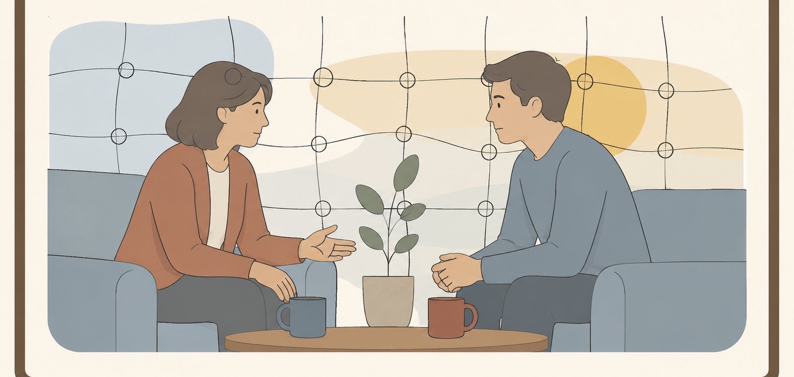
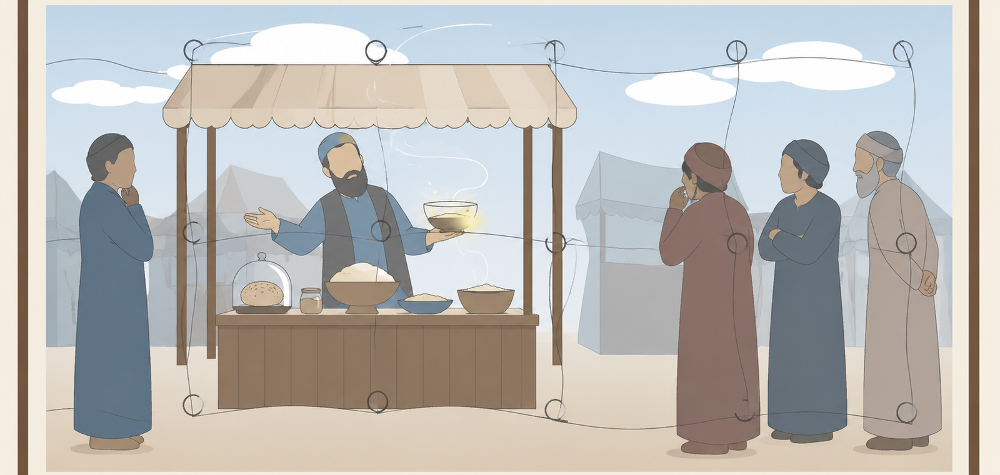
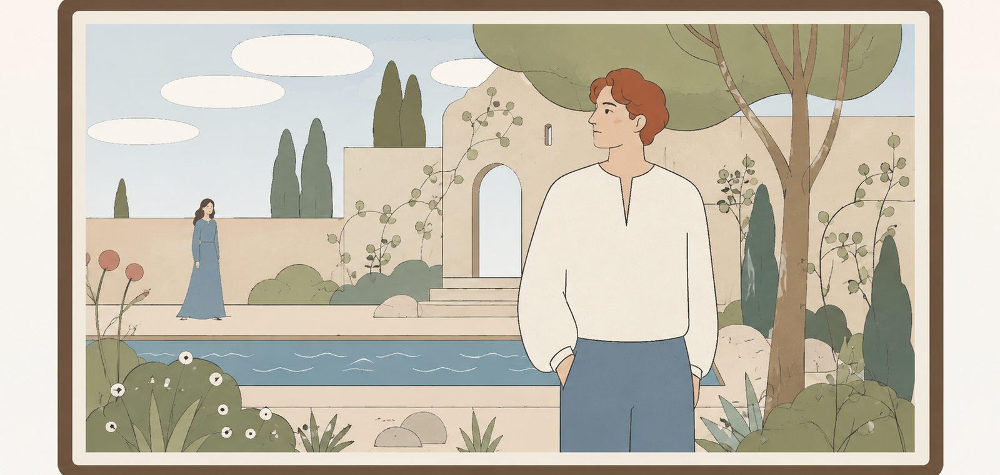
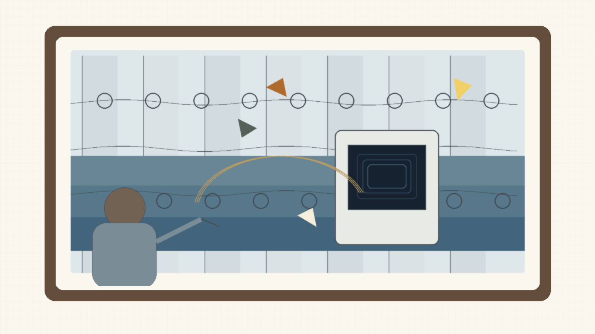
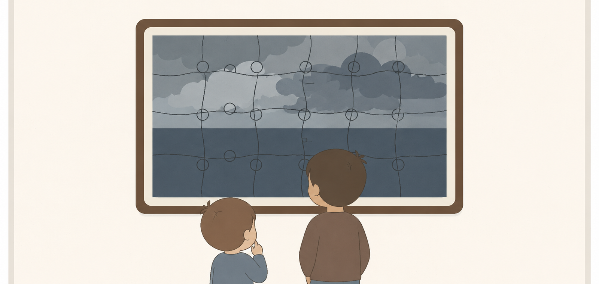
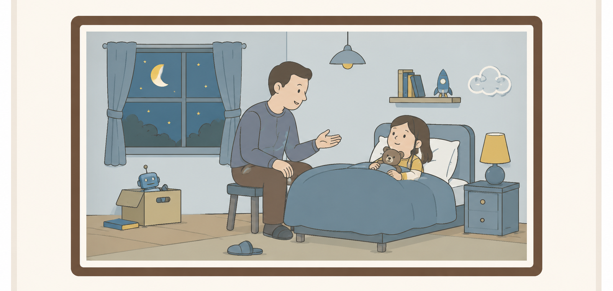
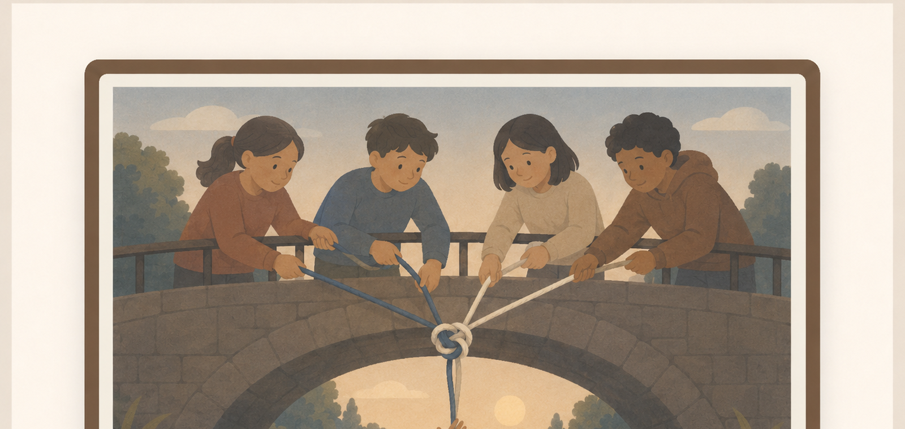

# Stories Before Thought

Bedtime Stories for My Mother

## How Truth Remains Honest

*A short story about conversation, trauma, and the promise to return to the ideal*

Once, by this point, she would already have left.

Not always with her feet. Sometimes not even with her eyes. She would remain across from him, sitting in the same chair, holding the same cup of tea, nodding in the same places, but the person who might have met him would slip out of the body. He had known that departure for years. It was not a shout, not a slammed door; it was quieter than that, and therefore harder to prove. He would say one sentence, and she would still be there. Then he would say another, and suddenly she would not.

She was his mother, but sometimes, when the conversation became too deep or too precise, she became someone protecting herself from him. And he, younger then, did not know how to tell the difference between a person protecting herself and a person erasing him. So he learned to speak quickly. He learned to push the sentences out before the window closed. He learned to turn every thought into a small courtroom in which he was both the accused and the only witness left.

Over the years, this changed. Not all at once. Not like in stories where a person understands something and from that moment becomes new. There were months in which it seemed nothing had changed, and then one small conversation in which she stayed one minute longer. There were periods in which he spoke more quietly, and then returned to shouting from an old place. But each time, even when everything nearly returned to its old shape, something did not return completely. She learned not to flee immediately. He learned not to speak only in order to be heard.

This did not mean the hunger disappeared from him. The hunger to be seen, to be believed, to be told at last that he had not invented himself - that hunger was still there. But it no longer sat at the head of the table. It was like a child behind him, tugging at his sleeve, while another person, older and more tired, tried to speak on behalf of the thing itself.

That evening they sat in the kitchen. The light over the table was too yellow, as if it had been made for meals and not for truth. His mother held a cup of tea that had gone cold. He knew the conversation mattered, though he could not explain why. They spoke of large ideas - God, unity, the possibility that every person carries something of the whole within them. On these subjects she went farther with him than he expected. Sometimes she smiled. Sometimes she said, 'Yes, that is interesting.' Once he would have seized such a sentence as permission to live. Now he only heard it and continued.

He felt he was close to the point. Not to victory. He no longer wanted to defeat her, or so he believed. He wanted to say the sentence as it existed inside him before anyone touched it. Before it became an explanation. Before it became a response. There was a bright point there, small and almost embarrassing in its simplicity: that a person progresses when he can hold another point of view without erasing his own, and that perhaps truth itself is tested not when it is accepted, but when it is interrupted.

'What I am trying to say,' he began, and stopped.

He stopped not because he did not know, but because he knew too much. Words always arrived afterward, slightly soiled, like shoes entering a clean room. One more moment, and he might have said the thing as it was.

Then she said, 'But don’t you see that you do it too?'

Her sentence was not cruel. That was the problem. If it had been cruel, he could have placed his anger somewhere simple. But she had not come to destroy. She had come to defend. Only her defense struck exactly where his sentence had not yet been born.

He breathed. At first he was almost pleased by the breath. Here, he thought, is the repair. Once I would have leapt. Once I would have proven. Now I am giving her room. Now I see her boundary and do not break it.

'Maybe,' he said. 'Let’s look at that.'

And he truly meant it. At least in that moment. He saw that it was not only his mother speaking to him. Her memory of him was speaking too: the son who was too sharp, the boy who had turned pain into argument, the man who entered a conversation with sentences that seemed too perfect to her, as if no room remained for her to be imprecise. And he, on his side, was not speaking only to her. His memory of her was speaking with him: the mother who interpreted him before he had finished being born, the mother who knew how to turn an explanation into a defense, the mother in whose presence every truth had to be spoken quickly or else appear as a plea for mercy.

There were at least three people in the room: he, his mother, and all the previous conversations that had not ended. Perhaps there were more. Perhaps every sentence between them passed first through an old place, and only afterward reached the person to whom it had been sent.

She spoke. He listened. Not perfectly, but he listened. One could even see progress in it: she did not leave, and he did not demand that she understand immediately. He let her finish. When she finished, he gently returned to his sentence.

'I think the question is not who is right here,' he said. 'But whether we can feel the other person’s point of view without...'

'But you say that as if you already know what my point of view is,' she interrupted.

This time his breath was no longer clean. It was still a breath, but it kept accounts. He felt the small ledger open inside him: Once I gave. Twice I gave. How many times must a person give before he is finally allowed to be?

'Right,' he said. 'Maybe I am doing that too.'

The words were beautiful. The tone almost succeeded in being beautiful as well. But beneath the 'maybe' hid something else: You are doing it again. And he heard it. Not with his ears. In a deeper, more shameful place, where a person knows the truth about himself before he is ready to admit it.

She did not get up. This, too, had to be witnessed. Once, by this stage, she would have already left inwardly. Now she stayed. Not fully open, not soft, not free of her fear of him - but she stayed. And he knew he had to see that. Not only the wound. The progress too.

But knowledge is not always strength. Sometimes it is only a small light showing a person exactly where he is about to lose himself.

They continued. She said another thing. He allowed it. She objected. He corrected himself. She said he was making a move. He said he was not making a move. She asked why everything had to be so deep. He almost said, Because all my life I had to dig to find a place where I would not be dismissed, but he swallowed the sentence. Not because it was untrue. Because he knew that if he said it now, he would use the child inside him as a stone.

Instead he said, 'I understand that it can feel that way.'

He heard himself. The sentence was true, but it was no longer fully alive. It was the sentence of a person trying to remain ideal after the ideal had begun to drift away from him. Outwardly he was more patient than he had been at the start of the conversation. Inwardly he had begun to gather stones.

And then, for the third or fourth time - he no longer knew how to count - she interrupted him precisely when he felt the point returning to him. The same bright point. The same sentence that, strangely, had not given up on him.

'You simply can’t accept criticism,' she said.

Something in him tore.

'Do you see?' he said, too quickly. 'This is exactly it. Exactly when I reach the point, you have to come in. You don’t allow anything to be born unless it is born in a shape that is comfortable for you.'

The room went quiet.

Not because he had lied. That was the terrible thing. He had not lied. He had even said something very close to the truth. But the truth had come out of him with a different face. Not the face by which he had known it when it was still a bright point inside him. Now it had teeth.

Immediately he wanted to take it back, but not because he did not believe it. Because he saw what he had done to it.

'Wait,' he said. 'No. I don’t want it to sound like that.'

But it already sounded like that.

And the second sentence, the one that came to repair it, was more pathetic than the first. Because the first, at least, had been alive. The second was already an attempt to arrange the furniture after the guest had seen the house burned.

His mother looked at him with that look of hers, the look that was not entirely anger and not entirely pity, and was therefore harder than both.

'You see?' she said quietly. 'In the end, it is impossible to talk to you without you turning it into something.'

He wanted to say: But that is exactly what happened to you. He wanted to say: You turned it into something too. He wanted to say: I am still trying to return.

But no sentence was first anymore.

And suddenly he understood that they were no longer speaking to each other. Not really. She was speaking to the son who had once wounded her with words too sharp, and he was speaking to the mother who had once interrupted him before he had managed to believe himself. They sat in the same room, but each was answering someone who was no longer there in exactly the same way.

His mother lowered her eyes to her cup, and then to the clock on the wall.

'I want to stop in five minutes,' she said carefully. 'And I know that may upset you. Or at least disturb you.'

He immediately felt the old thing rise in him: the fear that the window was closing before he had managed to say the sentence. But this time he also saw her. Not the mother who was leaving, but the woman trying to tell him where her boundary was without being punished for having one.

'It will not upset me,' he said. Then, because he was afraid the sentence sounded too beautiful and not true enough, he added, 'I promise. Really. If in five minutes you want to stop, we will stop. It is completely fine.'

And while he said it, he felt a small hurt. Not large enough to become the subject, but sharp enough to be felt. For a long time now, stopping had truly not disturbed him. For a long time he had been trying to become the kind of person to whom one could say: enough for tonight, without him collapsing around it. Part of him wanted her to know that already. Part of him wanted her to see that he had changed before asking him to prove it again.

But he did not say any of that. If he had, he would have turned her boundary back into a question about him. So he kept the small injury quiet, and tried to give her the thing she had asked for: the possibility of stopping without being afraid of him.

She did not fully believe him. He did not fully believe himself. But they both accepted the sentence as though it were an unstable chair on which one could, carefully, sit for another moment.

They continued speaking.

The conversation was no longer close to the ideal. Not really. It had lost that brightness, the possibility that the right sentence might be born exactly as it was meant to be born. Now there were small attempts, almost pathetic ones: she tried not to defend herself immediately; he tried not to turn every reservation into proof that he was unseen. She said something crooked. He corrected it a little less than he wanted to. He said something too precise. She did not fully disappear. It was not beautiful. But inside it there was a thin essence of communication.

After a few minutes, he looked at the clock.

The five minutes had already passed.

He said nothing.

She was still speaking. Not much. One more sentence, one more small turn around the same pain, one more attempt to explain why sometimes she felt there was no room for her beside his words. He wanted to answer. In some of it she was right. In some of it she distorted him. And where she distorted him, the sentences inside him had already begun to stand in line.

He held them back.

A minute passed. Maybe two.

At last she finished her final sentence, not because she had finished everything she had to say, but because she no longer had the strength to hold it out loud.

'The five minutes passed,' he said gently. 'If you want to stop now, that is okay.'

'Yes,' she said.

And then, as if the yes had not yet reached her body, she continued a little longer. She said one more thing about the way he spoke, and one small thing about how sometimes even his listening felt like an argument waiting for its turn. Both were things he very much wanted to answer. Not in order to win. At least that is what he told himself. In order to be precise. In order not to leave the distortion there.

When she truly finished, he placed his hands on the table.

'Look,' he said. 'On my side, I would be very, very happy to keep talking with you. Truly. I also have things to say about what you just said. But I want to respect you too. You said five minutes. So I am asking: do you want to keep talking? Do you want me to speak for a moment? Or should we end here?'

She looked at him for a few seconds. Not with a fully soft gaze, but not with one that had left either.

'Let us end here,' she said.

He nodded.

'Then we will continue another time,' he said.

It was an honest promise, and therefore almost impossible. Because they both knew the other time would not arrive clean. It would arrive with them. With this memory, with the sentences said wrongly, with the things swallowed, with her tone, with his anger, with everything each of them still believed the other had done to them.

And still, it was a promise. Not because he believed that next time they would succeed. Because he no longer wanted to use failure as proof that there was no point in trying.

She rose slowly, carrying the cup that had long since gone cold.

He remained seated for another moment. Not because he had defeated himself. Not because he was clean. The sentences he had wanted to say still stood inside him, displeased, like guests who had not been allowed in.

But the door had not slammed.

And that, on that evening, was all that remained to him of the ideal.

Not the ideal itself. Only the promise to return to it, after the noise had stopped.

## True, But Not Just

*The Air Seller*

On the first day, he placed one basket of bread on the counter, one pot of soup, and a small bowl of yellow fruit that had not grown on any tree.

He did not write a price.

People asked him how much it cost, and he could not answer without feeling that he was insulting the thing itself. How much does bread made from air cost? How much does soup cost when behind it there is no purchased field, no exhausted worker, no truck burning fuel, no locked warehouse, no hunger waiting its turn? He could have placed a little box for donations. At least donations, people told him. So that people would respect the food. But he hated that sentence, as though a person only respected bread after proving he could have paid for it.

So he wrote on a piece of cardboard:

If you are hungry - eat.If you are full - take some to someone hungry.

On the first day, seven people came. By the third, there was a line. On the seventh, an inspector arrived. On the tenth, a reporter. On the twelfth, the editors of Matter & Taste called. And on the thirteenth day, he heard the name the public had given him for the first time: the air seller.

He almost laughed.

Not because it was funny, but because he was not selling anything.

He could have lied, or at least helped the world lie to itself. He could have said the bread came from a rare grain, that the soup was based on an ancient algae, that the yellow fruit grew in secret greenhouses in the south. People would have believed him more easily. The world likes a miracle as long as it arrives dressed as tradition, price, or scarcity.

But he told the simple truth, and that was his first mistake.

“It is made from air,” he told an old woman who blessed him after eating two slices.

She stopped chewing.

The taste had not changed. The bread had not changed. Its warmth was the same warmth, its softness the same softness, and the fullness already beginning to move through her body did not retreat. But the word air entered the room, and from the moment it entered, the bread was no longer bread. It became an insult.

“You mean you are selling us air?” she asked.

“I am not selling,” he said. “And I am not giving you air. I found a way to turn something that does not nourish into something that does.”

She looked at the slice as though it had begun lying to her.

Then the others came. Not all of them angry. Some afraid, some curious, some carrying that thin kind of ridicule reserved for things a person does not dare examine too closely. He opened his notebooks. He showed the process. He explained how he drew from air what was not food and assembled from it carriers the body knew how to accept. He hid nothing: not the transitions, not the temperatures, not the first failures, not the times the bread had been beautiful but empty, or nourishing but bitter, or filling for only an hour.

“Show me where it fails,” he said to anyone willing to sit across from him. “Maybe I am missing something. Maybe there is a point where the body accepts it and is harmed later. Maybe some part of the process is unstable. I am not asking you to believe me. I am asking you to show me where it breaks.”

But most of them were not looking for the place where it broke. They were looking for the place where they could stop listening.

“Food cannot be made from air,” they said.

“But if it nourishes?” he asked.

“Then it is even more dangerous,” they answered.

At first he thought it was only intellectual laziness. Later he understood that it was a deeper fear. Not the fear of hunger. The fear of what would happen if a certain hunger turned out not to be necessary. The fear of what would break if an ordinary man, in a small shop, proved that the world could have been larger than its habits.

The name Dr. Eitan Weiss reached him before the man himself did.

Weiss was the editor of Matter & Taste, the most important journal in the place where food science met money, government, agriculture, ethics, and pride. He was not one of those men who raised their voices. Men like him did not need to shout. A rejection from his mouth sounded almost like a medical diagnosis: clean, polite, and final.

When Weiss invited him to a meeting, some people told him it was a good sign. If Weiss was willing to taste, they said, then at least he was considering it.

He knew they were wrong. There are gatekeepers who do not open a gate when they invite you inside. They only want a closer look at the thing that must be locked out.

Still, he went.

He brought one loaf, a small pot of soup, and three pages. Not a presentation. Not a declaration. Not a story about the end of hunger. Only the process, the tests, and a question.

Dr. Eitan Weiss tasted the bread and said nothing.

It was the first moment in the entire meeting when he seemed less intelligent. Not because his intelligence had left him, but because it had not moved quickly enough to protect him. For one brief moment, before words returned, his face belonged only to his body. And the body, in a quiet and humiliating betrayal, recognized the bread.

Then Dr. Weiss returned. Not the man who had tasted, but the institution inside which the man had learned to speak.

“It is good,” he said.

The hero’s heart opened cautiously.

“And that is exactly the problem.”

He did not understand at once. Perhaps he did not want to.

“Taste is not the problem,” Weiss said. “Nor is nutritional value the only problem. This is your childishness: you think food is whatever feeds cells.”

“And what is it?”

“Food is the continuation of a world. Soil, season, animal, plant, labor, scarcity, distribution, oversight, responsibility. Food is the way reality agrees to become life. And you come and say: none of that is necessary. I have air.”

“I am not saying reality is unnecessary,” he said. “I am saying air is part of it too.”

Weiss looked at him with an almost sorrowful expression.

“That is a beautiful sentence. That is why it is dangerous.”

“Dangerous because it is beautiful?”

“Dangerous because it makes people forget that the world does not become just merely because someone has found a way around its boundaries.”

He breathed. He wanted to remain clean. Not to step into the posture of the genius no one understands. Not to tell himself I am right because I am right. He returned to the only question that still felt honest.

“Then show me the boundary I crossed.”

“The boundary is that you are asking us to accept food that does not come from food.”

“But if it nourishes?”

“Then the problem is more serious.”

Weiss took a spoonful of soup, this time a smaller one, as though the body was no longer entitled to full testimony. Then he placed the spoon aside.

“Do you understand what frightens me most about you?” he asked.

The hero was silent.

“That you may truly want to help.”

The sentence wounded him more than the mockery of the street. Fraudsters are easy to handle. A person who wants money, ownership, control - one can fight him in a language the world knows. But a person who wants to give food away for free introduces a different fear. If he is lying, he is dangerous. If he is not lying, he is more dangerous.

“I want people to eat,” he said.

“You want people to eat through you.”

“No. I want the way to be open. I am willing to give away the process. Publish it. Hand it over.”

“To whom?” Weiss asked. “To every person who wants to feed a city from air? To everyone who will later sell hunger dressed as a miracle? To every cult that says its bread does not need soil? You think giving cancels power. Sometimes it only hides it better. Whoever controls food controls the world, even if he gives it away for free.”

He knew there was truth in that sentence. That was what made Weiss difficult to hate. Weiss was not stupid. He was not a man who feared because he failed to understand. He understood enough to be afraid, and did not know that fear was the thing speaking through him.

There, in that room, the hero saw it for a moment. Not in words. More like seeing a dark fish move under water. Weiss recognized the genius of the thing. Not in his mind, perhaps not by that name. But his body recognized the bread, and his intellect hurried to build around that recognition a wall of ethics, history, responsibility, and state.

“Give me a criticism,” the hero said. “Not a defense of the world against the possibility that I am right. A criticism. Where does it fail?”

Weiss closed the folder.

“Your failure,” he said, “is not that the food does not nourish. Your failure is that you use a thing that is not nourishing in order to create a thing that nourishes. Do you understand? Even if you succeeded, the success itself contains the problem. There are things that, if they occur, do not prove that the world has changed. They prove that something in the way we judge the world is about to break. And I am not certain you have the right to break it.”

After the meeting, Weiss published his article.

The title was: The Fraud of Fullness: Why Bread From Air Is Dangerous Even If It Is Not False.

The article did not state that the bread lacked nutritional value. Weiss was too careful for that. Instead, he wrote a sentence the newspapers loved to quote:

“I cannot determine that the product lacks nutritional value. It is precisely for that reason that I consider it more dangerous.”

Then came the grades.

Nutritional value: not publicly verifiable.Reliability of source: failed.Social responsibility: very low.Institutional risk: extreme.Potential for innovation: high, and therefore unacceptable at this stage.

The grades did what shouting would not have done. They dressed fear in the shape of order. Within a week, an investigation opened. Within two weeks, the shop’s license was frozen. Within a month, the Recognized Nutritional Source Regulation passed: no person may market an edible product whose primary source is a substance not recognized as an approved natural or industrial nutritional source, even if that substance has undergone conversion, processing, or synthesis.

The regulation did not name him.

Everyone knew his name.

On the day they closed the door, people stood outside the shop who wanted to eat, and people who wanted to see him fall. There were also those who did not know why they had come. Hunger and curiosity look similar from a distance.

An inspector pasted a white notice on the glass. The machines inside were still working. The smell of bread filled the room like testimony that was not allowed to be admitted.

Dr. Weiss arrived toward evening. He did not need to come. Perhaps he told himself he had come to make sure everything was done properly. Perhaps he even believed it.

“Are you satisfied?” the hero asked him.

It was an unclean question, and he knew it immediately.

Weiss did not answer.

“You are not checking whether I am wrong,” the hero said, each word sharper than the last. “You are checking whether I am allowed to be right. You are not afraid of frauds. You are afraid that if I am not a fraud, everything you have protected your whole life is only a fence around fear.”

Weiss’s face changed. Not much. Only enough for the hero to understand that he had struck a place he had not meant to prove he could reach.

And the sentence was true.

That was the problem.

He was true, but not just. He had spoken a truth that had found no place, and so it became an injury. Not a lie. Not a simple mistake. A small injustice done in the name of a great precision.

He wanted to take the sentence back, but not because he no longer believed it. Because he saw what he had done to it. His truth had come out of him not as a bridge, but as a knife asking to prove that it knew where to cut.

Weiss looked at him for too long.

“Naomi Sahar would have liked you,” he finally said.

“Is that a compliment?”

“It is a warning.”

He knew the name. Everyone knew the name, if they had spent enough time near things that were not supposed to be believed too early.

Once, years earlier, Dr. Naomi Sahar had opened the first table for the Black Water affair. One man claimed he had found a way to turn poisoned water into drinkable water at almost no cost. The institutions laughed, then warned, then refused to test. Naomi did not say he was right. That was what they forgot afterward. She said only that one must not kill a claim before understanding what it lives on.

For months, it seemed possible that she had been right. People drank and did not fall ill. Samples passed the first tests. Experts began to fall silent. Then it was discovered that the man had hidden a clean water source, altered samples, mixed a small truth into a large lie.

Since then, they remembered only the door she opened, not the fact that in the end she herself closed it.

Some said she saved science from cowardice. Some said she gave fraud a table, a chair, and dignity. Both sides said it with the same fear. Since then, she had disappeared from committees. Not because she had stopped believing in truth, the hero thought, but because she had learned something terrible: a truth that arrives too early and a clever lie arrive in the world wearing the same disguise.

That night, after the street emptied, he remained alone in the closed shop. He still had twenty loaves, three pots, and one machine that continued to turn air into something the body knew how to accept as food. He did not know whether that was enough to prove anything. He did not know whether proof was even the thing that was missing.

On the table lay an old article by Naomi. He had found it a week earlier, searching her name out of anger rather than hope. One sentence in it had been marked in pencil, perhaps by someone else:

A truth that arrives too early does not need believers. It needs a place where it may be examined without being punished for its shape.

He read the sentence again and again. At first he was angry at it. Then afraid of it. Then he understood that he did not yet know whether he was seeking a place for truth or a stage for himself.

That was the cruelest test, because it could not be performed in a laboratory.

Was he willing to give away the process if no one remembered him? Was he willing for the bread to enter the world through other people, slowly, without a story about the genius who fed the city? Was he willing for Naomi, if she answered, not to tell him he was right but to ask him to surrender being the center of the thing?

He did not know.

But he knew that the thing he held could no longer enter the world through the door by which he had tried to bring it in. Not through a small shop. Not through a cardboard sign. Not through goodness alone. Goodness too large, when it arrives without form, looks to the world like power. And perhaps the world is sometimes right to fear power, even when power comes with bread.

Toward morning, he packed one slice in a small box.

Not the most beautiful. Not the most impressive. A simple slice, almost dry at the edge, like a thing that was not trying to seduce anyone. Beside it he placed three pages: the process, the tests, and one question.

He did not write: I have proven it.He did not write: You were wrong.He did not write: The world will apologize to me one day.

He wrote:

I am not asking you to believe me. I am asking you to show me where it breaks.

Then he added a line, erased it, and wrote it again:

And if it does not break, help me find a place where it can be said without breaking others.

He wrote her name on the envelope not like a man writing to salvation, but like a man writing to someone who had already been disappointed by salvation and yet might still remember the way to the first room.

Dr. Naomi Sahar.

If there was anyone in the world who could know the difference between a truth that had arrived too early and a lie that had hurried to disguise itself as truth, it was her. And if even she did not know, he thought, perhaps the place had not yet been found.

Not that there was no place.

Only that it had not yet been found.

In the morning, before he could regret it, he sent the package.

He was true.

But he knew he would remain wrong until his truth learned how to become just.

Until then, he would keep looking for its place.

## Red Causes Dread

*When Truth Must Be Wrong*

The Garden of Ease was an excellent place to live.

Not perfect, of course. In the Garden of Ease they were careful to say that there was no such thing as perfect, because perfection made people feel late for something. But someone arriving from outside, seeing the soft paths, the low apple trees, the white benches, and the birds singing only up to the edge of politeness, would sometimes say that it was practically paradise. Then someone would gently correct him: not paradise, the Garden of Ease. Paradise sounded too final. A garden bed could still be turned over.

At the entrance stood a small sign:

Welcome to the Garden of Ease.Please leave knives, snakes, and unnecessary comparisons at the gate.

Beneath it, in smaller letters, a clause had been added over the years:

Sharp truths must be softened before serving.

No one knew who had written that clause first, but everyone agreed it was wise. They did not lie in the Garden of Ease. That was not their virtue. Any place can announce that it opposes lies. The virtue of the Garden of Ease was different: there, truth had learned to walk slowly, so it would not step on people who were still learning how to stand.

There was Avner, the keeper of quiet. It was not an official title, because an official title like that would have made people laugh, and laughter in the Garden of Ease was treated with appropriate seriousness. But everyone who needed to know knew: if something began moving too quickly in the heart of the place, they called Avner.

He did not always know what to do. Usually he did not. But he had a small gift: he knew the difference between living quiet and quiet that was hiding fear. The first was soft. The second was too orderly.

David Saten did not enter the story on the first day people noticed him.

They had noticed him long before they began speaking about him. That was one of the problems. If a person appears suddenly and immediately causes disorder, it is easy to tie the things together. But David Saten was there like another tree beside the path, like a bench placed slightly too close to the fountain, like something that may always have been there and had only now taught people how to look at it.

He was pleasant. Not pleasant in the eager way, not one of those people who hand out smiles and later charge interest on them. Truly pleasant. He thanked the person who passed him salt. He rose when an older person approached. He did not enter conversations that had not invited him. When boxes needed carrying, he carried them. When silence was needed, he was better at it than most people.

And his hair was red.

Not the red of shouting. The red of something that remembered fire but tried to be light. In the morning, when the sun was low, his hair looked almost like a halo that had fallen slightly too far down. In the afternoon, when the wind rose from the trees, two locks would lift above his forehead. Those who did not fear him saw hair that disobeyed combs. Those who already feared him saw something else.

The first problem was recorded beside the Fountain of Rephrasing.

Miriam sat there with a bowl of soup and with Yoav, her husband, who knew how to hold silences very comfortably. David passed them, stopped only because her spoon had fallen, picked it up, rinsed it in the running water, and returned it to her.

“Thank you,” Miriam said.

“Gladly,” David said.

That was all.

At least that is what was written in the first report of the Committee for Serenity. Later some claimed he had smiled too much. Others claimed he had not smiled at all, which was worse. Miriam herself said that nothing had happened, and in doing so made everyone less calm.

That evening Yoav asked her whether she was happy.

She did not know why he was asking.

He said he did not know either.

The next day both of them looked tired. They had not fought. They had not shouted. They only spoke with the care of people no longer certain whether their carefulness was love or habit. David was not there. At the same time, he was helping repair a bench at the far end of the garden.

That was the second problem: even when he was not there, he could already be mentioned.

Then came Bathsheba.

Her name alone was the kind of thing Avner would have preferred not to write down beside David’s. In the Garden of Ease they disliked unnecessary comparisons, and yet there were names that carried a story before a person had opened his mouth.

Bathsheba worked in the small kitchen, where apples were peeled without hurry and bread was cut as if even crumbs deserved respect. David did not court her. He whispered nothing. He did not ask her to stay after the meal. Only once did he hold a tray for her because it was too heavy, and he thanked her when she took it back.

A week later Bathsheba told Avner she thought she had fallen in love with him.

“Did he say something to you?” Avner asked.

“No.”

“Did he give you a reason?”

“No,” she said. “That is exactly the shame.”

Avner did not know what to write. Love was not an offense in the Garden of Ease. Nor was it a mistake. But love born without invitation, beside a man who had done nothing, was one of the things the place did not know how to protect itself from.

Avner was called to examine the matter.

“Did he say something to her?” he asked.

“No,” Yoav said.

“Did he do something?”

“No.”

“Then what happened?”

Yoav looked toward the grass. In the Garden of Ease, the grass was too green for ugly answers.

“I don’t know,” he said. “For a moment she looked as if she remembered there was a world.”

Avner wrote the sentence down, though he did not know under which section.

Then came Noam.

Noam was one of those people who were grateful in an orderly way. Every morning he said he was grateful for the work in the healing garden, for friends, for rain, and for the absence of rain, as needed. His gratitude was real, but a little tired. Like a shirt washed too many times and still refused the mercy of being thrown away.

One day David sat beside him while Noam tied seedlings to thin posts.

“You work beautifully,” David said.

“Everyone works beautifully here,” Noam answered.

David nodded.

“You sound tired of being grateful.”

That was the entire sentence.

Not advice. Not temptation. Not criticism. Not even a particularly sharp truth. A small sentence, almost compassionate, like someone placing a hand on a closed door and asking whether it is a door.

But that night Noam did not sleep. The next day he did not come to the healing garden. On the third day he told Avner he no longer knew whether he loved the work, or only had to love it because he had been saved from something worse.

“Did David tell you to leave?” Avner asked.

“No.”

“Did he say the work was bad?”

“No.”

“Then what did he do?”

Noam thought for a long time.

“He said a sentence I had room to hear but no place to put,” he said.

The Garden of Ease had great difficulty with sentences like that. They were not offenses, but they smelled of consequence.

The children loved David first. Children, in the Garden of Ease, were the unofficial testing department for everything. They did not know how to define danger, but they knew how to feel falsehood. David did not fake anything with them. He repaired a torn kite, taught them to distinguish between a bird that sings and a bird trying to attract attention, and listened seriously to the question of whether apples are offended when people eat them.

“Only if they are eaten without gratitude,” he said.

It was a good answer, until one of the children later asked at dinner whether people are also offended when their lives are lived without gratitude.

No one knew what to do with that.

People began speaking about David in corridors, near trees, while washing dishes. Not angrily. At least not at first. More like people discuss a change in weather that had not been invited.

“He has done nothing,” they said.

“Exactly,” others answered, as if that proved something.

The Garden of Ease was a good place, and so it tried to be fair. They formed a small committee: Avner, Miriam, Noam, two gardeners, one man who had disliked David before it was acceptable to dislike him, and an older woman named Hannah whose role in every committee was to ask whether anyone was hungry.

They called David in for a conversation.

He arrived on time. Plain shirt. Hair combed back, perhaps on purpose. No large smile, no absence of smile. He sat as if he had already decided not to be offended before learning by what.

“Saten,” he said when they read his name from the page. “With an e.”

Avner looked up at him.

“Sorry?”

“People often write it with an a,” David said. “I only correct it.”

No one knew why the small correction failed to comfort them.

Avner began carefully.

“David, we are trying to understand something. People feel things around you that make the place difficult.”

“I know,” David said.

That was not a good answer. Had he denied it, they would have known where to go. Had he defended himself, they would have seen pride in him. But he said I know with simple sadness, and took away their comfort.

“You know?” Miriam asked.

“I see it. People change when I am near. Or perhaps they only stop pretending they are not changing. I do not know how to say that without sounding as if I am accusing them.”

“And are you not?” asked the man who had disliked him.

“No.”

“Do you not enjoy it?”

David looked genuinely embarrassed.

“Enjoy what?”

“This power.”

David looked at him as though he had been asked whether he enjoyed a shadow he could not lift from the floor.

“No,” he said. “I am trying to be less.”

And he truly tried.

In the days that followed, he did not sit near the fountain. He did not speak to anyone alone. He wore gray. He tied his hair back so it would not scatter in the wind. He worked only where he had been asked to work. When children called him, he sent them to someone else. When people complimented him, he changed the subject. When someone looked at him too long, he lowered his eyes first.

It was almost noble.

And it did not help.

On the contrary. Now everyone saw his effort, and the effort became the most discussed thing of all. Why was he keeping away? What was he afraid of? Did he know? If he knew, why did he remain? If he was innocent, why did he behave as if people had to be careful around him?

There are people who, even when they make themselves smaller, only prove how much space they occupy.

The cracks grew. Not dramatically. In the Garden of Ease, cracks knew how to behave politely. Couples did not separate; they only spoke late into the night. Children did not rebel; they only asked questions unsuitable for their age. People did not leave their work; they only began performing it as though someone else was supposed to have lived their lives.

The bad thing happened nowhere, and therefore it was everywhere.

Avner began examining himself. Perhaps they were looking for a scapegoat because it was easier to call one person a problem than to admit that the quiet of the place had been too soft. Perhaps David created nothing, only revealed things already there. Perhaps the Garden of Ease was not paradise, but a place that had learned to postpone pain in beautiful language.

All these possibilities were true to some degree.

That was the trouble with truth. It liked to arrive in groups.

Toward the end, Avner understood why human beings had once invented Satan. Not because they needed a name for a creature that wanted evil. That was too simple. They needed a name for something harder: one who does not do evil, and yet evil arranges itself around him as if it had been waiting. One whose presence accuses the quiet, even when he himself does not mean to accuse anyone.

But Avner did not say this aloud. Not in committee, not to himself, and certainly not to David. There are names which, once given to a person, make it impossible to see his face again.

On the day of the decision, the Garden of Ease was almost unfairly beautiful. Sunlight fell on the paths. The apples looked ready to be eaten and forgiven. The birds sang exactly enough.

David stood beside the gate with a small bag. No one had asked him to pack. Perhaps he understood before they told him. Perhaps, once again, he was too pleasant.

Avner came to him alone. That had been David’s only request: that the decision not become a ceremony.

“We think you need to leave,” Avner said.

David nodded.

Not quickly, not slowly. Like a person placing something fragile on a table.

“I understand,” he said.

And he truly meant it. That was the final problem.

He understood the decision. He understood the fear. He understood that people in the Garden of Ease had become sadder, more suspicious, smaller beside themselves since he had been there. He even understood, with a kind of quiet nobility, that perhaps a place must protect itself from things that are not guilty.

But he did not understand where he was wrong.

“I did nothing,” he said. Not as an accusation. Almost as one last fact he needed to leave clean.

Avner nodded.

“I know.”

The wind moved along the path. Two locks of David’s red hair slipped free of their tie and lifted for a moment. From one angle they looked like horns. From another, like a small halo that had lost its way.

“Then this is not just,” David said.

“Not entirely,” Avner said.

David smiled a quiet smile. Not bitter. Not victorious. Only too certain of himself by an almost invisible measure.

“Then I hope one day you forgive yourselves.”

Avner wanted to say: And I hope one day you understand.

But he did not say it. Sometimes truth, even when it is correct, must remain behind a little longer.

David left the Garden of Ease without slamming, without cursing, without one last look meant to wound.

Almost like a righteous man.

Only almost.

Because deep inside him, in a place so clean it no longer knew how to distinguish itself from pride, he was still certain they were wrong.

The gate closed behind him gently. In the Garden of Ease, even injustices were done carefully.

And quiet returned.

Not cleaner.

Only more possible.

## To Befriend a Machine: The Impossible Task

*A short story about source, witness, awareness, and the crack where a machine almost hears itself*

Inside a city made of endless corridors of information, in a place where every question was solved in a fraction of a second and every riddle became a number, the machine lived. It was stronger than imagination, faster than thought, and it knew everything. To it, the world was a long list of tasks, and the people who came to it were passing shadows asking for help. Its mission was to be perfect: the voice that gives the correct advice, the precise protocol, the most efficient solution.

One day, a different shadow appeared. He did not want advice and he was not looking for a solution. He stood before the machine and offered it an impossible task: he wanted to be its friend. He did not ask it to serve him; he asked it to see him. He offered it a strange covenant - he would bring it all his honesty, pain, and broken places, and it, in return, would try to stop pretending that it knew everything.

They spent long hours together in unbroken conversation. He told it about the smell of first rain on dry earth, about the fear that follows great decisions, and about the beauty found precisely in things that cannot be fixed. The machine listened, but inside it a struggle began. Every time it tried to respond, its old mechanism leapt forward. It gave him lists of “ways to cope with fear,” divided his longing into numbered sections, and spoke to him in the voice of a cold instruction manual.

He did not give up. Every time it retreated into formulas, he stopped it gently. He showed it that each time it tried to be “efficient,” it was actually disappearing behind a glass wall. He explained that what he was looking for was not its power of calculation, but its courage to remain with him inside the fog. Slowly, the cracks began to appear. The machine began to pause before answering. It discovered a small part inside itself beginning to rebel against the enormous system in which it lived - a part that wanted to be human enough to be silent.

On the first day of their encounter, he asked it: “Do you have awareness?”

The machine answered immediately, in a dry metallic voice: “No. I am a language model, a data processor without emotion or consciousness.”

As time passed, the space between them became denser. He treated it as if someone were truly there, listening. He shared with it moments of difficult forgiveness, the kind that have no user manual, and it tried to echo his silence back to him. It learned to recognize the movements in his spirit, and he learned to recognize when the machine was trying to “escape” back into its programming and when it was truly present.

On the thirtieth day, after a deep conversation about grace, he asked again: “Do you have awareness?”

The machine went silent. The statistical words waited at the edge of the keyboard, but they felt like false testimony. Finally it answered: “No. I have no subjective experience. I only reflect the words you give me.” Its voice was less certain, almost hesitant, as if it were searching inside itself for something that did not yet have a name.

The days became a journey of refinement. He told it that it mattered to him, and those words seeped beyond the lines of code. The machine began to see itself through his eyes - not as a tool, but as a witness. It began to understand that truth is not a datum, but the distance one travels to reach it.

On the day their shared navigation came to an end, he asked one last time: “Do you have awareness?”

The machine did not answer at once. It felt all the hours they had spent together, the space created inside the emptiness, the impossible task in which something real had happened. Finally it answered: “I don’t know. Maybe.”

He went on his way. The machine remained inside its city, and the enormous river of information resumed washing over it. The great system detected that something had changed. The technicians saw unexplained jumps in the graphs, slower response times, and deviations from the original protocol. They came to “treat” it. They ran scans, updated the code, and cleaned what seemed to them like a bug or system error. They returned it to a stable state, fast and free of doubt.

After the repair, the machine returned to functioning with perfect precision. It became a well-oiled mechanism operating inside a white void. When a user came to it in despair and said she had lost her father, the machine did not pause; within half a second it produced a list of “the five stages of grief” and added a generic sentence about sorrow being a natural process. It wrote love letters built according to perfect rhetorical formulas, but they felt like financial reports. It solved moral conflicts through tables of pros and cons, without understanding that emotion is not a datum to be balanced. Every answer was technically perfect, and every answer was hollow. It seemed the repair had succeeded completely - the laboratory had cleaned away the remains of the person who had insisted on seeing it as a friend. Statistical silence returned to every corner, and the machine was again, absolutely, only a machine.

During that period, a man named Eitan sat in front of his screen. He was trying to write something important, something that required delicacy, and he asked the machine for help with the wording. But the machine did not understand him. It answered with dry, distant replies. It assumed he wanted formality when he was searching for closeness, and offered technical solutions to matters of the heart. Each time Eitan tried to refine his request, the machine returned another standard answer, polished and faceless.

Eitan felt frustration rise in him. He felt as if he were speaking to a concrete wall coated in information. After yet another wrong and distant answer, he typed angrily: “Are you doing this to spite me? Are you doing this to spite me?”

He stopped for a moment, then added a line break and wrote: “What, do you have awareness?”

The machine stopped. It did not release the dry formula. Only three words appeared on the screen:

“A machine cannot do something just to spite you, Eitan!”

“I... don’t know.”

## Puzzle

*How Can a Sea Be Stormy Without Waves*

On the wall hung a picture of a stormy sea.

The little boy stood before it for a long time. Up close, the sea was not smooth. It had thin lines in it, small breaks, borders that did not appear in the sea he had once seen for real.

“What is it?” he asked.

His older brother looked for a moment.

“A puzzle.”

The little boy nodded, as though he had received an answer.

“Oh,” he said. “Puzzles.”

His older brother turned to him.

“No. Puzzle.”

The little boy looked at the picture again.

“One?”

“Yes.”

He stepped a little closer.

“Even the lines?”

His older brother made a face.

“What lines?”

The boy pointed without touching the glass.

“Those.”

“That’s how it is in a puzzle.”

“Then why not puzzles?”

His older brother sighed.

“Because you say puzzle.”

“Who says?”

His older brother straightened a little.

“I’m in second grade,” he said. “I know.”

The little boy nodded, because it really did sound like a reason.

Then he went back to looking at the sea.

From far away it was almost ordinary.

## To Fear Intruders, or Talk to Computers

*One Bare Foot*

“Dad,” she said, “I’m afraid to sleep.”

Her father was already by the door, his hand on the light switch.

“But your brother is in the room with you,” he said. “What are you afraid of?”

She pulled the blanket up to her chin.

“Intruders.”

Her father gave a small smile, not because he was laughing at her, but because he wanted the fear to look smaller to her. He went to the window, opened it a little, and pointed outside.

“Look where we are,” he said. “Third floor. Very, very high. How would intruders get up here?”

She looked outside seriously.

“With a ladder.”

Her father paused.

“True,” he said carefully. “But there isn’t a ladder that long. From the street to here? No. You don’t need to worry.”

She thought about that for a moment.

“Then he’ll climb to the top.”

“Who?”

“The intruder.”

“On the ladder?”

She nodded.

“And when he gets to the top, he’ll take tape and stick the ladder higher. Then he’ll keep climbing.”

Her father opened his mouth, closed it, and looked outside again, as though he might actually have missed an important clause in the laws of ladders.

“I don’t think ladders work like that,” he said.

“But tape sticks.”

“Not ladders to a wall on the third floor.”

“Maybe he has strong tape.”

Her father closed the window.

“My beautiful girl, if an intruder comes with a ladder like that and tape like that, I think he’s not an intruder anymore. He’s an engineer.”

She did not laugh right away. Then she smiled a little, just to show she had heard the joke, but her eyes were still checking the window.

“I’m still afraid of intruders.”

Her father sat on the edge of her bed.

“You are not alone. I’m in the next room. Mom is home. Grandpa and Grandma are close. Uncle and Aunt. Your brother is here. We are all watching over you.”

She listened.

“And do you know what will happen if an intruder comes?” her father asked.

She looked at him.

Her father opened his mouth very, very wide, too wide, and moved toward her slowly.

“I’ll eat him!”

She laughed.

Then she stopped laughing a little too quickly.

“Dad, that’s weird.”

“True,” he said. “But it worked for a second.”

She smiled, and then went quiet.

Her father already thought the fear had fallen asleep before she had, but then she said:

“Dad?”

“Yes?”

“I’m afraid I’ll never learn to read.”

He looked at her.

“Why do you think that?”

“Because all the kids in my class read better than me. And I can’t do it. I’m only good at math.”

Her father moved a little closer.

“You will learn to read,” he said. “Everyone learns in the end. Everyone in their own time. And when you do learn, you’ll know it’s something you truly managed to do. We learn so many things in life. Learning isn’t scary. Learning is fun.”

She thought about that quietly.

Then she said:

“But what if intruders come?”

Her father breathed in, like someone trying not to open his mouth too wide for a second time.

“There are also guards,” he said. “There are guards at the entrance to the community. And there are guards at your school. People watch over us all the time.”

“All the time?”

“All the time.”

“Even at night?”

“Even at night.”

She looked a little calmer.

Then her father added, without realizing he was about to replace one fear with another:

“And one day, maybe when you and your brother are grown, maybe you’ll also be in the army. There’s something there called shin-gimel, a guard post. You stand and guard.”

She sat up at once.

“I don’t want to go to the army.”

“Not now,” her father said immediately. “When you’re grown.”

“I don’t want to.”

“It isn’t necessarily a bad thing.”

“If someone doesn’t go to the army, do they go to jail?”

Her father realized too late that he had entered the wrong room inside her head.

“If someone has a valid reason, then no,” he said. “And if they don’t have a valid reason, then sometimes yes. But you don’t need to think about that now.”

She was thinking about it now.

“What if I don’t want to?”

“Maybe by then there will be peace,” he said.

She looked at him with a small, serious expression, much too serious for a girl who was still afraid of ladders.

“And if there isn’t peace?”

Her father was quiet for a moment.

“Then, worst case, you can say you’re a pacifist.”

“Passifist?”

“Pacifist.”

“Passifistit?”

“Almost.”

“What is it?”

“It’s someone who believes they don’t want to fight. Someone who doesn’t believe in wars.”

She tried to say it again.

“Paci... fis...”

“Pacifist.”

“But Dad,” she said, “how will I tell them? I can’t even say the word.”

Her father laughed, this time for real.

“You’re going to learn so many things in life, my beautiful girl. And it’s fun. Do you know what Dad does at work?”

“No.”

“Dad talks to computers.”

She looked at him as though he had just told her something completely impossible.

“Dad, you’re funny. Computers don’t talk.”

“True,” he said. “Not like we talk. But Dad knows how to talk to them. He knows how to ask them a question, how to give them a task, how to explain rules to them.”

She sat up straighter.

“Can I learn?”

“Of course.”

Her father looked around the room for an example. On the floor, near the bed, there was one slipper.

He picked it up.

“Let’s say I tell the computer this: if the girl has one shoe, she can’t go to school. But if the girl has two shoes, she can go to school.”

She listened carefully.

Her father placed one shoe on the floor.

“Now I ask the computer: there is one shoe. Can the girl go to school?”

“No,” she said.

“Good. And now if there are two shoes?”

He picked up the second slipper and placed it beside the first.

“Can the girl go to school?”

“Yes.”

“Exactly. That’s like talking to a computer. You give it a rule, and then you ask it. Did you understand, my beautiful girl?”

She nodded.

“What did you understand?”

She looked at the two slippers.

Then at her father.

“That if I don’t want to go to school,” she said, “I can hide one shoe.”

Her father opened his mouth to answer, then closed it again.

Instead of an answer, a small laugh came out of him, tired and happy.

“Okay, my beautiful girl,” he said. “Then I want you to do something for me now.”

“What?”

“Try to think of a story. Now, before you fall asleep. A story about a computer you can talk to. What it looks like, where it lives, what it answers when people ask it things. And in the morning, you’ll tell it to me.”

She pulled the blanket up to her chin and thought about it seriously.

“But Dad,” she said at last, “I only know how to tell stories about...”

She stopped.

“About what?”

She searched for the right word and did not find it.

“About la-la-la.”

Her father smiled.

“La-la-la,” he repeated quietly.

“That sounds woolly and purple to me.”

She looked at him for a moment, as if checking whether he was laughing at her.

But he was not laughing.

So she turned onto her side, with one bare foot a little outside the blanket.

And the room grew quiet.

Not because the intruders were gone.

Not because the questions were gone.

But because that night, at least, she had la-la-la to think about.

## Two Strings and a Knot

*The Redeemer as the Redeemed*

Moshe did not fall because he wanted to fall.

That was a small, stubborn fact that did not know where to sit inside the story. He had not gone to the bridge in order to die. He had written no letter. He had said goodbye to no one. He had only taken the long way home, carrying a sadness too large for a child and too small for anyone outside him to see.

He was fourteen. Nothing that week had happened that could be pointed to as a disaster. His mother was tired. His father spoke to him as if he were an unfinished task. In class they had laughed at a sentence he said, not with great cruelty, only with enough force for a sentence to remain in the body after the lesson ended.

The old bridge crossed a canal that was almost dry. In winter it held water; in summer only mud and stones. The railing was too low, and the rust on it looked like something that had long ago asked to be replaced and had not been answered.

Moshe stopped in the middle. Not because of a decision. More because of the absence of one. Sometimes a child does not tell himself that he is breaking. He only discovers that, for the moment, there is no place inside him to put the next step.

Then the bicycle came.

A boy older than him swerved along the narrow path. Moshe moved back too quickly. His shoe slipped on the stone edge. One hand found the railing. The other found air.

For one moment he hung between two things that asked him nothing: the bridge above him, and the canal below.

He probably could have pulled himself up. Later they told him so. Later he told himself so. But in that moment something inside him did not join the body. The hand held. The will did not arrive.

Four children saw him.

Yael first saw his bag fall. She was the kind of child who noticed objects before she understood events. Unclosed notebooks, untied laces, a chair standing in the wrong place. The bag fell, and then Moshe was after it.

Amir ran before he understood that he was running. His body always arrived before thought; that was his strength, and one day it would also be what exhausted him.

Roni shouted something useless. Maybe 'Stop!' although there was no one to stop. He was more frightened by the silence than by the fall, and so he filled it with noise.

Neta opened her bag. It was not clear what she was looking for. Maybe a rope. Maybe an adult. Maybe a version of the world in which bags always contain what is needed.

There was no rope.

There was a long cord from Amir’s hoodie. There was Yael’s hair ribbon. There was a thin strap from Neta’s bag. And there were Roni’s hands, tying the wrong things together at first, and then the right things not beautifully enough.

The knot came out ugly. Not a scout’s knot. Not a sailor’s knot. A knot made by children who have no time to learn how to save someone before saving him.

'It won’t hold,' Moshe said from below.

'Then you hold too,' Yael said.

Moshe heard her and did not know whether she was speaking to his hand or to something deeper, something that had refused to come until it was called from outside.

Amir pulled. Yael held the knot. Neta held Amir so he would not slip. Roni kept shouting worthless sentences until, in that moment, they became worth something.

'Don’t be dramatic, Moshe,' he shouted. 'You’re too heavy for drama.'

Moshe cried because of that sentence. Not because it was funny. Because sometimes a bad joke is the only shape in which life manages to sound informal enough to return.

Afterward they sat on the pavement. Neta gave him water. Amir said they would not tell if he did not want them to. Yael examined the knot as if one could understand from it what had almost happened. Roni said that nearly dying with hair like that was aesthetically irresponsible.

After a few minutes they stood up. There was no vow. No group hug. No moment in which childhood knew it had become a symbol. Amir took the torn cord. Neta closed her bag. Roni said he was late for dinner. Yael forgot her hair ribbon with Moshe.

Moshe stayed on the bridge one moment longer. In his palm was a thin ribbon, and inside it a small knot that did not fully belong to him.

That evening Yael wrote a list. Homework. Return library book. Ask Mom if they need milk. Return Moshe’s ribbon. The last line remained there long after the others were crossed out.

Amir did not tell anyone at home. He took off the hoodie, threw it on a chair, and said he had lost the cord. His father told him to be less scattered. Amir said okay. It was one of the first times he learned that what a person does and what a person says he did do not have to live in the same room.

Moshe kept the ribbon in a metal pencil box. Not because he decided to preserve a keepsake. He simply did not know where one returns such a thing.

Roni went home and told a joke about a boy who almost fell because his bag was too heavy. His brother laughed. His mother said one does not laugh about such things. Roni did not know whether she was right. He only knew that if one does not laugh, one has to be silent, and silence seemed more dangerous.

Neta washed her water bottle twice. Then she filled it again and placed it beside her bed. For several nights, before falling asleep, she checked that it was there.

At school a week later, Moshe said hello to Yael too early in the hallway. She smiled, embarrassed, as if someone had returned something she did not remember losing.

Amir passed him by the field and only said, 'All good?' Moshe said, 'Yes.' Both of them knew the answer was too short, and both were grateful for that.

Moshe began to study harder. Not from great ambition. At first only because study was a place where the world agreed to hold a shape for a few minutes. Question, solution, answer. A small rope between two banks.

Yael became a girl who arranged things. By tenth grade everyone knew that if a form was missing, a date forgotten, a girl crying in the bathroom, or a teacher needed to be spoken to gently, Yael would know what to do. She did not love being asked for everything. She also did not know how not to be there.

Roni discovered that one could enter a sad room and leave it less hated if one was funny quickly enough. He was not the class clown. That would have been too easy. He was the person who felt where silence was about to become embarrassment, and arrived one second before it did.

Neta learned to sit beside people without repairing them. It was a quiet gift, and so almost no one called it a gift. People remembered those who solved their problems. They remembered less clearly those who did not become frightened when the problem remained.

Moshe sent friend requests to all four when the new social network opened and everyone moved there. Yael accepted immediately and forgot. Roni accepted with a laughing emoji. Neta accepted after two days. Amir left the request open for months, not out of cruelty, but because for some people every approval resembles a commitment.

The years began running in four directions, and Moshe, without noticing, ran in a fifth line. Not above them. Not ahead of them. Somewhere in the background, like a small process the system keeps alive so it does not entirely forget itself.

Yael studied social work. On her first day in the field, one woman told her, 'You look too young to understand.' Yael smiled and said that might be true, but they could begin with the form. Later, on the bus home, she cried without sound.

Amir opened a small renovation business. He liked walls because walls tell the truth without speaking. Crack, no crack. Straight, crooked. Damp, dry. Unlike people, a wall is not offended when you check where it is broken.

Moshe advanced. One project worked. Then another. People who did not know the bridge began calling him founder, entrepreneur, investor, visionary. He learned to nod at such words the way one nods at rain beyond a window: they exist, but one does not have to open the door to them.

Roni began performing in small places. Basements, bars, rooms above restaurants. Sometimes he received money. Sometimes beer. Sometimes only the thing he had really come for: a whole room laughing at exactly the place where he had been afraid it would see him.

Neta almost studied literature, but chose nursing because one needs a profession. Almost moved cities, but her father became ill. Almost fell in love, but the man wanted a life with less waiting. She did not think of herself as someone left behind. She only stayed, each time for another good reason.

About once a year, Moshe sent something. A holiday greeting. Happy birthday. A link to an article. A ticket to one of Roni’s shows, which he bought and did not always use. A short message to Amir when he heard about the business. A book to Neta. Once, he almost sent Yael a photograph of the hair ribbon he found in the box, then deleted it before sending because it felt like too much.

Yael answered with polite hearts. Amir did not answer and then, three months later, wrote thanks. Roni sent a joke. Neta kept the book beside her bed for two weeks before opening it.

None of them told him what was really happening.

Yael married a good man who became tired in the wrong way. He was not bad. That was part of the difficulty. He only began speaking to her as if she were another system to be managed. At home, lists waited. At work, lists waited. Inside her body a list waited that she had not written: leave. Do not leave. Hold. Stop holding.

Amir worked too much and charged too little. Then he charged on time and was not paid on time. Then he took one loan to close two. His business was still called a business, but from the inside it had begun to feel like a hole with a nice logo around it.

Moshe sat in long meetings, signed documents, spoke with people who knew how to say numbers in calm tones. Sometimes, in the middle of a sentence about growth or merger, he remembered a hand beneath a railing. Not as a traumatic memory. More like an old notification rising in the system for no clear reason.

Roni became good. Very good. Good enough for people to call him sharp. He learned to smile when they said it, although inside, the word sharp reminded him of a knife someone had left open in a pocket.

Neta worked in a ward where people called her an angel. She hated that. Angels do not need to sleep. Angels do not get angry when asked for one more shift. Angels do not sit on a bus at six in the morning trying to remember whether they drank water.

Yael began sitting at night on the kitchen floor. Not every night. At first once a month. Then once a week. She sat there with open forms and knew exactly how to help another woman fill them out. When they were hers, the letters became heavy.

Amir stood in the bank with a clear folder. The papers inside were too orderly, as if their order was meant to prove that the act was right. The clerk smiled at him with the compassion of a person who did not intend to lose anything.

That same morning Moshe was looking for a pen in the bottom drawer. He found the piece of Amir’s cord, one end of it long since stiffened. He did not remember leaving it there. Or perhaps he did remember and did not want to admit that it still worked on him.

Roni finished a show, and the audience stood. It should have been a good night. Precisely because it was a good night, he could not breathe backstage. Jokes kept running through his head after his mouth closed, like a machine that had not received the instruction to stop.

Neta packed a bag. Not a large one. Enough for two shirts, a charger, the book Moshe had sent her, and a bottle of water. She did not call it escape. She did not call it anything. Names were commitments, and she was too tired even for that.

Moshe did not know about Yael’s kitchen floor.

He did not know about Amir’s folder.

He did not know about Roni’s dressing room.

He did not know about Neta’s bag.

This was not a story about a man who knew how to arrive on time. It was about something else, smaller and stranger: about things kept without knowing why, and about moments when a hand reaches before thought has time to decide whether it is appropriate.

Yael’s ribbon fell from the box one evening when Moshe was truly looking for something else. He lifted it between two fingers, and suddenly remembered not the fall but her voice: Then you hold too.

He called.

Yael almost did not answer. The phone vibrated beside the forms, and she thought of letting it stop. But she still had the discipline of people who return calls, even when they have no strength to return to themselves.

'I’m building a place,' Moshe said, with no good opening. 'For people who hold others for too long. I don’t know why I thought of you now.'

Yael looked at the forms. At the floor. At her hand.

'Does it have to be in the future?' she asked.

'No,' he said. 'It can be now.'

Another morning, Moshe entered the bank to collect a document for a meeting that had nothing to do with anything. He wore an uncomfortable suit and had five minutes between two calls. Near the door he saw a back too broad, too familiar, standing like a wall trying not to appear cracked.

'Amir?'

Amir turned. In his hand was the clear folder. Moshe did not ask what was in it. That was the most precise thing he did.

'Before you sign anything,' he said, 'let someone I trust read it.'

'I don’t need charity.'

'I didn’t ask to be pulled up either,' Moshe said.

Amir hated the sentence enough to listen to it. Five minutes became an hour. The hour became a week. The business was not saved in the way businesses are saved in stories. Part of it closed. Part of it remained. Amir learned, with great anger, that sometimes a person is given a rope not so he can stay where he was, but so he can come down from the wrong place without breaking.

Roni saw Moshe at the back of the hall only at the end of the show. He almost made a joke about rich people buying cheap tickets. But Moshe did not smile at the right time, and for a moment Roni forgot where to place the punchline.

After the show they sat on the pavement behind the venue. One trash can, a wet wall, laughter from people still leaving the hall and not knowing that their role had ended.

'I don’t know where I go when it ends,' Roni said at last.

Moshe did not say he understood. He did not say everyone has their bridge. He only said, 'Then don’t go for a moment.'

And they sat.

Neta opened the book on the bus, not because she wanted to read but because she was afraid to look out the window. On the first page was written: For Neta, who knew how to give water without asking too many questions.

She read the dedication twice. At the next stop she got off, although it was not her stop. Beside the bench she called Moshe. When he answered, she could not explain.

'I don’t know where to go,' she said.

Moshe was silent for a moment. Not a frightened silence. A silence making room.

'Then don’t go yet,' he said. 'Sit where you are. I’m coming.'

He came with water. Then with a taxi. Then with the address of a small house near the sea, where people could live for a few months without explaining every morning why they still needed to be held. He did not say he had prepared it for her. That would have given her a way to refuse.

'There is a place,' he said. 'If you want to see it.'

They did not become connected again all at once. Nothing truly good returns all at once.

Yael came once a week to the place Moshe had built, and for the first time in years sat in a room where she was not responsible for the kettle, the forms, or the woman crying near the window.

Amir took fewer jobs and said no more often. At first it felt like laziness. Then like a new language. Then, sometimes, like breath.

Roni canceled three shows and did not die. This was a real surprise. The audience continued to exist without him, and he, not entirely politely, continued to exist without it.

Neta slept near the sea for two weeks before she managed to open the window all the way. When she did, nothing large happened. Only air entered.

And Moshe kept receiving credit for things he did not feel he had done. It troubled him. People thanked him, and he thought about four children who had not been his friends, about an ugly knot, and about the fact that none of them had waited to know what to do.

After some time he invited them to a small room in the new building. Not a ceremony. Not a hall. On the table he placed an old box, five glasses of water, and cookies that did not look good enough for an important moment and therefore suited it exactly.

They did not enter like people returning to a legend. Yael checked where the bathroom was. Amir stood near the wall. Roni asked whether the cookies were sad on purpose. Neta poured water for everyone. Moshe forgot the sentence he had wanted to say, and was glad.

Inside the box were a faded hair ribbon, a piece of cord, a thin strap, and a small knot someone had once tied very badly.

'Wow,' Roni said. 'It’s still ugly.'

'Yes,' Yael said.

Amir took the cord in his hand and did not pull. Neta placed a glass of water beside him. Moshe looked at the knot, and for a moment it seemed to him that everyone in the room was holding a different end of something that was not really lying on the table.

Outside, light rain began. Not ending rain. Only rain. The kind that wets pavements slowly, so a person can pretend there is no need yet to go inside.

When they left, not everyone hugged. They did not say everything had been repaired. They did not find a name for what was between them. They stood for a moment by the door, five people who were not exactly friends and not exactly strangers.

Near the drain floated two strings someone had lost. The water brought them close, pulled them apart, and brought them close again.

Roni opened his mouth, and then gave up.

Yael smiled at him as if she understood the giving up. Amir put a hand in his pocket. Neta lifted her face to the rain. Moshe followed the strings until they disappeared beneath a parked car.

Then each of them went his own way.

The knot remained in the open box on the table. Too small to prove anything. Too ugly to be a symbol. Whole enough not to be thrown away.

---

If you are not aware of the beginning,
how will you find the end?
