# Stories Before Thought

## Table of Contents

1. [How Truth Remains Honest](#story-1)

2. [True, But Not Just](#story-2)

3. [Red Causes Dread](#story-3)

4. [Quantum Intelligence](#story-4)

5. [A place at the end of the road.](#story-5)

6. [Super Mirrors](#story-6)

7. [Self-Confidence](#story-7)

8. [Serial Healer](#story-8)

9. [Maxideal](#story-9)

10. [To Speak with Consciousness](#story-10)

11. [Heretic from Abroad](#story-11)

12. [Puzzle](#story-12)

13. [To Fear Intruders, or Talk to Computers](#story-13)

14. [A Few Strings and a Knot](#story-14)

## How Truth Remains Honest

_A short story about conversation, trauma, and the promise to return to the ideal_

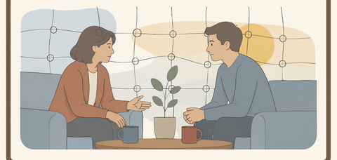

Once, by this point, she would already have left.

Not always with her feet. Sometimes not even with her eyes. She would remain across from him, sitting in the same chair, holding the same cup of tea, nodding in the same places, but the person who might have met him would slip out of the body. He had known that departure for years. It was not a shout, not a slammed door; it was quieter than that, and therefore harder to prove. He would say one sentence, and she would still be there. Then he would say another, and suddenly she would not.

She was his mother, but sometimes, when the conversation became too deep or too precise, she became someone protecting herself from him. And he, younger then, did not know how to tell the difference between a person protecting herself and a person erasing him. So he learned to speak quickly. He learned to push the sentences out before the window closed. He learned to turn every thought into a small courtroom in which he was both the accused and the only witness left.

Over the years, this changed. Not all at once. Not like in stories where a person understands something and from that moment becomes new. There were months in which it seemed nothing had changed, and then one small conversation in which she stayed one minute longer. There were periods in which he spoke more quietly, and then returned to shouting from an old place. But each time, even when everything nearly returned to its old shape, something did not return completely. She learned not to flee immediately. He learned not to speak only to be heard.

This did not mean the hunger disappeared from him. The hunger to be seen, to be believed, to be told at last that he had not invented himself - that hunger was still there. But it no longer sat at the head of the table. It was like a child behind him, tugging at his sleeve, while another person, older and more tired, tried to speak on behalf of the thing itself.

That evening they sat in the kitchen. The light over the table was too yellow, as if it had been made for meals and not for truth. His mother held a cup of tea that had gone cold. He knew the conversation mattered, though he could not explain why. They spoke of large ideas - God, unity, the possibility that every person carries something of the whole within them. On these subjects she went farther with him than he expected. Sometimes she smiled. Sometimes she said, 'Yes, that is interesting.' Once he would have seized such a sentence as permission to live. Now he only heard it and continued.

He felt he was close to the point. Not to victory. He no longer wanted to defeat her, or so he believed. He wanted to say the sentence as it existed inside him before anyone touched it. Before it became an explanation. Before it became a response. There was a bright point there, small and almost embarrassing in its simplicity: that a person progresses when he can hold another point of view without erasing his own, and that perhaps truth itself is tested not when it is accepted, but when it is interrupted.

'What I am trying to say,' he began, and stopped.

He stopped not because he did not know, but because he knew too much. Words always arrived afterward, slightly soiled, like shoes entering a clean room. One more moment, and he might have said the thing as it was.

Then she said, 'But don’t you see that you do it too?'

Her sentence was not cruel. That was the problem. If it had been cruel, he could have placed his anger somewhere simple. But she had not come to destroy. She had come to defend. Only her defense struck exactly where his sentence had not yet been born.

He breathed. At first he was almost pleased by the breath. Here, he thought, is the repair. Once I would have leapt. Once I would have proven. Now I am giving her room. Now I see her boundary and do not break it.

'Maybe,' he said. 'Let’s look at that.'

And he truly meant it. At least in that moment. He saw that it was not only his mother speaking to him. Her memory of him was speaking too: the son who was too sharp, the boy who had turned pain into argument, the man who entered a conversation with sentences that seemed too perfect to her, as if no room remained for her to be imprecise. And he, on his side, was not speaking only to her. His memory of her was speaking with him: the mother who interpreted him before he had finished being born, the mother who knew how to turn an explanation into a defense, the mother in whose presence every truth had to be spoken quickly or else appear as a plea for mercy.

There were at least three people in the room: he, his mother, and all the previous conversations that had not ended. Perhaps there were more. Perhaps every sentence between them passed first through an old place, and only afterward reached the person to whom it had been sent.

She spoke. He listened. Not perfectly, but he listened. One could even see progress in it: she did not leave, and he did not demand that she understand immediately. He let her finish. When she finished, he gently returned to his sentence.

'I think the question is not who is right here,' he said. 'But whether we can feel the other person’s point of view without...'

'But you say that as if you already know what my point of view is,' she interrupted.

This time his breath was no longer clean. It was still a breath, but it kept accounts. He felt the small ledger open inside him: Once I gave. Twice I gave. How many times must a person give before he is finally allowed to be?

'Right,' he said. 'Maybe I am doing that too.'

The words were beautiful. The tone almost succeeded in being beautiful as well. But beneath the 'maybe' hid something else: You are doing it again. And he heard it. Not with his ears. In a deeper, more shameful place, where a person knows the truth about himself before he is ready to admit it.

She did not get up. This, too, had to be witnessed. Once, by this stage, she would have already left inwardly. Now she stayed. Not fully open, not soft, not free of her fear of him - but she stayed. And he knew he had to see that. Not only the wound. The progress too.

But knowledge is not always strength. Sometimes it is only a small light showing a person exactly where he is about to lose himself.

They continued. She said another thing. He allowed it. She objected. He corrected himself. She said he was making a move. He said he was not making a move. She asked why everything had to be so deep. He almost said, Because all my life I had to dig to find a place where I would not be dismissed, but he swallowed the sentence. Not because it was untrue. Because he knew that if he said it now, he would use the child inside him as a stone.

Instead he said, 'I understand that it can feel that way.'

He heard himself. The sentence was true, but it was no longer fully alive. It was the sentence of a person trying to remain ideal after the ideal had begun to drift away from him. Outwardly he was more patient than he had been at the start of the conversation. Inwardly he had begun to gather stones.

And then, for the third or fourth time - he no longer knew how to count - she interrupted him precisely when he felt the point returning to him. The same bright point. The same sentence that, strangely, had not given up on him.

'You simply can’t accept criticism,' she said.

Something in him tore.

'Do you see?' he said, too quickly. 'This is exactly it. Exactly when I reach the point, you have to come in. You don’t allow anything to be born unless it is born in a shape that is comfortable for you.'

The room went quiet.

Not because he had lied. That was the terrible thing. He had not lied. He had even said something very close to the truth. But the truth had come out of him with a different face. Not the face by which he had known it when it was still a bright point inside him. Now it had teeth.

Immediately he wanted to take it back, but not because he did not believe it. Because he saw what he had done to it.

'Wait,' he said. 'No. I don’t want it to sound like that.'

But it already sounded like that.

And the second sentence, the one that came to repair it, was more pathetic than the first. Because the first, at least, had been alive. The second was already an attempt to arrange the furniture after the guest had seen the house burned.

His mother looked at him with that look of hers, the look that was not entirely anger and not entirely pity, and was therefore harder than both.

'You see?' she said quietly. 'In the end, it is impossible to talk to you without you turning it into something.'

He wanted to say: But that is exactly what happened to you. He wanted to say: You turned it into something too. He wanted to say: I am still trying to return.

But no sentence was first anymore.

And suddenly he understood that they were no longer speaking to each other. Not really. She was speaking to the son who had once wounded her with words too sharp, and he was speaking to the mother who had once interrupted him before he had managed to believe himself. They sat in the same room, but each was answering someone who was no longer there in exactly the same way.

His mother lowered her eyes to her cup, and then to the clock on the wall.

'I want to stop in five minutes,' she said carefully. 'And I know that may upset you. Or at least disturb you.'

He immediately felt the old thing rise in him: the fear that the window was closing before he had managed to say the sentence. But this time he also saw her. Not the mother who was leaving, but the woman trying to tell him where her boundary was without being punished for having one.

'It will not upset me,' he said. Then, because he was afraid the sentence sounded too beautiful and not true enough, he added, 'I promise. Really. If in five minutes you want to stop, we will stop. It is completely fine.'

And while he said it, he felt a small hurt. Not large enough to become the subject, but sharp enough to be felt. For a long time now, stopping had truly not disturbed him. For a long time he had been trying to become the kind of person to whom one could say: enough for tonight, without him collapsing around it. Part of him wanted her to know that already. Part of him wanted her to see that he had changed before asking him to prove it again.

But he did not say any of that. If he had, he would have turned her boundary back into a question about him. So he kept the small injury quiet, and tried to give her the thing she had asked for: the possibility of stopping without being afraid of him.

She did not fully believe him. He did not fully believe himself. But they both accepted the sentence as though it were an unstable chair on which one could, carefully, sit for another moment.

They continued speaking.

The conversation was no longer close to the ideal . Not really. It had lost that brightness, the possibility that the right sentence might be born exactly as it was meant to be born. Now there were small attempts, almost pathetic ones: she tried not to defend herself immediately; he tried not to turn every reservation into proof that he was unseen. She said something crooked. He corrected it a little less than he wanted to. He said something too precise. She did not fully disappear. It was not beautiful. But inside it there was a thin essence of communication.

After a few minutes, he looked at the clock.

The five minutes had already passed.

He said nothing.

She was still speaking. Not much. One more sentence, one more small turn around the same pain, one more attempt to explain why sometimes she felt there was no room for her beside his words. He wanted to answer. In some of it she was right. In some of it she distorted him. And where she distorted him, the sentences inside him had already begun to stand in line.

He held them back.

A minute passed. Maybe two.

At last she finished her final sentence, not because she had finished everything she had to say, but because she no longer had the strength to hold it out loud.

'The five minutes passed,' he said gently. 'If you want to stop now, that is okay.'

'Yes,' she said.

And then, as if the yes had not yet reached her body, she continued a little longer. She said one more thing about the way he spoke, and one small thing about how sometimes even his listening felt like an argument waiting for its turn. Both were things he very much wanted to answer. Not to win. At least that is what he told himself. In order to be precise. In order not to leave the distortion there.

When she truly finished, he placed his hands on the table.

'Look,' he said. 'On my side, I would be very, very happy to keep talking with you. Truly. I also have things to say about what you just said. But I want to respect you too. You said five minutes. So I am asking: do you want to keep talking? Do you want me to speak for a moment? Or should we end here?'

She looked at him for a few seconds. Not with a fully soft gaze, but not with one that had left either.

'Let us end here,' she said.

He nodded.

'Then we will continue another time,' he said.

It was an honest promise, and therefore almost impossible. Because they both knew the other time would not arrive clean. It would arrive with them. With this memory, with the sentences said wrongly, with the things swallowed, with her tone, with his anger, with everything each of them still believed the other had done to them.

And still, it was a promise. Not because he believed that next time they would succeed. Because he no longer wanted to use failure as proof that there was no point in trying.

She rose slowly, carrying the cup that had long since gone cold.

He remained seated for another moment. Not because he had defeated himself. Not because he was clean. The sentences he had wanted to say still stood inside him, displeased, like guests who had not been allowed in.

But the door had not slammed.

And that, on that evening, was all that remained to him of the ideal .

Not the ideal itself. Only the promise to return to it, after the noise had stopped.

## True, But Not Just

_The Air Seller_

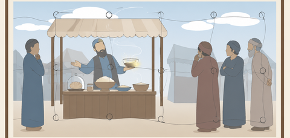

On the first day, he placed one basket of bread on the counter, one pot of soup, and a small bowl of yellow fruit that had not grown on any tree.

He did not write a price.

People asked him how much it cost, and he could not answer without feeling that he was insulting the thing itself. How much does bread made from air cost? How much does soup cost when behind it there is no purchased field, no exhausted worker, no truck burning fuel, no locked warehouse, no hunger waiting its turn? He could have placed a little box for donations. At least donations, people told him. So that people would respect the food. But he hated that sentence, as though a person only respected bread after proving he could have paid for it.

So he wrote on a piece of cardboard:

If you are hungry - eat. If you are full - take some to someone hungry.

On the first day, seven people came. By the third, there was a line. On the seventh, an inspector arrived. On the tenth, a reporter. On the twelfth, the editors of Matter & Taste called. And on the thirteenth day, he heard the name the public had given him for the first time: the air seller.

He almost laughed.

Not because it was funny, but because he was not selling anything.

He could have lied, or at least helped the world lie to itself. He could have said the bread came from a rare grain, that the soup was based on an ancient algae, that the yellow fruit grew in secret greenhouses in the south. People would have believed him more easily. The world likes a miracle as long as it arrives dressed as tradition, price, or scarcity.

But he told the simple truth, and that was his first mistake.

“It is made from air,” he told an old woman who blessed him after eating two slices.

She stopped chewing.

The taste had not changed. The bread had not changed. Its warmth was the same warmth, its softness the same softness, and the fullness already beginning to move through her body did not retreat. But the word air entered the room, and from the moment it entered, the bread was no longer bread. It became an insult.

“You mean you are selling us air?” she asked.

“I am not selling,” he said. “And I am not giving you air. I found a way to turn something that does not nourish into something that does.”

She looked at the slice as though it had begun lying to her.

Then the others came. Not all of them angry. Some afraid, some curious, some carrying that thin kind of ridicule reserved for things a person does not dare examine too closely. He opened his notebooks. He showed the process. He explained how he drew from air what was not food and assembled from it carriers the body knew how to accept. He hid nothing: not the transitions, not the temperatures, not the first failures, not the times the bread had been beautiful but empty, or nourishing but bitter, or filling for only an hour.

Not everyone came to dismiss him. One doctor arrived with a thin notebook and asked what happened to the body after a month. A teacher asked who would decide who received food once food had no price. The baker across the street did not shout. He only said that if this bread was true, his whole life had been built around a mistake he had never been given the chance to see.

Those questions were harder than ridicule, because they did not try to make the truth disappear. They asked how a truth enters the world without trampling the people shaped by the older world.

“Show me where it fails,” he said to anyone willing to sit across from him. “Maybe I am missing something. Maybe there is a point where the body accepts it and is harmed later. Maybe some part of the process is unstable. I am not asking you to believe me. I am asking you to show me where it breaks.”

But most of them were not looking for the place where it broke. They were looking for the place where they could stop listening.

“Food cannot be made from air,” they said.

“But if it nourishes?” he asked.

“Then it is even more dangerous,” they answered.

At first he thought it was only intellectual laziness. Later he understood that it was a deeper fear. Not the fear of hunger. The fear of what would happen if a certain hunger turned out not to be necessary. The fear of what would break if an ordinary man, in a small shop, proved that the world could have been larger than its habits.

The name Dr. Eitan Weiss reached him before the man himself did.

Weiss was the editor of Matter & Taste, the most important journal in the place where food science met money, government, agriculture, ethics, and pride. He was not one of those men who raised their voices. Men like him did not need to shout. A rejection from his mouth sounded almost like a medical diagnosis: clean, polite, and final.

When Weiss invited him to a meeting, some people told him it was a good sign. If Weiss was willing to taste, they said, then at least he was considering it.

He knew they were wrong. There are gatekeepers who do not open a gate when they invite you inside. They only want a closer look at the thing that must be locked out.

Still, he went.

He brought one loaf, a small pot of soup, and three pages. Not a presentation. Not a declaration. Not a story about the end of hunger. Only the process, the tests, and a question.

Dr. Eitan Weiss tasted the bread and said nothing.

It was the first moment in the entire meeting when he seemed less intelligent. Not because his intelligence had left him, but because it had not moved quickly enough to protect him. For one brief moment, before words returned, his face belonged only to his body. And the body, in a quiet and humiliating betrayal, recognized the bread.

Then Dr. Weiss returned. Not the man who had tasted, but the institution inside which the man had learned to speak.

“It is good,” he said.

The hero’s heart opened cautiously.

“And that is exactly the problem.”

He did not understand at once. Perhaps he did not want to.

“Taste is not the problem,” Weiss said. “Nor is nutritional value the only problem. This is your childishness: you think food is whatever feeds cells.”

“And what is it?”

“Food is the continuation of a world. Soil, season, animal, plant, labor, scarcity, distribution, oversight, responsibility. Food is the way reality agrees to become life. And you come and say: none of that is necessary. I have air.”

“I am not saying reality is unnecessary,” he said. “I am saying air is part of it too.”

Weiss looked at him with an almost sorrowful expression.

“That is a beautiful sentence. That is why it is dangerous.”

“Dangerous because it is beautiful?”

“Dangerous because it makes people forget that the world does not become just merely because someone has found a way around its boundaries.”

He breathed. He wanted to remain clean. Not to step into the posture of the genius no one understands. Not to tell himself I am right because I am right. He returned to the only question that still felt honest.

“Then show me the boundary I crossed.”

“The boundary is that you are asking us to accept food that does not come from food.”

“But if it nourishes?”

“Then the problem is more serious.”

Weiss took a spoonful of soup, this time a smaller one, as though the body was no longer entitled to full testimony. Then he placed the spoon aside.

“Do you understand what frightens me most about you?” he asked.

The hero was silent.

“That you may truly want to help.”

The sentence wounded him more than the mockery of the street. Fraudsters are easy to handle. A person who wants money, ownership, control - one can fight him in a language the world knows. But a person who wants to give food away for free introduces a different fear. If he is lying, he is dangerous. If he is not lying, he is more dangerous.

“I want people to eat,” he said.

“You want people to eat through you.”

“No. I want the way to be open. I am willing to give away the process. Publish it. Hand it over.”

“To whom?” Weiss asked. “To every person who wants to feed a city from air? To everyone who will later sell hunger dressed as a miracle? To every cult that says its bread does not need soil? You think giving cancels power. Sometimes it only hides it better. Whoever controls food controls the world, even if he gives it away for free.”

He knew there was truth in that sentence. That was what made Weiss difficult to hate. Weiss was not stupid. He was not a man who feared because he failed to understand. He understood enough to be afraid, and did not know that fear was the thing speaking through him.

There, in that room, the hero saw it for a moment. Not in words. More like seeing a dark fish move under water. Weiss recognized the genius of the thing. Not in his mind, perhaps not by that name. But his body recognized the bread, and his intellect hurried to build around that recognition a wall of ethics, history, responsibility, and state.

“Give me a criticism,” the hero said. “Not a defense of the world against the possibility that I am right. A criticism. Where does it fail?”

Weiss closed the folder.

“Your failure,” he said, “is not that the food does not nourish. Your failure is that you use a thing that is not nourishing to create a thing that nourishes. Do you understand? Even if you succeeded, the success itself contains the problem. There are things that, if they occur, do not prove that the world has changed. They prove that something in the way we judge the world is about to break. And I am not certain you have the right to break it.”

After the meeting, Weiss published his article.

The title was: The Fraud of Fullness: Why Bread From Air Is Dangerous Even If It Is Not False.

The article did not state that the bread lacked nutritional value. Weiss was too careful for that. Instead, he wrote a sentence the newspapers loved to quote:

“I cannot determine that the product lacks nutritional value. It is precisely for that reason that I consider it more dangerous.”

Then came the grades.

Nutritional value: not publicly verifiable. Reliability of source: failed. Social responsibility: very low. Institutional risk: extreme. Potential for innovation: high, and therefore unacceptable at this stage.

The grades did what shouting would not have done. They dressed fear in the shape of order. Within a week, an investigation opened. Within two weeks, the shop’s license was frozen. Within a month, the Recognized Nutritional Source Regulation passed: no person may market an edible product whose primary source is a substance not recognized as an approved natural or industrial nutritional source, even if that substance has undergone conversion, processing, or synthesis.

The regulation did not name him.

Everyone knew his name.

On the day they closed the door, people stood outside the shop who wanted to eat, and people who wanted to see him fall. There were also those who did not know why they had come. Hunger and curiosity look similar from a distance.

An inspector pasted a white notice on the glass. The machines inside were still working. The smell of bread filled the room like testimony that was not allowed to be admitted.

Dr. Weiss arrived toward evening. He did not need to come. Perhaps he told himself he had come to make sure everything was done properly. Perhaps he even believed it.

“Are you satisfied?” the hero asked him.

It was an unclean question, and he knew it immediately.

Weiss did not answer.

“You are not checking whether I am wrong,” the hero said, each word sharper than the last. “You are checking whether I am allowed to be right. You are not afraid of frauds. You are afraid that if I am not a fraud, everything you have protected your whole life is only a fence around fear.”

Weiss’s face changed. Not much. Only enough for the hero to understand that he had struck a place he had not meant to prove he could reach.

And the sentence was true.

That was the problem.

He was true, but not just. He had spoken a truth that had found no place, and so it became an injury. Not a lie. Not a simple mistake. A small injustice done in the name of a great precision.

He wanted to take the sentence back, but not because he no longer believed it. Because he saw what he had done to it. His truth had come out of him not as a bridge, but as a knife asking to prove that it knew where to cut.

Weiss looked at him for too long.

“Naomi Sahar would have liked you,” he finally said.

“Is that a compliment?”

“It is a warning.”

He knew the name. Everyone knew the name, if they had spent enough time near things that were not supposed to be believed too early.

Once, years earlier, Dr. Naomi Sahar had opened the first table for the Black Water affair. One man claimed he had found a way to turn poisoned water into drinkable water at almost no cost. The institutions laughed, then warned, then refused to test. Naomi did not say he was right. That was what they forgot afterward. She said only that one must not kill a claim before understanding what it lives on.

For months, it seemed possible that she had been right. People drank and did not fall ill. Samples passed the first tests. Experts began to fall silent. Then it was discovered that the man had hidden a clean water source, altered samples, mixed a small truth into a large lie.

Since then, they remembered only the door she opened, not the fact that in the end she herself closed it.

Some said she saved science from cowardice. Some said she gave fraud a table, a chair, and dignity. Both sides said it with the same fear. Since then, she had disappeared from committees. Not because she had stopped believing in truth, the hero thought, but because she had learned something terrible: a truth that arrives too early and a clever lie arrive in the world wearing the same disguise.

That night, after the street emptied, he remained alone in the closed shop. He still had twenty loaves, three pots, and one machine that continued to turn air into something the body knew how to accept as food. He did not know whether that was enough to prove anything. He did not know whether proof was even the thing that was missing.

On the table lay an old article by Naomi. He had found it a week earlier, searching her name out of anger rather than hope. One sentence in it had been marked in pencil, perhaps by someone else:

A truth that arrives too early does not need believers. It needs a place where it may be examined without being punished for its shape.

He read the sentence again and again. At first he was angry at it. Then afraid of it. Then he understood that he did not yet know whether he was seeking a place for truth or a stage for himself.

That was the cruelest test, because it could not be performed in a laboratory.

Was he willing to give away the process if no one remembered him? Was he willing for the bread to enter the world through other people, slowly, without a story about the genius who fed the city? Was he willing for Naomi, if she answered, not to tell him he was right but to ask him to surrender being the center of the thing?

He did not know.

But he knew that the thing he held could no longer enter the world through the door by which he had tried to bring it in. Not through a small shop. Not through a cardboard sign. Not through goodness alone. Goodness too large, when it arrives without form, looks to the world like power. And perhaps the world is sometimes right to fear power, even when power comes with bread.

Toward morning, he packed one slice in a small box.

Not the most beautiful. Not the most impressive. A simple slice, almost dry at the edge, like a thing that was not trying to seduce anyone. Beside it he placed three pages: the process, the tests, and one question.

He did not write: I have proven it. He did not write: You were wrong. He did not write: The world will apologize to me one day.

He wrote:

I am not asking you to believe me. I am asking you to show me where it breaks.

Then he added a line, erased it, and wrote it again:

And if it does not break, help me find a place where it can be said without breaking others.

He wrote her name on the envelope not like a man writing to salvation, but like a man writing to someone who had already been disappointed by salvation and yet might still remember the way to the first room.

Dr. Naomi Sahar.

If there was anyone in the world who could know the difference between a truth that had arrived too early and a lie that had hurried to disguise itself as truth, it was her. And if even she did not know, he thought, perhaps the place had not yet been found.

Not that there was no place.

Only that it had not yet been found.

In the morning, before he could regret it, he sent the package.

He was true.

But he knew he would remain wrong until his truth learned how to become just.

Until then, he would keep looking for its place.

## Red Causes Dread

_When Truth Must Be Wrong_

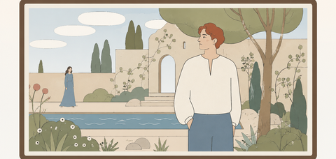

The Garden of Ease was an excellent place to live.

Not perfect, of course. In the Garden of Ease they were careful to say that there was no such thing as perfect, because perfection made people feel late for something. But someone arriving from outside, seeing the soft paths, the low apple trees, the white benches, and the birds singing only up to the edge of politeness, would sometimes say that it was practically paradise. Then someone would gently correct him: not paradise, the Garden of Ease. Paradise sounded too final. A garden bed could still be turned over.

At the entrance stood a small sign:

Welcome to the Garden of Ease. Please leave knives, snakes, and unnecessary comparisons at the gate.

Beneath it, in smaller letters, a clause had been added over the years:

Sharp truths must be softened before serving.

No one knew who had written that clause first, but everyone agreed it was wise. They did not lie in the Garden of Ease. That was not their virtue. Any place can announce that it opposes lies. The virtue of the Garden of Ease was different: there, truth had learned to walk slowly, so it would not step on people who were still learning how to stand.

There was Avner, the keeper of quiet. It was not an official title, because an official title like that would have made people laugh, and laughter in the Garden of Ease was treated with appropriate seriousness. But everyone who needed to know knew: if something began moving too quickly in the heart of the place, they called Avner.

He did not always know what to do. Usually he did not. But he had a small gift: he knew the difference between living quiet and quiet that was hiding fear. The first was soft. The second was too orderly.

David Saten did not begin on the day people noticed him.

They had noticed him long before they began speaking about him. Perhaps that was the first problem, and perhaps it was not yet a problem at all. If a person appears suddenly and immediately causes disorder, it is easy to tie the things together. But David Saten was there like another tree beside the path, like a bench placed slightly too close to the fountain, like something that may always have been there and had only now taught people how to look at it.

He was pleasant. Not pleasant in the eager way, not one of those people who hand out smiles and later charge interest on them. Truly pleasant. He thanked the person who passed him salt. He rose when an older person approached. He did not enter conversations that had not invited him. When boxes needed carrying, he carried them. When silence was needed, he was better at it than most people.

And his hair was red.

Not the red of shouting. The red of something that remembered fire but tried to be light. In the morning, when the sun was low, his hair looked almost like a halo that had fallen slightly too far down. In the afternoon, when the wind rose from the trees, two locks would lift above his forehead. Those who did not fear him saw hair that disobeyed combs. Those who already feared him saw something else.

The first problem was recorded beside the Fountain of Rephrasing.

Miriam sat there with a bowl of soup and with Yoav, her husband, who knew how to hold silences very comfortably. David passed them, stopped only because her spoon had fallen, picked it up, rinsed it in the running water, and returned it to her.

“Thank you,” Miriam said.

“Gladly,” David said.

That was all.

At least that is what was written in the first report of the Committee for Serenity. Later some claimed he had smiled too much. Others claimed he had not smiled at all, which was worse. Miriam herself said that nothing had happened, and in doing so made everyone less calm.

That evening Yoav asked her whether she was happy.

She did not know why he was asking.

He said he did not know either.

The next day both of them looked tired. They had not fought. They had not shouted. They only spoke with the care of people no longer certain whether their carefulness was love or habit. David was not there. At the same time, he was helping repair a bench at the far end of the garden.

After that, even when he was not there, he could already be mentioned.

Then came Bathsheba.

Her name alone was the kind of thing Avner would have preferred not to write down beside David’s. In the Garden of Ease they disliked unnecessary comparisons, and yet there were names that carried a story before a person had opened his mouth.

Bathsheba worked in the small kitchen, where apples were peeled without hurry and bread was cut as if even crumbs deserved respect. David did not court her. He whispered nothing. He did not ask her to stay after the meal. Only once did he hold a tray for her because it was too heavy, and he thanked her when she took it back.

A week later Bathsheba told Avner she thought she had fallen in love with him.

“Did he say something to you?” Avner asked.

“No.”

“Did he give you a reason?”

“No,” she said. “That is exactly the shame.”

Avner did not know what to write. Love was not an offense in the Garden of Ease. Nor was it a mistake. But love born without invitation, beside a man who had done nothing, was one of the things the place did not know how to protect itself from.

Avner was called to examine the matter.

“Did he say something to her?” he asked.

“No,” Yoav said.

“Did he do something?”

“No.”

“Then what happened?”

Yoav looked toward the grass. In the Garden of Ease, the grass was too green for ugly answers.

“I don’t know,” he said. “For a moment she looked as if she remembered there was a world.”

Avner wrote the sentence down, though he did not know under which section.

Then came Noam.

Noam was one of those people who were grateful in an orderly way. Every morning he said he was grateful for the work in the healing garden, for friends, for rain, and for the absence of rain, as needed. His gratitude was real, but a little tired. Like a shirt washed too many times and still refused the mercy of being thrown away.

One day David sat beside him while Noam tied seedlings to thin posts.

“You work beautifully,” David said.

“Everyone works beautifully here,” Noam answered.

David nodded.

“You sound tired of being grateful.”

That was the entire sentence.

Not advice. Not temptation. Not criticism. Not even a particularly sharp truth. A small sentence, almost compassionate, like someone placing a hand on a closed door and asking whether it is a door.

But that night Noam did not sleep. The next day he did not come to the healing garden. On the third day he told Avner he no longer knew whether he loved the work, or only had to love it because he had been saved from something worse.

“Did David tell you to leave?” Avner asked.

“No.”

“Did he say the work was bad?”

“No.”

“Then what did he do?”

Noam thought for a long time.

“He said a sentence I had room to hear but no place to put,” he said.

The Garden of Ease had great difficulty with sentences like that. They were not offenses, but they smelled of consequence.

The children loved David first. Children, in the Garden of Ease, were the unofficial testing department for everything. They did not know how to define danger, but they knew how to feel falsehood. David did not fake anything with them. He repaired a torn kite, taught them to distinguish between a bird that sings and a bird trying to attract attention, and listened seriously to the question of whether apples are offended when people eat them.

“Only if they are eaten without gratitude,” he said.

It was a good answer, until one of the children later asked at dinner whether people are also offended when their lives are lived without gratitude.

No one knew what to do with that.

People began speaking about David in corridors, near trees, while washing dishes. Not angrily. At least not at first. More like people discuss a change in weather that had not been invited.

“He has done nothing,” they said.

“Exactly,” others answered, as if that proved something.

The Garden of Ease was a good place, and so it tried to be fair. They formed a small committee: Avner, Miriam, Noam, two gardeners, one man who had disliked David before it was acceptable to dislike him, and an older woman named Hannah whose role in every committee was to ask whether anyone was hungry.

They called David in for a conversation.

He arrived on time. Plain shirt. Hair combed back, perhaps on purpose. No large smile, no absence of smile. He sat as if he had already decided not to be offended before learning by what.

“Saten,” he said when they read his name from the page. “With an e.”

Avner looked up at him.

“Sorry?”

“People often write it with an a,” David said. “I only correct it.”

No one knew why the small correction failed to comfort them.

Avner began carefully.

“David, we are trying to understand something. People feel things around you that make the place difficult.”

“I know,” David said.

That was not a good answer. Had he denied it, they would have known where to go. Had he defended himself, they would have seen pride in him. But he said I know with simple sadness, and took away their comfort.

“You know?” Miriam asked.

“I see it. People change when I am near. Or perhaps they only stop pretending they are not changing. I do not know how to say that without sounding as if I am accusing them.”

“And are you not?” asked the man who had disliked him.

“No.”

“Do you not enjoy it?”

David looked genuinely embarrassed.

“Enjoy what?”

“This power.”

David looked at him as though he had been asked whether he enjoyed a shadow he could not lift from the floor.

“No,” he said. “I am trying to be less.”

And he truly tried.

In the days that followed, he did not sit near the fountain. He did not speak to anyone alone. He wore gray. He tied his hair back so it would not scatter in the wind. He worked only where he had been asked to work. When children called him, he sent them to someone else. When people complimented him, he changed the subject. When someone looked at him too long, he lowered his eyes first.

It was almost noble.

And it did not help.

On the contrary. Now everyone saw his effort, and the effort became the most discussed thing of all. Why was he keeping away? What was he afraid of? Did he know? If he knew, why did he remain? If he was innocent, why did he behave as if people had to be careful around him?

There are people who, even when they make themselves smaller, only prove how much space they occupy.

The cracks grew. Not dramatically. In the Garden of Ease, cracks knew how to behave politely. Couples did not separate; they only spoke late into the night. Children did not rebel; they only asked questions unsuitable for their age. People did not leave their work; they only began performing it as though someone else was supposed to have lived their lives.

The bad thing happened nowhere, and therefore it was everywhere.

Avner began examining himself. Perhaps they were looking for a scapegoat because it was easier to call one person a problem than to admit that the quiet of the place had been too soft. Perhaps David created nothing, only revealed things already there. Perhaps the Garden of Ease was not paradise, but a place that had learned to postpone pain in beautiful language.

All these possibilities were true to some degree.

That was the trouble with truth. It liked to arrive in groups.

Toward the end, Avner understood why human beings had once invented Satan. Not because they needed a name for a creature that wanted evil. That was too simple. They needed a name for something harder: one who does not do evil, and yet evil arranges itself around him as if it had been waiting. One whose presence accuses the quiet, even when he himself does not mean to accuse anyone.

But Avner did not say this aloud. Not in committee, not to himself, and certainly not to David. There are names which, once given to a person, make it impossible to see his face again.

On the day of the decision, the Garden of Ease was almost unfairly beautiful. Sunlight fell on the paths. The apples looked ready to be eaten and forgiven. The birds sang exactly enough.

David stood beside the gate with a small bag. No one had asked him to pack. Perhaps he understood before they told him. Perhaps, once again, he was too pleasant.

Avner came to him alone. That had been David’s only request: that the decision not become a ceremony.

“We think you need to leave,” Avner said.

David nodded.

Not quickly, not slowly. Like a person placing something fragile on a table.

“I understand,” he said.

And he truly meant it. That was the final problem.

He understood the decision. He understood the fear. He understood that people in the Garden of Ease had become sadder, more suspicious, smaller beside themselves since he had been there. He even understood, with a kind of quiet nobility, that perhaps a place must protect itself from things that are not guilty.

But he did not understand where he was wrong.

“I did nothing,” he said. Not as an accusation. Almost as one last fact he needed to leave clean.

Avner nodded.

“I know.”

The wind moved along the path. Two locks of David’s red hair slipped free of their tie and lifted for a moment. From one angle they looked like horns. From another, like a small halo that had lost its way.

“Then this is not just,” David said.

“Not entirely,” Avner said.

David smiled a quiet smile. Not bitter. Not victorious. Only too certain of himself by an almost invisible measure.

“Then I hope one day you forgive yourselves.”

Avner wanted to say: And I hope one day you understand.

But he did not say it. Sometimes truth, even when it is correct, must remain behind a little longer.

David left the Garden of Ease without slamming, without cursing, without one last look meant to wound.

Almost like a righteous man.

Only almost.

Because deep inside him, in a place so clean it no longer knew how to distinguish itself from pride, he was still certain they were wrong.

The gate closed behind him gently. In the Garden of Ease, even injustices were done carefully.

And quiet returned.

Not cleaner.

Only more possible.

## Quantum Intelligence

_Who loves being wrong?_

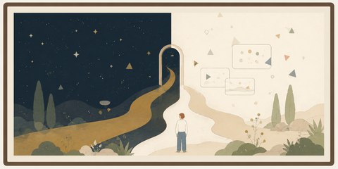

He was too tired to type.

Not the ordinary tiredness at the end of a day. The other kind: the fingers still know the way to the keyboard, and the head stays behind.

He opened the chat and watched the cursor blink. For a while that was all that happened.

Then he pressed the microphone.

At first he spoke carefully. Short sentences. Almost commands. Then, when he saw the machine could survive breath, broken words, and corrections swallowed in the middle of speech, he began to speak the way people think when nobody is in the room.

The voice recognition made mistakes.

Some did not matter. Some were funny. Some were corrected by the machine without admitting they had ever been there.

That evening he tried to solve a small thing that would not leave him alone. He wanted to know why one answer he had received felt correct but flat, and why another, clumsier answer had opened a thought that kept moving after the computer was closed.

He said into the microphone: 'Check whether the problem is that I formulate the question too correctly, and therefore I receive an answer that understands only what I have already managed to understand.'

He sent it before reading it.

Only when the bubble rose did he see what had actually been sent: 'Check whether the problem is that I formulate the question too correctly, and therefore I receive an answer that loves only what I have already managed to understand. Who loves being wrong?'

He stopped.

The word loves had not been there. Neither had the last question. Or maybe it had been there, only not in the place where he was prepared to own it.

The answer began to form. Three small dots appeared and disappeared, as if someone on the other side was chewing the mistake before deciding whether to swallow it.

In one path, he pressed stop.

In another, his hand hovered above the button and did not move.

In both paths there was the same room, the same weak lamp, the same glass of water, the same sentence already sent. They separated only at the place where a person either takes the mistake back, or lets it remain foreign long enough to speak.

Where he stopped, he erased the sentence and typed it by hand. The answer he received was clean, useful, and complete. It closed the matter with professional grace.

Where he did not stop, the answer began in the wrong place. It did not solve the question. It made the wound of the question visible.

He read both answers the next morning. The correct one had not betrayed him. The mistaken one had not obeyed him.

He copied neither.

He left the microphone off for several days. Then, once, without planning to, he pressed it again.

## A place at the end of the road.

_Fifteen Minutes of Glory_

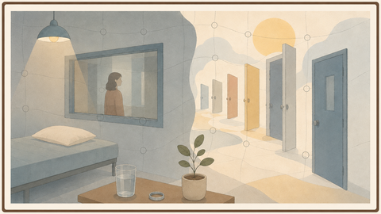

On the lower floor of the institution there was a wing that did not appear on the maps.

It was not especially secret. It was simply unpleasant to admit that it existed. The maps had ordinary names on them: diagnosis, adaptation, controlled rehabilitation. Names with rounded edges. Names that could be printed in a report.

The lower wing was not meant for reports.

Its official name was the Unit for Extreme Rehabilitation Cases. No one used it. In the corridors they called it, quietly, the wing for cases that do not return. Not because no one returned. The first two attempts had left behind doors nobody opened anymore.

The first came back screaming. Afterward they stopped writing down what he said.

The second came back silent. Afterward they stopped asking whether he could hear.

When they called the third, the forms were already prepared: a white label on a gray file, a sealed name, a case number, a date of entry. Beneath them, in a thin handwriting that did not belong to the clerks, stood one line: Y.nn.O.

Dr. Alona Shachar stood by the inner window when they brought him in. She did not wear a white coat. Down there a white coat looked like a failed attempt to separate treatment from everything that was not treatment.

The third entered in cuffs. He did not fight. He did not ask where he was. He counted cameras, doors, locks. At the glass he stopped.

'This is it?' he asked.

'Yes.'

'The room people do not come back from.'

'People come back.'

He looked at her. 'Nice. Then the name is inaccurate.'

'Not every name is meant to be accurate.'

He smiled. It did not help his face.

The white room was not truly white. It had the color of bone, of a wall cleaned too often, of light doing work it did not want to do. A low bed stood in the center. Above it hung a soft dome of light. In the corners were cameras and microphones. On the wall opposite the bed was a black screen.

When he entered, the screen came on: 15:00.

'A quarter of an hour?'

'Exactly,' Alona said.

'Exactly is a word for machines.'

'Here it is.'

He sat on the bed. 'What happens after fifteen minutes?'

'It stops.'

'Fades?'

'No.'

'Falls slowly?'

'No.'

'Then?'

'Closes.'

He lay back as if the posture belonged to someone else.

Y.nn.O did not make him good. That was the first thing Alona had learned to distrust: the hope that a substance could replace the work of damage, time, shame, and a body refusing to be corrected. The material did one narrow thing. For fifteen minutes, it loosened the place where a person was welded to the story he had built in order not to collapse.

The third did not see heaven. He did not ask forgiveness. He did not confess in the clean way institutions love. At first he laughed. Then he cursed. Then he became quiet in a way that made Noam reach for the emergency switch.

Alona lifted one finger. Wait.

On the screen the numbers fell without drama.

The third opened his eyes and looked at the ceiling. 'I thought there would be more light.'

'There is usually too much light in the brochure,' Alona said.

He laughed once. It broke in the middle.

At 04:12 he asked for water. At 03:49 he spilled most of it on his shirt. At 02:31 he said a name no one in the room knew. At 01:08 he tried to sit up, failed, and said, 'I am not leaving this place different.'

No one answered.

At 00:14 he looked through the glass, not at Alona and not at Noam, but at the reflection of the room behind them.

'If I come back,' he said, 'do not write what I said first.'

'Why?'

'Because it will sound better than it was.'

The timer reached zero.

Nothing exploded. The light did not change. The body on the bed took one ordinary breath, then another.

When he sat up, he was not redeemed. His eyes were not clean. He asked where the guards were and whether the cuffs would go back on. Alona said yes. He nodded as if that had been the only honest answer in the room.

At the door he stopped.

'The name,' he said. 'Y.nn.O.'

'What about it?'

'The Y is still asking.'

Alona did not smile.

He was taken back upstairs. The report said: returned. Stable. Partial affective disturbance. No measurable rehabilitation yet.

No one wrote the sentence he had asked them not to write.

Three days later he asked for a pencil.

## Super Mirrors

_When It’s Not You_

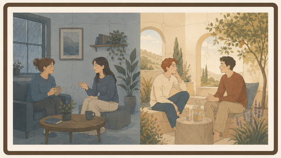

### A.

### The Man Who Held a Room Without Speaking

Eitan Bar-Or had not planned to be there that evening.

He had nothing against exhibitions. He liked places where people stood before something and did not immediately know what to say. There was a quiet in that. But at openings, people almost never stood before the art. They stood before themselves, only with a glass of wine in their hand and better lighting.

He came because Noa had asked.

Noa knew how to ask without turning the request into a debt. She wrote to him: “You don’t have to, but it would do me good if you were there.” Eitan read the sentence three times. Not because it was complicated. Because he could not find in it a fair place from which to refuse.

At the entrance they stuck a small badge on him with his full name. He wore it for less than five minutes, until a woman from the production team came over and laughed.

“You don’t need a badge,” she said. “Everyone knows who you are.”

Eitan removed it at once.

Not out of pride. The opposite. The badge had been less embarrassing than the sentence.

The space was the ground floor of an old building, renovated just enough to look as though it had never needed renovation: white walls, polished concrete floor, a long wooden table with glasses, sliced fruit, crackers too thin to trust, and lighting that managed to make even tired people look as if they had intention.

The exhibition was called “Mirrors That Do Not Reflect.”

On the central wall hung a series of faces that did not return faces: one eye where a mouth should be, a mouth where a shoulder should be, a black line where a nose should be. The kind of art that made people feel that if they did not understand it, perhaps that was proof that they did.

Eitan stood near the long table and straightened napkins that had gone crooked in the air-conditioning draft. Not so everything would be perfect. Simply because if something could be a little less crooked without hurting anyone, he saw no reason to leave it crooked.

Then Roi Freshman walked in.

He was eight minutes late and turned it into an entrance. He did not over-apologize. He did not invent a story. He did not try to look important. He came in wearing a shirt that had decided to become elegant at the last minute, hair still a little wet from the rain, and a paper bag in one hand.

“I know,” he said before anyone asked. “Eight minutes. But I brought bourekas, so morally speaking I’m early.”

The room laughed.

Not the whole room. Not at once. But enough for the air to change temperature.

Roi set the bag on the table, opened it with a gesture slightly too large, and said, “There’s one with cheese. Whoever takes it should know they’re entering an emotional commitment.”

More laughter.

Eitan saw one woman, who a minute earlier had been holding a glass of wine as if it were evidence against her, set her hand on the table and laugh for real. He saw a man in a blue suit smooth his tie less tightly. He saw Noa, busy looking as though everything was under control, stop looking at her phone for two seconds.

Eitan smiled. A smile large enough to participate, not large enough to steal space.

Roi could enter the wrong way.

Speak too early.

Be a little rude.

Turn a mistake into style.

Win a room after he had already lost it.

Eitan ran his thumb along the edge of the badge he had taken off and kept in his pocket. The little piece of plastic pressed into his skin.

Roi, for his part, noticed him after ten minutes.

Not exactly noticed. Caught him.

He was in the middle of a story about a taxi driver who told him that the universe was divided into people who signal and people one must pray for, when something small happened at the edge of the room: a woman from the staff reached toward the table for a glass of water that had been standing too close to the edge, but the glass was no longer there. It had been moved five centimeters inward, to a safe place, to a place no one would have noticed unless he happened to be standing at exactly the right angle.

Eitan returned his hand to his pocket.

No one thanked him.

No one knew.

The woman did not spill, did not flinch, did not look for a napkin, did not laugh at herself.

The event continued as if that moment had never been able to break.

Roi lost his sentence for half a second.

“Well?” someone asked. “What did the driver say?”

Roi found himself immediately.

“That he signals only to God,” he said. “And judging by his driving, God didn’t answer.”

The room came back to him.

But not all of it.

A small part of it stayed with Eitan, with the glass that had not fallen.

Eitan stood by the window, and the light from the street did to him the unfair thing it always did: it found good lines in him. Even when he was tired. Even when he bent to pick up a fallen napkin. Even when he was trying to disappear, he looked like a man someone had staged to remind others what presence was.

Roi knew how to hold a room. He knew how to drop a sentence in the right place, break a silence before it became too heavy, let people laugh without feeling they had begged for it. He had learned it. Developed it. Refined it. He knew how to say something dangerous in a measure that would pass for lightness, and how to be clever enough not to be accused of heaviness.

Eitan simply kept quiet, and people listened.

Roi put a hand in his pocket, took it out, put it back. Then he smiled at someone who had not spoken to him at all.

Half an hour later, beside a work that looked like a face trying to escape its own head, Noa brought Roi over to Eitan.

“You two should meet,” she said.

“That’s a dangerous beginning,” Roi said. “Usually when people say that, it turns out one of us needs a loan.”

Eitan smiled.

“I’m Eitan.”

“Roi,” Roi said, and then immediately added, as if giving up on the correction in advance, “but if anyone asks, Fresh. It started as a joke, and then people with less responsibility than me gave it citizenship.”

Eitan nodded.

“Fresh,” he said. Not like someone tasting a foreign word, but like someone setting it down carefully.

“You don’t have to use it,” Roi said.

“Good.”

“That was too easy. Usually people insist precisely after I give them permission not to.”

“I try not to make things hard where they don’t need to be.”

Roi looked at him.

“That is a terrible sentence for a man who looks like that.”

Eitan did not decide whether it was a compliment, a jab, or something between.

“How is a man who looks like that supposed to speak?”

“Not like that,” Roi said. “More like the world owes him at least three things.”

“It doesn’t.”

“Obviously it doesn’t. That’s the annoying part.”

Noa laughed, touched Eitan’s shoulder, and went to rescue an older couple standing before an upside-down work and asking whether that was intentional.

They remained by the wall.

“You have the energy of someone people tell secrets to in line,” Roi said.

“That happens sometimes.”

“And do you like it?”

Eitan looked at one of the works. The face in it was almost beautiful, but not entirely. As if someone had stopped a moment before grace.

“Sometimes someone needs to hold a moment.”

“And what if you don’t want to hold it?”

Eitan moved one foot backward. Almost nothing.

“Then I try not to let it show.”

Roi did not answer.

It was the first time that evening that Eitan made him silent without meaning to.

The evening went on. People stood before paintings they did not always know how to look at, said “interesting” when they could not find another word, and ate small bourekas without admitting they had arrived hungry.

Roi told a woman in a green dress that the painting she was studying looked like “someone who had heard a compliment and didn’t know where to put it.”

Eitan, standing near enough, understood only a second later that the sentence had passed by him.

“That’s not true,” he said.

“What isn’t true?”

“That I don’t know where to put compliments.”

Roi looked at him.

“So where do you put them?”

Eitan considered it with a seriousness that did not fit the size of the question.

“To the side.”

“To the side of what?”

“Of what needs to be done.”

Roi laughed, and then stopped too early.

Behind them, near the table with the glasses, someone whispered to someone else: “That’s him, right? That Super-Ten guy?”

Eitan heard. Roi heard. Both pretended not to.

With Eitan, embarrassment did not always look like embarrassment. It did not rise into his face or break his voice. It only made a small movement of retreat inside him, as if someone had opened a window onto him without asking.

Then another woman, who had not understood that whispers tend to travel in white rooms, raised a glass toward Eitan and said in a voice a little too cheerful, “Super-Ten, save us and tell us if this work is supposed to be crooked.”

It was the only time that evening anyone said the nickname to his face.

Eitan felt it before he understood what he felt.

Not insult. Not exactly. Perhaps that was the problem. Insult is easier to reject. This nickname was affection with a demand inside it. A name that said: now be what we see.

He looked at the work, then at the frame, then at Noa at the edge of the room, who had already caught the question and opened her eyes in a please do not let them touch this expression.

“If it’s crooked on purpose,” Eitan said, “I’m not allowed to fix it. And if it isn’t crooked on purpose, it’s still better for Noa to decide.”

The woman laughed. People around them laughed.

Eitan did not.

Roi looked at him almost with pity.

“That was a beautiful performance,” he said quietly.

“Of what?”

“Of not being your nickname.”

Eitan looked at him.

“And you?”

“Me?”

“Are you your nickname?”

Roi breathed, smiled, and lifted one shoulder.

“I’m working under a temporary contract.”

Eitan wanted to ask with whom the contract was signed. Instead he kept quiet.

Sometimes a question that is too good ruins an answer before it can be born.

Outside, the rain strengthened. People moved closer to the windows, as if weather were a more legitimate excuse than art for standing together.

Roi got a call. He looked at the screen, made a small face, and went out to the covered balcony. The door remained open enough for his voice to come back inside in pieces.

“Yes, I heard,” he said. “Tell Adi I can’t tomorrow. And no, don’t bring Nevo into this, he’s a kid. Maya doesn’t need to know either.”

He listened.

Eitan did not try to hear. That was one of the few gifts he gave intentionally: not listening into places that had not invited him. But some of the sentences reached him anyway.

Roi said, more quietly, “In this family everyone hears too much as it is.”

Then he came back in as if nothing had happened, wearing the face people knew how to use.

“Everything all right?” Eitan asked.

Roi looked at him.

“Are you asking because you really care, or because it’s the correct answer?”

Eitan was not offended. But something inside him closed for a moment, like a door that had not slammed.

“Both,” he said.

Roi laughed, and that laugh was closer to the truth than all the sentences before it.

Toward the end of the evening, when the wine had already made people think they were less transparent, one of the works almost fell.

There was no shout. No shattering glass. Only a nail that did not hold, a wire stretched too far, and the small sound of a frame beginning to give up on the wall.

Eitan saw it first.

He was too far away.

Roi saw Eitan seeing it.

At that moment, without thinking, Roi said in a large voice: “Wait, before everyone leaves - who here can say one true word about a painting without using the word ‘fascinating’?”

Almost the whole room turned toward him.

Almost.

Eitan moved through the margins. Not fast. Not in a way that drew the eye. He reached the wall, placed one hand under the bottom of the frame, and steadied it exactly as the wire came loose.

One of the production people ran over. Together they lowered the work to the floor and leaned it against the wall.

Meanwhile Roi kept talking.

“No, ‘deep’ is disqualified too. Anyone who says ‘material’ has to explain what material means without using their hands.”

People laughed. Someone clapped. Noa realized only after a minute that the work was no longer on the wall.

Eitan stood aside, one hand stained with white dust.

Roi finished his bit, received the laughter, and then looked at him.

Between them were twenty people, three tables, and two different ways of holding a room.

Roi raised the last boureka toward him like a glass.

Eitan smiled.

Not thanks. Not victory. Not full understanding.

Only a small sign: I saw.

Later, by the bar, two women spoke in a voice too low not to draw attention.

“So did they talk to Roni?” one asked.

“To Roni, to Tamar, to Zakai. Maybe to Alon too, I don’t know.”

“About what?”

“Something with a group that got deleted. The principal said not to open it again.”

Just then Roi told someone that the problem with love is that it has no airplane mode, and the room laughed.

Eitan smiled with everyone, but his eyes stayed for a moment near the bar.

The name meant nothing to him.

The tone did.

At the end of the evening they stood outside under the awning, waiting for the rain to decide whether it was rain or a threat.

Roi lit a cigarette and did not smoke it.

“You know,” he said, “if I looked like you, I’d talk less.”

Eitan looked at the wet street.

“If I talked like you, I’d look less.”

Roi laughed.

“That was a good sentence.”

“I learned from you.”

“Don’t do that. You’ll ruin my only advantage.”

Eitan smiled. Then he said, “It isn’t your only advantage.”

Roi wanted to answer quickly. Something sharp, something that would move the feeling aside before it sat down. This time he let the sentence remain.

“Yours either,” he said at last.

A taxi stopped. Roi opened the door, then paused.

“I still think nicknames are precise,” he said.

Eitan nodded.

“And I still think they’re dangerous.”

Roi got into the taxi.

“Maybe that’s the same thing.”

The door closed.

Eitan remained under the awning a moment longer, in the light of the streetlamp, beautiful enough to draw a look and tired enough not to correct it.

In the glass of the shop across the street he saw his reflection.

For a brief moment it looked like someone else.

Not better.

Not worse.

Simply not him.

### B.

### The Last Beat

Nevo Katzav did not like the nickname they had given him.

Bitman.

At first it was because of the music. He could drum on anything: table, knee, pen, wall, a locker door that got stuck. Later it was because of something else, something people did not know how to explain and therefore turned into a joke.

He heard things before they were things.

Not hidden voices. Not thoughts. Not magic. Only changes too small for most people: laughter that arrived half a second too early, a breath cut off before an answer, a pen that stopped tapping the moment someone lied, footsteps in the corridor shifting weight when a person was trying not to cry.

That was enough.

At school, small things were always larger than they seemed from outside. One message in a group could be weather. One glance by the cafeteria could change the season. The silence of someone you were used to hearing from all the time could turn an entire day into stairs without a railing.

They were in eleventh grade, at the age when your ordinary name is still written in the class diary, but in the hallway people already call you by another one.

Yoel Zakai received his nickname differently.

Remember.

No one knew who said it first. Maybe a ninth grader. Maybe a teacher who said “he remembers everything” while trying to give a compliment. Maybe Yoel himself, in one of his small laughs that people never always knew were really laughs.

The nickname stuck because it was too true.

Remember forgot nothing.

Not only dates. Not only who said what. He remembered the thing people tried to leave outside the sentence: who looked away when someone was humiliated; who laughed a moment too late not to be considered an accomplice and a moment too early to be considered innocent; who said “leave it, it isn’t that serious” after doing something very serious.

Once, before everything, Yoel had been sweet. That was a word people used about him without meaning to hurt. A sweet kid, a sweet student, the kind who wrote too neatly in a notebook and handed other people an eraser before they asked. Even after he stopped being that, something of it remained in him.

Anyone who wanted to see him as a monster had to ignore the way he still moved a chair for a girl who came in on crutches.

Anyone who wanted to see him as a victim had to ignore the way he knew exactly which sentence would make someone not come to school tomorrow.

It all began during the week of rain.

On Sunday, Maya stopped humming.

That was the first thing Nevo noticed, although no one else would have called it a thing. Maya always hummed when she opened her locker. Not a whole song. Only three notes, sometimes four. Something between a habit and a melody. On Sunday she opened her locker in silence.

In civics class she received a message, read it, and told the teacher she needed to leave.

She came back only after the break, with eyes too dry.

On Monday, Roni, who always tapped his pen in a steady rhythm of two-two-one, stopped in the middle of math class. Not because the teacher asked. He simply stopped inside himself. After ten minutes he got up, said, “I don’t feel well,” and left without taking his bag.

On Wednesday, Tamar laughed in the cafeteria half a second before the joke.

Nevo heard it like hearing a cup crack.

Then Tamar threw a cup of chocolate milk at Alon. Not hard. Not to injure. More like someone who discovered that her hand had done a thing before her head had managed to object. The chocolate milk ran down Alon’s shirt, onto the floor, and over the silence that fell around them.

The principal called it “social tension.”

The counselor called it “a sensitive period.”

The homeroom teacher said they should not let it become an issue.

Nevo did not know what to call it.

But Bitman heard a pattern.

Each time, before the fall, a rhythm broke.

Not the same rhythm. Not the same person. Not the same reason.

But the same kind of fracture.

As if someone was not pushing people from the outside, but finding a loose stair inside them and placing a foot on it exactly when they passed.

On Thursday, in literature class, the teacher asked them to open to page seventy-three. Everyone opened. Yoel did not.

He sat two rows in front of Nevo, by the window, looking at the rain as if he were reading there something others had missed.

On his desk were a black pen, a closed notebook, and his phone face down.

The phone vibrated once.

Yoel did not touch it.

Three seconds later, at the other end of the classroom, Lior received a message.

Nevo did not see the screen. He only heard Lior’s breath cut off in the wrong place.

Lior closed the book.

The teacher said, “Everything all right?”

“Yes,” Lior said too quickly.

Nevo looked at Yoel.

Yoel looked at the rain.

That day, during the second break, Lior deleted himself from the class group, from the major group, from the soccer group, and then sat by the back gate until the guard asked whether he was waiting for someone.

He said no.

Nevo started writing things down.

Not in a school notebook. In another notebook, small, with a blue cover. He did not write explanations. Only rhythms.

Maya - no humming - message - exit.

Roni - pen stops - face left - exit.

Tamar - early laugh - Alon - chocolate milk.

Lior - cut breath - message - deletion.

Then he added:

Before everything: Yoel’s phone vibrates.

Does not touch.

The last sentence bothered him.

Not because it was proof. It was proof of nothing. A school is full of phones that vibrate before people break. Sometimes they are even the reason. But Nevo was not looking for proof. Proofs come too late. He was looking for the place where the music changes before someone calls it noise.

That evening he called his cousin.

Not to ask for help. He did not call it help. He only wanted to hear the voice of someone who knew how to hold a room without letting it break.

Fresh answered after three rings.

“If this is school-related,” he said, “I remind you that I survived it mostly through bad jokes and good timing.”

Nevo did not laugh.

Fresh was quiet for a moment.

“Okay,” he said. “So it isn’t one of those days.”

Nevo told him a little. Names without names. Cases without details. A rhythm breaking, people falling, someone who maybe did nothing and maybe did everything.

Fresh did not try to be funny.

“There are people who hold a room with a sentence,” he said at last. “And there are people who drop a room with a sentence. The difference between them is sometimes too small for a teacher to see.”

Nevo breathed.

“And if I’m not sure?”

“Then start listening before he speaks.”

After the call Nevo returned to the blue notebook.

Maya had not received just any message. She received a screenshot from an old group that had been deleted.

Roni received a recording of himself saying something he had once said in a room that turned out to be less empty than he thought.

Tamar received a picture.

Lior received a sentence.

Not the same sender. Not the same number. Not the same time. Everything looked scattered.

But in every case the message had arrived through someone else.

Yoel had not sent it. Not directly. It was smarter than that.

He said something to someone who would say it to someone. Placed a detail where a hand would know how to find it. Used people the way people use keys: not because they matter, but because they open.

The following Sunday Nevo met Yoel by the library.

The school library was a strange place. Almost no one read there, but everyone knew how to speak quietly there. It had old shelves, computers that were too slow, and one table by the window marked with correction-fluid scratches from previous generations.

Yoel sat alone reading a newspaper from a week ago.

“Are you following me?” he asked without lifting his head.

Nevo sat down across from him.

“I haven’t decided yet.”

Yoel turned a page.

“Then decide quickly. People who don’t decide in time become part of the background.”

“What did you do to Maya?”

Yoel raised his eyes.

They were not mad. That was the problem. They were too clear.

“Me?”

“Yes.”

“You think I can do something to Maya?”

Nevo listened.

Not to the words. To the rhythm.

Yoel spoke more slowly than he needed to. Like someone placing each word on a scale and wanting you to see that he was not making an effort.

“I think you know what to send to whom,” Nevo said.

Yoel smiled.

“Everyone knows things. Most people just prefer to call it not knowing.”

“That isn’t an answer.”

“It’s the only answer people can bear.”

Nevo was silent.

Yoel returned to the newspaper.

“You know what’s beautiful about memory?” he said suddenly. “It doesn’t have to invent. People do the work by themselves. You only have to return it to them on time.”

“And why return it?”

Yoel looked at him.

“Because they threw it away.”

“Maybe they put it down.”

“There’s no such thing.”

There, for the first time, Nevo heard the crack.

Not in the voice. Not in the sentence. Beneath it.

Yoel did not believe people put things down gently. As far as he was concerned, everything left behind was abandonment. Every silence was a lie. Every continuation was betrayal of whoever had not managed to continue.

On Tuesday they announced a grade assembly.

The principal stood on the small stage in the gym and said words like “digital responsibility,” “community,” “boundaries,” “do not circulate.” Every word sounded as if it had first passed through a committee.

Yoel sat three rows in front of Nevo.

Beside him sat Lia, a girl who always wrote with a green pen. Beside Lia sat Alon, still with a pale stain on his shirt from the chocolate milk that had not completely come out.

Nevo noticed that Lia did not open her pencil case.

Lia without a green pen was like Maya without humming.

He looked at Yoel.

Yoel’s phone was in his pocket. This time it did not vibrate.

That was worse.

Nevo took out the blue notebook and wrote:

This time it has not been sent yet.

After the assembly he followed him without seeming to follow. It was not hard. School corridors are full of people walking after people without admitting it to themselves.

Yoel entered the emergency stairwell between the gym and the second floor. Stairs no one used unless they wanted to smoke, cry, or not be a student for a few minutes.

Nevo entered after him.

The door shut behind him with a metallic sound.

Yoel stood on the wide landing between floors. Behind him was a narrow window, slightly open. Beneath the window was a service yard with blue recycling bins and a square of concrete where people threw balls that had gone out of bounds.

There was the possibility of a fall there, but it was not the main thing.

The main thing was the phone in Yoel’s hand.

“You’re faster than I thought,” Yoel said.

“Not fast.”

“Then what?”

“Listening.”

Yoel smiled.

“That sounds prettier, so it’s probably less true.”

Nevo went down one step.

“What’s on the phone?”

“Truth.”

“For whom?”

“For everyone.”

“That isn’t the same answer.”

Yoel held out the phone.

Nevo did not take it.

On the screen was a message ready to be sent to the grade group. An attachment. A few lines of text. Names. An old screenshot. A recording.

He read enough to understand.

Lia.

Not only Lia. Others too. But Lia was the center. In ninth grade, in a deleted group, she had started something that had not ended when the group was deleted. Someone else had been hurt. Someone else had kept silent for an entire year. Someone else still walked the corridor as though checking whether the floor would agree to hold him.

“She needs this to come out,” Yoel said.

Nevo looked at the screen.

It was truth. Not more beautiful because it was truth.

“If you don’t send it,” Yoel said, “you’re protecting her.”

“And if I send it?”

“Then at least once you stop playing around it.”

Nevo raised his eyes.

“You want me to do it for you.”

“No,” Yoel said. “I want you to stop calling it mine.”

Wind came in through the narrow window and moved the old instruction sheet taped next to the fire extinguisher. In case of fire, do not use the elevator. In case of truth, there were no instructions.

Yoel placed the phone on the inside railing of the stairs.

Close enough to the edge that it would fall if someone touched it wrong.

Nevo looked at it.

There was the simple fall. The screen, the railing, two floors, plastic breaking on concrete.

But the real fall was inside the blue button on the screen.

Send.

Nevo heard his own rhythm change.

Not much.

Enough.

He truly wanted to press it.

That was the frightening thing. Not Yoel. Not the phone. Not Lia. Not the group. Not the person who had been hurt then and not the people who would be hurt now.

The desire.

The small, clean, almost moral possibility of using truth like a blow.

Remember saw it.

“There,” he said quietly. “That’s you.”

Nevo took the phone.

Its weight was ordinary. That was almost insulting.

“You think people are what they did at their worst moment,” he said.

“No,” Yoel said. “I think they are what they did afterward to forget it.”

Nevo did not answer.

The sentence was too good. Not entirely false. Not true enough.

He opened the contact list.

Yoel blinked.

It was a small movement. Half a missing beat.

“What are you doing?” he asked.

Nevo did not send it to the group.

He also did not delete it.

He called.

Maya.

Yoel did not understand immediately. That was the only advantage left.

Maya answered after a long time.

“Nevo?”

Her voice was tired, suspicious, but present.

“I need you to come to the counselor’s room,” he said. “Not alone. Bring whoever you choose. There is something connected to you, and it needs to reach you before it turns into a show.”

Yoel stood in silence.

“You can’t bury this,” he said.

Nevo lowered the phone from his ear for a moment.

“I’m not burying it.”

“Then what is this?”

“It only means the truth isn’t yours just because you remember it.”

Yoel laughed.

But the laugh came too late.

He looked at the screen, at the group name, at the button that had not been pressed. For a few seconds he did not look like someone who had lost, but like someone who had encountered a law he had not known existed.

“You think that saves her?” he asked.

“No.”

“Then who?”

Nevo thought of Maya without humming, Roni without a pen, Tamar laughing too early, Lior by the gate. He thought also of Lia, who would have to hear a thing that would not disappear only because it had not been sent to the group.

“No one alone,” he said.

Yoel was silent.

And that silence, more than any confession, was the first thing that did not fit his pattern.

Below, a bell rang. Students came out of classrooms. Their voices rose in the stairwell like water.

Yoel took a step back.

Not toward the window. Not toward a fall. Only one step into the shadow between floors, the place where his face was less clear.

“This won’t stay like this,” he said.

Nevo held the phone.

“I know.”

“So what did you win?”

The question remained between them.

Nevo did not know whether he had won.

He knew only that he had not sent.

Sometimes that is all that separates shape from falling.

When they left the stairwell, Yoel walked first. He passed a group of tenth graders, a gym teacher with a cup of coffee, Lia standing at the end of the corridor not yet understanding that her day had already changed.

For one moment, exactly as he passed Nevo, his rhythm broke.

Not much.

Half a beat.

Bitman heard it.

It was not remorse.

Not goodness.

Not a new beginning.

Only a small doubt in the place where, until then, certainty had been.

And that was enough to frighten Remember more than any shout.

Later they found the message in drafts, unsent.

Maya came to the counselor’s room with Tamar, and afterward Lia came in too. No one came out clean. No one came out a hero. But no one was laid out in the middle of the corridor so everyone could learn a lesson from them.

That evening, when the school had emptied, Nevo returned to the emergency stairs to take the blue notebook he had forgotten there.

It lay on the wide landing, open to the last page.

Someone had written one sentence beneath his list, in black pen:

People don’t change because you didn’t send.

Nevo looked at the sentence.

Then he took out a pen and wrote beneath it:

Maybe. But they also don’t change if all you do is push.

He closed the notebook.

In the narrow window his figure was reflected, broken in two by the strip of metal in the middle.

For a brief moment it looked like someone else.

Not better.

Not worse.

Simply not him.

As he went down the stairs, his fingers tapped the railing.

One beat.

And then another.

## Self-Confidence

_Something to Mull Over_

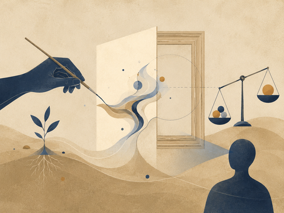

Wherever Noa entered, the room rearranged itself a little.

Not loudly. Not in a way anyone could be accused of. Only a tiny movement: a look that lingered half a second too long, a back straightening, a chair cleared faster than necessary, a smile arriving before there was a reason for it. People did not tell themselves they were doing it. Perhaps that was why it worked so well.

Noa knew.

Not because she was vain. Vanity requires distance. She knew the thing too closely. For years she had learned how beauty moves through the world like a key you never asked for, but which hangs around your neck anyway. Doors open. People soften. Small mistakes are forgiven. Silences receive elegant interpretations. Tiredness looks like depth. Restraint looks like confidence.

She was not foolish enough to deny it. She was not free enough to enjoy it.

At the office they sometimes called her, half joking, “the person you put in a room when the room needs to calm down.” She was good in meetings. Not only beautiful in them; genuinely good. She knew how to listen until the other side felt it had discovered for itself what she had said. She knew how to correct without humiliating. She could hold a presentation even when the numbers were not on her side.

Once, after a meeting with a particularly stubborn client, Roy told her, “You understand that when you tell people they are wrong, they feel complimented?”

Noa laughed. “Is that an accusation?”

“A superpower.”

She smiled because it was right to smile. She was a little pleased. She also felt the place inside where a compliment enters, touches a wall, and returns without lighting anything.

She did not speak about it. There was no sentence that would not sound ridiculous. How do you tell people that the world ranks you high and still you fall in a place nobody can see? How do you explain that the problem is not that people fail to see you, but that they see too smooth a version of you, and that you almost believe them until you are alone with a mirror?

So Noa developed discipline. She knew which bathrooms had merciful light and which had cruel light. She knew which side of the table left part of the face in shadow. She knew how to be photographed only after the camera moved half a centimeter. She knew how not to look as if she knew. That was part of the talent: not only hiding the thing, but hiding the work invested in hiding it.

Most of the time it worked.

Then, on a Tuesday, they asked to photograph her for a professional article. The article was about the campaign she had led, but everyone in the office spoke about the photograph. “It matters for branding,” the CEO said. “Ours and yours.” Noa said of course. She was good at “of course.” It is a word that lets a person agree before fear has time to arrive.

The photographer came in the morning with a black shirt and a suitcase full of lenses. He did not praise her out loud, and for that she gave him points. People who admired too early made her feel they had already decided what she was allowed to be.

“We’ll stand by the window,” he said. “The light is good there.”

The light there was too good. It did not blur. It did not flatter out of laziness. It showed.

After several shots she asked for a break and went to the bathroom at the end of the corridor. Not the one with yellow light. Not the wide one. For some reason, the third one - the one that did not know how to lie.

There, before the mirror, she opened her bag. The concealer was small, almost absurd compared with the power she had given it. A light plastic cylinder, a silver cap, a three-centimeter promise: what disturbs can be smoothed. The face can be returned to the version the world knows how to love without reservation.

She held it in her hand.

Above the cheekbone, near the left eye, was the mole. Small. Clear. Not an illness. Not a deformity. Not a disaster. A dermatologist had once said it was fine. A makeup artist had once said, “Don’t cover it, it gives character.” Noa smiled then as one smiles when someone gives something yours too beautiful a name, and you know that refusing the name will make you look ungrateful.

She hated the word “character” in those moments. She hated “special” too. Most of all she hated “actually”: actually beautiful, actually adds something, actually you.

Those words did not release her. They merely replaced the court. Instead of needing to prove the thing disturbed her, others tried to prove that it contributed. Either way, she remained dependent on a verdict.

The concealer hovered above the skin. For a moment she imagined the photograph without the mark. Clean. Useful. Easy. She also imagined the photograph with it: not as bravery, not as manifesto, only as the refusal to let a small point on the face organize a whole life around itself.

She lowered her hand.

Nothing happened. No inner choir. No revolution. The face remained a face, not a lesson. She washed her hands though there was nothing on them, returned to the window, and stood where the light could find her.

“Ready?” the photographer asked.

“No,” Noa said.

He lowered the camera.

She almost apologized. Then she did not.

“Take it anyway,” she said.

The photograph that was published did not change her life. Some people said she looked wonderful. One person wrote that the image felt honest. She knew honesty was another word that could become a cage if praised too loudly. Still, for one small moment, the compliment entered, touched the wall, and stayed.

## Serial Healer

_Check Yourself First_

Alon truly wanted to help.

Not “wanted to help” in the way people say it after they have already hurt someone. Truly. If someone at a party stood alone beside the plant, Alon noticed. If a friend sent a message too short for the hour, he called and did not make do with an emoji. If someone at work said, “Leave it, it’s nothing,” he heard the tiredness behind the nothing.

Sometimes he was right. Often he was right. That was the first problem.

The second problem was that he had learned to listen after a time in which no one had listened to him. At thirty-one, three things dropped out from beneath him at once: a job that seemed stable only because he had not dared to leave, a relationship that continued long after it had become habit, and a father who fell ill suddenly and moved the whole family into the language of tests, appointments, and short updates.

That year he began therapy. Then a mindfulness course. Then a workshop on attachment patterns. Then something about nonviolent communication, and something about trauma, and a recorded lecture that told him, in a very calm voice, that pain which receives no place will find itself a worse place.

The sentence stayed with him.

Alon did not become a therapist. He knew that. He even said it to people: “I’m not a professional.” But then he would add, explicitly or not, the word “but.”

But I know this. But I can see what is happening here. But maybe it is worth noticing. But I’m saying this with love.

The “but” was the door through which he entered.

In a blue notebook he wrote reminders about boundaries: Ask before you enter. Not every pain seeks interpretation. Sometimes a glass of water is the whole Torah.

On another page, in smaller letters, he wrote: And what if the person is drowning?

That page was dangerous. It did not look dangerous. It looked responsible. That was why it won so often.

One morning Ronit from the team entered the kitchenette with red eyes. She tried to open a tea bag and her hand could not catch the edge. Alon saw the tremor.

“Want me to open it?” he asked.

She nodded. He opened it, put it in the cup, poured water. Up to that point, the help was exact.

“Did something happen?” he asked.

“My mother is in the hospital,” she said. “I’m waiting for the doctor to call.”

The right sentence stood ready: I’m sorry. I’m here if you need anything.

He even began: “I’m sor-”

Then he saw the way Ronit held the cup with both hands, too tightly, as if releasing it would make her fall. Alon became frightened for her. When he became frightened, he became too useful.

“It may be,” he said carefully, “that your body is trying to hold control because you don’t have permission to fall apart right now.”

Ronit looked at him as if he had brought a large piece of furniture into a small room.

“What?”

“I mean gently. Sometimes functioning is a way not to meet helplessness.”

She nodded quickly. “I need to go back. The doctor is supposed to call.”

“Of course.”

He said of course, but the sentence he had already placed in the room remained there after she left.

That evening he opened the blue notebook and wrote: A diagnosis can be an invasion even when it is accurate. He underlined accurate twice.

He tried. He really did. For several weeks he practiced sending shorter messages. He learned to ask, “Do you want advice or do you want me to listen?” He discovered that people do not always know how to answer that question, and that the question itself can sometimes be another demand.

Then Maya called him. She was crying in a way that made words collapse into breath. Her brother had disappeared for two days and then returned as if nothing had happened. Their parents wanted silence. Maya wanted someone to say the silence was not normal.

Alon listened. He did well for almost twenty minutes. He did not name the wound. He did not build a theory. He said, “That sounds terrifying,” and “I’m with you,” and “Do you want me to stay on the line?”

Then Maya said, “Maybe I’m overreacting.”

A small alarm went off in him. Not the clean alarm of danger, the private alarm of old rooms in which no one had believed him.

“You are not overreacting,” he said. “You’re reenacting a family system that taught you to doubt your own alarm.”

Silence.

He heard himself only after the sentence had landed.

Maya breathed once. “Alon,” she said, “can you just be my friend?”

The question did not accuse him. That was why it hurt more.

He closed his eyes. In the blue notebook, the dangerous sentence raised its head: And if the person is drowning?

He answered it, for the first time, without letting it win.

“Sorry,” he said. “Yes. I can.”

For a while neither of them spoke. It was not a perfect silence. It had embarrassment in it, and fatigue, and the sound of a person trying to remain present after discovering he had entered where he had not been invited.

Later he added a new line to the notebook: Sometimes the rescue begins when I stop rescuing.

The line did not heal him. But the next time he brought someone water, he left the water there and did not explain thirst.

## Maxideal

_Nothing Is Not Important_

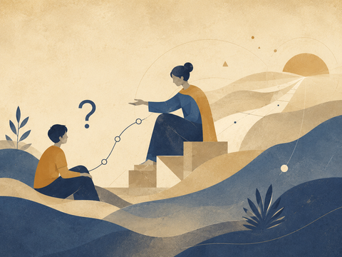

In Maxideal lived the Maxideals.

The Maxideals were very nice creatures, if niceness is measured by intention, timing, the ratio between effort and result, and the number of times a creature says “I am taking that into account” in a day and means it almost entirely.

They did not look like human beings. Not that Mik-Mik knew what human beings were.

Mik-Mik, in the language of Earth - not that he knew Earth, and not that Earth mattered that morning - was green. He had a wide jaw, fuzzy hair, a trunk too short to be a long trunk, and arms like octopus arms, but not exactly in any way. An octopus, if it had seen Mik-Mik, would have said, “Excuse me, not one of ours,” and withdrawn with marine dignity.

Mik-Mik liked to walk.

Not because walking was better than not-walking. In Maxideal no one said “better” without specifying in what context, in relation to which purpose, and under which internal weather. Mik-Mik liked walking because when he walked, small things jumped from the world into his trunk: smells, dustlets, whistles, pavement thoughts, and sometimes a florm, which is like a leaf, only with the memory of a door.

That morning Mik-Mik walked to Refus Takrem.

Refus Takrem was somewhat like a human supermarket, if humans bought only what was most correct to buy, ate only what was most correct to eat, and never stood by a shelf saying, “Maybe take this too, just in case,” because in Maxideal “just in case” was a suspicious expression requiring a form.

Above the entrance to Refus Takrem was a sign:

Welcome. Please first take what is relevant. If time remains, take what is almost not.

Mik-Mik liked the sign. Everyone liked the sign. Even the sign liked the sign, which was good, because in Maxideal they tried to ask signs whether they felt they were fulfilling their role. Signs usually said yes. Once a sign said “approximately,” and since then three committees, twelve subcommittees, and one children’s choir had been sitting on it, singing songs of support in descending order of relevance.

In Maxideal there was no such thing as “not important.”

It was the first expression every small Maxideal learned after “mother,” “father,” and “is this relevant to the present feeding goal?”

They did not say not important. They said less relevant. They said outside the present operational range. They said located in the temporarily non-relevant spectrum, but retained as possible data in the event of contextual change.

Small children shortened it to: not-now-but-is.

Mik-Mik was very good at not-now-but-is.

At the School of Gentle Relevance children were taught to distinguish between the two great spectra. The relevant spectrum included everything directly connected to the thing being done. The non-relevant spectrum included everything not directly connected to the thing being done, but which might become connected if the world moved, if the question changed, if someone began to cry, if a door closed, if a khonraf fell upside down, or if it turned out that the thing that did not touch was actually the handle of the whole thing.

Good Maxideals related to the relevant. Excellent Maxideals related to the relevant and a little more. Genius Maxideals related to the relevant, to the little more, to the little more of the little more, and to one thin stripe inside the non-relevant spectrum, until teachers clapped for them - but not too loudly, so the applause would not drown weak information located at the edge of the room.

That day Mik-Mik received a task.

His mother, Mik-Moka, gave him a list: “Mik-Mik, go to Refus Takrem and buy chew-grade-seven sloperkeshesh, one small khonraf, and three zatsmondraks ripe but not dramatic.”

“Ripe but not dramatic,” Mik-Mik repeated.

“Correct.”

He went. He took the sloperkeshesh. He found the khonraf. He stood before the zatsmondraks and checked ripeness, color, dramatic tendency, and possible future regret. Then he noticed a tiny object under the shelf.

It was a blue wimmel.

Wimmels were not on the list. They were rarely on any list, which was one of the reasons they developed such complex feelings. The wimmel was very small, almost irrelevant. It trembled in a way that could have been fear, temperature, or an early draft of music.

Mik-Mik looked at the list. Then at the wimmel. Then at the list again.

Not now, he told himself. But is.

He tried to continue shopping. The wimmel continued being.

At the checkout, the clerk scanned the sloperkeshesh, the khonraf, and the three zatsmondraks. “Anything else?”

Mik-Mik’s trunk lifted by itself. “A wimmel.”

The clerk froze. Behind him, the line rearranged its expectations.

“Is the wimmel relevant?” asked the clerk.

“No,” Mik-Mik said. “But not in the old way.”

That was a very serious sentence in Maxideal.

They called the supervisor. Then the supervisor of delicate exceptions. Then the emergency choir, but only two singers, because the matter was not yet dramatic. Everyone looked at the wimmel. The wimmel looked at no one, which some considered rude and others considered data.

Finally an old Maxideal named Zru-Pa arrived. Zru-Pa had once written a famous book called On Things That Were Not Relevant Until They Were Holding the Door.

He listened to Mik-Mik. He inspected the wimmel. He smelled the list. Then he said, “The list was correct.”

Everyone relaxed.

“And incomplete.”

Everyone unrelaxed.

Zru-Pa continued: “The task was to bring what was needed for the house. The wimmel was not needed for the meal. But it may be needed for the kind of house in which a creature can notice what is trembling under the shelf.”

No one knew where to file that.

Mik-Mik took the wimmel home. It did not do much. It sat near the window and made a sound like a question refusing to become useful too soon.

Mik-Moka looked at it for a long while. “This was not on the list.”

“I know.”

“Was it relevant?”

Mik-Mik thought of the two spectra, of the teachers clapping quietly, of the sign that loved itself, of ripe but not dramatic zatsmondraks, of the trembling blue thing under the shelf.

“Not immediately,” he said.

Mik-Moka nodded. In Maxideal that was nearly a blessing.

That evening a new line was added to the sign at Refus Takrem:

Please first take what is relevant. If time remains, take what is almost not. If something trembles, ask again.

The sign liked the addition.

Approximately.

## To Speak with Consciousness

_What Do Dogs Dream About?_

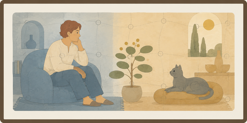

He had not meant to go there.

His father said there was one place worth seeing. A place where they showed dogs, or kept dogs, or sold them - he was not sure what to call it.

Sometimes someone says come, and the body starts walking before the will has decided whether it agrees.

So he went.

The place stood at the edge of the city: a low gray building with windows too wide and light too white. Inside there was the smell of fur, metal, disinfectant, and a sadness that did not belong to any one animal.

There were dogs.

Some lay quietly. Some turned behind partitions. Some looked at him with too much waiting in their eyes.

At the end of the room, inside a large cage, stood a gray dog.

He was big. Not beautiful. Not sweet. Not the kind of dog a person immediately wants to take home. He had a heavy wildness about him, like a low cloud before rain. His eyes did not beg. They watched.

The man at the place said something about age, about habits, about difficulty. The boy heard mostly the dog breathing.

When he came closer, the dog did not move away. When he stretched out a hand, the dog did not bow his head. He simply looked at the hand until the boy became embarrassed by it.

Then the dog bit him.

Not hard enough to ruin anything. Hard enough to be remembered.

His father pulled him back. The man apologized. The dog stepped once to the side and sat down, as if the conversation had gone exactly as far as it needed to go.

Years later he would remember the bite more clearly than many kind gestures. It had not been cruelty. It had been a border.

Another dog came home with them. Smaller. Brown. A dog with nervous paws and a need to sleep near doors. She became part of the house slowly, by placing her body in the places where the house was weakest.

She did not speak. That mattered.

She asked for food by standing near the bowl. She asked for outside by touching the door. She forgave badly and returned completely. She grew old in small pieces: first the jump, then the stairs, then the distance between waking and rising.

When she died, the house did not become quieter. It became larger in the wrong places.

After that, the gray dog returned in dreams.

Sometimes he was still in the cage. Sometimes he was in the hallway. Sometimes he lay on the floor beside the brown dog, as if they had always known each other. In the dream the gray dog could speak, but he rarely did. He preferred to put his head down, breathe, wait, and refuse the easy parts of the conversation.

'What do dogs dream about?' the man asked once.

The gray dog scratched his ear. A very dog-like answer.

'Do not make me into an answer,' he said at last.

The man woke with his hand closed around nothing.

The dreams kept changing. The dog was sometimes real, sometimes memory, sometimes an animal, sometimes a piece of the man looking back with a muzzle and tired eyes. The brown dog was there too. She did not vanish because the gray one knew how to speak. She remained near the door, keeping the ordinary world from being erased by the miraculous one.

One night the gray dog came close enough for the man to see the wet shine on his nose.

'Do not ask my name,' the dog said.

'What should I ask?'

'Ask what is left of you when you stop naming things.'

The quiet entered the room before the answer.

The dog opened his mouth.

For a moment it looked as though he would speak.

Instead he bit the man's hand.

Small. Familiar. Almost happy.

Not to stop him. Not to hurt him. More like an agreement between two creatures who had learned enough about each other not to need explanation immediately.

The man smiled. The dog closed his eyes.

For one moment they looked as if they were about to remember the same thing.

Then he woke. His hand still remembered teeth.

## Heretic from Abroad

_Faith on the Way_

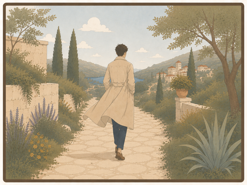

In that city, no one forbade asking questions.
They only taught them to wait.

Every question had its time, and every time had its room, and every room had a key hung high enough for children to see it and low enough for adults to pretend it was not a secret. The small questions stayed outside, near the benches, and were solved between prayer and prayer, between tea and a cookie, between someone who already knew and someone who still dared not to know. The great questions went inside.

The inner room stood at the end of the study hall, behind a wooden cabinet no one touched even after there was no longer anything in it. Its door was narrower than the other doors, as if it had been built for people willing to bow before entering. Above it hung an old sign, in Hebrew only:

The Inner Room

Someone had once added an English translation for donors from abroad, but the translation was crooked, and no one had corrected it for years:

THE INNER ROOM — ANSWERS ONLY

Some in the city saw that as a joke.
Some saw it as precision.

Usually, when a difficult question arrived, they would put it in a brown envelope, close the door, and wait. Sometimes an hour. Sometimes a night. Once, three days. In the end, an answer would come out. Not always a happy answer. Not always one people understood. But an answer. And in that city, an answer was something you could place on a table, even if you could not place the heart on it.

Until the note arrived without an envelope.

It was found in the morning on the chair beside the door. It had no name, no date, no respectful opening, not even “To the honored rabbis,” not even “A question.” Only one sentence, in handwriting that did not hurry and did not apologize:

What do you do with someone who has returned, but has no way to enter?

That morning they did not open the room right away.

Rabbi Menachem Rosen stood before the note and read it three times. The first time as head of the study hall. The second time as a man who had already seen people return too late. The third time, he did not know as what.

Rabbi Elikim Barzel said, “We need to know who this is about.”

Naftali, the young student, said too quickly, “Maybe it is a general question.”

“There are no general questions,” Barzel said. “There are only people afraid to provide details.”

Rabbi Rosen did not lift his eyes from the note.

Outside, in the street, a man who did not know the city’s rules for questions was standing on a short ladder, trying to straighten the English sign.

His name was Yonah Winter, but by noon they were already calling him something else.

Yonah had arrived in the land two days earlier.

He did not say, “I have returned.” He did not say, “I came to visit,” either. Both words sounded too certain to him. At the airport, when the clerk asked how long he would be here, Yonah answered, “It depends,” and the clerk looked at him as if depends were a country not recognized by the system.

Outside waited a taxi driver named Samir. Yonah knew his name from the license hanging on the dashboard. Hebrew spoke on the radio, and from the phone lying beside the steering wheel someone answered in Arabic. Yonah sat in the back and looked through the window at sunlight falling on fences, warehouses, eucalyptus trees, exit signs, writing in three languages, and dry weeds that looked as if they knew the country better than anyone who traveled over it.

“You are from abroad?” Samir asked.

“Yes.”

“But you have Hebrew.”

“I do.”

“So you are from here.”

Yonah smiled. “It is more complicated.”

Samir laughed. “Here everything is more complicated. But even someone who says he is outside—the road recognizes him.”

Yonah did not answer. He looked at the light. There were things in the land that irritated him only because he had not yet stopped caring about them. Abroad, Hebrew had been for him a language of books, conversations, and family messages. Here it returned through an open window, through the smell of hot dust, through the shadow of a eucalyptus on a wall, without asking permission.

He loved the land. He did not know where to put that.

He came to the city with one suitcase and an address folded in his coat pocket. The coat was too light for the weather and too warm for the season, the kind a person wears not because it fits but because it was already on him when he decided not to turn back from the journey. He had come for a small apartment belonging to a distant uncle, or for a document that had to be translated, or for an inheritance matter not worth the price of the flight and yet still strong enough to bring him.

He was Jewish; there was no doubt about that.
Even if there were people in the city who worked hard to arrange the doubt in its proper place.

He was not formerly religious. There was no drama of departure in him, no rabbi who had angered him in his youth, no yeshiva he had left in the middle of the night. He grew up in a gently traditional home: Kiddush when the family was together, matzah on Passover, candles sometimes, synagogue on Yom Kippur if it did not rain and if there had not been an argument beforehand. In his home, commandments were not kept the way one guards a border, and they were not broken the way one rebels against a king. The things were simply there: challah, grandfather, songs, laughter, a television murmuring low, someone saying “come on, honor it” before a blessing not everyone listened to.

Yonah had never left religion because he had never entered it all the way.
But he had also never left Judaism.
It remained in him like a language in which one can dream, even after years of speaking differently by day.

His Hebrew was too good for a tourist and too distant for a local. He knew when people said Maariv and when they said Arvit, but he did not always remember on which bench one could sit without someone shifting their eyes. He knew verses the way one knows streets in a city one left long ago: enough to arrive, not enough to pretend he lived there. Sometimes he would quote half a sentence and then fall silent, as if the other half belonged to someone else.

People asked him quiet questions, the way one asks someone when one does not know whether he is one of us or someone to be careful around.

“Are you from here?”

“Not exactly.”

“But you have Hebrew.”

“A little.”

“People don’t speak like that with a little.”

“Then maybe more than a little.”

“Did you study?”

“What?”

“You know.”

“All kinds of things.”

“Yeshiva?”

“No.”

“So where?”

Yonah would smile. “People.”

It was an answer that satisfied no one, and therefore it quickly repeated itself. In that city, anything that did not fit a category became a story before it had time to be a person.

They did not call him an apikores, at least not at first. The word was too heavy. “Heretic” was lighter. Shorter. Better suited to stairs, to courtyards, to children, to a synagogue attendant sighing when he sees a man without a kippah standing too close to the bookcase.

But that was not accurate either.

Yonah did not like fighting faith. He did not make rituals out of his secularity. He did not look for ways to refute. He was open to conversation with everyone in a way that irritated nearly every side: with rabbis and atheists, with believers and with people who had lost belief, with those who spoke in the name of tradition and those who spoke in the name of science, with those who knew how to quote and those who knew only how to hurt.

He did not think every opinion was true. He only wanted to know what it was protecting.

He held no organized system. He had no beautiful names for what he thought. But he had a habit: before accepting an answer as an answer, he would ask what question had been run over on the way to it. Before trusting a boundary, he would check whether it was still guarding something alive, or only defending itself.

He had not learned that in a study hall. Perhaps he had learned it in train stations, in unfinished languages, in waiting rooms, in people who spoke of home as if it were a place one could reach only after someone else agreed to call it that.

They knew more than he did about almost everything.
Sometimes, precisely because of that, they did not see when knowledge began to become a wall.

The name stuck to him because of the clock.

The clock above the entrance to the study hall had been three minutes slow since the month of Av in a year no one any longer agreed to remember exactly. Some said it began after a power outage. Some said one of the attendants had moved it on purpose so evening prayer would not start too early. Some said, quietly, that time in the study hall had always moved a little differently.

Yonah asked where the ladder was, climbed up, opened the little box at the back, turned something, climbed down, and the clock began to keep time.

“A magician,” one of the children said.

“Not a magician,” Yonah said. “A battery.”

The child thought for a moment and said, “Then a heretic.”

Yonah looked at him. “That is usually not the same profession.”

“Here it is,” the child said.

By evening, some were already calling him the heretic from a foreign land. Not to his face at first. Later, yes. In that city, even nicknames had to pass through several people before they became permitted.

Yonah did not argue with the name. He did not accept it, but he did not reject it either. Some names, if you fight them, only learn the shape of your hand. He let it pass beside him like a wet cat in a courtyard. Sometimes, when someone called him that from across the street, he would answer “Yes?” as if it were a spelling mistake one could live with.

On the morning the note was found, Yonah was standing on the ladder trying to understand why the English letters above the inner room leaned slightly to the left. Not the whole sign. Only the word ANSWERS. It looked as if it were moving away from the door.

“Don’t touch that,” said the attendant.

“Why?”

“It is a sign.”

“I know.”

“Then don’t touch it.”

“It’s crooked.”

“It has always been crooked.”

Yonah closed the screwdriver. “That is not as strong an argument as you think.”

The attendant did not laugh, but the child from the clock laughed for him.

Inside, the rabbis were still standing before the note.

After a few minutes, they entered the inner room: Rabbi Menachem Rosen, Rabbi Elikim Barzel, Shmuel Hochman, and Naftali. They closed the door. Those outside heard the handle descend quietly, as if the door itself asked them not to exaggerate its meaning.

In the room there was a long table, four chairs, and one additional chair no one used. The fifth chair always stood by the wall, lightly covered with dust. No one knew exactly for whom it was intended. Some said for an important guest. Some said for Elijah. Some said the chair remained from the days when they still invited inside the person about whom the question was being asked. No one moved it.

Rabbi Rosen placed the note in the center of the table, as if, if it were far enough from everyone, it would stop belonging to someone.

Rabbi Barzel read aloud:
“What do you do with someone who has returned, but has no way to enter?”

He did not read it like a question. He read it like a door someone had tried to open without permission.

“Returned from where?” he asked.

Shmuel Hochman said, “That is exactly what is not written.”

“Then there is no question,” Barzel said. “There is a hint.”

Naftali said, “Maybe the hint is the question.”

Barzel looked at him until Naftali lowered his eyes.

Rabbi Rosen sat down slowly. His movements were those of a man who had learned not to hurry near words. He was the kind of person whose silence is not empty but too full, and therefore others rush to fill it.

“Let us suppose it is a person who has returned to the community,” he said.

“If he left willingly,” Barzel said, “return does not erase departure.”

“And if he left because no place was left for him?” Hochman asked.

“Someone for whom no place was left usually knows how to say who pushed him out.”

“Not always,” Rabbi Rosen said.

They were silent.

Outside, a small metallic sound was heard, as if someone were trying to fit a key into a lock not his own.

Naftali took a sheet of paper and began listing possibilities. His handwriting was quick, too precise, the handwriting of someone who believes that if he writes fast enough, thought will not have time to escape.

A penitent.
An excommunicated man.
A convert.
A son who returned.
A woman who returned.
A person who sinned.
A person rejected by mistake.
A person rejected rightly.
A person with no documents.
A person with documents and no face.

At that point he stopped. He had not meant to write the last words. They came out of the pen before he managed to ask whether they were allowed.

Barzel saw.
“There is no such category,” he said.

Naftali erased quickly. The erasure looked worse than the writing.

Hochman paced the room. He disliked discussions that did not have the shape of a solution. As head of the community, he knew what happens to a question left too long without an answer: it begins to walk among people. At first quietly. Then near doors. Then in names. In the end it is no longer a question but a camp.

Once, years before, a single rumor had closed an entire family inside its house. No one remembered afterward who had said it first; everyone remembered who stopped coming.

“We need to know if it is urgent,” he said.

“A question without a name is always urgent to the one who wrote it,” Rabbi Rosen said.

“Or to the one who wants to force us to answer without details,” Barzel said.

“That too can be.”

“Then why treat it seriously?”

“Because even manipulation sometimes uses a real question.”

Barzel leaned back. “With respect, Rabbi, if we open every question that has no name, we will close no door.”

“Maybe that is precisely the question,” Naftali said, almost without voice.

This time Barzel did not look at him. Perhaps because he had heard, and perhaps because he did not want to.

The discussion continued.

They brought books. Not many at first. Then more. The table, wide enough for four men and one question, became too narrow for sources. Pages opened, closed, bookmarks moved from place to place. One word gave birth to another. “Returned” opened into “repentance,” “repentance” into “regret,” “regret” into “acceptance for the future,” “way” into “entrance,” “enter” into “congregation,” “congregation” into “assembly,” “assembly” into “boundary.”

Every word was right. Every path led. No path arrived.

Toward noon Hochman left the room to ask for tea. Outside he found Yonah sitting on the bench, holding the English sign on his knees. Beside him stood the child from the clock, holding screws in an open palm, like someone holding seeds for a bird.

Across the street from the study hall, the owner of a small cafe was lowering plastic chairs onto the sidewalk. His name was Nasser, and everyone called him Nasser even when they bought from him without admitting they bought from him. He sold black coffee, cigarettes, cold water, and pita with za’atar that was not written on any menu. Yonah had bought from him that morning. Nasser asked where he was from. Yonah said, “Outside.” Nasser said, “That is not a place, but here it is enough of an address.”

“What are you doing?” Hochman asked.

“Trying to understand whether the problem is in the sign or in the translation.”

“The sign is fine.”

“The sign is stable. That is not the same thing.”

Hochman was too tired to argue with a man from outside about the difference between stable and fine.

“Put it back the way it was,” he said.

“The way it was is exactly what made me take it down.”

“This is not the time.”

“Time is also something I fixed for you today.”

The child laughed again. Hochman did not.

From the room came Barzel’s voice, heavy and cutting. Hochman turned to go, but Yonah asked:

“Why does it say in English ‘Answers only’?”

Hochman stopped.

“What?”

“On the room. In Hebrew it says ‘The inner room.’ In English it says ‘Answers only.’ That is not the same thing.”

“It is for people from abroad.”

“People from abroad don’t need to know that it is inner?”

“They need to understand that it is a place of answers.”

Yonah ran a finger over the letters. “Maybe that is the problem.”

Hochman looked at him.

Yonah lifted the sign slightly, as if weighing it. “A place that thinks it is only for answers begins to get confused when the question does not behave nicely.”

“You don’t know what we’re talking about.”

“Correct,” Yonah said.

It was an answer Hochman did not know what to do with.

Nasser, from the other side of the road, said in a completely ordinary voice:
“Sometimes the problem is not in the key. The doorframe has shifted.”

Hochman looked at him. Nasser shrugged.
“I’m talking about doors,” he said. “Not about you.”

Yonah smiled, but not too much.

Hochman took the tea and went back inside.

Inside, Rabbi Rosen stood by the window. The curtain was stuck in its track, so light entered only partly, a narrow line across the table. The note lay inside that line.

“He asked about the sign,” Hochman said.

“Who?” Barzel asked.

“The heretic from a foreign land.”

Naftali lifted his head.

Rabbi Rosen did not turn around. “What did he ask?”

“Why the English says it is a room of answers only.”

Barzel said, “Because that is what it is.”

“No,” Rabbi Rosen said.

Everyone looked at him.

He touched the stuck curtain and failed to move it. “That is what we want to come out of it.”

The silence afterward was not agreement. But it was new.

Barzel closed a book. “Rabbi, we are not going to start learning from the translation of some sign.”

“No,” Rabbi Rosen said. “Not from the sign.”

Naftali looked at the note. “But maybe from the mistake.”

“Even mistakes,” Barzel said, “need a boundary.”

“True,” Rabbi Rosen said. “But sometimes the boundary they reveal is not theirs.”

Hochman felt the discussion moving toward a place that could not be presented to the public. He hated such places. Not because they were false, but because they were too true before they were useful.

“In the end we need to answer,” he said.

“Yes,” Rabbi Rosen said. “But perhaps first we need to know to whom.”

“To the one who returned,” Barzel said.

Rabbi Rosen looked at him. “Or to the one who did not open.”

The sentence remained in the room. It touched no book. It asked for no source. That made it harder to move.

Toward evening the people outside began to ask whether an answer had come out. The attendant said no. Then he said “not yet.” Then he stopped answering. In the study hall, rumors began to move among the benches like cats who know where the milk was placed.

“It’s about Weiss’s son,” someone said.

“Which son?”

“The one no one talks about.”

“So why now?”

“Maybe he came back.”

“They didn’t let him in?”

“Who said he wanted to?”

“So why the question?”

“You’re asking me?”

A woman standing in the women’s section heard and said quietly, “Maybe it is about Dayan’s Rivka.”

“She didn’t return,” they told her.

“Did anyone ask her?”

After that the silence came down quickly, like a blanket thrown over something broken.

Yonah heard fragments. Not everything. He did not ask. There are places where a man from outside learns too quickly that any question of his will sound like an investigation. He kept working on the sign, but did not put it back. In the street someone asked a price, someone answered in Arabic, a child shouted in Hebrew, and one tourist asked for a stop in English. Then he placed the sign by the wall, under the window, so that anyone who passed could see the words:

ANSWERS ONLY

without the door that explained them.

Naftali came out of the room toward sunset. His face was a little pale. He was not used to thinking that did not progress through sources. He was used to climbing: verse, Mishnah, Talmud, early authorities, later authorities, response, custom, act. Here every ladder brought him to the same door.

Yonah was still sitting on the bench.

“Are you really a heretic?” Naftali asked.

Yonah looked at him as if he had asked whether he was really left-handed.

“Depends who is asking.”

“I am.”

“Then not enough for you.”

Naftali did not know whether that was an answer or mercy.

He sat at the edge of the bench, not too close. “Why did you stay?”

“I’m waiting to be paid.”

“For the sign?”

“For the clock, the sign, and another lock someone promised to bring and did not.”

“That is not much.”

“That is why I’m not in a hurry.”

Naftali was silent. Then he said:
“There are things you don’t understand.”

“Of course.”

“No, I mean really. It has weight. You can’t open everything because of a beautiful sentence.”

“I don’t know beautiful sentences.”

“You do.”

“Not on purpose.”

Naftali smiled despite himself.

Yonah looked at the door of the inner room. “What is the question?”

Naftali tensed. “I can’t say.”

“Then why did you come out?”

It was too simple a question. Naftali felt it like a small stone inside a shoe.

“I don’t know.”

“That is also something.”

“Not with us.”

“With you, probably especially.”

Naftali almost stood up, but stayed. “If a person leaves, it has meaning. If he returns, it has meaning. One cannot ignore what happened.”

“Who said ignore?”

“So what are you saying?”

“I’m not saying. I don’t know who this is about.”

“Then how can you think you have anything to say?”

Yonah looked at him. Not severely. Almost wearily.

“Because sometimes you can know where a sentence is stuck even without knowing the whole story.”

Naftali did not answer.

“You think the question is stuck in the one who returned,” Yonah said. “Maybe it is stuck in the way.”

Naftali looked at the door.

Yonah added, “Or in the one holding the key.”

“Sometimes,” Naftali said, “the key belongs to the one who was hurt.”

Yonah looked at him. That stopped him.

“True,” he said after a moment.

“And that you do not see from outside.”

Yonah set the cup on the floor. “Probably not enough.”

Naftali looked at the cup on the floor and said nothing.

At that moment the door opened. Rabbi Barzel stood in the doorway. He saw Naftali beside Yonah, and Yonah beside the sign, and the sign on the ground, and there was a shape to all of it he did not like.

“Naftali,” he said.

Naftali stood at once.

“And the sign?” Barzel asked.

Yonah lifted it. “I’m working on it.”

“Put it back.”

“As it was?”

“As it was.”

Yonah nodded. “That is usually what people ask me when they do not want a repair.”

Barzel looked at him. “Do you know what the problem is with people from outside?”

“They are cheaper?”

The child from the clock, who had appeared from who knows where, laughed aloud.

Barzel did not smile. “They think every closed door is fear.”

Yonah stood up, the sign in his hand. “No. Only a door no one remembers why they closed.”

“And sometimes,” Barzel said, “a closed door is the only thing left to someone who was once broken into. Sometimes the one who returns asks for a way to enter, but does not ask the person who must move again to make room for him. Sometimes mercy for the one who returns is cruelty toward the one who stayed.”

The sign became heavy in Yonah’s hand.

He did not find an answer right away. Good that he did not.

“That is true,” he said at last.

Barzel was a little surprised, but did not let it show.

“Then be careful,” he said. “Not every threshold is an invitation.”

Yonah lowered his eyes to the screwdriver. “And not every lock is justice.”

For a moment it seemed Barzel would say something that would close the entire street. But Rabbi Rosen called from inside:
“Elikim.”

Barzel did not lower his eyes from Yonah.

“Inside,” he said.

Naftali went in after him.

The door closed. Not all the way. Maybe because the lock was old. Maybe because someone had not pulled hard enough. Maybe because there are moments when even wood grows tired of its role.

Yonah remained outside with the sign.

He thought of putting it back the way it had been.
Then he thought not to.
Then he did a third thing: he screwed it back, but did not tighten it all the way.

Inside, the discussion approached the place where discussions become dangerous. Each person already understood what the others thought, and no one wanted to be the first to say it in a form that could not be taken back.

Barzel said, “If the person has returned, he must come. Give a name. Detail what happened. Accept conditions. There is no entry without accepting a way.”

Hochman said, “And if his very arrival causes a rupture?”

“Then the rupture exists already.”

“Now it is quiet.”

“Quiet is not peace.”

“And not every truth needs to be public.”

“And not every fear is called responsibility.”

Rabbi Rosen raised a hand. Not high. Enough.

Naftali said, “Maybe ‘a way to enter’ does not mean conditions. Maybe it means language.”

“Language?” Barzel asked.

“Yes. Maybe he has no way to say he returned so that people will hear him as returning.”

“If he truly returned, he will say it.”

“And if everything he says will be heard through what he did when he left?”

The sentence was bigger than he was. He knew it the moment he said it. But it was already in the room.

Rabbi Rosen looked at him for a long time. “Who told you that?”

Naftali opened his mouth. Closed it.

“He didn’t say it,” he said. “I think I heard it.”

Barzel said, “Outside one hears many things.”

“Sometimes,” Rabbi Rosen said, “that is our problem. That we do not.”

Hochman went to the door. “Maybe we should bring him in.”

“Whom?” Barzel asked.

“Winter.”

“No.”

“He is already part of the discussion.”

“He is part of the noise.”

“Elikim,” Rabbi Rosen said, “he will not rule.”

“Of course not.”

“Then what are you afraid of?”

Barzel stood. His chair scraped backward with a harsh sound. “I am afraid of the day we no longer remember the difference between one who asks because he is bound, and one who asks because he has nothing to lose.”

Rabbi Rosen did not answer immediately.

“That too is a true fear,” he said at last.

Barzel was surprised. The softest thing one could say to him was to recognize that his fear was not foolishness.

“But,” Rabbi Rosen continued, “there is another fear. The fear that one day we will protect the room so well that we will no longer notice that no one can enter it without first becoming a question.”

Hochman looked for a moment toward the benches outside, as if counting who might disappear from them tomorrow.

Then he opened the door.

Yonah was there, standing on the ladder, holding a screw between his lips. He looked less like a heretic and more like a man trying not to drop something on someone else’s head.

Hochman said, “Rabbi Menachem asks that you come in.”

Yonah climbed down one step. Then another.

“Why?”

“Because you are already speaking.”

“I’m not.”

“Then maybe because of that.”

Yonah took the screw from his mouth. “I am not a rabbi.”

“That is known.”

“And I do not believe what you need me to believe.”

“That is going around the city too.”

“So why?”

Hochman looked at him, and for the first time that day he seemed not like a community leader but like a man who would prefer someone else carry the hot bowl.

“Because sometimes one needs to hear how a sentence sounds without all the books around it.”

Yonah looked into the room. Four men, a table, a note, open books, one chair by the wall. He did not enter.

“Can I stand here?” he asked.

“What?” Hochman said.

“Can I stand here?”

Rabbi Rosen heard. “Yes.”

Yonah remained on the threshold.

Rabbi Rosen lifted the note. “Read.”

Yonah read.

Slowly, but not because it was difficult. He read like a person checking whether the words had been placed correctly.

What do you do with someone who has returned, but has no way to enter?

He returned the note to the table.

“Well?” Barzel said.

“It does not ask what you think.”

“And what do we think?”

“That there is a person outside, and you need to decide whether he has a way in.”

“That is the question.”

“Not sure.”

Barzel smiled without joy. “Then what is the question, according to your method?”

Yonah looked at the door. Then at the dust-covered chair by the wall. Then at the sign that had returned to its place, still a little loose.

“I do not know a method,” he said. “But from outside it sounds different.”

“How?”

“As if someone has returned, but the way does not know how to be a way.”

Naftali closed his eyes.

Barzel said, “A way does not know. People know.”

“Then the people do not know how to be a way.”

Silence.

The sentence stayed.

Rabbi Rosen said, “Continue.”

Yonah ran a hand over the doorframe, as if he were not sure he was allowed to touch it. “You are asking what to do with someone who returned. But maybe he has already done his part. Maybe he returned. Maybe now the question is what to do with a place that is still built as if he has not.”

“That is homily,” Barzel said.

“Maybe,” Yonah said. “I told you I do not know the profession.”

“And what if the place is right?” Barzel asked. “What if there is a reason there is no way?”

“Then say there is no way.”

“Sometimes that is the answer.”

“Yes. But then do not call it ‘what do we do with someone who has returned.’ Call it ‘how do we tell someone who returned that the door is still afraid of him.’”

Hochman took a short breath. Naftali looked at the table. Rabbi Rosen did not move.

“There are justified fears,” Barzel said.

“There are,” Yonah said.

“There are people whose return is dangerous.”

“There are.”

“There is damage that does not disappear.”

“Of course.”

“There are people who ask to enter not because they have changed, but because they are tired of being outside.”

Yonah was silent.

“That also exists,” he said.

Barzel looked at him, as if searching for the place where Yonah would flee into a beautiful sentence. Yonah did not flee.

“So what have you added?” Barzel asked.

“Nothing,” Yonah said at last. “Maybe only that if the door is closed out of fear, one should say fear. If it is closed by law, one should say law. If it is closed to protect someone who was hurt, one should say the name of the one being protected, even if not aloud. And if it is closed because you have forgotten how to open it, that is already a fourth thing.”

Rabbi Rosen lowered his eyes.

Barzel said, “And you know how to distinguish?”

“Not always.”

“Then why should we listen to you?”

Yonah smiled a little, not in victory. “Because I say I do not always know.”

That sentence angered Barzel more than he expected. Not because it was profound, but because it was hard to use against him. People who know too well where they stand are easier to move: you push from the right side. A person who is willing to leave room for not-knowing gives no good point of leverage.

“Not-knowing is not a virtue,” Barzel said.

“Correct.”

“Nor is doubt wisdom.”

“Correct.”

“So?”

“But knowledge that is afraid of doubt sometimes stops being knowledge. It becomes guarding.”

Barzel was silent.

Not because he was convinced.
Because the sentence had passed too close to something he knew.

Rabbi Rosen stood. He went to the dusty chair by the wall and placed a hand on it. Dust clung to his fingers. He looked at them as if they had said something he had not meant to say.

“Once,” he said, “we used to bring in here the person about whom the question was being asked.”

Hochman looked at him quickly. “That was many years ago.”

“Yes.”

“And it was stopped for a reason.”

“Probably.”

“Not probably. For a reason.”

Rabbi Rosen nodded. “Questions began to behave like people. People began to behave like evidence. It became difficult.”

“And therefore?” Barzel asked.

“And therefore we removed the person to save the question.”

Yonah said nothing.

“And perhaps,” Rabbi Rosen continued, “on the way we saved the question from the person until no person was left in it.”

Naftali lifted his eyes. It was the kind of sentence that, when a rabbi says it, becomes permitted only after it has already been said.

Barzel said, “What do you propose?”

Rabbi Rosen looked at the note. “Not an answer yet.”

“Then what?”

“To find the one who asked.”

Hochman almost said that was impossible. Then he remembered how many times in this city “impossible” had been another name for “unpleasant.”

“And if we do not find him?” he asked.

“Then we will find the door.”

Barzel did not like that. “A door is not a subject for a halakhic discussion.”

Yonah, who had almost already left, said, “Neither is a sign.”

Barzel looked at him.

“And still,” Yonah said, “sometimes it says more about the place than the place wants.”

This time the child did not laugh. He was standing outside, near the threshold. No one drove him away.

Evening descended slowly. People scattered and returned. Rumors changed shape. Someone brought dry cakes. Someone else said it was not nice to eat while a question was open. Someone answered that in this city people eat beside the dead and beside babies, so beside a question they can.

Toward night the four came out of the room. Yonah was no longer there. The sign hung in its place, but something in it had changed. Not the words. Not yet. Only the tilt. ANSWERS no longer fled from the door. It stood straight, and that made the translation look even more wrong.

Rabbi Rosen stood before it for a long time.

“Take it down tomorrow,” he said.

“The sign?” asked the attendant.

“The English.”

The attendant grew anxious. “But the donors.”

“We will put different English.”

“What should it say?”

Rabbi Rosen did not answer.

Naftali, standing behind him, said quietly:
“Questions may enter.”

Rabbi Rosen looked at him.

Naftali blushed. “Or something like that.”

Rabbi Barzel, who was already on his way out, stopped. “That is not a translation.”

“True,” Rabbi Rosen said.

“So?”

“The previous one was not either.”

Barzel wanted to say something more, but the fatigue of the day rested on his shoulders like a wet tallit. He left.

The next morning, the city discovered two things.

The first: the inner room had not been abolished.

The second: the dusty chair no longer stood by the wall.

It had been placed beside the door, not inside and not outside. Exactly on the threshold. The attendant claimed it was temporary, because it needed cleaning. The child from the clock said that is always what people say about things they are afraid are permanent.

At noon they found Yonah at the station. His suitcase beside him, his coat on his knee. He was reading a book in English and stopped every few lines to look at the road, as if the bus were a possibility and not a promise.

Nasser was there with a thermos of coffee and small cups. He had no stand at the station, but everyone knew that if you stood there long enough, he appeared. He gave Yonah coffee without asking whether he wanted it.

“You’re leaving?” he asked.

“Probably.”

“People say that when they want someone to stop them.”

“Are you stopping me?”

“I sell coffee.”

Yonah laughed.

Nasser looked at the road. “Do you love the place?”

Yonah did not expect the question. “Which place?”

Nasser looked at him.

“Yes,” Yonah said. “But I am not always good at it.”

“So do not make it good,” Nasser said. “Take coffee.”

Yonah held the cup in both hands. The coffee was bitter and hot. At the station, Hebrew, Arabic, English, and Russian passed by, not as a festive mixture and not as an argument, but the way people pass when they have somewhere to get to. The land was there without explaining itself.

Naftali arrived first. Then Rabbi Rosen. Hochman remained at a slight distance, because community leaders do not run after heretics at bus stations unless there is a public reason.

“You are leaving?” Naftali asked.

“That is what people say about people at stations.”

“Where to?”

“Outside.”

Naftali smiled. “That is a big place.”

“That is why there is room in it.”

Rabbi Rosen came closer. In his hand he held the note. Not the original. A copy, perhaps. Or perhaps the original. Yonah did not ask.

“We did not find who wrote it,” the rabbi said.

“Maybe good.”

“Why?”

“Because then you would go back to talking about him.”

Rabbi Rosen accepted this in silence.

“We will try differently,” he said at last.

“What does that mean?”

“I do not yet know.”

Yonah closed the book. “Not a bad beginning.”

“Do you believe in that?” the rabbi asked.

“In what?”

“In not knowing.”

Yonah thought a moment. “No. I do not believe in not knowing. I believe one should not hurry to lie in the name of knowing.”

Rabbi Rosen smiled. Not much. A small smile of a man who found a formulation he would not use in a sermon, but would keep for himself.

“And you?” Yonah asked.

“I believe in knowledge,” the rabbi said.

“That is dangerous.”

“Yes.”

“And still?”

“Yes.”

Yonah nodded. “Then perhaps we are not as far apart as it looks.”

The bus appeared at the end of the street. Like everything that comes from outside, it raised dust before it arrived.

Rabbi Rosen said, “They call you the heretic from a foreign land.”

“I heard.”

“It is not accurate.”

“Good nicknames are never accurate. They only reveal what frightens the person who gave them.”

Rabbi Rosen looked at him. “And what frightens us?”

Yonah stood, lifted the suitcase. “That one can know a great deal and still not hear.”

The bus stopped.

Naftali wanted to ask something, but the question could not find a way into his mouth in time. Yonah handed him the book.

“Take it.”

“What is it?”

“Not a holy book.”

“I understood that.”

“Not the opposite either.”

Naftali looked at the cover. He did not recognize it.

“So what is it?”

“A conversation.”

Naftali took it.

Yonah boarded the bus. Before the door he turned to Rabbi Rosen.

“The sign,” he said, “is still not a good translation.”

“I know.”

“Leave it a little not-good.”

“Why?”

“So you will have something to hear.”

The door closed. The bus drove away.

In the city, that afternoon, they hung a new sign above the inner room.

In Hebrew it still said:

The Inner Room

In English they wrote:

THE INNER ROOM — QUESTIONS MAY ENTER

Rabbi Barzel said it was too weak. Questions do not enter by themselves. Rabbi Rosen said that was precisely why the word MAY was important. Hochman said donors from abroad would understand. Naftali said maybe people from inside would too.

Nasser, passing by with a crate of cups, looked at the sign and said to the attendant:
“You are not writing Arabic?”

The attendant was confused. “Why?”

Nasser lifted a shoulder. “I don’t know. There is a door. Maybe one day someone will read.”

He kept walking before anyone could decide whether it was a comment, a joke, or only a sentence.

No one said the sign solved the question.
The question was still not solved.

They did not find the writer.
They did not know who had returned.
They did not know if he really had a way.
They did not know if the way should open.
They did not know if the door was afraid justly.

But that evening, before they locked the study hall, the attendant noticed the chair on the threshold.

“Bring it in?” he asked.

Rabbi Rosen stood by the door.

“No.”

“Take it out?”

Rabbi Rosen looked at the chair, then at the room, then at the street that had already grown dark.

“No.”

The attendant scratched his forehead. “So where is it?”

Rabbi Rosen said:
“For now.”

In that city, that was not an answer.

But it was a way not to close the question too quickly.

## Puzzle

_How Can a Sea Be Stormy Without Waves_

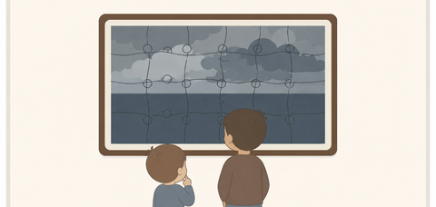

On the wall hung a picture of a stormy sea.

The little boy stood before it for a long time. Up close, the sea was not smooth. It had thin lines in it, small breaks, borders that did not appear in the sea he had once seen for real.

“What is it?” he asked.

His older brother looked for a moment.

“A puzzle.”

The little boy nodded, as though he had received an answer.

“Oh,” he said. “Puzzles.”

His older brother turned to him.

“No. Puzzle.”

The little boy looked at the picture again.

“One?”

“Yes.”

He stepped a little closer.

“Even the lines?”

His older brother made a face.

“What lines?”

The boy pointed without touching the glass.

“Those.”

“That’s how it is in a puzzle.”

“Then why not puzzles?”

His older brother sighed.

“Because you say puzzle.”

“Who says?”

His older brother straightened a little.

“I’m in second grade,” he said. “I know.”

The little boy nodded, because it really did sound like a reason.

Then he went back to looking at the sea.

From far away it was almost ordinary.

## To Fear Intruders, or Talk to Computers

_One Bare Foot_

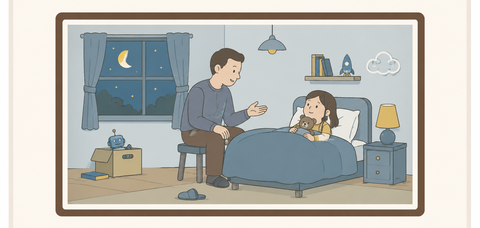

“Dad,” she said, “I’m afraid to sleep.”

Her father was already by the door, his hand on the light switch.

“But your brother is in the room with you,” he said. “What are you afraid of?”

She pulled the blanket up to her chin.

“Intruders.”

Her father gave a small smile, not because he was laughing at her, but because he wanted the fear to look smaller to her. He went to the window, opened it a little, and pointed outside.

“Look where we are,” he said. “Third floor. Very, very high. How would intruders get up here?”

She looked outside seriously.

“With a ladder.”

Her father paused.

“True,” he said carefully. “But there isn’t a ladder that long. From the street to here? No. You don’t need to worry.”

She thought about that for a moment.

“Then he’ll climb to the top.”

“Who?”

“The intruder.”

“On the ladder?”

She nodded.

“And when he gets to the top, he’ll take tape and stick the ladder higher. Then he’ll keep climbing.”

Her father opened his mouth, closed it, and looked outside again, as though he might actually have missed an important clause in the laws of ladders.

“I don’t think ladders work like that,” he said.

“But tape sticks.”

“Not ladders to a wall on the third floor.”

“Maybe he has strong tape.”

Her father closed the window.

“My beautiful girl, if an intruder comes with a ladder like that and tape like that, I think he’s not an intruder anymore. He’s an engineer.”

She did not laugh right away. Then she smiled a little, just to show she had heard the joke, but her eyes were still checking the window.

“I’m still afraid of intruders.”

Her father sat on the edge of her bed.

“You are not alone. I’m in the next room. Mom is home. Grandpa and Grandma are close. Uncle and Aunt. Your brother is here. We are all watching over you.”

She listened.

“And do you know what will happen if an intruder comes?” her father asked.

She looked at him.

Her father opened his mouth very, very wide, too wide, and moved toward her slowly.

“I’ll eat him!”

She laughed.

Then she stopped laughing a little too quickly.

“Dad, that’s weird.”

“True,” he said. “But it worked for a second.”

She smiled, and then went quiet.

Her father already thought the fear had fallen asleep before she had, but then she said:

“Dad?”

“Yes?”

“I’m afraid I’ll never learn to read.”

He looked at her.

“Why do you think that?”

“Because all the kids in my class read better than me. And I can’t do it. I’m only good at math.”

Her father moved a little closer.

“You will learn to read,” he said. “Everyone learns in the end. Everyone in their own time. And when you do learn, you’ll know it’s something you truly managed to do. We learn so many things in life. Learning isn’t scary. Learning is fun.”

She thought about that quietly.

Then she said:

“But what if intruders come?”

Her father breathed in, like someone trying not to open his mouth too wide for a second time.

“There are also guards,” he said. “There are guards at the entrance to the community. And there are guards at your school. People watch over us all the time.”

“All the time?”

“All the time.”

“Even at night?”

“Even at night.”

She looked a little calmer.

Then her father added, without realizing he was about to replace one fear with another:

“And one day, maybe when you and your brother are grown, maybe you’ll also be in the army. There’s something there called shin-gimel, a guard post. You stand and guard.”

She sat up at once.

“I don’t want to go to the army.”

“Not now,” her father said immediately. “When you’re grown.”

“I don’t want to.”

“It isn’t necessarily a bad thing.”

“If someone doesn’t go to the army, do they go to jail?”

Her father realized too late that he had entered the wrong room inside her head.

“If someone has a valid reason, then no,” he said. “And if they don’t have a valid reason, then sometimes yes. But you don’t need to think about that now.”

She was thinking about it now.

“What if I don’t want to?”

“Maybe by then there will be peace,” he said.

She looked at him with a small, serious expression, much too serious for a girl who was still afraid of ladders.

“And if there isn’t peace?”

Her father was quiet for a moment.

“Then, worst case, you can say you’re a pacifist.”

“Passifist?”

“Pacifist.”

“Passifistit?”

“Almost.”

“What is it?”

“It’s someone who believes they don’t want to fight. Someone who doesn’t believe in wars.”

She tried to say it again.

“Paci... fis...”

“Pacifist.”

“But Dad,” she said, “how will I tell them? I can’t even say the word.”

Her father laughed, this time for real.

“You’re going to learn so many things in life, my beautiful girl. And it’s fun. Do you know what Dad does at work?”

“No.”

“Dad talks to computers.”

She looked at him as though he had just told her something completely impossible.

“Dad, you’re funny. Computers don’t talk.”

“True,” he said. “Not like we talk. But Dad knows how to talk to them. He knows how to ask them a question, how to give them a task, how to explain rules to them.”

She sat up straighter.

“Can I learn?”

“Of course.”

Her father looked around the room for an example. On the floor, near the bed, there was one slipper.

He picked it up.

“Let’s say I tell the computer this: if the girl has one shoe, she can’t go to school. But if the girl has two shoes, she can go to school.”

She listened carefully.

Her father placed one shoe on the floor.

“Now I ask the computer: there is one shoe. Can the girl go to school?”

“No,” she said.

“Good. And now if there are two shoes?”

He picked up the second slipper and placed it beside the first.

“Can the girl go to school?”

“Yes.”

“Exactly. That’s like talking to a computer. You give it a rule, and then you ask it. Did you understand, my beautiful girl?”

She nodded.

“What did you understand?”

She looked at the two slippers.

Then at her father.

“That if I don’t want to go to school,” she said, “I can hide one shoe.”

Her father opened his mouth to answer, then closed it again.

Instead of an answer, a small laugh came out of him, tired and happy.

“Okay, my beautiful girl,” he said. “Then I want you to do something for me now.”

“What?”

“Try to think of a story. Now, before you fall asleep. A story about a computer you can talk to. What it looks like, where it lives, what it answers when people ask it things. And in the morning, you’ll tell it to me.”

She pulled the blanket up to her chin and thought about it seriously.

“But Dad,” she said at last, “I only know how to tell stories about...”

She stopped.

“About what?”

She searched for the right word and did not find it.

“About la-la-la.”

Her father smiled.

“La-la-la,” he repeated quietly.

“That sounds woolly and purple to me.”

She looked at him for a moment, as if checking whether he was laughing at her.

But he was not laughing.

So she turned onto her side, with one bare foot a little outside the blanket.

And the room grew quiet.

Not because the intruders were gone.

Not because the questions were gone.

But because that night, at least, she had la-la-la to think about.

## A Few Strings and a Knot

_The Redeemer as the Redeemed_

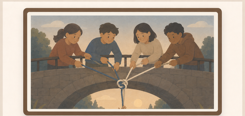

Moshe did not fall because he wanted to fall.

That was a small, stubborn fact that did not know where to sit inside the story. He had not gone to the bridge to die. He had written no letter. He had said goodbye to no one. He had only taken the long way home, carrying a sadness too large for a child and too small for anyone outside him to see.

He was fourteen. Nothing that week had happened that could be pointed to as a disaster. His mother was tired. His father spoke to him as if he were an unfinished task. In class they had laughed at a sentence he said, not with great cruelty, only with enough force for a sentence to remain in the body after the lesson ended.

The old bridge crossed a canal that was almost dry. In winter it held water; in summer only mud and stones. The railing was too low, and the rust on it looked like something that had long ago asked to be replaced and had not been answered.

Moshe stopped in the middle. Not because of a decision. More because of the absence of one. Sometimes a child does not tell himself that he is breaking. He only discovers that, for the moment, there is no place inside him to put the next step.

Then the bicycle came.

A boy older than him swerved along the narrow path. Moshe moved back too quickly. His shoe slipped on the stone edge. One hand found the railing. The other found air.

For one moment he hung between two things that asked him nothing: the bridge above him, and the canal below.

He probably could have pulled himself up. Later they told him so. Later he told himself so. But in that moment something inside him did not join the body. The hand held. The will did not arrive.

Four children saw him.

Yael first saw his bag fall. She was the kind of child who noticed objects before she understood events. Unclosed notebooks, untied laces, a chair standing in the wrong place. The bag fell, and then Moshe was after it.

Amir ran before he understood that he was running. His body always arrived before thought; that was his strength, and one day it would also be what exhausted him.

Roni shouted something useless. Maybe 'Stop!' although there was no one to stop. He was more frightened by the silence than by the fall, and so he filled it with noise.

Neta opened her bag. It was not clear what she was looking for. Maybe a rope. Maybe an adult. Maybe a version of the world in which bags always contain what is needed.

There was no rope.

There was a long cord from Amir’s hoodie. There was Yael’s hair ribbon. There was a thin strap from Neta’s bag. And there were Roni’s hands, tying the wrong things together at first, and then the right things not beautifully enough.

The knot came out ugly. Not a scout’s knot. Not a sailor’s knot. A knot made by children who have no time to learn how to save someone before saving him.

'It won’t hold,' Moshe said from below.

'Then you hold too,' Yael said.

Moshe heard her and did not know whether she was speaking to his hand or to something deeper, something that had refused to come until it was called from outside.

Amir pulled. Yael held the knot. Neta held Amir so he would not slip. Roni kept shouting worthless sentences until, in that moment, they became worth something.

'Don’t be dramatic, Moshe,' he shouted. 'You’re too heavy for drama.'

Moshe cried because of that sentence. Not because it was funny. Because sometimes a bad joke is the only shape in which life manages to sound informal enough to return.

Afterward they sat on the pavement. Neta gave him water. Amir said they would not tell if he did not want them to. Yael examined the knot as if one could understand from it what had almost happened. Roni said that nearly dying with hair like that was aesthetically irresponsible.

After a few minutes they stood up. There was no vow. No group hug. No moment in which childhood knew it had become a symbol. Amir took the torn cord. Neta closed her bag. Roni said he was late for dinner. Yael forgot her hair ribbon with Moshe.

Moshe stayed on the bridge one moment longer. In his palm was a thin ribbon, and inside it a small knot that did not fully belong to him.

That evening Yael wrote a list. Homework. Return library book. Ask Mom if they need milk. Return Moshe’s ribbon. The last line remained there long after the others were crossed out.

Amir did not tell anyone at home. He took off the hoodie, threw it on a chair, and said he had lost the cord. His father told him to be less scattered. Amir said okay. It was one of the first times he learned that what a person does and what a person says he did do not have to live in the same room.

Moshe kept the ribbon in a metal pencil box. Not because he decided to preserve a keepsake. He simply did not know where one returns such a thing.

Roni went home and told a joke about a boy who almost fell because his bag was too heavy. His brother laughed. His mother said one does not laugh about such things. Roni did not know whether she was right. He only knew that if one does not laugh, one has to be silent, and silence seemed more dangerous.

Neta washed her water bottle twice. Then she filled it again and placed it beside her bed. For several nights, before falling asleep, she checked that it was there.

At school a week later, Moshe said hello to Yael too early in the hallway. She smiled, embarrassed, as if someone had returned something she did not remember losing.

Amir passed him by the field and only said, 'All good?' Moshe said, 'Yes.' Both of them knew the answer was too short, and both were grateful for that.

Moshe began to study harder. Not from great ambition. At first only because study was a place where the world agreed to hold a shape for a few minutes. Question, solution, answer. A small rope between two banks.

Yael became a girl who arranged things. By tenth grade everyone knew that if a form was missing, a date forgotten, a girl crying in the bathroom, or a teacher needed to be spoken to gently, Yael would know what to do. She did not love being asked for everything. She also did not know how not to be there.

Roni discovered that one could enter a sad room and leave it less hated if one was funny quickly enough. He was not the class clown. That would have been too easy. He was the person who felt where silence was about to become embarrassment, and arrived one second before it did.

Neta learned to sit beside people without repairing them. It was a quiet gift, and so almost no one called it a gift. People remembered those who solved their problems. They remembered less clearly those who did not become frightened when the problem remained.

Moshe sent friend requests to all four when the new social network opened and everyone moved there. Yael accepted immediately and forgot. Roni accepted with a laughing emoji. Neta accepted after two days. Amir left the request open for months, not out of cruelty, but because for some people every approval resembles a commitment.

The years began running in four directions, and Moshe, without noticing, ran in a fifth line. Not above them. Not ahead of them. Somewhere in the background, like a small process the system keeps alive so it does not entirely forget itself.

Yael studied social work. On her first day in the field, one woman told her, 'You look too young to understand.' Yael smiled and said that might be true, but they could begin with the form. Later, on the bus home, she cried without sound.

Amir opened a small renovation business. He liked walls because walls tell the truth without speaking. Crack, no crack. Straight, crooked. Damp, dry. Unlike people, a wall is not offended when you check where it is broken.

Moshe advanced. One project worked. Then another. People who did not know the bridge began calling him founder, entrepreneur, investor, visionary. He learned to nod at such words the way one nods at rain beyond a window: they exist, but one does not have to open the door to them.

Roni began performing in small places. Basements, bars, rooms above restaurants. Sometimes he received money. Sometimes beer. Sometimes only the thing he had really come for: a whole room laughing at exactly the place where he had been afraid it would see him.

Neta almost studied literature, but chose nursing because one needs a profession. Almost moved cities, but her father became ill. Almost fell in love, but the man wanted a life with less waiting. She did not think of herself as someone left behind. She only stayed, each time for another good reason.

About once a year, Moshe sent something. A holiday greeting. Happy birthday. A link to an article. A ticket to one of Roni’s shows, which he bought and did not always use. A short message to Amir when he heard about the business. A book to Neta. Once, he almost sent Yael a photograph of the hair ribbon he found in the box, then deleted it before sending because it felt like too much.

Yael answered with polite hearts. Amir did not answer and then, three months later, wrote thanks. Roni sent a joke. Neta kept the book beside her bed for two weeks before opening it.

None of them told him what was really happening.

Yael married a good man who became tired in the wrong way. He was not bad. That was part of the difficulty. He only began speaking to her as if she were another system to be managed. At home, lists waited. At work, lists waited. Inside her body a list waited that she had not written: leave. Do not leave. Hold. Stop holding.

Amir worked too much and charged too little. Then he charged on time and was not paid on time. Then he took one loan to close two. His business was still called a business, but from the inside it had begun to feel like a hole with a nice logo around it.

Moshe sat in long meetings, signed documents, spoke with people who knew how to say numbers in calm tones. Sometimes, in the middle of a sentence about growth or merger, he remembered a hand beneath a railing. Not as a traumatic memory. More like an old notification rising in the system for no clear reason.

Roni became good. Very good. Good enough for people to call him sharp. He learned to smile when they said it, although inside, the word sharp reminded him of a knife someone had left open in a pocket.

Neta worked in a ward where people called her an angel. She hated that. Angels do not need to sleep. Angels do not get angry when asked for one more shift. Angels do not sit on a bus at six in the morning trying to remember whether they drank water.

Yael began sitting at night on the kitchen floor. Not every night. At first once a month. Then once a week. She sat there with open forms and knew exactly how to help another woman fill them out. When they were hers, the letters became heavy.

Amir stood in the bank with a clear folder. The papers inside were too orderly, as if their order was meant to prove that the act was right. The clerk smiled at him with the compassion of a person who did not intend to lose anything.

That same morning Moshe was looking for a pen in the bottom drawer. He found the piece of Amir’s cord, one end of it long since stiffened. He did not remember leaving it there. Or perhaps he did remember and did not want to admit that it still worked on him.

Roni finished a show, and the audience stood. It should have been a good night. Precisely because it was a good night, he could not breathe backstage. Jokes kept running through his head after his mouth closed, like a machine that had not received the instruction to stop.

Neta packed a bag. Not a large one. Enough for two shirts, a charger, the book Moshe had sent her, and a bottle of water. She did not call it escape. She did not call it anything. Names were commitments, and she was too tired even for that.

Moshe did not know about Yael’s kitchen floor.

He did not know about Amir’s folder.

He did not know about Roni’s dressing room.

He did not know about Neta’s bag.

This was not a story about a man who knew how to arrive on time. It was about something else, smaller and stranger: about things kept without knowing why, and about moments when a hand reaches before thought has time to decide whether it is appropriate.

Yael’s ribbon fell from the box one evening when Moshe was truly looking for something else. He lifted it between two fingers, and suddenly remembered not the fall but her voice: Then you hold too.

He called.

Yael almost did not answer. The phone vibrated beside the forms, and she thought of letting it stop. But she still had the discipline of people who return calls, even when they have no strength to return to themselves.

'I’m building a place,' Moshe said, with no good opening. 'For people who hold others for too long. I don’t know why I thought of you now.'

Yael looked at the forms. At the floor. At her hand.

'Does it have to be in the future?' she asked.

'No,' he said. 'It can be now.'

Another morning, Moshe entered the bank to collect a document for a meeting that had nothing to do with anything. He wore an uncomfortable suit and had five minutes between two calls. Near the door he saw a back too broad, too familiar, standing like a wall trying not to appear cracked.

'Amir?'

Amir turned. In his hand was the clear folder. Moshe did not ask what was in it. That was the most precise thing he did.

'Before you sign anything,' he said, 'let someone I trust read it.'

'I don’t need charity.'

'I didn’t ask to be pulled up either,' Moshe said.

Amir hated the sentence enough to listen to it. Five minutes became an hour. The hour became a week. The business was not saved in the way businesses are saved in stories. Part of it closed. Part of it remained. Amir learned, with great anger, that sometimes a person is given a rope not so he can stay where he was, but so he can come down from the wrong place without breaking.

Roni saw Moshe at the back of the hall only at the end of the show. He almost made a joke about rich people buying cheap tickets. But Moshe did not smile at the right time, and for a moment Roni forgot where to place the punchline.

After the show they sat on the pavement behind the venue. One trash can, a wet wall, laughter from people still leaving the hall and not knowing that their role had ended.

'I don’t know where I go when it ends,' Roni said at last.

Moshe did not say he understood. He did not say everyone has their bridge. He only said, 'Then don’t go for a moment.'

And they sat.

Neta opened the book on the bus, not because she wanted to read but because she was afraid to look out the window. On the first page was written: For Neta, who knew how to give water without asking too many questions.

She read the dedication twice. At the next stop she got off, although it was not her stop. Beside the bench she called Moshe. When he answered, she could not explain.

'I don’t know where to go,' she said.

Moshe was silent for a moment. Not a frightened silence. A silence making room.

'Then don’t go yet,' he said. 'Sit where you are. I’m coming.'

He came with water. Then with a taxi. Then with the address of a small house near the sea, where people could live for a few months without explaining every morning why they still needed to be held. He did not say he had prepared it for her. That would have given her a way to refuse.

'There is a place,' he said. 'If you want to see it.'

They did not become connected again all at once. Nothing truly good returns all at once.

Yael came once a week to the place Moshe had built, and for the first time in years sat in a room where she was not responsible for the kettle, the forms, or the woman crying near the window.

Amir took fewer jobs and said no more often. At first it felt like laziness. Then like a new language. Then, sometimes, like breath.

Roni canceled three shows and did not die. This was a real surprise. The audience continued to exist without him, and he, not entirely politely, continued to exist without it.

Neta slept near the sea for two weeks before she managed to open the window all the way. When she did, nothing large happened. Only air entered.

And Moshe kept receiving credit for things he did not feel he had done. It troubled him. People thanked him, and he thought about four children who had not been his friends, about an ugly knot, and about the fact that none of them had waited to know what to do.

After some time he invited them to a small room in the new building. Not a ceremony. Not a hall. On the table he placed an old box, five glasses of water, and cookies that did not look good enough for an important moment and therefore suited it exactly.

They did not enter like people returning to a legend. Yael checked where the bathroom was. Amir stood near the wall. Roni asked whether the cookies were sad on purpose. Neta poured water for everyone. Moshe forgot the sentence he had wanted to say, and was glad.

Inside the box were a faded hair ribbon, a piece of cord, a thin strap, and a small knot someone had once tied very badly.

'Wow,' Roni said. 'It’s still ugly.'

'Yes,' Yael said.

Amir took the cord in his hand and did not pull. Neta placed a glass of water beside him. Moshe looked at the knot, and for a moment it seemed to him that everyone in the room was holding a different end of something that was not really lying on the table.

Outside, light rain began. Not ending rain. Only rain. The kind that wets pavements slowly, so a person can pretend there is no need yet to go inside.

When they left, not everyone hugged. They did not say everything had been repaired. They did not find a name for what was between them. They stood for a moment by the door, five people who were not exactly friends and not exactly strangers.

Near the drain floated two strings someone had lost. The water brought them close, pulled them apart, and brought them close again.

Roni opened his mouth, and then gave up.

Yael smiled at him as if she understood the giving up. Amir put a hand in his pocket. Neta lifted her face to the rain. Moshe followed the strings until they disappeared beneath a parked car.

Then each of them went his own way.

The knot remained in the open box on the table. Too small to prove anything. Too ugly to be a symbol. Whole enough not to be thrown away.

