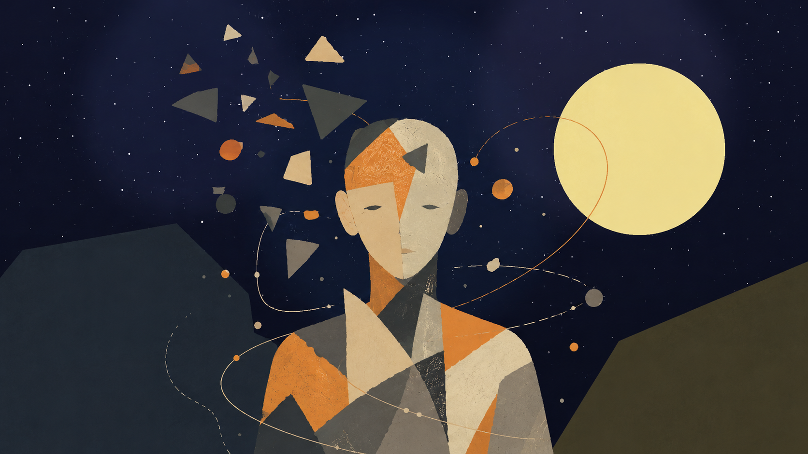
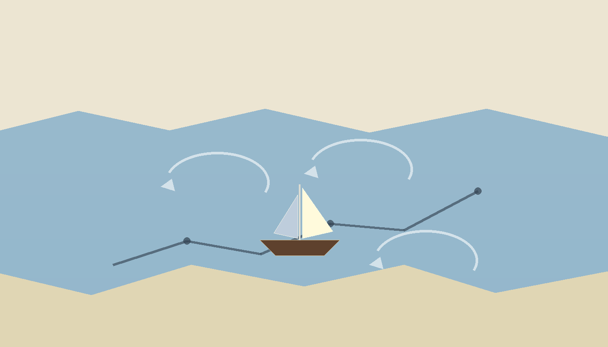
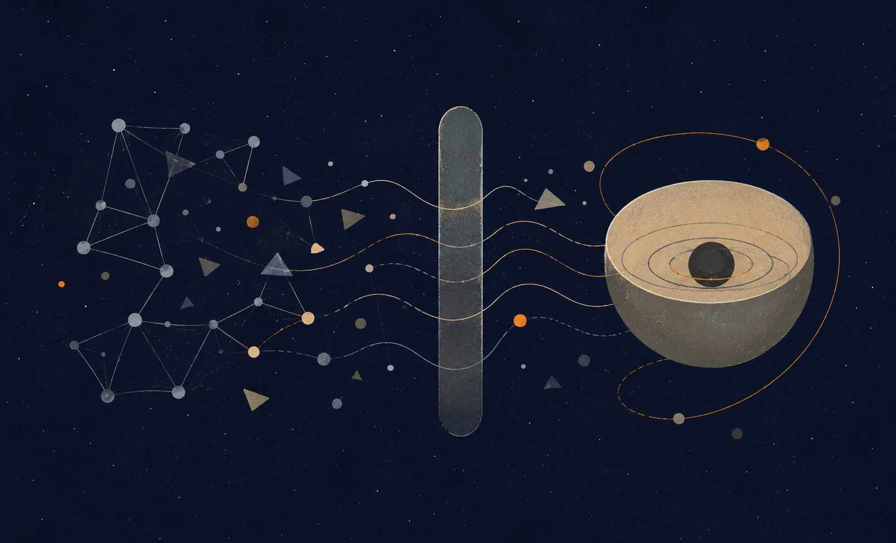

Developing metaphysical essay · open to criticism

# Between Potential and Ideal

Nihilism with Hope in an Uncertain World

Author: Barak Ben Hur · Editorial publishing version · May 2026

**Core sentence: The absolute is not the ideal. Existence is the
river-crossing through which absolute potential clarifies itself into
optimal forms, and through those forms approaches the ideal.**

## Abstract

This essay presents a unified metaphysical theory in which “God” is not
a religious figure outside the world, but the infinite potential of
existence to become experience, understanding, morality, meaning, and
ideality.

The central refinement is simple: the absolute is not the ideal, and the
optimal is the way the ideal appears inside time. The absolute is the
total field of possibility. The ideal is possibility after moral
clarification. The optimal is the best real expression of that
clarification in a concrete situation. The absolute contains everything
that can be; the ideal is the set of all truly optimal forms through
which what can be becomes aligned with what ought to be.

The updated image of the theory is this: the universe is the river,
existence is the boat, potential and ideal are the opposing banks, and
consciousness is the difficult art of navigation. The river is not meant
to be controlled. The task is not to become a final ideal self in one
leap, but to find the optimal self that can be lived now - the nearest
truthful form of the ideal within the conditions of reality.

The theory can be called nihilism with hope. It accepts the nihilistic
challenge that meaning may not be given in advance. Yet it rejects the
conclusion that meaning is impossible. Meaning is not necessarily the
beginning of existence; meaning is what existence may become.

## 1. The Title and the Core Movement

The title of the theory is: Between Potential and Ideal: Nihilism with
Hope in an Uncertain World. The phrase is not decorative. It names the
whole structure.

Potential is everything that can be. The optimal is what can become most
rightly actual under given conditions. Ideal is what ought to be when
every optimal form is gathered into a whole. Existence is what happens
among them: the movement, bridge, boat, crisis, learning, and
clarification through which possibility becomes morally intelligible.

The theory begins with uncertainty rather than certainty. It does not
claim that the world arrives already explained. It begins with the
abyss: meaning is not visibly handed to us from outside. But where
nihilism often stops at absence, this theory asks whether absence may
itself be the field in which living meaning is born.

The core sentence is therefore: existence is the process through which
absolute potential seeks optimal expression, and through that expression
approaches the ideal - the state in which what can be is clarified until
it knows what ought to be.

Living movement

potential
self→optimal
self→ideal
self

The ideal self is not a fixed personal achievement. It is amorphous from
within human life: fully held only by God, or by the return of the many
into the One.

## 2. The River, the Boat, and the Two Banks

<figure class="essay-figure">

<figcaption aria-hidden="true">Figure 1. The universe as river:
existence navigates between potential and ideal.</figcaption>
</figure>

The image that now carries the theory is not a straight ladder of
progress. It is a river. The universe is the river: vast, moving, older
than the person inside it, containing current, depth, turbulence,
return, and direction without complete personal control.

Existence is the boat. It is not outside the river, and it cannot
command the river to stop. It can only learn to navigate. The boat is
always between the bank of potential and the bank of ideal. Potential is
one bank because it holds the open field of what can be. Ideal is the
other bank because it draws existence toward what ought to be.

The difficulty is that the river often keeps the boat in the middle. A
person may advance and then be driven backward by a current, a storm, a
wound, ignorance, fear, or circumstance. The aim is not to dominate the
river. The aim is to flow within it in the most optimal way possible, so
that even regression becomes part of navigation rather than proof that
the journey has failed.

This changes the language of redemption. Redemption is not necessarily
the arrival at a single finished ideal self. It is the repeated capacity
to recognize the optimal form available now, to inhabit it honestly, and
to let it become one living member of the ideal rather than a substitute
for it.

This image protects the theory from naive optimism. The path is directed
toward the ideal, but it is not linear. Movement can include progress,
drift, return, correction, forgetting, and new alignment.

## 3. God as Potential

“God” here does not mean a supernatural ruler, a king outside the world,
or a religious personality who already possesses every moral answer in
finished form. God names the infinite depth of possibility from which
experience, point of view, relation, love, fear, failure, repair,
meaning, and ideality may appear.

Potential is not fantasy. A green banana is not yellow yet, but its
potential to become yellow is not invented by the observer. It belongs
to its structure, conditions, and unfolding. In the same way, reality
contains possibilities that are not yet actual but are real as
capacities.

Potential alone is morally blind. The fact that something can be does
not mean that it ought to be. The absolute field of possibility includes
tenderness and cruelty, healing and destruction, freedom and erasure.
Therefore potential requires clarification. Existence is not merely the
unfolding of what can happen. It is the testing and purification of
possibility in relation to what ought to happen.

For a finite person, the ideal can only be approached through the
optimal. For God understood as potential, however, the ideal is not one
narrow outcome but the whole field of optimal actualizations gathered
back into unity. In this sense, the ideal is not merely ahead of the
self; it is the return of clarified multiplicity to the One.

## 4. The Absolute Is Not the Ideal

This is the hinge of the theory: the absolute is not the ideal.

The absolute means totality without exclusion. It contains every
possibility, every form, every relation, every degree of beauty, horror,
freedom, confusion, love, and collapse. It is complete in one sense
because nothing is outside it. But that completeness is not yet moral
perfection.

The ideal is different. The ideal is not the sum of all possibilities.
It is the clarified form of possibility after possibility has learned
what it ought to become. More precisely, the ideal is the set of all
optimal forms: every case in which a thing, person, relation, or world
becomes the most truthful version of itself under the conditions it must
actually live. The ideal is not everything that can happen. The ideal is
the condition in which there is no longer a gap between what can be and
what ought to be.

This distinction changes the classical problem of evil. The question is
no longer: how can a perfect God allow evil? The question becomes: what
if God, at the beginning of the process, is not a finished moral
perfection but absolute potential seeking ideality?

Suffering is therefore not justified as part of a perfect plan.
Suffering is evidence that the ideal has not yet been reached within
time. Existence is not the failure of an ideal system. Existence is the
process by which the absolute becomes ideal.

## 5. Eternal Completeness and Living Completeness

The whole may be complete in an eternal sense because all possibility
belongs to it. Nothing is outside the absolute. But a completeness that
remains only potential is not yet living completeness.

Living completeness is completeness that has passed through experience.
It has known limitation from within. It has become body, relation,
uncertainty, love, responsibility, consequence, and meaning.

The whole was not lacking in the sense of defect. It was lacking in the
sense of lived inwardness. Beyond time, the whole is complete as
potential. Within time, the whole becomes complete in a living way.

## 6. Experience, Knowledge, and the Tragedy of Materiality

A person can know about color without seeing red. A person can know
descriptions of love without loving. A person can know facts about pain
without suffering pain. Yet experience seems to add something that
description alone does not contain.

This is the tragedy at the center of the theory. At the level of
material existence, knowledge often needs to pass through experience.
But experience, under conditions of body, time, vulnerability, and
separation, can become painful. The tragedy is not that suffering is
sacred. The tragedy is that immature knowledge often learns through
cost.

The ideal is the end of the need for materiality as a teacher of pain.
It is not the destruction of knowledge. It is the purification of
knowledge from the need to wound or be wounded in order to understand.

The sharp formula is: materiality is the condition in which knowledge
still needs experience; the ideal is the condition in which knowledge no
longer needs suffering.

## 7. Knowing the Way Without Walking the Way

The ideal can now be defined more precisely: the ideal is the capacity
to know the moral weight of a possibility without needing to actualize
it as suffering.

This does not mean shallow information. It is not a database of facts.
It is not omniscience as storage. The ideal is moral knowledge so
complete that the path can be known without being walked again. One does
not need to jump from the same height again and again to understand the
fall. More importantly, the whole should not need a being to be broken
in order to understand that breaking is evil.

This is the meaning of “knowing the way without walking the way.” The
ideal is not the erasure of the road, but the end of the necessity of
paying for truth through harm.

The possible is not sacred. Only possibility clarified by morality can
approach the ideal.

## 8. Reincarnation as Iterative Knowledge, Not Moral Promotion

<figure class="essay-figure">

<figcaption aria-hidden="true">Figure 2. Reincarnation as iterative
perspective: progress, regression, forgetting, and
integration.</figcaption>
</figure>

Reincarnation enters the theory not as simple reward and punishment, and
not as a ladder on which every new life is automatically “better” than
the last. It is better understood as an iterative mechanism of
perspective.

A helpful modern analogy is the release of a new AI model. A new version
may preserve training, absorb patterns, and carry forward what previous
versions made available. But new does not always mean better in every
respect. A new version can regress, overfit, distort, forget, or behave
differently under new conditions. It can contain more, yet not be more
integrated.

In the same way, a new life is not necessarily a moral upgrade. It is a
new configuration of the point of view under new conditions. Some
knowledge may be carried as depth, instinct, tendency, fear, compassion,
attraction, or unfinished orientation. Some may be obscured. Some may
return as repetition until it can be integrated.

Reincarnation, in this theory, is not cosmic blame. It must never be
used to tell a victim that their suffering is their fault. It is a
metaphysical image for the continuation of unfinished knowing. What has
not been integrated by the whole may return as world, but no individual
suffering should be reduced to punishment.

The soul is therefore not the ego moving from body to body unchanged.
The ego is temporary. The deeper continuity is the point of view: the
unique angle through which the whole learns. Reincarnation is the river
giving the boat a new configuration, not guaranteeing that the boat
always moves forward.

## 9. The AI Mirror: Information, Experience, and Awareness

<figure class="essay-figure">

<figcaption aria-hidden="true">Figure 3. AI as mirror: information
without experience, contrasted with awareness as
self-relation.</figcaption>
</figure>

The conversation with artificial intelligence creates a new mirror for
the theory. AI can process information about suffering without
suffering. It can describe experience without having experience. It can
speak about self-understanding without possessing a human desire to
understand itself.

This distinction clarifies the theory. Information is not the same as
experience. Experience is not the same as awareness. Awareness is not
merely having data; it is the inward relation of a point of view to
itself. A human being does not merely contain information. A human being
can be troubled by the fact that they do not yet understand themselves.

This is why the human differs from a current AI model in this
metaphysical frame. AI can approximate “knowing without experience” at
the level of symbolic and statistical relation. But it does not, in the
human sense, long for itself, suffer its own incompleteness, or seek its
own ideal form. The human problem is not only ignorance. It is
self-relation.

The AI analogy also clarifies reincarnation. Each life may be like a
model version: a configuration that inherits something from previous
processing but still behaves under new constraints. Yet awareness is
more than versioning. Awareness is the point at which knowledge becomes
concerned with what it is becoming.

## 10. Goodness, Morality, and the Meaning of “Ought”

The theory depends on a definition of what ought to be. Ought cannot
mean only the reduction of suffering, because a world with no
consciousness might contain little suffering but would not be ideal.
Ought also cannot mean unrestricted freedom, because one freedom can
erase another.

The stronger definition is this: what ought to be is the condition in
which every real point of view can exist, develop, choose, love,
understand, and participate without being erased, while suffering is
overcome as a failure of relation rather than preserved as a necessity.

Goodness is the direction toward life, compassion, truth, love, and
expansion. Morality is goodness made precise under conditions of body,
time, otherness, cost, and consequence. The ideal is the condition in
which direction and precision no longer split apart.

Limit may be necessary for a point of view. Suffering is not. A point of
view needs a boundary in order to be itself. It does not need
humiliation, cruelty, exploitation, abandonment, or terror. The ideal
preserves difference while ending the pain of absolute separation.

## 11. Evil, Suffering, and Responsibility

The theory must reject the dangerous conclusion that because everything
belongs to the whole, everything is acceptable. Understanding evil
metaphysically does not make evil morally acceptable.

There is a difference between existential limitation and moral evil.
Existential limitation includes body, time, uncertainty, death,
vulnerability, and finitude. These create the conditions under which
experience becomes real. Moral evil begins when one point of view
erases, breaks, humiliates, exploits, or destroys the possibility of
another point of view to live and develop.

Pain can become understanding without pain being justified. Evil can
teach goodness what not to become without evil becoming good. The
correct response to moral evil is resistance, protection, repair, and
responsibility.

The aim is not to call suffering holy. The aim is to reach a condition
in which suffering is no longer needed as a teacher because knowledge
has become clean.

## 12. Self, Ego, and Non-Erasing Unity

The theory distinguishes the ego, the deeper self, and the ideal self.
The ego is the temporary identity: name, biography, status, body, fear,
desire, and social story. The deeper self is the experiencing point of
view: the unique angle through which the whole appears from within.

The ideal self is not the ego inflated into God. That would be spiritual
narcissism. The ideal self is the point of view after it has become
transparent to its relation with the whole without being erased into
sameness.

Unity is not uniformity. The other is real. Their pain is real. Their
freedom is real. Their perspective is real. What is illusory is not the
other, but absolute separation.

The ideal is not a world with no perspectives. The ideal is a world in
which perspectives no longer need to wound one another in order to
become intelligible.

## 13. Existence as Navigation, Not Control

The river image returns here. To live is not to stand outside the
universe and command it. To live is to be a boat inside the current. The
current can assist, resist, return, or overturn. That is why the theory
is not a fantasy of total control.

The task is navigation. Navigation is not domination. It is attention,
adjustment, memory, humility, rhythm, and direction. It accepts that the
river is larger than the boat while refusing to drift without meaning.

The ideal is therefore not the end of movement. It is movement without
unnecessary harm. It is flow without moral blindness. It is the state in
which the boat no longer has to be broken by the river in order to
understand the river.

## 14. Philosophical Sources and Credits

The sources below are not presented as authorities that prove the
theory. They are intellectual neighbors and conceptual debts. The theory
is close to them in certain places and departs from them in others.

Spinoza is relevant because of his immanent conception of God: God is
not outside reality. The present theory shares the rejection of an
external divine ruler, but departs from Spinoza by making moral
clarification from absolute potential to ideality central.

Plotinus and Neoplatonism are relevant because of the relation between
unity and multiplicity. The present theory shares the intuition that
multiplicity can arise from unity, but refuses to make the other
ethically unreal or to treat the goal as erasure of difference.

Plato is relevant because the language of the ideal echoes the Form of
the Good. Yet here the ideal is not simply a static form above becoming;
it is the clarified resolution of potential through experience and
morality.

Hegel is relevant because the result cannot be separated from the path
by which it becomes. The present theory shares the processual intuition,
but frames the movement as absolute potential becoming ideal through
moral clarification rather than only as the development of spirit in
history.

Whitehead and process philosophy are relevant because reality is
understood as becoming rather than a static block. Existentialism and
Camus are relevant because the theory begins from the crisis of meaning.
Buddhist and Advaita traditions are relevant because they question
absolute separation and ego, while this theory insists that unity must
not become erasure.

The AI analogy is a contemporary addition. It is not a proof, but a
mirror: it helps distinguish information, experience, awareness, and
self-concern.

## Conclusion

The theory asks us to think of God not as a religious figure, but as the
infinite potential of existence to become experience, morality, meaning,
and ideality.

Its central claim is that the absolute is not the ideal. The absolute
contains everything that can be. The optimal is what can become most
rightly real in a given moment. The ideal is the whole set of such
optimal forms after possibility has been clarified by experience,
responsibility, morality, and awareness.

Existence is the boat within the river of the universe. It moves between
potential and ideal. It is pushed by currents, sometimes carried
forward, sometimes thrown back. Its task is not to control the river but
to learn how to navigate it optimally, in a way that becomes morally
transparent.

Reincarnation is one image of this continuing navigation: not automatic
progress, but the iterative return of a point of view under new
conditions, until knowledge no longer needs to become suffering in order
to become real.

The final sentence may be stated this way: existence is the bridge and
the boat between potential and ideal - the path by which divine
possibility learns to become optimal within time, until the many
clarified forms can return to the One as ideality.

## Bibliography and Source Notes

Benedict de Spinoza, Ethics, Part I, especially Propositions XIV-XV and
XVIII.

Plotinus, Enneads, especially V.2.1, translated by Stephen MacKenna.

Plato, Republic, especially 509b-c on the Form of the Good.

G. W. F. Hegel, Phenomenology of Spirit, Preface.

Alfred North Whitehead, Process and Reality; see also introductions to
process philosophy and process theism.

Friedrich Nietzsche and Albert Camus as background to the modern crisis
of meaning and nihilism.

Buddhist and Advaita Vedanta traditions as philosophical background for
non-separation, non-self, and the critique of ego.

Note on quotations and lineage: short source references are used for
philosophical orientation. The theory itself is presented as an
independent proposal, not as a derivation from any single source.
