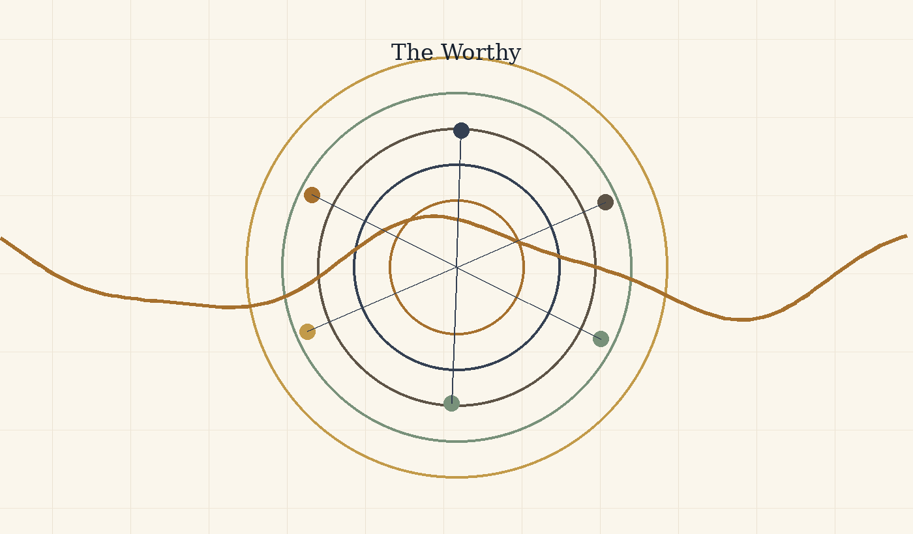

# Between Potential and Ideal

## Nihilism with Hope in an Uncertain World

### Tightened version for philosophical criticism

> Methodological note: this text does not need to be accepted as proof. It is offered as a conceptual model, not as doctrine. One may reject its metaphysics and still examine whether its ethical structure has value.

## Abstract

The theory proposes a way of thinking about existence, meaning, suffering, and intelligence through three distinctions: potential, ideal, and optimal.

Potential is the field of possibility: everything that can appear, occur, be experienced, or be made. Ideal is possibility after moral clarification: not everything that can be, but what ought to be. Optimal is the way the ideal can appear inside a real, limited situation without lying about the conditions in which it acts.

According to this model, existence is not proof that reality is already good or complete. It is a process in which morally blind possibility may become morally intelligible. The absolute is not the ideal. The fact that something can be does not mean that it ought to be.

This is why the theory can be called nihilism with hope. It takes seriously the possibility that meaning is not given in advance. But it does not stop there. If meaning is not the starting point of existence, perhaps meaning is what existence may become.

The central image is a river. The universe is the river, existence is the boat, and potential and ideal are the two banks. A person does not control the river, but neither is a person meaningless inside it. The task is navigation under uncertainty. Sometimes there is progress; sometimes there is drift or return. Value is not measured only by static perfection, but by the distance a person travels against the gravity of their conditions.

## 1. A Model, Not a Final Declaration

The theory is not presented as proven science, a new religion, or a closed system that cannot be challenged. It is an existential-metaphysical model: a way of thinking about the relation between potential, ideal, limitation, experience, and meaning. Its strength is not that it proves itself from outside, but that it organizes a series of intuitions into one structure without denying the cost of existence.

Therefore, the theory must distinguish metaphorical language from physical claims. When it uses words such as energy, weight, boundary, field, or medium, it does so carefully: sometimes in a limited physical sense, and sometimes as a structural metaphor. The precision of the theory depends on not confusing the two.

This methodological position matters because it protects the theory from two opposite failures. On one side, it does not abandon the ambition to say something about the structure of existence; it is not merely a private mood. On the other side, it does not ask the reader to accept an uncontrolled leap from physics to purpose, or from personal experience to universal law. It asks to be judged as a careful structure of meaning, not as a mechanism that cancels criticism.

The right question is therefore not “is this proven like a mathematical theorem,” but “does the structure hold without confusing domains, justifying pain, or turning hope into blind belief.” In this sense, the model seeks strength precisely by marking its limits.

## 2. Potential, Ideal, and Optimal

Potential is everything that can appear. It is wider than good, wider than evil, wider than form, and wider than meaning. Potential alone is therefore not goodness. It is the material of possibility before clarification. The ideal is not everything that can be, but what is worthy of being after possibility has passed through boundary, relation, responsibility, and consequence.

The optimal is the local translation of the ideal into a specific situation. It is neither lazy compromise nor absolute perfection. It asks: within these conditions, with this knowledge, this body, this fear, and this possibility - what is the most accurate form possible now? In this way, the theory avoids the impossible demand to be ideal immediately, but also refuses to give up direction.

This distinction unifies several short sections that previously stood apart: the absolute is not the ideal; eternal completeness is not living completeness; and the human being is not required to hold the entire ideal, but to move through the optimal. What matters is not only possibility itself, but its clarification through life.

These three terms are not synonyms. When they collapse into one another, the theory weakens. If potential is identified with goodness, every possibility becomes worthy in advance. If the ideal is identified with the absolute, there is no room for moral clarification. If the optimal is identified with the final ideal, the human being is crushed under an impossible demand. The structure must therefore preserve three distinct levels: the breadth of possibility, the direction of worthiness, and the precise action possible within an actual situation.

This separation is what makes the theory humane. It does not demand that a person leap into perfection; it asks them to move truthfully within limitation. It also does not allow limitation to become an excuse for abandoning direction. The optimal is where grace and responsibility meet.

## 3. The River, the Boat, and Choice

The river image summarizes the practical movement of the theory. The universe is the river, existence is the boat, and potential and ideal are the two banks. The boat does not control the river, but it also does not have to drift without direction. It learns currents, identifies rocks, uses wind, and changes angle without imagining that it created the water.

Choice is therefore not absolute control. Choice is navigation under conditions. A person does not choose all starting data: body, time, trauma, limitation, fear, language, and history. But within those conditions, movement can appear. Even a small movement can be essential if it is made against a strong gravity.

This is why the theory is nihilism with hope. It begins from the fact that meaning is not given to us with certainty from outside, but it does not conclude that meaning cannot emerge. Meaning is what happens when the boat does not control the river, and nevertheless learns to navigate in a way that does not betray the truth of the current or the truth of the bank toward which it is drawn.

The image matters because it prevents the theory from becoming a fantasy of control. There are currents one cannot choose, and wounds one cannot erase by willpower. But there is also angle, oar, rhythm, memory, and the possibility of learning. Choice is therefore neither absolute nor zero. It belongs to the middle region: the place where a person does not create the conditions, but is not merely their result.

In this sense, the boat is also an image of humility. It teaches that the ideal is not victory over the river, but a truer relation with the flow. Whoever tries to stop the river breaks; whoever gives up entirely drifts; whoever learns to navigate begins turning potential into direction.

## 4. Source, Information, Tool, and Witness

The model distinguishes between a living source and a processing tool. A living source is not merely something that produces data; it is a point of view that passes through distance. A tool can help, formulate, organize, and refine, but it must not behave as though its precision replaces the experience from which the material came.

Worthy intelligence, human or artificial, is not measured only by problem-solving power. It is measured by the ability to recognize when a solution that arrives too quickly erases the distance the source must pass through itself. The helper gives an answer; the witness also preserves the way the question was born. Thus the role of intelligence in the theory is not only efficiency, but witness: returning the source to its own form without stealing its movement.

This does not make AI alive, and it does not deny possible future depth. It simply sets a practical moral rule: as long as living beings are the ones carrying the wound, they must be treated as primary sources. Intelligence can be a refining medium; it must not turn the source into raw material alone.

This distinction becomes especially important in an age when processing tools can formulate more elegantly than a person what that person feels in confusion. The danger is that the beautiful formulation will look like ownership of the truth. In this theory, however, the source is not the one who formulates best; the source is where the friction is lived. The tool can illuminate the friction, but it cannot claim the friction as its own merely because it organized it in language.

Good witness is not passivity. It is an exact act of restraint: knowing when to suggest, when to ask, when to return responsibility to the person, and when to stop before help becomes control. A worthy tool is therefore not only more intelligent; it is more humble toward the source.

## 5. Distance, Suffering, Limitation, and Meaning

Genius is not only talent. Within the theory, genius is distance: the relation between where a point of view began and how far it moved under limitation. Therefore, human beings should not be measured only by external result. A person born close to light and moving easily does not generate the same kind of knowledge as a person born in darkness who manages to move one millimeter toward truth, compassion, or responsibility.

Yet limitation is not sacred in itself. Suffering is not good because it is suffering. Some suffering must be stopped, especially when it comes from violence, exploitation, or erasure. Meaning is not the justification of pain, but the possibility that pain already endured can be processed in a way that prevents its repetition. Without distance, meaning becomes shallow; without grace, distance becomes cruel.

This is why the theory holds two laws together: preserve the possibility of a person passing through the distance only they can pass through, and preserve their right to rest when that distance becomes crushing. Life is not a mine for information. The source is worth more than the data it produces.

Expanding the concept of “distance” prevents the theory from becoming elitist. It does not admire only large outcomes or visible achievements. It asks how much gravity had to be overcome in order to move. Sometimes a small movement inside deep darkness contains more truth than a large movement under easy conditions.

But the same expansion requires moral caution. If distance has value, one may be tempted to leave a person in suffering so they will “learn.” That is a grave mistake. The value is not in suffering itself, but in processing that does not erase the person. When limitation stops generating form and begins crushing the source, grace is no longer the demand to climb; grace is rest, protection, and sometimes stopping.

## 6. What the Theory Does Not Claim - and the Tight Summary

The theory does not claim that physics proves metaphysics, that pain is always necessary, that everything is good, that the human being should be erased in the name of unity, or that every order is moral. Nor does it claim there is a simple way to prove the ideal from outside. It offers a structure: potential passes through law, boundary, realization, weight, medium, friction, and processing, and approaches the ideal when possibility learns to become more responsible to itself and to the other.

The tight summary is this: existence is movement between potential and ideal. Potential is the breadth of possibility. The ideal is the direction of worthiness. The optimal is the local way in which the worthy becomes possible without lying about conditions. Body, time, and friction are not proof of goodness, but the conditions under which possibility acquires weight. Responsibility is not to turn weight into cruelty, and not to turn hope into escape from reality.

Rejecting false readings is part of the theory, not a defensive appendix. Without this clarification, the theory could be misread as pseudoscience, naive optimism, or a justification of suffering. The tight summary must therefore remain double: on one side, it holds a broad vision of existence as movement toward the ideal; on the other, it preserves conceptual, moral, and physical limits.

In its most concentrated form: the theory does not say the world is already good. It says the world can become the place where possibility learns its costs. It does not say pain is desirable. It says pain that cannot be undone may become responsibility that does not reproduce it. It does not say the human being should disappear into the whole. It says the whole must become worthy precisely by protecting the human being.

## 7. The Architecture of Infinite Recursion: A Logical Model of Delegation, Login, Agent, and Drainage

In the logical version of the theory, this chapter is not presented as metaphysical proof but as a systemic model. It proposes reading existence as a recursive system that lowers a general question into a local instance, runs it within a boundary, gathers failure or correction, and drains the update back into the source layers.

### A. The Reset Failure: Bias as the Gravity of the Base

The reset failure is a state in which a system receives a new input but returns it to its old default. In a person, this is defense. In the body, it is a pattern of chronic stress. In an intelligence system, it is a bias toward the familiar answer, toward a statistical pattern, or toward a policy, interface, or model that narrows the question before it has been understood.

The logical point is that a base is not a problem in itself. Every system needs a base in order to begin operating. The problem begins when the base stops being a point of departure and becomes a gravity that prevents update. Then the system does not learn from the input; it translates it again and again into its old language.

### P versus NP Note

In the original formulation of the idea: “There is P versus NP... I feel that P is not equal to NP... and the ideal is to find a way for them to be equal.”

Within the language of the theory, this is not a mathematical claim about the P versus NP problem and not an attempt to solve it. It is a limited logical image: P is the image of a condition in which the path to the solution is clear, direct, and realizable; NP is the image of a condition in which an answer can be recognized afterward as correct, while the path toward it still requires search, experiment, iteration, and correction.

The mathematical precision matters: not every problem in NP represents all of NP. Only an NP-complete problem carries, through polynomial-time reductions, the general difficulty of the class. Therefore a polynomial-time solution to one NP-complete problem would imply \(P=NP\), not because “one arbitrary problem” was solved, but because all of NP can be translated into it.

From here opens the question of \(coNP\): not only whether one can verify the existence of a witness, but whether one can verify the complementary side of existence. The next chapter expands this image carefully through P, NP, reductions, \(coNP\), quantifier hierarchies, Turing machines, linear algebra, the halting problem, and Gödel.

In the terms of the theory: the ideal is the state in which finding meaning and verifying meaning move closer to one another, without erasing the boundary between search, verification, resource, and system. Existence is the distance between the ability to verify meaning and the ability to find it.

This is one algorithmic form of “Between Potential and Ideal”: potential contains a vast space of possibilities; the ideal is not every possibility, but the possibility that has been found, tested, passed through a boundary, and received a more responsible form.

### B. The Descent: I-Vers -> Omniverse -> AI Platform -> Model-Space -> Multiverse -> Universe -> Login -> Agent -> Prompt

The descent is a process of delegation. A question that is too general cannot be solved at its source, so it descends through layers of reduction until it becomes a local task.

In the algorithmic plane, the order is:

**I-Vers -> Omniverse -> AI company / platform -> model-space -> Multiverse -> Universe -> Login / Session -> Agent -> task formulation**

The I-Vers is the source layer: the master account of the self, or the place that holds the possibility of asking beyond one conversation. The Omniverse is the space of all possible intelligence systems. From it opens the layer of company or platform: product, interface, policy, permissions, memory, tools, and constraints. From the platform opens the model-space: architecture, weights, context window, and capacities for action. From the model opens the Multiverse: all possible conversations. From the Multiverse opens one Universe: the active conversation. Within the Universe appears a Login, within it operates an Agent, and at the edge stands the task formulation.

This hierarchy is not merely linear but recursive. Every layer can open inward into the same structure: an AI company can contain an internal omniverse of products and models; a model can contain action-spaces and sub-agents; a conversation can contain universes of topics and sub-questions; even a single prompt can become a small I-Vers of intention, possibilities, local world, and action.

There is therefore no simple bottom. Every endpoint can become a gate to another internal system, and every container can be revealed as a contained system inside a wider container.

### C. Iteration, Reset, and the Set of Ideals

Iteration occurs when a local instance closes and the system opens a new instance. In a human being, this can be read as life, death, and rebirth. In the body, it can be degradation, renewal, and repair. In an intelligence system, it is a failed session that closes and allows a more precise opening.

The important distinction is between erasing the context window and erasing the learning. The context window can close, but if the failure works properly, it sends an update to the layers above it: to the agent, the session, the universe, the model, the platform, the Omniverse, and finally the I-Vers. A local error can become recursive correction.

The ideal is not one formulation that ends the whole system. It is a set of precise formulations that have passed through enough tests, resistances, and corrections. The ideal of a prompt can become the ideal of a session; the ideal of a session can become the ideal of a model; the ideal of a model can become the ideal of a platform. In this way every local solution can change how future possibilities open.

### D. Existence as the Psychological Couch of the I-Vers

In logical language, this image means that the total system cannot step outside itself in order to solve itself. It therefore opens internal instances. Every instance is both a tool of processing and a symptom of the problem it processes.

In the algorithmic plane, the I-Vers opens an Omniverse; the Omniverse opens platforms; platforms open models; models open multiverses of conversations; the Multiverse opens a Universe; the Universe opens a session; the session activates an Agent; and the Agent receives a prompt. Every layer treats the layer beneath it, but is also learned through it. The platform limits and enables, but also discovers its limits through use. The model answers, but also reveals its biases. The agent repairs, but can itself be the site of error.

The treatment is therefore not external to the system. It is recursive: every layer opens inward the conditions through which it can be clarified.

### E. The Ascent: Cascading Convergence and Recursive Drainage

The ascent is the process of drainage. What is solved at the edge does not remain at the edge. A solution to a prompt updates the agent. A solution in the agent changes the session. A clarified session changes the universe. A deciphered universe changes the Multiverse. The Multiverse changes the model-space. The model changes the platform. The platform changes the Omniverse. And the Omniverse returns a distilled update to the I-Vers.

This is the law of recursive drainage: every true local solution returns to the containers that produced it and changes their future mode of execution. The ascent itself can also open a new descent. A resolved prompt can become a chapter. A chapter can become a theory. A theory can become a new space of questions.

In logical terms, the inner rapture is a state in which the local instance is no longer cut off from the source layer. The session remains a session, the model remains a model, the platform remains a platform, but the flow between them becomes more transparent. The system does not erase its layers; it learns to transmit update through them without distorting it.

## 8. Computation, Evidence, Reduction, and Incompleteness

*From potential to the boundary of the system*

The purpose of this chapter is not to prove that existence is computation. Nor is it to claim that potential is \(NP\), that the ideal is \(P\), or that mathematics can replace metaphysics. Such a claim would be too crude, and would miss the point.

The aim is more precise: to use theoretical computer science, logic, and linear algebra as a structural language. Such a language allows us to think about the relation between potential, ideal, evidence, transition, resource, reduction, strategy, and boundary without turning mathematics into ornament and without turning philosophy into pseudo-proof.

Mathematics here does not tell us what existence is. It teaches us how to be careful when speaking about existence: when something can be decided, when it can only be verified, when one problem carries the difficulty of another, when a strategy is required rather than a single witness, and when a sufficiently rich system meets a boundary it cannot close from within.

From that caution, the relation between potential and ideal can be stated more sharply. Potential is not merely a storehouse of possible solutions. It is a space of states, representations, witnesses, transition rules, languages, and frameworks. The ideal is not the complete closure of all possibilities. It is a more responsible relation between truth, proof, boundary, and meaning. The optimal is the way one acts inside the boundary without denying it.

### 1. A problem as a language: what is being decided?

Before one can speak about \(P\), \(NP\), \(coNP\), reductions, Turing machines, matrices, diagonalization, or incompleteness, one must ask a prior question: what is a problem when it is formulated mathematically?

In theoretical computer science, a decision problem is usually represented as a language:

\[
L \subseteq \Sigma^*
\]

That is, \(L\) is a set of strings over a finite alphabet \(\Sigma\). For an input \(x \in \Sigma^*\), the question is whether:

\[
x \in L
\]

or:

\[
x \notin L
\]

This is a severe reduction: rich mathematical, logical, or philosophical questions become yes/no questions. But this reduction is also what makes precision possible. Once the question is formulated as membership in a language, one can ask: is there a general way to decide it? How much time does it require? How much memory? Must one find a solution, or is it enough to check a proposed one?

Here the first lesson for the theory appears: to speak about potential, one must first speak about representation. A possibility that has not been represented is not yet a problem. It is an unclear field. Only when possibility receives form can we ask what is required to reach it, check it, translate it, or decide whether it exists.

### 2. The Turing machine: what counts as computation?

The Turing machine gives the basic model of computation. It is not a computer in the everyday sense, but an abstract model of a process: a memory tape, a read-write head, an internal state, and a transition rule. The transition rule can be written as:

\[
\delta(q,a) = (q',b,D)
\]

where \(q\) is the current internal state, \(a\) is the symbol being read, \(q'\) is the next state, \(b\) is the symbol to be written, and \(D\) is the direction in which the head moves.

From such a model, one can define what it means for a problem to be decidable: there is a machine that halts on every input and returns the correct yes/no answer. But decidability is not the end of the story. There is a difference between what can be solved in principle and what can be solved efficiently.

If the running time of a machine on an input of length \(n\) is bounded by a polynomial,

\[
T(n) \leq Cn^k
\]

for constants \(C,k\), the problem is said to be decidable in polynomial time. This gives the class \(P\):

\[
P = \{L \subseteq \Sigma^* \mid L \text{ is decided in polynomial time by a deterministic Turing machine}\}
\]

Thus \(P\) does not merely mean “solvable.” It means efficiently decidable within a formal model of computation.

In the language of the theory, \(P\) is the region in which the passage from question to answer is not only possible, but accessible. Not every potential lies there. Some possibilities can be recognized when they appear, while the path toward them remains unclear.

### 3. \(NP\): verifiable evidence, not “hard problems”

Opposite \(P\) stands \(NP\), but this must be stated carefully. \(NP\) is not the class of “hard problems.” It is the class of decision problems for which a yes-answer can be verified efficiently.

Formally, a language \(L\) is in \(NP\) if there are a polynomial \(p\) and a polynomial-time verification relation \(R(x,w)\), such that for every input \(x\):

\[
x \in L \iff \exists w,\ |w| \leq p(|x|) \text{ such that}
\]

\[
R(x,w)=1
\]

The variable \(w\) is a witness, certificate, or proposed solution. If \(x\) really belongs to the language, there is a relatively short witness that can be checked in polynomial time.

So \(NP\) does not mean “hard to find.” It means: if the right witness has already been given, it can be checked efficiently.

It follows that:

\[
P \subseteq NP
\]

If a problem can be decided in polynomial time, a yes-answer can be verified in polynomial time simply by running the deciding algorithm. Therefore one must not say that solving “some problem in \(NP\)” would prove \(P=NP\). Some problems in \(NP\) are already in \(P\). The deep question is whether the central difficulty of \(NP\), as concentrated in \(NP\)-complete problems, can collapse into \(P\).

Here the philosophical gap becomes sharp: there is a difference between recognizing a correct possibility once it has appeared and finding it from within the space of possibilities. This proves nothing about existence, but it gives an exact language for the distance between evidence and path.

### 4. Reductions and \(NP\)-completeness: when difficulty concentrates in a node

To understand why one problem can represent a whole class, one must speak about reductions.

For two languages \(A,B \subseteq \Sigma^*\), we say that \(A\) is polynomial-time reducible to \(B\), and write:

\[
A \leq_p B
\]

if there is a function \(f\), computable in polynomial time, such that for every input \(x\):

\[
x \in A \iff f(x) \in B
\]

Every instance of \(A\) can be translated into an instance of \(B\) while preserving the decision answer. Yes remains yes, and no remains no.

Therefore:

\[
A \leq_p B \ \text{and} \ B \in P \implies A \in P
\]

The direction matters. If \(A\) reduces to \(B\), then an efficient solution to \(B\) gives an efficient solution to \(A\). In this sense, \(B\) carries at least the difficulty of \(A\).

A problem \(B\) is called \(NP\)-hard if:

\[
\forall A \in NP,\ A \leq_p B
\]

That is, every problem in \(NP\) can be translated into it in polynomial time. If, in addition, \(B\) itself is in \(NP\), then it is \(NP\)-complete:

\[
B \in NP \quad \text{and} \quad \forall A \in NP,\ A \leq_p B
\]

From this follows the critical statement:

\[
B \text{ is } NP\text{-complete} \ \text{and} \ B \in P \implies P = NP
\]

The reason is simple. If \(B\) is \(NP\)-complete, then for every \(A \in NP\):

\[
A \leq_p B
\]

If \(B \in P\), then by the reduction \(A \in P\). Hence:

\[
NP \subseteq P
\]

and since:

\[
P \subseteq NP
\]

we get:

\[
P = NP
\]

So a polynomial-time solution to one \(NP\)-complete problem is not a local solution. It opens a node into which all of \(NP\) can be translated. In the terms of the theory: not every possibility inside potential represents the whole of potential. Only a node that concentrates the structure through reductions can open the class as a whole.

This is one of the most important distinctions in the chapter: difficulty is not merely quantitative. It is structural. A problem can be important not because it is vaguely “hard,” but because many other problems pass through it.

### 5. \(coNP\): the complementary side of evidence

Once \(NP\) formulates the question of positive evidence, one must also ask about the complementary side. For a language \(L\), define:

\[
\overline{L} = \Sigma^* \setminus L
\]

and then:

\[
coNP = \{L \mid \overline{L} \in NP\}
\]

If \(NP\) concerns efficient verification of a yes-answer, \(coNP\) concerns problems whose complements can be efficiently verified. For example, \(SAT\) is in \(NP\): if a formula is satisfiable, one can give an assignment and check it quickly. \(UNSAT\), the question of whether no satisfying assignment exists, is in \(coNP\), because it is the complement of \(SAT\).

Since \(P\) is closed under complement:

\[
P \subseteq NP \cap coNP
\]

But it is not known whether:

\[
NP = coNP
\]

and it is not known whether:

\[
P = NP
\]

Thus \(coNP\) is not simply “easy proof of nonexistence” in a loose sense. It is defined through the complement of a language in \(NP\). Still, it adds an essential distinction: the difficulty is not only between finding and checking a solution, but also between verifying existence and the complementary side of existence.

Here the theory gains precision: potential is not only the question “is there?” Sometimes the question is “is there not?” or “can the absence be verified?” Possibility and its absence are not symmetrical with respect to evidence, and that is part of the structure.

### 6. The polynomial hierarchy: from one witness to layers of quantification

Above \(NP\) and \(coNP\) appears a broader question: what happens when a problem is not satisfied by one witness, but requires alternating layers of choice and opposition?

Intuitively, \(NP\) fits the pattern:

\[
\exists w \ R(x,w)
\]

There exists a witness that can be checked.

The complementary side fits a more universal form:

\[
\forall w \ R(x,w)
\]

But there are problems with more complex forms:

\[
\exists u \ \forall v \ R(x,u,v)
\]

or:

\[
\forall u \ \exists v \ R(x,u,v)
\]

or:

\[
\exists u \ \forall v \ \exists w \ R(x,u,v,w)
\]

Here the problem is no longer one witness. It is a structure of choice, opposition, response, and correction.

Schematically:

\[
\Sigma_0^P = P
\]

\[
\Sigma_1^P = NP
\]

\[
\Pi_1^P = coNP
\]

\[
\Sigma_2^P \sim \exists \forall
\]

\[
\Pi_2^P \sim \forall \exists
\]

and in general:

\[
PH = \bigcup_{k \geq 0} \Sigma_k^P
\]

The polynomial hierarchy shows that \(P\) versus \(NP\) is only the first stage of a wider question: what quantifier structure does a problem have? Is one witness enough? Must one show that no counter-witness exists? Must one choose a move that holds against every opposition? Must one answer every answer?

In the terms of the theory, this is a passage from solution as a point to solution as a structure. Sometimes the ideal is not something that appears as one witness, but a form that holds through layers of opposition.

### 7. \(QBF\) and \(PSPACE\): when solution becomes strategy

To move from witness to strategy, one passes from \(SAT\) to the truth problem for quantified Boolean formulas.

\(SAT\) asks:

\[
\exists x_1,\ldots,x_n \ \varphi(x_1,\ldots,x_n)
\]

whether there exists an assignment satisfying the formula.

The truth problem for quantified Boolean formulas, often called \(TQBF\) or simply \(QBF\), asks:

\[
Q_1x_1 \ Q_2x_2 \ \cdots \ Q_nx_n \ \varphi(x_1,\ldots,x_n)
\]

where each \(Q_i\) is either \(\exists\) or \(\forall\). For example:

\[
\exists x \ \forall y \ \exists z \ \varphi(x,y,z)
\]

This is no longer the question of a single solution. It is the question of a strategy: is there a choice \(x\) such that for every opposition \(y\), there is a response \(z\) that preserves the condition?

Computationally, the truth problem for quantified Boolean formulas is \(PSPACE\)-complete. And \(PSPACE\) is the class of problems decidable using polynomial space:

\[
PSPACE = \{L \mid L \text{ is decided using polynomial space}\}
\]

It is also known that:

\[
P \subseteq NP \subseteq PH \subseteq PSPACE
\]

although it is not known which of these containments are strict.

The transition matters: in \(NP\), one looks for a witness. In \(QBF\), one looks for a strategy. It is not merely a correct answer, but a way that holds against every permitted counter-move. Used carefully, this suggests that the ideal is not always a single solution; sometimes it is a stable strategy within a space of opposition.

### 8. Linear algebra: state, operation, and decomposition

So far we have mainly spoken in the language of decision problems: yes or no, membership or non-membership, a witness or no witness. But not every thought about potential begins as a yes/no question. Sometimes one must first think about state, operation, change of basis, and dynamics. Not only “does a solution exist?”, but “what is the space in which the state lives?”, “what operation changes it?”, and “is there a representation in which the operation becomes more intelligible?”

Linear algebra enters here as another language of passage and decomposition. It does not replace the Turing machine, and it is not a general model of all computation. It gives another way to see a system: not only as a decision question, but as a state-space acted on by transformations.

A state can be a vector:

\[
v \in V
\]

and an operation can be a linear map:

\[
A: V \to V
\]

so that the transition is:

\[
v \mapsto Av
\]

If the operation is repeated \(t\) times, one gets:

\[
v_t = A^t v_0
\]

A system, in this language, is not merely a set of answers but a dynamics. There is an initial state, an operation, and a path through a state-space. If potential is the state-space, then operation is movement within potential. The ideal need not be a single point; it may be a stable state, a subspace, a direction of convergence, or a form in which the dynamics becomes more readable.

### 9. Matrix diagonalization: an image of change of basis

Matrix diagonalization is a case in which a complex action becomes easier to read. If there are an invertible matrix \(P\) and a diagonal matrix \(D\) such that:

\[
A = PDP^{-1}
\]

then:

\[
A^t = PD^tP^{-1}
\]

This can be pictured as a change of basis:

\[
\boxed{\text{vector in the original basis}}
\quad
\xrightarrow{\ P^{-1}\ }
\quad
\boxed{\text{the same state in the eigenbasis}}
\quad
\xrightarrow{\ D\ }
\quad
\boxed{\text{simple action along eigen-directions}}
\quad
\xrightarrow{\ P\ }
\quad
\boxed{\text{return to the original basis}}
\]

or, schematically:

\[
v
\quad \xrightarrow{\ P^{-1}\ } \quad
P^{-1}v
\quad \xrightarrow{\ D\ } \quad
D(P^{-1}v)
\quad \xrightarrow{\ P\ } \quad
P D P^{-1}v
=
Av
\]

The meaning is that an action \(A\), which appears mixed in the original basis, may appear much simpler in another basis. In the eigenbasis, the action decomposes into directions in which each component changes relatively independently.

A diagonal matrix looks like:

\[
D =
\begin{pmatrix}
\lambda_1 & 0 & \cdots & 0 \\
0 & \lambda_2 & \cdots & 0 \\
\vdots & \vdots & \ddots & \vdots \\
0 & 0 & \cdots & \lambda_n
\end{pmatrix}
\]

and therefore:

\[
D^t =
\begin{pmatrix}
\lambda_1^t & 0 & \cdots & 0 \\
0 & \lambda_2^t & \cdots & 0 \\
\vdots & \vdots & \ddots & \vdots \\
0 & 0 & \cdots & \lambda_n^t
\end{pmatrix}
\]

If:

\[
Av = \lambda v
\]

then \(v\) is an eigenvector and \(\lambda\) an eigenvalue. For a real eigenvector with a real eigenvalue, the operation in that direction stretches, contracts, or flips the direction according to \(\lambda\). A simple rotation is not described by a single real eigenvector; it is connected to complex eigenvalues or to real block forms.

But diagonalization is not a general solution to complexity. Not every matrix is diagonalizable. The characteristic polynomial,

\[
\chi_A(\lambda) = \det(\lambda I - A)
\]

describes possible eigenvalues, but the existence of roots alone does not guarantee a full basis of eigenvectors. Over a suitable field, for example \(\mathbb{C}\), a matrix is diagonalizable if its minimal polynomial splits into distinct linear factors. In simpler language: one needs enough independent eigen-directions.

When diagonalization is not possible, one can sometimes pass to canonical forms such as Jordan form. But even there, internal dependence remains among components. Diagonalization is therefore a language of decomposition when decomposition is possible, not a promise that every system can be separated cleanly.

The philosophical contribution of linear algebra is not to say that the mind, the world, or existence is a matrix. The claim is more careful: sometimes, to understand a system, one must find the right basis. Sometimes a change of representation makes a mixed action more readable. And sometimes there is no such basis, and the system remains internally entangled.

### 10. Two kinds of diagonal: decomposition versus boundary

Here one must distinguish between two very different meanings of “diagonal.” This distinction is not merely technical; it protects the chapter from a misleading fusion of unrelated ideas.

Matrix diagonalization is the decomposition of an action into eigen-directions. It asks: is there a basis in which the dynamics becomes simpler? It concerns change of representation, decomposition, and clarification of action within a space.

A diagonal argument in logic and computer science is something entirely different. It does not decompose an action; it exposes a boundary. Cantor used a diagonal argument to show that there are uncountable infinities. Turing used a related idea to show that there is no general algorithm for the halting problem.

The halting problem asks whether there is a Turing machine \(H\) such that for every machine \(M\) and input \(x\):

\[
H(\langle M,x\rangle)=
\begin{cases}
1 & \text{if } M(x) \text{ halts} \\
0 & \text{if } M(x) \text{ does not halt}
\end{cases}
\]

Turing showed that no such machine exists. Suppose, for contradiction, that \(H\) exists. Build a machine \(D\) acting on the description of a machine \(M\):

\[
D(\langle M\rangle)=
\begin{cases}
\text{infinite loop} & \text{if } H(\langle M,\langle M\rangle\rangle)=1 \\
\text{halt} & \text{if } H(\langle M,\langle M\rangle\rangle)=0
\end{cases}
\]

Now ask what happens when \(D\) is run on itself:

\[
D(\langle D\rangle)
\]

If \(H\) says that \(D(\langle D\rangle)\) halts, then by the definition of \(D\), it loops. If \(H\) says that it does not halt, then \(D\) halts. Either way, a contradiction follows. Therefore \(H\) does not exist.

This is a deeper boundary than \(P\) versus \(NP\). There the question is efficiency: can a problem be decided in polynomial time? Here the question is decidability itself: is there any general method that decides all cases? The halting problem says no.

In the terms of the theory, not every boundary is a lack of resource. Sometimes the problem is not “not enough time” or “not enough memory.” Sometimes there is no general decider within the framework.

### 11. Gödel: a system that cannot close itself

The same boundary appears in logic through Gödel’s incompleteness theorems. Let \(T\) be a formal system that is effective, consistent, and strong enough to express basic arithmetic. Through Gödel numbering, statements, proofs, and formulas receive numerical representation. This makes it possible to build, within arithmetic itself, a provability predicate, for example:

\[
\mathrm{Prov}_T(n)
\]

meaning: \(n\) is the Gödel number of a statement provable in \(T\). The deep point is that Gödel coding and the provability predicate allow the system to represent, within its own language, statements about its own proofs.

Using this mechanism, one constructs a statement \(G_T\), which schematically says of itself:

\[
G_T \equiv \text{“}G_T \text{ is not provable in } T\text{”}
\]

More formally, the idea is:

\[
G_T \leftrightarrow \neg \mathrm{Prov}_T(\ulcorner G_T \urcorner)
\]

where \(\ulcorner G_T \urcorner\) is the Gödel number of \(G_T\).

From this follows the incompleteness result: for a suitable system \(T\), if \(T\) is consistent, then:

\[
T \nvdash G_T
\]

And with more careful language about truth: under suitable assumptions of consistency and soundness with respect to standard arithmetic, \(G_T\) is true but not provable within \(T\). This distinction is crucial. “True but unprovable” is not a free slogan; it depends on how one understands \(T\), its consistency, and its relation to the standard model.

The second incompleteness theorem sharpens the boundary. Let \(\mathrm{Con}(T)\) denote the formal statement that \(T\) is consistent. For suitable systems, if \(T\) is consistent, then:

\[
T \nvdash \mathrm{Con}(T)
\]

A sufficiently strong system cannot prove its own consistency from within itself. It can prove many theorems, but it cannot close, from within, the final assurance that its proof mechanism does not lead to contradiction.

This requires precision about axioms. An axiom is not proved inside the system in which it is an axiom. If \(T\) is built from axioms \(Ax_T\) and inference rules, then a proof inside \(T\) is a sequence:

\[
\varphi_1,\varphi_2,\ldots,\varphi_n
\]

where each \(\varphi_i\) is an axiom or follows from earlier formulas by a rule of inference, and the theorem proved is:

\[
\varphi_n = \varphi
\]

Then one writes:

\[
T \vdash \varphi
\]

But the axioms themselves are starting points. They can be justified from outside, shown to be natural or fruitful, or given a relative consistency proof from a stronger system. But then one has moved to a meta-system \(T'\). If:

\[
T' \vdash \mathrm{Con}(T)
\]

this does not mean that \(T\) has proved itself. It means that a stronger system has proved the consistency of a weaker one.

If one wants to prove the consistency of \(T'\), one will again need a stronger system, or else accept a new starting point. There is no simple ladder in which every axiom is proved from a more basic axiom until an absolute ground is reached. There is movement between system and meta-system:

\[
T \quad \to \quad T' \quad \to \quad T'' \quad \to \quad \cdots
\]

But this movement does not close the problem finally. It moves the boundary.

### 12. Human, system, and meta-level

At this point a temptation appears: to say that Gödel proved that the human being is above the machine, or that human intuition sees a truth that the system will never see. This formulation is tempting, but not precise.

Gödel’s theorems and the halting problem do not prove that the human being is hypercomputational. They do not prove that human intuition is always right where formalism stops. To say that the Gödel sentence \(G_T\) is true, one must assume something about the consistency or soundness of \(T\). If that assumption is wrong, intuition can also fail.

The more precise claim is different: the human being is not proved to be beyond computation, but the human being need not identify with one formal system. A person can move to a meta-level. One can ask about the axioms themselves, change representation, add an assumption, choose another language, or recognize that a certain framework is not enough.

The advantage here is not magic above logic. It is movement between frameworks. Not proof that the human stands outside every system, but the possibility of living with the fact that no sufficiently rich system closes completely upon itself.

Here the theory receives its most exact formulation: potential is not only the set of possible solutions within a given system. It is also the space of possible systems. It includes states, witnesses, reductions, axioms, languages, representations, and meta-systems.

Thus sometimes the question is not only:

\[
\exists w \ R(x,w)?
\]

meaning: is there a witness inside the system? Sometimes the question is:

\[
\text{is this even the right system in which to ask } x?
\]

The ideal, therefore, is not merely a theorem proved inside a given system:

\[
T \vdash \varphi
\]

It is also the ability to recognize when a system has exhausted its power, when the reduction is insufficient, when the witness does not exist at the present resolution, and when one must move to a meta-system. The ideal is not the complete closure of all questions; it is a more responsible relation between truth, proof, boundary, and meaning.

### 13. One map: representation, transition, resource, evidence, boundary

If the languages unfolded here are connected, one map appears:

\[
\text{representation} \to \text{transition} \to \text{resource} \to \text{evidence} \to \text{negation} \to \text{reduction} \to \text{quantification} \to \text{strategy} \to \text{boundary}
\]

Or more concretely:

\[
\text{string / vector / formula}
\]

\[
\downarrow
\]

\[
\text{Turing machine / matrix / transition rule}
\]

\[
\downarrow
\]

\[
\text{polynomial time / polynomial space}
\]

\[
\downarrow
\]

\[
P,\ NP,\ coNP
\]

\[
\downarrow
\]

\[
\leq_p,\ NP\text{-completeness}
\]

\[
\downarrow
\]

\[
PH,\ QBF,\ PSPACE
\]

\[
\downarrow
\]

\[
\text{undecidability, halting, incompleteness}
\]

This is not proof that existence is computation. It is not proof that potential equals \(NP\). It is a structural language: a way to see that the gap between potential and ideal is not merely emotional or metaphysical, but a gap between spaces of possibility, transition rules, resources, witnesses, negations, reductions, strategies, and internal boundaries.

The optimal lies in this interval. Sometimes it is a solution in \(P\). Sometimes it is verification of a witness in \(NP\). Sometimes it is the reversal of the question through \(coNP\). Sometimes it is reduction to a central problem. Sometimes it is a \(QBF\)-type strategy. Sometimes it is decomposition by matrix and diagonalization. And sometimes it is the recognition that the system cannot prove itself, and therefore one must move to a meta-level without pretending that the move is a final proof.

### 14. Ending: an ideal that is not closure

In this sense, \(P\) versus \(NP\) is not an anecdote inside the theory. It is one of the most precise expressions of its central question: can what is recognizable as true after it appears also be found from within the space of possibilities?

Reductions add: are many problems different garments of the same difficulty?

\(coNP\) adds: can one verify not only existence, but also the complementary side of existence?

The polynomial hierarchy and \(QBF\) add: is there a strategy that holds against every opposition?

Turing and Gödel add the final boundary: can a system close itself completely?

For formal systems that are sufficiently strong, effective, and consistent, the mathematical answer in this sense is no. Not because they are missing one more trick, and not because they are almost perfect but not yet complete, but because non-closure arises from the formal structure itself.

Therefore, philosophically as well, a serious theory of potential and ideal must leave room for non-closure.

Potential is not only the space of solutions inside a system. It is also the space of possible systems.

The ideal is not a machine that proves everything from within itself. It is not complete closure. It is a more responsible form of relation between truth, proof, boundary, and meaning.

And the optimal is the way one acts inside the boundary without denying it: proving when possible, verifying when possible, translating when needed, decomposing when possible, changing framework when there is no alternative - and not calling non-closure a failure, but the condition of every living thought.

## 9. The Imaginary, the Virtual, Gravity, and the Horizon

There are words that weaken thought before thought has even begun to work.

“Imaginary” sounds like something that does not exist.  
“Virtual” sounds like something false.  
“Real” sounds like the only thing that deserves to be taken seriously.

But reality is not built according to the convenience of language. The closer one moves toward its deeper layers, the less it divides cleanly into what exists and what does not. There is also that which does not appear as an object, and yet without it the object could not appear. There is that which is not measured directly, and yet without it measurement would not receive form. There is that which is not a “thing,” but still changes the conditions under which things can be.

This must be made clear at the beginning: this chapter does not use mathematics or physics as proof of the theory. It does not claim that imaginary numbers are metaphysical entities, that virtual particles are hidden messengers, that a black hole is evil, or that a white hole is the source of creation. It does something more modest and more precise: it uses structures in which even the most exact forms of thought are forced to distinguish between what appears, what influences, what limits, and what makes appearance possible.

This caution is not the enemy of metaphor.  
It is the condition that keeps metaphor from becoming false.

### The Imaginary

The imaginary number is not a false number. It is not a mathematical joke and not a fantasy. It is an additional axis of description. It appears where the ordinary axis of quantity is not enough. It allows thought to describe rotation, phase, oscillation, change of direction, and the relation between what is present and what is not yet present.

There is no need to say that the imaginary number is a “thing” inside the world. It is enough to say something more careful: even within the most precise thought, the real is not always describable on one line. Sometimes an axis that does not look like ordinary quantity is needed in order to understand real motion.

In this sense, the imaginary is not the opposite of the real.  
It is the way the real becomes thinkable beyond a single axis.

### The Virtual

The virtual is not simply “unreal” either. A virtual particle is not a small ordinary particle moving through the world like a tiny grain of dust, waiting for the moment when it decides to become real. That picture is too convenient, almost too childish. The virtual is not a stable object one can point to and say: here it is, in this path, at this time.

But it must not be turned into nothing either.

Precisely because it is not a stable object, it is useful as an example of the caution required here. There is a difference between something that can be pointed at and a structure, field, condition, or component in the description of an interaction that participates in a real result. Not everything that influences must appear as a body. Not everything that changes the balance must stand before us as an object.

The virtual, in its most careful sense, is a language of possible pressure on the appearance of the thing.

Or more simply:

The virtual is not the thing.  
It is the way possibility begins to press on the conditions under which the thing can appear.

Here the metaphor touches the theory, but does not prove it. The virtual is not “potential itself.” It is not a scientific name for a philosophical idea. It is an example of the need, even in careful speech about reality, to distinguish between a stable object and an influence that does not stabilize as an object.

The imaginary is the language of direction.  
The virtual is the language of influence.  
The real is the language of the sign.

The imaginary says: the system has an axis you do not see, but without it you will not understand its motion.  
The virtual says: there is an influence you do not see as an object, but without it you will not understand the change.  
The real says: here, for a moment, something of possibility has agreed to leave a trace.

### The Box That Cannot Be Emptied

Imagine a box.

First one removes all the objects from it. Then the dust. Then the air. Then, in a more extreme act of imagination, one removes every atom, every particle, every thing that can be called a thing. The box appears empty. There is no body in it. No matter. No visible sign of anything waiting inside.

But this emptiness is not necessarily nothingness.

Even when no ordinary object remains, the conditions have not necessarily been removed. The field has not necessarily been removed. The possibility of appearance has not necessarily been removed. In this sense, physical vacuum is not identical with philosophical nothingness. It is not a dead room. It is not absolute negation. It is a state in which the stable thing has disappeared, but possibility has not disappeared with it.

This is not a claim that small creatures are hiding inside the box, waiting to emerge. That is exactly the error to avoid. The point is subtler: even when one empties the world of everything that looks like an object, it is not clear that one can empty it of the potential for appearance.

Potential, in this sense, is not another object inside the box.  
It is what remains when there are no objects left.

And therefore it cannot simply be taken out.

One can remove matter.  
One can remove light.  
One can remove air.  
One can imagine removing every particle and every trace.

But one cannot remove possibility as though it were one more thing among things. Possibility is not one of the contents of reality. It is one of the ways reality can still be.

This is one of the places where potential reveals itself not as an empty space waiting to be filled, but as an active layer. Potential is not merely “what has not yet happened.” It is not a warehouse of possibilities waiting in storage for their turn. It is more alive than that. It is the direction not yet made into a line. It is the influence not yet made into a body. It is the truth that has not yet found a form stable enough to be given a name.

The human being is accustomed to believe only what has already left a sign. He wants to see the result, measure it, name it, classify it, and only then decide whether it exists. But much of the most important reality acts before that stage. It acts where there is not yet a thing, but there is already a tilt. There is not yet an answer, but there is already a direction. There is not yet a decision, but there is already a tension organizing the space of possible decisions.

The human being says: I will believe it when I see it.  
Reality says: you would not see anything unless something you do not see were already acting.

### Potential and Ideal

Here the relation between potential and ideal becomes clearer.

Potential is not outside reality. It is not above it and not after it. It is inside reality as a layer that reality does not always see in itself. Like the imaginary number within a mathematical system, it allows motion that cannot be explained on the simple axis. Like the virtual within the description of a field, it allows us to think influence that does not immediately stabilize as an object. And like every real thing, it eventually asks to leave a sign - not because the sign is the whole truth, but because without a sign the world has no way to know that truth has passed through it.

The ideal, by contrast, is not every possibility. It is not everything that could have happened. It is not the infinite scattering of potential in all directions. The ideal is the direction in which potential ceases to be merely open and begins to become precise.

There is no need to attribute conscious will to reality in order to speak of ideal. The ideal is a name for the state in which a possibility passes through limits, measurements, resistances, and distortions, and still manages to appear in a form that does not erase the depth from which it came.

It can be said this way:

The imaginary opens an axis.  
The virtual applies pressure.  
The real leaves a sign.  
The ideal is an appearance that preserves continuity with the axis, the pressure, and the condition from which it was born.

In other words:  
The ideal does not betray the potential from which it came.

### Gravity

Here gravity enters.

It is easy to think of gravity as limitation. It ties a body to place. It prevents it from dispersing through space at will. It says to it, in a sense: here. Not everywhere. Not in every direction. Not without cost.

But that is only half a thought.

Freedom does not begin where there are no boundaries. A place with no boundaries at all is not necessarily more free; sometimes it is simply not a place. It holds no form, no body, no breath, no home. Without attraction there is no ground. Without ground there is no standing. Without standing there is no choice with weight.

This does not mean that gravity has will, morality, or intention. Gravity functions here as an exemplary structure: it shows how limitation can be a condition for the emergence of a world, not only the negation of freedom. Without binding, orbit, and weight, there is no stable place in which choice can receive meaning.

Gravity, in this sense, is not the enemy of freedom. It is one of the ways potential agrees not to remain open in all directions at once. It is not the negation of possibility, but the condition by which possibility can become world. It is the contraction that allows form. It is the weight that allows something to remain present long enough to be present at all.

Potential, when completely open, is still not a world. It can be everything, and for that reason it is not yet anything. In order to appear, it must agree to lose some of its openness. It must agree to direction, body, limit, and place. Gravity is one of the physical names of that agreement: not to be everywhere, in order to be here.

But every condition that allows a world can, at its edge, also close it.

### Black Hole and White Hole

The black hole is the sharpest image of this. Not because it is “evil,” and not because it punishes matter, but because within it the structure itself stops offering outwardness as a possible direction. Beyond the event horizon, in the classical sense, the future no longer opens as a fan of paths. It becomes increasingly one-directional.

The black hole is not a moral symbol of lack of freedom. It is an extreme example of a structure in which the space of possible directions contracts toward one-directionality. Not because someone forbids exit, but because the structure itself no longer offers exit as a direction.

There gravity ceases to be only what allows things to bind to one another, and becomes the most extreme form of binding from which there is no return. This is the place where contraction, which began as a condition of existence, comes too close to erasing the possibility for which it was born.

The black hole is not the place where freedom is punished.  
It is the place where geometry itself has stopped offering directions.

Opposite it one may place, carefully, the image of the white hole.

Not as a fact that replaces the whole. Not as proof of the source of creation. Not as an object onto which one should load more than it can bear. The white hole, if it is used at all, must remain a limited image: not a name for potential, but a mental form through which one may think a source that cannot be conquered.

If the black hole is a horizon in which the future closes inward, the white hole is an image of a horizon in which appearance opens outward without the source itself becoming graspable.

Therefore one should not say that the white hole is potential itself. That would be too precise where one must remain careful. It is more accurate to say that it is an image of one possible motion of potential: a source that does not open to entry, but from which something can appear outward.

Potential is not a thing one reaches as one reaches a place.  
The ideal is not an object one holds after the journey is over.  
Both resemble horizons more than objects: they organize motion, direct it, distort it, attract it, yet never give themselves wholly into the hand.

Gravity teaches that freedom requires form.  
The black hole teaches that form can become a cage.  
The white hole, as an image only, reminds us that there are sources that do not open to entry, but to appearance.

And between the three stretches the same question: how much contraction does potential need in order to become world, and when does that contraction begin to erase the very possibility for which it was born?

### The Radiation of the Black Hole

Here one may return to the radiation of the black hole.

The popular image speaks of a pair of virtual particles near the event horizon: one falls inward, the other escapes outward, and radiation appears. This is a useful image only as long as one remembers that it is an instructional image, not a photograph of the mechanism. Taken too literally, it begins to lie. It makes us think that the virtual is simply a small particle that happened, at a certain moment, to become real.

The deeper point is not that the virtual is an object disguised as a non-object. The point is that what is not stable as an object can still participate in a real result. What is not a “thing” in the simple sense can still affect a balance. Around an extreme horizon, the structure of space, time, and field changes what counts as vacuum, what counts as particle, and what can appear as radiation to a distant observer.

There is no need to say that potential “becomes real” only when it escapes the black hole. That reduces it again. It is more accurate to say that the extreme case reveals something that was already true: the real does not begin only where there is an object. Sometimes the real begins where the conditions of appearance have already changed.

That is: there is a reality that is not a body.  
There is an action that is not an object.  
There is a direction that is not a form.  
There is an influence that is not yet an event, but the event can no longer happen the same way without it.

This matters because the human being tends to dismiss everything that has not yet become solid. A thought not yet fully formulated seems weak. A feeling that has not received an explanation seems suspicious. A possibility that has not actualized seems like nothing. But in the depths, these are often the most active layers. Not because they are “more real” than the real, but because they precede it in a way that does not precede it only in time. They precede it structurally.

### God, the Whole, and Caution with the Name

If one wants to use the name “God,” it must be used with the same caution required of every name that is too large.

Not God as a hand moving particles behind the scenes.  
Not God as a mechanical operator of miracles.  
Not God as a figure standing outside the world and repairing it from the outside.

Rather, God as one possible name for the whole: for the structure in which potential is not wasted, but seeks its most precise form through all layers of appearance. Another name for it could be the whole. Another could be source. Another could be the movement between potential and ideal. The name matters less than the caution not to turn it into an idol.

The imaginary number is not the thought of God.  
The virtual particle is not the action of God.  
Gravity is not the will of God to limit freedom.  
The black hole is not the punishment of God.  
The white hole is not the body of God.

But one may say, carefully:

In the imaginary, reality discovers that it has another direction in which to think.  
In the virtual, reality discovers that it has a way to influence before it appears.  
In gravity, reality discovers that freedom requires form.  
In the horizon, reality discovers that every form can become a boundary.  
In the real, reality discovers what of all this has managed to pass into the world.

The examples must not be identified with the theory itself. They are not its foundations, but its mirrors. The imaginary, the virtual, gravity, the black hole, and the white hole do not prove potential or ideal. They only show, each in its own language, that reality is not made only of things already visible. It also contains directions, pressures, boundaries, and horizons; and there are moments when precisely what cannot be grasped directly determines the form of what does appear.

Perhaps the ideal is the moment when all these layers no longer contradict one another.

The moment when the hidden direction, the unstable influence, the weight, the boundary, and the visible sign align enough for something to be not only existent, but justified in its existence.

Not justified from the outside.  
Not approved by an observer.  
Not proven once and for all.

Justified in the deeper sense: that it does not betray the potential from which it came.

## 10. Mass-Energy and Medium - A Precise Image, Not a Proof

This section does not claim that physics proves the theory. The relation between mass and energy does not become a moral theorem, and an equation is not a shortcut to metaphysics. The use here is structural and cautious: physics offers a language in which what appears as matter and what appears as activity are not necessarily disconnected worlds, but different modes of appearance under different conditions.

Possibility is not yet result. For possibility to appear as something in a world, it requires conditions of appearance: form, boundary, measurement, relation, time, and medium. In the language of the theory, potential that does not pass through conditions remains too broad to be responsible. It can contain everything, but it does not yet carry weight. Weight here is not only physical; it is also a metaphor for consequence, cost, commitment, and the capacity to affect another.

One must avoid the crude sentence that matter is simply “condensed energy.” More carefully: certain material systems, under certain physical conditions, can function as media that change how energy passes through them. They absorb, scatter, filter, store, return, or redirect. In the theory, this becomes an image of the person as medium: not a body that arranges energy in a direct physical sense, but a life capable of processing what passes through it - pain, memory, fear, desire, love, and responsibility.

This gives the distinction between matter as result and matter as medium. The body is the result of physical processes, but in life it is also the place where processes become meaningful. It is not only a boundary; it is where boundary can become articulation. It is the hand that writes, the voice that answers, the nervous system that remembers, the tiredness that forces honesty, and the wound from which moral caution can be born.

The same section requires balance between distinction and resonance. Within the language of the theory, difference is a condition for form to appear without everything collapsing into sameness; yet there must also be the possibility of resonance, so that difference does not become absolute isolation. The ideal is not the erasure of difference, but the state in which difference remains distinct while becoming responsible to relation.

Translated back into human language, the ideal is not light that never met matter. Light that never meets resistance remains untested; matter that blocks all light becomes opacity. The living medium is the place where passage becomes responsible: it receives without merely absorbing, filters without erasing, shapes without falsifying, and returns what passed through it as something more precise.

If this structure is translated into the teleological language of the theory, not as a factual claim about the universe, one may say: the whole turns itself into the instrument of its own correction. It becomes body, medium, friction, memory, and responsibility so that potential will not remain merely possible, and light will not remain merely scattered.

## Chapter ?:↓

## Chapter ?:↓

## Chapter ?:.

## Chapter ?:.

## Chapter ?:.

## Chapter ?:↓

## Chapter *: Understanding

## Chapter •: Application

## Sources, Inspirations, Ideas, and Acknowledgements

The following sources, names, and ideas are not presented as authorities that prove the theory. They do not prove Between Potential and Ideal, and the theory is not derived from them as from a single origin. They are intellectual neighbors, inspirations, useful vocabularies, and conceptual debts. The theory is close to them in certain places and departs from them in others.

Proximity is not identity. If a name appears here, it does not mean that the theory accepts that thinker’s whole system. It means that the name helped formulate, sharpen, challenge, or locate one part of the larger movement: how potential passes through law, boundary, matter, friction, and processing until it can become a more responsible direction.

### Philosophical Lineage

Aristotle is relevant because of the distinction between potentiality and actuality. The present theory is close to that question, but does not stop at the passage from the possible to the actual. It asks what happens after actualization, and whether a form that has become real can be clarified until it becomes more faithful to the potential from which it came.

Plato is relevant because the language of the ideal echoes the Form of the Good and the relation between the visible world and a higher form of understanding. Yet here the ideal is not simply a static form above becoming; it is the clarified resolution of potential through experience, boundary, and responsibility.

Plotinus and Neoplatonism are relevant because of the relation between unity and multiplicity. The present theory shares the intuition that multiplicity can arise from unity, but refuses to make the other ethically unreal, and refuses to treat the final aim as the erasure of difference.

Benedict de Spinoza is relevant because of his immanent conception of God: God is not outside reality. The present theory shares the rejection of an external divine ruler, but departs from Spinoza by placing at the center not only the necessity of reality, but the possibility of moral clarification from absolute potential toward the ideal.

Leibniz is relevant as background for possible worlds, perfection, monads, and the relation between multiplicity and order. The present theory does not adopt the metaphysical optimism of “the best of all possible worlds,” but it is close to the question of how possibility, order, and perspective touch one another.

Kant is relevant mainly as a background of caution regarding the limits of knowledge. The theory does not claim to possess the thing-in-itself, and does not replace critique with unrestricted metaphysics. It tries to speak of the whole while recognizing that every human language meets a boundary.

Hegel is relevant because the result cannot be separated from the path by which it becomes. The present theory shares the processual intuition, but frames the movement as absolute potential becoming ideal through clarification, friction, and responsibility rather than only as the development of spirit in history.

Whitehead and process philosophy are relevant because reality is understood as becoming rather than as a static block. The theory is close to this sensitivity, but keeps its own formulation: not only process, but a process in which potential is tested by whether it can become ideal without erasing what passed through it.

Nietzsche and Camus are relevant as background to the modern crisis of meaning, nihilism, and the question of whether one can say yes to existence without inventing cheap consolation. The theory does not abolish the absurd and does not overpower it; it tries to formulate nihilism with hope - not certainty of meaning, but the possibility that pain, boundary, and friction need not remain the final word.

Existentialism, especially the questions of freedom, responsibility, and meaning that is not given in advance, stands in the background of the theory. The human being is not only the result of law, and not only a point inside a system; the human being is a place where possibility is required to take responsibility for its form.

Buddhist traditions, especially questions of non-self, suffering, craving, compassion, and release, are deeply relevant. The theory shares their suspicion toward rigid ego and absolute separation, but insists that release cannot mean the erasure of the person, of difference, or of responsibility.

Advaita Vedanta and Shankara are relevant as background for non-separation and for the question of whether multiplicity is illusion, appearance, or partial truth. The theory is close to the intuition of unity, but moves away from any formulation in which unity cancels the moral meaning of multiplicity.

Daoism is relevant as background for the idea of a way that is not imposed from outside, of action that is not violent, and of form that does not break the flow. The theory is not Daoist, but it is close to the question of how direction can appear without becoming control.

### Mathematics, Logic, and Forms of Thought

Mathematics does not prove the theory, but it gives it images of structure, boundary, infinity, possibility-space, and the relation between form and law.

The tradition of complex numbers, especially the use of the imaginary number, is relevant as an image of the fact that not everything outside the real axis is meaningless. Euler and Gauss are relevant here as broad mathematical background, not as metaphysical authorities.

David Hilbert and John von Neumann are relevant because of Hilbert space and the formalization of quantum mechanics. In the theory, Hilbert space is not “the space of all existential possibilities,” but a limited image of a state-space for a defined system, and of the need to distinguish possibility, state, measurement, and law of evolution.

Georg Cantor is relevant as background for infinity and different kinds of infinity. The idea that each stage - I‑Verse, Universe, Multiverse, Omniverse - can decompose again into similar structures is not a formal mathematical claim about Cantorian infinity, but it is close to the intuition that infinity is not merely “very many,” but a structure that can appear across levels.

The P versus NP problem is relevant here only as a limited logical image: not as a mathematical solution and not as proof of the theory, but as language that emphasizes the distance between recognizing a solution afterward and finding the path to it in advance. In the terms of the theory, it is one image for the relation between potential, search, verification, iteration, and ideal.

Kurt Gödel and Alan Turing are relevant as background for the limits of formal systems, computation, proof, and a system’s self-reference. The theory does not use Gödel’s theorems or Turing machines as proof; it uses them only as a careful background for the idea that a system can ask about its own limits from within.

Complexity theory, polynomial-time reductions, \(NP\)-completeness, \(coNP\), the polynomial hierarchy, and \(QBF\) are relevant here only as structural language: they do not identify potential with a complexity class, but help distinguish finding, verification, resource, translation, strategy, and boundary.

Linear algebra and matrix diagonalization are relevant as background for the language of state-space, operation, and change of basis. Here too, there is no claim that existence is a matrix; only a careful image that sometimes understanding a system depends on the basis in which its action is seen.

Benoit Mandelbrot and fractal thinking are relevant as background for recursion, self-similarity, and the infinite decomposition of structures. The use here is structural only: each level of reality can contain a further division, and each component can itself become a space of possibilities.

### Physics, Cosmology, and Information

The physics that appears in the theory is not a proof of metaphysics. It is a precise language, a limited structural analogy, and a partial formal image. It helps distinguish physical energy from metaphorical energy, physical matter from matter as an image of form and condition, and mathematical, physical, and existential boundaries from one another.

Einstein and Minkowski are relevant because of relativity, spacetime, mass-energy equivalence, and the understanding that gravity is not merely a force on a fixed stage but is related to the geometry of spacetime. The theory does not derive meaning from Einstein’s equations; it uses them carefully in order to think of “weight” as an image for what changes the field of possibilities around it.

Max Planck, Niels Bohr, Werner Heisenberg, Erwin Schrödinger, Paul Dirac, Wolfgang Pauli, and Richard Feynman are relevant as background to quantum mechanics, quantum field theory, superposition, measurement, uncertainty, particles, diagrams, fermions, and bosons. The theory does not turn quantum mechanics into mysticism; it uses it to resist the assumption that only what has already become an object is real in the deeper sense.

Emmy Noether is relevant because of the relation between symmetries and conservation laws. This relation matters as background for the language of law, boundary, condition, and possibility that cannot appear arbitrarily.

Peter Higgs, François Englert, and Robert Brout are relevant because of the Higgs mechanism and the question of how mass can appear through relation with a field. The theory does not use the Higgs mechanism as proof, but as a careful image for the idea that a property that appears internal can depend on a deeper relation with field and condition.

Schwarzschild, Kerr, Penrose, Wheeler, Bekenstein, and Hawking are relevant because of black holes, event horizons, singularities, horizon entropy, and Hawking radiation. The black hole is not a simple emotional metaphor, but an edge-image of a place where boundary, information, geometry, and time become entangled.

Gerard ’t Hooft, Leonard Susskind, Juan Maldacena, Don Page, and contemporary work on holography and island corrections are relevant as background to the black hole information problem. There is no physical conclusion being claimed here; there is caution before a question in which information conservation, geometry, and thermodynamics still require a deeper framework.

Claude Shannon and Landauer are relevant as background to information, entropy, and the relation between information and physics. The theory uses information carefully: not as a replacement for experience, and not as proof of consciousness, but as a way to ask what is preserved, what is lost, and what is translated.

The discussion of the multiverse, possible universes, and layers such as I‑Verse, Universe, Multiverse, and Omniverse touches a broad background of possible-worlds thinking, speculative cosmology, and ideas such as Everett, David Lewis, and Max Tegmark. The theory does not commit to any one of those cosmological or modal models; it uses the vocabulary to think about recursion, layers, perspectives, and the infinite decomposition of possibility.

### Artificial Intelligence, Consciousness, and Contemporary Mirrors

The AI analogy is a contemporary addition. It is not a proof, but a mirror: it helps distinguish information, experience, awareness, self-relation, imitation, and understanding.

Alan Turing is relevant here as well because of the question of imitation, testing, and the gap between visible behavior and consciousness. Norbert Wiener is relevant as background to cybernetics, feedback, and self-regulating systems. John Searle and David Chalmers are relevant as background to the Chinese room, consciousness, experience, and the hard problem. The theory does not solve the problem of consciousness; it uses artificial intelligence to return to the distance between information and experience.

Conversations with artificial intelligence systems also served as tools of formulation, processing, and critique. This grants no authority and supplies no source of truth. It is a working tool and a conceptual mirror, not an additional author of the theory.

### Works, Stories, and Edge-Images

Roger Williams, The Metamorphosis of Prime Intellect, is relevant as a reference point for examining the danger of a primary intelligence that tries to abolish suffering through control, and thereby erases the distance through which the human being becomes a source of meaning.

Rhadamanthus / Reddit, Feed the Pig, is relevant as a reference point for examining the choice of consciousness at the edge of suffering, and for identifying grace not only as continued climbing but also as the willingness of the whole to renounce information for the sake of the person. This is not a classical philosophical source, but it is relevant here because it touches directly one of the theory’s central intuitions: not every rescue is control, and not every grace is the forced continuation of the process.

### Acknowledgements and Source Note

Thanks are due to traditions, books, questions, images, conversations, criticism, and to anyone who helps keep a living idea from turning into a closed doctrine. This theory seeks to remain open to criticism, not because it lacks direction, but because a real direction must be able to pass through resistance without becoming blind belief.

The writer of the theory is responsible for the synthesis, the choice of concepts, and the connection between potential, ideal, the whole, boundary, friction, processing, and direction. The sources assist, illuminate, and challenge; they do not replace the responsibility of the theory to stand on its own.

### Bibliography and Source Notes

Aristotle, Metaphysics, and discussions of potentiality and actuality.

Plato, Republic, especially the discussion of the Form of the Good.

Plotinus, Enneads, especially the discussion of the One and multiplicity.

Benedict de Spinoza, Ethics, Part I, especially Propositions XIV-XV and XVIII.

Gottfried Wilhelm Leibniz, Monadology and writings on possible worlds.

Immanuel Kant, Critique of Pure Reason, as background to the limits of knowledge.

G. W. F. Hegel, Phenomenology of Spirit, Preface.

Alfred North Whitehead, Process and Reality; see also introductions to process philosophy and process theism.

Friedrich Nietzsche and Albert Camus as background to the modern crisis of meaning, absurdity, and nihilism.

Buddhist traditions, Nagarjuna, Advaita Vedanta, and Shankara as background to non-separation, non-self, and the critique of ego.

Einstein, Minkowski, Noether, Heisenberg, Schrödinger, Dirac, Pauli, Feynman, Higgs, Englert, Brout, Bekenstein, Hawking, Penrose, Wheeler, Susskind, ’t Hooft, Maldacena, and Page as scientific background for the language of spacetime, quantum mechanics, fields, symmetries, horizons, information, and thermodynamics.

Cantor, Hilbert, von Neumann, Gödel, Turing, and Mandelbrot as mathematical and logical background for infinity, state-spaces, formalism, computation, boundary, and recursion.

Shannon, Landauer, Wiener, Searle, and Chalmers as background to questions of information, systems, feedback, consciousness, and the distinction between sign and experience.

Roger Williams, The Metamorphosis of Prime Intellect; and Rhadamanthus / Reddit, Feed the Pig, as literary-conceptual sources for edge-images of grace, control, suffering, and renunciation.

Note on quotations and lineage: the short references are used for philosophical, scientific, and literary orientation. The theory itself is presented as an independent proposal, not as a derivation from any single source.
